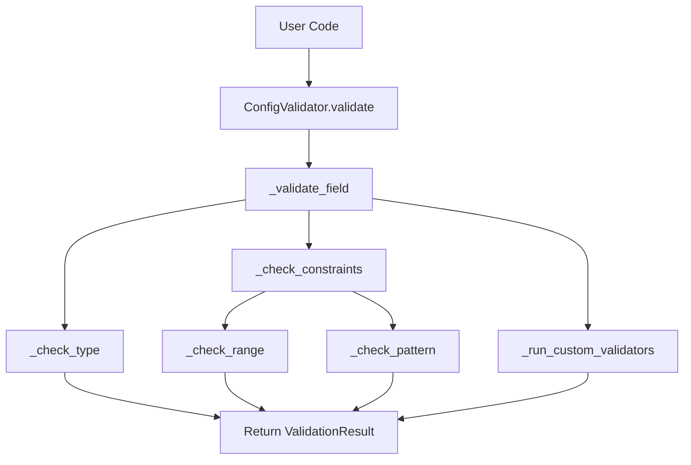
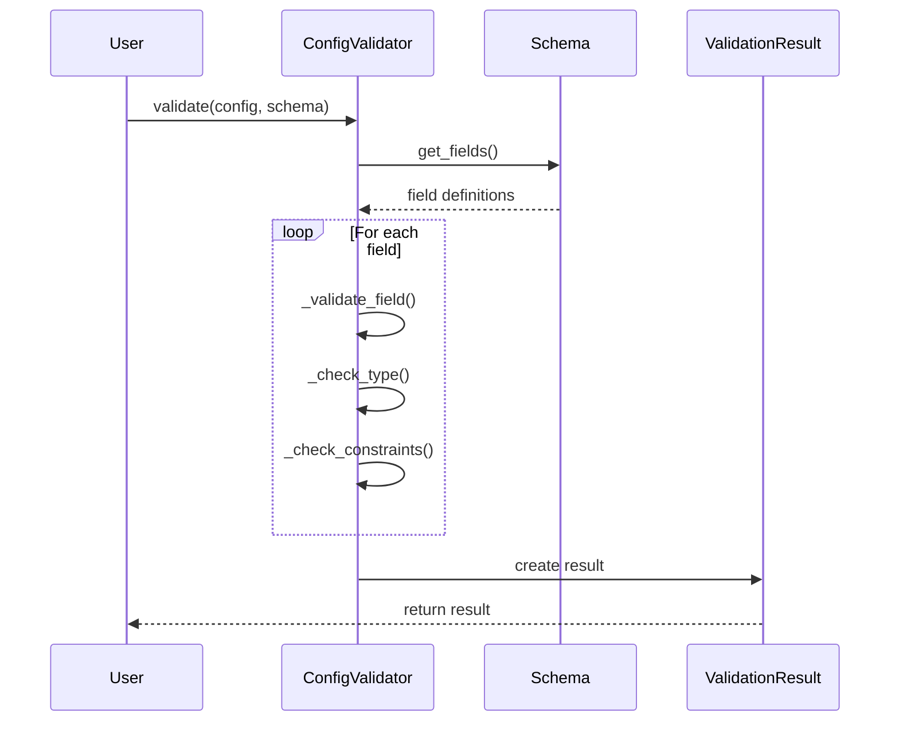
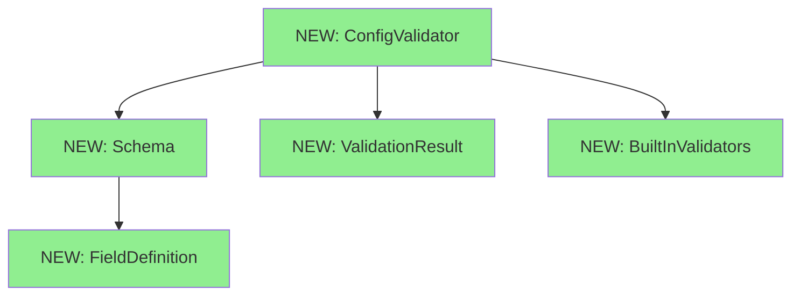

# Design Document: Configuration Validator

## Overview

### High-Level Description
This feature adds a robust configuration validation system to the belgie project. It provides a declarative way to define configuration schemas and validate configuration dictionaries against those schemas. The validator will support type checking, value constraints, required fields, and custom validation rules.

The problem this solves: Currently, there's no centralized way to validate configuration inputs, leading to potential runtime errors when invalid configurations are passed to modules.

### Goals
- Provide a simple, declarative API for defining configuration schemas
- Support common validation patterns (type checking, required fields, ranges, patterns)
- Generate clear, actionable error messages for validation failures
- Enable custom validation rules for complex business logic
- Support nested configuration structures

### Non-Goals
- This is not a general-purpose data validation library (use pydantic for that)
- Will not support async validation
- Will not provide configuration loading/saving functionality
- Will not handle environment variable substitution

## Workflows

### Call Graph


### Sequence Diagram


## Dependencies

### Dependency Graph


### Implementation Order
1. **[NEW] ValidationResult** - Implement first (no dependencies, pure data structure)
2. **[NEW] FieldDefinition** - Implement second (no dependencies, pure data structure)
3. **[NEW] BuiltInValidators** - Implement third (standalone validation functions)
4. **[NEW] Schema** - Implement fourth (depends on FieldDefinition)
5. **[NEW] ConfigValidator** - Implement last (depends on all above)

## Libraries

### New Libraries

| Library | Version | Purpose | Dependency Group | Command |
|---------|---------|---------|------------------|---------|
| No new libraries required | - | Using Python stdlib only | - | - |

### Existing Libraries

| Library | Current Version | Purpose | Dependency Group |
|---------|-----------------|---------|------------------|
| `pytest` | `>=9.0.1` | Testing framework | `dev` |
| `ruff` | `>=0.14.5` | Linting and formatting | `dev` |
| `ty` | `>=0.0.1a27` | Type checking | `dev` |

## Detailed Design

### Module Structure
```
src/belgie/
├── config_validator/
│   ├── __init__.py
│   ├── validator.py      # Main ConfigValidator class
│   ├── schema.py         # Schema and FieldDefinition classes
│   ├── result.py         # ValidationResult class
│   ├── validators.py     # Built-in validation functions
│   └── exceptions.py     # Custom exceptions
└── __test__/
    ├── test_validator.py
    ├── test_schema.py
    └── test_validators.py
```

### Code Stubs

#### File: `src/belgie/config_validator/exceptions.py`
```python
# Custom exceptions for the config validator


class ValidationError(Exception):
    """Base exception for validation errors."""

    def __init__(self: "ValidationError", message: str, field_path: str | None = None) -> None:
        """Initialize validation error with message and optional field path.

        Args:
            message: Human-readable error message
            field_path: Dot-separated path to the field that failed validation
        """
        self.field_path = field_path
        super().__init__(message)


class SchemaError(Exception):
    """Raised when schema definition is invalid."""

    pass
```

#### File: `src/belgie/config_validator/result.py`
```python
# Validation result types

from typing import TypedDict


class ValidationError(TypedDict):
    """Single validation error."""

    field: str
    message: str
    value: object


class ValidationResult:
    """Result of a validation operation."""

    def __init__(self: "ValidationResult", is_valid: bool, errors: list[ValidationError] | None = None) -> None:
        """Initialize validation result.

        Args:
            is_valid: Whether validation passed
            errors: List of validation errors (if any)
        """
        self.is_valid = is_valid
        self.errors = errors or []

    def add_error(self: "ValidationResult", field: str, message: str, value: object = None) -> None:
        """Add a validation error to the result.

        This will:
        1. Create a new ValidationError dict
        2. Append it to the errors list
        3. Set is_valid to False
        """
        # Create error dict
        # Append to errors list
        # Set is_valid = False
        pass

    def merge(self: "ValidationResult", other: "ValidationResult") -> None:
        """Merge another validation result into this one.

        This will:
        1. Combine errors from both results
        2. Update is_valid to False if either result is invalid
        """
        # Extend errors list
        # Update is_valid flag
        pass

    def __bool__(self: "ValidationResult") -> bool:
        """Allow using result in boolean context."""
        return self.is_valid

    def __repr__(self: "ValidationResult") -> str:
        """String representation of result."""
        return f"ValidationResult(is_valid={self.is_valid}, errors={len(self.errors)})"
```

#### File: `src/belgie/config_validator/validators.py`
```python
# Built-in validation functions

import re
from typing import Callable


ValidatorFunc = Callable[[object], bool]


def required() -> ValidatorFunc:
    """Create a validator that checks if value is not None.

    Returns a validator function that will be called during validation.
    """
    def validator(value: object) -> bool:
        # Check if value is not None
        pass

    return validator


def type_validator(expected_type: type) -> ValidatorFunc:
    """Create a validator that checks value type.

    This will:
    1. Check if value is an instance of expected_type
    2. Return True if type matches, False otherwise
    """
    def validator(value: object) -> bool:
        # Use isinstance to check type
        pass

    return validator


def range_validator(min_val: int | float | None = None, max_val: int | float | None = None) -> ValidatorFunc:
    """Create a validator that checks if numeric value is within range.

    This will:
    1. Check if value is numeric
    2. Verify value >= min_val (if specified)
    3. Verify value <= max_val (if specified)
    """
    def validator(value: object) -> bool:
        # Check value is numeric
        # Check min constraint
        # Check max constraint
        pass

    return validator


def pattern_validator(pattern: str) -> ValidatorFunc:
    """Create a validator that checks if string matches regex pattern.

    This will:
    1. Compile the regex pattern
    2. Check if value is a string
    3. Test if string matches pattern
    """
    compiled_pattern = re.compile(pattern)

    def validator(value: object) -> bool:
        # Check value is string
        # Test pattern match
        pass

    return validator


def length_validator(min_length: int | None = None, max_length: int | None = None) -> ValidatorFunc:
    """Create a validator that checks length of sequences.

    This will:
    1. Check if value has __len__
    2. Verify len(value) >= min_length (if specified)
    3. Verify len(value) <= max_length (if specified)
    """
    def validator(value: object) -> bool:
        # Check value has __len__
        # Check min_length constraint
        # Check max_length constraint
        pass

    return validator


def oneof_validator(allowed_values: list[object]) -> ValidatorFunc:
    """Create a validator that checks if value is in allowed set.

    This will:
    1. Convert allowed_values to a set for O(1) lookup
    2. Check if value is in the allowed set
    """
    allowed_set = set(allowed_values)

    def validator(value: object) -> bool:
        # Check if value in allowed_set
        pass

    return validator
```

#### File: `src/belgie/config_validator/schema.py`
```python
# Schema definition classes

from typing import Self

from belgie.config_validator.validators import ValidatorFunc


class FieldDefinition:
    """Definition of a single configuration field."""

    def __init__(
        self: Self,
        field_type: type,
        required: bool = False,
        default: object = None,
        validators: list[ValidatorFunc] | None = None,
        description: str = "",
    ) -> None:
        """Initialize field definition.

        Args:
            field_type: Expected Python type for this field
            required: Whether this field must be present
            default: Default value if field is missing
            validators: List of custom validator functions
            description: Human-readable description of the field
        """
        self.field_type = field_type
        self.required = required
        self.default = default
        self.validators = validators or []
        self.description = description

    def add_validator(self: Self, validator: ValidatorFunc) -> Self:
        """Add a custom validator to this field.

        Returns self for method chaining.

        This will:
        1. Append validator to validators list
        2. Return self for chaining
        """
        # Append validator
        # Return self
        pass


class Schema:
    """Configuration schema definition."""

    def __init__(self: Self, fields: dict[str, FieldDefinition] | None = None) -> None:
        """Initialize schema with field definitions.

        Args:
            fields: Dictionary mapping field names to their definitions
        """
        self.fields = fields or {}

    def add_field(self: Self, name: str, field_def: FieldDefinition) -> Self:
        """Add a field definition to the schema.

        Returns self for method chaining.

        This will:
        1. Add field to fields dict
        2. Return self for chaining
        """
        # Add to fields dict
        # Return self
        pass

    def field(
        self: Self,
        name: str,
        field_type: type,
        required: bool = False,
        default: object = None,
        validators: list[ValidatorFunc] | None = None,
        description: str = "",
    ) -> Self:
        """Fluent API for adding fields.

        Returns self for method chaining.

        This will:
        1. Create a FieldDefinition with provided parameters
        2. Add it to the schema using add_field
        3. Return self for chaining
        """
        # Create FieldDefinition
        # Call add_field
        # Return self
        pass

    def get_field(self: Self, name: str) -> FieldDefinition | None:
        """Get field definition by name.

        Returns None if field doesn't exist.
        """
        return self.fields.get(name)

    def get_required_fields(self: Self) -> list[str]:
        """Get list of all required field names.

        This will:
        1. Iterate through all fields
        2. Filter for required=True
        3. Return list of field names
        """
        # Filter fields where required=True
        # Return list of names
        pass
```

#### File: `src/belgie/config_validator/validator.py`
```python
# Main configuration validator

from typing import Any, Self

from belgie.config_validator.exceptions import SchemaError, ValidationError
from belgie.config_validator.result import ValidationResult
from belgie.config_validator.schema import FieldDefinition, Schema


class ConfigValidator:
    """Main configuration validator class."""

    def __init__(self: Self, schema: Schema) -> None:
        """Initialize validator with a schema.

        Args:
            schema: Schema defining the configuration structure

        This will:
        1. Validate the schema is well-formed
        2. Store schema reference
        """
        # Validate schema
        # Store schema
        pass

    def validate(self: Self, config: dict[str, Any]) -> ValidationResult:
        """Validate a configuration dictionary against the schema.

        Args:
            config: Configuration dictionary to validate

        Returns:
            ValidationResult indicating success or failure with error details

        This will:
        1. Create empty ValidationResult
        2. Check all required fields are present
        3. Validate each field that is present
        4. Return the validation result
        """
        # Create ValidationResult
        # Check required fields
        # Validate each present field
        # Return result
        pass

    def validate_and_raise(self: Self, config: dict[str, Any]) -> None:
        """Validate config and raise exception if invalid.

        Args:
            config: Configuration dictionary to validate

        Raises:
            ValidationError: If validation fails

        This will:
        1. Call validate()
        2. If result is invalid, raise ValidationError with details
        """
        # Call validate
        # Check result
        # Raise if invalid
        pass

    def _validate_field(
        self: Self,
        field_name: str,
        value: Any,
        field_def: FieldDefinition,
        result: ValidationResult,
    ) -> None:
        """Validate a single field value.

        This will:
        1. Check type matches field_def.field_type
        2. Run all custom validators
        3. Add errors to result if validation fails
        """
        # Check type
        # Run validators
        # Add errors if needed
        pass

    def _check_type(self: Self, value: Any, expected_type: type) -> bool:
        """Check if value matches expected type.

        This will:
        1. Use isinstance to check type
        2. Handle special cases (like int vs float)
        3. Return True if type matches
        """
        # Check type with isinstance
        # Handle edge cases
        pass

    def _run_validators(
        self: Self,
        field_name: str,
        value: Any,
        validators: list,
        result: ValidationResult,
    ) -> None:
        """Run custom validators on a field value.

        This will:
        1. Iterate through all validators
        2. Call each validator with the value
        3. Add error to result if validator returns False
        """
        # Loop through validators
        # Call each validator
        # Add errors for failures
        pass

    @staticmethod
    def _get_type_name(value_type: type) -> str:
        """Get human-readable name for a type.

        This will:
        1. Handle built-in types (str, int, etc.)
        2. Handle generic types (list, dict, etc.)
        3. Return qualified name for custom classes
        """
        # Get type name
        # Handle special cases
        pass
```

#### File: `src/belgie/config_validator/__init__.py`
```python
# Public API exports

from belgie.config_validator.exceptions import SchemaError, ValidationError
from belgie.config_validator.result import ValidationResult
from belgie.config_validator.schema import FieldDefinition, Schema
from belgie.config_validator.validator import ConfigValidator
from belgie.config_validator.validators import (
    length_validator,
    oneof_validator,
    pattern_validator,
    range_validator,
    required,
    type_validator,
)

__all__ = [
    "ConfigValidator",
    "FieldDefinition",
    "Schema",
    "SchemaError",
    "ValidationError",
    "ValidationResult",
    "length_validator",
    "oneof_validator",
    "pattern_validator",
    "range_validator",
    "required",
    "type_validator",
]
```

### Testing Strategy

#### Test Structure
- **Unit Tests**: Test each validator function, FieldDefinition, Schema, and ValidationResult independently
- **Integration Tests**: Test ConfigValidator with various schemas and configs
- **Edge Cases**:
  - Empty configurations
  - Missing required fields
  - Wrong types
  - Nested structures
  - Custom validator failures
  - Multiple simultaneous errors

#### Test File: `src/belgie/__test__/test_validators.py`
```python
# Tests for built-in validators

import pytest

from belgie.config_validator.validators import (
    length_validator,
    oneof_validator,
    pattern_validator,
    range_validator,
    required,
    type_validator,
)


def test_required_validator():
    """Test required validator passes for non-None values."""
    validator = required()
    # Test with various non-None values
    # Assert validator returns True
    pass


def test_required_validator_fails_on_none():
    """Test required validator fails for None."""
    validator = required()
    # Test with None
    # Assert validator returns False
    pass


def test_type_validator_with_correct_type():
    """Test type validator passes for correct type."""
    validator = type_validator(str)
    # Test with string value
    # Assert validator returns True
    pass


def test_type_validator_with_wrong_type():
    """Test type validator fails for wrong type."""
    validator = type_validator(str)
    # Test with non-string value
    # Assert validator returns False
    pass


def test_range_validator_within_range():
    """Test range validator passes for values in range."""
    validator = range_validator(min_val=0, max_val=100)
    # Test with value in range
    # Assert validator returns True
    pass


def test_range_validator_outside_range():
    """Test range validator fails for values outside range."""
    validator = range_validator(min_val=0, max_val=100)
    # Test with value outside range
    # Assert validator returns False
    pass


@pytest.mark.parametrize("pattern,test_value,expected", [
    (r"^\d{3}-\d{4}$", "123-4567", True),
    (r"^\d{3}-\d{4}$", "invalid", False),
    (r"^[a-z]+$", "hello", True),
    (r"^[a-z]+$", "Hello", False),
])
def test_pattern_validator(pattern: str, test_value: str, expected: bool):
    """Test pattern validator with various patterns."""
    validator = pattern_validator(pattern)
    # Test validator with test_value
    # Assert result matches expected
    pass


def test_length_validator_valid_length():
    """Test length validator passes for valid lengths."""
    validator = length_validator(min_length=2, max_length=5)
    # Test with list of valid length
    # Assert validator returns True
    pass


def test_length_validator_invalid_length():
    """Test length validator fails for invalid lengths."""
    validator = length_validator(min_length=2, max_length=5)
    # Test with list of invalid length
    # Assert validator returns False
    pass


def test_oneof_validator_valid_value():
    """Test oneof validator passes for allowed values."""
    validator = oneof_validator(["red", "green", "blue"])
    # Test with allowed value
    # Assert validator returns True
    pass


def test_oneof_validator_invalid_value():
    """Test oneof validator fails for disallowed values."""
    validator = oneof_validator(["red", "green", "blue"])
    # Test with disallowed value
    # Assert validator returns False
    pass
```

#### Test File: `src/belgie/__test__/test_schema.py`
```python
# Tests for Schema and FieldDefinition

import pytest

from belgie.config_validator.schema import FieldDefinition, Schema
from belgie.config_validator.validators import required, type_validator


def test_field_definition_creation():
    """Test creating a FieldDefinition with basic parameters."""
    # Create FieldDefinition
    # Assert properties are set correctly
    pass


def test_field_definition_add_validator():
    """Test adding validators to a field definition."""
    # Create FieldDefinition
    # Add validator
    # Assert validator is in list
    pass


def test_schema_creation():
    """Test creating an empty schema."""
    # Create Schema
    # Assert fields dict is empty
    pass


def test_schema_add_field():
    """Test adding fields to schema."""
    # Create Schema
    # Create FieldDefinition
    # Add field to schema
    # Assert field exists in schema
    pass


def test_schema_fluent_api():
    """Test schema fluent API for adding fields."""
    # Create Schema
    # Use fluent API to add multiple fields
    # Assert all fields are added
    pass


def test_schema_get_required_fields():
    """Test getting list of required fields."""
    # Create Schema with mix of required/optional fields
    # Call get_required_fields()
    # Assert only required fields are returned
    pass
```

#### Test File: `src/belgie/__test__/test_validator.py`
```python
# Tests for ConfigValidator

import pytest

from belgie.config_validator import (
    ConfigValidator,
    Schema,
    ValidationError,
    range_validator,
    required,
)


def test_validator_with_valid_config():
    """Test validation passes for valid configuration."""
    # Create schema
    # Create valid config
    # Create validator and validate
    # Assert result.is_valid is True
    pass


def test_validator_with_missing_required_field():
    """Test validation fails when required field is missing."""
    # Create schema with required field
    # Create config missing that field
    # Create validator and validate
    # Assert result.is_valid is False
    # Assert error mentions missing field
    pass


def test_validator_with_wrong_type():
    """Test validation fails when field has wrong type."""
    # Create schema expecting string
    # Create config with integer value
    # Create validator and validate
    # Assert result.is_valid is False
    # Assert error mentions type mismatch
    pass


def test_validator_with_custom_validator_failure():
    """Test validation fails when custom validator returns False."""
    # Create schema with custom validator
    # Create config that fails custom validation
    # Create validator and validate
    # Assert result.is_valid is False
    pass


def test_validator_multiple_errors():
    """Test validation accumulates multiple errors."""
    # Create schema with multiple required fields
    # Create config missing multiple fields
    # Create validator and validate
    # Assert result has multiple errors
    pass


def test_validate_and_raise():
    """Test validate_and_raise raises exception on failure."""
    # Create schema with required field
    # Create invalid config
    # Create validator
    # Assert validate_and_raise raises ValidationError
    pass


def test_validate_and_raise_no_exception_on_success():
    """Test validate_and_raise doesn't raise on valid config."""
    # Create schema
    # Create valid config
    # Create validator
    # Call validate_and_raise (should not raise)
    pass


@pytest.mark.parametrize("config,expected_valid", [
    ({"port": 8080, "host": "localhost"}, True),
    ({"port": 8080}, False),  # missing required host
    ({"port": "8080", "host": "localhost"}, False),  # wrong type for port
    ({"port": 99999, "host": "localhost"}, False),  # port out of range
])
def test_validator_parametrized(config: dict, expected_valid: bool):
    """Test validator with various config scenarios."""
    # Create schema: port (int, range 0-65535), host (str, required)
    # Create validator and validate config
    # Assert result.is_valid matches expected_valid
    pass
```

## Implementation Checklist

- [ ] Implement `ValidationResult` class (leaf node)
- [ ] Write tests for `ValidationResult`
- [ ] Implement `FieldDefinition` class (leaf node)
- [ ] Implement built-in validators in `validators.py` (leaf node)
- [ ] Write tests for built-in validators
- [ ] Implement `Schema` class (depends on FieldDefinition)
- [ ] Write tests for `Schema`
- [ ] Implement `ConfigValidator` class (depends on all above)
- [ ] Write tests for `ConfigValidator`
- [ ] Add integration tests
- [ ] Update `__init__.py` with public API
- [ ] Add type hints and run type checker (`uv run ty`)
- [ ] Run linter and fix issues (`uv run ruff check`)
- [ ] Verify all tests pass (`uv run pytest`)
- [ ] Create commit with conventional commit message
- [ ] Create PR

## Open Questions

1. Should we support nested configuration validation (configs within configs)?
2. Do we need async validator support in the future?
3. Should validators be able to modify values (coercion) or just validate?
4. Do we want to generate JSON Schema from our Schema definitions?

## Future Enhancements

- Add support for nested configuration structures
- Implement configuration coercion (automatic type conversion)
- Add JSON Schema export capability
- Create CLI tool for validating config files
- Add support for configuration documentation generation
- Implement configuration diffing (compare two configs)
