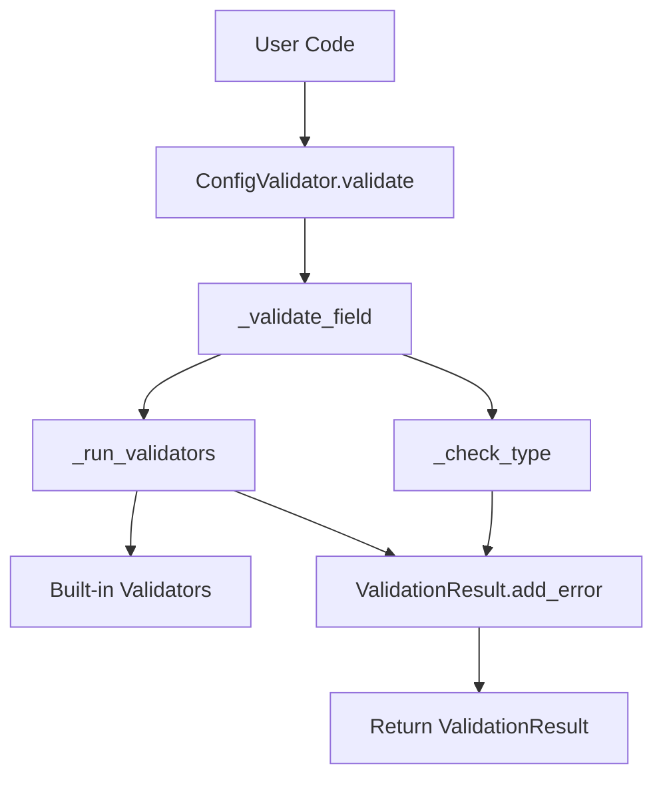
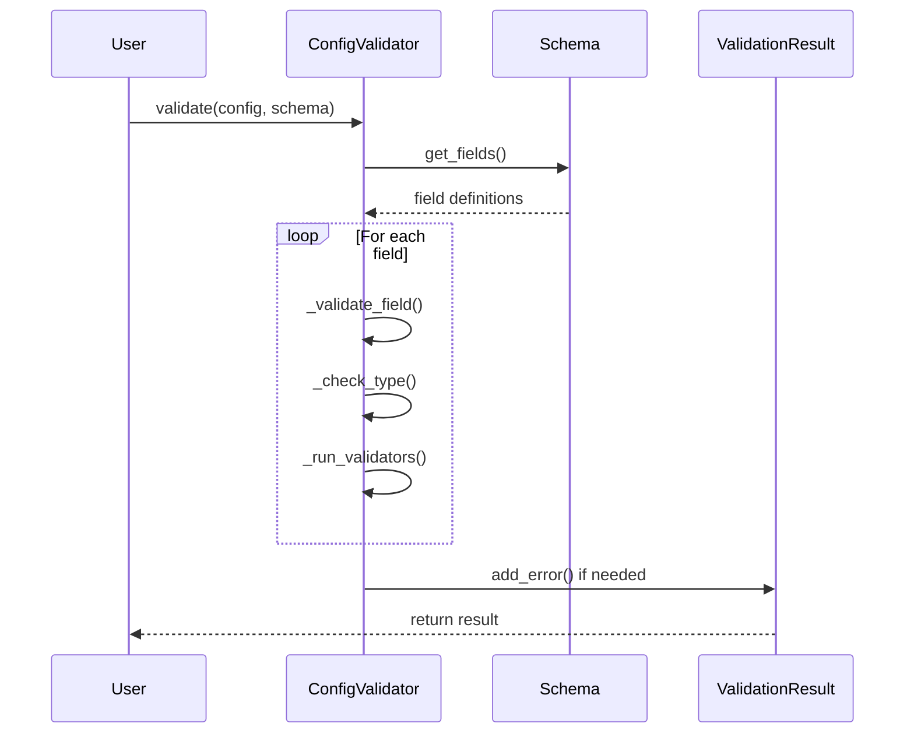
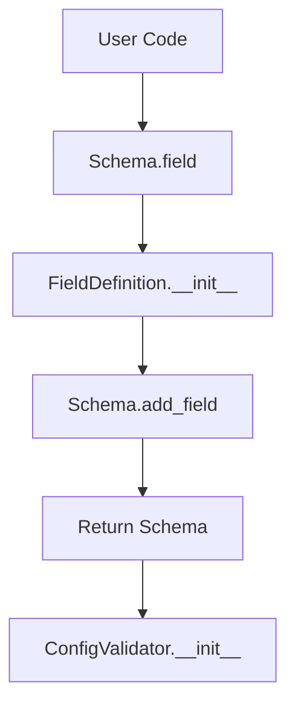
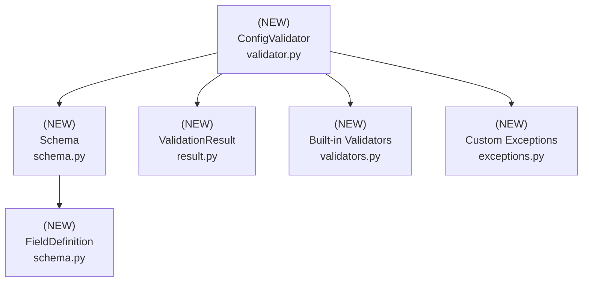

# Design Document: Configuration Validator

## Overview

### High-Level Description
This feature adds a robust configuration validation system to the belgie project. It provides a declarative way to define configuration schemas and validate configuration dictionaries against those schemas. The validator will support type checking, value constraints, required fields, and custom validation rules.

The problem this solves: Currently, there's no centralized way to validate configuration inputs, leading to potential runtime errors when invalid configurations are passed to modules.

### Goals
- Provide a simple, declarative API for defining configuration schemas
- Support common validation patterns (type checking, required fields, ranges, patterns)
- Generate clear, actionable error messages for validation failures
- Enable custom validation rules for complex business logic
- Support nested configuration structures

### Non-Goals
- This is not a general-purpose data validation library (use pydantic for that)
- Will not support async validation
- Will not provide configuration loading/saving functionality
- Will not handle environment variable substitution

## Workflows

### Workflow 1: Configuration Validation

### Description
User creates a schema, passes a config dict to validator, and receives validation results with detailed error messages if validation fails.

### Call Graph


### Sequence Diagram


### Key Components
- **ConfigValidator** (`validator.py:ConfigValidator`) - Main validation orchestrator
- **Schema** (`schema.py:Schema`) - Schema definition container
- **ValidationResult** (`result.py:ValidationResult`) - Validation result container
- **Built-in Validators** (`validators.py`) - Type checking, range validation, etc.

### Workflow 2: Schema Construction

### Description
User builds a schema using fluent API, defining fields with types and constraints.

### Call Graph


### Key Components
- **Schema** (`schema.py:Schema`) - Fluent API for schema construction
- **FieldDefinition** (`schema.py:FieldDefinition`) - Individual field configuration
- **ConfigValidator** (`validator.py:ConfigValidator`) - Consumes the built schema

## Dependencies



## Detailed Design

### Module Structure
```
src/belgie/
├── config_validator/
│   ├── validator.py         # ConfigValidator (see Workflow 1)
│   ├── schema.py            # Schema, FieldDefinition (see Workflow 2)
│   ├── result.py            # ValidationResult (see Implementation #2)
│   ├── validators.py        # Built-in validators (see Implementation #4)
│   └── exceptions.py        # Custom exceptions (see Implementation #1)
└── __test__/
    ├── test_validator.py
    ├── test_schema.py
    └── test_validators.py
```

### API Design

#### `src/belgie/config_validator/exceptions.py`
Custom exception types for validation and schema errors.

```python
class ValidationError(Exception):
    def __init__(self: "ValidationError", message: str, field_path: str | None = None) -> None: ...
    # Store field_path and call parent __init__

class SchemaError(Exception): ...
```

#### `src/belgie/config_validator/result.py`
Data structures for validation results and error tracking.

```python
from typing import TypedDict

class ValidationError(TypedDict):
    field: str
    message: str
    value: object

class ValidationResult:
    # Used in: Workflow 1 (see sequence diagram)

    def __init__(self: "ValidationResult", is_valid: bool, errors: list[ValidationError] | None = None) -> None: ...
    # Store is_valid and errors list

    def add_error(self: "ValidationResult", field: str, message: str, value: object = None) -> None: ...
    # Create error dict, append to errors, set is_valid = False
    # Called by ConfigValidator._validate_field()

    def merge(self: "ValidationResult", other: "ValidationResult") -> None: ...
    # Combine errors from both results, update is_valid

    def __bool__(self: "ValidationResult") -> bool:
        return self.is_valid

    def __repr__(self: "ValidationResult") -> str:
        return f"ValidationResult(is_valid={self.is_valid}, errors={len(self.errors)})"
```

#### `src/belgie/config_validator/validators.py`
Built-in validator functions for common validation patterns (leaf node, see [Implementation Order](#implementation-order) #4).

```python
import re
from typing import Callable

ValidatorFunc = Callable[[object], bool]

def required() -> ValidatorFunc:
    # Used in: Workflow 1 (field validation)
    def validator(value: object) -> bool: ...
    # Check if value is not None
    return validator

def type_validator(expected_type: type) -> ValidatorFunc:
    # Used in: Workflow 1 (type checking)
    def validator(value: object) -> bool: ...
    # Use isinstance to check type
    return validator

def range_validator(min_val: int | float | None = None, max_val: int | float | None = None) -> ValidatorFunc:
    # Used in: Workflow 1 (numeric constraints)
    def validator(value: object) -> bool: ...
    # Check value is numeric, verify >= min_val and <= max_val
    return validator

def pattern_validator(pattern: str) -> ValidatorFunc:
    # Used in: Workflow 1 (string pattern matching)
    compiled_pattern = re.compile(pattern)
    def validator(value: object) -> bool: ...
    # Check value is string, test pattern match
    return validator

def length_validator(min_length: int | None = None, max_length: int | None = None) -> ValidatorFunc:
    # Used in: Workflow 1 (sequence length validation)
    def validator(value: object) -> bool: ...
    # Check value has __len__, verify length constraints
    return validator

def oneof_validator(allowed_values: list[object]) -> ValidatorFunc:
    # Used in: Workflow 1 (enum-like validation)
    allowed_set = set(allowed_values)
    def validator(value: object) -> bool: ...
    # Check if value in allowed_set
    return validator
```

#### `src/belgie/config_validator/schema.py`
Schema and field definition classes for declarative configuration (see [Implementation Order](#implementation-order) #3, #5).

```python
from typing import Self

from belgie.config_validator.validators import ValidatorFunc

class FieldDefinition:
    # Used in: Workflow 2 (schema construction)

    def __init__(
        self: Self,
        field_type: type,
        required: bool = False,
        default: object = None,
        validators: list[ValidatorFunc] | None = None,
        description: str = "",
    ) -> None: ...
    # Store all field configuration

    def add_validator(self: Self, validator: ValidatorFunc) -> Self: ...
    # Append validator, return self for chaining

class Schema:
    # Used in: Workflow 1, Workflow 2 (schema definition)

    def __init__(self: Self, fields: dict[str, FieldDefinition] | None = None) -> None: ...
    # Initialize empty fields dict

    def add_field(self: Self, name: str, field_def: FieldDefinition) -> Self: ...
    # Add to fields dict, return self for chaining

    def field(
        self: Self,
        name: str,
        field_type: type,
        required: bool = False,
        default: object = None,
        validators: list[ValidatorFunc] | None = None,
        description: str = "",
    ) -> Self: ...
    # Create FieldDefinition, add to schema, return self for chaining
    # Used in: Workflow 2 (fluent API)

    def get_field(self: Self, name: str) -> FieldDefinition | None:
        return self.fields.get(name)

    def get_required_fields(self: Self) -> list[str]: ...
    # Filter fields where required=True, return list of names
    # Used in: Workflow 1 (validation)
```

#### `src/belgie/config_validator/validator.py`
Main validator class that orchestrates validation logic (see [Implementation Order](#implementation-order) #6).

```python
from typing import Any, Self

from belgie.config_validator.exceptions import SchemaError, ValidationError
from belgie.config_validator.result import ValidationResult
from belgie.config_validator.schema import FieldDefinition, Schema

class ConfigValidator:
    # Main entry point for Workflow 1

    def __init__(self: Self, schema: Schema) -> None: ...
    # Validate schema is well-formed, store schema
    # Used in: Workflow 2 (after schema construction)

    def validate(self: Self, config: dict[str, Any]) -> ValidationResult: ...
    # Create ValidationResult, check required fields, validate each present field
    # Main orchestrator for Workflow 1 (see sequence diagram)

    def validate_and_raise(self: Self, config: dict[str, Any]) -> None: ...
    # Call validate(), raise ValidationError if invalid

    def _validate_field(
        self: Self,
        field_name: str,
        value: Any,
        field_def: FieldDefinition,
        result: ValidationResult,
    ) -> None: ...
    # Check type matches, run all custom validators, add errors if needed
    # Called from validate() for each field

    def _check_type(self: Self, value: Any, expected_type: type) -> bool: ...
    # Use isinstance to check type, handle edge cases
    # Called from _validate_field()

    def _run_validators(
        self: Self,
        field_name: str,
        value: Any,
        validators: list,
        result: ValidationResult,
    ) -> None: ...
    # Loop through validators from validators.py, call each one, add errors for failures
    # Called from _validate_field()

    @staticmethod
    def _get_type_name(value_type: type) -> str: ...
    # Get human-readable type name, handle built-in and generic types
```

### Testing Strategy

Tests should be organized by module/file and cover unit tests, integration tests, and edge cases.

#### `test_validators.py`

**`validators.py` Module Tests:**
- Test `required()` validator with non-None values (should pass)
- Test `required()` validator with None (should fail)
- Test `type_validator()` with matching types (str, int, list, dict, custom classes)
- Test `type_validator()` with mismatched types
- Test `range_validator()` with values in range, at boundaries, and outside range
- Test `range_validator()` with non-numeric types (should handle gracefully)
- Test `pattern_validator()` with strings matching regex patterns
- Test `pattern_validator()` with non-matching strings
- Test `pattern_validator()` with non-string types
- Test `length_validator()` with sequences of various lengths (strings, lists, tuples)
- Test `length_validator()` with objects without `__len__` (should handle gracefully)
- Test `oneof_validator()` with values in allowed set
- Test `oneof_validator()` with values not in allowed set
- Use parametrized tests for comprehensive coverage of boundary conditions

#### `test_schema.py`

**`schema.py` Module Tests:**
- Test `FieldDefinition` creation with various configurations
- Test `FieldDefinition.add_validator()` method (chaining behavior)
- Test `Schema` initialization with empty and pre-populated fields
- Test `Schema.add_field()` with valid field definitions
- Test `Schema.field()` fluent API (chaining multiple calls)
- Test `Schema.get_field()` with existing and non-existing field names
- Test `Schema.get_required_fields()` with mixed required/optional fields
- Verify [Workflow 2](#workflow-2-schema-construction) (schema construction) works as expected

#### `test_validator.py`

**`validator.py` Module Tests:**
- Test `ConfigValidator.__init__()` with valid and invalid schemas
- Test `validate()` with fully valid configurations
- Test `validate()` with missing required fields (check error messages)
- Test `validate()` with wrong field types (check type error messages)
- Test `validate()` with custom validator failures
- Test `validate()` accumulates multiple errors correctly
- Test `validate_and_raise()` raises exception on invalid config
- Test `validate_and_raise()` succeeds silently on valid config
- Test `_check_type()` with various type combinations
- Test `_run_validators()` with multiple validators on same field
- Test `_get_type_name()` returns readable names for built-in and custom types
- Use parametrized tests for comprehensive config scenarios (valid port/host combinations, etc.)

#### `test_result.py` (if separate)

**`result.py` Module Tests:**
- Test `ValidationResult` initialization
- Test `add_error()` method (verify error dict structure, is_valid flag updates)
- Test `merge()` method combines errors from multiple results
- Test `__bool__()` operator returns correct boolean value
- Test `__repr__()` produces readable string representation

**Integration Tests:**
- Test [Workflow 1](#workflow-1-configuration-validation) end-to-end: construct schema, create validator, validate valid config, validate invalid config
- Test [Workflow 2](#workflow-2-schema-construction) end-to-end: build schema using fluent API, then use it for validation
- Test error handling across module boundaries (exceptions propagate correctly)
- Test complex schemas with multiple fields, types, and validators
- Test realistic use cases: server config (host, port, timeout), user profile (name, email, age), etc.

**Edge Cases to Cover:**
- Empty configurations vs. empty schemas
- None values in various contexts
- Extremely large configuration dictionaries
- Deeply nested data structures (if supported in future)
- Unicode and special characters in string fields
- Float vs int type checking edge cases
- Empty strings, empty lists, zero values
- Circular reference scenarios (if applicable)

## Implementation

### Implementation Order

1. **Exceptions** (`exceptions.py`) - Implement first (no dependencies)
   - Used in: [Workflow 1](#workflow-1-configuration-validation) (error handling)
   - Dependencies: None

2. **ValidationResult** (`result.py`) - Implement second (no dependencies)
   - Used in: [Workflow 1](#workflow-1-configuration-validation) (return type)
   - Dependencies: None

3. **FieldDefinition** (`schema.py:FieldDefinition`) - Implement third (no dependencies)
   - Used in: [Workflow 2](#workflow-2-schema-construction) (schema construction)
   - Dependencies: None

4. **Built-in Validators** (`validators.py`) - Implement fourth (no dependencies)
   - Used in: [Workflow 1](#workflow-1-configuration-validation) (field validation)
   - Dependencies: None

5. **Schema** (`schema.py:Schema`) - Implement fifth (depends on FieldDefinition)
   - Used in: [Workflow 1](#workflow-1-configuration-validation), [Workflow 2](#workflow-2-schema-construction)
   - Dependencies: FieldDefinition

6. **ConfigValidator** (`validator.py:ConfigValidator`) - Implement last (depends on all above)
   - Used in: [Workflow 1](#workflow-1-configuration-validation) (main orchestrator)
   - Dependencies: Schema, ValidationResult, Validators, Exceptions

### Tasks

- [ ] **Implement leaf node components** (no dependencies on new code)
  - [ ] Implement `Exceptions` in `exceptions.py` (#1)
    - [ ] Implement `ValidationError` exception
    - [ ] Implement `SchemaError` exception
  - [ ] Implement `ValidationResult` class in `result.py` (#2)
    - [ ] Implement `__init__()` method
    - [ ] Implement `add_error()` method (used in [Workflow 1](#workflow-1-configuration-validation))
    - [ ] Implement `merge()` method
    - [ ] Implement `__bool__()` and `__repr__()` methods
  - [ ] Write unit tests for `result.py`
    - [ ] Test initialization, add_error, merge, boolean conversion
  - [ ] Implement `FieldDefinition` class in `schema.py` (#3)
    - [ ] Implement `__init__()` method
    - [ ] Implement `add_validator()` method
  - [ ] Implement built-in validators in `validators.py` (#4)
    - [ ] Implement `required()` validator
    - [ ] Implement `type_validator()` validator
    - [ ] Implement `range_validator()` validator
    - [ ] Implement `pattern_validator()` validator
    - [ ] Implement `length_validator()` validator
    - [ ] Implement `oneof_validator()` validator
  - [ ] Write unit tests for `validators.py`
    - [ ] Comprehensive tests for each validator function

- [ ] **Implement components with single-level dependencies**
  - [ ] Implement `Schema` class in `schema.py` (#5)
    - [ ] Implement `__init__()` method
    - [ ] Implement `add_field()` method
    - [ ] Implement `field()` method ([Workflow 2](#workflow-2-schema-construction) fluent API)
    - [ ] Implement `get_field()` method
    - [ ] Implement `get_required_fields()` method (used in [Workflow 1](#workflow-1-configuration-validation))
  - [ ] Write unit tests for `schema.py`
    - [ ] Test FieldDefinition and Schema classes
    - [ ] Test fluent API ([Workflow 2](#workflow-2-schema-construction))

- [ ] **Implement top-level components** (depends on all above)
  - [ ] Implement `ConfigValidator` class in `validator.py` (#6)
    - [ ] Implement `__init__()` method
    - [ ] Implement `validate()` method (main [Workflow 1](#workflow-1-configuration-validation) orchestrator)
    - [ ] Implement `validate_and_raise()` method
    - [ ] Implement `_validate_field()` private method
    - [ ] Implement `_check_type()` private method
    - [ ] Implement `_run_validators()` private method
    - [ ] Implement `_get_type_name()` static method
  - [ ] Write unit tests for `validator.py`
    - [ ] Comprehensive validation tests
    - [ ] Error handling tests
    - [ ] Parametrized test scenarios

- [ ] **Integration and validation**
  - [ ] Add integration tests for [Workflow 1](#workflow-1-configuration-validation) (full validation flow)
  - [ ] Add integration tests for [Workflow 2](#workflow-2-schema-construction) (schema construction + usage)
  - [ ] Add type hints and run type checker (`uv run ty`)
  - [ ] Run linter and fix issues (`uv run ruff check`)
  - [ ] Verify all tests pass (`uv run pytest`)

- [ ] **Finalization**
  - [ ] Create commit with conventional commit message
  - [ ] Create PR

## Open Questions

1. Should we support nested configuration validation (configs within configs)?
2. Do we need async validator support in the future?
3. Should validators be able to modify values (coercion) or just validate?
4. Do we want to generate JSON Schema from our Schema definitions?

## Future Enhancements

- Add support for nested configuration structures
- Implement configuration coercion (automatic type conversion)
- Add JSON Schema export capability
- Create CLI tool for validating config files
- Add support for configuration documentation generation
- Implement configuration diffing (compare two configs)
