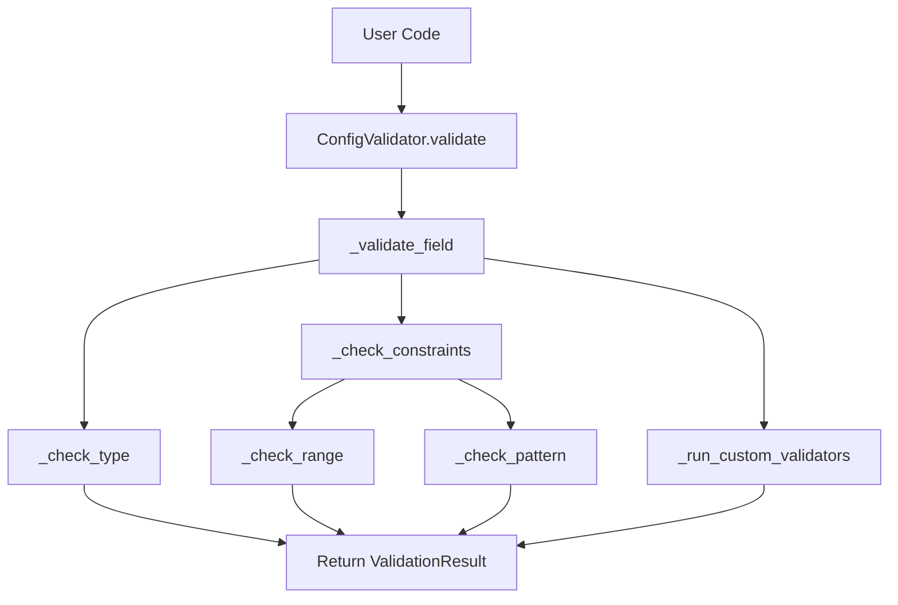
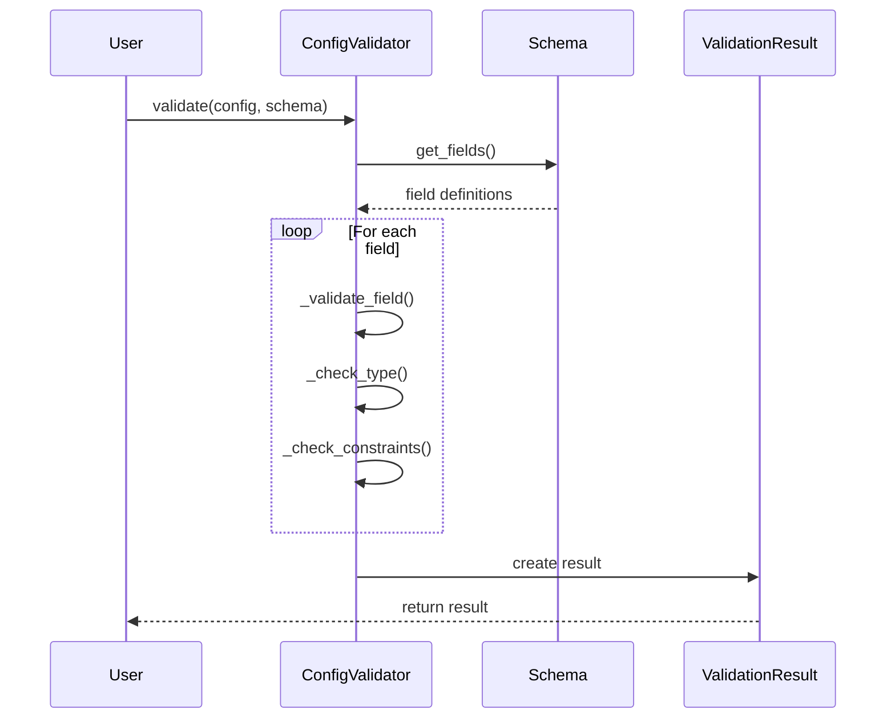
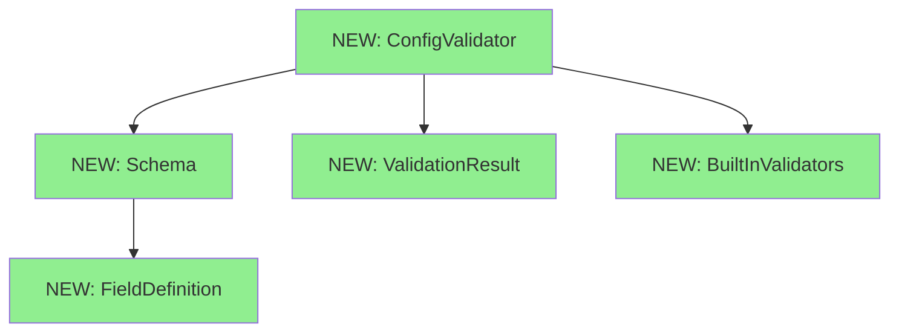

# Design Document: Configuration Validator

## Overview

### High-Level Description
This feature adds a robust configuration validation system to the belgie project. It provides a declarative way to define configuration schemas and validate configuration dictionaries against those schemas. The validator will support type checking, value constraints, required fields, and custom validation rules.

The problem this solves: Currently, there's no centralized way to validate configuration inputs, leading to potential runtime errors when invalid configurations are passed to modules.

### Goals
- Provide a simple, declarative API for defining configuration schemas
- Support common validation patterns (type checking, required fields, ranges, patterns)
- Generate clear, actionable error messages for validation failures
- Enable custom validation rules for complex business logic
- Support nested configuration structures

### Non-Goals
- This is not a general-purpose data validation library (use pydantic for that)
- Will not support async validation
- Will not provide configuration loading/saving functionality
- Will not handle environment variable substitution

## Workflows

### Call Graph


### Sequence Diagram


## Dependencies

### Dependency Graph


### Implementation Order
1. **[NEW] ValidationResult** - Implement first (no dependencies, pure data structure)
2. **[NEW] FieldDefinition** - Implement second (no dependencies, pure data structure)
3. **[NEW] BuiltInValidators** - Implement third (standalone validation functions)
4. **[NEW] Schema** - Implement fourth (depends on FieldDefinition)
5. **[NEW] ConfigValidator** - Implement last (depends on all above)

## Libraries

### New Libraries

| Library | Version | Purpose | Dependency Group | Command |
|---------|---------|---------|------------------|---------|
| No new libraries required | - | Using Python stdlib only | - | - |

### Existing Libraries

| Library | Current Version | Purpose | Dependency Group |
|---------|-----------------|---------|------------------|
| `pytest` | `>=9.0.1` | Testing framework | `dev` |
| `ruff` | `>=0.14.5` | Linting and formatting | `dev` |
| `ty` | `>=0.0.1a27` | Type checking | `dev` |

## Detailed Design

### Module Structure
```
src/belgie/
├── config_validator/
│   ├── __init__.py
│   ├── validator.py      # Main ConfigValidator class
│   ├── schema.py         # Schema and FieldDefinition classes
│   ├── result.py         # ValidationResult class
│   ├── validators.py     # Built-in validation functions
│   └── exceptions.py     # Custom exceptions
└── __test__/
    ├── test_validator.py
    ├── test_schema.py
    └── test_validators.py
```

### Code Stubs

#### File: `src/belgie/config_validator/exceptions.py`
```python
class ValidationError(Exception):

    def __init__(self: "ValidationError", message: str, field_path: str | None = None) -> None:
        self.field_path = field_path
        super().__init__(message)


class SchemaError(Exception):
    pass
```

#### File: `src/belgie/config_validator/result.py`
```python
from typing import TypedDict


class ValidationError(TypedDict):
    field: str
    message: str
    value: object


class ValidationResult:

    def __init__(self: "ValidationResult", is_valid: bool, errors: list[ValidationError] | None = None) -> None:
        self.is_valid = is_valid
        self.errors = errors or []

    def add_error(self: "ValidationResult", field: str, message: str, value: object = None) -> None:
        # Create error dict, append to errors, set is_valid = False
        pass

    def merge(self: "ValidationResult", other: "ValidationResult") -> None:
        # Combine errors from both results, update is_valid
        pass

    def __bool__(self: "ValidationResult") -> bool:
        return self.is_valid

    def __repr__(self: "ValidationResult") -> str:
        return f"ValidationResult(is_valid={self.is_valid}, errors={len(self.errors)})"
```

#### File: `src/belgie/config_validator/validators.py`
```python
import re
from typing import Callable


ValidatorFunc = Callable[[object], bool]


def required() -> ValidatorFunc:
    def validator(value: object) -> bool:
        # Check if value is not None
        pass

    return validator


def type_validator(expected_type: type) -> ValidatorFunc:
    def validator(value: object) -> bool:
        # Use isinstance to check type
        pass

    return validator


def range_validator(min_val: int | float | None = None, max_val: int | float | None = None) -> ValidatorFunc:
    def validator(value: object) -> bool:
        # Check value is numeric, verify >= min_val and <= max_val
        pass

    return validator


def pattern_validator(pattern: str) -> ValidatorFunc:
    compiled_pattern = re.compile(pattern)

    def validator(value: object) -> bool:
        # Check value is string, test pattern match
        pass

    return validator


def length_validator(min_length: int | None = None, max_length: int | None = None) -> ValidatorFunc:
    def validator(value: object) -> bool:
        # Check value has __len__, verify length constraints
        pass

    return validator


def oneof_validator(allowed_values: list[object]) -> ValidatorFunc:
    allowed_set = set(allowed_values)

    def validator(value: object) -> bool:
        # Check if value in allowed_set
        pass

    return validator
```

#### File: `src/belgie/config_validator/schema.py`
```python
from typing import Self

from belgie.config_validator.validators import ValidatorFunc


class FieldDefinition:

    def __init__(
        self: Self,
        field_type: type,
        required: bool = False,
        default: object = None,
        validators: list[ValidatorFunc] | None = None,
        description: str = "",
    ) -> None:
        self.field_type = field_type
        self.required = required
        self.default = default
        self.validators = validators or []
        self.description = description

    def add_validator(self: Self, validator: ValidatorFunc) -> Self:
        # Append validator, return self for chaining
        pass


class Schema:

    def __init__(self: Self, fields: dict[str, FieldDefinition] | None = None) -> None:
        self.fields = fields or {}

    def add_field(self: Self, name: str, field_def: FieldDefinition) -> Self:
        # Add to fields dict, return self for chaining
        pass

    def field(
        self: Self,
        name: str,
        field_type: type,
        required: bool = False,
        default: object = None,
        validators: list[ValidatorFunc] | None = None,
        description: str = "",
    ) -> Self:
        # Create FieldDefinition, add to schema, return self for chaining
        pass

    def get_field(self: Self, name: str) -> FieldDefinition | None:
        return self.fields.get(name)

    def get_required_fields(self: Self) -> list[str]:
        # Filter fields where required=True, return list of names
        pass
```

#### File: `src/belgie/config_validator/validator.py`
```python
from typing import Any, Self

from belgie.config_validator.exceptions import SchemaError, ValidationError
from belgie.config_validator.result import ValidationResult
from belgie.config_validator.schema import FieldDefinition, Schema


class ConfigValidator:

    def __init__(self: Self, schema: Schema) -> None:
        # Validate schema is well-formed, store schema
        pass

    def validate(self: Self, config: dict[str, Any]) -> ValidationResult:
        # Create ValidationResult, check required fields, validate each present field
        pass

    def validate_and_raise(self: Self, config: dict[str, Any]) -> None:
        # Call validate(), raise ValidationError if invalid
        pass

    def _validate_field(
        self: Self,
        field_name: str,
        value: Any,
        field_def: FieldDefinition,
        result: ValidationResult,
    ) -> None:
        # Check type matches, run all custom validators, add errors if needed
        pass

    def _check_type(self: Self, value: Any, expected_type: type) -> bool:
        # Use isinstance to check type, handle edge cases
        pass

    def _run_validators(
        self: Self,
        field_name: str,
        value: Any,
        validators: list,
        result: ValidationResult,
    ) -> None:
        # Loop through validators, call each one, add errors for failures
        pass

    @staticmethod
    def _get_type_name(value_type: type) -> str:
        # Get human-readable type name, handle built-in and generic types
        pass
```

#### File: `src/belgie/config_validator/__init__.py`
```python
from belgie.config_validator.exceptions import SchemaError, ValidationError
from belgie.config_validator.result import ValidationResult
from belgie.config_validator.schema import FieldDefinition, Schema
from belgie.config_validator.validator import ConfigValidator
from belgie.config_validator.validators import (
    length_validator,
    oneof_validator,
    pattern_validator,
    range_validator,
    required,
    type_validator,
)

__all__ = [
    "ConfigValidator",
    "FieldDefinition",
    "Schema",
    "SchemaError",
    "ValidationError",
    "ValidationResult",
    "length_validator",
    "oneof_validator",
    "pattern_validator",
    "range_validator",
    "required",
    "type_validator",
]
```

### Testing Strategy

#### Test Structure
- **Unit Tests**: Test each validator function, FieldDefinition, Schema, and ValidationResult independently
- **Integration Tests**: Test ConfigValidator with various schemas and configs
- **Edge Cases**:
  - Empty configurations
  - Missing required fields
  - Wrong types
  - Nested structures
  - Custom validator failures
  - Multiple simultaneous errors

#### Test File: `src/belgie/__test__/test_validators.py`
```python
import pytest

from belgie.config_validator.validators import (
    length_validator,
    oneof_validator,
    pattern_validator,
    range_validator,
    required,
    type_validator,
)


def test_required_validator():
    # Test with various non-None values, assert validator returns True
    pass


def test_required_validator_fails_on_none():
    # Test with None, assert validator returns False
    pass


def test_type_validator_with_correct_type():
    # Test with string value, assert validator returns True
    pass


def test_type_validator_with_wrong_type():
    # Test with non-string value, assert validator returns False
    pass


def test_range_validator_within_range():
    # Test with value in range, assert validator returns True
    pass


def test_range_validator_outside_range():
    # Test with value outside range, assert validator returns False
    pass


@pytest.mark.parametrize("pattern,test_value,expected", [
    (r"^\d{3}-\d{4}$", "123-4567", True),
    (r"^\d{3}-\d{4}$", "invalid", False),
    (r"^[a-z]+$", "hello", True),
    (r"^[a-z]+$", "Hello", False),
])
def test_pattern_validator(pattern: str, test_value: str, expected: bool):
    # Test validator with test_value, assert result matches expected
    pass


def test_length_validator_valid_length():
    # Test with list of valid length, assert validator returns True
    pass


def test_length_validator_invalid_length():
    # Test with list of invalid length, assert validator returns False
    pass


def test_oneof_validator_valid_value():
    # Test with allowed value, assert validator returns True
    pass


def test_oneof_validator_invalid_value():
    # Test with disallowed value, assert validator returns False
    pass
```

#### Test File: `src/belgie/__test__/test_schema.py`
```python
import pytest

from belgie.config_validator.schema import FieldDefinition, Schema
from belgie.config_validator.validators import required, type_validator


def test_field_definition_creation():
    # Create FieldDefinition, assert properties are set correctly
    pass


def test_field_definition_add_validator():
    # Create FieldDefinition, add validator, assert validator is in list
    pass


def test_schema_creation():
    # Create Schema, assert fields dict is empty
    pass


def test_schema_add_field():
    # Create Schema and FieldDefinition, add field, assert field exists
    pass


def test_schema_fluent_api():
    # Use fluent API to add multiple fields, assert all fields are added
    pass


def test_schema_get_required_fields():
    # Create Schema with mix of required/optional, assert only required returned
    pass
```

#### Test File: `src/belgie/__test__/test_validator.py`
```python
import pytest

from belgie.config_validator import (
    ConfigValidator,
    Schema,
    ValidationError,
    range_validator,
    required,
)


def test_validator_with_valid_config():
    # Create schema and valid config, validate, assert is_valid is True
    pass


def test_validator_with_missing_required_field():
    # Create schema with required field, config missing field, assert error
    pass


def test_validator_with_wrong_type():
    # Create schema expecting string, config with int, assert type error
    pass


def test_validator_with_custom_validator_failure():
    # Create schema with custom validator, config that fails, assert error
    pass


def test_validator_multiple_errors():
    # Create config missing multiple fields, assert multiple errors
    pass


def test_validate_and_raise():
    # Create invalid config, assert validate_and_raise raises ValidationError
    pass


def test_validate_and_raise_no_exception_on_success():
    # Create valid config, call validate_and_raise (should not raise)
    pass


@pytest.mark.parametrize("config,expected_valid", [
    ({"port": 8080, "host": "localhost"}, True),
    ({"port": 8080}, False),  # missing required host
    ({"port": "8080", "host": "localhost"}, False),  # wrong type for port
    ({"port": 99999, "host": "localhost"}, False),  # port out of range
])
def test_validator_parametrized(config: dict, expected_valid: bool):
    # Create schema: port (int, range 0-65535), host (str, required)
    # Validate config, assert is_valid matches expected_valid
    pass
```

## Implementation Checklist

- [ ] Implement `ValidationResult` class (leaf node)
- [ ] Write tests for `ValidationResult`
- [ ] Implement `FieldDefinition` class (leaf node)
- [ ] Implement built-in validators in `validators.py` (leaf node)
- [ ] Write tests for built-in validators
- [ ] Implement `Schema` class (depends on FieldDefinition)
- [ ] Write tests for `Schema`
- [ ] Implement `ConfigValidator` class (depends on all above)
- [ ] Write tests for `ConfigValidator`
- [ ] Add integration tests
- [ ] Update `__init__.py` with public API
- [ ] Add type hints and run type checker (`uv run ty`)
- [ ] Run linter and fix issues (`uv run ruff check`)
- [ ] Verify all tests pass (`uv run pytest`)
- [ ] Create commit with conventional commit message
- [ ] Create PR

## Open Questions

1. Should we support nested configuration validation (configs within configs)?
2. Do we need async validator support in the future?
3. Should validators be able to modify values (coercion) or just validate?
4. Do we want to generate JSON Schema from our Schema definitions?

## Future Enhancements

- Add support for nested configuration structures
- Implement configuration coercion (automatic type conversion)
- Add JSON Schema export capability
- Create CLI tool for validating config files
- Add support for configuration documentation generation
- Implement configuration diffing (compare two configs)
