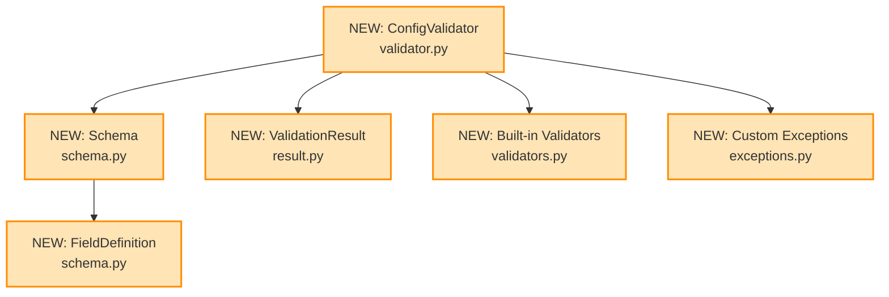

# Design Document: Configuration Validator

## Overview

### High-Level Description
This feature adds a robust configuration validation system to the belgie project. It provides a declarative way to define configuration schemas and validate configuration dictionaries against those schemas. The validator will support type checking, value constraints, required fields, and custom validation rules.

The problem this solves: Currently, there's no centralized way to validate configuration inputs, leading to potential runtime errors when invalid configurations are passed to modules.

### Goals
- Provide a simple, declarative API for defining configuration schemas
- Support common validation patterns (type checking, required fields, ranges, patterns)
- Generate clear, actionable error messages for validation failures
- Enable custom validation rules for complex business logic
- Support nested configuration structures

### Non-Goals
- This is not a general-purpose data validation library (use pydantic for that)
- Will not support async validation
- Will not provide configuration loading/saving functionality
- Will not handle environment variable substitution

## Workflows

### Workflow 1: Configuration Validation

### Description
User creates a schema, passes a config dict to validator, and receives validation results with detailed error messages if validation fails.

### Call Graph


### Sequence Diagram


### Key Components
- **ConfigValidator** (`validator.py:ConfigValidator`) - Main validation orchestrator
- **Schema** (`schema.py:Schema`) - Schema definition container
- **ValidationResult** (`result.py:ValidationResult`) - Validation result container
- **Built-in Validators** (`validators.py`) - Type checking, range validation, etc.

### Workflow 2: Schema Construction

### Description
User builds a schema using fluent API, defining fields with types and constraints.

### Call Graph


### Key Components
- **Schema** (`schema.py:Schema`) - Fluent API for schema construction
- **FieldDefinition** (`schema.py:FieldDefinition`) - Individual field configuration
- **ConfigValidator** (`validator.py:ConfigValidator`) - Consumes the built schema

## Dependencies



## Detailed Design

### Module Structure
```
src/belgie/
├── config_validator/
│   ├── validator.py         # ConfigValidator (see Workflow 1)
│   ├── schema.py            # Schema, FieldDefinition (see Workflow 2)
│   ├── result.py            # ValidationResult (see Implementation #2)
│   ├── validators.py        # Built-in validators (see Implementation #4)
│   └── exceptions.py        # Custom exceptions (see Implementation #1)
└── __test__/
    ├── test_validator.py
    ├── test_schema.py
    └── test_validators.py
```

### Code Stubs

#### `src/belgie/config_validator/exceptions.py`
```python
class ValidationError(Exception):
    def __init__(self: "ValidationError", message: str, field_path: str | None = None) -> None: ...
    # Store field_path and call parent __init__

class SchemaError(Exception): ...
```

#### `src/belgie/config_validator/result.py`
```python
from typing import TypedDict

class ValidationError(TypedDict):
    field: str
    message: str
    value: object

class ValidationResult:
    # Used in: Workflow 1 (see sequence diagram)

    def __init__(self: "ValidationResult", is_valid: bool, errors: list[ValidationError] | None = None) -> None: ...
    # Store is_valid and errors list

    def add_error(self: "ValidationResult", field: str, message: str, value: object = None) -> None: ...
    # Create error dict, append to errors, set is_valid = False
    # Called by ConfigValidator._validate_field()

    def merge(self: "ValidationResult", other: "ValidationResult") -> None: ...
    # Combine errors from both results, update is_valid

    def __bool__(self: "ValidationResult") -> bool:
        return self.is_valid

    def __repr__(self: "ValidationResult") -> str:
        return f"ValidationResult(is_valid={self.is_valid}, errors={len(self.errors)})"
```

#### `src/belgie/config_validator/validators.py`
```python
import re
from typing import Callable

ValidatorFunc = Callable[[object], bool]

def required() -> ValidatorFunc:
    # Used in: Workflow 1 (field validation)
    def validator(value: object) -> bool: ...
    # Check if value is not None
    return validator

def type_validator(expected_type: type) -> ValidatorFunc:
    # Used in: Workflow 1 (type checking)
    def validator(value: object) -> bool: ...
    # Use isinstance to check type
    return validator

def range_validator(min_val: int | float | None = None, max_val: int | float | None = None) -> ValidatorFunc:
    # Used in: Workflow 1 (numeric constraints)
    def validator(value: object) -> bool: ...
    # Check value is numeric, verify >= min_val and <= max_val
    return validator

def pattern_validator(pattern: str) -> ValidatorFunc:
    # Used in: Workflow 1 (string pattern matching)
    compiled_pattern = re.compile(pattern)
    def validator(value: object) -> bool: ...
    # Check value is string, test pattern match
    return validator

def length_validator(min_length: int | None = None, max_length: int | None = None) -> ValidatorFunc:
    # Used in: Workflow 1 (sequence length validation)
    def validator(value: object) -> bool: ...
    # Check value has __len__, verify length constraints
    return validator

def oneof_validator(allowed_values: list[object]) -> ValidatorFunc:
    # Used in: Workflow 1 (enum-like validation)
    allowed_set = set(allowed_values)
    def validator(value: object) -> bool: ...
    # Check if value in allowed_set
    return validator
```

#### `src/belgie/config_validator/schema.py`
```python
from typing import Self

from belgie.config_validator.validators import ValidatorFunc

class FieldDefinition:
    # Used in: Workflow 2 (schema construction)

    def __init__(
        self: Self,
        field_type: type,
        required: bool = False,
        default: object = None,
        validators: list[ValidatorFunc] | None = None,
        description: str = "",
    ) -> None: ...
    # Store all field configuration

    def add_validator(self: Self, validator: ValidatorFunc) -> Self: ...
    # Append validator, return self for chaining

class Schema:
    # Used in: Workflow 1, Workflow 2 (schema definition)

    def __init__(self: Self, fields: dict[str, FieldDefinition] | None = None) -> None: ...
    # Initialize empty fields dict

    def add_field(self: Self, name: str, field_def: FieldDefinition) -> Self: ...
    # Add to fields dict, return self for chaining

    def field(
        self: Self,
        name: str,
        field_type: type,
        required: bool = False,
        default: object = None,
        validators: list[ValidatorFunc] | None = None,
        description: str = "",
    ) -> Self: ...
    # Create FieldDefinition, add to schema, return self for chaining
    # Used in: Workflow 2 (fluent API)

    def get_field(self: Self, name: str) -> FieldDefinition | None:
        return self.fields.get(name)

    def get_required_fields(self: Self) -> list[str]: ...
    # Filter fields where required=True, return list of names
    # Used in: Workflow 1 (validation)
```

#### `src/belgie/config_validator/validator.py`
```python
from typing import Any, Self

from belgie.config_validator.exceptions import SchemaError, ValidationError
from belgie.config_validator.result import ValidationResult
from belgie.config_validator.schema import FieldDefinition, Schema

class ConfigValidator:
    # Main entry point for Workflow 1

    def __init__(self: Self, schema: Schema) -> None: ...
    # Validate schema is well-formed, store schema
    # Used in: Workflow 2 (after schema construction)

    def validate(self: Self, config: dict[str, Any]) -> ValidationResult: ...
    # Create ValidationResult, check required fields, validate each present field
    # Main orchestrator for Workflow 1 (see sequence diagram)

    def validate_and_raise(self: Self, config: dict[str, Any]) -> None: ...
    # Call validate(), raise ValidationError if invalid

    def _validate_field(
        self: Self,
        field_name: str,
        value: Any,
        field_def: FieldDefinition,
        result: ValidationResult,
    ) -> None: ...
    # Check type matches, run all custom validators, add errors if needed
    # Called from validate() for each field

    def _check_type(self: Self, value: Any, expected_type: type) -> bool: ...
    # Use isinstance to check type, handle edge cases
    # Called from _validate_field()

    def _run_validators(
        self: Self,
        field_name: str,
        value: Any,
        validators: list,
        result: ValidationResult,
    ) -> None: ...
    # Loop through validators from validators.py, call each one, add errors for failures
    # Called from _validate_field()

    @staticmethod
    def _get_type_name(value_type: type) -> str: ...
    # Get human-readable type name, handle built-in and generic types
```

### Testing Strategy

#### Test Structure
- **Unit Tests**: Test individual functions in isolation
  - `ValidationResult` methods (see Implementation #2)
  - `FieldDefinition` and `Schema` classes (see Implementation #3, #5)
  - Built-in validators (see Implementation #4)
  - `ConfigValidator` methods (see Implementation #6)
- **Integration Tests**: Test complete workflows
  - Workflow 1 end-to-end (schema construction + validation)
  - Workflow 2 end-to-end (fluent API usage)
- **Edge Cases**:
  - Empty configurations
  - Missing required fields
  - Wrong types
  - Nested structures
  - Custom validator failures
  - Multiple simultaneous errors

#### `src/belgie/__test__/test_validators.py`
```python
import pytest

from belgie.config_validator.validators import (
    length_validator,
    oneof_validator,
    pattern_validator,
    range_validator,
    required,
    type_validator,
)

def test_required_validator(): ...
# Test with various non-None values, assert validator returns True

def test_required_validator_fails_on_none(): ...
# Test with None, assert validator returns False

def test_type_validator_with_correct_type(): ...
# Test with string value, assert validator returns True

def test_type_validator_with_wrong_type(): ...
# Test with non-string value, assert validator returns False

def test_range_validator_within_range(): ...
# Test with value in range, assert validator returns True

def test_range_validator_outside_range(): ...
# Test with value outside range, assert validator returns False

@pytest.mark.parametrize("pattern,test_value,expected", [
    (r"^\d{3}-\d{4}$", "123-4567", True),
    (r"^\d{3}-\d{4}$", "invalid", False),
    (r"^[a-z]+$", "hello", True),
    (r"^[a-z]+$", "Hello", False),
])
def test_pattern_validator(pattern: str, test_value: str, expected: bool): ...
# Test validator with test_value, assert result matches expected

def test_length_validator_valid_length(): ...
# Test with list of valid length, assert validator returns True

def test_length_validator_invalid_length(): ...
# Test with list of invalid length, assert validator returns False

def test_oneof_validator_valid_value(): ...
# Test with allowed value, assert validator returns True

def test_oneof_validator_invalid_value(): ...
# Test with disallowed value, assert validator returns False
```

#### `src/belgie/__test__/test_schema.py`
```python
import pytest

from belgie.config_validator.schema import FieldDefinition, Schema
from belgie.config_validator.validators import required, type_validator

def test_field_definition_creation(): ...
# Create FieldDefinition, assert properties are set correctly

def test_field_definition_add_validator(): ...
# Create FieldDefinition, add validator, assert validator is in list

def test_schema_creation(): ...
# Create Schema, assert fields dict is empty

def test_schema_add_field(): ...
# Create Schema and FieldDefinition, add field, assert field exists

def test_schema_fluent_api(): ...
# Use fluent API to add multiple fields, assert all fields are added
# Tests Workflow 2

def test_schema_get_required_fields(): ...
# Create Schema with mix of required/optional, assert only required returned
```

#### `src/belgie/__test__/test_validator.py`
```python
import pytest

from belgie.config_validator import (
    ConfigValidator,
    Schema,
    ValidationError,
    range_validator,
    required,
)

def test_validator_with_valid_config(): ...
# Create schema and valid config, validate, assert is_valid is True
# Tests Workflow 1 with valid input

def test_validator_with_missing_required_field(): ...
# Create schema with required field, config missing field, assert error
# Tests Workflow 1 error path

def test_validator_with_wrong_type(): ...
# Create schema expecting string, config with int, assert type error
# Tests _check_type() method

def test_validator_with_custom_validator_failure(): ...
# Create schema with custom validator, config that fails, assert error
# Tests _run_validators() method

def test_validator_multiple_errors(): ...
# Create config missing multiple fields, assert multiple errors
# Tests ValidationResult.add_error() multiple times

def test_validate_and_raise(): ...
# Create invalid config, assert validate_and_raise raises ValidationError

def test_validate_and_raise_no_exception_on_success(): ...
# Create valid config, call validate_and_raise (should not raise)

@pytest.mark.parametrize("config,expected_valid", [
    ({"port": 8080, "host": "localhost"}, True),
    ({"port": 8080}, False),  # missing required host
    ({"port": "8080", "host": "localhost"}, False),  # wrong type for port
    ({"port": 99999, "host": "localhost"}, False),  # port out of range
])
def test_validator_parametrized(config: dict, expected_valid: bool): ...
# Create schema: port (int, range 0-65535), host (str, required)
# Validate config, assert is_valid matches expected_valid
# Comprehensive test of Workflow 1
```

## Implementation

### Implementation Order

1. **[NEW] Exceptions** (`exceptions.py`) - Implement first (no dependencies)
   - Used in: Workflow 1 (error handling)
   - Dependencies: None

2. **[NEW] ValidationResult** (`result.py`) - Implement second (no dependencies)
   - Used in: Workflow 1 (return type)
   - Dependencies: None

3. **[NEW] FieldDefinition** (`schema.py:FieldDefinition`) - Implement third (no dependencies)
   - Used in: Workflow 2 (schema construction)
   - Dependencies: None

4. **[NEW] Built-in Validators** (`validators.py`) - Implement fourth (no dependencies)
   - Used in: Workflow 1 (field validation)
   - Dependencies: None

5. **[NEW] Schema** (`schema.py:Schema`) - Implement fifth (depends on FieldDefinition)
   - Used in: Workflow 1, Workflow 2
   - Dependencies: FieldDefinition

6. **[NEW] ConfigValidator** (`validator.py:ConfigValidator`) - Implement last (depends on all above)
   - Used in: Workflow 1 (main orchestrator)
   - Dependencies: Schema, ValidationResult, Validators, Exceptions

### Tasks

- [ ] **Implement leaf node components** (no dependencies on new code)
  - [ ] Implement `Exceptions` in `exceptions.py` (#1)
    - [ ] Implement `ValidationError` exception
    - [ ] Implement `SchemaError` exception
  - [ ] Implement `ValidationResult` class in `result.py` (#2)
    - [ ] Implement `__init__()` method
    - [ ] Implement `add_error()` method (used in Workflow 1)
    - [ ] Implement `merge()` method
    - [ ] Implement `__bool__()` and `__repr__()` methods
  - [ ] Write unit tests for `ValidationResult`
    - [ ] Test adding single error
    - [ ] Test adding multiple errors
    - [ ] Test merging results
  - [ ] Implement `FieldDefinition` class in `schema.py` (#3)
    - [ ] Implement `__init__()` method
    - [ ] Implement `add_validator()` method
  - [ ] Implement built-in validators in `validators.py` (#4)
    - [ ] Implement `required()` validator
    - [ ] Implement `type_validator()` validator
    - [ ] Implement `range_validator()` validator
    - [ ] Implement `pattern_validator()` validator
    - [ ] Implement `length_validator()` validator
    - [ ] Implement `oneof_validator()` validator
  - [ ] Write unit tests for built-in validators
    - [ ] Test `required()` with valid/invalid inputs
    - [ ] Test `type_validator()` with correct/wrong types
    - [ ] Test `range_validator()` with in-range/out-of-range values
    - [ ] Test `pattern_validator()` with matching/non-matching patterns
    - [ ] Test `length_validator()` with valid/invalid lengths
    - [ ] Test `oneof_validator()` with allowed/disallowed values

- [ ] **Implement components with single-level dependencies**
  - [ ] Implement `Schema` class in `schema.py` (#5)
    - [ ] Implement `__init__()` method
    - [ ] Implement `add_field()` method
    - [ ] Implement `field()` method (Workflow 2 fluent API)
    - [ ] Implement `get_field()` method
    - [ ] Implement `get_required_fields()` method (used in Workflow 1)
  - [ ] Write unit tests for `Schema` and `FieldDefinition`
    - [ ] Test `FieldDefinition` creation
    - [ ] Test `FieldDefinition.add_validator()`
    - [ ] Test `Schema` creation
    - [ ] Test `Schema.add_field()`
    - [ ] Test `Schema.field()` fluent API (Workflow 2)
    - [ ] Test `Schema.get_required_fields()`

- [ ] **Implement top-level components** (depends on all above)
  - [ ] Implement `ConfigValidator` class in `validator.py` (#6)
    - [ ] Implement `__init__()` method
    - [ ] Implement `validate()` method (main Workflow 1 orchestrator)
    - [ ] Implement `validate_and_raise()` method
    - [ ] Implement `_validate_field()` private method
    - [ ] Implement `_check_type()` private method
    - [ ] Implement `_run_validators()` private method
    - [ ] Implement `_get_type_name()` static method
  - [ ] Write unit tests for `ConfigValidator`
    - [ ] Test validator with valid config (Workflow 1 success path)
    - [ ] Test validator with missing required field (Workflow 1 error path)
    - [ ] Test validator with wrong type
    - [ ] Test validator with custom validator failure
    - [ ] Test validator with multiple errors
    - [ ] Test `validate_and_raise()` exception behavior
    - [ ] Test parametrized scenarios

- [ ] **Integration and validation**
  - [ ] Add integration test for Workflow 1 (full validation flow)
  - [ ] Add integration test for Workflow 2 (schema construction + usage)
  - [ ] Add type hints and run type checker (`uv run ty`)
  - [ ] Run linter and fix issues (`uv run ruff check`)
  - [ ] Verify all tests pass (`uv run pytest`)

- [ ] **Finalization**
  - [ ] Create commit with conventional commit message
  - [ ] Create PR

## Open Questions

1. Should we support nested configuration validation (configs within configs)?
2. Do we need async validator support in the future?
3. Should validators be able to modify values (coercion) or just validate?
4. Do we want to generate JSON Schema from our Schema definitions?

## Future Enhancements

- Add support for nested configuration structures
- Implement configuration coercion (automatic type conversion)
- Add JSON Schema export capability
- Create CLI tool for validating config files
- Add support for configuration documentation generation
- Implement configuration diffing (compare two configs)
