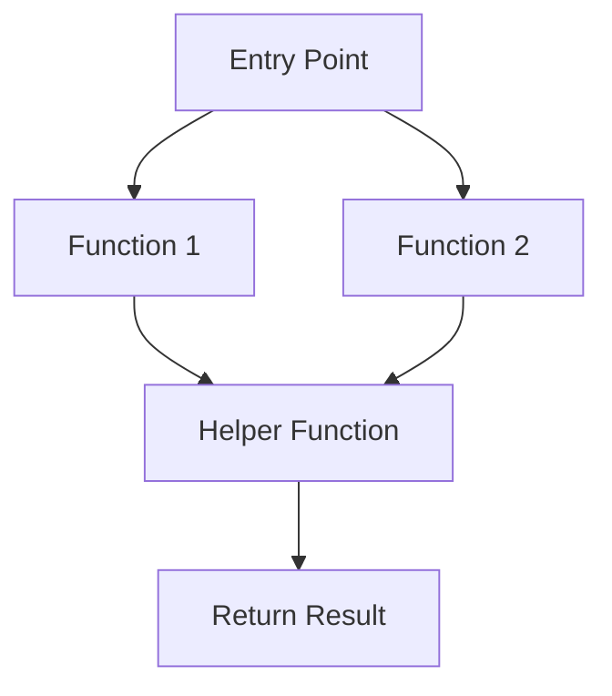
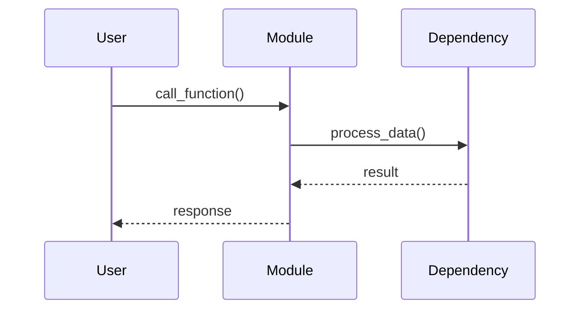
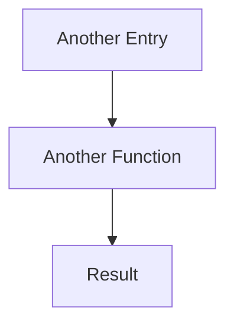
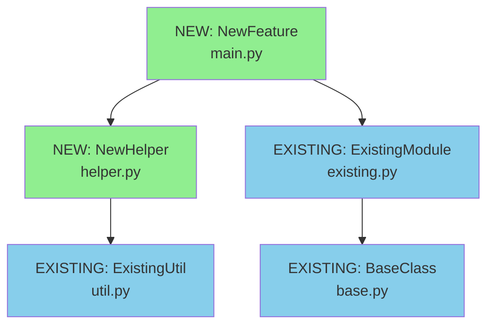

<!--
When creating a new design document:
- Increment the number from the previous design (e.g., 001, 002, 003)
- Use all lowercase with dashes to separate words
- Use a short description of the feature/project
- Example: 001-config-validator.md, 002-api-client.md

Note: Sections that are not relevant (e.g., Libraries when only using stdlib) can be omitted
-->

# Design Document: [Feature/Module Name]

## Overview

### High-Level Description
<!-- Provide a clear, concise description of what this feature/module does and why it's needed -->
[Describe the feature, its purpose, and the problem it solves]

### Goals
<!-- What are the primary objectives of this feature? -->
- [Goal 1]
- [Goal 2]
- [Goal 3]

### Non-Goals
<!-- What is explicitly out of scope? -->
- [Non-goal 1]
- [Non-goal 2]

## Workflows

<!-- Describe each major workflow separately. Include multiple workflows as needed. -->
<!-- Each workflow should have a clear title describing what it does -->

### Workflow 1: [Workflow Name]
<!-- Example: "User Configuration Validation" or "Data Processing Pipeline" -->

**Description**: [Brief description of what this workflow accomplishes]

**Call Graph**:


**Sequence Diagram** (Optional):


**Key Components**:
- **Entry Point** (`main.py:EntryClass`) - [Brief description]
- **Function 1** (`helper.py:function1`) - [Brief description]
- **Helper Function** (`helper.py:helper_func`) - [Brief description]

### Workflow 2: [Another Workflow Name]
<!-- Add additional workflows as needed -->

**Description**: [Brief description of what this workflow accomplishes]

**Call Graph**:


**Key Components**:
- **Another Entry** (`main.py:AnotherClass`) - [Brief description]
- **Another Function** (`helper.py:another_func`) - [Brief description]

## Dependencies

### Dependency Graph
<!-- Show both existing and new dependencies. Mark nodes as [EXISTING] or [NEW] -->
<!-- The graph should be structured so "leaf" nodes (no dependencies) are clear -->
<!-- Reference the file paths where these components will be implemented -->



### Implementation Order
<!-- Based on the dependency graph, list the order to implement (leaf nodes first) -->
<!-- Include references to where these are used in workflows -->

1. **[EXISTING] BaseClass** (`base.py`) - Already exists, no implementation needed
2. **[EXISTING] ExistingUtil** (`util.py`) - Already exists, no implementation needed
3. **[NEW] NewHelper** (`helper.py`) - Implement first (leaf node, only depends on existing code)
   - Used in: Workflow 1, Workflow 2
   - Dependencies: ExistingUtil
4. **[EXISTING] ExistingModule** (`existing.py`) - Already exists, no implementation needed
5. **[NEW] NewFeature** (`main.py`) - Implement last (depends on NewHelper and ExistingModule)
   - Used in: Workflow 1
   - Dependencies: NewHelper, ExistingModule

## Detailed Design

### Module Structure
<!-- Show the file/module structure -->
<!-- Cross-reference with dependency graph and workflows -->

```
src/belgie/
├── feature_name/
│   ├── __init__.py          # Public API exports
│   ├── main.py              # NewFeature (see Workflow 1)
│   ├── helper.py            # NewHelper (see Implementation Order #3)
│   └── types.py             # Type definitions
└── __test__/
    └── test_feature_name.py # Tests for all components
```

### Code Stubs

#### File: `src/belgie/feature_name/types.py`
<!-- Type definitions used across the module -->
```python
from typing import TypedDict

class ConfigType(TypedDict):
    option1: str
    option2: int

class ResultType(TypedDict):
    status: str
    data: dict[str, str]
```

#### File: `src/belgie/feature_name/helper.py`
<!-- NewHelper from dependency graph - implements leaf node functionality -->
```python
from belgie.existing_module import existing_function

def process_input(data: str) -> dict[str, str]:
    # Validate input, transform to required format, return processed data
    # Used in: Workflow 1 (see call graph)
    pass

def validate_config(config: dict[str, str]) -> bool:
    # Check required keys, validate types and ranges
    # Used in: Workflow 1, Workflow 2
    pass
```

#### File: `src/belgie/feature_name/main.py`
<!-- NewFeature from dependency graph - depends on NewHelper -->
```python
from typing import Self

from belgie.existing_module import BaseClass
from belgie.feature_name.helper import process_input, validate_config
from belgie.feature_name.types import ConfigType, ResultType

class NewFeature(BaseClass):
    # Entry point for Workflow 1 (see sequence diagram)

    def __init__(self: Self, config: ConfigType) -> None:
        # Validate config using validate_config(), initialize parent class, set up internal state
        pass

    def execute(self: Self, input_data: str) -> ResultType:
        # Main workflow execution - calls process_input() from helper.py
        # Process input using helper, execute core logic, return result
        pass

    def _internal_helper(self: Self, data: dict[str, str]) -> str:
        # Transform data, apply business rules, return formatted result
        pass
```

#### File: `src/belgie/feature_name/__init__.py`
```python
from belgie.feature_name.main import NewFeature
from belgie.feature_name.types import ConfigType, ResultType

__all__ = ["NewFeature", "ConfigType", "ResultType"]
```

### Testing Strategy
<!-- Describe how the feature will be tested -->
<!-- Reference components from dependency graph -->

#### Test Structure
- **Unit Tests**: Test individual functions in isolation
  - `NewHelper` functions (`process_input`, `validate_config`)
  - `NewFeature` methods
- **Integration Tests**: Test complete workflows
  - Workflow 1 end-to-end
  - Workflow 2 end-to-end
- **Edge Cases**: [List specific edge cases to test]

#### Test File: `src/belgie/__test__/test_feature_name.py`
```python
import pytest

from belgie.feature_name import NewFeature, ConfigType

def test_feature_initialization():
    # Create valid config, initialize feature, assert state is correct
    pass

def test_feature_execution():
    # Initialize feature, call execute with test data, assert result matches expected
    pass

def test_invalid_config():
    # Create invalid config, attempt to initialize, assert appropriate exception
    pass

@pytest.mark.parametrize("input_data,expected", [
    ("test1", {"status": "success"}),
    ("test2", {"status": "success"}),
])
def test_parametrized_execution(input_data: str, expected: dict[str, str]):
    # Initialize feature, execute with input_data, assert result matches expected
    pass
```

## Tasks

<!-- Track implementation progress -->
<!-- Tasks are indented to show dependencies - subtasks depend on their parent task -->
<!-- Follow the implementation order from the dependency graph -->

- [ ] **Implement leaf node components** (no dependencies on new code)
  - [ ] Implement `NewHelper` class/functions in `helper.py` (see Implementation Order #3)
    - [ ] Implement `process_input()` function
    - [ ] Implement `validate_config()` function
  - [ ] Write unit tests for `NewHelper`
    - [ ] Test `process_input()` with valid inputs
    - [ ] Test `process_input()` with invalid inputs
    - [ ] Test `validate_config()` edge cases

- [ ] **Implement dependent components** (depends on leaf nodes)
  - [ ] Implement `NewFeature` class in `main.py` (see Implementation Order #5)
    - [ ] Implement `__init__()` method
    - [ ] Implement `execute()` method
    - [ ] Implement `_internal_helper()` method
  - [ ] Write unit tests for `NewFeature`
    - [ ] Test initialization with valid config
    - [ ] Test initialization with invalid config
    - [ ] Test `execute()` method

- [ ] **Integration and validation**
  - [ ] Add integration tests for Workflow 1
  - [ ] Add integration tests for Workflow 2
  - [ ] Update `__init__.py` with public API
  - [ ] Add type hints and run type checker (`uv run ty`)
  - [ ] Run linter and fix issues (`uv run ruff check`)
  - [ ] Verify all tests pass (`uv run pytest`)

- [ ] **Finalization**
  - [ ] Create commit with conventional commit message
  - [ ] Create PR

## Open Questions

<!-- List any unresolved questions or decisions needed -->
1. [Question 1]?
2. [Question 2]?

## Future Enhancements

<!-- Features or improvements to consider after initial implementation -->
- [Enhancement 1]
- [Enhancement 2]

## Libraries

<!-- This section can be omitted if only using stdlib or no new libraries are needed -->

### New Libraries
<!-- List new libraries to be added and their dependency groups -->

| Library | Version | Purpose | Dependency Group | Command |
|---------|---------|---------|------------------|---------|
| `library-name` | `>=1.0.0` | [Purpose] | `dev` / `optional-group` / core | `uv add library-name` or `uv add --dev library-name` |

### Existing Libraries
<!-- List existing libraries that will be leveraged -->

| Library | Current Version | Purpose | Dependency Group |
|---------|-----------------|---------|------------------|
| `existing-lib` | `>=1.0.0` | [Purpose] | `dev` / core |
