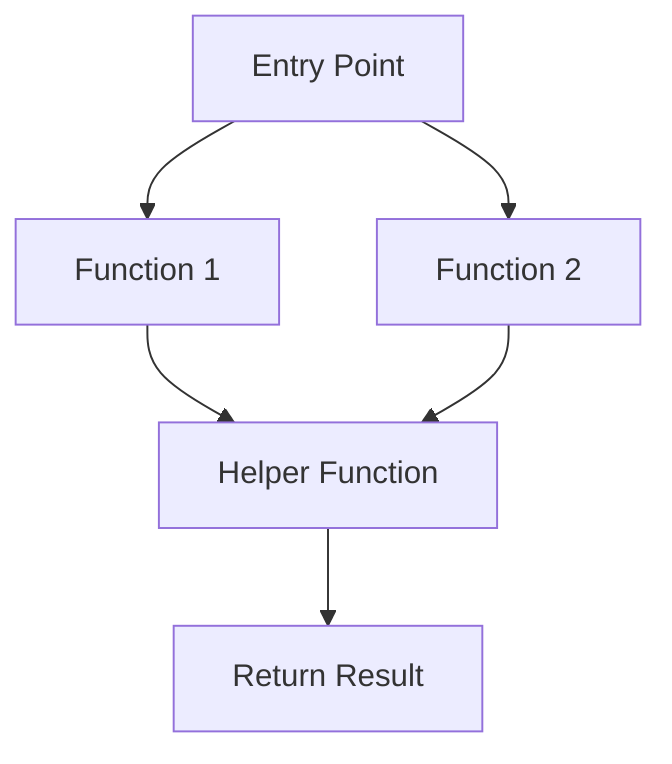
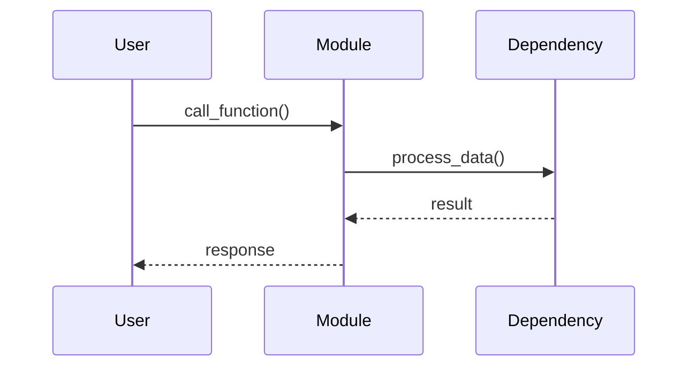
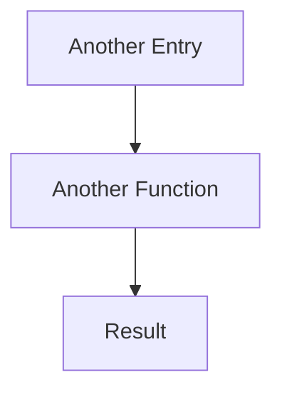
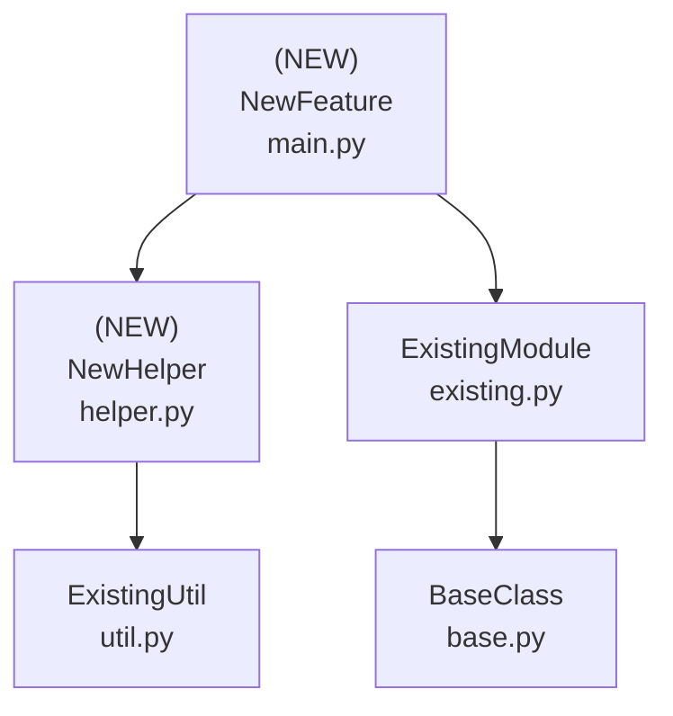

<!--
When creating a new design document:
- Increment the number from the previous design (e.g., 001, 002, 003)
- Use all lowercase with dashes to separate words
- Use a short description of the feature/project
- Example: 001-config-validator.md, 002-api-client.md

Note: Sections that are not relevant (e.g., Libraries when only using stdlib) can be omitted
-->

# Design Document: [Feature/Module Name]

## Overview

### High-Level Description
<!-- Provide a clear, concise description of what this feature/module does and why it's needed -->
[Describe the feature, its purpose, and the problem it solves]

### Goals
<!-- What are the primary objectives of this feature? -->
- [Goal 1]
- [Goal 2]
- [Goal 3]

### Non-Goals
<!-- What is explicitly out of scope? -->
- [Non-goal 1]
- [Non-goal 2]

## Workflows

<!-- Describe each major workflow separately. Include multiple workflows as needed. -->

### Workflow 1: [Workflow Name]
<!-- Example: "User Configuration Validation" or "Data Processing Pipeline" -->

### Description
[Brief description of what this workflow accomplishes]

### Call Graph


### Sequence Diagram
<!-- Optional, include if the workflow involves complex interactions -->


### Key Components
- **Entry Point** (`main.py:EntryClass`) - [Brief description]
- **Function 1** (`helper.py:function1`) - [Brief description]
- **Helper Function** (`helper.py:helper_func`) - [Brief description]

### Workflow 2: [Another Workflow Name]
<!-- Add additional workflows as needed -->

### Description
[Brief description of what this workflow accomplishes]

### Call Graph


### Key Components
- **Another Entry** (`main.py:AnotherClass`) - [Brief description]
- **Another Function** (`helper.py:another_func`) - [Brief description]

## Dependencies



## Detailed Design

### Module Structure
<!-- Show the file/module structure -->
<!-- Cross-reference with dependency graph and workflows -->

```
src/belgie/
├── feature_name/
│   ├── main.py              # NewFeature (see Workflow 1)
│   ├── helper.py            # NewHelper (see Implementation Order #3)
│   └── types.py             # Type definitions
└── __test__/
    └── test_feature_name.py # Tests for all components
```

### API Design

<!-- Define the interfaces, classes, and functions that will be implemented -->
<!-- Each subsection should have a brief description explaining its purpose -->

#### `src/belgie/feature_name/types.py`
Type definitions and data structures used across the module.

```python
from typing import TypedDict

class ConfigType(TypedDict):
    option1: str
    option2: int

class ResultType(TypedDict):
    status: str
    data: dict[str, str]
```

#### `src/belgie/feature_name/helper.py`
Helper functions for data processing and validation (leaf node, see [Implementation Order](#implementation-order) #3).

```python
from belgie.existing_module import existing_function

def process_input(data: str) -> dict[str, str]: ...
# Validate input, transform to required format, return processed data
# Used in: Workflow 1 (see call graph)

def validate_config(config: dict[str, str]) -> bool: ...
# Check required keys, validate types and ranges
# Used in: Workflow 1, Workflow 2
```

#### `src/belgie/feature_name/main.py`
Main entry point implementing the core feature logic (see [Implementation Order](#implementation-order) #5).

```python
from typing import Self

from belgie.existing_module import BaseClass
from belgie.feature_name.helper import process_input, validate_config
from belgie.feature_name.types import ConfigType, ResultType

class NewFeature(BaseClass):
    # Entry point for Workflow 1 (see sequence diagram)

    def __init__(self: Self, config: ConfigType) -> None: ...
    # Validate config using validate_config(), initialize parent class, set up internal state

    def execute(self: Self, input_data: str) -> ResultType: ...
    # Main workflow execution - calls process_input() from helper.py
    # Process input using helper, execute core logic, return result

    def _internal_helper(self: Self, data: dict[str, str]) -> str: ...
    # Transform data, apply business rules, return formatted result
```

### Testing Strategy

Tests should be organized by module/file and cover unit tests, integration tests, and edge cases.

#### `test_feature_name.py` (or split into multiple test files)

**`helper.py` Tests:**
- Test `process_input()` with valid inputs (various data formats)
- Test `process_input()` with invalid inputs (malformed data, empty strings, etc.)
- Test `validate_config()` with valid configurations
- Test `validate_config()` with missing required keys
- Test `validate_config()` with invalid value types
- Test `validate_config()` with out-of-range values

**`main.py` Tests:**
- Test `NewFeature.__init__()` with valid configuration
- Test `NewFeature.__init__()` with invalid configuration (should raise appropriate exception)
- Test `NewFeature.execute()` with valid input data
- Test `NewFeature.execute()` with invalid input data
- Test `NewFeature._internal_helper()` in isolation if needed
- Test edge cases: empty data, boundary values, etc.

**Integration Tests:**
- Test [Workflow 1](#workflow-1-workflow-name) end-to-end: create instance, execute with various inputs, verify outputs
- Test [Workflow 2](#workflow-2-another-workflow-name) end-to-end: test the complete fluent API flow
- Test error handling across module boundaries
- Test interaction with existing modules (ExistingModule, ExistingUtil)

**Edge Cases to Cover:**
- [List specific edge cases relevant to this feature]
- [Example: Empty configurations, None values, extremely large inputs]
- [Example: Concurrent access patterns if applicable]

## Implementation

### Implementation Order
<!-- Based on the dependency graph, list the order to implement (leaf nodes first) -->

1. **BaseClass** (`base.py`) - Already exists, no implementation needed
2. **ExistingUtil** (`util.py`) - Already exists, no implementation needed
3. **NewHelper** (`helper.py`) - Implement first (leaf node, only depends on existing code)
   - Used in: [Workflow 1](#workflow-1-workflow-name), [Workflow 2](#workflow-2-another-workflow-name)
   - Dependencies: ExistingUtil
4. **ExistingModule** (`existing.py`) - Already exists, no implementation needed
5. **NewFeature** (`main.py`) - Implement last (depends on NewHelper and ExistingModule)
   - Used in: [Workflow 1](#workflow-1-workflow-name)
   - Dependencies: NewHelper, ExistingModule

### Tasks
<!-- Track implementation progress -->
<!-- Tasks are indented to show dependencies - subtasks depend on their parent task -->

- [ ] **Implement leaf node components** (no dependencies on new code)
  - [ ] Implement `NewHelper` functions in `helper.py` (#3)
    - [ ] Implement `process_input()` function
    - [ ] Implement `validate_config()` function
  - [ ] Write unit tests for `helper.py`
    - [ ] Test `process_input()` with valid inputs
    - [ ] Test `process_input()` with invalid inputs
    - [ ] Test `validate_config()` edge cases

- [ ] **Implement dependent components** (depends on leaf nodes)
  - [ ] Implement `NewFeature` class in `main.py` (#5)
    - [ ] Implement `__init__()` method
    - [ ] Implement `execute()` method
    - [ ] Implement `_internal_helper()` method
  - [ ] Write unit tests for `main.py`
    - [ ] Test initialization with valid config
    - [ ] Test initialization with invalid config
    - [ ] Test `execute()` method

- [ ] **Integration and validation**
  - [ ] Add integration tests for [Workflow 1](#workflow-1-workflow-name)
  - [ ] Add integration tests for [Workflow 2](#workflow-2-another-workflow-name)
  - [ ] Add type hints and run type checker (`uv run ty`)
  - [ ] Run linter and fix issues (`uv run ruff check`)
  - [ ] Verify all tests pass (`uv run pytest`)

- [ ] **Finalization**
  - [ ] Create commit with conventional commit message
  - [ ] Create PR

## Open Questions

<!-- List any unresolved questions or decisions needed -->
1. [Question 1]?
2. [Question 2]?

## Future Enhancements

<!-- Features or improvements to consider after initial implementation -->
- [Enhancement 1]
- [Enhancement 2]

## Libraries

<!-- This section can be omitted if only using stdlib or no new libraries are needed -->

### New Libraries

| Library | Version | Purpose | Dependency Group | Command |
|---------|---------|---------|------------------|---------|
| `library-name` | `>=1.0.0` | [Purpose] | `dev` / `optional-group` / core | `uv add library-name` or `uv add --dev library-name` |

### Existing Libraries

| Library | Current Version | Purpose | Dependency Group |
|---------|-----------------|---------|------------------|
| `existing-lib` | `>=1.0.0` | [Purpose] | `dev` / core |
