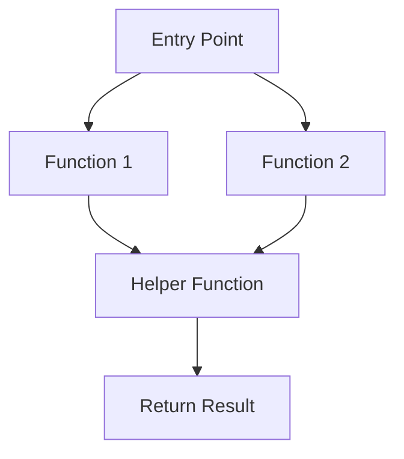
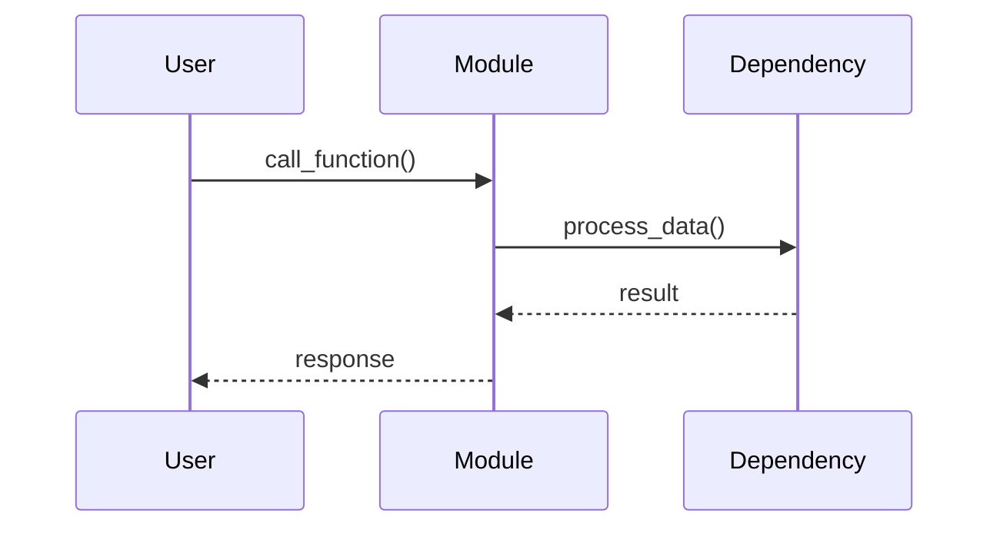
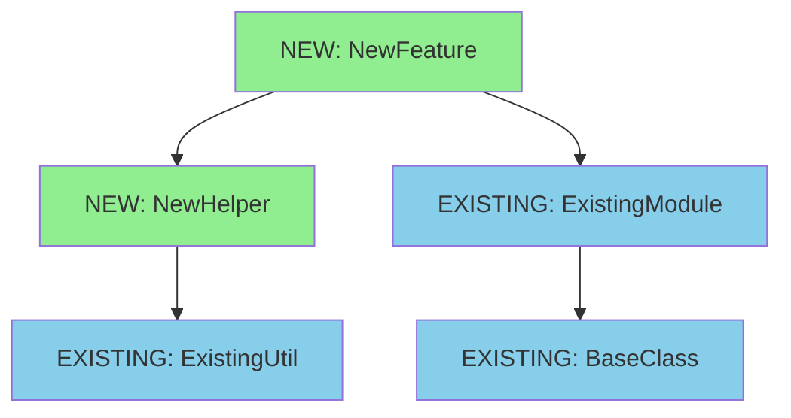

<!--
When creating a new design document:
- Increment the number from the previous design (e.g., 001, 002, 003)
- Use all lowercase with dashes to separate words
- Use a short description of the feature/project
- Example: 001-config-validator.md, 002-api-client.md

Note: Sections that are not relevant (e.g., Libraries when only using stdlib) can be omitted
-->

# Design Document: [Feature/Module Name]

## Overview

### High-Level Description
<!-- Provide a clear, concise description of what this feature/module does and why it's needed -->
[Describe the feature, its purpose, and the problem it solves]

### Goals
<!-- What are the primary objectives of this feature? -->
- [Goal 1]
- [Goal 2]
- [Goal 3]

### Non-Goals
<!-- What is explicitly out of scope? -->
- [Non-goal 1]
- [Non-goal 2]

## Workflows

### Call Graph
<!-- Use mermaid to show the flow of function calls and control flow -->


### Sequence Diagram (Optional)
<!-- If the feature involves complex interactions, add a sequence diagram -->


## Dependencies

### Dependency Graph
<!-- Show both existing and new dependencies. Mark nodes as [EXISTING] or [NEW] -->
<!-- The graph should be structured so "leaf" nodes (no dependencies) are clear -->


### Implementation Order
<!-- Based on the dependency graph, list the order to implement (leaf nodes first) -->
1. **[EXISTING] BaseClass** - Already exists, no implementation needed
2. **[EXISTING] ExistingUtil** - Already exists, no implementation needed
3. **[NEW] NewHelper** - Implement first (leaf node, only depends on existing code)
4. **[EXISTING] ExistingModule** - Already exists, no implementation needed
5. **[NEW] NewFeature** - Implement last (depends on NewHelper and ExistingModule)

## Detailed Design

### Module Structure
<!-- Show the file/module structure -->
```
src/belgie/
├── feature_name/
│   ├── __init__.py
│   ├── main.py          # Entry point and main logic
│   ├── helper.py        # Helper functions
│   └── types.py         # Type definitions
└── __test__/
    └── test_feature_name.py
```

### Code Stubs

#### File: `src/belgie/feature_name/types.py`
```python
from typing import TypedDict

class ConfigType(TypedDict):
    option1: str
    option2: int

class ResultType(TypedDict):
    status: str
    data: dict[str, str]
```

#### File: `src/belgie/feature_name/helper.py`
```python
from belgie.existing_module import existing_function

def process_input(data: str) -> dict[str, str]:
    # Validate input, transform to required format, return processed data
    pass

def validate_config(config: dict[str, str]) -> bool:
    # Check required keys, validate types and ranges
    pass
```

#### File: `src/belgie/feature_name/main.py`
```python
from typing import Self

from belgie.existing_module import BaseClass
from belgie.feature_name.helper import process_input, validate_config
from belgie.feature_name.types import ConfigType, ResultType

class NewFeature(BaseClass):

    def __init__(self: Self, config: ConfigType) -> None:
        # Validate config, initialize parent class, set up internal state
        pass

    def execute(self: Self, input_data: str) -> ResultType:
        # Process input using helper, execute core logic, return result
        pass

    def _internal_helper(self: Self, data: dict[str, str]) -> str:
        # Transform data, apply business rules, return formatted result
        pass
```

#### File: `src/belgie/feature_name/__init__.py`
```python
from belgie.feature_name.main import NewFeature
from belgie.feature_name.types import ConfigType, ResultType

__all__ = ["NewFeature", "ConfigType", "ResultType"]
```

### Testing Strategy
<!-- Describe how the feature will be tested -->

#### Test Structure
- **Unit Tests**: Test individual functions in isolation
- **Integration Tests**: Test the feature as a whole
- **Edge Cases**: [List specific edge cases to test]

#### Test File: `src/belgie/__test__/test_feature_name.py`
```python
import pytest

from belgie.feature_name import NewFeature, ConfigType

def test_feature_initialization():
    # Create valid config, initialize feature, assert state is correct
    pass

def test_feature_execution():
    # Initialize feature, call execute with test data, assert result matches expected
    pass

def test_invalid_config():
    # Create invalid config, attempt to initialize, assert appropriate exception
    pass

@pytest.mark.parametrize("input_data,expected", [
    ("test1", {"status": "success"}),
    ("test2", {"status": "success"}),
])
def test_parametrized_execution(input_data: str, expected: dict[str, str]):
    # Initialize feature, execute with input_data, assert result matches expected
    pass
```

## Tasks

<!-- Track implementation progress -->
- [ ] Implement helper functions (leaf nodes)
- [ ] Write tests for helper functions
- [ ] Implement main feature class
- [ ] Write tests for main feature
- [ ] Add integration tests
- [ ] Update documentation
- [ ] Add type hints and run type checker
- [ ] Run linter and fix issues
- [ ] Verify all tests pass
- [ ] Create PR

## Open Questions

<!-- List any unresolved questions or decisions needed -->
1. [Question 1]?
2. [Question 2]?

## Future Enhancements

<!-- Features or improvements to consider after initial implementation -->
- [Enhancement 1]
- [Enhancement 2]

## Libraries

<!-- This section can be omitted if only using stdlib or no new libraries are needed -->

### New Libraries
<!-- List new libraries to be added and their dependency groups -->

| Library | Version | Purpose | Dependency Group | Command |
|---------|---------|---------|------------------|---------|
| `library-name` | `>=1.0.0` | [Purpose] | `dev` / `optional-group` / core | `uv add library-name` or `uv add --dev library-name` |

### Existing Libraries
<!-- List existing libraries that will be leveraged -->

| Library | Current Version | Purpose | Dependency Group |
|---------|-----------------|---------|------------------|
| `existing-lib` | `>=1.0.0` | [Purpose] | `dev` / core |
