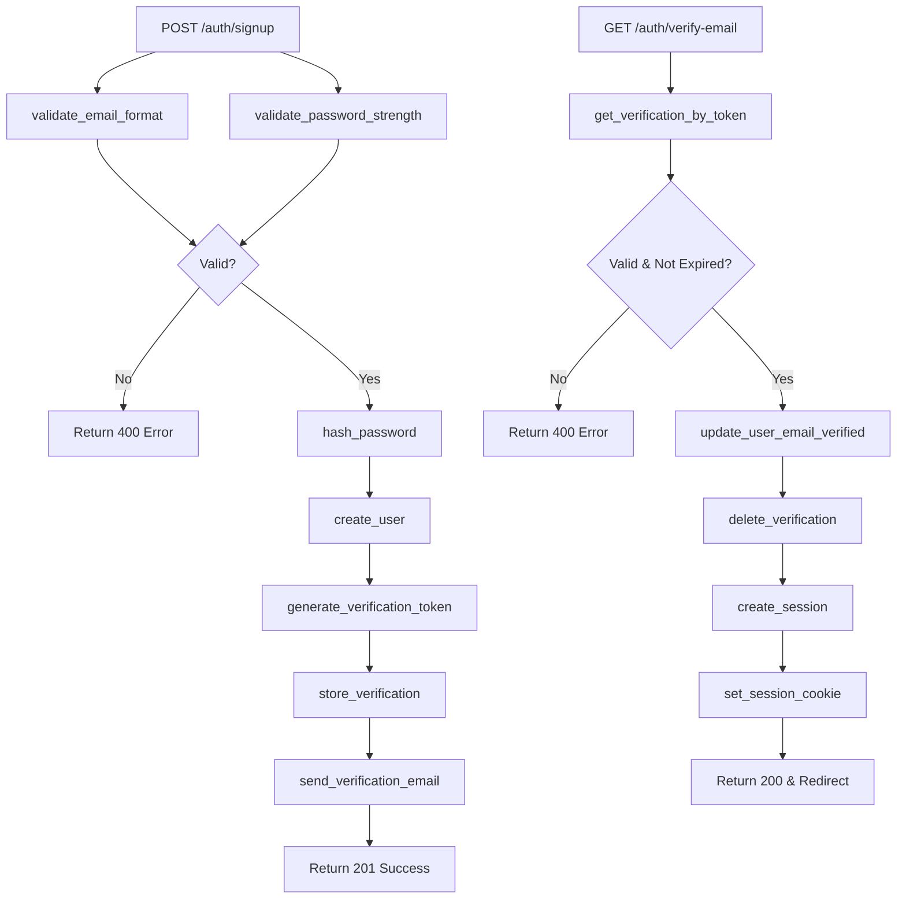
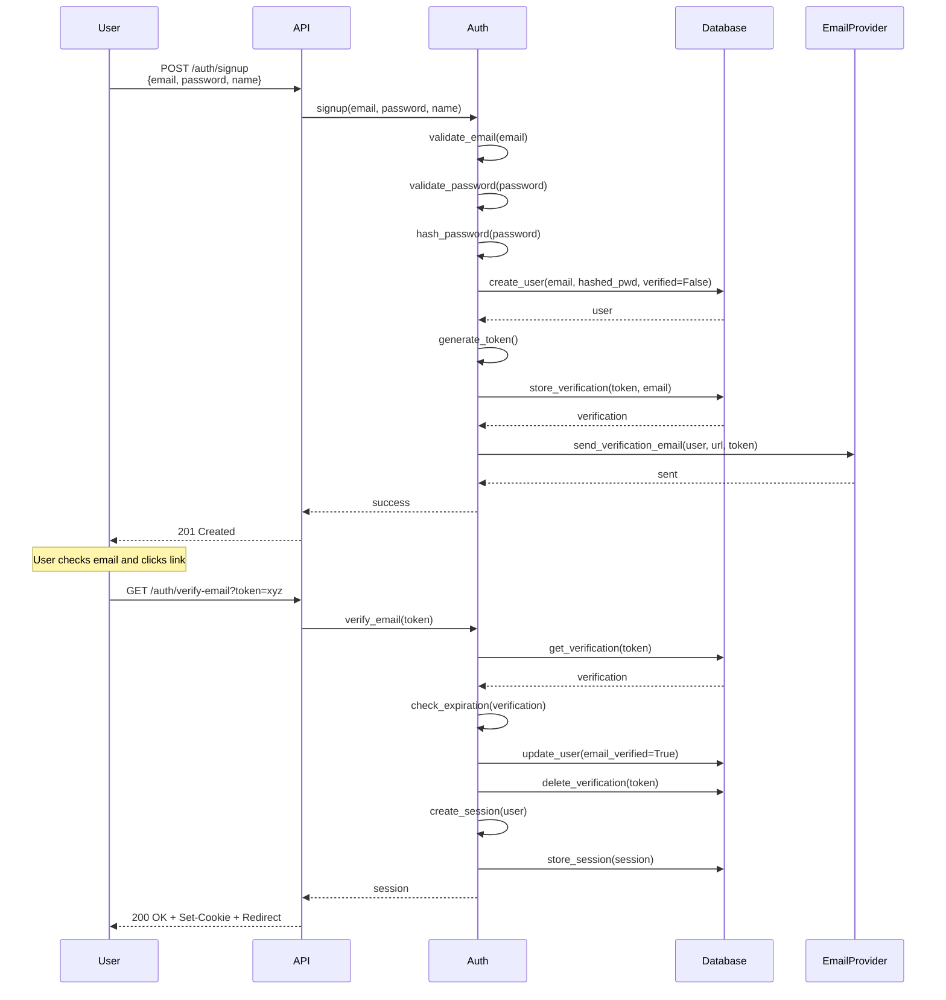
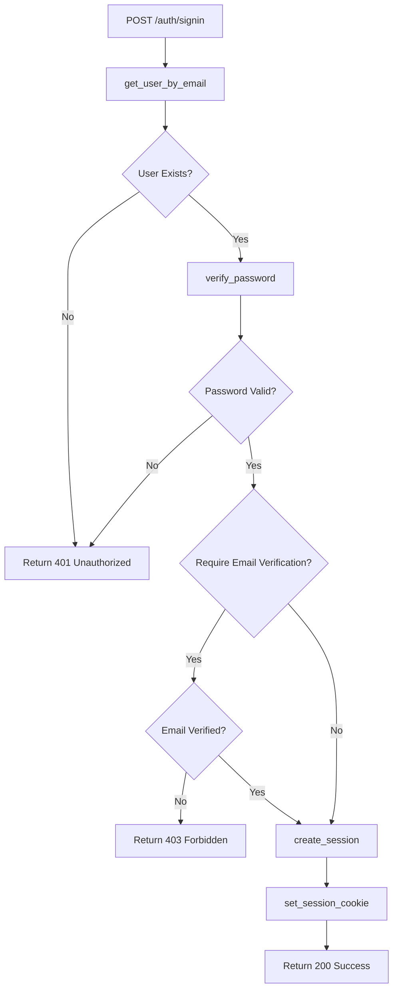
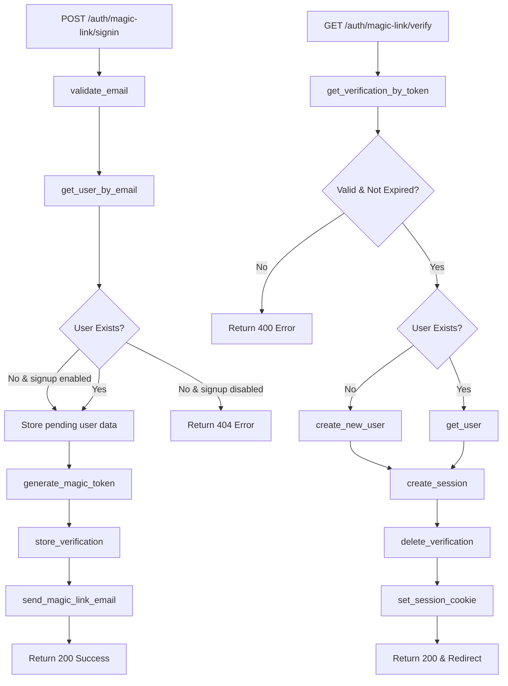
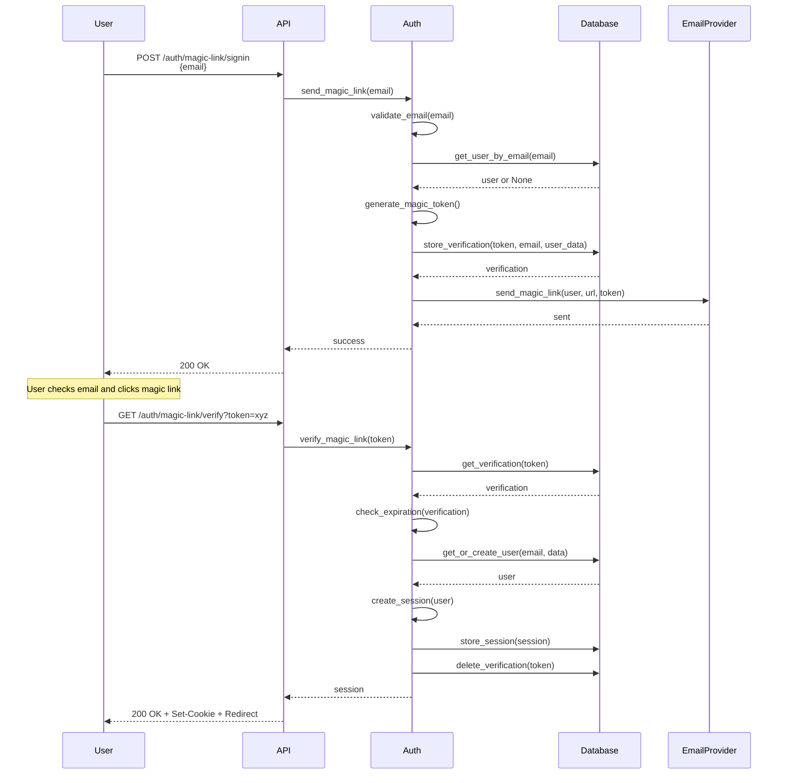
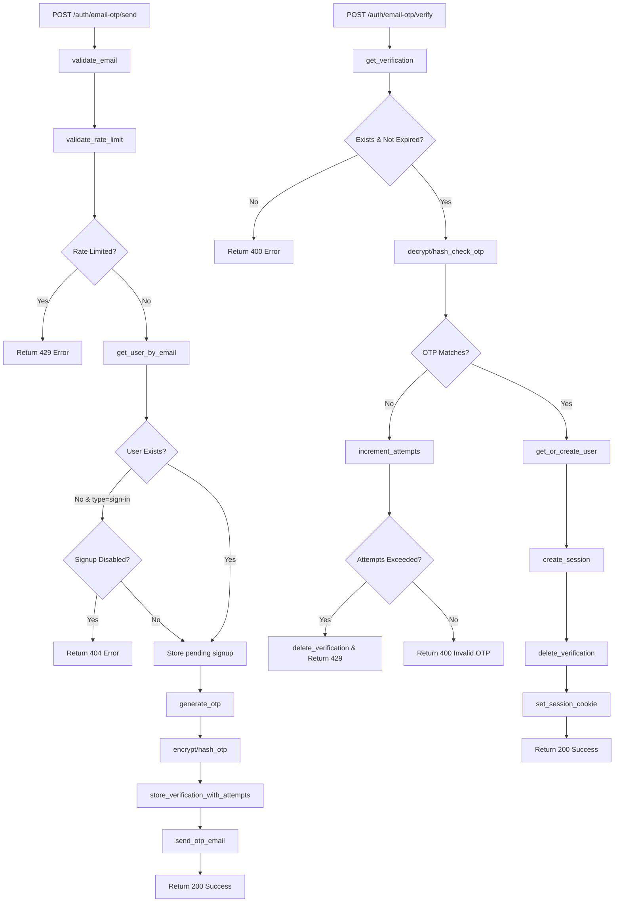
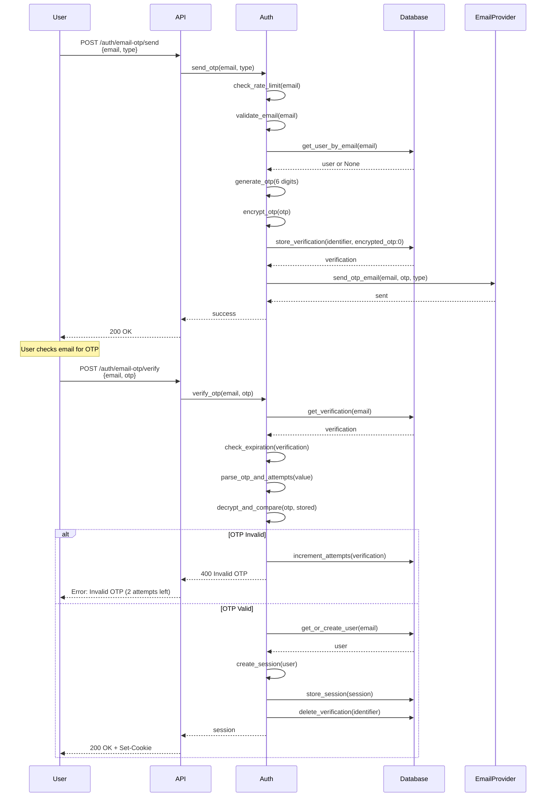
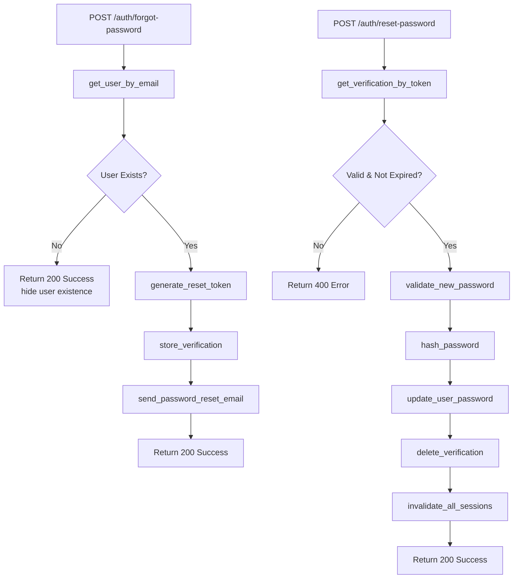
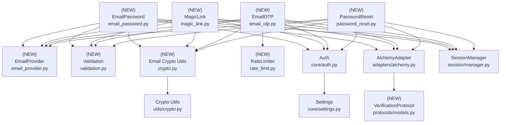

# Design Document: Email Workflows

## Overview

### High-Level Description

This design document outlines the implementation of email-based authentication workflows for Belgie, a Python-based authentication library for FastAPI. The feature adds support for email/password authentication with verification, magic link authentication, email OTP (one-time password), and password reset capabilities. This is inspired by the better-auth TypeScript library's approach to email workflows while being adapted for Python/FastAPI patterns.

Currently, Belgie only supports Google OAuth authentication. This design extends the library to support email-based authentication methods, providing users with more flexible authentication options while maintaining the same protocol-based, framework-agnostic architecture.

### Goals

- Implement email/password authentication with secure password hashing
- Add email verification with token-based confirmation links
- Support magic link authentication (passwordless email authentication)
- Implement email OTP for sign-in, verification, and password reset
- Provide flexible email provider integration (Resend, SendGrid, SMTP, etc.)
- Maintain the existing protocol-based design pattern for flexibility
- Add comprehensive security features (rate limiting, token expiration, attempt tracking)
- Support customizable email templates

### Non-Goals

- Two-factor authentication (2FA) - will be addressed in a separate design
- Phone-based OTP - out of scope for this design
- Advanced password policies (complexity requirements, history) - can be added later
- Email change workflow - will be addressed separately
- Account recovery via security questions - not planned

## Workflows

### Workflow 1: Email/Password Sign Up with Verification

#### Description

Users sign up with email and password. The system creates an unverified user account, hashes the password, and sends a verification email with a unique token link. When the user clicks the link, their email is verified and they can sign in.

#### Usage Example

```python
from fastapi import FastAPI, Depends
from belgie import Auth
from belgie.auth.email import EmailProvider
from models import User, Account, Session, OAuthState, Verification

app = FastAPI()

# Initialize auth with email support
auth = Auth(
    user_model=User,
    account_model=Account,
    session_model=Session,
    oauth_state_model=OAuthState,
    verification_model=Verification,
    database_adapter=adapter,
    email_provider=EmailProvider(
        send_verification_email=send_verification_email_func
    ),
    email_password=EmailPasswordSettings(
        enabled=True,
        require_email_verification=True,
        send_verification_on_signup=True,
        min_password_length=8,
    )
)

# Include auth routes
app.include_router(auth.router)

# Protected route
@app.get("/dashboard")
async def dashboard(user: User = Depends(auth.user)):
    return {"message": f"Welcome {user.email}"}
```

#### Call Graph



#### Sequence Diagram



#### Key Components

- **Signup Endpoint** (`email_password.py:signup`) - Handles user registration with email/password
- **Password Hasher** (`crypto.py:hash_password`) - Securely hashes passwords using bcrypt/argon2
- **Email Validator** (`validation.py:validate_email`) - Validates email format
- **Verification Token Generator** (`crypto.py:generate_verification_token`) - Creates secure random tokens
- **Email Verification Endpoint** (`email_password.py:verify_email`) - Validates verification tokens

### Workflow 2: Email/Password Sign In

#### Description

Users sign in with their email and password. The system verifies the credentials, checks if the email is verified (if required), creates a session, and sets a secure cookie.

#### Usage Example

```python
# Client makes POST request to /auth/signin
# {
#   "email": "user@example.com",
#   "password": "securepassword123"
# }

# On success:
# - 200 OK response
# - Session cookie set
# - Redirect to configured signin redirect URL

# If email not verified (when required):
# - 403 Forbidden
# - Error: "Email not verified"
```

#### Call Graph



#### Key Components

- **Sign In Endpoint** (`email_password.py:signin`) - Handles email/password authentication
- **Password Verifier** (`crypto.py:verify_password`) - Verifies password against stored hash
- **Session Manager** (`session/manager.py:create_session`) - Creates and manages sessions

### Workflow 3: Magic Link Authentication

#### Description

Passwordless authentication where users enter their email and receive a unique link. Clicking the link authenticates them without requiring a password. The token expires after a configurable time (default 5 minutes).

#### Usage Example

```python
auth = Auth(
    # ... other config
    magic_link=MagicLinkSettings(
        enabled=True,
        expires_in=300,  # 5 minutes
        disable_signup=False,
        send_magic_link=send_magic_link_func,
    )
)

# Client flow:
# 1. POST /auth/magic-link/signin {"email": "user@example.com"}
# 2. Check email for magic link
# 3. Click link: GET /auth/magic-link/verify?token=xyz
# 4. Automatically signed in and redirected
```

#### Call Graph



#### Sequence Diagram



#### Key Components

- **Magic Link Send Endpoint** (`magic_link.py:send_magic_link`) - Generates and sends magic link
- **Magic Link Verify Endpoint** (`magic_link.py:verify_magic_link`) - Validates token and creates session
- **Token Generator** (`crypto.py:generate_magic_token`) - Creates secure 32-character tokens
- **Token Storage** - Uses verification table with identifier format `magic-link:{email}`

### Workflow 4: Email OTP Sign In

#### Description

Users sign in using a one-time password sent to their email. Supports sign-in, email verification, and password reset. OTPs are 6-digit numeric codes by default, expire after 5 minutes, and allow 3 verification attempts.

#### Usage Example

```python
auth = Auth(
    # ... other config
    email_otp=EmailOTPSettings(
        enabled=True,
        otp_length=6,
        expires_in=300,  # 5 minutes
        allowed_attempts=3,
        disable_signup=False,
        send_otp=send_otp_email_func,
        storage_type="encrypted",  # or "plain", "hashed"
    )
)

# Client flow:
# 1. POST /auth/email-otp/send {"email": "user@example.com", "type": "sign-in"}
# 2. Check email for OTP code
# 3. POST /auth/email-otp/verify {"email": "user@example.com", "otp": "123456"}
# 4. Signed in with session cookie
```

#### Call Graph



#### Sequence Diagram



#### Key Components

- **OTP Send Endpoint** (`email_otp.py:send_otp`) - Generates and sends OTP via email
- **OTP Verify Endpoint** (`email_otp.py:verify_otp`) - Validates OTP and creates session
- **OTP Generator** (`crypto.py:generate_otp`) - Generates random numeric codes
- **OTP Encryptor** (`crypto.py:encrypt_otp`) - Encrypts OTPs for secure storage
- **Rate Limiter** (`rate_limit.py:check_rate_limit`) - Prevents abuse (3 requests per 60 seconds)
- **Attempt Tracker** - Tracks failed attempts in verification value field

### Workflow 5: Password Reset

#### Description

Users who forget their password can request a password reset via email. They receive either a reset link with a token or an OTP, enter their new password, and their password is updated.

#### Usage Example

```python
# Link-based reset:
# 1. POST /auth/forgot-password {"email": "user@example.com"}
# 2. Click link in email: GET /auth/reset-password?token=xyz
# 3. POST /auth/reset-password {"token": "xyz", "new_password": "newpass123"}

# OTP-based reset (if email OTP enabled):
# 1. POST /auth/email-otp/send {"email": "user@example.com", "type": "password-reset"}
# 2. POST /auth/email-otp/reset-password {"email": "user@example.com", "otp": "123456", "new_password": "newpass123"}
```

#### Call Graph



#### Key Components

- **Forgot Password Endpoint** (`password_reset.py:forgot_password`) - Initiates reset flow
- **Reset Password Endpoint** (`password_reset.py:reset_password`) - Updates password with token
- **Reset Token Generator** (`crypto.py:generate_reset_token`) - Creates secure reset tokens
- **Session Invalidator** (`session/manager.py:invalidate_all_user_sessions`) - Clears old sessions

## Dependencies



## Detailed Design

### Module Structure

```
src/belgie/
├── auth/
│   ├── core/
│   │   ├── auth.py              # Extended to support email workflows
│   │   ├── settings.py          # Add email workflow settings
│   │   └── exceptions.py        # Add email-specific exceptions
│   ├── email/
│   │   ├── __init__.py
│   │   ├── email_password.py    # Email/password authentication (Workflow 1, 2)
│   │   ├── magic_link.py        # Magic link authentication (Workflow 3)
│   │   ├── email_otp.py         # Email OTP (Workflow 4)
│   │   ├── password_reset.py    # Password reset (Workflow 5)
│   │   ├── validation.py        # Email & password validation
│   │   └── rate_limit.py        # Rate limiting for email endpoints
│   ├── providers/
│   │   ├── email_provider.py    # Email provider abstraction
│   │   ├── resend.py            # Resend integration (optional)
│   │   └── smtp.py              # SMTP integration (optional)
│   ├── protocols/
│   │   └── models.py            # Add VerificationProtocol
│   ├── adapters/
│   │   └── alchemy.py           # Add verification CRUD methods
│   ├── utils/
│   │   └── crypto.py            # Add password hashing, OTP encryption
│   └── templates/
│       ├── verification_email.html
│       ├── magic_link_email.html
│       ├── otp_email.html
│       └── password_reset_email.html
└── __tests__/
    └── auth/
        └── email/
            ├── test_email_password.py
            ├── test_magic_link.py
            ├── test_email_otp.py
            ├── test_password_reset.py
            ├── test_validation.py
            └── test_rate_limit.py
```

### API Design

#### `src/belgie/auth/protocols/models.py`

Add verification table protocol to support email workflows.

```python
from typing import Protocol
from datetime import datetime
from uuid import UUID

class VerificationProtocol(Protocol):
    """Protocol for verification token storage"""
    id: UUID
    identifier: str  # Format: "{type}:{email}" or "{type}-otp:{email}"
    value: str  # Token, encrypted OTP, or "otp:attempts"
    expires_at: datetime
    created_at: datetime
    updated_at: datetime
```

#### `src/belgie/auth/core/settings.py`

Add settings for email workflows.

```python
from pydantic_settings import BaseSettings, SettingsConfigDict
from typing import Callable, Awaitable

class EmailPasswordSettings(BaseSettings):
    """Settings for email/password authentication"""
    enabled: bool = False
    require_email_verification: bool = True
    send_verification_on_signup: bool = True
    auto_signin_after_verification: bool = True
    min_password_length: int = 8
    max_password_length: int = 128

class MagicLinkSettings(BaseSettings):
    """Settings for magic link authentication"""
    enabled: bool = False
    expires_in: int = 300  # 5 minutes in seconds
    disable_signup: bool = False

class EmailOTPSettings(BaseSettings):
    """Settings for email OTP"""
    enabled: bool = False
    otp_length: int = 6
    expires_in: int = 300  # 5 minutes
    allowed_attempts: int = 3
    disable_signup: bool = False
    storage_type: str = "encrypted"  # "plain", "hashed", "encrypted"

class PasswordResetSettings(BaseSettings):
    """Settings for password reset"""
    enabled: bool = True  # Enabled by default if email_password is enabled
    expires_in: int = 3600  # 1 hour

class RateLimitSettings(BaseSettings):
    """Rate limiting for email endpoints"""
    enabled: bool = True
    window_seconds: int = 60
    max_requests: int = 3

class AuthSettings(BaseSettings):
    # ... existing settings ...
    email_password: EmailPasswordSettings | None = None
    magic_link: MagicLinkSettings | None = None
    email_otp: EmailOTPSettings | None = None
    password_reset: PasswordResetSettings | None = None
    rate_limit: RateLimitSettings = RateLimitSettings()
```

#### `src/belgie/auth/core/exceptions.py`

Add email-specific exceptions.

```python
class EmailAuthError(Exception):
    """Base exception for email authentication errors"""
    pass

class InvalidEmailError(EmailAuthError):
    """Invalid email format"""
    pass

class WeakPasswordError(EmailAuthError):
    """Password doesn't meet strength requirements"""
    pass

class EmailNotVerifiedError(EmailAuthError):
    """Email address not verified"""
    pass

class InvalidCredentialsError(EmailAuthError):
    """Invalid email or password"""
    pass

class InvalidTokenError(EmailAuthError):
    """Invalid or expired verification token"""
    pass

class InvalidOTPError(EmailAuthError):
    """Invalid or expired OTP"""
    pass

class RateLimitExceededError(EmailAuthError):
    """Too many requests"""
    pass

class MaxAttemptsExceededError(EmailAuthError):
    """Maximum OTP attempts exceeded"""
    pass
```

#### `src/belgie/auth/utils/crypto.py`

Extend crypto utilities with email-specific functions.

```python
import secrets
import bcrypt
from cryptography.fernet import Fernet
from typing import Literal

# Password hashing (existing, may need to be added)
def hash_password(password: str) -> str:
    """Hash password using bcrypt"""
    # 1. Encode password to bytes
    # 2. Generate salt with bcrypt.gensalt()
    # 3. Hash password with bcrypt.hashpw()
    # 4. Return hash as string

def verify_password(password: str, hashed: str) -> bool:
    """Verify password against hash"""
    # 1. Encode password and hash to bytes
    # 2. Use bcrypt.checkpw() to verify
    # 3. Return boolean result

# Token generation (new)
def generate_verification_token(length: int = 32) -> str:
    """Generate secure random token for email verification"""
    # 1. Use secrets.token_urlsafe(length)
    # 2. Return URL-safe token
    # Used in: Workflow 1

def generate_magic_token(length: int = 32) -> str:
    """Generate secure random token for magic links"""
    # Same as generate_verification_token but separate for clarity
    # Used in: Workflow 3

def generate_reset_token(length: int = 32) -> str:
    """Generate secure random token for password reset"""
    # Same as generate_verification_token but separate for clarity
    # Used in: Workflow 5

# OTP functions (new)
def generate_otp(length: int = 6) -> str:
    """Generate random numeric OTP"""
    # 1. Use secrets.randbelow(10**length) to generate random number
    # 2. Format with leading zeros to ensure correct length
    # 3. Return as string
    # Used in: Workflow 4

def encrypt_otp(otp: str, secret: str) -> str:
    """Encrypt OTP for secure storage"""
    # 1. Create Fernet cipher with secret key
    # 2. Encrypt OTP bytes
    # 3. Return encrypted string
    # Used in: Workflow 4 with storage_type="encrypted"

def decrypt_otp(encrypted: str, secret: str) -> str:
    """Decrypt stored OTP"""
    # 1. Create Fernet cipher with secret key
    # 2. Decrypt encrypted bytes
    # 3. Return decrypted OTP string
    # Used in: Workflow 4 with storage_type="encrypted"

def hash_otp(otp: str) -> str:
    """Hash OTP for secure storage (one-way)"""
    # 1. Similar to password hashing but optimized for short strings
    # 2. Return hash string
    # Used in: Workflow 4 with storage_type="hashed"

def verify_otp_hash(otp: str, hashed: str) -> bool:
    """Verify OTP against hash"""
    # 1. Hash the provided OTP
    # 2. Compare with stored hash
    # 3. Return boolean
    # Used in: Workflow 4 with storage_type="hashed"
```

#### `src/belgie/auth/email/validation.py`

Email and password validation utilities (leaf node, see [Implementation Order](#implementation-order) #1).

```python
import re
from belgie.auth.core.exceptions import InvalidEmailError, WeakPasswordError

EMAIL_REGEX = re.compile(r"^[a-zA-Z0-9._%+-]+@[a-zA-Z0-9.-]+\.[a-zA-Z]{2,}$")

def validate_email(email: str) -> None:
    """Validate email format"""
    # 1. Check email is not empty
    # 2. Check email matches regex pattern
    # 3. Raise InvalidEmailError if invalid
    # Used in: All email workflows

def validate_password(password: str, min_length: int = 8, max_length: int = 128) -> None:
    """Validate password strength"""
    # 1. Check password length >= min_length
    # 2. Check password length <= max_length
    # 3. Optionally check for common weak passwords
    # 4. Raise WeakPasswordError if invalid
    # Used in: Workflow 1, 2, 5

def validate_password_strength(password: str) -> dict[str, bool]:
    """Check password strength indicators"""
    # 1. Check has_uppercase, has_lowercase, has_digit, has_special
    # 2. Return dict with boolean indicators
    # 3. Can be used for frontend feedback
    # Optional enhancement for better UX
```

#### `src/belgie/auth/email/rate_limit.py`

Rate limiting for email endpoints (leaf node, see [Implementation Order](#implementation-order) #2).

```python
from datetime import datetime, timedelta
from typing import Dict, Tuple
from belgie.auth.core.exceptions import RateLimitExceededError

class RateLimiter:
    """In-memory rate limiter for email endpoints"""

    def __init__(self, window_seconds: int = 60, max_requests: int = 3) -> None:
        # 1. Store window_seconds and max_requests
        # 2. Initialize in-memory storage: Dict[str, List[datetime]]
        # Note: For production, consider Redis or database-backed solution

    def check_rate_limit(self, identifier: str) -> None:
        """Check if identifier has exceeded rate limit"""
        # 1. Get request timestamps for identifier
        # 2. Filter timestamps within current window
        # 3. If count >= max_requests, raise RateLimitExceededError
        # 4. Otherwise, append current timestamp
        # Used in: Workflow 4 (OTP sending)

    def reset(self, identifier: str) -> None:
        """Reset rate limit for identifier"""
        # 1. Remove identifier from storage
        # Used in testing

    def cleanup_expired(self) -> None:
        """Remove expired entries from storage"""
        # 1. Iterate through all identifiers
        # 2. Filter timestamps within window
        # 3. Remove identifiers with no recent requests
        # Should be called periodically
```

#### `src/belgie/auth/providers/email_provider.py`

Email provider abstraction for sending emails (leaf node, see [Implementation Order](#implementation-order) #3).

```python
from typing import Protocol, Callable, Awaitable
from pydantic import BaseModel

class EmailMessage(BaseModel):
    """Email message structure"""
    to: str
    subject: str
    html: str | None = None
    text: str | None = None

class EmailProviderProtocol(Protocol):
    """Protocol for email providers"""

    async def send_email(self, message: EmailMessage) -> None:
        """Send an email message"""
        ...

class EmailProvider:
    """Email provider implementation using custom send function"""

    def __init__(
        self,
        send_verification_email: Callable[[str, str, str], Awaitable[None]] | None = None,
        send_magic_link: Callable[[str, str, str], Awaitable[None]] | None = None,
        send_otp: Callable[[str, str, str], Awaitable[None]] | None = None,
        send_password_reset: Callable[[str, str, str], Awaitable[None]] | None = None,
    ) -> None:
        # 1. Store callback functions
        # 2. Each function receives (email: str, url_or_code: str, user_data: str)
        # 3. Users provide their own email sending implementation
        # Flexible approach like better-auth

    async def send_verification_email(self, email: str, url: str, token: str) -> None:
        # 1. Call stored callback if provided
        # 2. Otherwise, use default template and send via configured provider
        # Used in: Workflow 1

    async def send_magic_link(self, email: str, url: str, token: str) -> None:
        # Used in: Workflow 3

    async def send_otp(self, email: str, otp: str, otp_type: str) -> None:
        # Used in: Workflow 4

    async def send_password_reset(self, email: str, url: str, token: str) -> None:
        # Used in: Workflow 5
```

#### `src/belgie/auth/adapters/alchemy.py`

Extend SQLAlchemy adapter with verification CRUD operations (see [Implementation Order](#implementation-order) #4).

```python
from belgie.auth.protocols.models import VerificationProtocol
from datetime import datetime

class AlchemyAdapter:
    # ... existing methods ...

    # Verification CRUD (new)
    async def create_verification(
        self,
        identifier: str,
        value: str,
        expires_at: datetime,
    ) -> VerificationProtocol:
        """Create a verification record"""
        # 1. Create verification model instance with UUID
        # 2. Add to session
        # 3. Commit
        # 4. Return verification
        # Used in: All email workflows

    async def get_verification_by_identifier(
        self, identifier: str
    ) -> VerificationProtocol | None:
        """Get verification by identifier"""
        # 1. Query verification by identifier
        # 2. Return verification or None
        # Used in: Email OTP workflow

    async def get_verification_by_value(
        self, value: str
    ) -> VerificationProtocol | None:
        """Get verification by token value"""
        # 1. Query verification by value
        # 2. Return verification or None
        # Used in: Email verification, magic link, password reset

    async def update_verification(
        self, verification_id: UUID, **updates
    ) -> VerificationProtocol:
        """Update verification record"""
        # 1. Get verification by ID
        # 2. Update fields
        # 3. Update updated_at timestamp
        # 4. Commit
        # 5. Return updated verification
        # Used in: OTP attempt tracking

    async def delete_verification(self, verification_id: UUID) -> None:
        """Delete verification record"""
        # 1. Get verification by ID
        # 2. Delete from session
        # 3. Commit
        # Used in: After successful verification

    async def delete_expired_verifications(self) -> int:
        """Delete all expired verification records"""
        # 1. Query verifications where expires_at < now()
        # 2. Delete all
        # 3. Commit
        # 4. Return count of deleted records
        # Used in: Cleanup job

    async def get_user_by_email(self, email: str) -> UserProtocol | None:
        """Get user by email address (if not already exists)"""
        # 1. Query user by email
        # 2. Return user or None
        # Used in: All email workflows
```

#### `src/belgie/auth/email/email_password.py`

Email/password authentication endpoints (see [Implementation Order](#implementation-order) #6).

```python
from fastapi import APIRouter, HTTPException, Request, Response, Depends
from pydantic import BaseModel, EmailStr
from belgie.auth.adapters.alchemy import AlchemyAdapter
from belgie.auth.session.manager import SessionManager
from belgie.auth.email.validation import validate_email, validate_password
from belgie.auth.utils.crypto import hash_password, verify_password, generate_verification_token
from belgie.auth.providers.email_provider import EmailProvider
from belgie.auth.core.settings import EmailPasswordSettings
from belgie.auth.core.exceptions import *
from datetime import datetime, timedelta

class SignupRequest(BaseModel):
    email: EmailStr
    password: str
    name: str | None = None

class SigninRequest(BaseModel):
    email: EmailStr
    password: str

class EmailPasswordAuth:
    """Email/password authentication handler"""
    # Entry point for Workflow 1 and 2

    def __init__(
        self,
        adapter: AlchemyAdapter,
        session_manager: SessionManager,
        email_provider: EmailProvider,
        settings: EmailPasswordSettings,
        base_url: str,
    ) -> None:
        # 1. Store dependencies
        # 2. Initialize router
        # 3. Register routes

    def _create_router(self) -> APIRouter:
        """Create FastAPI router with email/password endpoints"""
        # 1. Create APIRouter instance
        # 2. Register POST /auth/signup
        # 3. Register POST /auth/signin
        # 4. Register GET /auth/verify-email
        # 5. Return router

    async def signup(
        self,
        request: SignupRequest,
        response: Response,
    ) -> dict[str, str]:
        """Handle user signup with email and password"""
        # Entry point for Workflow 1
        # 1. Validate email format with validate_email()
        # 2. Validate password strength with validate_password()
        # 3. Check if user already exists with adapter.get_user_by_email()
        # 4. If exists, raise HTTPException 409 Conflict
        # 5. Hash password with hash_password()
        # 6. Create user with adapter.create_user(email_verified=False if verification required)
        # 7. If verification required:
        #    a. Generate token with generate_verification_token()
        #    b. Store in verification table with identifier="email-verification:{email}"
        #    c. Send verification email with email_provider.send_verification_email()
        #    d. Return 201 with message "Check your email"
        # 8. If verification not required:
        #    a. Create session with session_manager.create_session()
        #    b. Set session cookie
        #    c. Return 201 with user data
        # Dependencies: validation, crypto, adapter, email_provider
        # See call graph in Workflow 1

    async def signin(
        self,
        request: SigninRequest,
        response: Response,
    ) -> dict[str, str]:
        """Handle user signin with email and password"""
        # Entry point for Workflow 2
        # 1. Get user by email with adapter.get_user_by_email()
        # 2. If no user, raise InvalidCredentialsError (don't reveal user existence)
        # 3. Verify password with verify_password()
        # 4. If invalid, raise InvalidCredentialsError
        # 5. If require_email_verification and not user.email_verified:
        #    a. Raise EmailNotVerifiedError with 403
        # 6. Create session with session_manager.create_session()
        # 7. Set session cookie on response
        # 8. Return user data
        # Dependencies: adapter, crypto, session_manager
        # See call graph in Workflow 2

    async def verify_email(
        self,
        token: str,
        response: Response,
    ) -> dict[str, str]:
        """Verify email address with token"""
        # Part of Workflow 1
        # 1. Get verification by token with adapter.get_verification_by_value()
        # 2. If not found or expired, raise InvalidTokenError
        # 3. Parse identifier to get email
        # 4. Get user by email
        # 5. Update user.email_verified = True
        # 6. Delete verification record
        # 7. If auto_signin_after_verification:
        #    a. Create session
        #    b. Set session cookie
        # 8. Return success with redirect URL
        # Dependencies: adapter, session_manager
        # See sequence diagram in Workflow 1
```

#### `src/belgie/auth/email/magic_link.py`

Magic link authentication endpoints (see [Implementation Order](#implementation-order) #7).

```python
from fastapi import APIRouter, HTTPException, Request, Response
from pydantic import BaseModel, EmailStr
from belgie.auth.adapters.alchemy import AlchemyAdapter
from belgie.auth.session.manager import SessionManager
from belgie.auth.email.validation import validate_email
from belgie.auth.utils.crypto import generate_magic_token
from belgie.auth.providers.email_provider import EmailProvider
from belgie.auth.core.settings import MagicLinkSettings
from datetime import datetime, timedelta
import json

class MagicLinkRequest(BaseModel):
    email: EmailStr
    name: str | None = None

class MagicLinkAuth:
    """Magic link authentication handler"""
    # Entry point for Workflow 3

    def __init__(
        self,
        adapter: AlchemyAdapter,
        session_manager: SessionManager,
        email_provider: EmailProvider,
        settings: MagicLinkSettings,
        base_url: str,
    ) -> None:
        # 1. Store dependencies
        # 2. Initialize router

    async def send_magic_link(
        self,
        request: MagicLinkRequest,
    ) -> dict[str, str]:
        """Send magic link to email"""
        # Entry point for Workflow 3
        # 1. Validate email with validate_email()
        # 2. Get user by email with adapter.get_user_by_email()
        # 3. If no user and disable_signup, raise HTTPException 404
        # 4. Generate token with generate_magic_token()
        # 5. Store user data (name, email) in verification value as JSON
        # 6. Create verification with identifier="magic-link:{email}"
        # 7. Calculate expires_at = now + settings.expires_in
        # 8. Send magic link email with token
        # 9. Return 200 success (don't reveal user existence)
        # Dependencies: validation, crypto, adapter, email_provider
        # See call graph in Workflow 3

    async def verify_magic_link(
        self,
        token: str,
        response: Response,
    ) -> dict[str, str]:
        """Verify magic link token and authenticate user"""
        # Part of Workflow 3
        # 1. Get verification by token with adapter.get_verification_by_value()
        # 2. If not found or expired, raise InvalidTokenError
        # 3. Parse user data from verification value
        # 4. Get user by email
        # 5. If no user:
        #    a. Check if signup allowed
        #    b. Create new user with email_verified=True
        # 6. Create session with session_manager.create_session()
        # 7. Delete verification record
        # 8. Set session cookie
        # 9. Return success with redirect URL
        # Dependencies: adapter, session_manager
        # See sequence diagram in Workflow 3
```

#### `src/belgie/auth/email/email_otp.py`

Email OTP authentication endpoints (see [Implementation Order](#implementation-order) #8).

```python
from fastapi import APIRouter, HTTPException, Request, Response
from pydantic import BaseModel, EmailStr
from belgie.auth.adapters.alchemy import AlchemyAdapter
from belgie.auth.session.manager import SessionManager
from belgie.auth.email.validation import validate_email
from belgie.auth.email.rate_limit import RateLimiter
from belgie.auth.utils.crypto import generate_otp, encrypt_otp, decrypt_otp
from belgie.auth.providers.email_provider import EmailProvider
from belgie.auth.core.settings import EmailOTPSettings, RateLimitSettings
from datetime import datetime, timedelta

class SendOTPRequest(BaseModel):
    email: EmailStr
    type: str = "sign-in"  # "sign-in", "email-verification", "password-reset"

class VerifyOTPRequest(BaseModel):
    email: EmailStr
    otp: str

class EmailOTPAuth:
    """Email OTP authentication handler"""
    # Entry point for Workflow 4

    def __init__(
        self,
        adapter: AlchemyAdapter,
        session_manager: SessionManager,
        email_provider: EmailProvider,
        settings: EmailOTPSettings,
        rate_limit_settings: RateLimitSettings,
        secret: str,
    ) -> None:
        # 1. Store dependencies
        # 2. Initialize rate limiter with settings
        # 3. Store secret for OTP encryption

    async def send_otp(
        self,
        request: SendOTPRequest,
    ) -> dict[str, str]:
        """Generate and send OTP to email"""
        # Entry point for Workflow 4
        # 1. Check rate limit with rate_limiter.check_rate_limit()
        # 2. Validate email with validate_email()
        # 3. Get user by email (for type validation)
        # 4. If type="sign-in" and no user and disable_signup, raise 404
        # 5. Generate OTP with generate_otp()
        # 6. Store OTP based on storage_type:
        #    - plain: store as "{otp}:0"
        #    - encrypted: encrypt with encrypt_otp() then store as "{encrypted}:0"
        #    - hashed: hash with hash_otp() then store as "{hash}:0"
        # 7. Create verification with identifier="{type}-otp:{email}"
        # 8. Calculate expires_at = now + settings.expires_in
        # 9. Send OTP email with plaintext OTP
        # 10. Return 200 success
        # Dependencies: rate_limit, validation, crypto, adapter, email_provider
        # See call graph in Workflow 4

    async def verify_otp(
        self,
        request: VerifyOTPRequest,
        response: Response,
    ) -> dict[str, str]:
        """Verify OTP and authenticate user"""
        # Part of Workflow 4
        # 1. Get verification by identifier (use sign-in type)
        # 2. If not found or expired, raise InvalidOTPError
        # 3. Parse stored value: split by ":" to get otp_value and attempts
        # 4. Check if attempts >= allowed_attempts
        # 5. If exceeded, delete verification and raise MaxAttemptsExceededError
        # 6. Verify OTP based on storage_type:
        #    - plain: direct comparison
        #    - encrypted: decrypt with decrypt_otp() then compare
        #    - hashed: verify with verify_otp_hash()
        # 7. If invalid OTP:
        #    a. Increment attempts: update value to "{otp_value}:{attempts+1}"
        #    b. Return 400 with remaining attempts
        # 8. If valid OTP:
        #    a. Get user by email
        #    b. If no user, create with email_verified=True
        #    c. If user exists, update email_verified=True if verification type
        #    d. Create session with session_manager.create_session()
        #    e. Delete verification record
        #    f. Set session cookie
        #    g. Return success
        # Dependencies: adapter, crypto, session_manager
        # See sequence diagram in Workflow 4
```

#### `src/belgie/auth/email/password_reset.py`

Password reset endpoints (see [Implementation Order](#implementation-order) #9).

```python
from fastapi import APIRouter, HTTPException, Request, Response
from pydantic import BaseModel, EmailStr
from belgie.auth.adapters.alchemy import AlchemyAdapter
from belgie.auth.session.manager import SessionManager
from belgie.auth.email.validation import validate_email, validate_password
from belgie.auth.utils.crypto import hash_password, generate_reset_token
from belgie.auth.providers.email_provider import EmailProvider
from belgie.auth.core.settings import PasswordResetSettings
from datetime import datetime, timedelta

class ForgotPasswordRequest(BaseModel):
    email: EmailStr

class ResetPasswordRequest(BaseModel):
    token: str
    new_password: str

class PasswordResetAuth:
    """Password reset handler"""
    # Entry point for Workflow 5

    def __init__(
        self,
        adapter: AlchemyAdapter,
        session_manager: SessionManager,
        email_provider: EmailProvider,
        settings: PasswordResetSettings,
        base_url: str,
    ) -> None:
        # 1. Store dependencies

    async def forgot_password(
        self,
        request: ForgotPasswordRequest,
    ) -> dict[str, str]:
        """Initiate password reset flow"""
        # Entry point for Workflow 5
        # 1. Validate email with validate_email()
        # 2. Get user by email
        # 3. If no user, return 200 anyway (don't reveal user existence)
        # 4. Generate reset token with generate_reset_token()
        # 5. Create verification with identifier="password-reset:{email}"
        # 6. Calculate expires_at = now + settings.expires_in
        # 7. Send password reset email with token
        # 8. Return 200 success
        # Dependencies: validation, crypto, adapter, email_provider
        # See call graph in Workflow 5

    async def reset_password(
        self,
        request: ResetPasswordRequest,
    ) -> dict[str, str]:
        """Reset password with token"""
        # Part of Workflow 5
        # 1. Get verification by token with adapter.get_verification_by_value()
        # 2. If not found or expired, raise InvalidTokenError
        # 3. Parse identifier to get email
        # 4. Validate new password with validate_password()
        # 5. Hash new password with hash_password()
        # 6. Get user by email
        # 7. Update user password
        # 8. Delete verification record
        # 9. Invalidate all user sessions with session_manager.invalidate_all_user_sessions()
        # 10. Return 200 success
        # Dependencies: validation, crypto, adapter, session_manager
        # See call graph in Workflow 5
```

#### `src/belgie/auth/core/auth.py`

Extend the main Auth class to support email workflows (see [Implementation Order](#implementation-order) #10).

```python
from belgie.auth.email.email_password import EmailPasswordAuth
from belgie.auth.email.magic_link import MagicLinkAuth
from belgie.auth.email.email_otp import EmailOTPAuth
from belgie.auth.email.password_reset import PasswordResetAuth
from belgie.auth.providers.email_provider import EmailProvider

class Auth:
    def __init__(
        self,
        # ... existing parameters ...
        verification_model: type[VerificationProtocol] | None = None,
        email_provider: EmailProvider | None = None,
        email_password: EmailPasswordSettings | None = None,
        magic_link: MagicLinkSettings | None = None,
        email_otp: EmailOTPSettings | None = None,
        password_reset: PasswordResetSettings | None = None,
    ) -> None:
        # 1. Store new parameters
        # 2. Initialize email workflow handlers if enabled:
        #    - EmailPasswordAuth if email_password.enabled
        #    - MagicLinkAuth if magic_link.enabled
        #    - EmailOTPAuth if email_otp.enabled
        #    - PasswordResetAuth if password_reset.enabled
        # 3. Include their routers in main router
        # 4. Validate that email_provider is provided if any email workflow is enabled
```

### Testing Strategy

#### Email Validation Tests (`test_validation.py`)

**`validate_email()` Tests:**
- Test valid email formats: simple, with plus, with dots, various TLDs
- Test invalid formats: missing @, missing domain, invalid characters
- Test edge cases: empty string, very long emails

**`validate_password()` Tests:**
- Test valid passwords of various lengths
- Test passwords below minimum length
- Test passwords above maximum length
- Test password strength indicators

#### Rate Limiter Tests (`test_rate_limit.py`)

**`RateLimiter` Tests:**
- Test successful requests within limit
- Test rate limit exceeded after max requests
- Test rate limit resets after window expires
- Test multiple identifiers are tracked independently
- Test cleanup_expired() removes old entries

#### Email/Password Tests (`test_email_password.py`)

**Signup Tests:**
- Test successful signup with valid credentials
- Test signup with existing email (should fail)
- Test signup with invalid email format
- Test signup with weak password
- Test verification email is sent when enabled
- Test auto-signin when verification not required

**Sign In Tests:**
- Test successful signin with correct credentials
- Test signin with incorrect password
- Test signin with non-existent email
- Test signin blocked when email not verified (if required)
- Test session cookie is set correctly

**Email Verification Tests:**
- Test successful verification with valid token
- Test verification with expired token
- Test verification with invalid token
- Test user is auto-signed-in after verification (if enabled)
- Test verification token is deleted after use

#### Magic Link Tests (`test_magic_link.py`)

**Send Magic Link Tests:**
- Test magic link sent to existing user
- Test magic link sent to new user (signup allowed)
- Test magic link rejected for new user (signup disabled)
- Test rate limiting on send endpoint
- Test token expiration is set correctly

**Verify Magic Link Tests:**
- Test successful verification for existing user
- Test successful verification creates new user (if allowed)
- Test verification with expired token
- Test verification with invalid token
- Test session is created after verification
- Test token is deleted after use

#### Email OTP Tests (`test_email_otp.py`)

**Send OTP Tests:**
- Test OTP sent successfully
- Test OTP storage in plain, encrypted, and hashed modes
- Test rate limiting (3 requests per 60 seconds)
- Test OTP expiration is set correctly
- Test different OTP types (sign-in, verification, password-reset)

**Verify OTP Tests:**
- Test successful verification with correct OTP
- Test verification with incorrect OTP increments attempts
- Test verification fails after max attempts exceeded
- Test verification with expired OTP
- Test OTP is deleted after successful verification
- Test session is created after successful verification
- Test new user is created if allowed

#### Password Reset Tests (`test_password_reset.py`)

**Forgot Password Tests:**
- Test reset email sent to existing user
- Test reset email for non-existent user (returns success anyway)
- Test reset token expiration is set correctly
- Test multiple reset requests overwrite previous tokens

**Reset Password Tests:**
- Test successful password reset with valid token
- Test reset with expired token
- Test reset with invalid token
- Test reset with weak new password (should fail)
- Test all user sessions are invalidated after reset
- Test user can sign in with new password
- Test reset token is deleted after use

#### Integration Tests (`test_email_integration.py`)

**End-to-End Workflows:**
- Test complete signup → verify → signin flow
- Test complete magic link flow
- Test complete OTP sign-in flow
- Test complete password reset flow
- Test email verification blocks signin when required
- Test multiple concurrent OTP attempts
- Test rate limiting across endpoints

**Security Tests:**
- Test timing attack resistance (don't reveal user existence)
- Test token reuse is prevented
- Test expired tokens are rejected
- Test password hashing is secure (bcrypt/argon2)
- Test OTP encryption/hashing works correctly
- Test session invalidation after password reset

## Implementation

### Implementation Order

Based on the dependency graph, implement in this order (leaf nodes first):

1. **Validation** (`validation.py`) - Leaf node, no dependencies on new code
   - Used in: All workflows
   - Dependencies: None (stdlib only)

2. **Rate Limiter** (`rate_limit.py`) - Leaf node, no dependencies on new code
   - Used in: Workflow 4 (Email OTP)
   - Dependencies: None (stdlib only)

3. **Email Provider** (`email_provider.py`) - Leaf node, no dependencies on new code
   - Used in: All workflows
   - Dependencies: None (user-provided callbacks)

4. **Crypto Utils** (`crypto.py`) - Leaf node, minimal dependencies
   - Used in: All workflows
   - Dependencies: bcrypt, cryptography

5. **Verification Protocol** (`protocols/models.py`) - Add protocol definition
   - Used in: Adapter and all workflows
   - Dependencies: None (protocol definition)

6. **Adapter Extensions** (`adapters/alchemy.py`) - Depends on protocol
   - Used in: All workflows
   - Dependencies: VerificationProtocol, SQLAlchemy

7. **Email/Password Auth** (`email_password.py`) - Depends on validation, crypto, adapter
   - Implements: Workflow 1, 2
   - Dependencies: validation, crypto, adapter, email_provider, session_manager

8. **Magic Link Auth** (`magic_link.py`) - Depends on validation, crypto, adapter
   - Implements: Workflow 3
   - Dependencies: validation, crypto, adapter, email_provider, session_manager

9. **Email OTP Auth** (`email_otp.py`) - Depends on validation, crypto, rate_limiter, adapter
   - Implements: Workflow 4
   - Dependencies: validation, crypto, rate_limiter, adapter, email_provider, session_manager

10. **Password Reset Auth** (`password_reset.py`) - Depends on validation, crypto, adapter
    - Implements: Workflow 5
    - Dependencies: validation, crypto, adapter, email_provider, session_manager

11. **Auth Core Integration** (`core/auth.py`) - Depends on all email auth modules
    - Integrates all workflows
    - Dependencies: All email auth modules

### Tasks

- [ ] **Implement foundational components** (leaf nodes)
  - [ ] Implement `validation.py` (#1)
    - [ ] Implement `validate_email()` function
    - [ ] Implement `validate_password()` function
    - [ ] Implement `validate_password_strength()` function
  - [ ] Write unit tests for `validation.py`
    - [ ] Test email validation with valid/invalid formats
    - [ ] Test password validation with various lengths
    - [ ] Test password strength indicators
  - [ ] Implement `rate_limit.py` (#2)
    - [ ] Implement `RateLimiter` class
    - [ ] Implement `check_rate_limit()` method
    - [ ] Implement `reset()` and `cleanup_expired()` methods
  - [ ] Write unit tests for `rate_limit.py`
    - [ ] Test rate limit enforcement
    - [ ] Test window expiration
    - [ ] Test cleanup functionality
  - [ ] Implement `email_provider.py` (#3)
    - [ ] Define `EmailMessage` model
    - [ ] Define `EmailProviderProtocol`
    - [ ] Implement `EmailProvider` class with callback support
  - [ ] Extend `crypto.py` (#4)
    - [ ] Implement `hash_password()` and `verify_password()`
    - [ ] Implement token generators (verification, magic, reset)
    - [ ] Implement OTP functions (generate, encrypt, decrypt, hash)
  - [ ] Write unit tests for crypto extensions
    - [ ] Test password hashing and verification
    - [ ] Test token generation (randomness, length)
    - [ ] Test OTP generation, encryption, and decryption
  - [ ] Add `VerificationProtocol` to `protocols/models.py` (#5)
  - [ ] Add `VerificationProtocol` example to fixture models

- [ ] **Implement adapter extensions** (depends on protocol)
  - [ ] Extend `adapters/alchemy.py` with verification CRUD (#6)
    - [ ] Implement `create_verification()`
    - [ ] Implement `get_verification_by_identifier()`
    - [ ] Implement `get_verification_by_value()`
    - [ ] Implement `update_verification()`
    - [ ] Implement `delete_verification()`
    - [ ] Implement `delete_expired_verifications()`
    - [ ] Implement `get_user_by_email()` if not exists
  - [ ] Write unit tests for adapter verification methods
    - [ ] Test CRUD operations
    - [ ] Test expiration cleanup
    - [ ] Test query methods

- [ ] **Implement settings and exceptions** (depends on protocols)
  - [ ] Add email workflow settings to `core/settings.py`
    - [ ] Implement `EmailPasswordSettings`
    - [ ] Implement `MagicLinkSettings`
    - [ ] Implement `EmailOTPSettings`
    - [ ] Implement `PasswordResetSettings`
    - [ ] Implement `RateLimitSettings`
    - [ ] Update `AuthSettings` to include email settings
  - [ ] Add email exceptions to `core/exceptions.py`
    - [ ] Implement all email auth exception classes

- [ ] **Implement email authentication modules** (depends on foundational components)
  - [ ] Implement `email_password.py` (#7)
    - [ ] Implement `EmailPasswordAuth` class
    - [ ] Implement `signup()` endpoint
    - [ ] Implement `signin()` endpoint
    - [ ] Implement `verify_email()` endpoint
  - [ ] Write unit tests for `email_password.py`
    - [ ] Test signup flow
    - [ ] Test signin flow
    - [ ] Test email verification flow
    - [ ] Test error cases
  - [ ] Implement `magic_link.py` (#8)
    - [ ] Implement `MagicLinkAuth` class
    - [ ] Implement `send_magic_link()` endpoint
    - [ ] Implement `verify_magic_link()` endpoint
  - [ ] Write unit tests for `magic_link.py`
    - [ ] Test magic link send
    - [ ] Test magic link verification
    - [ ] Test signup scenarios
  - [ ] Implement `email_otp.py` (#9)
    - [ ] Implement `EmailOTPAuth` class
    - [ ] Implement `send_otp()` endpoint
    - [ ] Implement `verify_otp()` endpoint
    - [ ] Integrate rate limiter
  - [ ] Write unit tests for `email_otp.py`
    - [ ] Test OTP send
    - [ ] Test OTP verification
    - [ ] Test attempt tracking
    - [ ] Test rate limiting
  - [ ] Implement `password_reset.py` (#10)
    - [ ] Implement `PasswordResetAuth` class
    - [ ] Implement `forgot_password()` endpoint
    - [ ] Implement `reset_password()` endpoint
  - [ ] Write unit tests for `password_reset.py`
    - [ ] Test forgot password flow
    - [ ] Test reset password flow
    - [ ] Test session invalidation

- [ ] **Integrate with Auth core** (depends on all email auth modules)
  - [ ] Extend `core/auth.py` to support email workflows (#11)
    - [ ] Add verification_model parameter
    - [ ] Add email_provider parameter
    - [ ] Add email workflow settings parameters
    - [ ] Initialize email auth handlers conditionally
    - [ ] Include email auth routers
  - [ ] Add example implementation to `examples/` directory
    - [ ] Create example models with Verification table
    - [ ] Create example email sending functions
    - [ ] Create complete FastAPI app demonstrating all workflows
    - [ ] Add .env.example updates

- [ ] **Integration and validation**
  - [ ] Add integration tests for all workflows
    - [ ] Test end-to-end signup → verify → signin
    - [ ] Test end-to-end magic link flow
    - [ ] Test end-to-end OTP flow
    - [ ] Test end-to-end password reset flow
  - [ ] Add security-focused tests
    - [ ] Test timing attack resistance
    - [ ] Test token/OTP reuse prevention
    - [ ] Test expiration enforcement
  - [ ] Add type hints and run type checker (`uv run ty`)
  - [ ] Run linter and fix issues (`uv run ruff check`)
  - [ ] Run formatter (`uv run ruff format`)
  - [ ] Verify all tests pass (`uv run pytest`)

- [ ] **Documentation and examples**
  - [ ] Create email templates (HTML and text versions)
  - [ ] Add email workflow documentation to README
  - [ ] Create migration guide for adding email support to existing projects
  - [ ] Document email provider integration patterns
  - [ ] Add API reference documentation

## Open Questions

1. **Password Hashing Library**: Should we use bcrypt (standard) or argon2 (more secure but slower)? Or make it configurable?
   - **Recommendation**: Start with bcrypt for compatibility, consider adding argon2 as an option later

2. **Rate Limiting Storage**: Should we use in-memory storage (simple but doesn't work with multiple servers) or require Redis/database (more complex but production-ready)?
   - **Recommendation**: Start with in-memory, document Redis option for production

3. **Email Templates**: Should we provide default HTML email templates or require users to provide their own?
   - **Recommendation**: Provide basic templates with customization options

4. **OTP Delivery**: Should we support SMS OTP in addition to email OTP, or keep it email-only for now?
   - **Recommendation**: Email-only for this design, SMS can be added later

5. **Verification Table Cleanup**: Should we automatically clean up expired verifications, or require users to run a periodic task?
   - **Recommendation**: Provide a cleanup method, document periodic task setup

6. **Email Provider Abstraction**: Should we provide built-in Resend/SendGrid/SMTP integrations, or just the callback approach?
   - **Recommendation**: Start with callback approach (flexible), consider adding integrations as optional extras

## Future Enhancements

- Two-factor authentication (2FA) with TOTP and backup codes
- Email change workflow with verification to both old and new addresses
- Social login combination (link OAuth accounts to email/password accounts)
- Account recovery via security questions or backup codes
- Advanced password policies (complexity requirements, password history, expiration)
- SMS OTP support (in addition to email OTP)
- WebAuthn/Passkey support for passwordless authentication
- Account linking (multiple OAuth providers + email/password for same user)
- Built-in email provider integrations (Resend, SendGrid, SMTP)
- Email template customization system (Jinja2 templates)
- Redis-backed rate limiting for production deployments
- Account lockout after multiple failed attempts
- Login history and suspicious activity detection
- Remember me / long-lived sessions

## Libraries

### New Libraries

| Library | Version | Purpose | Dependency Group | Command |
|---------|---------|---------|------------------|---------|
| `bcrypt` | `>=4.0.0` | Password hashing | core | `uv add bcrypt` |
| `cryptography` | `>=41.0.0` | OTP encryption, secure random | core | `uv add cryptography` |

### Existing Libraries

| Library | Current Version | Purpose | Dependency Group |
|---------|-----------------|---------|------------------|
| `fastapi` | `>=0.100` | Web framework for endpoints | core |
| `pydantic` | `>=2.0` | Data validation and settings | core |
| `pydantic-settings` | `>=2.0` | Environment configuration | core |
| `sqlalchemy[asyncio]` | `>=2.0` | Database ORM | core |
| `httpx` | `>=0.24` | Not directly used in this feature | core |

### Optional Libraries (for examples)

| Library | Version | Purpose | Command |
|---------|---------|---------|---------|
| `resend` | `>=0.7.0` | Resend email integration (example) | `uv add resend` |
| `jinja2` | `>=3.1.0` | Email template rendering | `uv add jinja2` |

## Alternative Approaches

### Approach 1: JWT-Based Email Verification

**Description**: Instead of storing verification tokens in the database, encode all necessary information (email, expiration, type) in a signed JWT token.

**Pros**:
- No database storage needed for tokens
- Stateless verification
- Tokens can be validated without database lookup

**Cons**:
- Cannot revoke tokens once issued
- Token payload is visible (base64 encoded, not encrypted)
- Need to handle token size in URLs (can be long)
- Harder to implement attempt tracking for OTPs

**Why not chosen**: Database-backed tokens provide better control (revocation, attempt tracking) and better align with better-auth's approach. The database overhead is minimal compared to the security benefits.

### Approach 2: Combined Email Workflow Handler

**Description**: Instead of separate modules for email_password, magic_link, email_otp, and password_reset, create a single unified EmailAuth class that handles all workflows.

**Pros**:
- Less code duplication
- Single place to configure email workflows
- Easier to maintain shared logic

**Cons**:
- Harder to enable/disable individual workflows
- Less modular architecture
- Larger, more complex single file
- Harder to test individual workflows in isolation

**Why not chosen**: Separate modules provide better modularity, testability, and alignment with better-auth's plugin architecture. Users can more easily enable only the workflows they need.

### Approach 3: Email Queue System

**Description**: Instead of sending emails directly from request handlers, queue email sending to a background job system (Celery, Dramatiq, etc.).

**Pros**:
- Faster API response times
- Automatic retry on email failures
- Better scalability for high email volume
- Can implement rate limiting at the queue level

**Cons**:
- Adds infrastructure complexity (Redis, message broker)
- Harder to set up for simple use cases
- Requires additional dependencies
- More complex error handling (what if queue fails?)

**Why not chosen**: While beneficial for production at scale, it adds significant complexity for a library that should be easy to get started with. Users can implement their own queueing in the email provider callbacks if needed. We can add this as an optional enhancement later.

### Approach 4: Custom OTP Format (Alphanumeric)

**Description**: Use alphanumeric OTPs (e.g., "A3K7M2") instead of numeric-only codes (e.g., "123456").

**Pros**:
- More possible combinations (36^6 vs 10^6)
- Slightly more secure against brute force
- Shorter codes possible for same security level

**Cons**:
- Harder for users to type (case sensitivity, character confusion: 0/O, 1/I/l)
- Less familiar user experience
- Doesn't work well with voice/phone input

**Why not chosen**: Numeric OTPs are the industry standard (Google, Microsoft, banks) for good reason - they're easier to type, less error-prone, and familiar to users. 6-digit numeric codes provide sufficient security (1 in 1,000,000 chance) when combined with expiration and attempt limits.
