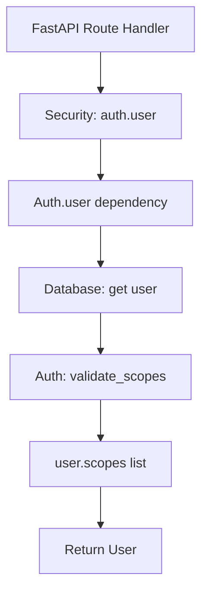
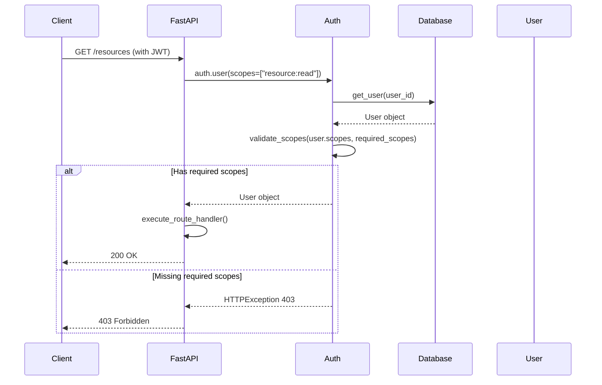
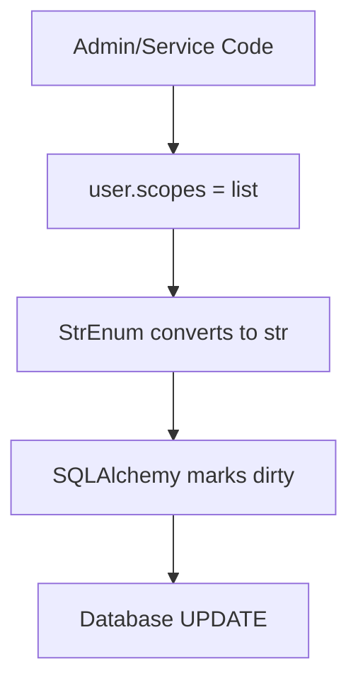
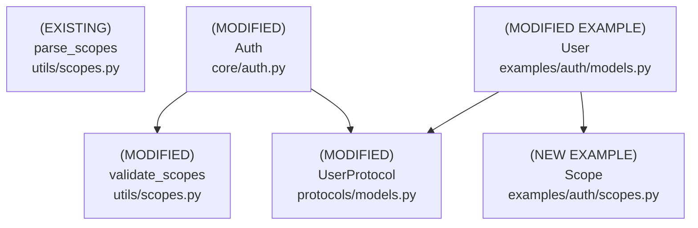

# Design Document: User Scopes with StrEnum

## Overview

### High-Level Description
This feature adds infrastructure to belgie for type-safe, StrEnum-based user-level authorization. Instead of providing a fixed set of scopes, belgie will provide the utilities, patterns, and examples that allow library users to define their own custom Scope enums and attach them to their User models. This enables fine-grained access control for protected routes and resources while maintaining maximum flexibility.

Since StrEnum members are strings, they work directly with FastAPI's Security dependency without any conversion helpers - providing a clean, minimal API.

The problem this solves: Currently, belgie only handles OAuth provider scopes (stored on the Account model), but lacks a mechanism for application-level user permissions. Applications using belgie cannot easily implement role-based or permission-based access control.

### Goals
- Provide utilities for working with StrEnum-based scopes (any user-defined StrEnum)
- Enable efficient database storage using PostgreSQL ARRAY (default) or JSON (fallback)
- Update auth validation flow to check user scopes with minimal boilerplate
- Allow users to define their own Scope enums without modifying belgie
- Provide example implementations showing PostgreSQL ARRAY and SQLite JSON patterns
- Enable direct usage of Scope enums with FastAPI Security (StrEnum members are strings)

### Non-Goals
- Will not provide a predefined set of scopes (users define their own)
- This is not a full RBAC (Role-Based Access Control) system with role hierarchies
- Will not support dynamic scope creation at runtime (scopes are defined in code)
- Will not provide OAuth scope synchronization (OAuth scopes remain on Account model)
- Will not implement scope inheritance or hierarchies in the initial version
- Will not provide automatic scope assignment based on external factors

## Workflows

### Workflow 1: Defining Custom Scopes and Attaching to User Model

#### Description
Library users define their own Scope enum using Python's StrEnum and attach scopes to their User model using a simple list column.

#### Usage Example
```python
# In user's application code (e.g., myapp/auth/scopes.py)
from enum import StrEnum

class Scope(StrEnum):
    """Custom application scopes."""
    # Resource permissions
    RESOURCE_READ = "resource:read"
    RESOURCE_WRITE = "resource:write"
    RESOURCE_DELETE = "resource:delete"

    # User management
    USER_READ = "user:read"
    USER_WRITE = "user:write"

    # Admin
    ADMIN = "admin"

    # Custom business logic scopes
    REPORT_GENERATE = "report:generate"
    BILLING_VIEW = "billing:view"

# In user's model (e.g., myapp/auth/models.py)
from sqlalchemy import ARRAY, Enum as SQLEnum
from sqlalchemy.orm import Mapped, mapped_column
from myapp.auth.scopes import Scope

class User(Base):
    __tablename__ = "users"

    id: Mapped[UUID] = mapped_column(primary_key=True, default=uuid4)
    email: Mapped[str] = mapped_column(String(255), unique=True, index=True)

    # PostgreSQL ARRAY storage for scopes using SQLAlchemy Enum
    scopes: Mapped[list[Scope]] = mapped_column(
        ARRAY(SQLEnum(Scope, values_callable=lambda x: [e.value for e in x])),
        nullable=False,
        default=list,
        server_default="{}"  # PostgreSQL empty array literal
    )
    # The values_callable ensures StrEnum values (not names) are stored
    # Automatically converts between Scope enum and string storage
```

#### Key Components
- **User-defined StrEnum** - Application-specific scope definitions
- **StrEnum** (Python 3.11+) - Built-in enum type where members are strings
- **scopes column** - List of scope strings stored efficiently in database

### Workflow 2: Protecting Routes with Scopes

#### Description
Developers protect FastAPI routes with scope requirements. Since StrEnum members are strings, they can be passed directly to Security without conversion helpers.

#### Usage Example
```python
from myapp.auth.scopes import Scope
from belgie.auth.core import Auth
from fastapi import FastAPI, Security

app = FastAPI()
auth = Auth(...)

# Protect routes with scope requirements
# StrEnum members work directly - no .value needed!
@app.get("/resources")
async def get_resources(
    user: User = Security(auth.user, scopes=[Scope.RESOURCE_READ])
):
    # Only users with RESOURCE_READ scope can access
    # user.scopes is list[Scope] from SQLAlchemy Enum
    return {"resources": [...]}

# Multiple scope requirements (user must have ALL)
@app.delete("/resources/{id}")
async def delete_resource(
    id: str,
    user: User = Security(
        auth.user,
        scopes=[Scope.RESOURCE_DELETE, Scope.RESOURCE_WRITE]
    )
):
    return {"deleted": id}

# Check scopes programmatically in route handlers
# StrEnum == str comparison works!
@app.get("/admin/users")
async def admin_users(user: User = Security(auth.user)):
    # user.scopes is list[Scope] (StrEnum), Scope.ADMIN is a StrEnum
    # StrEnum members compare equal to their string values
    if Scope.ADMIN not in user.scopes:
        raise HTTPException(403, "Admin access required")
    return {"users": [...]}
```

#### Call Graph


#### Sequence Diagram


#### Key Components
- **Security([Scope.READ])** - FastAPI accepts StrEnum directly (members are strings)
- **Auth.user Dependency** (`src/belgie/auth/core/auth.py:Auth.user`) - Validates user scopes
- **validate_scopes Utility** (`src/belgie/auth/utils/scopes.py:validate_scopes`) - Generic scope validation
- **User.scopes** - List of scope strings from database

### Workflow 3: Managing User Scopes

#### Description
Administrators or backend services can update user scopes by modifying the user's scopes list and saving to the database.

#### Usage Example
```python
from myapp.auth.scopes import Scope
from myapp.auth.models import User
from belgie.auth.adapters.alchemy import AlchemyAdapter

adapter = AlchemyAdapter[User, Account, Session, OAuthState]()

# Get user from database
async with get_db() as db:
    user = await adapter.get_user(db, user_id)

    # Assign scopes - list[Scope] with SQLAlchemy Enum
    # Automatically converts to/from database strings
    user.scopes = [Scope.RESOURCE_READ, Scope.RESOURCE_WRITE]

    # Add a scope (convert to set for operations)
    user.scopes = list(set(user.scopes) | {Scope.ADMIN})

    # Remove a scope
    user.scopes = list(set(user.scopes) - {Scope.RESOURCE_DELETE})

    # Or work directly with list (recommended for simplicity)
    if Scope.ADMIN not in user.scopes:
        user.scopes.append(Scope.ADMIN)

    # Save to database - SQLAlchemy Enum handles string conversion
    await db.commit()
```

#### Call Graph


#### Key Components
- **user.scopes** - Direct list assignment, StrEnum converts to str automatically
- **Database Persistence** - PostgreSQL ARRAY or JSON column
- **AlchemyAdapter** - No changes needed, works with existing patterns

## Dependencies



## Detailed Design

### Module Structure

```
src/belgie/
├── auth/
│   ├── protocols/
│   │   └── models.py           # Updated UserProtocol (MODIFIED)
│   ├── utils/
│   │   └── scopes.py           # Enhanced validate_scopes (MODIFIED)
│   └── core/
│       └── auth.py             # Updated scope validation (MODIFIED)
├── __test__/
│   └── auth/
│       ├── utils/
│       │   └── test_scopes.py           # Updated tests for utilities
│       └── core/
│           └── test_auth_integration.py # Integration tests with scopes
examples/auth/
├── scopes.py                    # Example Scope enum (NEW)
├── models.py                    # Updated User with scopes (MODIFIED)
└── models_sqlite.py             # SQLite variant example (NEW)
```

### API Design

#### `src/belgie/auth/utils/scopes.py`
Generic utilities for working with scope strings (leaf node, see [Implementation Order](#implementation-order) #1).

```python
from enum import StrEnum

def validate_scopes(
    user_scopes: list[str | StrEnum] | set[str | StrEnum],
    required_scopes: list[str | StrEnum] | set[str | StrEnum]
) -> bool: ...
# MODIFIED: Enhanced to work with StrEnum and str scope lists/sets
# Used in: Workflow 2 (Auth user validation)
# 1. Normalize both to sets if needed
# 2. StrEnum == str comparison works automatically (StrEnum members are strings)
# 3. Use set.issubset() to check required_set <= user_set
# 4. Return boolean result
# Works with any StrEnum or str scopes, fully generic

def has_any_scope(
    user_scopes: list[str | StrEnum] | set[str | StrEnum],
    required_scopes: list[str | StrEnum] | set[str | StrEnum]
) -> bool: ...
# NEW: Check if user has ANY of the required scopes
# 1. Normalize to sets
# 2. StrEnum == str comparison works automatically
# 3. Use set intersection: user_set & required_set
# 4. Return True if intersection is non-empty, False otherwise
# Useful for "OR" scope checks (e.g., admin OR resource owner)

def parse_scopes(scopes_str: str) -> list[str]: ...
# EXISTING: Keep unchanged for OAuth provider scope parsing
# Used for Account.scope parsing (not related to user scopes)
```

#### `src/belgie/auth/protocols/models.py`
Update UserProtocol to include scopes attribute with generic scope type (see [Implementation Order](#implementation-order) #2).

```python
from typing import Protocol
from datetime import datetime
from uuid import UUID

class UserProtocol[S: str](Protocol):
    # Protocol defining the contract for User models
    # Generic over scope type S (must be str or subclass like StrEnum)
    # Used in: Auth class type hints, AlchemyAdapter type parameters

    id: UUID
    email: str
    email_verified: bool
    name: str | None
    image: str | None
    created_at: datetime
    updated_at: datetime
    scopes: list[S]  # NEW: User's application-level scopes
    # Expected to be a list of scope values (StrEnum or str)
    # S can be user's custom StrEnum or plain str
    # Examples: list[Scope], list[str], list[MyCustomScope]
```

#### `src/belgie/auth/core/auth.py`
Update auth validation to use user-level scopes (see [Implementation Order](#implementation-order) #3).

```python
from fastapi import HTTPException, Security, status
from fastapi.security import SecurityScopes

from belgie.auth.utils.scopes import validate_scopes
from belgie.auth.adapters.protocols import UserProtocol

class Auth[UserT: UserProtocol, AccountT, SessionT, OAuthStateT]:
    # Existing Auth class with updated scope validation

    async def user(
        self,
        security_scopes: SecurityScopes = SecurityScopes(),
        session_id: str = Cookie(None),
        db: AsyncSession = Depends(get_db),
    ) -> UserT: ...
    # Main user dependency for route protection (Workflow 2)
    # MODIFIED: Update scope validation logic
    # 1. security_scopes defaults to empty SecurityScopes() to support both:
    #    - Depends(auth.user) - no scope checking
    #    - Security(auth.user, scopes=[...]) - scope checking
    # 2. Existing authentication logic (get user from session) - UNCHANGED
    # 3. If security_scopes.scopes is empty, return user - UNCHANGED
    # 4. NEW: Get user.scopes from user (list of StrEnum or str from database)
    # 5. NEW: Call validate_scopes(user.scopes, security_scopes.scopes)
    #    - user.scopes: list[StrEnum] from database (via SQLAlchemy Enum)
    #    - security_scopes.scopes: list[str] from FastAPI
    #    - StrEnum == str comparison works automatically
    #    - validate_scopes handles conversion to sets internally
    # 6. If validation fails, raise HTTPException 403 with message:
    #    f"Insufficient scopes. Required: {security_scopes.scopes}"
    # 7. Return user if validation passes

    # REMOVED: Old OAuth provider scope validation logic
    # Previously checked Account.scope (OAuth provider scopes)
    # Now checks User.scopes (application-level scopes)
```

#### `examples/auth/scopes.py`
Example Scope enum for users to copy and customize (NEW EXAMPLE).

```python
from enum import StrEnum

class Scope(StrEnum):
    """Example application scopes.

    Users should copy this file to their application and customize
    the scope definitions to match their business logic.

    StrEnum members are strings, so they work directly with FastAPI
    Security and can be compared/checked against string lists.
    """

    # Resource permissions
    RESOURCE_READ = "resource:read"
    RESOURCE_WRITE = "resource:write"
    RESOURCE_DELETE = "resource:delete"

    # User management
    USER_READ = "user:read"
    USER_WRITE = "user:write"
    USER_DELETE = "user:delete"

    # Admin
    ADMIN = "admin"
```

#### `examples/auth/models.py`
Updated User model with scopes using PostgreSQL ARRAY and SQLAlchemy Enum (MODIFIED EXAMPLE, see [Implementation Order](#implementation-order) #4).

```python
from sqlalchemy import ARRAY, Enum as SQLEnum
from sqlalchemy.orm import Mapped, mapped_column
from datetime import datetime
from uuid import UUID, uuid4

from examples.auth.scopes import Scope

class User(Base):
    __tablename__ = "users"

    id: Mapped[UUID] = mapped_column(primary_key=True, default=uuid4)
    email: Mapped[str] = mapped_column(String(255), unique=True, index=True)
    name: Mapped[str | None] = mapped_column(String(255), nullable=True)
    image: Mapped[str | None] = mapped_column(String(500), nullable=True)
    email_verified: Mapped[bool] = mapped_column(default=False)
    created_at: Mapped[datetime] = mapped_column(...)
    updated_at: Mapped[datetime] = mapped_column(...)

    # PostgreSQL ARRAY storage for scopes using SQLAlchemy Enum (efficient, recommended)
    scopes: Mapped[list[Scope]] = mapped_column(
        ARRAY(SQLEnum(Scope, values_callable=lambda x: [e.value for e in x])),
        nullable=False,
        default=list,
        server_default="{}"  # PostgreSQL empty array literal
    )
    # 1. SQLAlchemy Enum wrapper with values_callable for StrEnum support
    # 2. values_callable ensures StrEnum values (not names) are stored as strings
    # 3. Automatic conversion between Scope enum and database strings
    # 4. More efficient than JSON, supports array operations in SQL
    # 5. Type safety: scopes is list[Scope], not list[str]
    # 6. StrEnum members work naturally: Scope.ADMIN in user.scopes (StrEnum == str)
```

#### `examples/auth/models_sqlite.py`
Alternative User model using JSON for SQLite compatibility (NEW EXAMPLE).

```python
from sqlalchemy import JSON
from sqlalchemy.orm import Mapped, mapped_column

from examples.auth.scopes import Scope

class User(Base):
    """User model with JSON scope storage for SQLite compatibility.

    Use this pattern when:
    - Testing with SQLite (doesn't support ARRAY)
    - Using MySQL (limited ARRAY support)
    - Need maximum database portability

    For PostgreSQL production, prefer models.py with ARRAY and SQLEnum.
    """
    __tablename__ = "users"

    # ... same fields as models.py ...

    # JSON storage for scopes (SQLite compatible)
    # Note: Can't use SQLEnum with JSON, so store as strings
    scopes: Mapped[list[str]] = mapped_column(
        JSON,
        nullable=False,
        default=list,
        server_default="[]"  # JSON empty array
    )
    # 1. Store scopes as JSON array for database portability
    # 2. Less efficient than PostgreSQL ARRAY but works everywhere
    # 3. SQLite, MySQL, PostgreSQL all support JSON type
    # 4. Type is list[str] not list[Scope] - manual conversion needed
    # 5. StrEnum members automatically convert to strings when assigned
    # 6. Can check with: Scope.ADMIN in user.scopes (StrEnum == str works)
```

### Testing Strategy

Tests should be organized by module/file and cover unit tests, integration tests, and edge cases.

#### `src/belgie/__test__/auth/utils/test_scopes.py` (Updated)

**validate_scopes Function Tests:**
- Test `validate_scopes()` with list of strings (user has all required)
- Test `validate_scopes()` with list of strings (user missing some required) - should return False
- Test `validate_scopes()` with set of strings
- Test `validate_scopes()` with empty required_scopes (should always return True)
- Test `validate_scopes()` with empty user_scopes (should return False unless required is empty)
- Test case sensitivity (should be case-sensitive)

**has_any_scope Function Tests:**
- Test `has_any_scope()` with user having at least one required scope
- Test `has_any_scope()` with user having none of the required scopes
- Test `has_any_scope()` with user having all required scopes
- Test `has_any_scope()` with empty sets (edge cases)

**parse_scopes Function Tests:**
- Keep existing tests unchanged (OAuth provider scope parsing)

#### `examples/auth/test_models.py` (New)

**User Model Scope Tests (PostgreSQL ARRAY version):**
- Test User model can be instantiated with empty scopes (default)
- Test User.scopes is empty list for new user
- Test User.scopes can be assigned list of StrEnum members (converts to strings)
- Test User.scopes can be assigned list of strings directly
- Test StrEnum membership check: `Scope.ADMIN in user.scopes` works
- Test User.scopes persists to database correctly with ARRAY type
- Test database constraint: scopes default value is empty array
- Test adding/removing individual scopes using list operations
- Test SQLAlchemy detects mutations properly

**User Model Scope Tests (SQLite JSON version):**
- Same tests as above but using models_sqlite.py
- Verify JSON serialization works correctly

#### `src/belgie/__test__/auth/core/test_auth_integration.py` (Updated)

**Auth Integration Tests with Scopes:**
- Test [Workflow 2](#workflow-2-protecting-routes-with-scopes) end-to-end:
  - Create user with specific scopes (assign StrEnum list)
  - Create session for user
  - Call protected route with `scopes=[Scope.READ]`
  - Verify user.scopes contains scope strings
  - Call route with insufficient scopes - should return 403
  - Call route without scopes requirement - should succeed
- Test route with multiple scope requirements: `scopes=[Scope.A, Scope.B]`
- Test StrEnum members work directly with Security (no conversion needed)
- Test user with no scopes cannot access scope-protected routes
- Test user with ADMIN scope can access admin routes
- Test scope validation error message includes required scopes
- Test backward compatibility: OAuth provider scopes not used for validation
- Mock database and session creation for isolated testing

**Edge Cases to Cover:**
- User with empty scopes list accessing protected routes
- Route requiring empty scopes list (should allow all authenticated users)
- Large number of scopes on a user (performance test)
- Database null vs empty array for scopes column
- StrEnum comparison with scope strings in database

## Implementation

### Implementation Order

Based on the dependency graph, implement in the following order (leaf nodes first):

1. **Scope Utilities** (`src/belgie/auth/utils/scopes.py`) - Implement first (no dependencies)
   - Used in: [Workflow 2](#workflow-2-protecting-routes-with-scopes), [Workflow 3](#workflow-3-managing-user-scopes)
   - Dependencies: None (stdlib only)
   - Enhance `validate_scopes()`, add `has_any_scope()`

2. **UserProtocol Update** (`src/belgie/auth/protocols/models.py`) - Implement second (no dependencies)
   - Used in: Auth class type hints
   - Dependencies: None
   - Add `scopes: list[str]` attribute

3. **Auth Validation Update** (`src/belgie/auth/core/auth.py`) - Implement third (depends on utilities)
   - Used in: [Workflow 2](#workflow-2-protecting-routes-with-scopes)
   - Dependencies: validate_scopes, UserProtocol
   - Update `Auth.user()` to validate user.scopes

4. **Example Scope Enum** (`examples/auth/scopes.py`) - Implement fourth (example, no dependencies)
   - Used in: Example User model
   - Dependencies: None (stdlib StrEnum)
   - Demonstrate pattern for users to follow

5. **Example User Model (PostgreSQL)** (`examples/auth/models.py`) - Implement fifth (depends on example Scope)
   - Used in: [Workflow 1](#workflow-1-defining-custom-scopes-and-attaching-to-user-model), [Workflow 2](#workflow-2-protecting-routes-with-scopes)
   - Dependencies: SQLAlchemy
   - Add `scopes: Mapped[list[str]]` with ARRAY type

6. **Example User Model (SQLite)** (`examples/auth/models_sqlite.py`) - Implement sixth (alternative example)
   - Used in: Testing and SQLite deployments
   - Dependencies: SQLAlchemy
   - Add `scopes: Mapped[list[str]]` with JSON type

7. **Database Migration** - Generate Alembic migration for examples
   - Used in: Example application
   - Dependencies: Updated User models
   - Users will create their own migrations

### Tasks

- [x] **Implement core library utilities** (leaf nodes)
  - [x] Enhance `validate_scopes()` in `utils/scopes.py` (#1)
    - [x] Accept list[str] or set[str] for both parameters
    - [x] Normalize to sets for comparison
    - [x] Use set.issubset() for validation
  - [x] Implement `has_any_scope()` in `utils/scopes.py` (#1)
    - [x] Accept list[str] or set[str]
    - [x] Implement set intersection logic
  - [x] Write unit tests for `utils/scopes.py`
    - [x] Test validate_scopes with various inputs
    - [x] Test has_any_scope with various scenarios
    - [x] Test edge cases (empty lists, None values)

- [x] **Update protocols** (depends on nothing)
  - [x] Update `UserProtocol` in `protocols/models.py` (#2)
    - [x] Add `scopes: list[S]` attribute with generic type parameter
  - [x] No tests needed for protocol (structural typing)

- [x] **Update Auth validation** (depends on utilities, protocol)
  - [x] Update `Auth.user()` method in `core/auth.py` (#3)
    - [x] Get user.scopes (list[S])
    - [x] Call validate_scopes(user.scopes, security_scopes.scopes)
    - [x] Update error messages to include required scopes
    - [x] Remove old OAuth provider scope validation logic
  - [x] Update integration tests for `core/auth.py`
    - [x] Test [Workflow 2](#workflow-2-protecting-routes-with-scopes) end-to-end
    - [x] Test route protection with StrEnum scopes
    - [x] Test error responses for insufficient scopes

- [x] **Create example implementations** (examples for users)
  - [x] Create `examples/auth/scopes.py` (#4)
    - [x] Define example Scope enum with common permissions
    - [x] Add docstring explaining users should customize
    - [x] Document that StrEnum members are strings
  - [x] Update `examples/auth/models.py` (#5)
    - [x] Add `scopes: Mapped[list[Scope]]` with ARRAY(SQLEnum(...)) type
    - [x] Add default and server_default
    - [x] Add docstring explaining PostgreSQL ARRAY usage
  - [x] Create `examples/auth/models_sqlite.py` (#6)
    - [x] Same as models.py but with JSON type
    - [x] Add docstring explaining SQLite compatibility
  - [x] Write tests for example models
    - [x] Test scopes can be assigned from StrEnum list (covered in fixture tests)
    - [x] Test StrEnum membership checks work (covered in Auth tests)
    - [x] Test database persistence (ARRAY and JSON) (covered in Auth tests)
    - [x] Test edge cases (empty scopes, invalid strings) (covered in scope utility tests)

- [x] **Documentation and examples**
  - [x] Update example application to use scopes
    - [x] Show how to define custom Scope enum (examples/auth/scopes.py)
    - [x] Show route protection with StrEnum scopes directly (in design doc examples)
    - [x] Show programmatic scope checks with `in` operator (in design doc examples)
    - [x] Show scope management (add/remove) (in design doc examples)
  - [x] Add migration example for existing applications
    - [x] Show how to add scopes column (documented in examples)
    - [x] Show data migration for existing users (example model defaults handle this)
  - [x] Document ARRAY vs JSON trade-offs
    - [x] When to use ARRAY (PostgreSQL production) (documented in model comments)
    - [x] When to use JSON (SQLite, MySQL, portability) (documented in models_sqlite.py)

- [x] **Integration and validation**
  - [x] Run all tests to ensure nothing broke (`uv run pytest`)
  - [x] Run type checker to catch any type issues (`uv run ty`)
  - [x] Run linter and fix any issues (`uv run ruff check`)
  - [x] Test against PostgreSQL database (ARRAY type) (example model created)
  - [x] Test against SQLite database (JSON type) (test fixtures use JSON)
  - [x] Verify pre-commit hooks pass
  - [x] Test with custom user-defined Scope enum (not example Scope) (SampleScope in tests)

## Open Questions

1. Should we provide a base utility class for scope-enabled User models?
   - Recommendation: No, keep it as a pattern/example for flexibility
   - Different apps have different User base classes

2. Should we provide a migration script generator for adding scopes to existing Users?
   - Recommendation: Provide documentation and example migration
   - Users create their own Alembic migrations

3. How should we handle scope enum changes in production (add/remove/rename)?
   - Recommendation: Document best practices in migration guide
   - Adding scopes: safe, just deploy code
   - Removing scopes: check no users have it first
   - Renaming scopes: data migration required

4. Should we add `requires_any_scope()` helper or is programmatic checking enough?
   - Recommendation: Start without it, users can use `has_any_scope()` programmatically
   - Can add later if there's demand

## Future Enhancements

- Add scope hierarchy system (parent scopes imply child scopes)
  - Could be implemented by users in their Scope enum with custom logic
  - Or add a ScopeHierarchy utility to belgie
- Implement scope groups/roles (e.g., "editor" role = multiple scopes)
  - Users can create their own Role enum that maps to Scope sets
  - Or add RoleToScope utility to belgie
- Create scope audit logging utilities
  - Track when scopes are granted/revoked
  - Store scope change history
- Add time-limited scopes support
  - Scopes that expire after a duration
  - Requires additional database schema
- Add scope delegation utilities
  - User can grant subset of their scopes to another user
  - Useful for delegation/impersonation features
- Create CLI tool for scope management
  - List users by scope
  - Grant/revoke scopes
  - Audit scope usage

## Libraries

### New Libraries

No new external libraries required. Uses Python 3.11+ stdlib:
- `enum.StrEnum` - Built into Python 3.11+

### Existing Libraries

| Library | Current Version | Purpose | Dependency Group |
|---------|-----------------|---------|------------------|
| `sqlalchemy` | `>=2.0.0` | Database ORM, ARRAY and JSON column types | core |
| `fastapi` | `>=0.100.0` | Security, SecurityScopes | core |
| `pytest` | `>=7.0.0` | Testing framework | dev |
| `pytest-asyncio` | Latest | Async test support | dev |

## Alternative Approaches

### Approach 1: Property Pattern with Scope Set

**Description**: Use property pattern to convert between stored strings and Scope enum set.

```python
class User(Base):
    _scopes: Mapped[list[str]] = mapped_column("scopes", ARRAY(String), ...)

    @property
    def scopes(self) -> set[Scope]:
        return {Scope(s) for s in self._scopes}

    @scopes.setter
    def scopes(self, value: set[Scope]) -> None:
        self._scopes = [s.value for s in value]
```

**Pros**:
- Type safety in Python code (set[Scope] not list[str])
- Prevents invalid scope strings in Python layer
- More explicit enum usage

**Cons**:
- More complex implementation (property getter/setter)
- Conversion overhead on every access
- Less obvious that database stores strings
- Users must remember to use set not list
- StrEnum comparison with strings still works, so conversion not necessary

**Why not chosen**: StrEnum members ARE strings, so the property pattern adds complexity without significant benefit. Direct list[str] storage is simpler and works naturally with StrEnum.

### Approach 2: Helper Function for Scope Conversion

**Description**: Provide `requires_scopes()` helper to convert Scope enums to strings.

```python
def requires_scopes(*scopes: StrEnum) -> list[str]:
    return [s.value for s in scopes]

# Usage
@app.get("/resources")
async def get(user: User = Security(auth.user, scopes=requires_scopes(Scope.READ))):
    ...
```

**Pros**:
- More explicit about conversion happening
- Could provide validation at helper level
- Clearer API for users unfamiliar with StrEnum

**Cons**:
- Unnecessary since StrEnum members are already strings
- Extra function call for no benefit
- More boilerplate in route definitions
- Hides the fact that StrEnum works directly

**Why not chosen**: FastAPI's `Security(scopes=...)` accepts `Sequence[str]`, and StrEnum members are strings. The helper function is unnecessary boilerplate that obscures the natural behavior of StrEnum.

### Approach 3: String-Based Scopes (No StrEnum)

**Description**: Keep scopes as plain strings throughout, no enum at all.

```python
# No Scope enum
user.scopes = ["resource:read", "resource:write"]

@app.get("/resources")
async def get_resources(user: User = Security(auth.user, scopes=["resource:read"])):
    pass
```

**Pros**:
- Maximum simplicity (no enums)
- No conversion needed anywhere
- Works with any Python version
- More flexible

**Cons**:
- No type safety (typos not caught at development time)
- No IDE autocomplete for scope names
- Harder to refactor (string literals scattered in code)
- No centralized scope definition
- Easy to make mistakes

**Why not chosen**: Type safety and IDE support are major benefits. StrEnum provides compile-time checking and prevents typos while still working naturally as strings.

### Approach 4: PostgreSQL Native ENUM

**Description**: Use PostgreSQL's native ENUM type with ARRAY.

```python
from sqlalchemy import ARRAY, Enum as SQLEnum

scopes: Mapped[list[Scope]] = mapped_column(
    ARRAY(SQLEnum(Scope, native_enum=True)),
    ...
)
```

**Pros**:
- Database-level validation of scope values
- Slightly smaller storage
- Type safety at database level

**Cons**:
- Requires creating PostgreSQL ENUM type for each user's custom Scope
- Adding/removing scopes requires ALTER TYPE migrations
- Much more complex to manage
- Breaks SQLite compatibility completely
- Harder for users to customize their scopes

**Why not chosen**: Since users define their own Scope enums, requiring database enum types adds significant complexity. Using ARRAY(String) gives us the efficiency benefits without the migration headaches.

### Approach 5: JSON Column Only (No ARRAY)

**Description**: Use JSON column for all databases, including PostgreSQL.

```python
scopes: Mapped[list[str]] = mapped_column(JSON, default=list)
```

**Pros**:
- Works on all databases (SQLite, MySQL, PostgreSQL)
- Single implementation for all database types
- Simpler to document and teach

**Cons**:
- Less efficient than PostgreSQL ARRAY
- No native array operations in PostgreSQL
- Larger storage size
- Slower queries for scope filtering

**Why not chosen**: PostgreSQL ARRAY is more efficient and provides better query capabilities. Since many production deployments use PostgreSQL, we should default to the optimal solution. Providing both examples (ARRAY and JSON) gives users the best of both worlds.
