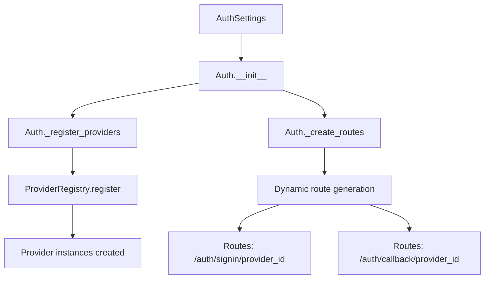
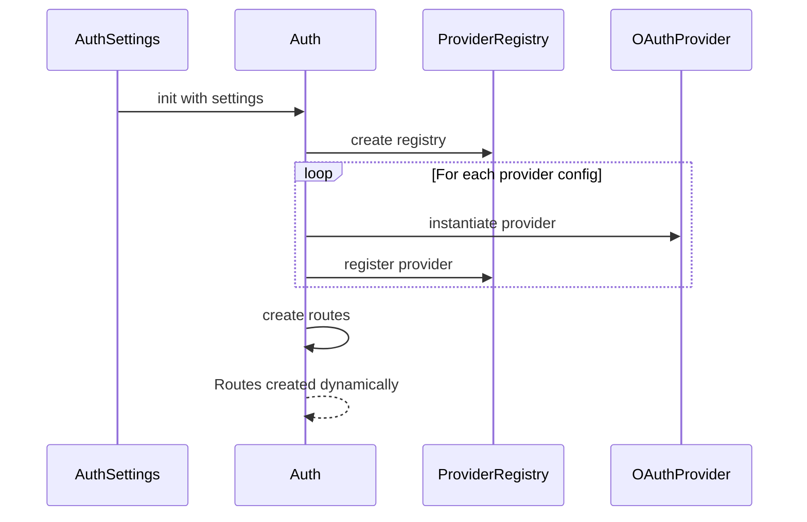
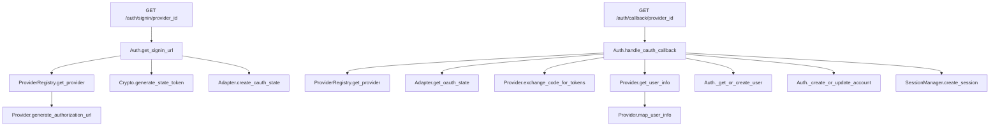
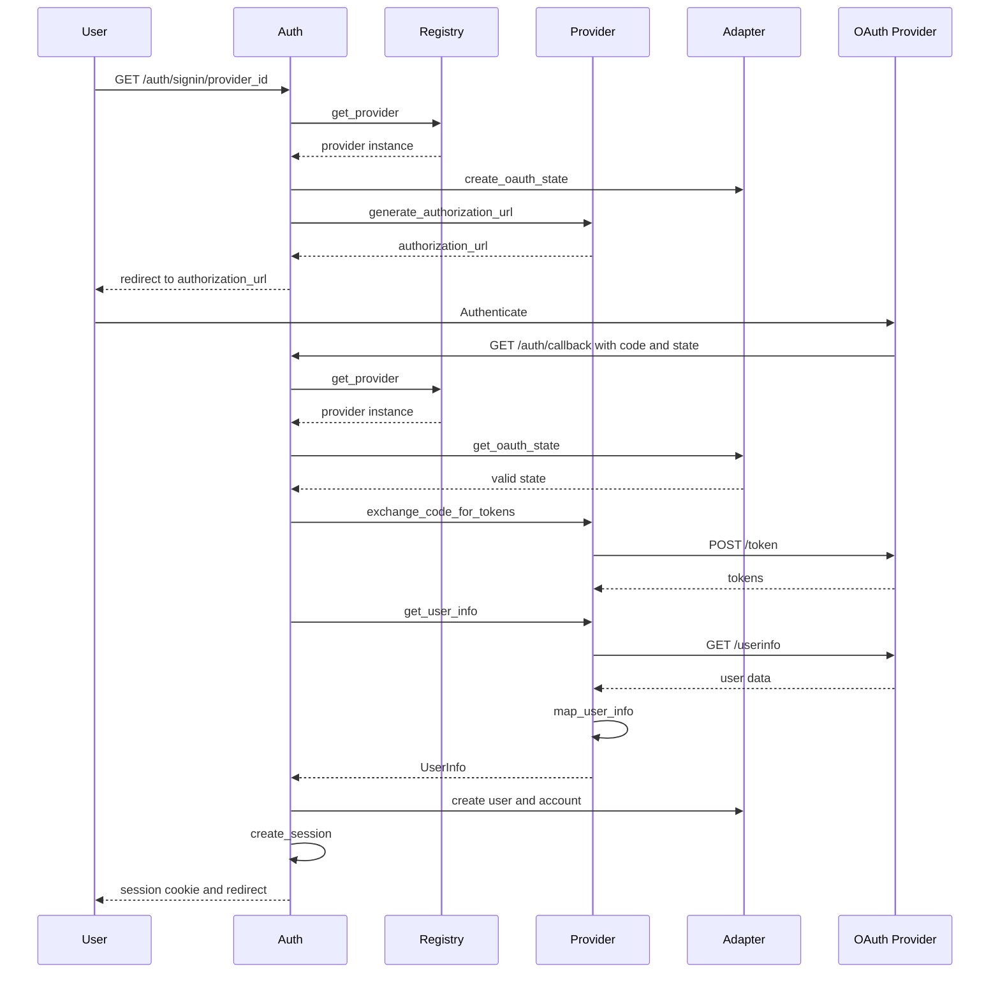
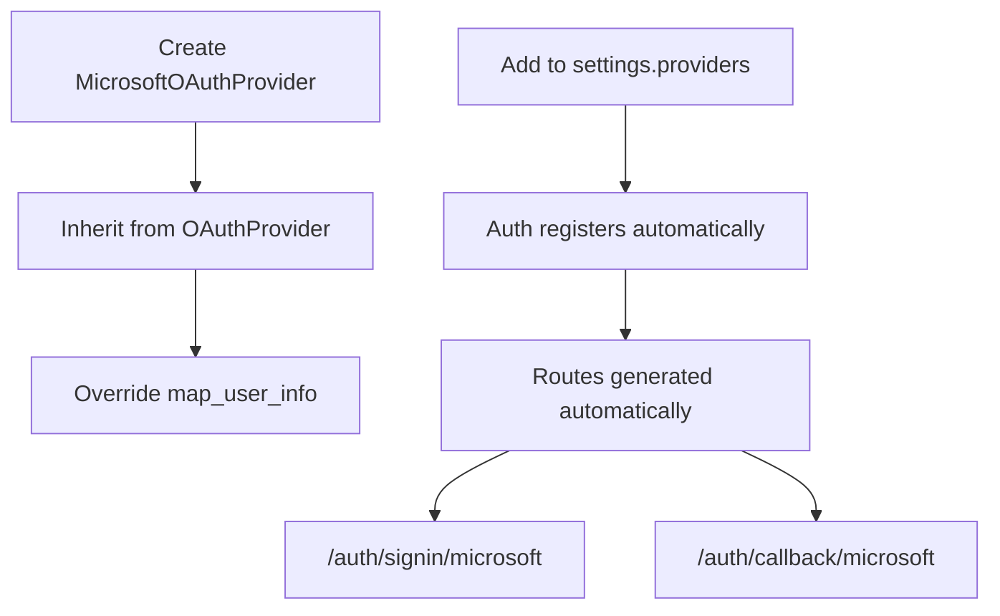
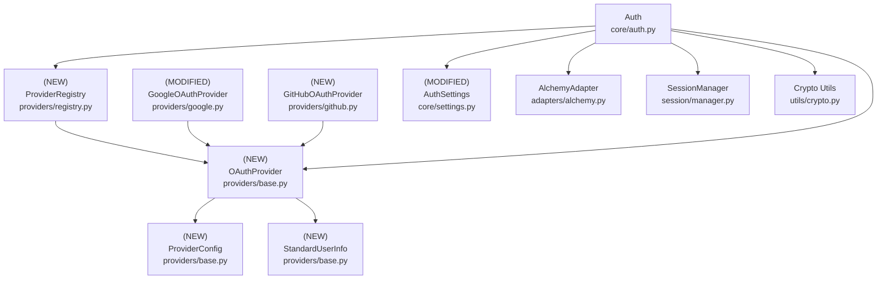

# Design Document: Generic OAuth2 Provider System

## Overview

### High-Level Description

This feature refactors the current OAuth implementation to support multiple OAuth2 providers through a generic, extensible architecture. Currently, the system is tightly coupled to Google OAuth with provider-specific methods, types, and routes. This redesign will introduce a provider abstraction layer that allows adding new OAuth providers (GitHub, Microsoft, etc.) with minimal code duplication.

The problem this solves: Each new OAuth provider currently requires duplicating the entire OAuth flow logic, creating provider-specific methods in the Auth class, hardcoded route endpoints, and separate settings classes. This approach doesn't scale and violates DRY principles.

Inspired by better-auth's plugin architecture and generic OAuth implementation, this design introduces:
- A provider protocol defining the OAuth provider interface
- A provider registry for dynamic provider management
- Generic route generation based on registered providers
- Unified user info mapping abstraction
- Declarative provider configuration

### Goals

- Create a provider protocol that defines the standard OAuth2 flow interface
- Implement a provider registry pattern for managing multiple providers
- Make the Auth class provider-agnostic (no hardcoded provider methods)
- Enable adding new providers with only configuration and field mapping
- Support provider-specific customizations (scopes, parameters, endpoints)
- Maintain backwards compatibility with existing Google OAuth implementation
- Generate routes dynamically based on registered providers

### Non-Goals

- Will not implement PKCE support initially (can be added later)
- Will not support OAuth 1.0 providers (only OAuth 2.0)
- Will not implement token refresh logic in this iteration
- Will not add OIDC discovery endpoints initially (manual configuration only)
- Will not change the database schema or adapter interface

## Workflows

### Workflow 1: Provider Registration and Configuration

#### Description

Developers configure OAuth providers declaratively in settings, and the system automatically registers them and generates routes.

#### Usage Example

```python
from belgie.auth import Auth, AuthSettings
from belgie.auth.core.settings import GoogleProviderSettings, GitHubProviderSettings

# Settings configuration (from environment or code)
# Dicts match the TypedDict structure for type safety
settings = AuthSettings(
    providers={
        "google": {
            "client_id": "google_client_id",
            "client_secret": "google_secret",
            "redirect_uri": "http://localhost:8000/auth/callback/google",
            "scopes": ["openid", "email", "profile"],
            "access_type": "offline",  # Google-specific (GoogleProviderSettings)
            "prompt": "consent",        # Google-specific (GoogleProviderSettings)
        },
        "github": {
            "client_id": "github_client_id",
            "client_secret": "github_secret",
            "redirect_uri": "http://localhost:8000/auth/callback/github",
            "scopes": ["user:email", "read:user"],
            "allow_signup": True,  # GitHub-specific (GitHubProviderSettings)
        }
    }
)

# For explicit type checking, you can use TypedDict:
google_config: GoogleProviderSettings = {
    "client_id": "google_client_id",
    "client_secret": "google_secret",
    "redirect_uri": "http://localhost:8000/auth/callback/google",
    "scopes": ["openid", "email", "profile"],
    "access_type": "offline",
    "prompt": "consent",
}

# Auth automatically registers providers and generates routes
auth = Auth(settings=settings, adapter=adapter)

# Routes are automatically created:
# GET /auth/signin/{provider_id}
# GET /auth/callback/{provider_id}
```

#### Call Graph



#### Sequence Diagram



#### Key Components

- **AuthSettings** (`settings.py:AuthSettings`) - Provider configuration container
- **ProviderRegistry** (`providers/registry.py:ProviderRegistry`) - Provider management
- **Auth._register_providers** (`core/auth.py:Auth._register_providers`) - Provider registration logic
- **Auth._create_routes** (`core/auth.py:Auth._create_routes`) - Dynamic route generation

### Workflow 2: OAuth Sign-In Flow

#### Description

User initiates sign-in with any registered OAuth provider, the system generates authorization URL with state, redirects to provider, handles callback, and creates session.

#### Usage Example

```python
# User visits: GET /auth/signin/github
# System generates authorization URL and redirects

# Provider redirects back to: GET /auth/callback/github?code=xyz&state=abc
# System validates state, exchanges code for tokens, creates user/session

# From the Auth class perspective:
session, user = await auth.handle_oauth_callback(
    db=db,
    provider_id="github",
    code="authorization_code",
    state="state_token"
)
# Works for any registered provider (google, github, microsoft, etc.)
```

#### Call Graph



#### Sequence Diagram



#### Key Components

- **Auth.get_signin_url** (`core/auth.py:Auth.get_signin_url`) - Generic sign-in URL generation
- **Auth.handle_oauth_callback** (`core/auth.py:Auth.handle_oauth_callback`) - Generic callback handler
- **OAuthProvider** (`providers/base.py:OAuthProvider`) - Provider protocol implementation
- **ProviderRegistry** (`providers/registry.py:ProviderRegistry`) - Provider lookup

### Workflow 3: Adding a New OAuth Provider

#### Description

Developer adds a new OAuth provider by creating a provider class and configuration. No changes needed to Auth class or routes.

#### Usage Example

```python
# Step 1: Create provider class (only need URLs and field mapping)
from belgie.auth.providers.base import OAuthProvider, ProviderConfig, StandardUserInfo

class MicrosoftOAuthProvider(OAuthProvider):
    def __init__(self, config: ProviderConfig) -> None:
        super().__init__(
            config=config,
            authorization_url="https://login.microsoftonline.com/common/oauth2/v2.0/authorize",
            token_url="https://login.microsoftonline.com/common/oauth2/v2.0/token",
            user_info_url="https://graph.microsoft.com/v1.0/me",
        )

    def map_user_info(self, user_data: dict[str, Any]) -> StandardUserInfo:
        # Map Microsoft fields to standard fields
        return StandardUserInfo(
            provider_user_id=user_data["id"],
            email=user_data.get("mail") or user_data.get("userPrincipalName"),
            email_verified=True,  # Microsoft emails are verified
            name=user_data.get("displayName"),
            picture=None,  # Not provided by default
        )

# Step 2: Add to settings
settings = AuthSettings(
    providers={
        "microsoft": {
            "client_id": "ms_client_id",
            "client_secret": "ms_secret",
            "redirect_uri": "http://localhost:8000/auth/callback/microsoft",
            "scopes": ["openid", "email", "profile"],
        }
    }
)

# Step 3: That's it! Routes and functionality work automatically
```

#### Call Graph



#### Key Components

- **OAuthProvider** (`providers/base.py:OAuthProvider`) - Base class with common OAuth logic
- **ProviderConfig** (`providers/base.py:ProviderConfig`) - Provider configuration dataclass
- **StandardUserInfo** (`providers/base.py:StandardUserInfo`) - Normalized user info structure

## Dependencies



## Detailed Design

### Module Structure

```
src/belgie/auth/
├── core/
│   ├── auth.py                 # (MODIFIED) Auth class - remove Google-specific code
│   ├── settings.py             # (MODIFIED) Generic provider settings with env loading
│   ├── exceptions.py           # (MODIFIED) Add ProviderNotFoundError
│   └── helpers.py              # (NEW) Helper functions for provider URLs and config
├── providers/
│   ├── __init__.py             # (MODIFIED) Export new classes
│   ├── base.py                 # (NEW) OAuthProvider base class and protocols
│   ├── registry.py             # (NEW) ProviderRegistry for provider management
│   ├── google.py               # (MODIFIED) Refactor to use OAuthProvider base
│   └── github.py               # (NEW) GitHub OAuth provider implementation
└── __test__/
    └── auth/
        ├── providers/
        │   ├── test_base.py                    # Unit tests for OAuthProvider
        │   ├── test_registry.py                # Unit tests for ProviderRegistry
        │   ├── test_google.py                  # Unit tests for Google provider
        │   ├── test_github.py                  # Unit tests for GitHub provider
        │   └── test_providers_integration.py   # Integration tests
        └── core/
            ├── test_auth_generic_providers.py  # Integration tests for Auth
            └── test_helpers.py                 # Unit tests for helper functions
```

### API Design

#### `src/belgie/auth/providers/base.py`

Base classes, protocols, and data structures for OAuth providers (leaf node, see [Implementation Order](#implementation-order) #1).

```python
from abc import ABC, abstractmethod
from dataclasses import dataclass
from typing import Any, Protocol

import httpx

@dataclass(slots=True, kw_only=True)
class ProviderConfig:
    # Used in: Workflow 1, 3 (provider configuration)
    # Runtime dataclass created from BaseProviderSettings TypedDict

    client_id: str
    # OAuth client ID from provider

    client_secret: str
    # OAuth client secret from provider

    redirect_uri: str
    # Callback URL for OAuth flow

    scopes: list[str]
    # OAuth scopes to request (defaults to empty list if not provided)

    extra_params: dict[str, str] | None = None
    # Provider-specific extra parameters (e.g., prompt, access_type)
    # Populated from provider-specific TypedDict fields (GoogleProviderSettings, GitHubProviderSettings)

@dataclass(slots=True, kw_only=True)
class StandardUserInfo:
    # Used in: Workflow 2 (normalized user info)

    provider_user_id: str
    # Unique user ID from OAuth provider

    email: str
    # User's email address

    email_verified: bool
    # Whether email is verified by provider

    name: str | None = None
    # User's full name

    picture: str | None = None
    # URL to user's profile picture

@dataclass(slots=True, kw_only=True)
class TokenData:
    # Used in: Workflow 2 (token exchange result)

    access_token: str
    # OAuth access token

    token_type: str
    # Token type (usually "Bearer")

    expires_at: datetime | None = None
    # Token expiration timestamp

    refresh_token: str | None = None
    # Refresh token for token renewal

    scope: str | None = None
    # Granted scopes (may differ from requested)

    id_token: str | None = None
    # OIDC ID token (if applicable)

class OAuthProvider(ABC):
    # Used in: Workflow 2, 3 (provider implementations)
    # Base class implementing common OAuth 2.0 flow

    def __init__(
        self,
        config: ProviderConfig,
        authorization_url: str,
        token_url: str,
        user_info_url: str,
    ) -> None: ...
    # 1. Store config as self.config
    # 2. Store authorization_url, token_url, user_info_url
    # 3. Initialize httpx client for reuse: self.http_client = httpx.AsyncClient()
    # 4. Called by subclasses in Workflow 3

    @property
    def provider_id(self) -> str: ...
    # 1. Return lowercase class name without "OAuthProvider" suffix
    # 2. Example: "GoogleOAuthProvider" -> "google"
    # 3. Used by registry as provider identifier
    # Can be overridden by subclasses if needed

    def generate_authorization_url(self, state: str) -> str: ...
    # 1. Build query parameters dict with client_id, redirect_uri, response_type, scope, state
    # 2. Merge config.extra_params if present (for provider-specific params)
    # 3. Join scopes with space: " ".join(self.config.scopes)
    # 4. Use urlencode() to create query string
    # 5. Return f"{self.authorization_url}?{query_string}"
    # Used in: Workflow 2 (sign-in URL generation)

    async def exchange_code_for_tokens(self, code: str) -> TokenData: ...
    # 1. Build request body: client_id, client_secret, code, grant_type, redirect_uri
    # 2. Make POST request to self.token_url using self.http_client
    # 3. Check response.raise_for_status() for HTTP errors
    # 4. Parse JSON response
    # 5. Calculate expires_at from expires_in if present
    # 6. Return TokenData with access_token, refresh_token, expires_at, etc.
    # Used in: Workflow 2 (token exchange step)

    async def get_user_info(self, access_token: str) -> dict[str, Any]: ...
    # 1. Create Authorization header: f"Bearer {access_token}"
    # 2. Make GET request to self.user_info_url with headers
    # 3. Check response.raise_for_status() for HTTP errors
    # 4. Return response.json() (raw provider data)
    # Used in: Workflow 2 (fetching user data)

    @abstractmethod
    def map_user_info(self, user_data: dict[str, Any]) -> StandardUserInfo: ...
    # 1. Extract provider-specific fields from user_data
    # 2. Map to StandardUserInfo fields (email, name, picture, etc.)
    # 3. Return StandardUserInfo instance
    # MUST be implemented by each provider subclass
    # Used in: Workflow 2 (normalizing user data)

    async def close(self) -> None: ...
    # 1. Close self.http_client connection
    # 2. Called during shutdown for cleanup
```

#### `src/belgie/auth/providers/registry.py`

Provider registry for managing and looking up OAuth providers (see [Implementation Order](#implementation-order) #2).

```python
from belgie.auth.core.exceptions import ProviderNotFoundError
from belgie.auth.providers.base import OAuthProvider

class ProviderRegistry:
    # Used in: Workflow 1, 2 (provider management)

    def __init__(self) -> None: ...
    # 1. Initialize empty dict: self._providers = {}
    # 2. Stores provider instances keyed by provider_id

    def register(self, provider_id: str, provider: OAuthProvider) -> None: ...
    # 1. Validate provider is OAuthProvider instance
    # 2. Check provider_id not already registered (raise error if duplicate)
    # 3. Store in self._providers[provider_id] = provider
    # Used in: Workflow 1 (provider registration)

    def get_provider(self, provider_id: str) -> OAuthProvider: ...
    # 1. Look up provider in self._providers
    # 2. If not found, raise ProviderNotFoundError(f"Provider '{provider_id}' not found")
    # 3. Return provider instance
    # Used in: Workflow 2 (provider lookup during OAuth flow)

    def has_provider(self, provider_id: str) -> bool: ...
    # 1. Return provider_id in self._providers
    # Used for checking if provider exists

    def list_providers(self) -> list[str]: ...
    # 1. Return list(self._providers.keys())
    # Used for debugging and displaying available providers

    def unregister(self, provider_id: str) -> None: ...
    # 1. Remove provider from self._providers if exists
    # 2. Call provider.close() to clean up resources
    # Used for cleanup or testing
```

#### `src/belgie/auth/core/exceptions.py`

Add new exception type for provider errors.

```python
# Add to existing file

class ProviderNotFoundError(Exception):
    # Used in: Workflow 2 (when provider_id doesn't exist)
    def __init__(self, message: str) -> None: ...
    # 1. Store message
    # 2. Call super().__init__(message)
```

#### `src/belgie/auth/core/settings.py`

Modified settings to support multiple providers generically using TypedDict (see [Implementation Order](#implementation-order) #4).

```python
from typing import Any, NotRequired, TypedDict

from pydantic import Field
from pydantic_settings import BaseSettings, SettingsConfigDict

# Remove GoogleOAuthSettings class

class BaseProviderSettings(TypedDict):
    # Base TypedDict documenting required OAuth provider fields
    # Not used directly - serves as documentation for provider structure
    # Actual provider classes inherit from BaseSettings, not this TypedDict

    client_id: str
    # OAuth client ID

    client_secret: str
    # OAuth client secret

    redirect_uri: str
    # OAuth redirect/callback URI

    scopes: NotRequired[list[str]]
    # OAuth scopes to request (optional, defaults to empty list)

class GoogleProviderSettings(BaseSettings):
    # Google-specific provider settings
    # Uses Pydantic BaseSettings for validation and env loading

    model_config = SettingsConfigDict(
        env_prefix="BELGIE_GOOGLE_",
        env_file=".env",
        extra="ignore"
    )

    # Required fields (from BaseProviderSettings)
    client_id: str
    client_secret: str
    redirect_uri: str
    scopes: list[str] = Field(default=["openid", "email", "profile"])

    # Google-specific fields
    access_type: str = "offline"
    # Google-specific: "offline" for refresh tokens

    prompt: str = "consent"
    # Google-specific: "consent" to force re-consent

class GitHubProviderSettings(BaseSettings):
    # GitHub-specific provider settings
    # Uses Pydantic BaseSettings for validation and env loading

    model_config = SettingsConfigDict(
        env_prefix="BELGIE_GITHUB_",
        env_file=".env",
        extra="ignore"
    )

    # Required fields (from BaseProviderSettings)
    client_id: str
    client_secret: str
    redirect_uri: str
    scopes: list[str] = Field(default=["user:email", "read:user"])

    # GitHub-specific fields
    allow_signup: bool = True
    # GitHub-specific: allow new user signups

class AuthSettings(BaseSettings):
    model_config = SettingsConfigDict(
        env_prefix="BELGIE_",
        env_file=".env",
        extra="ignore"  # Ignore provider-specific env vars (they're loaded separately)
    )

    # Remove: google: GoogleOAuthSettings = Field(...)

    # Add generic providers dict
    providers: ProviderSettings = Field(default_factory=dict)
    # 1. ProviderSettings is TypedDict with NotRequired provider keys
    # 2. Each provider (google, github, etc.) is loaded from its own env vars
    # 3. Populated automatically via model_post_init from environment
    # Used in: Workflow 1 (provider registration)

    # ... rest of existing settings fields remain unchanged

    def model_post_init(self, __context) -> None: ...
    # 1. Called automatically after __init__ by Pydantic
    # 2. Load each provider's settings from environment:
    #    - Try to instantiate GoogleProviderSettings()
    #    - If successful and has client_id, add to self.providers["google"]
    #    - Repeat for GitHub, Microsoft, etc.
    # 3. Providers are loaded from env vars like:
    #    BELGIE_GOOGLE_CLIENT_ID="..."
    #    BELGIE_GITHUB_CLIENT_ID="..."
    # 4. Silently skip providers that aren't configured (missing required fields)
    # Used in: Workflow 1 (automatic provider loading)
```

#### Example `.env` File

Environment variables for configuring OAuth providers:

```bash
# Main auth settings
BELGIE_SECRET_KEY="your-secret-key-here"

# Google OAuth Provider
BELGIE_GOOGLE_CLIENT_ID="google-client-id.apps.googleusercontent.com"
BELGIE_GOOGLE_CLIENT_SECRET="google-client-secret"
BELGIE_GOOGLE_REDIRECT_URI="http://localhost:8000/auth/callback/google"
BELGIE_GOOGLE_SCOPES='["openid", "email", "profile"]'
BELGIE_GOOGLE_ACCESS_TYPE="offline"
BELGIE_GOOGLE_PROMPT="consent"

# GitHub OAuth Provider
BELGIE_GITHUB_CLIENT_ID="github-client-id"
BELGIE_GITHUB_CLIENT_SECRET="github-client-secret"
BELGIE_GITHUB_REDIRECT_URI="http://localhost:8000/auth/callback/github"
BELGIE_GITHUB_SCOPES='["user:email", "read:user"]'
BELGIE_GITHUB_ALLOW_SIGNUP="true"

# To add a new provider, just add BELGIE_{PROVIDER}_ prefixed variables
# The provider will be automatically loaded if all required fields are present
```

**Notes:**
- Each provider uses its own `env_prefix` (e.g., `BELGIE_GOOGLE_`, `BELGIE_GITHUB_`)
- Providers are automatically loaded via `model_post_init`
- Providers missing required fields are silently skipped
- List fields (like `scopes`) use JSON format in environment variables

#### `src/belgie/auth/providers/google.py`

Refactor Google provider to use base class (see [Implementation Order](#implementation-order) #5).

```python
from typing import Any

from belgie.auth.providers.base import OAuthProvider, ProviderConfig, StandardUserInfo

# Remove GoogleTokenResponse and GoogleUserInfo classes (no longer needed)

class GoogleOAuthProvider(OAuthProvider):
    # Used in: Workflow 1, 2 (Google OAuth implementation)

    def __init__(self, config: ProviderConfig) -> None: ...
    # 1. Call super().__init__() with Google URLs:
    #    authorization_url="https://accounts.google.com/o/oauth2/v2/auth"
    #    token_url="https://oauth2.googleapis.com/token"
    #    user_info_url="https://www.googleapis.com/oauth2/v2/userinfo"
    # 2. Merge Google-specific params into config.extra_params:
    #    access_type="offline", prompt="consent"

    def map_user_info(self, user_data: dict[str, Any]) -> StandardUserInfo: ...
    # 1. Extract fields from Google response format
    # 2. Return StandardUserInfo(
    #      provider_user_id=user_data["id"],
    #      email=user_data["email"],
    #      email_verified=user_data.get("verified_email", False),
    #      name=user_data.get("name"),
    #      picture=user_data.get("picture"),
    #    )
    # Used in: Workflow 2 (mapping Google user data)
```

#### `src/belgie/auth/providers/github.py`

New GitHub provider implementation (see [Implementation Order](#implementation-order) #6).

```python
from typing import Any

from belgie.auth.providers.base import OAuthProvider, ProviderConfig, StandardUserInfo

class GitHubOAuthProvider(OAuthProvider):
    # Used in: Workflow 1, 2, 3 (GitHub OAuth implementation)

    def __init__(self, config: ProviderConfig) -> None: ...
    # 1. Call super().__init__() with GitHub URLs:
    #    authorization_url="https://github.com/login/oauth/authorize"
    #    token_url="https://github.com/login/oauth/access_token"
    #    user_info_url="https://api.github.com/user"

    async def exchange_code_for_tokens(self, code: str) -> TokenData: ...
    # Override because GitHub requires Accept header
    # 1. Build request body same as base class
    # 2. Add headers: {"Accept": "application/json"}
    # 3. Make POST request to self.token_url
    # 4. Parse and return TokenData

    async def get_user_info(self, access_token: str) -> dict[str, Any]: ...
    # Override to fetch email separately (GitHub quirk)
    # 1. Fetch basic user info from /user endpoint
    # 2. If email is None/private, fetch from /user/emails endpoint
    # 3. Merge data and return

    def map_user_info(self, user_data: dict[str, Any]) -> StandardUserInfo: ...
    # 1. Extract fields from GitHub response format
    # 2. Return StandardUserInfo(
    #      provider_user_id=str(user_data["id"]),
    #      email=user_data["email"],
    #      email_verified=True,  # GitHub emails are verified
    #      name=user_data.get("name"),
    #      picture=user_data.get("avatar_url"),
    #    )
    # Used in: Workflow 2 (mapping GitHub user data)
```

#### `src/belgie/auth/core/auth.py`

Modified Auth class to be provider-agnostic (see [Implementation Order](#implementation-order) #7).

```python
from fastapi import APIRouter, Depends
from sqlalchemy.ext.asyncio import AsyncSession

from belgie.auth.core.settings import AuthSettings
from belgie.auth.providers.registry import ProviderRegistry
from belgie.auth.providers.google import GoogleOAuthProvider
from belgie.auth.providers.github import GitHubOAuthProvider

class Auth[UserT, AccountT, SessionT, OAuthStateT]:
    # Modified to remove Google-specific code

    def __init__(
        self,
        settings: AuthSettings,
        adapter: AlchemyAdapter[UserT, AccountT, SessionT, OAuthStateT],
        session_manager: SessionManager[SessionT] | None = None,
    ) -> None: ...
    # 1. Store settings, adapter, session_manager (unchanged)
    # 2. REMOVE: self.google_provider initialization
    # 3. ADD: self.provider_registry = ProviderRegistry()
    # 4. Call self._register_providers() to register all configured providers
    # 5. Continue with existing route creation
    # Modified in: Workflow 1 (provider registration)

    def _register_providers(self) -> None: ...
    # NEW METHOD
    # 1. Loop through self.settings.providers.items()
    # 2. For each (provider_id, provider_settings):
    #    - Extract base fields (client_id, client_secret, redirect_uri, scopes)
    #    - Extract provider-specific fields into extra_params dict
    #      (e.g., for Google: access_type, prompt; for GitHub: allow_signup)
    #    - Create ProviderConfig from extracted fields
    #    - Match provider_id to provider class (google -> GoogleOAuthProvider, github -> GitHubOAuthProvider)
    #    - Instantiate provider class with config
    #    - Register with self.provider_registry.register(provider_id, provider)
    # 3. Log registered providers for debugging
    # Used in: Workflow 1 (provider initialization)

    def create_router(self) -> APIRouter: ...
    # MODIFIED
    # 1. Create APIRouter (unchanged)
    # 2. REMOVE: hardcoded /auth/signin/google and /auth/callback/google routes
    # 3. ADD: Call self._create_provider_routes(router) to generate routes dynamically
    # 4. Return router
    # Modified in: Workflow 1 (dynamic route creation)

    def _create_provider_routes(self, router: APIRouter) -> None: ...
    # NEW METHOD
    # 1. For each provider_id in self.provider_registry.list_providers():
    #    - Create GET /auth/signin/{provider_id} route -> self._oauth_signin
    #    - Create GET /auth/callback/{provider_id} route -> self._oauth_callback
    # 2. Use dynamic path parameter: provider_id
    # Used in: Workflow 1 (route generation)

    async def _oauth_signin(
        self,
        provider_id: str,
        db: AsyncSession = Depends(_get_db),
    ) -> RedirectResponse: ...
    # NEW METHOD (replaces signin_google)
    # 1. Call self.get_signin_url(db, provider_id)
    # 2. Return RedirectResponse(url=signin_url)
    # Used in: Workflow 2 (generic sign-in endpoint)

    async def _oauth_callback(
        self,
        provider_id: str,
        code: str,
        state: str,
        db: AsyncSession = Depends(_get_db),
    ) -> RedirectResponse: ...
    # NEW METHOD (replaces callback_google)
    # 1. Call self.handle_oauth_callback(db, provider_id, code, state)
    # 2. Set session cookie from session data
    # 3. Return RedirectResponse to success page
    # Used in: Workflow 2 (generic callback endpoint)

    async def get_signin_url(self, db, provider_id: str) -> str: ...
    # NEW METHOD (replaces get_google_signin_url)
    # 1. Get provider from self.provider_registry.get_provider(provider_id)
    # 2. Generate state token using crypto.generate_state_token()
    # 3. Store state in database via self.adapter.create_oauth_state()
    # 4. Call provider.generate_authorization_url(state)
    # 5. Return authorization URL
    # Used in: Workflow 2 (generic sign-in URL generation)

    async def handle_oauth_callback(
        self,
        db,
        provider_id: str,
        code: str,
        state: str,
    ) -> tuple[SessionT, UserT]: ...
    # MODIFIED METHOD (replaces handle_google_callback)
    # 1. Get provider from self.provider_registry.get_provider(provider_id)
    # 2. Validate state token (unchanged logic)
    # 3. Call provider.exchange_code_for_tokens(code)
    # 4. Call provider.get_user_info(token_data.access_token)
    # 5. Call provider.map_user_info(user_data) to get StandardUserInfo
    # 6. Call self._get_or_create_user(db, user_info) with StandardUserInfo
    # 7. Call self._create_or_update_account(db, user, provider_id, tokens)
    # 8. Create session and return (unchanged logic)
    # Used in: Workflow 2 (generic callback handling)

    async def _get_or_create_user(self, db, user_info: StandardUserInfo) -> UserT: ...
    # MODIFIED METHOD
    # 1. CHANGE parameter type from GoogleUserInfo to StandardUserInfo
    # 2. Use standardized field names: user_info.email, user_info.email_verified, user_info.name, user_info.picture
    # 3. Rest of logic unchanged
    # Used in: Workflow 2 (user creation from normalized data)

    # REMOVE: get_google_signin_url() - replaced by get_signin_url()
    # REMOVE: handle_google_callback() - replaced by handle_oauth_callback()
```

#### `src/belgie/auth/helpers.py`

Helper functions for working with OAuth providers (see [Implementation Order](#implementation-order) #8).

```python
from belgie.auth.core.auth import Auth

def get_provider_urls(auth: Auth, provider_id: str, base_url: str = "") -> dict[str, str]:
    # Get OAuth endpoint URLs for a specific provider
    # Used for: Generating links in UI, API documentation, testing

    # 1. Validate provider exists: auth.provider_registry.has_provider(provider_id)
    # 2. If not found, raise ProviderNotFoundError
    # 3. Build URLs using base_url + path:
    #    signin_url = f"{base_url}/auth/signin/{provider_id}"
    #    callback_url = f"{base_url}/auth/callback/{provider_id}"
    # 4. Return dict with signin_url and callback_url
    # Example: get_provider_urls(auth, "google", "http://localhost:8000")
    #   -> {"signin_url": "http://localhost:8000/auth/signin/google",
    #       "callback_url": "http://localhost:8000/auth/callback/google"}

def get_all_provider_urls(auth: Auth, base_url: str = "") -> dict[str, dict[str, str]]:
    # Get OAuth endpoint URLs for all registered providers
    # Used for: API documentation, frontend configuration

    # 1. Get all provider IDs from auth.provider_registry.list_providers()
    # 2. For each provider_id, call get_provider_urls()
    # 3. Return dict mapping provider_id to URLs
    # Example: get_all_provider_urls(auth, "http://localhost:8000")
    #   -> {
    #        "google": {"signin_url": "...", "callback_url": "..."},
    #        "github": {"signin_url": "...", "callback_url": "..."}
    #      }

def get_provider_config(auth: Auth, provider_id: str) -> dict[str, Any]:
    # Get provider configuration details (non-sensitive info only)
    # Used for: Debugging, API introspection

    # 1. Get provider from auth.provider_registry.get_provider(provider_id)
    # 2. Extract non-sensitive info:
    #    - provider_id
    #    - scopes (from provider.config.scopes)
    #    - authorization_url, token_url (but not secrets)
    # 3. Return dict with configuration
    # Example: get_provider_config(auth, "google")
    #   -> {
    #        "provider_id": "google",
    #        "scopes": ["openid", "email", "profile"],
    #        "authorization_endpoint": "https://accounts.google.com/o/oauth2/v2/auth"
    #      }
    # NOTE: Never expose client_secret or tokens

def list_available_providers(auth: Auth) -> list[str]:
    # List all registered and available providers
    # Used for: UI rendering, API discovery

    # 1. Return auth.provider_registry.list_providers()
    # Simple wrapper for convenience
    # Example: list_available_providers(auth)
    #   -> ["google", "github"]
```

### Testing Strategy

Tests should be organized by module/file and cover unit tests, integration tests, and edge cases.

#### `test_base.py`

**OAuthProvider Base Class Tests:**
- Test `OAuthProvider.__init__()` stores config and URLs correctly
- Test `provider_id` property returns correct ID from class name
- Test `generate_authorization_url()` builds correct URL with parameters
- Test `generate_authorization_url()` includes extra_params from config
- Test `exchange_code_for_tokens()` makes correct HTTP request
- Test `exchange_code_for_tokens()` parses token response correctly
- Test `exchange_code_for_tokens()` calculates expires_at from expires_in
- Test `exchange_code_for_tokens()` handles missing optional fields (refresh_token, id_token)
- Test `get_user_info()` makes correct HTTP request with Authorization header
- Test `get_user_info()` returns raw JSON response
- Test `close()` method closes HTTP client
- Use httpx mock for testing HTTP requests

**ProviderConfig and StandardUserInfo Tests:**
- Test dataclass instantiation with valid data
- Test dataclass with missing optional fields
- Test dataclass immutability (slots=True, frozen if applicable)

#### `test_registry.py`

**ProviderRegistry Tests:**
- Test `register()` adds provider successfully
- Test `register()` raises error on duplicate provider_id
- Test `register()` validates provider is OAuthProvider instance
- Test `get_provider()` returns correct provider
- Test `get_provider()` raises ProviderNotFoundError for unknown provider
- Test `has_provider()` returns True for registered providers
- Test `has_provider()` returns False for unregistered providers
- Test `list_providers()` returns all registered provider IDs
- Test `unregister()` removes provider and calls close()
- Use mock providers for testing

#### `test_google.py`

**GoogleOAuthProvider Tests:**
- Test `__init__()` sets correct Google URLs
- Test `__init__()` merges Google-specific extra_params (access_type, prompt)
- Test `map_user_info()` correctly maps Google user data to StandardUserInfo
- Test `map_user_info()` handles missing optional fields (name, picture)
- Test `map_user_info()` sets email_verified from Google's verified_email field
- Use mock user data representing Google API responses

#### `test_github.py`

**GitHubOAuthProvider Tests:**
- Test `__init__()` sets correct GitHub URLs
- Test `exchange_code_for_tokens()` includes Accept header
- Test `get_user_info()` fetches email from /user/emails if needed
- Test `get_user_info()` handles public email case
- Test `map_user_info()` correctly maps GitHub user data to StandardUserInfo
- Test `map_user_info()` handles missing optional fields (name)
- Test `map_user_info()` maps avatar_url to picture
- Use httpx mock for testing GitHub API interactions

#### `test_auth_generic_providers.py`

**Auth Class Generic Provider Tests:**
- Test `__init__()` registers all providers from settings
- Test `_register_providers()` creates correct provider instances
- Test `_create_provider_routes()` generates routes for all providers
- Test `get_signin_url()` works with any provider_id
- Test `get_signin_url()` raises ProviderNotFoundError for invalid provider_id
- Test `handle_oauth_callback()` works with any provider_id
- Test `handle_oauth_callback()` validates state tokens
- Test `_get_or_create_user()` works with StandardUserInfo
- Test `_oauth_signin()` endpoint redirects correctly
- Test `_oauth_callback()` endpoint handles callback correctly
- Use mock adapter, session manager, and providers

**Integration Tests:**
- Test [Workflow 1](#workflow-1-provider-registration-and-configuration): register providers and verify routes created
- Test [Workflow 2](#workflow-2-oauth-sign-in-flow): full OAuth flow with Google provider
- Test [Workflow 2](#workflow-2-oauth-sign-in-flow): full OAuth flow with GitHub provider
- Test multiple providers registered simultaneously
- Test error handling for invalid provider_id
- Test state token CSRF protection
- Use FastAPI TestClient for end-to-end testing

**Edge Cases to Cover:**
- Empty providers dict in settings (no providers registered)
- Provider with empty scopes list
- Provider with custom extra_params
- Missing optional fields in user info responses
- Token response without refresh_token or id_token
- State token validation failures (invalid, expired)
- Network errors during token exchange or user info fetch
- Provider returning unexpected user data format

#### `test_helpers.py`

**Helper Function Tests:**
- Test `get_provider_urls()` returns correct URLs for valid provider
- Test `get_provider_urls()` raises ProviderNotFoundError for invalid provider
- Test `get_provider_urls()` with and without base_url parameter
- Test `get_all_provider_urls()` returns URLs for all registered providers
- Test `get_all_provider_urls()` handles empty provider registry
- Test `get_provider_config()` returns non-sensitive config details
- Test `get_provider_config()` never exposes client_secret or tokens
- Test `get_provider_config()` includes scopes and endpoint URLs
- Test `list_available_providers()` returns all registered provider IDs
- Test `list_available_providers()` returns empty list when no providers
- Use mock Auth instance with registered providers for testing

## Implementation

### Implementation Order

1. **Base Classes and Protocols** (`providers/base.py`) - Implement first (no dependencies)
   - Used in: [Workflow 2](#workflow-2-oauth-sign-in-flow), [Workflow 3](#workflow-3-adding-a-new-oauth-provider)
   - Dependencies: None

2. **Provider Registry** (`providers/registry.py`) - Implement second (depends on base)
   - Used in: [Workflow 1](#workflow-1-provider-registration-and-configuration), [Workflow 2](#workflow-2-oauth-sign-in-flow)
   - Dependencies: OAuthProvider

3. **Custom Exceptions** (`core/exceptions.py`) - Add ProviderNotFoundError (no dependencies)
   - Used in: [Workflow 2](#workflow-2-oauth-sign-in-flow) (error handling)
   - Dependencies: None

4. **Settings Refactor** (`core/settings.py`) - Remove Google-specific settings, add generic providers
   - Used in: [Workflow 1](#workflow-1-provider-registration-and-configuration)
   - Dependencies: None

5. **Google Provider Refactor** (`providers/google.py`) - Refactor to use OAuthProvider base
   - Used in: [Workflow 1](#workflow-1-provider-registration-and-configuration), [Workflow 2](#workflow-2-oauth-sign-in-flow)
   - Dependencies: OAuthProvider, ProviderConfig, StandardUserInfo

6. **GitHub Provider Implementation** (`providers/github.py`) - New provider using base class
   - Used in: [Workflow 3](#workflow-3-adding-a-new-oauth-provider)
   - Dependencies: OAuthProvider, ProviderConfig, StandardUserInfo

7. **Auth Class Refactor** (`core/auth.py`) - Remove Google-specific code, add generic provider support
   - Used in: All workflows
   - Dependencies: ProviderRegistry, OAuthProvider, Settings

8. **Helper Functions** (`core/helpers.py`) - Utility functions for getting provider URLs and config
   - Used in: UI integration, API documentation, testing
   - Dependencies: Auth, ProviderRegistry

### Tasks

- [ ] **Implement leaf node components** (no dependencies on new code)
  - [ ] Implement base classes in `providers/base.py` (#1)
    - [ ] Implement `ProviderConfig` dataclass
    - [ ] Implement `StandardUserInfo` dataclass
    - [ ] Implement `TokenData` dataclass
    - [ ] Implement `OAuthProvider` base class
      - [ ] Implement `__init__()` method
      - [ ] Implement `provider_id` property
      - [ ] Implement `generate_authorization_url()` method (used in [Workflow 2](#workflow-2-oauth-sign-in-flow))
      - [ ] Implement `exchange_code_for_tokens()` method
      - [ ] Implement `get_user_info()` method
      - [ ] Define `map_user_info()` abstract method
      - [ ] Implement `close()` method
  - [ ] Write unit tests for `providers/base.py`
    - [ ] Test `ProviderConfig` dataclass
    - [ ] Test `StandardUserInfo` dataclass
    - [ ] Test `TokenData` dataclass
    - [ ] Test `OAuthProvider` methods (with mock HTTP client)
  - [ ] Add `ProviderNotFoundError` to `core/exceptions.py` (#3)

- [ ] **Implement registry** (depends on base classes)
  - [ ] Implement `ProviderRegistry` class in `providers/registry.py` (#2)
    - [ ] Implement `__init__()` method
    - [ ] Implement `register()` method (used in [Workflow 1](#workflow-1-provider-registration-and-configuration))
    - [ ] Implement `get_provider()` method (used in [Workflow 2](#workflow-2-oauth-sign-in-flow))
    - [ ] Implement `has_provider()` method
    - [ ] Implement `list_providers()` method
    - [ ] Implement `unregister()` method
  - [ ] Write unit tests for `providers/registry.py`
    - [ ] Test all registry methods
    - [ ] Test error cases (duplicate registration, not found)

- [ ] **Refactor settings** (independent)
  - [ ] Modify `core/settings.py` (#4)
    - [ ] Remove `GoogleOAuthSettings` class
    - [ ] Add `OAuthProviderSettings` dataclass
    - [ ] Modify `AuthSettings.providers` field
  - [ ] Write unit tests for settings changes

- [ ] **Implement provider classes** (depends on base classes)
  - [ ] Refactor `providers/google.py` (#5)
    - [ ] Update `GoogleOAuthProvider` to inherit from `OAuthProvider`
    - [ ] Remove `GoogleTokenResponse` and `GoogleUserInfo` classes
    - [ ] Implement `map_user_info()` method
  - [ ] Write unit tests for `providers/google.py`
    - [ ] Test Google-specific configuration
    - [ ] Test `map_user_info()` with various Google responses
  - [ ] Implement `providers/github.py` (#6)
    - [ ] Create `GitHubOAuthProvider` class
    - [ ] Override `exchange_code_for_tokens()` for Accept header
    - [ ] Override `get_user_info()` for email fetching
    - [ ] Implement `map_user_info()` method (used in [Workflow 2](#workflow-2-oauth-sign-in-flow))
  - [ ] Write unit tests for `providers/github.py`
    - [ ] Test GitHub-specific overrides
    - [ ] Test email fetching logic
    - [ ] Test `map_user_info()` with various GitHub responses

- [ ] **Refactor Auth class** (depends on all above)
  - [ ] Modify `core/auth.py` (#7)
    - [ ] Remove `self.google_provider` initialization
    - [ ] Add `self.provider_registry` initialization
    - [ ] Implement `_register_providers()` method ([Workflow 1](#workflow-1-provider-registration-and-configuration))
    - [ ] Remove hardcoded Google routes from `create_router()`
    - [ ] Implement `_create_provider_routes()` method
    - [ ] Implement `_oauth_signin()` endpoint
    - [ ] Implement `_oauth_callback()` endpoint
    - [ ] Implement `get_signin_url()` method (replaces `get_google_signin_url`)
    - [ ] Modify `handle_oauth_callback()` to accept provider_id ([Workflow 2](#workflow-2-oauth-sign-in-flow))
    - [ ] Modify `_get_or_create_user()` to use `StandardUserInfo`
    - [ ] Remove `get_google_signin_url()` method
    - [ ] Remove `handle_google_callback()` method
  - [ ] Write unit tests for `core/auth.py`
    - [ ] Test `_register_providers()` with multiple providers
    - [ ] Test route generation
    - [ ] Test generic OAuth flow methods

- [ ] **Implement helper functions** (depends on Auth class)
  - [ ] Implement `core/helpers.py` (#8)
    - [ ] Implement `get_provider_urls()` function
    - [ ] Implement `get_all_provider_urls()` function
    - [ ] Implement `get_provider_config()` function
    - [ ] Implement `list_available_providers()` function
  - [ ] Write unit tests for `core/helpers.py`
    - [ ] Test URL generation for all helpers
    - [ ] Test error handling (invalid provider_id)
    - [ ] Test non-sensitive config exposure

- [ ] **Integration and validation**
  - [ ] Add integration tests for [Workflow 1](#workflow-1-provider-registration-and-configuration) (provider registration)
  - [ ] Add integration tests for [Workflow 2](#workflow-2-oauth-sign-in-flow) (OAuth flow with Google)
  - [ ] Add integration tests for [Workflow 2](#workflow-2-oauth-sign-in-flow) (OAuth flow with GitHub)
  - [ ] Add integration tests for [Workflow 3](#workflow-3-adding-a-new-oauth-provider) (new provider)
  - [ ] Test backwards compatibility (existing Google OAuth still works)
  - [ ] Test helper functions with real Auth instance
  - [ ] Add type hints and run type checker (`uv run ty`)
  - [ ] Run linter and fix issues (`uv run ruff check`)
  - [ ] Verify all tests pass (`uv run pytest`)

## Open Questions

1. Should we support OIDC discovery (auto-fetching endpoints from .well-known/openid-configuration)?
2. How should we handle providers that don't follow standard OAuth 2.0 (e.g., Twitter OAuth 1.0)?
3. Should provider classes be registered automatically via a plugin system or explicitly in Auth class?
4. ~~Should we support provider-specific settings from separate env prefixes (e.g., BELGIE_GOOGLE_*, BELGIE_GITHUB_*)?~~ ✅ **ANSWERED:** Yes, implemented via BaseSettings with `env_prefix` and `model_post_init` for automatic loading
5. How should we handle token refresh in the future? Add to OAuthProvider protocol or separate concern?

## Future Enhancements

- Add OIDC discovery support for auto-configuration
- Implement PKCE (Proof Key for Code Exchange) support
- Add token refresh logic to OAuthProvider
- Support OAuth 1.0 providers (Twitter)
- Create a provider plugin system for third-party providers
- Add provider-specific error handling and retry logic
- Implement rate limiting for OAuth endpoints
- Add analytics/logging for OAuth flow debugging
- Support multiple accounts from same provider per user
- Add provider connection management UI/API

## Libraries

### Existing Libraries

| Library | Current Version | Purpose | Dependency Group |
|---------|-----------------|---------|------------------|
| `httpx` | `>=0.27.0` | HTTP client for OAuth provider requests | core |
| `pydantic` | `>=2.0.0` | Settings validation | core |
| `fastapi` | `>=0.115.0` | Web framework for routes | core |

## Alternative Approaches

### Approach 1: Provider Factory Pattern

**Description**: Use a provider factory that creates provider instances based on provider_id, rather than explicit class mapping.

**Pros**:
- More dynamic and extensible
- Third-party providers could register themselves
- No need to modify Auth class for new providers
- Supports plugin architecture

**Cons**:
- More complex registration mechanism
- Harder to track which providers are available
- Potential for naming conflicts
- Less explicit about dependencies

**Why not chosen**: For the initial implementation, explicit provider registration in the Auth class is simpler and more transparent. A factory pattern could be added later as the system matures and if third-party provider support becomes a priority.

### Approach 2: Keep Provider-Specific Methods

**Description**: Keep the current approach of having provider-specific methods (e.g., `get_google_signin_url`, `handle_google_callback`) but generate them dynamically using decorators or metaclasses.

**Pros**:
- More explicit API surface
- Better IDE autocomplete and type hints
- Clear which providers are supported
- No need for provider_id parameter

**Cons**:
- Doesn't scale well with many providers
- Still requires code changes for each new provider
- Duplication of logic across methods
- Route generation still needs to be dynamic

**Why not chosen**: This approach doesn't solve the core problem of code duplication and doesn't provide a clean abstraction. The generic approach with provider_id parameters is more scalable and maintainable.

### Approach 3: Use Better-Auth's Full Plugin Architecture

**Description**: Adopt better-auth's entire plugin system architecture with client and server plugins, plugin hooks, and composable middleware.

**Pros**:
- Extremely flexible and extensible
- Proven architecture from production system
- Supports advanced features (middleware, hooks, events)
- Community can contribute plugins

**Cons**:
- Significant architectural change
- Much more complex implementation
- May be over-engineered for current needs
- Requires rethinking entire auth system

**Why not chosen**: While better-auth's architecture is impressive, it's too large a scope for this iteration. We're focusing on solving the immediate problem of OAuth provider scalability. The plugin architecture could be a future enhancement if the system grows more complex.

### Approach 4: Per-Provider Settings Classes with Union Type

**Description**: Keep individual settings classes (GoogleOAuthSettings, GitHubOAuthSettings) but use a union type in AuthSettings.

**Pros**:
- Preserves provider-specific validation
- Clear what settings each provider needs
- Better type safety for provider-specific options
- Environment variable prefixes remain simple

**Cons**:
- Still requires new settings class for each provider
- Union type grows with each provider
- More complex settings structure
- Doesn't simplify configuration

**Why not chosen**: The generic `OAuthProviderSettings` with optional `extra_params` provides sufficient flexibility while keeping the configuration simple and consistent across providers. Provider-specific validation can be handled in the provider class if needed.
