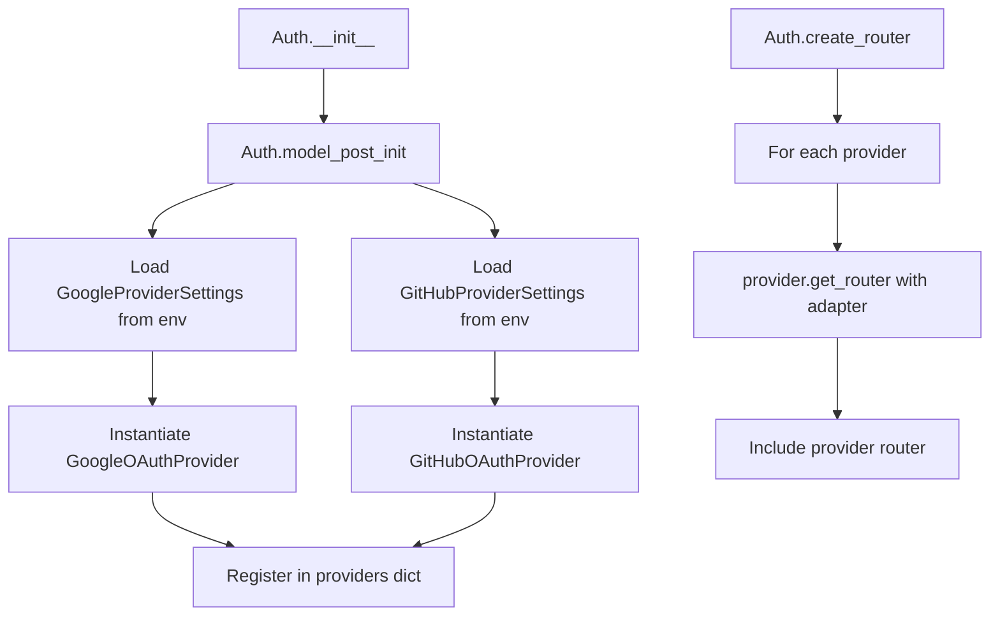
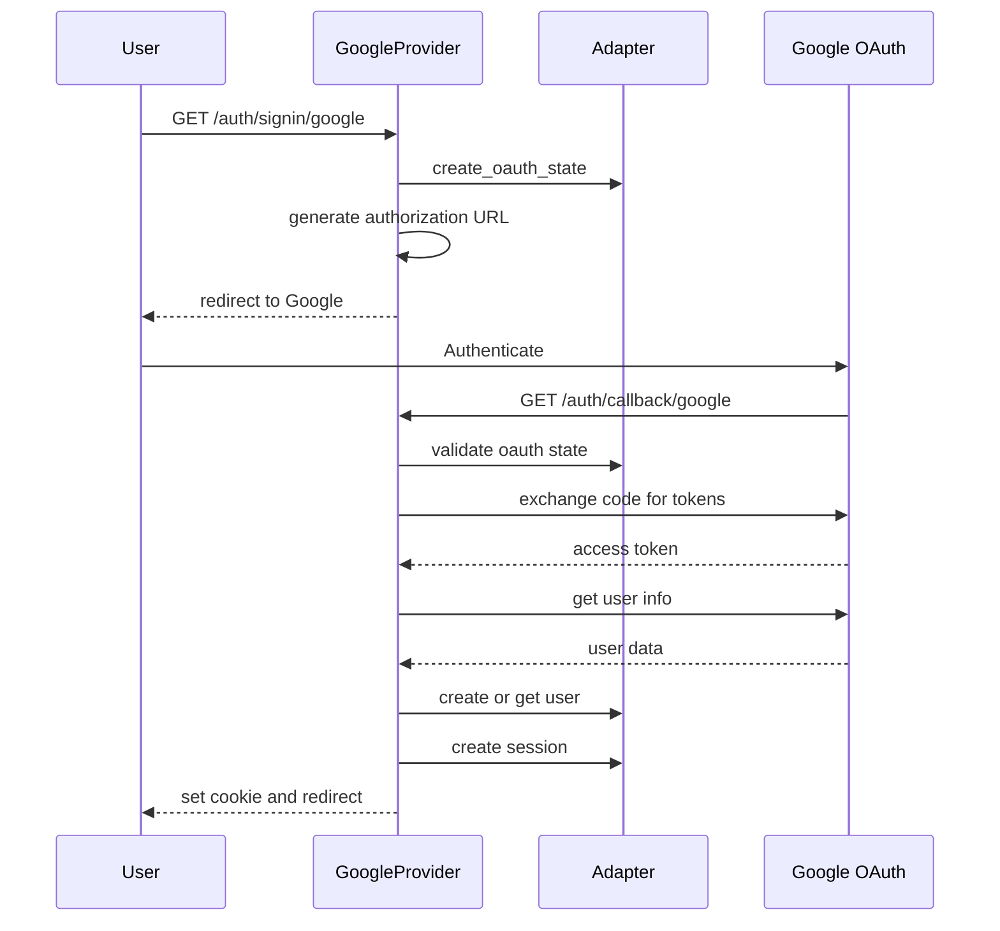
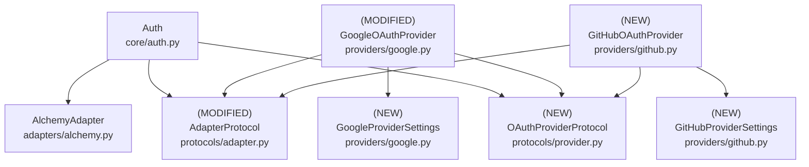

# Design Document: Generic OAuth2 Provider System

## Overview

### High-Level Description

This feature refactors the current OAuth implementation to support multiple OAuth2 providers through a protocol-based architecture. Currently, the system is tightly coupled to Google OAuth with provider-specific methods, types, and routes. This redesign introduces self-contained OAuth providers that each manage their own routes and workflows.

The problem this solves: Each new OAuth provider currently requires duplicating the entire OAuth flow logic, creating provider-specific methods in the Auth class, hardcoded route endpoints, and separate settings classes. This approach doesn't scale and violates DRY principles.

This design introduces:
- **Provider Protocol**: Minimal interface that providers must implement (`provider_id`, `get_router`)
- **Self-Contained Providers**: Each provider manages its own FastAPI router and OAuth flow
- **Adapter Injection**: Database adapter passed to providers via `get_router()` method
- **Type Safety**: Provider IDs use Literal types for compile-time safety
- **Environment Config**: Each provider loads settings from environment with `env_prefix`

### Goals

- Define a minimal provider protocol for self-contained OAuth providers
- Each provider creates and manages its own FastAPI router with OAuth endpoints
- Providers are completely independent and testable in isolation
- Type-safe provider identification using Literal types
- Adapter protocol includes `get_db()` method for FastAPI dependency injection
- Support provider-specific customizations (scopes, parameters, workflows)
- Enable adding new providers by implementing a 3-method protocol
- Eliminate need for central OAuth flow orchestration

### Non-Goals

- Will not implement PKCE support initially (providers can add individually)
- Will not support OAuth 1.0 providers (only OAuth 2.0)
- Will not implement token refresh initially (can be added per-provider)
- Will not add OIDC discovery initially (providers handle endpoints directly)
- Will not create shared base classes for OAuth flows (keep providers independent)

## Workflows

### Workflow 1: Provider Registration and Initialization

#### Description

The Auth class loads provider settings from environment, instantiates providers, and includes their routers in the application.

#### Usage Example

```python
from belgie.auth import Auth
from belgie.auth.adapters.alchemy import AlchemyAdapter
from belgie.auth.providers.google import GoogleOAuthProvider, GoogleProviderSettings
from belgie.auth.providers.github import GitHubOAuthProvider, GitHubProviderSettings

# Create adapter
adapter = AlchemyAdapter(...)

# Create Auth instance
auth = Auth(adapter=adapter)

# Providers are automatically loaded from environment via model_post_init
# Each provider with valid settings is instantiated and registered
# BELGIE_GOOGLE_* env vars -> GoogleOAuthProvider
# BELGIE_GITHUB_* env vars -> GitHubOAuthProvider

# Create FastAPI app with all provider routes
from fastapi import FastAPI
app = FastAPI()
app.include_router(auth.create_router())

# Result:
# GET /auth/signin/google
# GET /auth/callback/google
# GET /auth/signin/github
# GET /auth/callback/github
```

#### Call Graph



#### Key Components

- **Auth** (`core/auth.py:Auth`) - Coordinates provider loading and router creation
- **Provider Settings** (`providers/google.py:GoogleProviderSettings`) - Load from environment
- **Providers** (`providers/google.py:GoogleOAuthProvider`) - Self-contained OAuth implementation

### Workflow 2: OAuth Sign-In Flow

#### Description

User initiates sign-in with a provider. The provider's router handles the entire OAuth flow internally - generating authorization URL, handling callback, creating user/session.

#### Usage Example

```python
# User clicks "Sign in with Google"
# GET /auth/signin/google

# Provider generates authorization URL:
# 1. Creates state token and stores in database
# 2. Builds OAuth URL with client_id, scopes, redirect_uri
# 3. Redirects user to Google

# Google authenticates user and redirects back:
# GET /auth/callback/google?code=xyz&state=abc

# Provider handles callback:
# 1. Validates state token
# 2. Exchanges code for access token
# 3. Fetches user info from Google
# 4. Creates or updates user in database
# 5. Creates session
# 6. Sets session cookie and redirects

# All handled within the provider's router - no external orchestration needed
```

#### Sequence Diagram



#### Key Components

- **Provider Router** (`providers/google.py:get_router`) - Contains signin and callback endpoints
- **Adapter** (`adapters/alchemy.py:AlchemyAdapter`) - Database operations via dependency injection
- **OAuth State** - CSRF protection for OAuth flow

### Workflow 3: Adding a New OAuth Provider

#### Description

Developer adds a new OAuth provider by creating a settings class and provider class implementing the protocol. No changes needed to Auth class.

#### Usage Example

```python
# Step 1: Create provider settings
from typing import Literal
from pydantic import Field
from pydantic_settings import BaseSettings, SettingsConfigDict

class MicrosoftProviderSettings(BaseSettings):
    model_config = SettingsConfigDict(
        env_prefix="BELGIE_MICROSOFT_",
        env_file=".env",
        extra="ignore"
    )

    client_id: str
    client_secret: str
    redirect_uri: str
    scopes: list[str] = Field(default=["openid", "email", "profile"])


# Step 2: Implement provider protocol
from fastapi import APIRouter, Depends, RedirectResponse
from belgie.auth.protocols.adapter import AdapterProtocol
from belgie.auth.protocols.provider import OAuthProviderProtocol

class MicrosoftOAuthProvider:
    """Microsoft OAuth provider - self-contained implementation"""

    def __init__(self, settings: MicrosoftProviderSettings) -> None:
        self.settings = settings

    @property
    def provider_id(self) -> Literal["microsoft"]:
        """Return unique provider identifier"""
        return "microsoft"

    def get_router(self, adapter: AdapterProtocol) -> APIRouter:
        """Create router with Microsoft OAuth endpoints"""
        router = APIRouter(prefix="/auth", tags=["auth"])

        @router.get(f"/signin/{self.provider_id}")
        async def signin_microsoft(db=Depends(adapter.get_db)):
            # Generate state token
            state = generate_state_token()
            await adapter.create_oauth_state(db, state, self.provider_id)

            # Build authorization URL
            auth_url = (
                "https://login.microsoftonline.com/common/oauth2/v2.0/authorize"
                f"?client_id={self.settings.client_id}"
                f"&redirect_uri={self.settings.redirect_uri}"
                f"&scope={' '.join(self.settings.scopes)}"
                f"&state={state}"
                "&response_type=code"
            )
            return RedirectResponse(url=auth_url)

        @router.get(f"/callback/{self.provider_id}")
        async def callback_microsoft(
            code: str, state: str, db=Depends(adapter.get_db)
        ):
            # Validate state
            oauth_state = await adapter.get_oauth_state(db, state)
            if not oauth_state:
                raise InvalidStateError()

            # Exchange code for tokens
            async with httpx.AsyncClient() as client:
                token_response = await client.post(
                    "https://login.microsoftonline.com/common/oauth2/v2.0/token",
                    data={
                        "client_id": self.settings.client_id,
                        "client_secret": self.settings.client_secret,
                        "code": code,
                        "redirect_uri": self.settings.redirect_uri,
                        "grant_type": "authorization_code",
                    },
                )
                tokens = token_response.json()

            # Get user info
            async with httpx.AsyncClient() as client:
                user_response = await client.get(
                    "https://graph.microsoft.com/v1.0/me",
                    headers={"Authorization": f"Bearer {tokens['access_token']}"},
                )
                user_data = user_response.json()

            # Create or get user
            user = await adapter.get_user_by_email(db, user_data["mail"])
            if not user:
                user = await adapter.create_user(
                    db,
                    email=user_data["mail"],
                    name=user_data.get("displayName"),
                )

            # Create session
            session = await adapter.create_session(db, user_id=user.id)

            # Return response with session cookie
            response = RedirectResponse(url="/dashboard")
            response.set_cookie(key="session", value=session.token)
            return response

        return router


# Step 3: Add to Auth.model_post_init to auto-load
# In auth.py, add Microsoft to the provider loading logic:
try:
    microsoft_settings = MicrosoftProviderSettings()
    if microsoft_settings.client_id:
        microsoft = MicrosoftOAuthProvider(microsoft_settings)
        self.providers[microsoft.provider_id] = microsoft
except Exception:
    pass  # Provider not configured

# Step 4: Add environment variables
# BELGIE_MICROSOFT_CLIENT_ID="..."
# BELGIE_MICROSOFT_CLIENT_SECRET="..."
# BELGIE_MICROSOFT_REDIRECT_URI="http://localhost:8000/auth/callback/microsoft"

# That's it! Provider is fully integrated.
```

#### Key Components

- **Provider Protocol** (`protocols/provider.py:OAuthProviderProtocol`) - Interface to implement
- **Provider Settings** - BaseSettings with env_prefix
- **Self-Contained Router** - Provider handles complete OAuth flow

## Dependencies



## Detailed Design

### Module Structure

```
src/belgie/auth/
├── core/
│   ├── auth.py                 # (MODIFIED) Auth class - loads and registers providers
│   ├── exceptions.py           # (MODIFIED) Add ProviderNotFoundError
│   └── helpers.py              # (NEW) Helper functions for provider URLs and config
├── protocols/
│   ├── provider.py             # (NEW) OAuthProviderProtocol definition
│   └── adapter.py              # (MODIFIED) Add get_db() method to protocol
├── providers/
│   ├── __init__.py             # (MODIFIED) Export provider classes
│   ├── google.py               # (MODIFIED) Self-contained Google OAuth provider
│   └── github.py               # (NEW) Self-contained GitHub OAuth provider
└── __test__/
    └── auth/
        ├── providers/
        │   ├── test_google.py                  # Unit tests for Google provider
        │   ├── test_github.py                  # Unit tests for GitHub provider
        │   └── test_providers_integration.py   # Integration tests
        └── core/
            ├── test_auth.py                    # Tests for Auth class
            └── test_helpers.py                 # Tests for helper functions
```

### API Design

#### `src/belgie/auth/protocols/provider.py`

Protocol definition for OAuth providers (see [Implementation Order](#implementation-order) #1).

```python
from typing import Literal, Protocol

from fastapi import APIRouter
from pydantic_settings import BaseSettings

from belgie.auth.protocols.adapter import AdapterProtocol


class OAuthProviderProtocol[S: BaseSettings](Protocol):
    """
    Protocol that all OAuth providers must implement.
    Each provider is self-contained and manages its own routes.
    """

    def __init__(self, settings: S) -> None:
        """Initialize provider with settings"""
        ...

    @property
    def provider_id(self) -> str:
        """
        Unique identifier for this provider.
        Concrete implementations must return Literal types for type safety.
        Example: Literal["google"], Literal["github"]
        """
        ...

    def get_router(self, adapter: AdapterProtocol) -> APIRouter:
        """
        Create and return FastAPI router with OAuth endpoints.

        The router should include:
        - GET /auth/signin/{provider_id} - Initiates OAuth flow
        - GET /auth/callback/{provider_id} - Handles OAuth callback

        The adapter provides database access via dependency injection:
        - db = Depends(adapter.get_db)

        The provider has complete control over:
        - OAuth flow implementation
        - User data mapping
        - Session management
        - Error handling
        """
        ...
```

#### `src/belgie/auth/protocols/adapter.py`

Modified adapter protocol with `get_db()` method (see [Implementation Order](#implementation-order) #2).

```python
from typing import Protocol

# Add to existing AdapterProtocol:

class AdapterProtocol[UserT, AccountT, SessionT, OAuthStateT](Protocol):
    """Protocol for database adapters"""

    # EXISTING METHODS (unchanged):
    async def get_user_by_email(self, db, email: str) -> UserT | None: ...
    async def create_user(self, db, email: str, **kwargs) -> UserT: ...
    async def get_user_by_id(self, db, user_id: str) -> UserT | None: ...
    # ... other existing methods

    # NEW METHOD:
    def get_db(self):
        """
        Return FastAPI dependency for database sessions.

        Used by providers in route definitions:

        @router.get("/signin")
        async def signin(db = Depends(adapter.get_db)):
            ...

        Should return a callable that yields database sessions:

        async def _get_db():
            async with self.session_maker() as session:
                yield session

        return _get_db
        """
        ...
```

#### `src/belgie/auth/providers/google.py`

Refactored Google provider as self-contained implementation (see [Implementation Order](#implementation-order) #3).

```python
from typing import Any, Literal

import httpx
from fastapi import APIRouter, Depends, RedirectResponse
from pydantic import Field
from pydantic_settings import BaseSettings, SettingsConfigDict

from belgie.auth.protocols.adapter import AdapterProtocol
from belgie.auth.utils.crypto import generate_state_token


class GoogleProviderSettings(BaseSettings):
    """Google OAuth provider settings loaded from environment"""

    model_config = SettingsConfigDict(
        env_prefix="BELGIE_GOOGLE_",
        env_file=".env",
        extra="ignore",
    )

    client_id: str
    client_secret: str
    redirect_uri: str
    scopes: list[str] = Field(default=["openid", "email", "profile"])
    access_type: str = "offline"
    prompt: str = "consent"


class GoogleOAuthProvider:
    """
    Google OAuth provider implementation.
    Self-contained - manages own router and OAuth flow.
    """

    AUTHORIZATION_URL = "https://accounts.google.com/o/oauth2/v2/auth"
    TOKEN_URL = "https://oauth2.googleapis.com/token"
    USER_INFO_URL = "https://www.googleapis.com/oauth2/v2/userinfo"

    def __init__(self, settings: GoogleProviderSettings) -> None:
        self.settings = settings

    @property
    def provider_id(self) -> Literal["google"]:
        return "google"

    def get_router(self, adapter: AdapterProtocol) -> APIRouter:
        """Create router with Google OAuth endpoints"""
        router = APIRouter(prefix="/auth", tags=["auth"])

        @router.get(f"/signin/{self.provider_id}")
        async def signin_google(db=Depends(adapter.get_db)):
            """Initiate Google OAuth flow"""
            # 1. Generate and store state token for CSRF protection
            state = generate_state_token()
            await adapter.create_oauth_state(db, state, self.provider_id)

            # 2. Build authorization URL with all parameters
            params = {
                "client_id": self.settings.client_id,
                "redirect_uri": self.settings.redirect_uri,
                "response_type": "code",
                "scope": " ".join(self.settings.scopes),
                "state": state,
                "access_type": self.settings.access_type,
                "prompt": self.settings.prompt,
            }
            from urllib.parse import urlencode
            auth_url = f"{self.AUTHORIZATION_URL}?{urlencode(params)}"

            # 3. Redirect user to Google
            return RedirectResponse(url=auth_url)

        @router.get(f"/callback/{self.provider_id}")
        async def callback_google(
            code: str, state: str, db=Depends(adapter.get_db)
        ):
            """Handle Google OAuth callback"""
            # 1. Validate state token
            oauth_state = await adapter.get_oauth_state(db, state)
            if not oauth_state:
                from belgie.auth.core.exceptions import InvalidStateError
                raise InvalidStateError("Invalid OAuth state")
            await adapter.delete_oauth_state(db, state)

            # 2. Exchange code for tokens
            async with httpx.AsyncClient() as client:
                token_response = await client.post(
                    self.TOKEN_URL,
                    data={
                        "client_id": self.settings.client_id,
                        "client_secret": self.settings.client_secret,
                        "code": code,
                        "redirect_uri": self.settings.redirect_uri,
                        "grant_type": "authorization_code",
                    },
                )
                token_response.raise_for_status()
                tokens = token_response.json()

            # 3. Fetch user info from Google
            async with httpx.AsyncClient() as client:
                user_response = await client.get(
                    self.USER_INFO_URL,
                    headers={"Authorization": f"Bearer {tokens['access_token']}"},
                )
                user_response.raise_for_status()
                user_data = user_response.json()

            # 4. Create or get user
            user = await adapter.get_user_by_email(db, user_data["email"])
            if not user:
                user = await adapter.create_user(
                    db,
                    email=user_data["email"],
                    email_verified=user_data.get("verified_email", False),
                    name=user_data.get("name"),
                    image=user_data.get("picture"),
                )

            # 5. Store or update OAuth account
            await adapter.create_or_update_account(
                db,
                user_id=user.id,
                provider=self.provider_id,
                provider_account_id=user_data["id"],
                access_token=tokens["access_token"],
                refresh_token=tokens.get("refresh_token"),
                expires_at=None,  # Calculate from expires_in if needed
            )

            # 6. Create session
            session = await adapter.create_session(db, user_id=user.id)

            # 7. Set session cookie and redirect
            response = RedirectResponse(url="/dashboard")
            response.set_cookie(
                key="session",
                value=session.token,
                httponly=True,
                secure=True,
                samesite="lax",
            )
            return response

        return router
```

#### `src/belgie/auth/providers/github.py`

New GitHub provider implementation (see [Implementation Order](#implementation-order) #4).

```python
from typing import Literal

import httpx
from fastapi import APIRouter, Depends, RedirectResponse
from pydantic import Field
from pydantic_settings import BaseSettings, SettingsConfigDict

from belgie.auth.protocols.adapter import AdapterProtocol
from belgie.auth.utils.crypto import generate_state_token


class GitHubProviderSettings(BaseSettings):
    """GitHub OAuth provider settings loaded from environment"""

    model_config = SettingsConfigDict(
        env_prefix="BELGIE_GITHUB_",
        env_file=".env",
        extra="ignore",
    )

    client_id: str
    client_secret: str
    redirect_uri: str
    scopes: list[str] = Field(default=["user:email", "read:user"])
    allow_signup: bool = True


class GitHubOAuthProvider:
    """
    GitHub OAuth provider implementation.
    Self-contained - manages own router and OAuth flow.
    """

    AUTHORIZATION_URL = "https://github.com/login/oauth/authorize"
    TOKEN_URL = "https://github.com/login/oauth/access_token"
    USER_INFO_URL = "https://api.github.com/user"
    USER_EMAILS_URL = "https://api.github.com/user/emails"

    def __init__(self, settings: GitHubProviderSettings) -> None:
        self.settings = settings

    @property
    def provider_id(self) -> Literal["github"]:
        return "github"

    def get_router(self, adapter: AdapterProtocol) -> APIRouter:
        """Create router with GitHub OAuth endpoints"""
        router = APIRouter(prefix="/auth", tags=["auth"])

        @router.get(f"/signin/{self.provider_id}")
        async def signin_github(db=Depends(adapter.get_db)):
            """Initiate GitHub OAuth flow"""
            state = generate_state_token()
            await adapter.create_oauth_state(db, state, self.provider_id)

            from urllib.parse import urlencode
            params = {
                "client_id": self.settings.client_id,
                "redirect_uri": self.settings.redirect_uri,
                "scope": " ".join(self.settings.scopes),
                "state": state,
                "allow_signup": str(self.settings.allow_signup).lower(),
            }
            auth_url = f"{self.AUTHORIZATION_URL}?{urlencode(params)}"
            return RedirectResponse(url=auth_url)

        @router.get(f"/callback/{self.provider_id}")
        async def callback_github(
            code: str, state: str, db=Depends(adapter.get_db)
        ):
            """Handle GitHub OAuth callback"""
            # Validate state
            oauth_state = await adapter.get_oauth_state(db, state)
            if not oauth_state:
                from belgie.auth.core.exceptions import InvalidStateError
                raise InvalidStateError("Invalid OAuth state")
            await adapter.delete_oauth_state(db, state)

            # Exchange code for tokens (GitHub requires Accept header)
            async with httpx.AsyncClient() as client:
                token_response = await client.post(
                    self.TOKEN_URL,
                    data={
                        "client_id": self.settings.client_id,
                        "client_secret": self.settings.client_secret,
                        "code": code,
                        "redirect_uri": self.settings.redirect_uri,
                    },
                    headers={"Accept": "application/json"},
                )
                token_response.raise_for_status()
                tokens = token_response.json()

            # Fetch user info
            async with httpx.AsyncClient() as client:
                user_response = await client.get(
                    self.USER_INFO_URL,
                    headers={
                        "Authorization": f"Bearer {tokens['access_token']}",
                        "Accept": "application/json",
                    },
                )
                user_response.raise_for_status()
                user_data = user_response.json()

            # Fetch email if not public
            email = user_data.get("email")
            if not email:
                async with httpx.AsyncClient() as client:
                    emails_response = await client.get(
                        self.USER_EMAILS_URL,
                        headers={
                            "Authorization": f"Bearer {tokens['access_token']}",
                            "Accept": "application/json",
                        },
                    )
                    emails_response.raise_for_status()
                    emails = emails_response.json()
                    # Get primary verified email
                    for email_data in emails:
                        if email_data.get("primary") and email_data.get("verified"):
                            email = email_data["email"]
                            break

            # Create or get user
            user = await adapter.get_user_by_email(db, email)
            if not user:
                user = await adapter.create_user(
                    db,
                    email=email,
                    email_verified=True,  # GitHub emails are verified
                    name=user_data.get("name"),
                    image=user_data.get("avatar_url"),
                )

            # Store account
            await adapter.create_or_update_account(
                db,
                user_id=user.id,
                provider=self.provider_id,
                provider_account_id=str(user_data["id"]),
                access_token=tokens["access_token"],
                refresh_token=None,
                expires_at=None,
            )

            # Create session
            session = await adapter.create_session(db, user_id=user.id)

            # Set cookie and redirect
            response = RedirectResponse(url="/dashboard")
            response.set_cookie(
                key="session",
                value=session.token,
                httponly=True,
                secure=True,
                samesite="lax",
            )
            return response

        return router
```

#### `src/belgie/auth/core/auth.py`

Simplified Auth class that loads and registers providers (see [Implementation Order](#implementation-order) #5).

```python
from typing import Any

from fastapi import APIRouter
from pydantic import Field
from pydantic_settings import BaseSettings, SettingsConfigDict

from belgie.auth.adapters.alchemy import AlchemyAdapter
from belgie.auth.protocols.provider import OAuthProviderProtocol
from belgie.auth.providers.github import GitHubOAuthProvider, GitHubProviderSettings
from belgie.auth.providers.google import GoogleOAuthProvider, GoogleProviderSettings


class AuthSettings(BaseSettings):
    """Main auth settings"""

    model_config = SettingsConfigDict(
        env_prefix="BELGIE_",
        env_file=".env",
        extra="ignore",
    )

    secret_key: str = "change-me"
    # Other auth settings...


class Auth:
    """
    Main auth class that coordinates OAuth providers.
    Providers are loaded from environment and registered automatically.
    """

    def __init__(self, adapter: AlchemyAdapter):
        self.adapter = adapter
        self.settings = AuthSettings()
        self.providers: dict[str, OAuthProviderProtocol] = {}

        # Auto-load providers from environment
        self._load_providers()

    def _load_providers(self) -> None:
        """
        Load and register OAuth providers from environment.
        Providers with missing required settings are silently skipped.
        """
        # Load Google provider
        try:
            google_settings = GoogleProviderSettings()
            if google_settings.client_id:  # Only register if configured
                google = GoogleOAuthProvider(google_settings)
                self.register_provider(google)
        except Exception:
            pass  # Provider not configured

        # Load GitHub provider
        try:
            github_settings = GitHubProviderSettings()
            if github_settings.client_id:
                github = GitHubOAuthProvider(github_settings)
                self.register_provider(github)
        except Exception:
            pass  # Provider not configured

        # Add more providers here as they're implemented

    def register_provider(self, provider: OAuthProviderProtocol) -> None:
        """Register an OAuth provider"""
        self.providers[provider.provider_id] = provider

    def create_router(self) -> APIRouter:
        """
        Create main router including all provider routers.
        Each provider's router is included with its own routes.
        """
        main_router = APIRouter()

        for provider in self.providers.values():
            # Pass adapter to provider when getting router
            provider_router = provider.get_router(self.adapter)
            main_router.include_router(provider_router)

        return main_router

    def list_providers(self) -> list[str]:
        """Return list of registered provider IDs"""
        return list(self.providers.keys())

    def get_provider(self, provider_id: str) -> OAuthProviderProtocol:
        """Get provider by ID"""
        if provider_id not in self.providers:
            from belgie.auth.core.exceptions import ProviderNotFoundError
            raise ProviderNotFoundError(f"Provider '{provider_id}' not found")
        return self.providers[provider_id]
```

#### `src/belgie/auth/core/helpers.py`

Helper functions for working with providers (see [Implementation Order](#implementation-order) #6).

```python
from typing import Any

from belgie.auth.core.auth import Auth


def get_provider_urls(auth: Auth, provider_id: str, base_url: str = "") -> dict[str, str]:
    """
    Get OAuth endpoint URLs for a specific provider.

    Args:
        auth: Auth instance
        provider_id: Provider identifier (e.g., "google", "github")
        base_url: Base URL for the application (e.g., "http://localhost:8000")

    Returns:
        Dict with signin_url and callback_url

    Example:
        urls = get_provider_urls(auth, "google", "http://localhost:8000")
        # {"signin_url": "http://localhost:8000/auth/signin/google",
        #  "callback_url": "http://localhost:8000/auth/callback/google"}
    """
    # Validate provider exists
    auth.get_provider(provider_id)  # Raises ProviderNotFoundError if not found

    return {
        "signin_url": f"{base_url}/auth/signin/{provider_id}",
        "callback_url": f"{base_url}/auth/callback/{provider_id}",
    }


def get_all_provider_urls(auth: Auth, base_url: str = "") -> dict[str, dict[str, str]]:
    """
    Get OAuth endpoint URLs for all registered providers.

    Args:
        auth: Auth instance
        base_url: Base URL for the application

    Returns:
        Dict mapping provider_id to URLs dict

    Example:
        urls = get_all_provider_urls(auth, "http://localhost:8000")
        # {
        #   "google": {"signin_url": "...", "callback_url": "..."},
        #   "github": {"signin_url": "...", "callback_url": "..."}
        # }
    """
    return {
        provider_id: get_provider_urls(auth, provider_id, base_url)
        for provider_id in auth.list_providers()
    }


def get_provider_config(auth: Auth, provider_id: str) -> dict[str, Any]:
    """
    Get non-sensitive provider configuration details.

    Args:
        auth: Auth instance
        provider_id: Provider identifier

    Returns:
        Dict with non-sensitive config (never includes secrets)

    Example:
        config = get_provider_config(auth, "google")
        # {
        #   "provider_id": "google",
        #   "scopes": ["openid", "email", "profile"]
        # }
    """
    provider = auth.get_provider(provider_id)

    # Only return non-sensitive information
    config = {
        "provider_id": provider.provider_id,
    }

    # Add scopes if available
    if hasattr(provider, "settings") and hasattr(provider.settings, "scopes"):
        config["scopes"] = provider.settings.scopes

    return config


def list_available_providers(auth: Auth) -> list[str]:
    """
    List all registered and available providers.

    Args:
        auth: Auth instance

    Returns:
        List of provider IDs

    Example:
        providers = list_available_providers(auth)
        # ["google", "github"]
    """
    return auth.list_providers()
```

#### Example `.env` File

Environment variables for configuring OAuth providers:

```bash
# Main auth settings
BELGIE_SECRET_KEY="your-secret-key-here"

# Google OAuth Provider
BELGIE_GOOGLE_CLIENT_ID="google-client-id.apps.googleusercontent.com"
BELGIE_GOOGLE_CLIENT_SECRET="google-client-secret"
BELGIE_GOOGLE_REDIRECT_URI="http://localhost:8000/auth/callback/google"
BELGIE_GOOGLE_SCOPES='["openid", "email", "profile"]'
BELGIE_GOOGLE_ACCESS_TYPE="offline"
BELGIE_GOOGLE_PROMPT="consent"

# GitHub OAuth Provider
BELGIE_GITHUB_CLIENT_ID="github-client-id"
BELGIE_GITHUB_CLIENT_SECRET="github-client-secret"
BELGIE_GITHUB_REDIRECT_URI="http://localhost:8000/auth/callback/github"
BELGIE_GITHUB_SCOPES='["user:email", "read:user"]'
BELGIE_GITHUB_ALLOW_SIGNUP="true"

# Providers missing required fields (client_id) are automatically skipped
# Add more providers by following the pattern: BELGIE_{PROVIDER}_{FIELD}
```

### Testing Strategy

Tests should be organized by module/file and cover unit tests, integration tests, and edge cases.

#### `test_google.py`

**GoogleOAuthProvider Tests:**
- Test `__init__()` stores settings correctly
- Test `provider_id` returns Literal["google"]
- Test `get_router()` returns APIRouter with correct routes
- Test signin endpoint generates valid authorization URL
- Test signin endpoint creates OAuth state in database
- Test callback endpoint validates state token
- Test callback endpoint exchanges code for tokens (mock httpx)
- Test callback endpoint fetches user info (mock httpx)
- Test callback endpoint creates/gets user
- Test callback endpoint creates session
- Test callback endpoint sets cookie and redirects
- Test error handling (invalid state, HTTP errors, etc.)

#### `test_github.py`

**GitHubOAuthProvider Tests:**
- Test `__init__()` stores settings correctly
- Test `provider_id` returns Literal["github"]
- Test `get_router()` returns APIRouter with correct routes
- Test signin endpoint includes GitHub-specific params (allow_signup)
- Test callback endpoint includes Accept header in token exchange
- Test callback endpoint fetches email from /user/emails if needed
- Test callback endpoint handles public email case
- Test callback endpoint creates/gets user with GitHub data
- Test error handling specific to GitHub API

#### `test_auth.py`

**Auth Class Tests:**
- Test `__init__()` initializes with adapter
- Test `_load_providers()` loads configured providers from env
- Test `_load_providers()` skips providers with missing settings
- Test `register_provider()` adds provider to registry
- Test `create_router()` includes all provider routers
- Test `list_providers()` returns all registered provider IDs
- Test `get_provider()` returns correct provider
- Test `get_provider()` raises ProviderNotFoundError for invalid ID
- Use mock environment variables for testing

#### `test_helpers.py`

**Helper Function Tests:**
- Test `get_provider_urls()` returns correct URLs for valid provider
- Test `get_provider_urls()` raises ProviderNotFoundError for invalid provider
- Test `get_provider_urls()` with and without base_url parameter
- Test `get_all_provider_urls()` returns URLs for all providers
- Test `get_all_provider_urls()` handles empty provider registry
- Test `get_provider_config()` returns non-sensitive config
- Test `get_provider_config()` never exposes client_secret
- Test `list_available_providers()` returns all provider IDs
- Use mock Auth instance with registered providers

**Integration Tests:**
- Test [Workflow 1](#workflow-1-provider-registration-and-initialization): providers loaded from env and routes created
- Test [Workflow 2](#workflow-2-oauth-sign-in-flow): full OAuth flow with Google
- Test [Workflow 2](#workflow-2-oauth-sign-in-flow): full OAuth flow with GitHub
- Test multiple providers registered simultaneously
- Test provider isolation (one provider's failure doesn't affect others)
- Use FastAPI TestClient for end-to-end testing
- Mock external OAuth provider APIs (Google, GitHub)

**Edge Cases to Cover:**
- No providers configured (empty provider registry)
- Provider with missing required settings (should be skipped)
- Provider with invalid settings (should be skipped)
- OAuth state token validation failures
- Network errors during token exchange or user info fetch
- Provider returning unexpected data format
- Concurrent OAuth flows with different providers

## Implementation

### Implementation Order

1. **Provider Protocol** (`protocols/provider.py`) - Define minimal interface (no dependencies)
   - Used in: All provider implementations
   - Dependencies: None

2. **Adapter Protocol Update** (`protocols/adapter.py`) - Add `get_db()` method
   - Used in: Provider routers for dependency injection
   - Dependencies: None

3. **Google Provider** (`providers/google.py`) - Refactor to self-contained implementation
   - Used in: [Workflow 1](#workflow-1-provider-registration-and-initialization), [Workflow 2](#workflow-2-oauth-sign-in-flow)
   - Dependencies: Provider protocol, Adapter protocol

4. **GitHub Provider** (`providers/github.py`) - New provider implementation
   - Used in: [Workflow 3](#workflow-3-adding-a-new-oauth-provider)
   - Dependencies: Provider protocol, Adapter protocol

5. **Auth Class** (`core/auth.py`) - Simplified provider loading and registration
   - Used in: All workflows
   - Dependencies: Provider protocol, Adapter, Provider implementations

6. **Helper Functions** (`core/helpers.py`) - Utility functions for provider URLs
   - Used in: UI integration, API documentation
   - Dependencies: Auth class

### Tasks

- [ ] **Implement protocols** (leaf nodes, no dependencies)
  - [ ] Define `OAuthProviderProtocol` in `protocols/provider.py` (#1)
    - [ ] Define generic type parameter for settings
    - [ ] Define `__init__(settings)` method
    - [ ] Define `provider_id` property returning str
    - [ ] Define `get_router(adapter)` method returning APIRouter
  - [ ] Add `get_db()` to `AdapterProtocol` in `protocols/adapter.py` (#2)
    - [ ] Define method signature
    - [ ] Add documentation about FastAPI dependency
  - [ ] Write unit tests for protocols (type checking)

- [ ] **Implement Google provider** (depends on protocols)
  - [ ] Create `GoogleProviderSettings` in `providers/google.py` (#3)
    - [ ] Define all settings fields with defaults
    - [ ] Configure env_prefix="BELGIE_GOOGLE_"
  - [ ] Implement `GoogleOAuthProvider` class
    - [ ] Implement `__init__(settings)` storing settings
    - [ ] Implement `provider_id` property returning Literal["google"]
    - [ ] Implement `get_router(adapter)` method
      - [ ] Create APIRouter with prefix and tags
      - [ ] Implement signin endpoint (generate URL, create state)
      - [ ] Implement callback endpoint (validate, exchange, create user/session)
      - [ ] Return router
  - [ ] Write unit tests for `providers/google.py`
    - [ ] Test settings loading from env
    - [ ] Test router creation
    - [ ] Test signin endpoint logic (mock DB)
    - [ ] Test callback endpoint logic (mock HTTP and DB)

- [ ] **Implement GitHub provider** (depends on protocols)
  - [ ] Create `GitHubProviderSettings` in `providers/github.py` (#4)
    - [ ] Define settings with GitHub-specific fields
    - [ ] Configure env_prefix="BELGIE_GITHUB_"
  - [ ] Implement `GitHubOAuthProvider` class
    - [ ] Implement protocol methods (same structure as Google)
    - [ ] Handle GitHub-specific requirements (Accept header, email fetching)
  - [ ] Write unit tests for `providers/github.py`
    - [ ] Test GitHub-specific logic
    - [ ] Test email fetching fallback

- [ ] **Implement Auth class** (depends on provider implementations)
  - [ ] Modify `core/auth.py` (#5)
    - [ ] Update `__init__()` to accept adapter
    - [ ] Implement `_load_providers()` method
      - [ ] Try loading GoogleProviderSettings and instantiate provider
      - [ ] Try loading GitHubProviderSettings and instantiate provider
      - [ ] Silently skip providers with errors
    - [ ] Implement `register_provider()` method
    - [ ] Implement `create_router()` method
      - [ ] Loop through providers
      - [ ] Call `provider.get_router(adapter)` for each
      - [ ] Include all routers in main router
    - [ ] Implement `list_providers()` and `get_provider()` methods
  - [ ] Update `adapters/alchemy.py` to add `get_db()` method
  - [ ] Write unit tests for `core/auth.py`
    - [ ] Test provider loading from env
    - [ ] Test router creation with multiple providers
    - [ ] Test provider registration and lookup

- [ ] **Implement helper functions** (depends on Auth class)
  - [ ] Implement `core/helpers.py` (#6)
    - [ ] Implement `get_provider_urls()`
    - [ ] Implement `get_all_provider_urls()`
    - [ ] Implement `get_provider_config()`
    - [ ] Implement `list_available_providers()`
  - [ ] Write unit tests for `core/helpers.py`

- [ ] **Integration and validation**
  - [ ] Add integration tests for [Workflow 1](#workflow-1-provider-registration-and-initialization)
  - [ ] Add integration tests for [Workflow 2](#workflow-2-oauth-sign-in-flow)
  - [ ] Add integration tests for [Workflow 3](#workflow-3-adding-a-new-oauth-provider)
  - [ ] Test with real environment variables
  - [ ] Test with FastAPI TestClient
  - [ ] Add type hints and run type checker (`uv run ty`)
  - [ ] Run linter and fix issues (`uv run ruff check`)
  - [ ] Verify all tests pass (`uv run pytest`)

## Open Questions

1. Should we provide shared utility functions for common OAuth operations (token exchange, user info fetching)? Or keep each provider completely independent?
2. Should we support OIDC discovery (auto-fetching endpoints from .well-known/openid-configuration)?
3. How should we handle providers that don't follow standard OAuth 2.0 (e.g., Twitter OAuth 1.0)?
4. Should provider loading be more dynamic (plugin system) or keep explicit imports in Auth class?

## Future Enhancements

- Add shared utility module for common OAuth operations to reduce duplication
- Add OIDC discovery support for auto-configuration
- Implement PKCE (Proof Key for Code Exchange) support
- Add token refresh logic (can be per-provider or shared)
- Support OAuth 1.0 providers (Twitter)
- Create provider plugin system for third-party providers
- Add provider-specific error handling and retry logic
- Implement rate limiting for OAuth endpoints
- Add analytics/logging for OAuth flow debugging
- Support multiple accounts from same provider per user
- Add provider connection management UI/API
- Create CLI tool for testing OAuth flows
- Add provider health checks and monitoring

## Alternative Approaches

### Approach 1: Centralized OAuth Flow with Provider Registry

**Description**: Keep a central Auth class that orchestrates OAuth flows, with providers just providing configuration (URLs, field mappings). Use a provider registry to manage providers.

**Pros**:
- Single source of truth for OAuth flow logic
- Less code duplication across providers
- Easier to add cross-cutting concerns (logging, metrics)
- Centralized error handling

**Cons**:
- Tight coupling between Auth class and provider implementations
- Less flexibility for provider-specific workflows
- Auth class becomes complex with many responsibilities
- Harder to test providers in isolation
- Adding providers requires modifying central Auth class

**Why not chosen**: The protocol-based approach with self-contained providers is more modular, easier to test, and scales better. Each provider can customize its OAuth flow without affecting others.

### Approach 2: Shared Base Class for Providers

**Description**: Create an `OAuthProviderBase` class with common OAuth logic, and providers inherit from it.

**Pros**:
- Reduces code duplication for standard OAuth operations
- Enforces consistent OAuth flow across providers
- Easier to add shared functionality

**Cons**:
- Inheritance couples providers to base class implementation
- Harder to customize OAuth flow for provider-specific needs
- Changes to base class affect all providers
- Less flexible than composition

**Why not chosen**: We prefer composition over inheritance. The protocol-based approach gives providers complete freedom while still enforcing a minimal interface. If we see significant duplication, we can add optional utility functions without requiring inheritance.

### Approach 3: Configuration-Only Providers

**Description**: Define providers purely as configuration (URLs, scopes, field mappings) and have a generic OAuth flow handler process them.

**Pros**:
- Very simple provider definitions (just data)
- No code needed for standard OAuth providers
- Easy to add providers via configuration files

**Cons**:
- Inflexible - hard to handle provider-specific quirks
- Complex configuration format for advanced cases
- Generic flow handler becomes very complex
- Harder to handle edge cases (GitHub email fetching, etc.)

**Why not chosen**: While simple in theory, real-world OAuth providers have enough quirks (GitHub's email API, Microsoft's endpoints, etc.) that a code-based approach is more maintainable. Configuration-based approach works for very simple cases but breaks down with real requirements.
