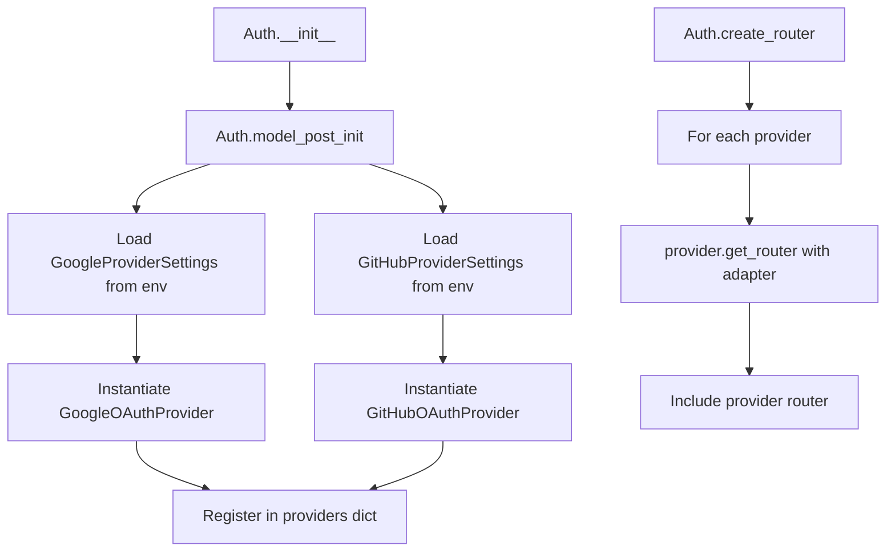
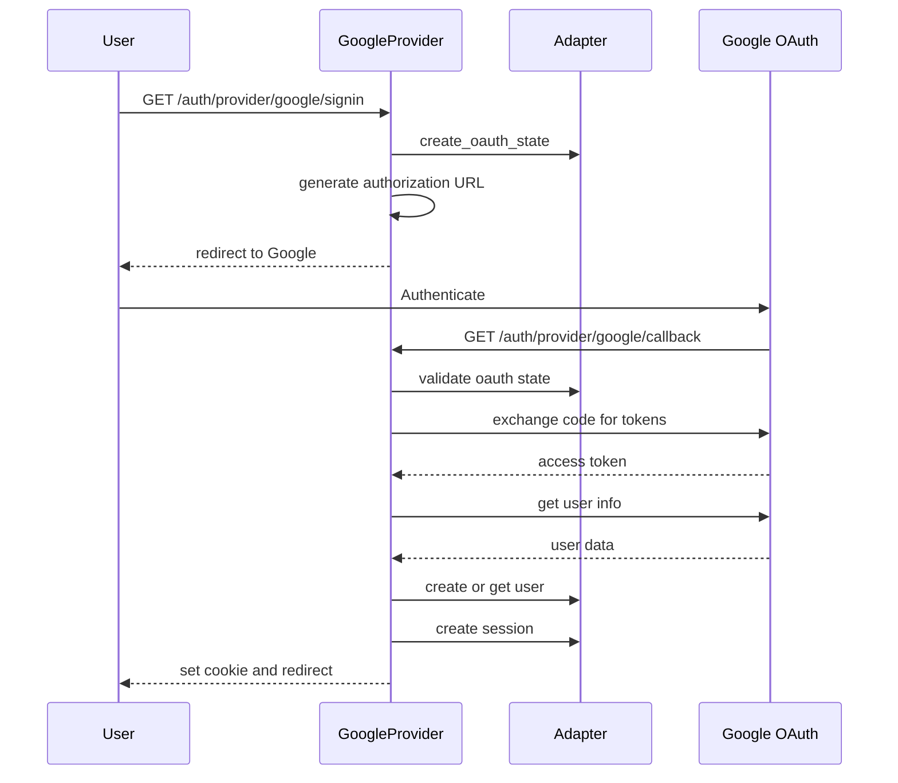
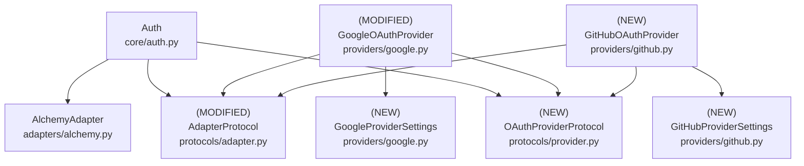

# Design Document: Generic OAuth2 Provider System

## Overview

### High-Level Description

This feature refactors the current OAuth implementation to support multiple OAuth2 providers through a protocol-based architecture. Currently, the system is tightly coupled to Google OAuth with provider-specific methods, types, and routes. This redesign introduces self-contained OAuth providers that each manage their own routes and workflows.

The problem this solves: Each new OAuth provider currently requires duplicating the entire OAuth flow logic, creating provider-specific methods in the Auth class, hardcoded route endpoints, and separate settings classes. This approach doesn't scale and violates DRY principles.

This design introduces:
- **Provider Protocol**: Minimal interface that providers must implement (`provider_id`, `get_router`)
- **Self-Contained Providers**: Each provider manages its own FastAPI router and OAuth flow
- **Adapter Injection**: Database adapter passed to providers via `get_router()` method
- **Database Dependency in Adapter**: `db_dependency` moved from Auth to adapter for better cohesion
- **Type Safety**: Provider IDs use Literal types, provider settings use TypedDict for extensibility
- **Environment Config**: Each provider loads settings from environment with `env_prefix`
- **Resource Management**: httpx context managers handle cleanup (no `close()` method needed)

### Goals

- Define a minimal provider protocol for self-contained OAuth providers (3 methods only)
- Each provider creates and manages its own FastAPI router with OAuth endpoints
- Providers are completely independent and testable in isolation
- Type-safe provider identification using Literal types
- Type-safe provider settings using TypedDict (typed for built-in providers, extensible for custom ones)
- Move `db_dependency` from Auth to adapter for better cohesion
- Adapter protocol includes `get_db()` method for FastAPI dependency injection
- Use httpx context managers for resource cleanup (no `close()` method in protocol)
- Support provider-specific customizations (scopes, parameters, workflows)
- Enable adding new providers by implementing a simple protocol
- Eliminate need for central OAuth flow orchestration

### Non-Goals

- Will not implement PKCE support initially (providers can add individually)
- Will not support OAuth 1.0 providers (only OAuth 2.0)
- Will not implement token refresh initially (can be added per-provider)
- Will not add OIDC discovery initially (providers handle endpoints directly)
- Will not create shared base classes for OAuth flows (keep providers independent)

## Workflows

### Workflow 1: Provider Registration and Initialization

#### Description

The Auth class loads provider settings from environment, instantiates providers, and includes their routers in the application.

#### Usage Example

```python
from belgie.auth import Auth
from belgie.auth.adapters.alchemy import AlchemyAdapter
from belgie.auth.providers.google import GoogleOAuthProvider, GoogleProviderSettings
from belgie.auth.providers.github import GitHubOAuthProvider, GitHubProviderSettings

# Create adapter
adapter = AlchemyAdapter(...)

# Create Auth instance
auth = Auth(adapter=adapter)

# Providers are automatically loaded from environment via model_post_init
# Each provider with valid settings is instantiated and registered
# BELGIE_GOOGLE_* env vars -> GoogleOAuthProvider
# BELGIE_GITHUB_* env vars -> GitHubOAuthProvider

# Create FastAPI app with all provider routes
from fastapi import FastAPI
app = FastAPI()
app.include_router(auth.router)

# Result:
# GET /auth/provider/google/signin
# GET /auth/provider/google/callback
# GET /auth/provider/github/signin
# GET /auth/provider/github/callback
```

#### Call Graph



#### Key Components

- **Auth** (`core/auth.py:Auth`) - Coordinates provider loading and router creation
- **Provider Settings** (`providers/google.py:GoogleProviderSettings`) - Load from environment
- **Providers** (`providers/google.py:GoogleOAuthProvider`) - Self-contained OAuth implementation

### Workflow 2: OAuth Sign-In Flow

#### Description

User initiates sign-in with a provider. The provider's router handles the entire OAuth flow internally - generating authorization URL, handling callback, creating user/session.

#### Usage Example

```python
# User clicks "Sign in with Google"
# GET /auth/provider/google/signin

# Provider generates authorization URL:
# 1. Creates state token and stores in database
# 2. Builds OAuth URL with client_id, scopes, redirect_uri
# 3. Redirects user to Google

# Google authenticates user and redirects back:
# GET /auth/provider/google/callback?code=xyz&state=abc

# Provider handles callback:
# 1. Validates state token
# 2. Exchanges code for access token
# 3. Fetches user info from Google
# 4. Creates or updates user in database
# 5. Creates session
# 6. Sets session cookie and redirects

# All handled within the provider's router - no external orchestration needed
```

#### Sequence Diagram



#### Key Components

- **Provider Router** (`providers/google.py:get_router`) - Contains signin and callback endpoints
- **Adapter** (`adapters/alchemy.py:AlchemyAdapter`) - Database operations via dependency injection
- **OAuth State** - CSRF protection for OAuth flow

### Workflow 3: Adding a New OAuth Provider

#### Description

Developer adds a new OAuth provider by creating a settings class and provider class implementing the protocol. No changes needed to Auth class.

#### Usage Example

```python
# Step 1: Create provider settings
from typing import Literal
from pydantic import Field
from pydantic_settings import BaseSettings, SettingsConfigDict

class MicrosoftProviderSettings(BaseSettings):
    model_config = SettingsConfigDict(
        env_prefix="BELGIE_MICROSOFT_",
        env_file=".env",
        extra="ignore"
    )

    client_id: str
    client_secret: str
    redirect_uri: str
    scopes: list[str] = Field(default=["openid", "email", "profile"])


# Step 2: Implement provider protocol
from fastapi import APIRouter, Depends, RedirectResponse
from belgie.auth.protocols.adapter import AdapterProtocol
from belgie.auth.protocols.provider import OAuthProviderProtocol

class MicrosoftOAuthProvider:
    """Microsoft OAuth provider - self-contained implementation"""

    def __init__(self, settings: MicrosoftProviderSettings) -> None:
        self.settings = settings

    @property
    def provider_id(self) -> Literal["microsoft"]:
        """Return unique provider identifier"""
        return "microsoft"

    def get_router(self, adapter: AdapterProtocol) -> APIRouter:
        """Create router with Microsoft OAuth endpoints"""
        router = APIRouter(prefix="/auth", tags=["auth"])

        @router.get("/signin")
        async def signin_microsoft(db=Depends(adapter.get_db)):
            # Generate state token
            state = generate_state_token()
            await adapter.create_oauth_state(db, state, self.provider_id)

            # Build authorization URL
            auth_url = (
                "https://login.microsoftonline.com/common/oauth2/v2.0/authorize"
                f"?client_id={self.settings.client_id}"
                f"&redirect_uri={self.settings.redirect_uri}"
                f"&scope={' '.join(self.settings.scopes)}"
                f"&state={state}"
                "&response_type=code"
            )
            return RedirectResponse(url=auth_url)

        @router.get("/callback")
        async def callback_microsoft(
            code: str, state: str, db=Depends(adapter.get_db)
        ):
            # Validate state
            oauth_state = await adapter.get_oauth_state(db, state)
            if not oauth_state:
                raise InvalidStateError()

            # Exchange code for tokens
            async with httpx.AsyncClient() as client:
                token_response = await client.post(
                    "https://login.microsoftonline.com/common/oauth2/v2.0/token",
                    data={
                        "client_id": self.settings.client_id,
                        "client_secret": self.settings.client_secret,
                        "code": code,
                        "redirect_uri": self.settings.redirect_uri,
                        "grant_type": "authorization_code",
                    },
                )
                tokens = token_response.json()

            # Get user info
            async with httpx.AsyncClient() as client:
                user_response = await client.get(
                    "https://graph.microsoft.com/v1.0/me",
                    headers={"Authorization": f"Bearer {tokens['access_token']}"},
                )
                user_data = user_response.json()

            # Create or get user
            user = await adapter.get_user_by_email(db, user_data["mail"])
            if not user:
                user = await adapter.create_user(
                    db,
                    email=user_data["mail"],
                    name=user_data.get("displayName"),
                )

            # Create session
            session = await adapter.create_session(db, user_id=user.id)

            # Return response with session cookie
            response = RedirectResponse(url="/dashboard")
            response.set_cookie(key="session", value=session.token)
            return response

        return router


# Step 3: Add to Auth.model_post_init to auto-load
# In auth.py, add Microsoft to the provider loading logic:
try:
    microsoft_settings = MicrosoftProviderSettings()
    if microsoft_settings.client_id:
        microsoft = MicrosoftOAuthProvider(microsoft_settings)
        self.providers[microsoft.provider_id] = microsoft
except Exception:
    pass  # Provider not configured

# Step 4: Add environment variables
# BELGIE_MICROSOFT_CLIENT_ID="..."
# BELGIE_MICROSOFT_CLIENT_SECRET="..."
# BELGIE_MICROSOFT_REDIRECT_URI="http://localhost:8000/auth/provider/microsoft/callback"

# That's it! Provider is fully integrated.
```

#### Key Components

- **Provider Protocol** (`protocols/provider.py:OAuthProviderProtocol`) - Interface to implement
- **Provider Settings** - BaseSettings with env_prefix
- **Self-Contained Router** - Provider handles complete OAuth flow

## Dependencies



## Detailed Design

### Settings Architecture with TypedDict

To provide type-safe provider configuration while allowing extensibility, we use a TypedDict pattern for provider settings. This gives us:
- **Type safety** for built-in providers (Google, GitHub) that ship with belgie
- **Extensibility** for users to add custom providers
- **Auto-completion** in IDEs for known providers
- **Flexible configuration** through environment variables

```python
from typing import TypedDict, NotRequired
from pydantic_settings import BaseSettings, SettingsConfigDict

# Individual provider settings (inherit from BaseSettings for env loading)
class GoogleProviderSettings(BaseSettings):
    model_config = SettingsConfigDict(
        env_prefix="BELGIE_GOOGLE_",
        env_file=".env",
        extra="ignore"
    )
    client_id: str
    client_secret: str
    redirect_uri: str
    scopes: list[str] = ["openid", "email", "profile"]

class GitHubProviderSettings(BaseSettings):
    model_config = SettingsConfigDict(
        env_prefix="BELGIE_GITHUB_",
        env_file=".env",
        extra="ignore"
    )
    client_id: str
    client_secret: str
    redirect_uri: str
    scopes: list[str] = ["user:email", "read:user"]

# TypedDict for provider settings - allows extras for custom providers
class ProviderSettingsDict(TypedDict, total=False):
    """
    Type-safe provider settings dictionary.
    Built-in providers (google, github) are typed for IDE support.
    Additional providers can be added dynamically.
    """
    google: NotRequired[GoogleProviderSettings]
    github: NotRequired[GitHubProviderSettings]
    # Users can add custom providers - TypedDict with total=False allows extras

# Main auth settings
class AuthSettings(BaseSettings):
    model_config = SettingsConfigDict(
        env_prefix="BELGIE_",
        env_file=".env",
        extra="ignore"
    )

    secret_key: str = "change-me"
    base_url: str = "http://localhost:8000"

    # Provider settings loaded individually from environment
    # We don't use ProviderSettingsDict directly in BaseSettings
    # Instead, each provider loads its own settings in Auth._load_providers()

# Usage in Auth class
class Auth:
    def __init__(self, adapter: AlchemyAdapter):
        self.adapter = adapter
        self.settings = AuthSettings()
        self.providers: dict[str, OAuthProviderProtocol] = {}
        self._load_providers()

    def _load_providers(self) -> None:
        """Load providers from environment - each provider loads its own settings"""
        try:
            google_settings = GoogleProviderSettings()
            if google_settings.client_id:
                google = GoogleOAuthProvider(google_settings)
                self.register_provider(google)
        except Exception:
            pass  # Silently skip if not configured
```

**Why this approach:**
- Each provider loads settings independently using Pydantic's BaseSettings
- TypedDict documents the expected provider structure for type checkers
- No need for complex nested BaseSettings (which can have env prefix conflicts)
- Providers with missing required fields are silently skipped
- Users can add custom providers by following the same pattern

### Resource Management and httpx

OAuth providers make HTTP requests to exchange tokens and fetch user info. We use httpx's async context manager for automatic resource cleanup:

```python
# In provider's get_router() method:
@router.get("/callback")
async def callback(code: str, state: str, db=Depends(adapter.get_db)):
    # Context manager handles connection cleanup automatically
    async with httpx.AsyncClient() as client:
        token_response = await client.post(TOKEN_URL, data={...})
        tokens = token_response.json()

    async with httpx.AsyncClient() as client:
        user_response = await client.get(USER_INFO_URL, headers={...})
        user_data = user_response.json()

    # No need for explicit cleanup - context manager handles it
```

**Design Decision: No `close()` method needed on providers**

We do NOT add a `close()` or cleanup method to the OAuthProviderProtocol because:
1. **httpx context managers** handle resource cleanup automatically
2. **Providers are stateless** - they don't maintain persistent connections
3. **Routes are closures** - cleanup happens within each request
4. **Simpler protocol** - fewer methods means easier implementation

If a provider needs persistent connection pooling (rare), it can manage an internal client:
```python
class CustomProvider:
    def __init__(self, settings):
        self.settings = settings
        self._client: httpx.AsyncClient | None = None

    async def _get_client(self) -> httpx.AsyncClient:
        if self._client is None:
            self._client = httpx.AsyncClient()
        return self._client

    async def close(self):
        """Optional cleanup - not required by protocol"""
        if self._client:
            await self._client.aclose()
```

But for the standard use case, context managers in routes are sufficient.

### Database Dependency: Moving `get_db` to Adapter

**Key Architecture Change:** The database dependency moves from `Auth.__init__` to the adapter.

#### Current Architecture (Before)

```python
# Current: db_dependency passed to Auth
class Auth:
    def __init__(
        self,
        settings: AuthSettings,
        adapter: AlchemyAdapter,
        db_dependency: Callable[[], Any] | None = None,  # ← Here
    ):
        self.adapter = adapter
        self.db_dependency = db_dependency

    def _create_router(self):
        router = APIRouter()

        async def _get_db():
            if self.db_dependency is None:
                raise RuntimeError("db not configured")
            return await self.db_dependency()

        @router.get("/signin/google")
        async def signin(db = Depends(_get_db)):  # ← Internal function
            ...
```

**Problems:**
- Database dependency is disconnected from the adapter that uses it
- Auth class has to manage both adapter AND database sessions
- Providers can't access database dependency (need to pass through Auth)

#### New Architecture (After)

```python
# New: db_dependency is part of the adapter
class AlchemyAdapter:
    def __init__(
        self,
        *,
        user: type[UserT],
        account: type[AccountT],
        session: type[SessionT],
        oauth_state: type[OAuthStateT],
        db_dependency: Callable[[], Any],  # ← Moved here
    ):
        self.user_model = user
        self.account_model = account
        self.session_model = session
        self.oauth_state_model = oauth_state
        self.db_dependency = db_dependency  # ← Store it

    def get_db(self) -> Callable[[], Any] | None:
        """Return the database dependency for FastAPI"""
        return self.db_dependency


class AdapterProtocol[UserT, AccountT, SessionT, OAuthStateT](Protocol):
    # ... all existing methods ...

    def get_db(self) -> Callable[[], Any] | None:
        """
        Return FastAPI dependency for database sessions.
        Used by providers in route definitions.
        """
        ...


class Auth:
    def __init__(self, adapter: AlchemyAdapter):  # ← No db_dependency parameter
        self.adapter = adapter
        self.settings = AuthSettings()
        self.providers: dict[str, OAuthProviderProtocol] = {}
        self._load_providers()

    @cached_property
    def router(self) -> APIRouter:
        """FastAPI router with all provider routes (cached)"""
        main_router = APIRouter(prefix="/auth")
        provider_router = APIRouter(prefix="/provider")

        for provider in self.providers.values():
            # Provider gets adapter and auth settings
            provider_router.include_router(
                provider.get_router(self.adapter, self.settings)
            )

        main_router.include_router(provider_router)
        return main_router


# In provider implementation:
class GoogleOAuthProvider:
    def get_router(self, adapter: AdapterProtocol) -> APIRouter:
        router = APIRouter()

        @router.get("/signin")
        async def signin(db = Depends(adapter.get_db)):  # ← Direct access
            # Provider uses adapter methods with db
            await adapter.create_oauth_state(db, ...)
```

**Benefits:**
- **Cohesion**: Database dependency is co-located with database operations
- **Simplicity**: Auth class has one less responsibility
- **Flexibility**: Providers access database through adapter interface
- **Testing**: Easier to mock - adapter.get_db() can return test fixtures

**Migration Guide:**

Before:
```python
adapter = AlchemyAdapter(user=User, account=Account, session=Session, oauth_state=OAuthState)
auth = Auth(settings=settings, adapter=adapter, db_dependency=get_db)
```

After:
```python
adapter = AlchemyAdapter(
    user=User,
    account=Account,
    session=Session,
    oauth_state=OAuthState,
    db_dependency=get_db,  # ← Moved here
)
auth = Auth(adapter=adapter)  # ← Simplified
```

### Module Structure

```
src/belgie/auth/
├── core/
│   ├── auth.py                 # (MODIFIED) Auth class - loads and registers providers
│   └── exceptions.py           # (MODIFIED) Add ProviderNotFoundError
├── protocols/
│   ├── provider.py             # (NEW) OAuthProviderProtocol definition
│   └── adapter.py              # (MODIFIED) Add get_db() method to protocol
├── providers/
│   ├── __init__.py             # (MODIFIED) Export provider classes
│   ├── google.py               # (MODIFIED) Self-contained Google OAuth provider
│   └── github.py               # (NEW) Self-contained GitHub OAuth provider
└── __test__/
    └── auth/
        ├── core/
        │   └── test_auth.py                    # Tests for Auth class
        └── providers/
            ├── test_google.py                  # Unit tests for Google provider
            ├── test_github.py                  # Unit tests for GitHub provider
            └── test_providers_integration.py   # Integration tests
```

### API Design

#### `src/belgie/auth/protocols/provider.py`

Protocol definition for OAuth providers (see [Implementation Order](#implementation-order) #1).

```python
from typing import Literal, Protocol

from fastapi import APIRouter
from pydantic_settings import BaseSettings

from belgie.auth.protocols.adapter import AdapterProtocol


class OAuthProviderProtocol[S: BaseSettings](Protocol):
    """
    Protocol that all OAuth providers must implement.
    Each provider is self-contained and manages its own routes.
    """

    def __init__(self, settings: S) -> None:
        """Initialize provider with settings"""
        ...

    @property
    def provider_id(self) -> str:
        """
        Unique identifier for this provider.
        Concrete implementations must return Literal types for type safety.
        Example: Literal["google"], Literal["github"]
        """
        ...

    def get_router(self, adapter: AdapterProtocol, auth_settings: AuthSettings) -> APIRouter:
        """
        Create and return FastAPI router with OAuth endpoints.

        The router should include:
        - GET /{provider_id}/signin - Initiates OAuth flow
        - GET /{provider_id}/callback - Handles OAuth callback

        Args:
            adapter: Database adapter for persistence operations
            auth_settings: Auth configuration for cookies, sessions, and URLs

        The adapter provides database access via dependency injection:
        - db = Depends(adapter.get_db)

        The auth_settings provide configuration for:
        - Cookie settings (httponly, secure, samesite, domain)
        - Session settings (cookie_name, max_age)
        - URL settings (signin_redirect, signout_redirect)

        The provider has complete control over:
        - OAuth flow implementation
        - User data mapping
        - Session management
        - Error handling

        Implementation style:
        - Use private methods (e.g., __signin_google) for route handlers
        - Register routes with router.add_api_route()
        - Use walrus operator where appropriate
        - Use dict.get() for safe dictionary access
        """
        ...
```

#### `src/belgie/auth/protocols/adapter.py`

Modified adapter protocol with `get_db()` method (see [Implementation Order](#implementation-order) #2).

**This replaces the current pattern** where `db_dependency` is passed to `Auth.__init__`. The database dependency is now part of the adapter, making it more cohesive.

```python
from collections.abc import Callable
from typing import Any, Protocol

from sqlalchemy.ext.asyncio import AsyncSession


class AdapterProtocol[UserT, AccountT, SessionT, OAuthStateT](Protocol):
    """Protocol for database adapters"""

    # EXISTING METHODS (unchanged):
    async def get_user_by_email(self, db: AsyncSession, email: str) -> UserT | None: ...
    async def create_user(
        self,
        db: AsyncSession,
        email: str,
        *,
        email_verified: bool = False,
        name: str | None = None,
        image: str | None = None,
    ) -> UserT: ...
    async def get_user_by_id(self, db: AsyncSession, user_id: Any) -> UserT | None: ...
    async def create_account(
        self,
        db: AsyncSession,
        user_id: Any,
        provider: str,
        provider_account_id: str,
        **tokens: Any,
    ) -> AccountT: ...
    async def get_account(
        self,
        db: AsyncSession,
        provider: str,
        provider_account_id: str,
    ) -> AccountT | None: ...
    async def create_session(
        self,
        db: AsyncSession,
        user_id: Any,
        expires_at: Any,
        **kwargs: Any,
    ) -> SessionT: ...
    async def create_oauth_state(
        self,
        db: AsyncSession,
        state: str,
        expires_at: Any,
        **kwargs: Any,
    ) -> OAuthStateT: ...
    async def get_oauth_state(
        self,
        db: AsyncSession,
        state: str,
    ) -> OAuthStateT | None: ...
    async def delete_oauth_state(self, db: AsyncSession, state: str) -> bool: ...
    # ... other existing methods

    # NEW METHOD (moved from Auth.__init__ parameter):
    def get_db(self) -> Callable[[], Any] | None:
        """
        Return FastAPI dependency for database sessions.
        This replaces the db_dependency parameter previously passed to Auth.__init__.

        Used by providers in route definitions:

        @router.get("/signin")
        async def signin(db = Depends(adapter.get_db)):
            ...

        Should return a callable that provides database sessions:

        def get_db(self):
            async def _get_db():
                # Get session from your session maker
                async with self.session_maker() as session:
                    yield session
            return _get_db

        Returns None if database dependency is not configured (optional for some use cases).
        Providers should handle None case appropriately or raise error.
        """
        ...
```

**Changes to `AlchemyAdapter`:**

The adapter will need to be updated to:
1. Accept `db_dependency` parameter in `__init__` (moved from Auth)
2. Store it as `self.db_dependency`
3. Implement `get_db()` method that returns the dependency callable

#### `src/belgie/auth/providers/google.py`

Refactored Google provider as self-contained implementation (see [Implementation Order](#implementation-order) #3).

```python
from typing import Any, Literal

import httpx
from fastapi import APIRouter, Depends, RedirectResponse
from pydantic import Field
from pydantic_settings import BaseSettings, SettingsConfigDict

from belgie.auth.protocols.adapter import AdapterProtocol
from belgie.auth.utils.crypto import generate_state_token


class GoogleProviderSettings(BaseSettings):
    """Google OAuth provider settings loaded from environment"""

    model_config = SettingsConfigDict(
        env_prefix="BELGIE_GOOGLE_",
        env_file=".env",
        extra="ignore",
    )

    client_id: str
    client_secret: str
    redirect_uri: str
    scopes: list[str] = Field(default=["openid", "email", "profile"])
    access_type: str = "offline"
    prompt: str = "consent"


class GoogleOAuthProvider:
    """
    Google OAuth provider implementation.
    Self-contained - manages own router and OAuth flow.
    """

    AUTHORIZATION_URL = "https://accounts.google.com/o/oauth2/v2/auth"
    TOKEN_URL = "https://oauth2.googleapis.com/token"
    USER_INFO_URL = "https://www.googleapis.com/oauth2/v2/userinfo"

    def __init__(self, settings: GoogleProviderSettings) -> None:
        self.settings = settings

    @property
    def provider_id(self) -> Literal["google"]:
        return "google"

    def get_router(self, adapter: AdapterProtocol, auth_settings: AuthSettings) -> APIRouter:
        """Create router with Google OAuth endpoints"""
        from datetime import UTC, datetime, timedelta
        from urllib.parse import urlencode

        from belgie.auth.core.exceptions import InvalidStateError

        router = APIRouter(prefix=f"/{self.provider_id}", tags=["auth", "oauth"])

        async def __signin_google(db=Depends(adapter.get_db)):
            """Initiate Google OAuth flow"""
            # Generate and store state token with expiration
            state = generate_state_token()
            expires_at = datetime.now(UTC) + timedelta(minutes=10)
            await adapter.create_oauth_state(
                db,
                state=state,
                expires_at=expires_at.replace(tzinfo=None),
            )

            # Build authorization URL
            params = {
                "client_id": self.settings.client_id,
                "redirect_uri": self.settings.redirect_uri,
                "response_type": "code",
                "scope": " ".join(self.settings.scopes),
                "state": state,
                "access_type": self.settings.access_type,
                "prompt": self.settings.prompt,
            }
            auth_url = f"{self.AUTHORIZATION_URL}?{urlencode(params)}"
            return RedirectResponse(url=auth_url)

        async def __callback_google(code: str, state: str, db=Depends(adapter.get_db)):
            """Handle Google OAuth callback"""
            # Validate and delete state token (use walrus operator)
            if not (oauth_state := await adapter.get_oauth_state(db, state)):
                raise InvalidStateError("Invalid OAuth state")
            await adapter.delete_oauth_state(db, state)

            # Exchange code for tokens
            async with httpx.AsyncClient() as client:
                token_response = await client.post(
                    self.TOKEN_URL,
                    data={
                        "client_id": self.settings.client_id,
                        "client_secret": self.settings.client_secret,
                        "code": code,
                        "redirect_uri": self.settings.redirect_uri,
                        "grant_type": "authorization_code",
                    },
                )
                token_response.raise_for_status()
                tokens = token_response.json()

            # Fetch user info
            async with httpx.AsyncClient() as client:
                user_response = await client.get(
                    self.USER_INFO_URL,
                    headers={"Authorization": f"Bearer {tokens['access_token']}"},
                )
                user_response.raise_for_status()
                user_data = user_response.json()

            # Get or create user (use walrus operator)
            if not (user := await adapter.get_user_by_email(db, user_data["email"])):
                user = await adapter.create_user(
                    db,
                    email=user_data["email"],
                    email_verified=user_data.get("verified_email", False),
                    name=user_data.get("name"),
                    image=user_data.get("picture"),
                )

            # Create or update OAuth account (use dict.get for optional tokens)
            existing_account = await adapter.get_account_by_user_and_provider(
                db, user.id, self.provider_id
            )
            if existing_account:
                await adapter.update_account(
                    db,
                    user_id=user.id,
                    provider=self.provider_id,
                    access_token=tokens["access_token"],
                    refresh_token=tokens.get("refresh_token"),
                    expires_at=tokens.get("expires_at"),
                    scope=tokens.get("scope"),
                )
            else:
                await adapter.create_account(
                    db,
                    user_id=user.id,
                    provider=self.provider_id,
                    provider_account_id=user_data["id"],
                    access_token=tokens["access_token"],
                    refresh_token=tokens.get("refresh_token"),
                    expires_at=tokens.get("expires_at"),
                    scope=tokens.get("scope"),
                )

            # Create session with proper expiration
            expires_at = datetime.now(UTC) + timedelta(seconds=auth_settings.session.max_age)
            session = await adapter.create_session(
                db,
                user_id=user.id,
                expires_at=expires_at.replace(tzinfo=None),
            )

            # Set session cookie with settings from auth and redirect
            response = RedirectResponse(url=auth_settings.urls.signin_redirect)
            response.set_cookie(
                key=auth_settings.session.cookie_name,
                value=str(session.id),
                max_age=auth_settings.session.max_age,
                httponly=auth_settings.cookie.http_only,
                secure=auth_settings.cookie.secure,
                samesite=auth_settings.cookie.same_site,
                domain=auth_settings.cookie.domain,
            )
            return response

        # Register routes using add_api_route
        router.add_api_route("/signin", __signin_google, methods=["GET"])
        router.add_api_route("/callback", __callback_google, methods=["GET"])

        return router
```

#### `src/belgie/auth/providers/github.py`

New GitHub provider implementation (see [Implementation Order](#implementation-order) #4).

```python
from typing import Literal

import httpx
from fastapi import APIRouter, Depends, RedirectResponse
from pydantic import Field
from pydantic_settings import BaseSettings, SettingsConfigDict

from belgie.auth.protocols.adapter import AdapterProtocol
from belgie.auth.utils.crypto import generate_state_token


class GitHubProviderSettings(BaseSettings):
    """GitHub OAuth provider settings loaded from environment"""

    model_config = SettingsConfigDict(
        env_prefix="BELGIE_GITHUB_",
        env_file=".env",
        extra="ignore",
    )

    client_id: str
    client_secret: str
    redirect_uri: str
    scopes: list[str] = Field(default=["user:email", "read:user"])
    allow_signup: bool = True


class GitHubOAuthProvider:
    """
    GitHub OAuth provider implementation.
    Self-contained - manages own router and OAuth flow.
    """

    AUTHORIZATION_URL = "https://github.com/login/oauth/authorize"
    TOKEN_URL = "https://github.com/login/oauth/access_token"
    USER_INFO_URL = "https://api.github.com/user"
    USER_EMAILS_URL = "https://api.github.com/user/emails"

    def __init__(self, settings: GitHubProviderSettings) -> None:
        self.settings = settings

    @property
    def provider_id(self) -> Literal["github"]:
        return "github"

    def get_router(self, adapter: AdapterProtocol, auth_settings: AuthSettings) -> APIRouter:
        """Create router with GitHub OAuth endpoints"""
        from datetime import UTC, datetime, timedelta
        from urllib.parse import urlencode

        from belgie.auth.core.exceptions import InvalidStateError

        router = APIRouter(prefix=f"/{self.provider_id}", tags=["auth", "oauth"])

        async def __signin_github(db=Depends(adapter.get_db)):
            """Initiate GitHub OAuth flow"""
            # Generate and store state token
            state = generate_state_token()
            expires_at = datetime.now(UTC) + timedelta(minutes=10)
            await adapter.create_oauth_state(
                db,
                state=state,
                expires_at=expires_at.replace(tzinfo=None),
            )

            # Build authorization URL with GitHub-specific params
            params = {
                "client_id": self.settings.client_id,
                "redirect_uri": self.settings.redirect_uri,
                "scope": " ".join(self.settings.scopes),
                "state": state,
                "allow_signup": str(self.settings.allow_signup).lower(),
            }
            auth_url = f"{self.AUTHORIZATION_URL}?{urlencode(params)}"
            return RedirectResponse(url=auth_url)

        async def __callback_github(code: str, state: str, db=Depends(adapter.get_db)):
            """Handle GitHub OAuth callback"""
            # Validate and delete state token (use walrus operator)
            if not (oauth_state := await adapter.get_oauth_state(db, state)):
                raise InvalidStateError("Invalid OAuth state")
            await adapter.delete_oauth_state(db, state)

            # Exchange code for tokens (GitHub requires Accept header)
            async with httpx.AsyncClient() as client:
                token_response = await client.post(
                    self.TOKEN_URL,
                    data={
                        "client_id": self.settings.client_id,
                        "client_secret": self.settings.client_secret,
                        "code": code,
                        "redirect_uri": self.settings.redirect_uri,
                    },
                    headers={"Accept": "application/json"},
                )
                token_response.raise_for_status()
                tokens = token_response.json()

            # Fetch user info
            async with httpx.AsyncClient() as client:
                user_response = await client.get(
                    self.USER_INFO_URL,
                    headers={
                        "Authorization": f"Bearer {tokens['access_token']}",
                        "Accept": "application/json",
                    },
                )
                user_response.raise_for_status()
                user_data = user_response.json()

            # Fetch email if not public (use walrus operator)
            if not (email := user_data.get("email")):
                async with httpx.AsyncClient() as client:
                    emails_response = await client.get(
                        self.USER_EMAILS_URL,
                        headers={
                            "Authorization": f"Bearer {tokens['access_token']}",
                            "Accept": "application/json",
                        },
                    )
                    emails_response.raise_for_status()
                    emails = emails_response.json()
                    # Get primary verified email (use walrus in comprehension)
                    email = next(
                        (e["email"] for e in emails if e.get("primary") and e.get("verified")),
                        None
                    )

            # Get or create user (use walrus operator)
            if not (user := await adapter.get_user_by_email(db, email)):
                user = await adapter.create_user(
                    db,
                    email=email,
                    email_verified=True,  # GitHub emails are verified
                    name=user_data.get("name"),
                    image=user_data.get("avatar_url"),
                )

            # Create or update OAuth account
            if existing_account := await adapter.get_account_by_user_and_provider(
                db, user.id, self.provider_id
            ):
                await adapter.update_account(
                    db,
                    user_id=user.id,
                    provider=self.provider_id,
                    access_token=tokens["access_token"],
                    refresh_token=tokens.get("refresh_token"),
                    expires_at=tokens.get("expires_at"),
                )
            else:
                await adapter.create_account(
                    db,
                    user_id=user.id,
                    provider=self.provider_id,
                    provider_account_id=str(user_data["id"]),
                    access_token=tokens["access_token"],
                    refresh_token=tokens.get("refresh_token"),
                    expires_at=tokens.get("expires_at"),
                )

            # Create session with proper expiration
            expires_at = datetime.now(UTC) + timedelta(seconds=auth_settings.session.max_age)
            session = await adapter.create_session(
                db,
                user_id=user.id,
                expires_at=expires_at.replace(tzinfo=None),
            )

            # Set session cookie with settings from auth and redirect
            response = RedirectResponse(url=auth_settings.urls.signin_redirect)
            response.set_cookie(
                key=auth_settings.session.cookie_name,
                value=str(session.id),
                max_age=auth_settings.session.max_age,
                httponly=auth_settings.cookie.http_only,
                secure=auth_settings.cookie.secure,
                samesite=auth_settings.cookie.same_site,
                domain=auth_settings.cookie.domain,
            )
            return response

        # Register routes using add_api_route
        router.add_api_route("/signin", __signin_github, methods=["GET"])
        router.add_api_route("/callback", __callback_github, methods=["GET"])

        return router
```

#### `src/belgie/auth/core/auth.py`

Simplified Auth class that loads and registers providers (see [Implementation Order](#implementation-order) #5).

```python
from typing import Any

from fastapi import APIRouter
from pydantic import Field
from pydantic_settings import BaseSettings, SettingsConfigDict

from belgie.auth.adapters.alchemy import AlchemyAdapter
from belgie.auth.protocols.provider import OAuthProviderProtocol
from belgie.auth.providers.github import GitHubOAuthProvider, GitHubProviderSettings
from belgie.auth.providers.google import GoogleOAuthProvider, GoogleProviderSettings


class AuthSettings(BaseSettings):
    """Main auth settings"""

    model_config = SettingsConfigDict(
        env_prefix="BELGIE_",
        env_file=".env",
        extra="ignore",
    )

    secret_key: str = "change-me"
    # Other auth settings...


class Auth:
    """
    Main auth class that coordinates OAuth providers.
    Providers are loaded from environment and registered automatically.
    """

    def __init__(self, adapter: AlchemyAdapter):
        self.adapter = adapter
        self.settings = AuthSettings()
        self.providers: dict[str, OAuthProviderProtocol] = {}
        self._load_providers()

    def _load_providers(self) -> None:
        """
        Load and register OAuth providers from environment.
        Providers with missing required settings are silently skipped.
        Uses dict.get() to avoid duplicate registrations.
        """
        # Load Google provider (skip if already registered)
        if not self.providers.get("google"):
            try:
                google_settings = GoogleProviderSettings()
                if google_settings.client_id:  # Only register if configured
                    google = GoogleOAuthProvider(google_settings)
                    self.providers[google.provider_id] = google
            except Exception:
                pass  # Provider not configured

        # Load GitHub provider (skip if already registered)
        if not self.providers.get("github"):
            try:
                github_settings = GitHubProviderSettings()
                if github_settings.client_id:
                    github = GitHubOAuthProvider(github_settings)
                    self.providers[github.provider_id] = github
            except Exception:
                pass  # Provider not configured

        # Add more providers here as they're implemented

    def register_provider(self, provider: OAuthProviderProtocol) -> None:
        """Register an OAuth provider (or update if already exists)"""
        self.providers[provider.provider_id] = provider

    @cached_property
    def router(self) -> APIRouter:
        """
        FastAPI router with all provider routes (cached).
        Structure: /auth/provider/{provider_id}/...
        """
        main_router = APIRouter(prefix="/auth")
        provider_router = APIRouter(prefix="/provider")

        for provider in self.providers.values():
            # Pass adapter and settings to provider
            # Each provider's router has prefix /{provider_id}
            # Combined: /auth/provider/{provider_id}/signin and /callback
            provider_specific_router = provider.get_router(self.adapter, self.settings)
            provider_router.include_router(provider_specific_router)

        main_router.include_router(provider_router)
        return main_router

    def list_providers(self) -> list[str]:
        """Return list of registered provider IDs"""
        return list(self.providers.keys())

    def get_provider(self, provider_id: str) -> OAuthProviderProtocol | None:
        """Get provider by ID (returns None if not found)"""
        return self.providers.get(provider_id)
```

#### Example `.env` File

Environment variables for configuring OAuth providers:

```bash
# Main auth settings
BELGIE_SECRET_KEY="your-secret-key-here"

# Google OAuth Provider
BELGIE_GOOGLE_CLIENT_ID="google-client-id.apps.googleusercontent.com"
BELGIE_GOOGLE_CLIENT_SECRET="google-client-secret"
BELGIE_GOOGLE_REDIRECT_URI="http://localhost:8000/auth/provider/google/callback"
BELGIE_GOOGLE_SCOPES='["openid", "email", "profile"]'
BELGIE_GOOGLE_ACCESS_TYPE="offline"
BELGIE_GOOGLE_PROMPT="consent"

# GitHub OAuth Provider
BELGIE_GITHUB_CLIENT_ID="github-client-id"
BELGIE_GITHUB_CLIENT_SECRET="github-client-secret"
BELGIE_GITHUB_REDIRECT_URI="http://localhost:8000/auth/provider/github/callback"
BELGIE_GITHUB_SCOPES='["user:email", "read:user"]'
BELGIE_GITHUB_ALLOW_SIGNUP="true"

# Providers missing required fields (client_id) are automatically skipped
# Add more providers by following the pattern: BELGIE_{PROVIDER}_{FIELD}
```

### Testing Strategy

Tests should be organized by module/file and cover unit tests, integration tests, and edge cases.

#### `test_google.py`

**GoogleOAuthProvider Tests:**
- Test `__init__()` stores settings correctly
- Test `provider_id` returns Literal["google"]
- Test `get_router()` returns APIRouter with correct routes
- Test signin endpoint generates valid authorization URL
- Test signin endpoint creates OAuth state in database
- Test callback endpoint validates state token
- Test callback endpoint exchanges code for tokens (mock httpx)
- Test callback endpoint fetches user info (mock httpx)
- Test callback endpoint creates/gets user
- Test callback endpoint creates session
- Test callback endpoint sets cookie and redirects
- Test error handling (invalid state, HTTP errors, etc.)

#### `test_github.py`

**GitHubOAuthProvider Tests:**
- Test `__init__()` stores settings correctly
- Test `provider_id` returns Literal["github"]
- Test `get_router()` returns APIRouter with correct routes
- Test signin endpoint includes GitHub-specific params (allow_signup)
- Test callback endpoint includes Accept header in token exchange
- Test callback endpoint fetches email from /user/emails if needed
- Test callback endpoint handles public email case
- Test callback endpoint creates/gets user with GitHub data
- Test error handling specific to GitHub API

#### `test_auth.py`

**Auth Class Tests:**
- Test `__init__()` initializes with adapter
- Test `_load_providers()` loads configured providers from env
- Test `_load_providers()` skips providers with missing settings
- Test `register_provider()` adds provider to registry
- Test `create_router()` includes all provider routers
- Test `list_providers()` returns all registered provider IDs
- Test `get_provider()` returns correct provider
- Test `get_provider()` returns None for invalid provider ID (uses dict.get())
- Test `@cached_property router` is cached and only created once
- Use mock environment variables for testing

**Integration Tests:**
- Test [Workflow 1](#workflow-1-provider-registration-and-initialization): providers loaded from env and routes created
- Test [Workflow 2](#workflow-2-oauth-sign-in-flow): full OAuth flow with Google
- Test [Workflow 2](#workflow-2-oauth-sign-in-flow): full OAuth flow with GitHub
- Test multiple providers registered simultaneously
- Test provider isolation (one provider's failure doesn't affect others)
- Use FastAPI TestClient for end-to-end testing
- Mock external OAuth provider APIs (Google, GitHub)

**Edge Cases to Cover:**
- No providers configured (empty provider registry)
- Provider with missing required settings (should be skipped)
- Provider with invalid settings (should be skipped)
- OAuth state token validation failures
- Network errors during token exchange or user info fetch
- Provider returning unexpected data format
- Concurrent OAuth flows with different providers

## Implementation

### Implementation Order

1. **Provider Protocol** (`protocols/provider.py`) - Define minimal interface (no dependencies)
   - Used in: All provider implementations
   - Dependencies: None

2. **Adapter Protocol Update** (`protocols/adapter.py`) - Add `get_db()` method
   - Used in: Provider routers for dependency injection
   - Dependencies: None

3. **Google Provider** (`providers/google.py`) - Refactor to self-contained implementation
   - Used in: [Workflow 1](#workflow-1-provider-registration-and-initialization), [Workflow 2](#workflow-2-oauth-sign-in-flow)
   - Dependencies: Provider protocol, Adapter protocol

4. **GitHub Provider** (`providers/github.py`) - New provider implementation
   - Used in: [Workflow 3](#workflow-3-adding-a-new-oauth-provider)
   - Dependencies: Provider protocol, Adapter protocol

5. **Auth Class** (`core/auth.py`) - Simplified provider loading and registration
   - Used in: All workflows
   - Dependencies: Provider protocol, Adapter, Provider implementations
   - Includes cached_property router for FastAPI integration

### Tasks

- [ ] **Implement protocols** (leaf nodes, no dependencies)
  - [ ] Define `OAuthProviderProtocol` in `protocols/provider.py` (#1)
    - [ ] Define generic type parameter for settings
    - [ ] Define `__init__(settings)` method
    - [ ] Define `provider_id` property returning str
    - [ ] Define `get_router(adapter, auth_settings)` method returning APIRouter
  - [ ] Add `get_db()` to `AdapterProtocol` in `protocols/adapter.py` (#2)
    - [ ] Define method signature
    - [ ] Add documentation about FastAPI dependency
  - [ ] Write unit tests for protocols (type checking)

- [ ] **Implement Google provider** (depends on protocols)
  - [ ] Create `GoogleProviderSettings` in `providers/google.py` (#3)
    - [ ] Define all settings fields with defaults
    - [ ] Configure env_prefix="BELGIE_GOOGLE_"
  - [ ] Implement `GoogleOAuthProvider` class
    - [ ] Implement `__init__(settings)` storing settings
    - [ ] Implement `provider_id` property returning Literal["google"]
    - [ ] Implement `get_router(adapter, auth_settings)` method
      - [ ] Create APIRouter with prefix and tags
      - [ ] Define private `__signin_google` method (generate URL, create state)
      - [ ] Define private `__callback_google` method (validate, exchange, create user/session)
      - [ ] Use auth_settings for cookie configuration
      - [ ] Register routes with router.add_api_route()
      - [ ] Use walrus operator and dict.get() where appropriate
      - [ ] Return router
  - [ ] Write unit tests for `providers/google.py`
    - [ ] Test settings loading from env
    - [ ] Test router creation
    - [ ] Test signin endpoint logic (mock DB)
    - [ ] Test callback endpoint logic (mock HTTP and DB)

- [ ] **Implement GitHub provider** (depends on protocols)
  - [ ] Create `GitHubProviderSettings` in `providers/github.py` (#4)
    - [ ] Define settings with GitHub-specific fields
    - [ ] Configure env_prefix="BELGIE_GITHUB_"
  - [ ] Implement `GitHubOAuthProvider` class
    - [ ] Implement protocol methods (same structure as Google)
    - [ ] Use private methods `__signin_github` and `__callback_github`
    - [ ] Handle GitHub-specific requirements (Accept header, email fetching)
    - [ ] Use walrus operator for email fallback logic
  - [ ] Write unit tests for `providers/github.py`
    - [ ] Test GitHub-specific logic
    - [ ] Test email fetching fallback

- [ ] **Implement Auth class** (depends on provider implementations)
  - [ ] Modify `core/auth.py` (#5)
    - [ ] Update `__init__()` to accept adapter only (no db_dependency)
    - [ ] Initialize AuthSettings
    - [ ] Implement `_load_providers()` method
      - [ ] Use dict.get() to check if provider already registered
      - [ ] Try loading GoogleProviderSettings and instantiate provider
      - [ ] Try loading GitHubProviderSettings and instantiate provider
      - [ ] Silently skip providers with errors
    - [ ] Implement `register_provider()` method
    - [ ] Implement `@cached_property router` (not create_router method)
      - [ ] Create nested router structure: /auth/provider/{provider_id}/...
      - [ ] Loop through providers
      - [ ] Call `provider.get_router(adapter, settings)` for each
      - [ ] Include all routers in main router
    - [ ] Implement `list_providers()` and `get_provider()` methods
      - [ ] Use dict.get() in get_provider (return None if not found)
  - [ ] Update `adapters/alchemy.py` to implement `get_db()` method
    - [ ] Accept db_dependency in __init__
    - [ ] Store as self.db_dependency
    - [ ] Return it from get_db()
  - [ ] Write unit tests for `core/auth.py`
    - [ ] Test provider loading from env
    - [ ] Test cached_property router with multiple providers
    - [ ] Test provider registration and lookup

- [ ] **Integration and validation**
  - [ ] Add integration tests for [Workflow 1](#workflow-1-provider-registration-and-initialization)
  - [ ] Add integration tests for [Workflow 2](#workflow-2-oauth-sign-in-flow)
  - [ ] Add integration tests for [Workflow 3](#workflow-3-adding-a-new-oauth-provider)
  - [ ] Test with real environment variables
  - [ ] Test with FastAPI TestClient
  - [ ] Add type hints and run type checker (`uv run ty`)
  - [ ] Run linter and fix issues (`uv run ruff check`)
  - [ ] Verify all tests pass (`uv run pytest`)

## Open Questions

1. Should we provide shared utility functions for common OAuth operations (token exchange, user info fetching)? Or keep each provider completely independent?
   - Current approach: Keep providers independent to avoid coupling
   - If duplication becomes significant, can add optional utility functions later
   - Providers can choose to use utilities or implement custom logic

2. Should we support OIDC discovery (auto-fetching endpoints from .well-known/openid-configuration)?
   - Not in initial implementation (added to Non-Goals)
   - Can be added per-provider or as shared utility
   - Most providers have stable endpoints anyway

3. How should we handle providers that don't follow standard OAuth 2.0 (e.g., Twitter OAuth 1.0)?
   - Out of scope for this design (OAuth 2.0 only)
   - Could be separate protocol if needed in future
   - OAuth 1.0 is rare for new implementations

4. Should provider loading be more dynamic (plugin system) or keep explicit imports in Auth class?
   - Current: Explicit imports in `Auth._load_providers()`
   - Simple and clear for built-in providers
   - Users can subclass Auth to add custom providers
   - Plugin system can be added later if needed

## Answered Design Questions

These questions were resolved during the design process:

**Q: Should providers have a `close()` method for resource cleanup?**
- **Answer**: No. Use httpx context managers (`async with`) in route handlers for automatic cleanup.
- Providers are stateless and don't maintain persistent connections
- Simpler protocol with fewer methods
- If a provider needs connection pooling, it can manage internally (optional, not required by protocol)

**Q: How should provider settings be structured?**
- **Answer**: TypedDict with individual BaseSettings classes per provider
- Built-in providers (google, github) get type-safe configuration
- Each provider loads its own settings using Pydantic BaseSettings with `env_prefix`
- TypedDict documents expected structure for type checkers
- Allows custom providers to follow same pattern

**Q: Where should database dependency live - Auth or Adapter?**
- **Answer**: Adapter. `db_dependency` moved from `Auth.__init__` to adapter.
- Better cohesion - database dependency is with database operations
- Providers access via `adapter.get_db()` in routes
- Simpler Auth class - one less responsibility
- Easier testing and mocking

## Future Enhancements

- Add shared utility module for common OAuth operations to reduce duplication
- Add OIDC discovery support for auto-configuration
- Implement PKCE (Proof Key for Code Exchange) support
- Add token refresh logic (can be per-provider or shared)
- Support OAuth 1.0 providers (Twitter)
- Create provider plugin system for third-party providers
- Add provider-specific error handling and retry logic
- Implement rate limiting for OAuth endpoints
- Add analytics/logging for OAuth flow debugging
- Support multiple accounts from same provider per user
- Add provider connection management UI/API
- Create CLI tool for testing OAuth flows
- Add provider health checks and monitoring

## Alternative Approaches

### Approach 1: Centralized OAuth Flow with Provider Registry

**Description**: Keep a central Auth class that orchestrates OAuth flows, with providers just providing configuration (URLs, field mappings). Use a provider registry to manage providers.

**Pros**:
- Single source of truth for OAuth flow logic
- Less code duplication across providers
- Easier to add cross-cutting concerns (logging, metrics)
- Centralized error handling

**Cons**:
- Tight coupling between Auth class and provider implementations
- Less flexibility for provider-specific workflows
- Auth class becomes complex with many responsibilities
- Harder to test providers in isolation
- Adding providers requires modifying central Auth class

**Why not chosen**: The protocol-based approach with self-contained providers is more modular, easier to test, and scales better. Each provider can customize its OAuth flow without affecting others.

### Approach 2: Shared Base Class for Providers

**Description**: Create an `OAuthProviderBase` class with common OAuth logic, and providers inherit from it.

**Pros**:
- Reduces code duplication for standard OAuth operations
- Enforces consistent OAuth flow across providers
- Easier to add shared functionality

**Cons**:
- Inheritance couples providers to base class implementation
- Harder to customize OAuth flow for provider-specific needs
- Changes to base class affect all providers
- Less flexible than composition

**Why not chosen**: We prefer composition over inheritance. The protocol-based approach gives providers complete freedom while still enforcing a minimal interface. If we see significant duplication, we can add optional utility functions without requiring inheritance.

### Approach 3: Configuration-Only Providers

**Description**: Define providers purely as configuration (URLs, scopes, field mappings) and have a generic OAuth flow handler process them.

**Pros**:
- Very simple provider definitions (just data)
- No code needed for standard OAuth providers
- Easy to add providers via configuration files

**Cons**:
- Inflexible - hard to handle provider-specific quirks
- Complex configuration format for advanced cases
- Generic flow handler becomes very complex
- Harder to handle edge cases (GitHub email fetching, etc.)

**Why not chosen**: While simple in theory, real-world OAuth providers have enough quirks (GitHub's email API, Microsoft's endpoints, etc.) that a code-based approach is more maintainable. Configuration-based approach works for very simple cases but breaks down with real requirements.
