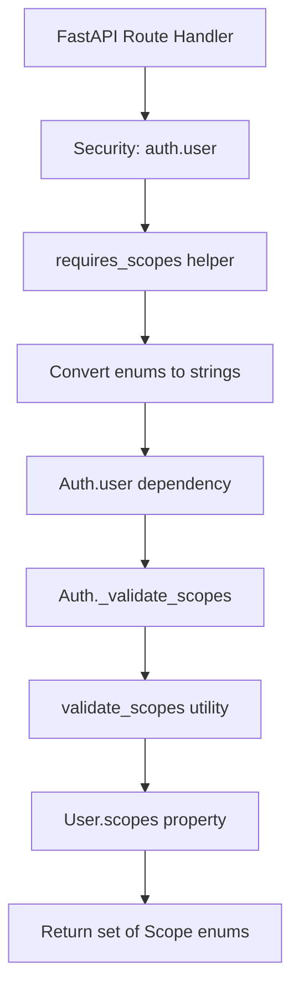
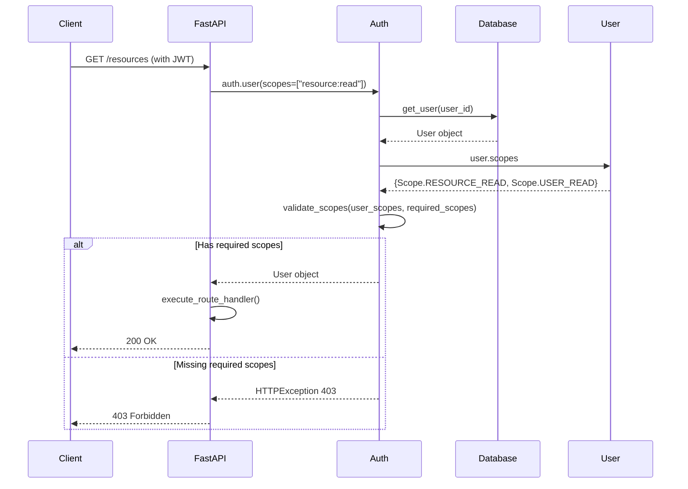
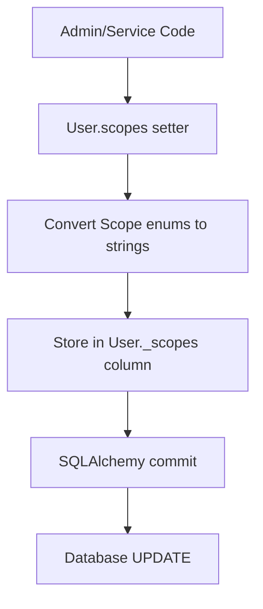
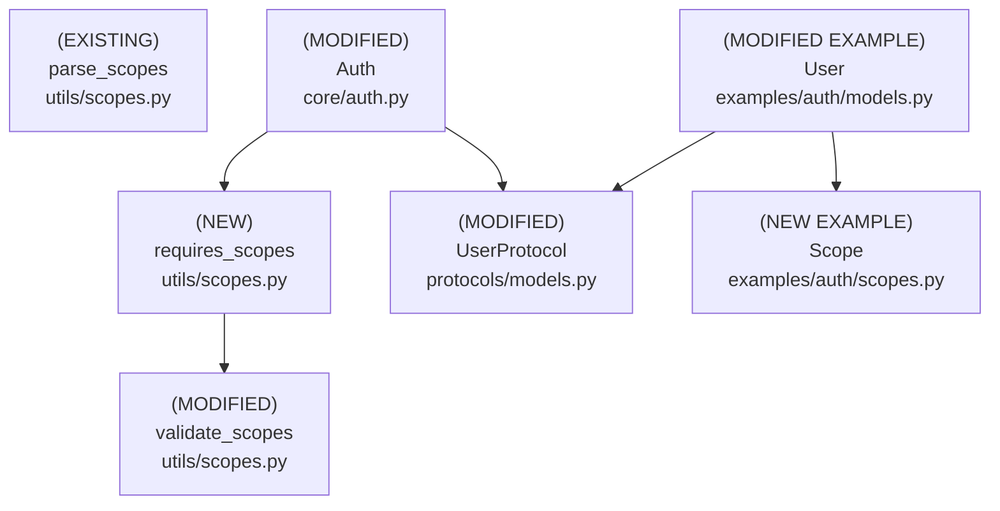

# Design Document: User Scopes with StrEnum

## Overview

### High-Level Description
This feature adds infrastructure to belgie for type-safe, StrEnum-based user-level authorization. Instead of providing a fixed set of scopes, belgie will provide the utilities, patterns, and examples that allow library users to define their own custom Scope enums and attach them to their User models. This enables fine-grained access control for protected routes and resources while maintaining maximum flexibility.

The problem this solves: Currently, belgie only handles OAuth provider scopes (stored on the Account model), but lacks a mechanism for application-level user permissions. Applications using belgie cannot easily implement role-based or permission-based access control.

### Goals
- Provide utilities for working with StrEnum-based scopes (any user-defined StrEnum)
- Enable efficient database storage using PostgreSQL ARRAY (default) or JSON (fallback)
- Provide clean API patterns for accessing user scopes as StrEnum sets
- Update auth validation flow to check user scopes with minimal boilerplate
- Allow users to define their own Scope enums without modifying belgie
- Provide example implementations showing PostgreSQL ARRAY and SQLite JSON patterns
- Enable direct usage of Scope enums (e.g., `Scope.RESOURCE_READ`) without `.value`

### Non-Goals
- Will not provide a predefined set of scopes (users define their own)
- This is not a full RBAC (Role-Based Access Control) system with role hierarchies
- Will not support dynamic scope creation at runtime (scopes are defined in code)
- Will not provide OAuth scope synchronization (OAuth scopes remain on Account model)
- Will not implement scope inheritance or hierarchies in the initial version
- Will not provide automatic scope assignment based on external factors

## Workflows

### Workflow 1: Defining Custom Scopes

#### Description
Library users define their own Scope enum using Python's StrEnum, following the pattern provided in belgie examples.

#### Usage Example
```python
# In user's application code (e.g., myapp/auth/scopes.py)
from enum import StrEnum

class Scope(StrEnum):
    """Custom application scopes."""
    # Resource permissions
    RESOURCE_READ = "resource:read"
    RESOURCE_WRITE = "resource:write"
    RESOURCE_DELETE = "resource:delete"

    # User management
    USER_READ = "user:read"
    USER_WRITE = "user:write"

    # Admin
    ADMIN = "admin"

    # Custom business logic scopes
    REPORT_GENERATE = "report:generate"
    BILLING_VIEW = "billing:view"
```

#### Key Components
- **User-defined StrEnum** - Application-specific scope definitions
- **StrEnum** (Python 3.11+) - Built-in enum type with string values

### Workflow 2: Protecting Routes with Scopes

#### Description
Developers protect FastAPI routes with scope requirements using belgie's `requires_scopes()` helper, which allows direct use of Scope enums without calling `.value`.

#### Usage Example
```python
from myapp.auth.scopes import Scope
from belgie.auth.core import Auth
from belgie.auth.utils import requires_scopes
from fastapi import FastAPI, Security

app = FastAPI()
auth = Auth(...)

# Protect routes with scope requirements
@app.get("/resources")
async def get_resources(
    user: User = Security(auth.user, scopes=requires_scopes(Scope.RESOURCE_READ))
):
    # Only users with RESOURCE_READ scope can access
    return {"resources": [...]}

# Multiple scope requirements (user must have ALL)
@app.delete("/resources/{id}")
async def delete_resource(
    id: str,
    user: User = Security(
        auth.user,
        scopes=requires_scopes(Scope.RESOURCE_DELETE, Scope.RESOURCE_WRITE)
    )
):
    return {"deleted": id}

# Check scopes programmatically in route handlers
@app.get("/admin/users")
async def admin_users(user: User = Security(auth.user)):
    # user.scopes is a set of Scope enums (not strings!)
    if Scope.ADMIN not in user.scopes:
        raise HTTPException(403, "Admin access required")
    return {"users": [...]}
```

#### Call Graph


#### Sequence Diagram


#### Key Components
- **requires_scopes Helper** (`src/belgie/auth/utils/scopes.py:requires_scopes`) - Converts Scope enums to strings for FastAPI
- **Auth.user Dependency** (`src/belgie/auth/core/auth.py:Auth.user`) - Validates user scopes
- **validate_scopes Utility** (`src/belgie/auth/utils/scopes.py:validate_scopes`) - Generic scope validation
- **User.scopes Property** (user-defined model) - Returns set of Scope enums

### Workflow 3: Managing User Scopes

#### Description
Administrators or backend services can update user scopes by modifying the user's scopes set and saving to the database.

#### Usage Example
```python
from myapp.auth.scopes import Scope
from myapp.auth.models import User
from belgie.auth.adapters.alchemy import AlchemyAdapter

adapter = AlchemyAdapter[User, Account, Session, OAuthState]()

# Get user from database
async with get_db() as db:
    user = await adapter.get_user(db, user_id)

    # Assign scopes (accepts Scope enums directly, no .value needed)
    user.scopes = {Scope.RESOURCE_READ, Scope.RESOURCE_WRITE}

    # Add a scope
    user.scopes = user.scopes | {Scope.ADMIN}

    # Remove a scope
    user.scopes = user.scopes - {Scope.RESOURCE_DELETE}

    # Save to database
    await db.commit()
```

#### Call Graph


#### Key Components
- **User.scopes Property** (user-defined) - Accepts Scope enums, stores as strings
- **Database Persistence** - PostgreSQL ARRAY or JSON column
- **AlchemyAdapter** - No changes needed, works with existing patterns

## Dependencies



## Detailed Design

### Module Structure

```
src/belgie/
├── auth/
│   ├── protocols/
│   │   └── models.py           # Updated UserProtocol (MODIFIED)
│   ├── utils/
│   │   └── scopes.py           # Enhanced utilities (MODIFIED + NEW)
│   └── core/
│       └── auth.py             # Updated scope validation (MODIFIED)
├── __test__/
│   └── auth/
│       ├── utils/
│       │   └── test_scopes.py           # Updated tests for utilities
│       └── core/
│           └── test_auth_integration.py # Integration tests with scopes
examples/auth/
├── scopes.py                    # Example Scope enum (NEW)
├── models.py                    # Updated User with scopes (MODIFIED)
└── models_sqlite.py             # SQLite variant example (NEW)
```

### API Design

#### `src/belgie/auth/utils/scopes.py`
Generic utilities for working with any StrEnum-based scopes (leaf node, see [Implementation Order](#implementation-order) #1).

```python
from enum import StrEnum
from typing import TypeVar

ScopeT = TypeVar('ScopeT', bound=StrEnum)

def requires_scopes(*scopes: ScopeT) -> list[str]: ...
# NEW: Helper to convert Scope enums to strings for FastAPI Security
# Used in: Workflow 2 (route protection)
# 1. Accept variable number of StrEnum scope arguments
# 2. Convert each scope to its string value using scope.value
# 3. Return list of string values
# 4. Enables clean API: requires_scopes(Scope.READ, Scope.WRITE)
# Instead of: [Scope.READ.value, Scope.WRITE.value]

def validate_scopes(
    user_scopes: set[ScopeT] | set[str],
    required_scopes: set[ScopeT] | set[str]
) -> bool: ...
# MODIFIED: Enhanced to support any StrEnum, not just specific Scope type
# Used in: Workflow 2 (Auth._validate_scopes)
# 1. Normalize user_scopes to set of strings:
#    - If elements are StrEnum, use {s.value for s in user_scopes}
#    - If strings, use as-is
# 2. Normalize required_scopes to set of strings same way
# 3. Use set.issubset() to check required_set <= user_set
# 4. Return boolean result
# Works with any StrEnum type, fully generic

def has_any_scope(
    user_scopes: set[ScopeT],
    required_scopes: set[ScopeT]
) -> bool: ...
# NEW: Check if user has ANY of the required scopes
# 1. Use set intersection: user_scopes & required_scopes
# 2. Return True if intersection is non-empty, False otherwise
# Useful for "OR" scope checks (e.g., admin OR resource owner)

def parse_scopes(scopes_str: str) -> list[str]: ...
# EXISTING: Keep unchanged for OAuth provider scope parsing
# Used for Account.scope parsing (not related to user scopes)
```

#### `src/belgie/auth/protocols/models.py`
Update UserProtocol to include scopes attribute without specifying exact enum type (see [Implementation Order](#implementation-order) #2).

```python
from typing import Protocol
from datetime import datetime
from uuid import UUID

class UserProtocol(Protocol):
    # Protocol defining the contract for User models
    # Used in: Auth class type hints, AlchemyAdapter type parameters

    id: UUID
    email: str
    email_verified: bool
    name: str | None
    image: str | None
    created_at: datetime
    updated_at: datetime
    scopes: set  # NEW: User's application-level scopes (generic set)
    # Concrete implementations should type this as set[TheirScopeEnum]
    # Protocol doesn't specify the enum type for maximum flexibility
    # Expected to return set of StrEnum instances (not strings)
```

#### `src/belgie/auth/core/auth.py`
Update auth validation to use user-level scopes (see [Implementation Order](#implementation-order) #3).

```python
from fastapi import HTTPException, Security, status
from fastapi.security import SecurityScopes

from belgie.auth.utils.scopes import validate_scopes
from belgie.auth.protocols.models import UserProtocol

class Auth[UserT: UserProtocol, AccountT, SessionT, OAuthStateT]:
    # Existing Auth class with updated scope validation

    async def user(
        self,
        security_scopes: SecurityScopes,
        session_id: str = Cookie(None),
        db: AsyncSession = Depends(get_db),
    ) -> UserT: ...
    # Main user dependency for route protection (Workflow 2)
    # MODIFIED: Update scope validation logic
    # 1. Existing authentication logic (get user from session) - UNCHANGED
    # 2. If security_scopes.scopes is empty, return user - UNCHANGED
    # 3. NEW: Get user scopes from user.scopes property (returns set of enums)
    # 4. NEW: Call validate_scopes(user.scopes, security_scopes.scopes)
    #    - user.scopes is set of StrEnum instances
    #    - security_scopes.scopes is list of strings from FastAPI
    #    - validate_scopes handles conversion internally
    # 5. If validation fails, raise HTTPException 403 with message:
    #    f"Insufficient scopes. Required: {security_scopes.scopes}"
    # 6. Return user if validation passes

    # REMOVED: Old OAuth provider scope validation logic
    # Previously checked Account.scope (OAuth provider scopes)
    # Now checks User.scopes (application-level scopes)
```

#### `examples/auth/scopes.py`
Example Scope enum for users to copy and customize (NEW EXAMPLE).

```python
from enum import StrEnum

class Scope(StrEnum):
    """Example application scopes.

    Users should copy this file to their application and customize
    the scope definitions to match their business logic.
    """

    # Resource permissions
    RESOURCE_READ = "resource:read"
    RESOURCE_WRITE = "resource:write"
    RESOURCE_DELETE = "resource:delete"

    # User management
    USER_READ = "user:read"
    USER_WRITE = "user:write"
    USER_DELETE = "user:delete"

    # Admin
    ADMIN = "admin"
```

#### `examples/auth/models.py`
Updated User model with scopes using PostgreSQL ARRAY (MODIFIED EXAMPLE, see [Implementation Order](#implementation-order) #4).

```python
from sqlalchemy import ARRAY, String
from sqlalchemy.orm import Mapped, mapped_column
from datetime import datetime
from uuid import UUID, uuid4

from examples.auth.scopes import Scope

class User(Base):
    __tablename__ = "users"

    id: Mapped[UUID] = mapped_column(primary_key=True, default=uuid4)
    email: Mapped[str] = mapped_column(String(255), unique=True, index=True)
    name: Mapped[str | None] = mapped_column(String(255), nullable=True)
    image: Mapped[str | None] = mapped_column(String(500), nullable=True)
    email_verified: Mapped[bool] = mapped_column(default=False)
    created_at: Mapped[datetime] = mapped_column(...)
    updated_at: Mapped[datetime] = mapped_column(...)

    # PostgreSQL ARRAY storage for scopes (efficient, recommended)
    _scopes: Mapped[list[str]] = mapped_column(
        "scopes",
        ARRAY(String),
        nullable=False,
        default=list,
        server_default="{}"  # PostgreSQL empty array literal
    )
    # 1. Store scopes as ARRAY of strings for efficient PostgreSQL storage
    # 2. Use column name "scopes" via mapped_column first parameter
    # 3. Default to empty array for new users
    # 4. More efficient than JSON, supports array operations in SQL

    @property
    def scopes(self) -> set[Scope]: ...
    # 1. Check if self._scopes is empty, return empty set if so
    # 2. Convert each string to Scope enum: {Scope(s) for s in self._scopes}
    # 3. Return the set of Scope enums
    # 4. Raises ValueError if stored scope string not in Scope enum
    # Used in: Workflow 2 (auth validation), Workflow 3 (programmatic access)

    @scopes.setter
    def scopes(self, value: set[Scope] | list[Scope] | set[str]) -> None: ...
    # 1. If value is empty, set self._scopes = [] and return
    # 2. Detect if value contains Scope enums or strings:
    #    - Check first element type using isinstance
    # 3. If Scope enums: convert to strings [s.value for s in value]
    # 4. If strings: validate by converting to Scope enums first (will raise if invalid)
    #    then convert back to strings
    # 5. Store as sorted list in self._scopes for consistent ordering
    # 6. SQLAlchemy automatically detects mutation and marks dirty
    # Used in: Workflow 3 (scope management)
```

#### `examples/auth/models_sqlite.py`
Alternative User model using JSON for SQLite compatibility (NEW EXAMPLE).

```python
from sqlalchemy import JSON, String
from sqlalchemy.orm import Mapped, mapped_column

from examples.auth.scopes import Scope

class User(Base):
    """User model with JSON scope storage for SQLite compatibility.

    Use this pattern when:
    - Testing with SQLite (doesn't support ARRAY)
    - Using MySQL (limited ARRAY support)
    - Need maximum database portability

    For PostgreSQL production, prefer models.py with ARRAY.
    """
    __tablename__ = "users"

    # ... same fields as models.py ...

    # JSON storage for scopes (SQLite compatible)
    _scopes: Mapped[list[str]] = mapped_column(
        "scopes",
        JSON,
        nullable=False,
        default=list,
        server_default="[]"  # JSON empty array
    )
    # 1. Store scopes as JSON array for database portability
    # 2. Less efficient than PostgreSQL ARRAY but works everywhere
    # 3. SQLite, MySQL, PostgreSQL all support JSON type

    @property
    def scopes(self) -> set[Scope]:
        # Same implementation as models.py
        ...

    @scopes.setter
    def scopes(self, value: set[Scope] | list[Scope] | set[str]) -> None:
        # Same implementation as models.py
        ...
```

### Testing Strategy

Tests should be organized by module/file and cover unit tests, integration tests, and edge cases.

#### `src/belgie/__test__/auth/utils/test_scopes.py` (Updated)

**requires_scopes Function Tests:**
- Test `requires_scopes()` with single Scope enum
- Test `requires_scopes()` with multiple Scope enums
- Test `requires_scopes()` returns list of string values
- Test `requires_scopes()` preserves order
- Test `requires_scopes()` with custom user-defined StrEnum

**validate_scopes Function Tests:**
- Test `validate_scopes()` with Scope enum sets (user has all required)
- Test `validate_scopes()` with Scope enum sets (user missing some required) - should return False
- Test `validate_scopes()` with string sets (backward compatibility)
- Test `validate_scopes()` with mixed Scope enums and strings (should work)
- Test `validate_scopes()` with empty required_scopes (should always return True)
- Test `validate_scopes()` with empty user_scopes (should return False unless required is empty)
- Test `validate_scopes()` works with different StrEnum types (not just Scope)
- Test case sensitivity (should be case-sensitive via enum values)

**has_any_scope Function Tests:**
- Test `has_any_scope()` with user having at least one required scope
- Test `has_any_scope()` with user having none of the required scopes
- Test `has_any_scope()` with user having all required scopes
- Test `has_any_scope()` with empty sets (edge cases)

**parse_scopes Function Tests:**
- Keep existing tests unchanged (OAuth provider scope parsing)

#### `examples/auth/test_models.py` (New)

**User Model Scope Tests (PostgreSQL ARRAY version):**
- Test User model can be instantiated with empty scopes (default)
- Test User.scopes property getter returns empty set for new user
- Test User.scopes property getter converts stored strings to Scope enums
- Test User.scopes property setter accepts set of Scope enums
- Test User.scopes property setter accepts list of Scope enums
- Test User.scopes property setter validates scope enums (no .value needed)
- Test User.scopes property setter with invalid strings raises ValueError
- Test User.scopes property setter with empty set/list
- Test User.scopes roundtrip (set -> store -> get returns same scopes)
- Test User.scopes persists to database correctly with ARRAY type
- Test database constraint: _scopes default value is empty array
- Test adding/removing individual scopes using set operations
- Test SQLAlchemy detects mutations properly

**User Model Scope Tests (SQLite JSON version):**
- Same tests as above but using models_sqlite.py
- Verify JSON serialization works correctly
- Test migration between ARRAY and JSON formats (documentation)

#### `src/belgie/__test__/auth/core/test_auth_integration.py` (Updated)

**Auth Integration Tests with Scopes:**
- Test [Workflow 2](#workflow-2-protecting-routes-with-scopes) end-to-end:
  - Create user with specific scopes
  - Create session for user
  - Call protected route with `requires_scopes()` helper
  - Verify user.scopes contains Scope enums (not strings)
  - Call route with insufficient scopes - should return 403
  - Call route without scopes requirement - should succeed
- Test route with multiple scope requirements via `requires_scopes(Scope.A, Scope.B)`
- Test `requires_scopes()` helper converts enums to strings for FastAPI
- Test user with no scopes cannot access scope-protected routes
- Test user with ADMIN scope can access admin routes
- Test scope validation error message includes required scopes
- Test backward compatibility: OAuth provider scopes not used for validation
- Test with custom user-defined Scope enum (not example Scope)
- Mock database and session creation for isolated testing

**Edge Cases to Cover:**
- User with empty scopes set accessing protected routes
- Route requiring empty scopes list (should allow all authenticated users)
- Large number of scopes on a user (performance test)
- Scope enum value mismatch between code and database (should raise error)
- Database null vs empty array for _scopes column
- Concurrent scope modifications (SQLAlchemy session handling)

## Implementation

### Implementation Order

Based on the dependency graph, implement in the following order (leaf nodes first):

1. **Scope Utilities** (`src/belgie/auth/utils/scopes.py`) - Implement first (no dependencies)
   - Used in: [Workflow 2](#workflow-2-protecting-routes-with-scopes), [Workflow 3](#workflow-3-managing-user-scopes)
   - Dependencies: None (stdlib only)
   - Add `requires_scopes()`, enhance `validate_scopes()`, add `has_any_scope()`

2. **UserProtocol Update** (`src/belgie/auth/protocols/models.py`) - Implement second (no dependencies)
   - Used in: Auth class type hints
   - Dependencies: None
   - Add generic `scopes: set` attribute

3. **Auth Validation Update** (`src/belgie/auth/core/auth.py`) - Implement third (depends on utilities)
   - Used in: [Workflow 2](#workflow-2-protecting-routes-with-scopes)
   - Dependencies: requires_scopes, validate_scopes, UserProtocol
   - Update `Auth.user()` to validate user.scopes

4. **Example Scope Enum** (`examples/auth/scopes.py`) - Implement fourth (example, no dependencies)
   - Used in: Example User model
   - Dependencies: None (stdlib StrEnum)
   - Demonstrate pattern for users to follow

5. **Example User Model (PostgreSQL)** (`examples/auth/models.py`) - Implement fifth (depends on example Scope)
   - Used in: [Workflow 2](#workflow-2-protecting-routes-with-scopes), [Workflow 3](#workflow-3-managing-user-scopes)
   - Dependencies: Scope, SQLAlchemy
   - Add `_scopes` ARRAY column and property pattern

6. **Example User Model (SQLite)** (`examples/auth/models_sqlite.py`) - Implement sixth (alternative example)
   - Used in: Testing and SQLite deployments
   - Dependencies: Scope, SQLAlchemy
   - Add `_scopes` JSON column and property pattern

7. **Database Migration** - Generate Alembic migration for examples
   - Used in: Example application
   - Dependencies: Updated User models
   - Users will create their own migrations

### Tasks

- [ ] **Implement core library utilities** (leaf nodes)
  - [ ] Implement `requires_scopes()` in `utils/scopes.py` (#1)
    - [ ] Accept variadic StrEnum arguments
    - [ ] Convert to list of string values
    - [ ] Make fully generic (works with any StrEnum)
  - [ ] Enhance `validate_scopes()` in `utils/scopes.py` (#1)
    - [ ] Add support for StrEnum comparison
    - [ ] Make generic (TypeVar for any StrEnum)
    - [ ] Maintain backward compatibility with strings
  - [ ] Implement `has_any_scope()` in `utils/scopes.py` (#1)
    - [ ] Implement set intersection logic
    - [ ] Make generic for any StrEnum
  - [ ] Write unit tests for `utils/scopes.py`
    - [ ] Test requires_scopes with various enums
    - [ ] Test validate_scopes with Scope enums
    - [ ] Test validate_scopes with strings (backward compat)
    - [ ] Test validate_scopes with custom StrEnum types
    - [ ] Test has_any_scope with various scenarios
    - [ ] Test edge cases (empty sets, None values)

- [ ] **Update protocols** (depends on nothing)
  - [ ] Update `UserProtocol` in `protocols/models.py` (#2)
    - [ ] Add `scopes: set` attribute (generic, not typed to specific enum)
  - [ ] No tests needed for protocol (structural typing)

- [ ] **Update Auth validation** (depends on utilities, protocol)
  - [ ] Update `Auth.user()` method in `core/auth.py` (#3)
    - [ ] Get user.scopes (set of StrEnum instances)
    - [ ] Call validate_scopes(user.scopes, security_scopes.scopes)
    - [ ] Update error messages to include required scopes
    - [ ] Remove old OAuth provider scope validation logic
  - [ ] Update integration tests for `core/auth.py`
    - [ ] Test [Workflow 2](#workflow-2-protecting-routes-with-scopes) end-to-end
    - [ ] Test route protection with requires_scopes() helper
    - [ ] Test error responses for insufficient scopes
    - [ ] Test with custom user-defined Scope enum

- [ ] **Create example implementations** (examples for users)
  - [ ] Create `examples/auth/scopes.py` (#4)
    - [ ] Define example Scope enum with common permissions
    - [ ] Add docstring explaining users should customize
  - [ ] Update `examples/auth/models.py` (#5)
    - [ ] Add `_scopes: Mapped[list[str]]` with ARRAY type
    - [ ] Implement `scopes` property getter
    - [ ] Implement `scopes` property setter
    - [ ] Add docstring explaining PostgreSQL ARRAY usage
  - [ ] Create `examples/auth/models_sqlite.py` (#6)
    - [ ] Same as models.py but with JSON type
    - [ ] Add docstring explaining SQLite compatibility
  - [ ] Write tests for example models
    - [ ] Test scopes property getter/setter (both versions)
    - [ ] Test scope validation in setter
    - [ ] Test database persistence (ARRAY and JSON)
    - [ ] Test edge cases (empty scopes, invalid strings)

- [ ] **Documentation and examples**
  - [ ] Update example application to use scopes
    - [ ] Show how to define custom Scope enum
    - [ ] Show route protection with requires_scopes()
    - [ ] Show programmatic scope checks
    - [ ] Show scope management (add/remove)
  - [ ] Add migration example for existing applications
    - [ ] Show how to add scopes column
    - [ ] Show data migration for existing users
  - [ ] Document ARRAY vs JSON trade-offs
    - [ ] When to use ARRAY (PostgreSQL production)
    - [ ] When to use JSON (SQLite, MySQL, portability)

- [ ] **Integration and validation**
  - [ ] Run all tests to ensure nothing broke (`uv run pytest`)
  - [ ] Run type checker to catch any type issues (`uv run ty`)
  - [ ] Run linter and fix any issues (`uv run ruff check`)
  - [ ] Test against PostgreSQL database (ARRAY type)
  - [ ] Test against SQLite database (JSON type)
  - [ ] Verify pre-commit hooks pass
  - [ ] Test with custom user-defined Scope enum (not example Scope)

## Open Questions

1. Should `requires_scopes()` accept a mix of scopes and strings, or only scopes?
   - Recommendation: Only accept StrEnum scopes for type safety
   - Users can pass strings directly to Security() if needed

2. Should we provide a base utility class for scope-enabled User models?
   - Recommendation: No, keep it as a pattern/example for flexibility
   - Different apps have different User base classes

3. Do we need separate validation for "any of" vs "all of" scopes in routes?
   - Recommendation: `requires_scopes()` is "all of" (FastAPI default)
   - Add `requires_any_scope()` helper for "any of" use case

4. Should we provide a migration script generator for adding scopes to existing Users?
   - Recommendation: Provide documentation and example migration
   - Users create their own Alembic migrations

5. How should we handle scope enum changes in production (add/remove/rename)?
   - Recommendation: Document best practices in migration guide
   - Adding scopes: safe, just deploy code
   - Removing scopes: check no users have it first
   - Renaming scopes: data migration required

## Future Enhancements

- Add scope hierarchy system (parent scopes imply child scopes)
  - Could be implemented by users in their Scope enum with custom logic
  - Or add a ScopeHierarchy utility to belgie
- Implement scope groups/roles (e.g., "editor" role = multiple scopes)
  - Users can create their own Role enum that maps to Scope sets
  - Or add RoleToScope utility to belgie
- Add `requires_any_scope()` helper for "OR" logic
  - Complement to `requires_scopes()` which is "AND" logic
- Create scope audit logging utilities
  - Track when scopes are granted/revoked
  - Store scope change history
- Add time-limited scopes support
  - Scopes that expire after a duration
  - Requires additional database schema
- Add scope delegation utilities
  - User can grant subset of their scopes to another user
  - Useful for delegation/impersonation features
- Create CLI tool for scope management
  - List users by scope
  - Grant/revoke scopes
  - Audit scope usage

## Libraries

### New Libraries

No new external libraries required. Uses Python 3.11+ stdlib:
- `enum.StrEnum` - Built into Python 3.11+
- `typing.TypeVar` - Built into Python stdlib

### Existing Libraries

| Library | Current Version | Purpose | Dependency Group |
|---------|-----------------|---------|------------------|
| `sqlalchemy` | `>=2.0.0` | Database ORM, ARRAY and JSON column types | core |
| `fastapi` | `>=0.100.0` | Security, SecurityScopes | core |
| `pytest` | `>=7.0.0` | Testing framework | dev |
| `pytest-asyncio` | Latest | Async test support | dev |

## Alternative Approaches

### Approach 1: Predefined Scope Enum in Library

**Description**: Provide a fixed Scope enum in belgie that all applications must use.

```python
# In belgie/auth/types/scopes.py
class Scope(StrEnum):
    RESOURCE_READ = "resource:read"
    RESOURCE_WRITE = "resource:write"
    # ... fixed set of scopes
```

**Pros**:
- Simple for users to get started
- Standardized scope names across applications
- No need to define custom enum

**Cons**:
- Not flexible - can't add custom scopes
- Breaks library philosophy (users should define their domain)
- Forces specific scope naming conventions
- Can't remove unused scopes

**Why not chosen**: Belgie is a library, not a framework. Users should define their own domain-specific scopes. Providing a fixed set would be too opinionated and limit flexibility.

### Approach 2: String-Based Scopes (No StrEnum)

**Description**: Keep scopes as plain strings throughout, no enum at all.

```python
# No Scope enum
user.scopes = {"resource:read", "resource:write"}

@app.get("/resources")
async def get_resources(user: User = Security(auth.user, scopes=["resource:read"])):
    pass
```

**Pros**:
- Maximum flexibility (any string is valid)
- No enum conversion overhead
- Works with any Python version (no StrEnum requirement)
- Simpler mental model

**Cons**:
- No type safety (typos not caught at development time)
- No IDE autocomplete for scope names
- Harder to refactor (string literals scattered in code)
- No centralized scope definition
- Easy to make mistakes

**Why not chosen**: Type safety and IDE support are major benefits. StrEnum provides compile-time checking and prevents typos. The property pattern allows us to have both: type-safe enums in code, strings in database.

### Approach 3: Bitmask/Bitfield Scopes

**Description**: Assign each scope a bit position and store as integer bitmask.

```python
class Scope(IntEnum):
    RESOURCE_READ = 1 << 0   # 1
    RESOURCE_WRITE = 1 << 1  # 2
    USER_READ = 1 << 2       # 4

class User(Base):
    scopes_bitmask: Mapped[int] = mapped_column(Integer, default=0)
```

**Pros**:
- Very efficient storage (single integer)
- Fast bitwise operations for checking scopes
- Compact representation for up to 64 scopes

**Cons**:
- Limited to 64 scopes (int64)
- Not human-readable in database
- Harder to debug (need to decode bitmask)
- Can't see "resource:read" in database queries
- Adding scopes requires careful bit position management
- Not compatible with StrEnum pattern

**Why not chosen**: Sacrifices readability and flexibility for performance. For typical applications with 5-50 scopes, the performance difference is negligible. String-based approach is more debuggable and maintainable.

### Approach 4: JSON Column Only (No ARRAY)

**Description**: Use JSON column for all databases, including PostgreSQL.

```python
_scopes: Mapped[list[str]] = mapped_column(JSON, default=list)
```

**Pros**:
- Works on all databases (SQLite, MySQL, PostgreSQL)
- Single implementation for all database types
- Simpler to document and teach

**Cons**:
- Less efficient than PostgreSQL ARRAY
- No native array operations in PostgreSQL
- Larger storage size
- Slower queries for scope filtering

**Why not chosen**: PostgreSQL ARRAY is more efficient and provides better query capabilities. Since many production deployments use PostgreSQL, we should default to the optimal solution. Providing both examples (ARRAY and JSON) gives users the best of both worlds.

### Approach 5: Class-Based Scope Validation

**Description**: Use validator classes instead of utility functions.

```python
class ScopeValidator:
    def __init__(self, user_scopes: set[Scope]):
        self.user_scopes = user_scopes

    def has_all(self, required: set[Scope]) -> bool: ...
    def has_any(self, required: set[Scope]) -> bool: ...

# Usage
validator = ScopeValidator(user.scopes)
if validator.has_all({Scope.READ, Scope.WRITE}):
    ...
```

**Pros**:
- More object-oriented design
- Can maintain state between validations
- Easier to extend with custom validation logic

**Cons**:
- More boilerplate (creating instances)
- Heavier memory footprint
- Less functional programming style
- Overkill for simple validation logic

**Why not chosen**: Simple utility functions are more appropriate for stateless validation operations. The functional approach (`validate_scopes()`, `has_any_scope()`) is cleaner and more concise for this use case.
