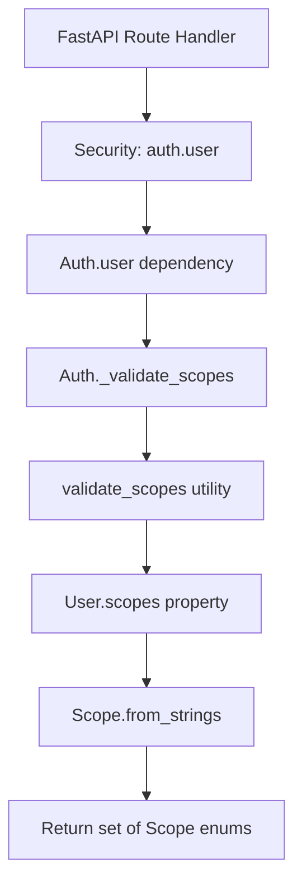
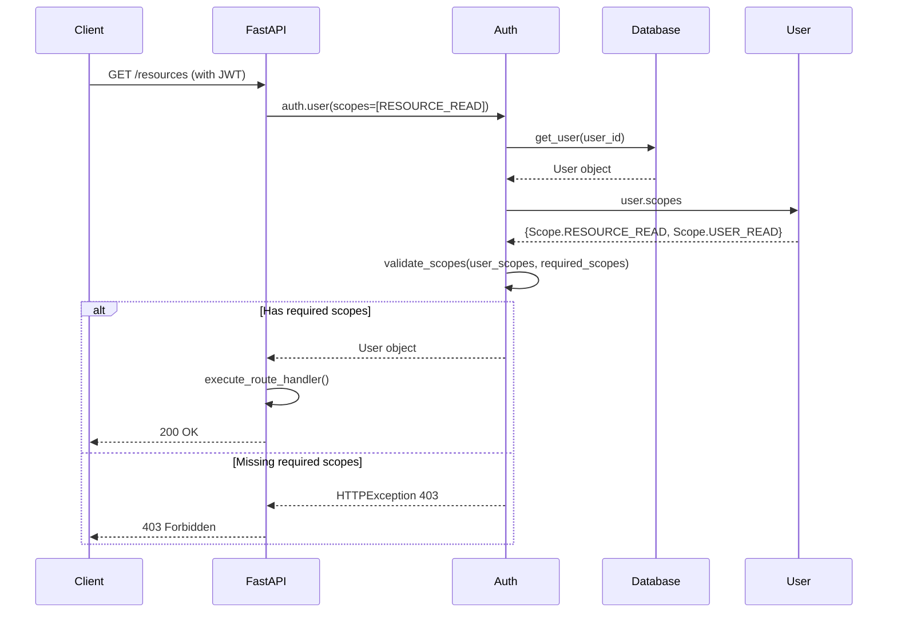
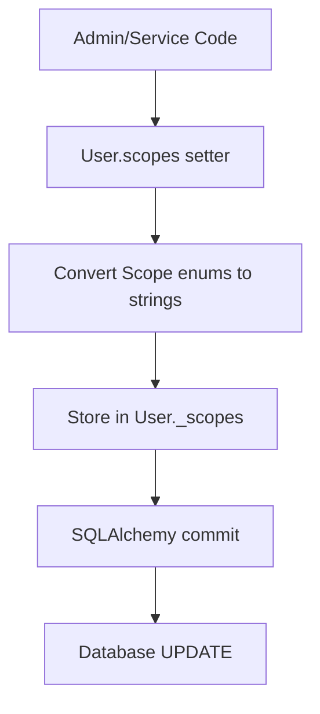
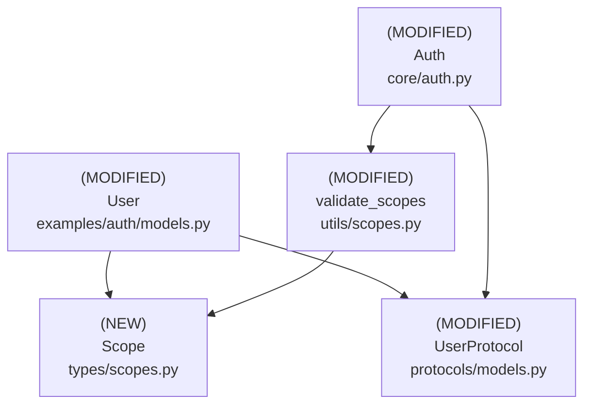

# Design Document: User Scopes with StrEnum

## Overview

### High-Level Description
This feature adds a type-safe, StrEnum-based scope system for user-level authorization in the belgie authentication library. It provides a centralized way to define application scopes (permissions) and attach them to User models, enabling fine-grained access control for protected routes and resources.

The problem this solves: Currently, belgie only handles OAuth provider scopes (stored on the Account model), but lacks a mechanism for application-level user permissions. This makes it difficult to implement role-based or permission-based access control within applications using belgie.

### Goals
- Define application scopes using Python's StrEnum for type safety and IDE support
- Store user scopes in the database efficiently (PostgreSQL ARRAY/JSON, SQLite JSON)
- Provide a clean property-based API for accessing user scopes as StrEnum sets
- Update the auth validation flow to check user scopes instead of OAuth provider scopes
- Maintain backward compatibility with existing UserProtocol and AlchemyAdapter patterns
- Support both SQLite (for testing) and PostgreSQL (for production)

### Non-Goals
- This is not a full RBAC (Role-Based Access Control) system with role hierarchies
- Will not support dynamic scope creation at runtime (scopes are defined in code)
- Will not provide OAuth scope synchronization (OAuth scopes remain on Account model)
- Will not implement scope inheritance or hierarchies (e.g., admin implies all other scopes)
- Will not provide automatic scope assignment based on external factors

## Workflows

### Workflow 1: Defining and Using Scopes

#### Description
Developers define application scopes using StrEnum, create users with specific scopes, and protect routes using FastAPI's Security dependency with scope requirements.

#### Usage Example
```python
from belgie.auth.types.scopes import Scope
from belgie.auth.core import Auth
from fastapi import FastAPI, Security

app = FastAPI()
auth = Auth(...)

# Define a user with scopes (typically during registration or admin assignment)
user = User(
    email="user@example.com",
    scopes={Scope.RESOURCE_READ, Scope.USER_READ}
)

# Protect routes with scope requirements
@app.get("/resources")
async def get_resources(
    user: User = Security(auth.user, scopes=[Scope.RESOURCE_READ.value])
):
    # Only users with RESOURCE_READ scope can access
    return {"resources": [...]}

# Check scopes programmatically in route handlers
@app.delete("/resources/{id}")
async def delete_resource(
    id: str,
    user: User = Security(auth.user, scopes=[Scope.RESOURCE_DELETE.value])
):
    # Additional scope checks if needed
    if Scope.ADMIN in user.scopes:
        # Admin users can delete any resource
        pass
    return {"deleted": id}
```

#### Call Graph


#### Sequence Diagram


#### Key Components
- **Scope Enum** (`src/belgie/auth/types/scopes.py:Scope`) - StrEnum defining all application scopes
- **User.scopes Property** (`examples/auth/models.py:User`) - Property that converts stored strings to Scope enum set
- **validate_scopes Utility** (`src/belgie/auth/utils/scopes.py:validate_scopes`) - Enhanced to support StrEnum comparison
- **Auth Validation** (`src/belgie/auth/core/auth.py:Auth._validate_scopes`) - Updated to use user scopes instead of OAuth scopes

### Workflow 2: Managing User Scopes

#### Description
Administrators or backend services can update user scopes by modifying the user's scopes set and saving to the database.

#### Usage Example
```python
from belgie.auth.types.scopes import Scope
from belgie.auth.adapters.alchemy import AlchemyAdapter

adapter = AlchemyAdapter[User, Account, Session, OAuthState]()

# Get user from database
async with get_db() as db:
    user = await adapter.get_user(db, user_id)

    # Update scopes (assign, add, or remove)
    user.scopes = {Scope.RESOURCE_READ, Scope.RESOURCE_WRITE, Scope.USER_READ}

    # Or add a single scope
    current_scopes = user.scopes
    user.scopes = current_scopes | {Scope.ADMIN}

    # Or remove a scope
    user.scopes = user.scopes - {Scope.RESOURCE_DELETE}

    # Save to database
    await db.commit()
```

#### Call Graph


#### Key Components
- **User.scopes Setter** (`examples/auth/models.py:User.scopes`) - Converts Scope enum set to storable format
- **Database Persistence** - SQLAlchemy handles JSON serialization
- **AlchemyAdapter** (`src/belgie/auth/adapters/alchemy.py`) - No changes needed, works with existing patterns

## Dependencies



## Detailed Design

### Module Structure

```
src/belgie/
├── auth/
│   ├── types/
│   │   └── scopes.py           # Scope StrEnum (NEW)
│   ├── protocols/
│   │   └── models.py           # Updated UserProtocol (MODIFIED)
│   ├── utils/
│   │   └── scopes.py           # Enhanced validate_scopes (MODIFIED)
│   └── core/
│       └── auth.py             # Updated scope validation (MODIFIED)
├── __test__/
│   └── auth/
│       ├── types/
│       │   └── test_scopes.py           # Unit tests for Scope enum
│       ├── utils/
│       │   └── test_scopes.py           # Updated tests for validate_scopes
│       └── core/
│           └── test_auth_integration.py # Integration tests with scopes
examples/auth/
└── models.py                    # Updated User model (MODIFIED)
```

### API Design

#### `src/belgie/auth/types/scopes.py`
Type-safe scope definitions using Python's StrEnum (leaf node, see [Implementation Order](#implementation-order) #1).

```python
from enum import StrEnum

class Scope(StrEnum):
    # Application-level user scopes for authorization
    # Used in: Workflow 1 (route protection), Workflow 2 (scope management)

    # Resource permissions
    RESOURCE_READ = "resource:read"
    RESOURCE_WRITE = "resource:write"
    RESOURCE_DELETE = "resource:delete"

    # User management
    USER_READ = "user:read"
    USER_WRITE = "user:write"
    USER_DELETE = "user:delete"

    # Admin
    ADMIN = "admin"

    @classmethod
    def from_string(cls, scope_str: str) -> "Scope": ...
    # 1. Use cls(scope_str) to convert string to enum
    # 2. Catch ValueError if scope_str is not a valid scope
    # 3. Raise ValueError with descriptive message: f"Invalid scope: {scope_str}"
    # 4. Return the Scope enum value
    # Used in: from_strings() for batch conversion

    @classmethod
    def from_strings(cls, scope_strs: list[str] | set[str]) -> set["Scope"]: ...
    # 1. Initialize empty set for results
    # 2. Iterate through scope_strs
    # 3. Call cls.from_string() for each string
    # 4. Add each Scope enum to result set
    # 5. Return set of Scope enums
    # Used in: User.scopes property getter, Auth scope validation

    @classmethod
    def to_strings(cls, scopes: set["Scope"]) -> list[str]: ...
    # 1. Convert set of Scope enums to list of string values
    # 2. Use list comprehension: [s.value for s in scopes]
    # 3. Return sorted list for consistent ordering
    # Used in: User.scopes property setter
```

#### `src/belgie/auth/protocols/models.py`
Update UserProtocol to include scopes field (see [Implementation Order](#implementation-order) #2).

```python
from typing import Protocol
from datetime import datetime
from uuid import UUID

from belgie.auth.types.scopes import Scope

class UserProtocol(Protocol):
    # Protocol defining the contract for User models
    # Used in: Auth class type hints, AlchemyAdapter type parameters

    id: UUID
    email: str
    email_verified: bool
    name: str | None
    image: str | None
    created_at: datetime
    updated_at: datetime
    scopes: set[Scope]  # NEW: User's application-level scopes
    # Expected to return set of Scope enums for type safety
    # Implementations should use property pattern to convert from storage format
```

#### `examples/auth/models.py`
Update User model with scopes field using property pattern (see [Implementation Order](#implementation-order) #3).

```python
from sqlalchemy import JSON, String
from sqlalchemy.orm import Mapped, mapped_column
from datetime import datetime
from uuid import UUID, uuid4

from belgie.auth.types.scopes import Scope

class User(Base):
    __tablename__ = "users"

    id: Mapped[UUID] = mapped_column(primary_key=True, default=uuid4)
    email: Mapped[str] = mapped_column(String(255), unique=True, index=True)
    name: Mapped[str | None] = mapped_column(String(255), nullable=True)
    image: Mapped[str | None] = mapped_column(String(500), nullable=True)
    email_verified: Mapped[bool] = mapped_column(default=False)
    created_at: Mapped[datetime] = mapped_column(...)
    updated_at: Mapped[datetime] = mapped_column(...)

    # Internal storage for scopes as JSON list of strings
    _scopes: Mapped[list[str]] = mapped_column(
        "scopes",
        JSON,
        nullable=False,
        default=list,
        server_default="[]"
    )
    # 1. Store scopes as JSON array of strings for database compatibility
    # 2. Works with both SQLite (testing) and PostgreSQL (production)
    # 3. Use column name "scopes" via mapped_column first parameter
    # 4. Default to empty list for new users

    @property
    def scopes(self) -> set[Scope]: ...
    # 1. Check if self._scopes is empty, return empty set if so
    # 2. Call Scope.from_strings(self._scopes) to convert to enums
    # 3. Return the set of Scope enums
    # Used in: Workflow 1 (auth validation), Workflow 2 (programmatic access)

    @scopes.setter
    def scopes(self, value: set[Scope] | list[str] | set[str]) -> None: ...
    # 1. Check if value is empty, set self._scopes = [] and return
    # 2. Check if first element is a Scope enum using isinstance
    # 3. If Scope enums: convert using Scope.to_strings(value)
    # 4. If strings: validate using Scope.from_strings() then convert back
    # 5. Store as sorted list in self._scopes for consistent ordering
    # 6. Mark SQLAlchemy object as modified if needed
    # Used in: Workflow 2 (scope management)
```

#### `src/belgie/auth/utils/scopes.py`
Enhanced scope utilities to support StrEnum (see [Implementation Order](#implementation-order) #4).

```python
from belgie.auth.types.scopes import Scope

def validate_scopes(
    user_scopes: set[Scope] | list[str] | set[str],
    required_scopes: set[Scope] | list[str] | set[str]
) -> bool: ...
# Enhanced to support both StrEnum and string comparison
# Used in: Workflow 1 (Auth._validate_scopes)
# 1. Normalize user_scopes to set of strings:
#    - If contains Scope enums, use {s.value for s in user_scopes}
#    - If strings, convert to set if needed
# 2. Normalize required_scopes to set of strings same way
# 3. Use set.issubset() to check required_set <= user_set
# 4. Return boolean result
# Backward compatible with existing string-based scope checks

def has_any_scope(
    user_scopes: set[Scope],
    required_scopes: set[Scope]
) -> bool: ...
# NEW: Check if user has ANY of the required scopes
# 1. Use set intersection: user_scopes & required_scopes
# 2. Return True if intersection is non-empty, False otherwise
# Useful for "OR" scope checks (e.g., admin OR resource owner)

def parse_scopes(scopes_str: str) -> list[str]: ...
# EXISTING: Keep unchanged for OAuth provider scope parsing
# Used for Account.scope parsing (not related to user scopes)
```

#### `src/belgie/auth/core/auth.py`
Update auth validation to use user-level scopes (see [Implementation Order](#implementation-order) #5).

```python
from fastapi import HTTPException, Security, status
from fastapi.security import SecurityScopes

from belgie.auth.types.scopes import Scope
from belgie.auth.utils.scopes import validate_scopes
from belgie.auth.protocols.models import UserProtocol

class Auth[UserT: UserProtocol, AccountT, SessionT, OAuthStateT]:
    # Existing Auth class with updated scope validation

    async def user(
        self,
        security_scopes: SecurityScopes,
        session_id: str = Cookie(None),
        db: AsyncSession = Depends(get_db),
    ) -> UserT: ...
    # Main user dependency for route protection (Workflow 1)
    # MODIFIED: Update scope validation logic
    # 1. Existing authentication logic (get user from session) - UNCHANGED
    # 2. If security_scopes.scopes is empty, return user - UNCHANGED
    # 3. NEW: Convert security_scopes.scopes (strings) to Scope enums:
    #    - Call Scope.from_strings(security_scopes.scopes)
    #    - Handle invalid scope strings with 500 error (developer error)
    # 4. NEW: Get user scopes from user.scopes property (returns set[Scope])
    # 5. NEW: Call validate_scopes(user.scopes, required_scopes)
    # 6. If validation fails, raise HTTPException 403 with message:
    #    f"Insufficient scopes. Required: {[s.value for s in required_scopes]}"
    # 7. Return user if validation passes

    # REMOVED: Old OAuth provider scope validation logic
    # Previously checked Account.scope (OAuth provider scopes)
    # Now checks User.scopes (application-level scopes)
```

### Testing Strategy

Tests should be organized by module/file and cover unit tests, integration tests, and edge cases.

#### `src/belgie/__test__/auth/types/test_scopes.py`

**Scope Enum Tests:**
- Test all Scope enum values have correct string values (e.g., `Scope.RESOURCE_READ.value == "resource:read"`)
- Test `Scope.from_string()` with valid scope strings (all defined scopes)
- Test `Scope.from_string()` with invalid scope string raises ValueError
- Test `Scope.from_strings()` with list of valid scope strings
- Test `Scope.from_strings()` with set of valid scope strings
- Test `Scope.from_strings()` with empty list returns empty set
- Test `Scope.from_strings()` with mixed valid/invalid scopes (should fail on first invalid)
- Test `Scope.to_strings()` converts set of Scope enums to sorted list of strings
- Test `Scope.to_strings()` with empty set returns empty list
- Use parametrized tests for comprehensive scope coverage

#### `src/belgie/__test__/auth/utils/test_scopes.py` (Updated)

**validate_scopes Function Tests:**
- Test `validate_scopes()` with Scope enum sets (user has all required)
- Test `validate_scopes()` with Scope enum sets (user missing some required) - should return False
- Test `validate_scopes()` with string lists (backward compatibility)
- Test `validate_scopes()` with mixed Scope enums and strings (should work)
- Test `validate_scopes()` with empty required_scopes (should always return True)
- Test `validate_scopes()` with empty user_scopes (should return False unless required is empty)
- Test case sensitivity (should be case-sensitive via enum values)

**has_any_scope Function Tests:**
- Test `has_any_scope()` with user having at least one required scope
- Test `has_any_scope()` with user having none of the required scopes
- Test `has_any_scope()` with user having all required scopes
- Test `has_any_scope()` with empty sets (edge cases)

**parse_scopes Function Tests:**
- Keep existing tests unchanged (OAuth provider scope parsing)

#### `examples/auth/test_models.py` (New)

**User Model Scope Tests:**
- Test User model can be instantiated with empty scopes (default)
- Test User.scopes property getter returns empty set for new user
- Test User.scopes property getter converts stored strings to Scope enums
- Test User.scopes property setter accepts set of Scope enums
- Test User.scopes property setter accepts list of strings (converts to enums first for validation)
- Test User.scopes property setter accepts set of strings
- Test User.scopes property setter with invalid scope strings raises ValueError
- Test User.scopes property setter with empty set/list
- Test User.scopes roundtrip (set -> store -> get returns same scopes)
- Test User.scopes persists to database correctly (integration with SQLAlchemy)
- Test database constraint: _scopes default value is empty JSON array
- Test adding/removing individual scopes using set operations

#### `src/belgie/__test__/auth/core/test_auth_integration.py` (Updated)

**Auth Integration Tests with Scopes:**
- Test [Workflow 1](#workflow-1-defining-and-using-scopes) end-to-end:
  - Create user with specific scopes
  - Create session for user
  - Call protected route with correct scopes - should succeed
  - Call protected route with insufficient scopes - should return 403
  - Call protected route without scopes requirement - should succeed
- Test route with multiple scope requirements (user must have all)
- Test route protection with invalid scope strings in decorator (developer error) - should raise 500
- Test user with no scopes cannot access scope-protected routes
- Test user with ADMIN scope can access admin routes
- Test scope validation error message includes required scopes
- Test backward compatibility: OAuth provider scopes not used for validation
- Mock database and session creation for isolated testing

**Edge Cases to Cover:**
- User with empty scopes set accessing protected routes
- User with scopes as None (should not happen, but handle gracefully)
- Route requiring empty scopes list (should allow all authenticated users)
- Route requiring scopes that don't exist in Scope enum (developer error)
- Large number of scopes on a user (performance test)
- Special characters in scope strings (should be prevented by enum)
- Database null vs empty array for _scopes column

## Implementation

### Implementation Order

Based on the dependency graph, implement in the following order (leaf nodes first):

1. **Scope StrEnum** (`src/belgie/auth/types/scopes.py`) - Implement first (no dependencies)
   - Used in: [Workflow 1](#workflow-1-defining-and-using-scopes), [Workflow 2](#workflow-2-managing-user-scopes)
   - Dependencies: None (stdlib only)

2. **UserProtocol Update** (`src/belgie/auth/protocols/models.py`) - Implement second (depends on Scope)
   - Used in: Auth class type hints
   - Dependencies: Scope

3. **User Model Update** (`examples/auth/models.py`) - Implement third (depends on Scope, UserProtocol)
   - Used in: [Workflow 1](#workflow-1-defining-and-using-scopes), [Workflow 2](#workflow-2-managing-user-scopes)
   - Dependencies: Scope, UserProtocol, SQLAlchemy

4. **Scope Utilities Update** (`src/belgie/auth/utils/scopes.py`) - Implement fourth (depends on Scope)
   - Used in: [Workflow 1](#workflow-1-defining-and-using-scopes) (validation)
   - Dependencies: Scope

5. **Auth Validation Update** (`src/belgie/auth/core/auth.py`) - Implement last (depends on all above)
   - Used in: [Workflow 1](#workflow-1-defining-and-using-scopes) (main orchestrator)
   - Dependencies: Scope, UserProtocol, validate_scopes

6. **Database Migration** - Generate Alembic migration for User._scopes column
   - Used in: Production deployments
   - Dependencies: Updated User model

### Tasks

- [ ] **Implement leaf node components** (no dependencies on new code)
  - [ ] Implement `Scope` StrEnum in `types/scopes.py` (#1)
    - [ ] Define all scope constants (RESOURCE_READ, RESOURCE_WRITE, etc.)
    - [ ] Implement `from_string()` class method
    - [ ] Implement `from_strings()` class method
    - [ ] Implement `to_strings()` class method
  - [ ] Write unit tests for `types/scopes.py`
    - [ ] Test all enum values
    - [ ] Test string conversion methods
    - [ ] Test error handling for invalid scopes
    - [ ] Test edge cases (empty sets, None values)

- [ ] **Update protocols** (depends on Scope)
  - [ ] Update `UserProtocol` in `protocols/models.py` (#2)
    - [ ] Add `scopes: set[Scope]` field to protocol
  - [ ] No tests needed for protocol (structural typing)

- [ ] **Update User model** (depends on Scope, UserProtocol)
  - [ ] Update `User` model in `examples/auth/models.py` (#3)
    - [ ] Add `_scopes: Mapped[list[str]]` column with JSON type
    - [ ] Implement `scopes` property getter
    - [ ] Implement `scopes` property setter
    - [ ] Add default value and server_default for _scopes column
  - [ ] Write unit tests for `examples/auth/models.py`
    - [ ] Test scopes property getter/setter
    - [ ] Test scope validation in setter
    - [ ] Test database persistence (integration test)
    - [ ] Test edge cases (empty scopes, invalid strings, None)

- [ ] **Update scope utilities** (depends on Scope)
  - [ ] Update `validate_scopes()` in `utils/scopes.py` (#4)
    - [ ] Add support for Scope enum comparison
    - [ ] Maintain backward compatibility with strings
  - [ ] Implement `has_any_scope()` in `utils/scopes.py` (#4)
    - [ ] Implement set intersection logic
  - [ ] Update unit tests for `utils/scopes.py`
    - [ ] Test validate_scopes with Scope enums
    - [ ] Test validate_scopes with strings (backward compat)
    - [ ] Test validate_scopes with mixed types
    - [ ] Test has_any_scope with various scenarios

- [ ] **Update Auth validation** (depends on all above)
  - [ ] Update `Auth.user()` method in `core/auth.py` (#5)
    - [ ] Convert security_scopes.scopes strings to Scope enums
    - [ ] Use user.scopes property instead of Account.scope
    - [ ] Update error messages to include required scopes
    - [ ] Remove old OAuth provider scope validation logic
  - [ ] Update integration tests for `core/auth.py`
    - [ ] Test [Workflow 1](#workflow-1-defining-and-using-scopes) end-to-end
    - [ ] Test route protection with various scope combinations
    - [ ] Test error responses for insufficient scopes
    - [ ] Test backward compatibility scenarios

- [ ] **Database migration**
  - [ ] Generate Alembic migration for User._scopes column
    - [ ] Add `scopes` column as JSON type
    - [ ] Set default to empty array `[]`
    - [ ] Make column NOT NULL with default
  - [ ] Test migration up and down
    - [ ] Test on clean database
    - [ ] Test on database with existing users (should add empty scopes)

- [ ] **Integration and validation**
  - [ ] Run all tests to ensure nothing broke (`uv run pytest`)
  - [ ] Run type checker to catch any type issues (`uv run ty`)
  - [ ] Run linter and fix any issues (`uv run ruff check`)
  - [ ] Test against PostgreSQL database (not just SQLite)
  - [ ] Update example application to demonstrate scope usage
  - [ ] Verify pre-commit hooks pass

## Open Questions

1. Should we provide default scopes for new users, or leave empty by default?
   - Recommendation: Start with empty set, let applications decide default scopes

2. Should we implement scope hierarchies (e.g., ADMIN implies all other scopes)?
   - Recommendation: Not in initial version, but design should allow future extension

3. Do we need a migration path for existing users in production databases?
   - Recommendation: Yes, migration should add scopes column with empty array default

4. Should we validate scope strings at route definition time or request time?
   - Current design: Request time (when auth.user is called)
   - Alternative: Add decorator/validator to check at startup

5. Should we support OAuth scope to user scope mapping?
   - Recommendation: Not in initial version, but keep OAuth scopes on Account model separate

## Future Enhancements

- Add scope hierarchy system (parent scopes imply child scopes)
- Implement scope groups/roles (e.g., "editor" role = RESOURCE_READ + RESOURCE_WRITE)
- Add API for programmatic scope management (REST endpoints for admin)
- Create migration helper to map OAuth scopes to user scopes
- Add scope audit logging (track when scopes are granted/revoked)
- Implement time-limited scopes (scopes that expire)
- Add scope delegation (user can grant subset of their scopes to another user)
- Create CLI tool for scope management in production

## Libraries

### New Libraries

No new external libraries required. Uses Python 3.12+ stdlib:
- `enum.StrEnum` - Built into Python 3.11+
- `typing` - Built into Python stdlib

### Existing Libraries

| Library | Current Version | Purpose | Dependency Group |
|---------|-----------------|---------|------------------|
| `sqlalchemy` | `>=2.0.0` | Database ORM, JSON column type | core |
| `fastapi` | `>=0.100.0` | Security, SecurityScopes | core |
| `pytest` | `>=7.0.0` | Testing framework | dev |
| `pytest-asyncio` | Latest | Async test support | dev |

## Alternative Approaches

### Approach 1: PostgreSQL Native ENUM + ARRAY

**Description**: Use PostgreSQL's native ENUM type with ARRAY column instead of JSON.

```python
from sqlalchemy import ARRAY, Enum as SQLEnum

scopes: Mapped[set[Scope]] = mapped_column(
    ARRAY(SQLEnum(Scope, native_enum=True)),
    nullable=False,
    default=set
)
```

**Pros**:
- Database-level validation of scope values
- More efficient storage (smaller than JSON)
- Native array operations in SQL queries
- Type safety at database level

**Cons**:
- Requires PostgreSQL (breaks SQLite test compatibility)
- ENUM changes require database migrations (can't just add scope in Python)
- More complex to set up and maintain
- Harder to debug (need to check database enum type)

**Why not chosen**: Breaking SQLite compatibility is a major issue for testing. The belgie project uses SQLite for example/test databases, and this approach would require PostgreSQL even for development. JSON storage is more flexible and allows adding new scopes without database migrations.

### Approach 2: Many-to-Many Relationship (UserScope Model)

**Description**: Create separate UserScope model with many-to-many relationship to User.

```python
class UserScope(Base):
    __tablename__ = "user_scopes"
    user_id: Mapped[UUID] = mapped_column(ForeignKey("users.id"), primary_key=True)
    scope: Mapped[str] = mapped_column(String(100), primary_key=True)

class User(Base):
    scopes_rel: Mapped[list[UserScope]] = relationship("UserScope")

    @property
    def scopes(self) -> set[Scope]:
        return {Scope(us.scope) for us in self.scopes_rel}
```

**Pros**:
- Normalized database design
- Easy to add/remove individual scopes without loading user
- Can add metadata per scope (granted_at, granted_by, expires_at)
- Better for scope audit logging

**Cons**:
- More complex database schema (additional table, foreign keys)
- Requires JOIN for scope access (performance overhead)
- More complex queries to filter users by scope
- Overkill for simple scope lists

**Why not chosen**: Adds unnecessary complexity for the common case where users have 5-20 scopes. The JSON array approach is simpler, faster for reads (no JOIN), and sufficient for most applications. If scope metadata is needed in the future, it can be added as a separate feature.

### Approach 3: Bitmask/Bitfield Scopes

**Description**: Assign each scope a bit position and store as integer bitmask.

```python
class Scope(IntEnum):
    RESOURCE_READ = 1 << 0   # 1
    RESOURCE_WRITE = 1 << 1  # 2
    USER_READ = 1 << 2       # 4
    # etc.

class User(Base):
    scopes_bitmask: Mapped[int] = mapped_column(Integer, default=0)

    @property
    def scopes(self) -> set[Scope]:
        return {s for s in Scope if self.scopes_bitmask & s}
```

**Pros**:
- Very efficient storage (single integer)
- Fast bitwise operations for checking scopes
- Compact representation for up to 64 scopes (using int64)

**Cons**:
- Limited to fixed number of scopes (32 or 64 depending on int size)
- Not human-readable in database
- Harder to debug (need to decode bitmask)
- Lose string value benefits (can't see "resource:read" in database)
- Adding scopes requires careful bit position management

**Why not chosen**: While efficient, bitmasks sacrifice readability and flexibility. The string-based approach using StrEnum gives us human-readable values in the database, unlimited scope definitions, and is easier to debug. Performance difference is negligible for typical scope counts.

### Approach 4: String-Only (No StrEnum)

**Description**: Keep scopes as plain strings throughout the codebase, no enum.

```python
# No Scope enum, just strings
user.scopes = ["resource:read", "resource:write"]

@app.get("/resources")
async def get_resources(user: User = Security(auth.user, scopes=["resource:read"])):
    pass
```

**Pros**:
- Simplest implementation
- Most flexible (can add scopes dynamically)
- No enum conversion overhead
- Works with any Python version

**Cons**:
- No type safety (typos not caught at development time)
- No IDE autocomplete for scope names
- Harder to refactor (string literals scattered in code)
- No centralized scope definition

**Why not chosen**: Type safety and IDE support are major benefits of using StrEnum. String literals are error-prone and harder to maintain. The StrEnum approach provides the best of both worlds: type-safe Python code with string values in the database.
