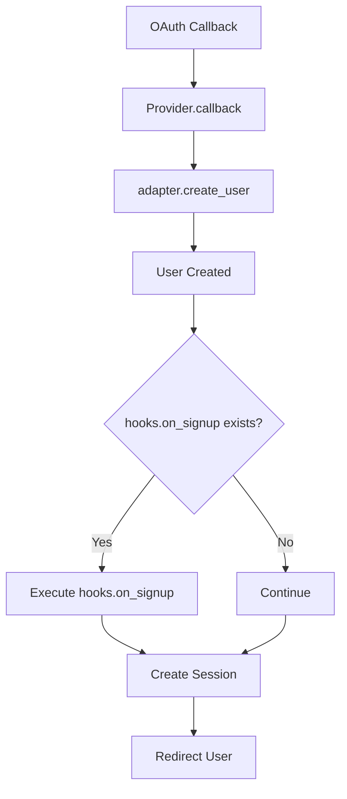
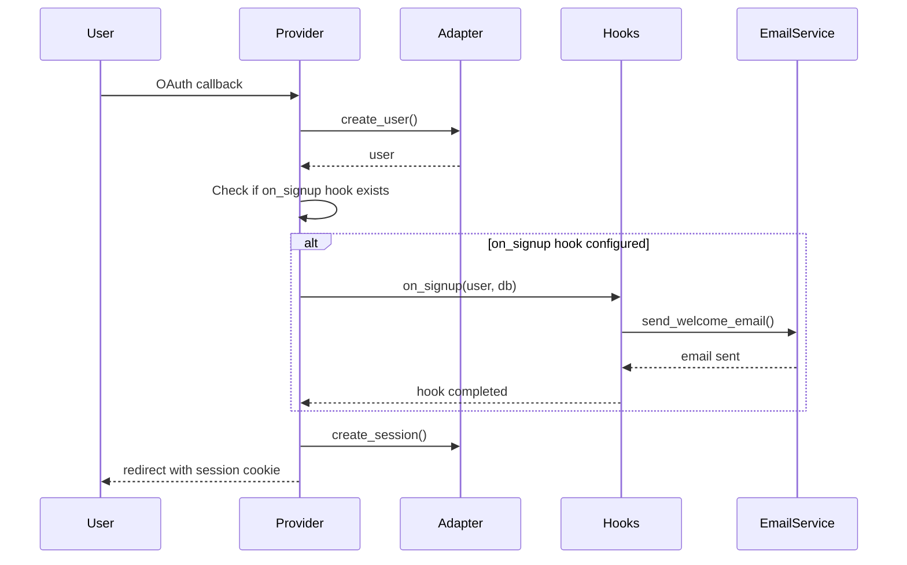
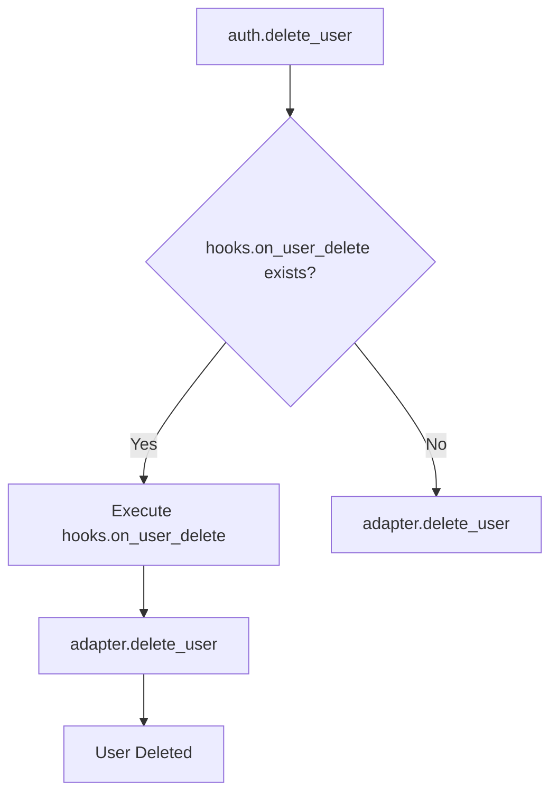
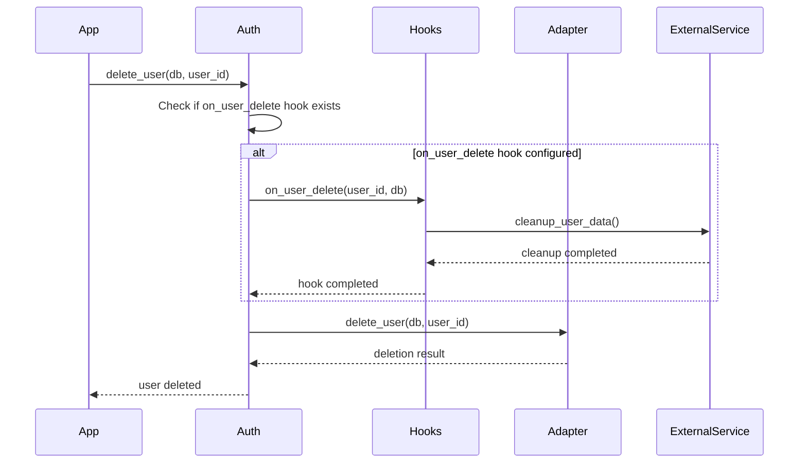
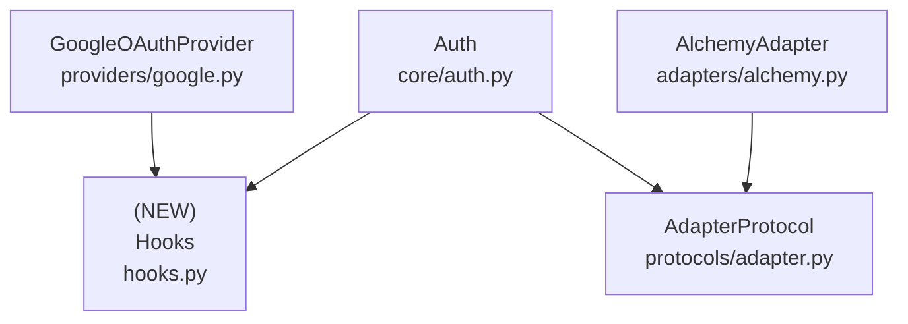

# Design Document: Authentication Event Hooks

## Overview

### High-Level Description
This feature adds an event hook system to the authentication library, allowing users to register callbacks that execute when specific auth events occur. The initial implementation focuses on user lifecycle events: signup and deletion.

The problem this solves: Applications often need to perform additional actions when users sign up or are deleted (e.g., sending welcome emails, creating related records, cleaning up user data, notifying external services). Currently, there's no built-in mechanism to hook into these events.

### Goals
- Provide a simple callback-based API for auth event hooks
- Support user signup and deletion events
- Allow async callback functions for I/O operations (email sending, API calls)
- Ensure hooks are executed reliably within the auth flow
- Pass relevant context to hooks (user data, database session, etc.)

### Non-Goals
- Not implementing email sending functionality (users provide their own)
- Not supporting synchronous callbacks (only async)
- Not providing default hook implementations
- Not supporting hook cancellation/rollback mechanisms
- Not adding hooks for session events, OAuth events, or other non-user-lifecycle events (future enhancement)

## Workflows

### Workflow 1: User Signup with Hook

#### Description
When a new user signs up via OAuth, the system creates the user record and then invokes the `on_signup` hook if configured. The hook receives user data and can perform additional operations.

#### Usage Example
```python
from belgie import Auth, AuthSettings, AlchemyAdapter
from belgie.auth.hooks import Hooks
from sqlalchemy.ext.asyncio import AsyncSession

# Define hook callback
async def send_welcome_email(user: User, db: AsyncSession) -> None:
    # Send welcome email to user.email
    await email_service.send_welcome(user.email, user.name)
    # Create user profile or perform other setup
    await create_user_profile(db, user.id)

# Configure auth with hooks
hooks = Hooks(
    on_signup=send_welcome_email,
)

auth = Auth(
    settings=settings,
    adapter=adapter,
    providers=providers,
    hooks=hooks,
)
```

#### Call Graph


#### Sequence Diagram


#### Key Components
- **Hooks** (`hooks.py:Hooks`) - Container for hook callbacks
- **Provider.callback** (`providers/google.py:callback`) - Trigger point for on_signup
- **adapter.create_user** (`adapters/alchemy.py:create_user`) - Creates user record

### Workflow 2: User Deletion with Hook

#### Description
When a user is deleted, the system invokes the `on_user_delete` hook before deleting the user record. The hook can perform cleanup operations like deleting related data or notifying external services.

#### Usage Example
```python
from belgie import Auth
from belgie.auth.hooks import Hooks
from uuid import UUID

async def cleanup_user_data(user_id: UUID, db: AsyncSession) -> None:
    # Delete user's related data
    await delete_user_files(user_id)
    await delete_user_preferences(user_id)
    # Notify external services
    await analytics_service.track_user_deletion(user_id)

hooks = Hooks(
    on_user_delete=cleanup_user_data,
)

auth = Auth(
    settings=settings,
    adapter=adapter,
    providers=providers,
    hooks=hooks,
)

# Delete user (new method)
await auth.delete_user(db, user_id)
```

#### Call Graph


#### Sequence Diagram


#### Key Components
- **Hooks** (`hooks.py:Hooks`) - Container for hook callbacks
- **Auth.delete_user** (`core/auth.py:delete_user`) - New method to delete users
- **adapter.delete_user** (`protocols/adapter.py:delete_user`) - New protocol method
- **AlchemyAdapter.delete_user** (`adapters/alchemy.py:delete_user`) - Implementation

## Dependencies



## Detailed Design

### Module Structure
```
src/belgie/
├── auth/
│   ├── hooks.py                # New: Hooks dataclass
│   ├── core/
│   │   └── auth.py            # Modified: Add hooks parameter and delete_user method
│   ├── protocols/
│   │   └── adapter.py         # Modified: Add delete_user method
│   ├── adapters/
│   │   └── alchemy.py         # Modified: Implement delete_user
│   └── providers/
│       └── google.py          # Modified: Call on_signup hook
└── __tests__/
    └── auth/
        ├── test_hooks.py               # New: Unit tests for hooks
        ├── test_hooks_integration.py   # New: Integration tests
        └── core/
            └── test_auth.py            # Modified: Add delete_user tests
```

### API Design

#### `src/belgie/auth/hooks.py`
Hook callback definitions and container class.

```python
from collections.abc import Awaitable, Callable
from dataclasses import dataclass
from typing import TYPE_CHECKING
from uuid import UUID

from sqlalchemy.ext.asyncio import AsyncSession

if TYPE_CHECKING:
    from belgie.auth.protocols.models import UserProtocol

# Type aliases for hook signatures
OnSignupHook = Callable[["UserProtocol", AsyncSession], Awaitable[None]]
# 1. Receives newly created user object
# 2. Receives database session for additional operations
# 3. Returns None (async)
# Called after user is created but before session creation

OnUserDeleteHook = Callable[[UUID, AsyncSession], Awaitable[None]]
# 1. Receives user_id of user being deleted
# 2. Receives database session for cleanup operations
# 3. Returns None (async)
# Called before user is actually deleted from database

@dataclass(slots=True, kw_only=True, frozen=True)
class Hooks:
    # Container for auth event hooks (see Implementation Order #1)
    # All hooks are optional (None by default)

    on_signup: OnSignupHook | None = None
    # Hook called after user creation during OAuth flow
    # Used for: sending welcome emails, creating user profiles, analytics tracking
    # Called in: Workflow 1 (see sequence diagram)

    on_user_delete: OnUserDeleteHook | None = None
    # Hook called before user deletion
    # Used for: cleanup operations, external service notifications, audit logging
    # Called in: Workflow 2 (see sequence diagram)
```

#### `src/belgie/auth/protocols/adapter.py`
Add delete_user method to adapter protocol.

```python
# Add to AdapterProtocol class

async def delete_user(self, db: AsyncSession, user_id: UUID) -> bool:
    """Delete a user and all related data.

    Args:
        db: Async database session
        user_id: UUID of the user to delete

    Returns:
        True if user was deleted, False if user not found

    Implementation Notes:
        Should delete:
        - User record
        - All associated accounts (OAuth connections)
        - All associated sessions
        Does NOT need to delete OAuth state (temporary, auto-expires)
    """
    ...
```

#### `src/belgie/auth/adapters/alchemy.py`
Implement delete_user method.

```python
# Add to AlchemyAdapter class

async def delete_user(self, db: AsyncSession, user_id: UUID) -> bool:
    # 1. Query for user by user_id
    # 2. If user not found, return False
    # 3. Delete all sessions for user: DELETE FROM session WHERE user_id = ?
    # 4. Delete all accounts for user: DELETE FROM account WHERE user_id = ?
    # 5. Delete user record: DELETE FROM user WHERE id = ?
    # 6. Commit transaction
    # 7. Return True
    # Used in: Workflow 2 (see call graph)
    ...
```

#### `src/belgie/auth/core/auth.py`
Modify Auth class to accept hooks and add delete_user method.

```python
# Modify Auth.__init__ signature

def __init__(
    self,
    settings: AuthSettings,
    adapter: AlchemyAdapter[UserT, AccountT, SessionT, OAuthStateT],
    providers: Providers | None = None,
    hooks: Hooks | None = None,  # NEW parameter
) -> None:
    # 1. Store existing parameters (settings, adapter, session_manager, providers)
    # 2. Store hooks parameter as self.hooks (default to None if not provided)
    # Used in: Workflow 1, Workflow 2


# Add new method

async def delete_user(self, db: AsyncSession, user_id: UUID) -> bool:
    """Delete a user and invoke on_user_delete hook.

    Args:
        db: Async database session
        user_id: UUID of the user to delete

    Returns:
        True if user was deleted, False if user didn't exist

    Example:
        >>> success = await auth.delete_user(db, user_id)
        >>> if success:
        ...     print("User deleted successfully")
    """
    # 1. Check if self.hooks exists and has on_user_delete callback
    # 2. If hook exists, await self.hooks.on_user_delete(user_id, db)
    # 3. Call await self.adapter.delete_user(db, user_id)
    # 4. Return the result from adapter.delete_user
    # Entry point for Workflow 2 (see sequence diagram)
    ...
```

#### `src/belgie/auth/providers/google.py`
Modify callback to invoke on_signup hook.

```python
# In GoogleOAuthProvider.get_router() -> callback function
# After line 216 where user is created

# Get or create user (use walrus operator)
if not (user := await adapter.get_user_by_email(db, user_info.email)):
    user = await adapter.create_user(
        db,
        email=user_info.email,
        email_verified=user_info.verified_email,
        name=user_info.name,
        image=user_info.picture,
    )
    # NEW: Invoke on_signup hook if configured
    # 1. Get hooks from closure (passed via get_router)
    # 2. Check if hooks and hooks.on_signup exist
    # 3. If exists, await hooks.on_signup(user, db)

# Continue with account creation...
```

### Testing Strategy

Tests should be organized by module/file and cover unit tests, integration tests, and edge cases.

#### `test_hooks.py`

**Hooks Class Tests:**
- Test `Hooks` instantiation with all hooks set to None (default)
- Test `Hooks` instantiation with on_signup hook only
- Test `Hooks` instantiation with on_user_delete hook only
- Test `Hooks` instantiation with both hooks configured
- Test `Hooks` is frozen (immutable)
- Test `Hooks` requires keyword arguments only

**Hook Signature Tests:**
- Verify `OnSignupHook` type accepts correct signature
- Verify `OnUserDeleteHook` type accepts correct signature
- Test that hooks must be async functions

#### `test_hooks_integration.py`

**Signup Hook Integration:**
- Test signup hook is called when new user signs up via OAuth
- Test signup hook receives correct user object
- Test signup hook receives valid database session
- Test signup hook can create related records in database
- Test signup hook errors are propagated (don't silently fail)
- Test signup flow works when no hooks configured (backwards compatibility)
- Test existing user signin does NOT trigger signup hook

**Delete Hook Integration:**
- Test delete hook is called before user deletion
- Test delete hook receives correct user_id
- Test delete hook receives valid database session
- Test delete hook can perform cleanup operations
- Test user is deleted even if no hook configured
- Test user deletion returns False if user doesn't exist
- Test hook errors are propagated

**Error Handling:**
- Test what happens when hook raises exception during signup
- Test what happens when hook raises exception during deletion
- Test database transaction behavior when hooks fail

**Edge Cases:**
- Test hooks with None database session (should not happen, but validate)
- Test hooks with invalid user_id
- Test concurrent hook executions (if applicable)

#### `test_auth.py` (modifications)

**Auth Class Tests:**
- Test `Auth.__init__()` accepts hooks parameter
- Test `Auth.__init__()` works without hooks (backwards compatibility)
- Test `Auth.delete_user()` deletes user successfully
- Test `Auth.delete_user()` returns False for non-existent user
- Test `Auth.delete_user()` calls on_user_delete hook if configured
- Test `Auth.delete_user()` works without hooks configured

#### `adapters/test_alchemy.py` (modifications)

**AlchemyAdapter.delete_user Tests:**
- Test `delete_user()` deletes user record
- Test `delete_user()` deletes all user sessions
- Test `delete_user()` deletes all user accounts (OAuth connections)
- Test `delete_user()` returns True on successful deletion
- Test `delete_user()` returns False when user doesn't exist
- Test `delete_user()` handles cascade deletes correctly
- Test `delete_user()` with user that has multiple sessions and accounts

**Edge Cases to Cover:**
- Deleting user with no sessions or accounts
- Deleting user with many sessions and accounts
- Hook receives correct user object immediately after creation
- Hook exceptions don't prevent user deletion (or do they? - design decision)
- Multiple OAuth providers calling signup hook
- Race conditions if multiple requests try to create same user

## Implementation

### Implementation Order

1. **Hooks** (`hooks.py`) - Implement first (leaf node, no dependencies)
   - Used in: [Workflow 1](#workflow-1-user-signup-with-hook), [Workflow 2](#workflow-2-user-deletion-with-hook)
   - Dependencies: None (only type imports)

2. **AdapterProtocol.delete_user** (`protocols/adapter.py`) - Add protocol method
   - Used in: [Workflow 2](#workflow-2-user-deletion-with-hook)
   - Dependencies: None (protocol definition)

3. **AlchemyAdapter.delete_user** (`adapters/alchemy.py`) - Implement delete_user
   - Used in: [Workflow 2](#workflow-2-user-deletion-with-hook) (see call graph)
   - Dependencies: AdapterProtocol

4. **Auth.__init__ + Auth.delete_user** (`core/auth.py`) - Add hooks support and delete method
   - Used in: [Workflow 1](#workflow-1-user-signup-with-hook), [Workflow 2](#workflow-2-user-deletion-with-hook)
   - Dependencies: Hooks, AdapterProtocol

5. **Provider modifications** (`providers/google.py`) - Add on_signup hook call
   - Used in: [Workflow 1](#workflow-1-user-signup-with-hook) (see sequence diagram)
   - Dependencies: Hooks, Auth (for accessing hooks)

### Tasks

- [ ] **Implement leaf node components** (no dependencies on new code)
  - [ ] Implement `Hooks` dataclass in `hooks.py` (#1)
    - [ ] Define `OnSignupHook` type alias
    - [ ] Define `OnUserDeleteHook` type alias
    - [ ] Implement `Hooks` dataclass with frozen, slots, kw_only
  - [ ] Write unit tests for `hooks.py`
    - [ ] Test Hooks instantiation with various configurations
    - [ ] Test Hooks immutability
    - [ ] Test type signatures

- [ ] **Implement protocol and adapter changes**
  - [ ] Add `delete_user()` method to `AdapterProtocol` (#2)
  - [ ] Implement `delete_user()` in `AlchemyAdapter` (#3)
    - [ ] Delete user sessions
    - [ ] Delete user accounts
    - [ ] Delete user record
  - [ ] Write unit tests for `AlchemyAdapter.delete_user()`
    - [ ] Test successful deletion
    - [ ] Test deletion returns False for non-existent user
    - [ ] Test cascade deletes (sessions, accounts)

- [ ] **Integrate hooks into Auth class**
  - [ ] Modify `Auth.__init__()` to accept hooks parameter (#4)
  - [ ] Implement `Auth.delete_user()` method with hook support (#4)
  - [ ] Write unit tests for Auth with hooks
    - [ ] Test Auth initialization with/without hooks
    - [ ] Test delete_user method

- [ ] **Integrate hooks into providers**
  - [ ] Modify `GoogleOAuthProvider.get_router()` to accept hooks (#5)
  - [ ] Update `Auth.router` property to pass hooks to providers
  - [ ] Add on_signup hook call in provider callback (#5)
  - [ ] Test provider integration with hooks

- [ ] **Integration and validation**
  - [ ] Add integration tests for [Workflow 1](#workflow-1-user-signup-with-hook) (signup hook)
  - [ ] Add integration tests for [Workflow 2](#workflow-2-user-deletion-with-hook) (delete hook)
  - [ ] Test error handling and edge cases
  - [ ] Add type hints and run type checker (`uv run ty`)
  - [ ] Run linter and fix issues (`uv run ruff check`)
  - [ ] Verify all tests pass (`uv run pytest`)
  - [ ] Commit changes with conventional commit message

## Open Questions

1. Should hook errors prevent the auth operation (signup/deletion) or just be logged?
   - **Recommendation**: Propagate errors - let application decide how to handle
2. Should we pass the entire user object or just user_id to on_user_delete?
   - **Recommendation**: Just user_id - user might already be soft-deleted or modified
3. Do we need a hook for user updates (profile changes)?
   - **Recommendation**: Out of scope for now, add in future enhancement
4. Should hooks be optional parameters or required with None defaults?
   - **Recommendation**: Optional parameter with None default for backwards compatibility

## Future Enhancements

- Add `on_signin` hook for tracking user logins
- Add `on_signout` hook for cleanup on logout
- Add `on_session_expired` hook for expired session handling
- Add `on_account_linked` hook when OAuth provider is connected
- Add `on_account_unlinked` hook when OAuth provider is removed
- Add hook priority/ordering system for multiple hooks
- Add hook retry mechanism for transient failures
- Add async event queue for decoupling hooks from auth flow
- Add built-in hooks for common operations (email sending templates)

## Alternative Approaches

### Approach 1: Callback Lists Instead of Single Callbacks

**Description**: Allow multiple callbacks per event instead of single callback.

```python
hooks = Hooks(
    on_signup=[send_welcome_email, create_profile, track_analytics],
)
```

**Pros**:
- More flexible - can register multiple handlers per event
- Better separation of concerns (each callback does one thing)
- Easier to compose behaviors from multiple sources

**Cons**:
- More complex implementation
- Need to decide on error handling (stop on first error? collect all errors?)
- Need to decide on execution order
- Users can compose their own callbacks if needed

**Why not chosen**: YAGNI (You Ain't Gonna Need It). Single callback is simpler and users can compose multiple operations within one callback. Can add this later if needed without breaking changes.

### Approach 2: Event Emitter Pattern

**Description**: Use event emitter pattern like Node.js EventEmitter.

```python
auth.on('user:signup', send_welcome_email)
auth.on('user:delete', cleanup_data)
await auth.emit('user:signup', user, db)
```

**Pros**:
- More flexible and extensible
- Can add/remove listeners dynamically
- Familiar pattern from other ecosystems
- Easy to add new event types

**Cons**:
- String-based event names are error-prone (no type safety)
- More complex implementation
- Harder to type hint correctly
- Overkill for 2 events

**Why not chosen**: Too complex for the current use case. Type-safe callback approach with explicit fields (`on_signup`, `on_user_delete`) provides better IDE support and type safety.

### Approach 3: Abstract Base Class for Hooks

**Description**: Define hooks as abstract base class that users subclass.

```python
class MyHooks(AuthHooks):
    async def on_signup(self, user: User, db: AsyncSession) -> None:
        await send_welcome_email(user)

    async def on_user_delete(self, user_id: UUID, db: AsyncSession) -> None:
        await cleanup_data(user_id)

auth = Auth(settings, adapter, providers, hooks=MyHooks())
```

**Pros**:
- Clear contract via abstract methods
- Can maintain state in hook class if needed
- Easier to mock in tests (subclass with test implementations)

**Cons**:
- More boilerplate for users
- Overkill for simple callbacks
- Forces OOP style when functional might be clearer
- Requires implementing all methods even if only using one hook

**Why not chosen**: Dataclass with optional callbacks is more Pythonic and flexible. Users who want a class-based approach can create a class with methods and pass those methods to the Hooks dataclass.
