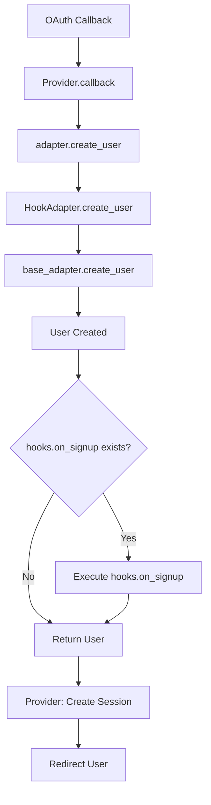
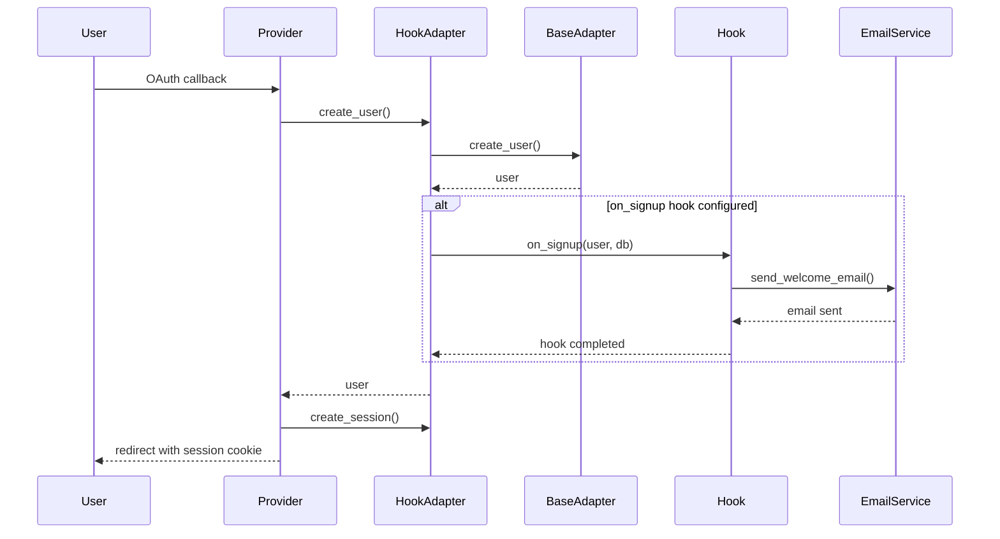
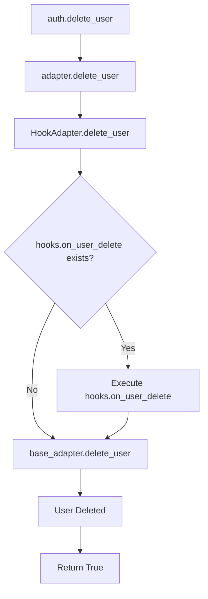
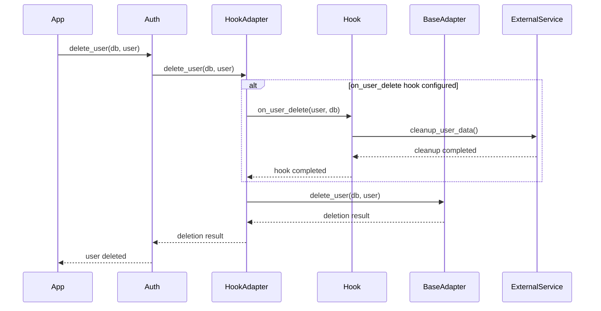
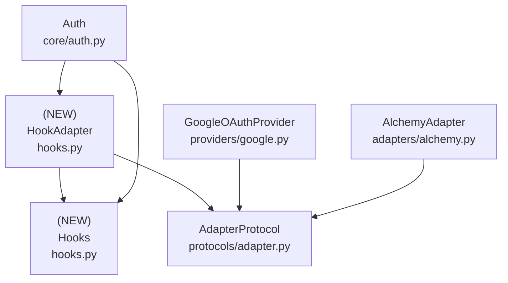

# Design Document: Authentication Event Hooks

## Overview

### High-Level Description
This feature adds an event hook system to the authentication library, allowing users to register callbacks that execute when specific auth events occur. The initial implementation focuses on user lifecycle events: signup and deletion.

Hooks are invoked transparently via an adapter wrapper pattern, ensuring providers remain decoupled from hook logic. The system is fully generic over both user types and database session types, making it adapter-agnostic.

The problem this solves: Applications often need to perform additional actions when users sign up or are deleted (e.g., sending welcome emails, creating related records, cleaning up user data, notifying external services). Currently, there's no built-in mechanism to hook into these events.

### Goals
- Provide a simple callback-based API for auth event hooks
- Support user signup and deletion events
- Allow async callback functions for I/O operations (email sending, API calls)
- Ensure hooks are executed reliably within the auth flow
- Keep providers decoupled from hook implementation details
- Support any adapter type (not just SQLAlchemy) via generic session types
- Pass relevant context to hooks (user data, database session, etc.)

### Non-Goals
- Not implementing email sending functionality (users provide their own)
- Not supporting synchronous callbacks (only async)
- Not providing default hook implementations
- Not supporting hook cancellation/rollback mechanisms
- Not adding hooks for session events, OAuth events, or other non-user-lifecycle events (future enhancement)

## Workflows

### Workflow 1: User Signup with Hook

#### Description
When a new user signs up via OAuth, the provider calls `adapter.create_user()`. The HookAdapter wrapper intercepts this call, creates the user via the underlying adapter, then invokes the `on_signup` hook if configured. The hook receives user data and can perform additional operations.

#### Usage Example
```python
from belgie import Auth, AuthSettings, AlchemyAdapter
from belgie.auth.hooks import Hooks
from sqlalchemy.ext.asyncio import AsyncSession

# Define hook callback
async def send_welcome_email(user: User, db: AsyncSession) -> None:
    # Send welcome email to user.email
    await email_service.send_welcome(user.email, user.name)
    # Create user profile or perform other setup
    await create_user_profile(db, user.id)

# Configure auth with hooks
hooks = Hooks(
    on_signup=send_welcome_email,
)

auth = Auth(
    settings=settings,
    adapter=adapter,
    providers=providers,
    hooks=hooks,
)
# Auth wraps adapter with HookAdapter internally - transparent to providers
```

#### Call Graph


#### Sequence Diagram


#### Key Components
- **Hooks** (`hooks.py:Hooks`) - Container for hook callbacks
- **HookAdapter** (`hooks.py:HookAdapter`) - Wrapper that intercepts adapter calls
- **Provider.callback** (`providers/google.py:callback`) - Uses adapter transparently
- **base_adapter.create_user** (`adapters/alchemy.py:create_user`) - Creates user record

### Workflow 2: User Deletion with Hook

#### Description
When a user is deleted via `Auth.delete_user()`, the method passes the call to `adapter.delete_user()`. The HookAdapter wrapper invokes the `on_user_delete` hook before delegating to the underlying adapter. The hook can perform cleanup operations like deleting related data or notifying external services.

#### Usage Example
```python
from belgie import Auth
from belgie.auth.hooks import Hooks

async def cleanup_user_data(user: User, db: AsyncSession) -> None:
    # Delete user's related data
    await delete_user_files(user.id)
    await delete_user_preferences(user.id)
    # Notify external services
    await analytics_service.track_user_deletion(user.id)

hooks = Hooks(
    on_user_delete=cleanup_user_data,
)

auth = Auth(
    settings=settings,
    adapter=adapter,
    providers=providers,
    hooks=hooks,
)

# Get user first, then delete
user = await auth.adapter.get_user_by_id(db, user_id)
if user:
    await auth.delete_user(db, user)
```

#### Call Graph


#### Sequence Diagram


#### Key Components
- **Hooks** (`hooks.py:Hooks`) - Container for hook callbacks
- **HookAdapter** (`hooks.py:HookAdapter`) - Wrapper that intercepts delete_user
- **Auth.delete_user** (`core/auth.py:delete_user`) - New method to delete users
- **adapter.delete_user** (`protocols/adapter.py:delete_user`) - New protocol method
- **AlchemyAdapter.delete_user** (`adapters/alchemy.py:delete_user`) - Implementation

## Dependencies



## Detailed Design

### Module Structure
```
src/belgie/
├── auth/
│   ├── hooks.py                # New: Hooks dataclass + HookAdapter wrapper
│   ├── core/
│   │   └── auth.py            # Modified: Add hooks parameter, wrap adapter, add delete_user
│   ├── protocols/
│   │   └── adapter.py         # Modified: Add DBSessionT type param, add delete_user method
│   ├── adapters/
│   │   └── alchemy.py         # Modified: Implement delete_user
│   └── providers/
│       └── google.py          # No changes - uses adapter transparently
└── __tests__/
    └── auth/
        ├── test_hooks.py               # New: Unit tests for hooks and HookAdapter
        ├── test_hooks_integration.py   # New: Integration tests
        └── core/
            └── test_auth.py            # Modified: Add delete_user tests
```

### API Design

#### `src/belgie/auth/hooks.py`
Hook callback definitions, container class, and adapter wrapper.

```python
from collections.abc import Awaitable, Callable
from dataclasses import dataclass
from typing import TYPE_CHECKING, Any

if TYPE_CHECKING:
    from belgie.auth.protocols.adapter import AdapterProtocol
    from belgie.auth.protocols.models import UserProtocol

# Type aliases for hook signatures (generic over user and session types)
OnSignupHook[UserT, DBSessionT] = Callable[[UserT, DBSessionT], Awaitable[None]]
# 1. Receives newly created user object
# 2. Receives database session for additional operations
# 3. Returns None (async)
# Called after user is created but before returning to provider

OnUserDeleteHook[UserT, DBSessionT] = Callable[[UserT, DBSessionT], Awaitable[None]]
# 1. Receives user object being deleted
# 2. Receives database session for cleanup operations
# 3. Returns None (async)
# Called before user is actually deleted from database

@dataclass(slots=True, kw_only=True, frozen=True)
class Hooks[UserT, DBSessionT]:
    # Container for auth event hooks (see Implementation Order #1)
    # Generic over user type and database session type
    # All hooks are optional (None by default)

    on_signup: OnSignupHook[UserT, DBSessionT] | None = None
    # Hook called after user creation during OAuth flow
    # Used for: sending welcome emails, creating user profiles, analytics tracking
    # Called in: Workflow 1 (see sequence diagram)

    on_user_delete: OnUserDeleteHook[UserT, DBSessionT] | None = None
    # Hook called before user deletion
    # Used for: cleanup operations, external service notifications, audit logging
    # Called in: Workflow 2 (see sequence diagram)


class HookAdapter[UserT: "UserProtocol", AccountT, SessionT, OAuthStateT, DBSessionT]:
    # Adapter wrapper that intercepts create_user and delete_user calls
    # Implements AdapterProtocol and delegates to underlying adapter
    # Generic over all adapter type parameters plus DBSessionT

    def __init__(
        self,
        adapter: "AdapterProtocol[UserT, AccountT, SessionT, OAuthStateT, DBSessionT]",
        hooks: Hooks[UserT, DBSessionT] | None = None,
    ) -> None: ...
    # 1. Store adapter as self._adapter
    # 2. Store hooks as self._hooks (None if not provided)
    # Used in: Auth.__init__ to wrap base adapter

    async def create_user(
        self,
        db: DBSessionT,
        email: str,
        name: str | None = None,
        image: str | None = None,
        *,
        email_verified: bool = False,
    ) -> UserT: ...
    # 1. Call self._adapter.create_user(...) to create user
    # 2. If self._hooks and self._hooks.on_signup exist, await on_signup(user, db)
    # 3. Return user object
    # Entry point for Workflow 1 hook invocation

    async def delete_user(self, db: DBSessionT, user: UserT) -> bool: ...
    # 1. If self._hooks and self._hooks.on_user_delete exist, await on_user_delete(user, db)
    # 2. Call self._adapter.delete_user(db, user)
    # 3. Return result from adapter
    # Entry point for Workflow 2 hook invocation

    # All other AdapterProtocol methods delegate directly to self._adapter
    async def get_user_by_id(self, db: DBSessionT, user_id: UUID) -> UserT | None: ...
    async def get_user_by_email(self, db: DBSessionT, email: str) -> UserT | None: ...
    async def update_user(self, db: DBSessionT, user_id: UUID, **updates: Any) -> UserT | None: ...
    async def create_account(self, db: DBSessionT, user_id: UUID, provider: str, provider_account_id: str, **tokens: Any) -> AccountT: ...
    async def get_account(self, db: DBSessionT, provider: str, provider_account_id: str) -> AccountT | None: ...
    async def get_account_by_user_and_provider(self, db: DBSessionT, user_id: UUID, provider: str) -> AccountT | None: ...
    async def update_account(self, db: DBSessionT, user_id: UUID, provider: str, **tokens: Any) -> AccountT | None: ...
    async def create_session(self, db: DBSessionT, user_id: UUID, expires_at: datetime, ip_address: str | None = None, user_agent: str | None = None) -> SessionT: ...
    async def get_session(self, db: DBSessionT, session_id: UUID) -> SessionT | None: ...
    async def update_session(self, db: DBSessionT, session_id: UUID, **updates: Any) -> SessionT | None: ...
    async def delete_session(self, db: DBSessionT, session_id: UUID) -> bool: ...
    async def delete_expired_sessions(self, db: DBSessionT) -> int: ...
    async def create_oauth_state(self, db: DBSessionT, state: str, expires_at: datetime, code_verifier: str | None = None, redirect_url: str | None = None) -> OAuthStateT: ...
    async def get_oauth_state(self, db: DBSessionT, state: str) -> OAuthStateT | None: ...
    async def delete_oauth_state(self, db: DBSessionT, state: str) -> bool: ...

    @property
    def dependency(self) -> Callable[[], Any]: ...
    # Delegate to self._adapter.dependency
```

#### `src/belgie/auth/protocols/adapter.py`
Add DBSessionT type parameter and delete_user method to adapter protocol.

```python
# Modify AdapterProtocol to add DBSessionT type parameter

class AdapterProtocol[
    UserT: UserProtocol,
    AccountT: AccountProtocol,
    SessionT: SessionProtocol,
    OAuthStateT: OAuthStateProtocol,
    DBSessionT,  # NEW: database session type parameter
](Protocol):
    """Protocol for database adapters.

    Defines the interface that all database adapters must implement
    to support authentication operations including user management,
    OAuth account linking, session management, and OAuth state handling.

    Type Parameters:
        UserT: User model type implementing UserProtocol
        AccountT: Account model type implementing AccountProtocol
        SessionT: Session model type implementing SessionProtocol
        OAuthStateT: OAuth state model type implementing OAuthStateProtocol
        DBSessionT: Database session type (e.g., AsyncSession for SQLAlchemy)
    """

    # Update all method signatures to use DBSessionT instead of AsyncSession
    async def create_user(
        self,
        db: DBSessionT,  # Changed from AsyncSession
        email: str,
        name: str | None = None,
        image: str | None = None,
        *,
        email_verified: bool = False,
    ) -> UserT: ...

    # ... (update all other methods similarly)

    # NEW method
    async def delete_user(self, db: DBSessionT, user: UserT) -> bool:
        """Delete a user and all related data.

        Args:
            db: Database session
            user: User object to delete

        Returns:
            True if user was deleted, False if user not found

        Implementation Notes:
            Should delete:
            - User record
            - All associated accounts (OAuth connections)
            - All associated sessions
            Does NOT need to delete OAuth state (temporary, auto-expires)
        """
        ...

    @property
    def dependency(self) -> Callable[[], Any]:
        """FastAPI dependency for database sessions."""
        ...
```

#### `src/belgie/auth/adapters/alchemy.py`
Update type parameters and implement delete_user method.

```python
from sqlalchemy.ext.asyncio import AsyncSession

# Update AlchemyAdapter to add DBSessionT = AsyncSession

class AlchemyAdapter[
    UserT: UserProtocol,
    AccountT: AccountProtocol,
    SessionT: SessionProtocol,
    OAuthStateT: OAuthStateProtocol,
    DBSessionT = AsyncSession,  # NEW: default to AsyncSession for SQLAlchemy
]:
    # Implementation for delete_user

    async def delete_user(self, db: AsyncSession, user: UserT) -> bool:
        # 1. Delete all sessions for user: DELETE FROM session WHERE user_id = ?
        # 2. Delete all accounts for user: DELETE FROM account WHERE user_id = ?
        # 3. Delete user record: DELETE FROM user WHERE id = ?
        # 4. Commit transaction (db.commit())
        # 5. Return True
        # Note: If user doesn't exist, SQLAlchemy will still succeed (idempotent)
        # Used in: Workflow 2 (see call graph)
        ...
```

#### `src/belgie/auth/core/auth.py`
Modify Auth class to accept hooks, wrap adapter, and add delete_user method.

```python
from belgie.auth.hooks import HookAdapter, Hooks

# Modify Auth.__init__ signature

def __init__(
    self,
    settings: AuthSettings,
    adapter: AlchemyAdapter[UserT, AccountT, SessionT, OAuthStateT, DBSessionT],
    providers: Providers | None = None,
    hooks: Hooks[UserT, DBSessionT] | None = None,  # NEW parameter
) -> None:
    """Initialize the Auth instance.

    Args:
        settings: Authentication configuration including session, cookie, and URL settings
        adapter: Database adapter for user, account, session, and OAuth state persistence
        providers: Dictionary of provider settings. Each setting is callable and returns its provider.
                  If None, no providers are registered.
        hooks: Optional hooks for auth events (signup, deletion). If provided, adapter is wrapped
              with HookAdapter to invoke hooks transparently.

    Raises:
        RuntimeError: If router endpoints are accessed without adapter.dependency configured
    """
    # 1. Store settings
    self.settings = settings

    # 2. Wrap adapter with HookAdapter if hooks provided
    self.adapter = HookAdapter(adapter, hooks) if hooks else adapter

    # 3. Create session_manager using wrapped adapter
    self.session_manager = SessionManager(
        adapter=self.adapter,
        max_age=settings.session.max_age,
        update_age=settings.session.update_age,
    )

    # 4. Instantiate providers (same as before)
    self.providers: dict[str, OAuthProviderProtocol] = (
        {provider_id: provider_settings() for provider_id, provider_settings in providers.items()}
        if providers
        else {}
    )
    # Providers use self.adapter - transparently get hooks via HookAdapter


# Add new method

async def delete_user(self, db: DBSessionT, user: UserT) -> bool:
    """Delete a user and invoke on_user_delete hook.

    Args:
        db: Database session
        user: User object to delete

    Returns:
        True if user was deleted, False if user didn't exist

    Example:
        >>> user = await auth.adapter.get_user_by_id(db, user_id)
        >>> if user:
        ...     success = await auth.delete_user(db, user)
        ...     if success:
        ...         print("User deleted successfully")
    """
    # 1. Call self.adapter.delete_user(db, user)
    # 2. Return the result
    # HookAdapter handles hook invocation transparently
    return await self.adapter.delete_user(db, user)
```

### Testing Strategy

Tests should be organized by module/file and cover unit tests, integration tests, and edge cases.

#### `test_hooks.py`

**Hooks Class Tests:**
- Test `Hooks` instantiation with all hooks set to None (default)
- Test `Hooks` instantiation with on_signup hook only
- Test `Hooks` instantiation with on_user_delete hook only
- Test `Hooks` instantiation with both hooks configured
- Test `Hooks` is frozen (immutable)
- Test `Hooks` requires keyword arguments only
- Test `Hooks` is generic over user and session types

**Hook Signature Tests:**
- Verify `OnSignupHook` type accepts correct signature
- Verify `OnUserDeleteHook` type accepts correct signature
- Test that hooks must be async functions

**HookAdapter Tests:**
- Test `HookAdapter` wraps base adapter correctly
- Test `HookAdapter.create_user()` calls on_signup hook when configured
- Test `HookAdapter.create_user()` works without hooks
- Test `HookAdapter.delete_user()` calls on_user_delete hook when configured
- Test `HookAdapter.delete_user()` works without hooks
- Test `HookAdapter` delegates all other methods to base adapter
- Test `HookAdapter.dependency` property delegates to base adapter
- Test hook errors are propagated (not swallowed)

#### `test_hooks_integration.py`

**Signup Hook Integration:**
- Test signup hook is called when new user signs up via OAuth
- Test signup hook receives correct user object
- Test signup hook receives valid database session
- Test signup hook can create related records in database
- Test signup hook errors are propagated (don't silently fail)
- Test signup flow works when no hooks configured (backwards compatibility)
- Test existing user signin does NOT trigger signup hook

**Delete Hook Integration:**
- Test delete hook is called before user deletion
- Test delete hook receives correct user object
- Test delete hook receives valid database session
- Test delete hook can perform cleanup operations
- Test user is deleted even if no hook configured
- Test hook errors are propagated

**Error Handling:**
- Test what happens when hook raises exception during signup
- Test what happens when hook raises exception during deletion
- Test database transaction behavior when hooks fail

**Edge Cases:**
- Test HookAdapter with various adapter implementations
- Test concurrent hook executions (if applicable)
- Test hook with database operations that modify same tables

#### `test_auth.py` (modifications)

**Auth Class Tests:**
- Test `Auth.__init__()` accepts hooks parameter
- Test `Auth.__init__()` wraps adapter with HookAdapter when hooks provided
- Test `Auth.__init__()` uses adapter directly when no hooks
- Test `Auth.delete_user()` deletes user successfully
- Test `Auth.delete_user()` delegates to adapter.delete_user

#### `adapters/test_alchemy.py` (modifications)

**AlchemyAdapter.delete_user Tests:**
- Test `delete_user()` deletes user record
- Test `delete_user()` deletes all user sessions
- Test `delete_user()` deletes all user accounts (OAuth connections)
- Test `delete_user()` returns True on successful deletion
- Test `delete_user()` handles cascade deletes correctly
- Test `delete_user()` with user that has multiple sessions and accounts

**Edge Cases to Cover:**
- Deleting user with no sessions or accounts
- Deleting user with many sessions and accounts
- Hook receives correct user object immediately after creation
- Hook exceptions prevent user creation (transaction rollback)
- Multiple OAuth providers all trigger hooks correctly
- HookAdapter type compatibility with different session types

## Implementation

### Implementation Order

1. **Hooks + HookAdapter** (`hooks.py`) - Implement first (leaf node, minimal dependencies)
   - Used in: [Workflow 1](#workflow-1-user-signup-with-hook), [Workflow 2](#workflow-2-user-deletion-with-hook)
   - Dependencies: AdapterProtocol (type-only import)

2. **AdapterProtocol updates** (`protocols/adapter.py`) - Add DBSessionT and delete_user
   - Used in: [Workflow 2](#workflow-2-user-deletion-with-hook)
   - Dependencies: None (protocol definition)

3. **AlchemyAdapter.delete_user** (`adapters/alchemy.py`) - Implement delete_user
   - Used in: [Workflow 2](#workflow-2-user-deletion-with-hook) (see call graph)
   - Dependencies: AdapterProtocol

4. **Auth modifications** (`core/auth.py`) - Wrap adapter and add delete_user
   - Used in: [Workflow 1](#workflow-1-user-signup-with-hook), [Workflow 2](#workflow-2-user-deletion-with-hook)
   - Dependencies: Hooks, HookAdapter, AdapterProtocol

### Tasks

- [ ] **Implement leaf node components** (no dependencies on new code)
  - [ ] Add `DBSessionT` type parameter to `AdapterProtocol` (#2)
  - [ ] Update all `AdapterProtocol` method signatures to use `DBSessionT`
  - [ ] Add `delete_user()` method to `AdapterProtocol`
  - [ ] Implement `Hooks` dataclass in `hooks.py` (#1)
    - [ ] Define `OnSignupHook[UserT, DBSessionT]` type alias
    - [ ] Define `OnUserDeleteHook[UserT, DBSessionT]` type alias
    - [ ] Implement `Hooks` dataclass with frozen, slots, kw_only, generic
  - [ ] Implement `HookAdapter` wrapper class in `hooks.py` (#1)
    - [ ] Implement `__init__` to store adapter and hooks
    - [ ] Implement `create_user` with on_signup hook invocation
    - [ ] Implement `delete_user` with on_user_delete hook invocation
    - [ ] Implement delegation for all other AdapterProtocol methods
  - [ ] Write unit tests for `hooks.py`
    - [ ] Test Hooks instantiation with various configurations
    - [ ] Test Hooks immutability and generics
    - [ ] Test HookAdapter wrapping and delegation
    - [ ] Test hook invocation logic

- [ ] **Implement adapter changes**
  - [ ] Update `AlchemyAdapter` type parameters to include `DBSessionT = AsyncSession` (#3)
  - [ ] Update all `AlchemyAdapter` method signatures to use `AsyncSession` (explicit, not DBSessionT)
  - [ ] Implement `delete_user()` in `AlchemyAdapter` (#3)
    - [ ] Delete user sessions
    - [ ] Delete user accounts
    - [ ] Delete user record
  - [ ] Write unit tests for `AlchemyAdapter.delete_user()`
    - [ ] Test successful deletion
    - [ ] Test cascade deletes (sessions, accounts)

- [ ] **Integrate hooks into Auth class**
  - [ ] Modify `Auth.__init__()` to accept hooks parameter (#4)
  - [ ] Wrap adapter with `HookAdapter` when hooks provided (#4)
  - [ ] Implement `Auth.delete_user()` method (#4)
  - [ ] Write unit tests for Auth with hooks
    - [ ] Test Auth initialization with/without hooks
    - [ ] Test adapter wrapping behavior
    - [ ] Test delete_user method

- [ ] **Integration and validation**
  - [ ] Add integration tests for [Workflow 1](#workflow-1-user-signup-with-hook) (signup hook)
  - [ ] Add integration tests for [Workflow 2](#workflow-2-user-deletion-with-hook) (delete hook)
  - [ ] Test error handling and edge cases
  - [ ] Add type hints and run type checker (`uv run ty`)
  - [ ] Run linter and fix issues (`uv run ruff check`)
  - [ ] Verify all tests pass (`uv run pytest`)
  - [ ] Commit changes with conventional commit message

## Open Questions

1. Should hook errors prevent the auth operation (signup/deletion) or just be logged?
   - **Decision**: Propagate errors - let application decide how to handle. Hooks execute within same transaction.

2. Should HookAdapter implement all AdapterProtocol methods or use `__getattr__` for delegation?
   - **Decision**: Implement explicitly for type safety and IDE support

3. Should we support hook priority/ordering for future multi-hook support?
   - **Decision**: Out of scope for now, single callback is sufficient

## Future Enhancements

- Add `on_signin` hook for tracking user logins
- Add `on_signout` hook for cleanup on logout
- Add `on_session_expired` hook for expired session handling
- Add `on_account_linked` hook when OAuth provider is connected
- Add `on_account_unlinked` hook when OAuth provider is removed
- Add hook priority/ordering system for multiple hooks per event
- Add hook retry mechanism for transient failures
- Add async event queue for decoupling hooks from auth flow
- Add built-in hooks for common operations (email sending templates)
- Support callback lists instead of single callbacks

## Alternative Approaches

### Approach 1: Hooks in Providers

**Description**: Have each provider directly invoke hooks instead of using adapter wrapper.

**Pros**:
- Direct control over when hooks are called
- No wrapper layer needed
- Simpler type hierarchy

**Cons**:
- Couples providers to hook implementation
- Requires modifying every provider when adding hooks
- Breaks separation of concerns
- Providers need to know about hooks

**Why not chosen**: Adapter wrapper pattern keeps providers decoupled from hook logic. Providers just call adapter methods normally - hooks are invoked transparently via HookAdapter.

### Approach 2: Callback Lists Instead of Single Callbacks

**Description**: Allow multiple callbacks per event instead of single callback.

```python
hooks = Hooks(
    on_signup=[send_welcome_email, create_profile, track_analytics],
)
```

**Pros**:
- More flexible - can register multiple handlers per event
- Better separation of concerns (each callback does one thing)
- Easier to compose behaviors from multiple sources

**Cons**:
- More complex implementation
- Need to decide on error handling (stop on first error? collect all errors?)
- Need to decide on execution order
- Users can compose their own callbacks if needed

**Why not chosen**: YAGNI (You Ain't Gonna Need It). Single callback is simpler and users can compose multiple operations within one callback. Can add this later if needed without breaking changes.

### Approach 3: Event Emitter Pattern

**Description**: Use event emitter pattern like Node.js EventEmitter.

```python
auth.on('user:signup', send_welcome_email)
auth.on('user:delete', cleanup_data)
await auth.emit('user:signup', user, db)
```

**Pros**:
- More flexible and extensible
- Can add/remove listeners dynamically
- Familiar pattern from other ecosystems
- Easy to add new event types

**Cons**:
- String-based event names are error-prone (no type safety)
- More complex implementation
- Harder to type hint correctly
- Overkill for 2 events

**Why not chosen**: Too complex for the current use case. Type-safe callback approach with explicit fields (`on_signup`, `on_user_delete`) provides better IDE support and type safety.

### Approach 4: Abstract Base Class for Hooks

**Description**: Define hooks as abstract base class that users subclass.

```python
class MyHooks(AuthHooks):
    async def on_signup(self, user: User, db: AsyncSession) -> None:
        await send_welcome_email(user)

    async def on_user_delete(self, user: User, db: AsyncSession) -> None:
        await cleanup_data(user)

auth = Auth(settings, adapter, providers, hooks=MyHooks())
```

**Pros**:
- Clear contract via abstract methods
- Can maintain state in hook class if needed
- Easier to mock in tests (subclass with test implementations)

**Cons**:
- More boilerplate for users
- Overkill for simple callbacks
- Forces OOP style when functional might be clearer
- Requires implementing all methods even if only using one hook

**Why not chosen**: Dataclass with optional callbacks is more Pythonic and flexible. Users who want a class-based approach can create a class with methods and pass those methods to the Hooks dataclass.
