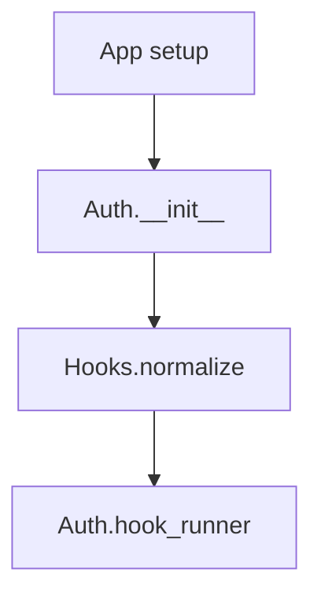
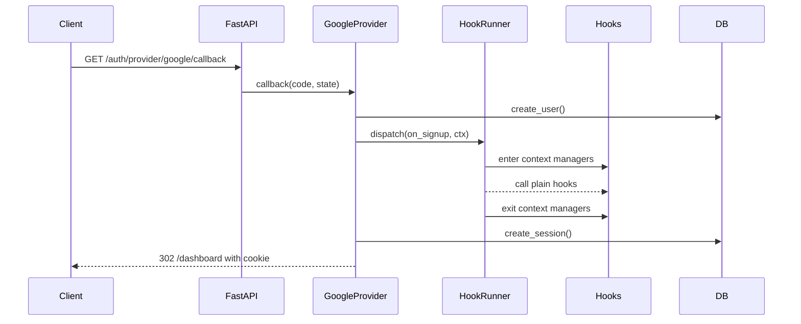
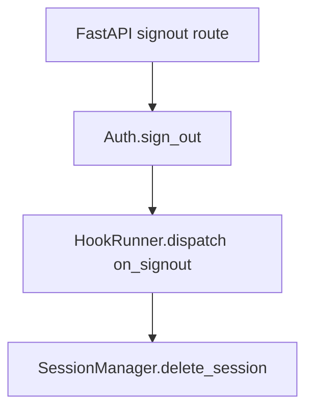
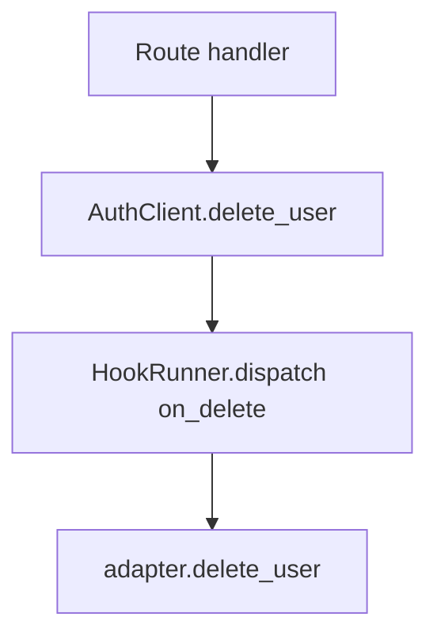
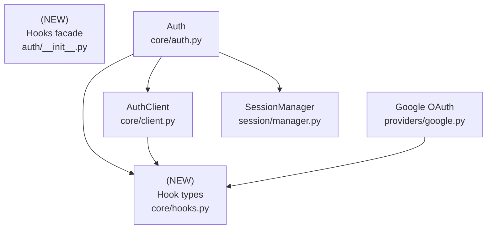

# Design Document: Auth Lifecycle Hooks

## Overview

### High-Level Description
Add a first-class hooks system to Belgie’s auth module, inspired by better-auth, so integrators can attach lifecycle callbacks (e.g., `on_signup`, `on_signin`, `on_signout`). Hooks may be sync or async, and may be regular callables or context-managed callables (sync or async context managers). Each hook receives a typed context containing the authenticated user and the current database session. The system normalizes single functions or sequences and guarantees ordered execution and proper teardown for context managers.

### Goals
- Expose a simple `Hooks` container usable at `Auth` construction time.
- Support sync/async functions and sync/async context managers with uniform dispatch.
- Provide lifecycle events for signup, signin, and signout without breaking existing flows.
- Ensure hooks always receive a consistent context (`user`, `db`) and are cleaned up even on errors.
- Keep backward compatibility for existing Auth usage and providers.

### Non-Goals
- No generic event bus or plugin loader beyond auth lifecycle events.
- No retries, backoff, or background task queue for hooks in this iteration.
- No new persistence or schema changes for tracking hook executions.

## Workflows

### Workflow 1: Registering Hooks on Auth

#### Description
Application configures auth with optional hooks. Hooks can be single callables or sequences; they may be sync/async functions or context managers.

#### Usage Example
```python
from belgie.auth import Auth, AuthSettings
from belgie.auth.adapters.alchemy import AlchemyAdapter
from belgie.auth.core.hooks import Hooks, HookContext

auth = Auth(
    settings=AuthSettings(),
    adapter=adapter,
    hooks=Hooks(
        on_signup=send_welcome_email,                # async def hook(ctx): ...
        on_signin=[audit_login, trace_login_span],   # trace_login_span is @asynccontextmanager
    ),
)
```

#### Call Graph


#### Key Components
- **Auth** (`src/belgie/auth/core/auth.py`) accepts `hooks` and stores a runner.
- **Hooks** (`src/belgie/auth/core/hooks.py`) normalizes user-supplied handlers.
- **HookRunner** (`core/hooks.py`) is responsible for dispatch.

### Workflow 2: OAuth Signup with Hooks

#### Description
During Google OAuth callback, when a new user is created, `on_signup` hooks run. Context managers wrap the post-creation flow; simple functions run after creation.

#### Usage Example
```python
# Inside Google callback after user is created
await hook_runner.dispatch(
    event="on_signup",
    context=HookContext(user=user, db=db),
)
```

#### Sequence Diagram


#### Key Components
- **GoogleOAuthProvider.callback** (`providers/google.py`) invokes `hook_runner.dispatch`.
- **HookRunner** ensures ordered entry/exit of context-managed hooks.

### Workflow 3: Signout with Hooks

#### Description
When a user signs out, hooks run with the existing user (if resolvable) and db session. Hooks fire *before* the session is deleted so they can still observe user/session data; the exit stack still unwinds if deletion fails.

#### Usage Example
```python
@main_router.post("/signout")
async def signout(...):
    client = auth(db)  # reuse AuthClient flow
    async with auth.hook_runner.dispatch("on_signout", HookContext(user=user, db=db)):
        await client.sign_out(session_id)
```

#### Call Graph


#### Key Components
- **Auth.sign_out** (`core/auth.py`) delegates to `AuthClient.sign_out` so hooks and deletion logic stay centralized.

### Workflow 4: Account Deletion with Hooks

#### Description
When an account is deleted through `AuthClient.delete_user`, `on_delete` hooks fire before persistence deletion so observers can inspect related rows (sessions, accounts) while they still exist.

#### Usage Example
```python
user = await client.get_user(SecurityScopes(), request)
await client.delete_user(user)  # triggers on_delete hooks pre-delete
```

#### Call Graph


#### Key Components
- **AuthClient.delete_user** dispatches `"on_delete"` then calls adapter deletion.

## Dependencies



## Detailed Design

### Module Structure

```
src/belgie/auth/
├── core/
│   ├── auth.py                # injects hook runner, passes to providers/clients
│   ├── client.py              # uses hooks in sign_out
│   ├── hooks.py               # NEW: hook types, normalization, runner
│   └── settings.py
├── providers/
│   └── google.py              # invoke signup/signin hooks
└── __init__.py                # export Hooks for user API
__tests__/
└── auth/
    └── hooks/
        ├── test_hooks.py              # unit: sync/async/contextmanager handling
        └── test_hooks_integration.py  # integration: google callback and signout
```

### API Design

#### `src/belgie/auth/core/hooks.py`
Hook types, normalization, and dispatcher.

```python
from collections.abc import AsyncIterator, Awaitable, Callable, Iterable, Sequence
from contextlib import AbstractAsyncContextManager, AbstractContextManager, AsyncExitStack, asynccontextmanager
from dataclasses import dataclass
from typing import Literal
from sqlalchemy.ext.asyncio import AsyncSession
from belgie.auth.protocols.models import UserProtocol

HookEvent = Literal["on_signup", "on_signin", "on_signout", "on_delete"]

@dataclass(frozen=True, slots=True, kw_only=True)
class HookContext[UserT: UserProtocol]:
    user: UserT
    db: AsyncSession

type HookFunc = Callable[[HookContext], None | Awaitable[None]]
type HookCtxMgr = Callable[[HookContext], AbstractContextManager[None] | AbstractAsyncContextManager[None]]
type HookHandler = HookFunc | HookCtxMgr

@dataclass(frozen=True, slots=True, kw_only=True)
class Hooks:
    on_signup: HookHandler | Sequence[HookHandler] | None = None
    on_signin: HookHandler | Sequence[HookHandler] | None = None
    on_signout: HookHandler | Sequence[HookHandler] | None = None
    on_delete: HookHandler | Sequence[HookHandler] | None = None

class HookRunner:
    def __init__(self, hooks: Hooks) -> None: ...
    @asynccontextmanager
    async def dispatch(self, event: HookEvent | str, context: HookContext) -> AsyncIterator[None]: ...
    # dispatch rules:
    # - normalize to Sequence[HookHandler]
    # - enter context managers before yielding control
    # - run plain functions before yielding (pre-action)
    # - exit context managers after control leaves the with-block
    # - AsyncExitStack handles both sync/async managers
    # - any exception aborts dispatch and propagates (no swallow)
```

Behavior:
- Normalization converts `None` -> empty list, single handler -> list[handler], tuple/list preserved.
- Dispatch groups handlers: context managers are entered in order, then plain functions run; exit stack unwinds in LIFO on completion or error.
- Sync functions run directly; async functions are awaited; mixed types are supported transparently.

#### `src/belgie/auth/core/auth.py`
Extend constructor and signout route wiring.

```python
class Auth[..., ...]:
    def __init__(..., hooks: Hooks | None = None): ...
        self.hook_runner = HookRunner(hooks or Hooks())
```
Usage in router/signout:
```python
async with self.hook_runner.dispatch("on_signout", HookContext(user=user, db=db)):
    await client.sign_out(session_id)  # core action inside context
```

#### `src/belgie/auth/core/client.py`
Expose hook runner so downstream callers (FastAPI dependencies) get hook behavior for signout and deletion.

```python
class AuthClient[..., ...]:
    hook_runner: HookRunner
    async def sign_out(self, session_id: UUID) -> bool:
        # resolve user (if present) before deleting session
        async with self.hook_runner.dispatch("on_signout", HookContext(user=user, db=self.db)):
            return await self.session_manager.delete_session(self.db, session_id)
    async def delete_user(self, user: UserT) -> bool:
        # fire before delete so hooks can inspect relations
        async with self.hook_runner.dispatch("on_delete", HookContext(user=user, db=self.db)):
            return await self.adapter.delete_user(self.db, user.id)
```

#### `src/belgie/auth/providers/google.py`
Invoke hooks within callback:

- `on_signup`: only when a new user record is created.
- `on_signin`: after session creation for both new and returning users.

Sequence:
1. Create or fetch user.
2. If created, `async with hook_runner.dispatch("on_signup", HookContext(user, db)):` (no-op body).
3. After session creation, `async with hook_runner.dispatch("on_signin", HookContext(user, db)):` (no-op body).

#### Exports
- Add `Hooks`, `HookContext`, `HookEvent` (Literal alias) to `belgie.auth.__init__` for public API parity with Auth.

### Implementation Order
1. **Hook primitives**: Add `core/hooks.py` with types, normalization, and `HookRunner`.
2. **Public exports**: Re-export in `auth/__init__.py`.
3. **Auth wiring**: Accept `hooks` in `Auth.__init__`, instantiate `HookRunner`, thread into `AuthClient`.
4. **Provider integration**: Update Google provider callback to call signup/signin hooks.
5. **Signout integration**: Have the router’s signout endpoint call `Auth.__call__()` to get an `AuthClient` and reuse `AuthClient.sign_out` (no duplicated logic) so hooks and session deletion flow are unified.
6. **Deletion integration**: Ensure any delete-user flow (routes or internal) goes through `AuthClient.delete_user` so `on_delete` hooks and adapter deletes stay centralized.
7. **Tests**: Add unit tests for runner behavior and integration tests exercising OAuth callback, signout, and delete hooks.

### Testing Strategy
- **Unit tests (core/hooks.py)**:
  - Sync function hook executes with context.
  - Async function hook executes and awaits.
  - Sync and async context managers enter/exit in order; exits run on exceptions.
  - Mixed sequence ordering preserved; errors propagate after all entered contexts unwind.
- **Integration tests**:
  - Google callback creating a new user triggers `on_signup` once and `on_signin` once.
  - Existing user login skips `on_signup` but runs `on_signin`.
  - Signout route triggers `on_signout` with the resolved user.
  - Account deletion via `AuthClient.delete_user` triggers `on_delete` before adapter delete.
  - Hooks receive live `AsyncSession` instance.
- **Routing reuse**:
  - Signout endpoint path must call `Auth.__call__()` to obtain `AuthClient` and then call `client.sign_out`, asserting that hooks fire identically to in-code usage.
  - If a delete-user endpoint is added later, it must call `Auth.__call__()` then `client.delete_user` to avoid duplicate flows.
- **Regression**: Re-run existing auth test suite to ensure no behavior changes when hooks are not provided.

## Tasks

- [ ] **Leaf components (no new deps)**
  - [ ] Implement `core/hooks.py` with type aliases, normalization, and `HookRunner.dispatch` async context manager.
  - [ ] Export `Hooks`, `HookContext`, `HookEvent` (Literal) via `belgie.auth.__init__`.
  - [ ] Unit tests: `__tests__/auth/hooks/test_hooks.py` (sync/async, ctx mgrs, error unwind).

- [ ] **Auth wiring**
  - [ ] Extend `Auth.__init__` to accept `hooks` and create `hook_runner`.
  - [ ] Ensure `Auth.__call__` injects `hook_runner` into `AuthClient`.
  - [ ] Update signout router to obtain `AuthClient` via `Auth.__call__()` and call `client.sign_out` inside `async with dispatch(...)`.

- [ ] **Provider integration**
  - [ ] Update Google callback: fire `on_signup` (only when created) and `on_signin` using `async with dispatch(...)`.

- [ ] **Deletion flow**
  - [ ] Update `AuthClient.delete_user` to wrap adapter delete in `async with dispatch("on_delete", ...)`.
  - [ ] If/when a delete-user endpoint exists, route it through `Auth.__call__()` then `client.delete_user` (no duplicate logic).

- [ ] **Integration tests**
  - [ ] Add `__tests__/auth/hooks/test_hooks_integration.py` covering signup/signin hooks in Google flow, signout hook via router, and delete hook via `AuthClient`.
