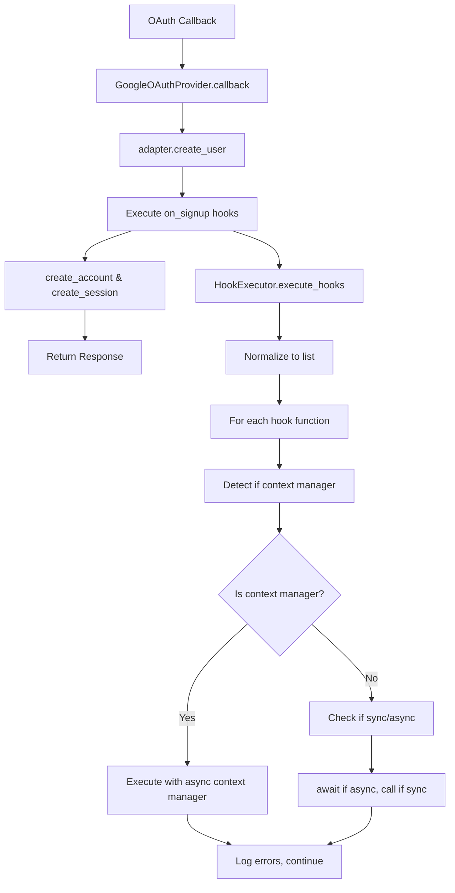
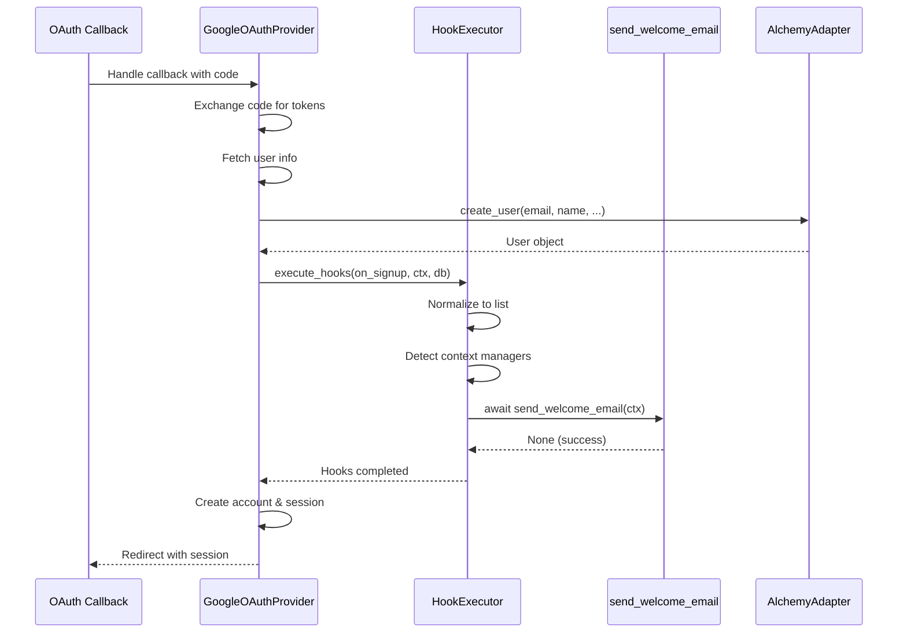
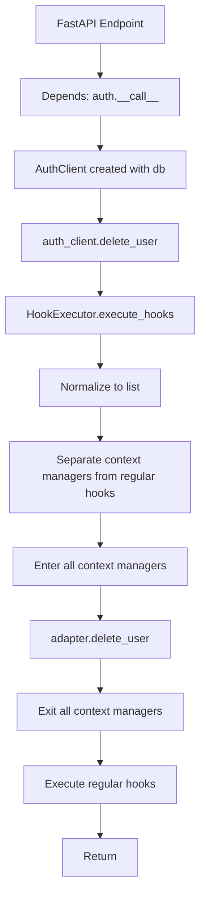
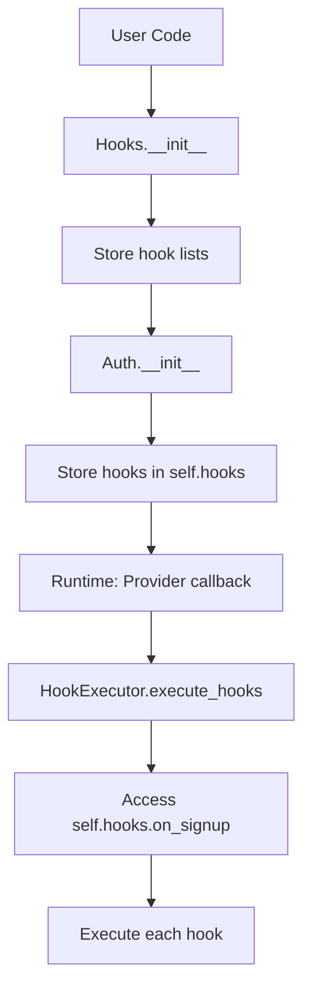
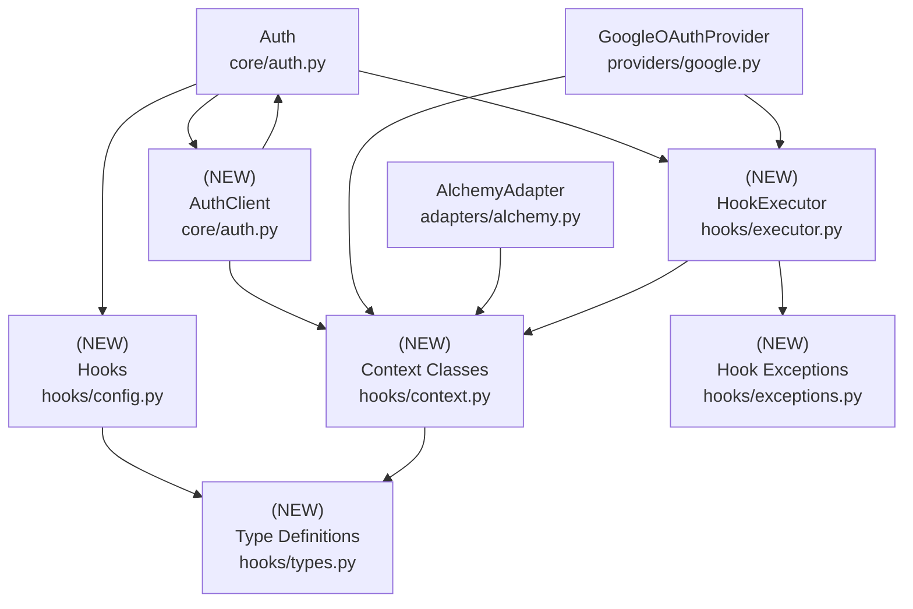

# Design Document: Hooks System

## Overview

### High-Level Description
This feature adds a flexible hooks system to the belgie auth library, allowing users to execute custom logic at key points in the authentication lifecycle. The system supports signup and deletion events, enabling users to send notifications, perform cleanup, track analytics, or implement custom business logic when these events occur.

The problem this solves: Currently, belgie has no extensibility mechanism for users to hook into authentication events. Users cannot send welcome emails on signup, perform cleanup on account deletion, or integrate with external systems during auth operations.

### Goals
- Provide a simple, type-safe API for registering hooks on signup and deletion events
- Support both synchronous and asynchronous hook functions
- Automatically detect and handle context manager hooks (no separate configuration needed)
- Accept single function or sequence of functions for each hook
- Pass simple context to hooks (user and database session only)
- Use generic types from Auth class for type consistency
- No default hooks - completely opt-in system

### Non-Goals
- This is not a general event bus or pub/sub system
- Will not support hook cancellation or operation blocking in initial version
- Will not provide built-in hooks for emails, logging, etc. (users bring their own)
- Will not support hook configuration via config files (code-based only)
- Will not implement async background task queues (hooks run in request context)
- Will not support hooks for all possible auth events (starting with signup/deletion only)

## Workflows

### Workflow 1: User Signup with Hooks

#### Description
When a user signs up via OAuth, registered hooks are executed after user creation. Hooks receive simple context with the user object and database session, allowing them to perform side effects like sending welcome emails or creating related records.

#### Usage Example
```python
from belgie.auth import Auth
from belgie.auth.hooks import Hooks, SignupContext
import httpx

# Define hook functions
async def send_welcome_email(ctx: SignupContext) -> None:
    """Send welcome email after user is created"""
    async with httpx.AsyncClient() as client:
        await client.post(
            "https://api.sendgrid.com/v3/mail/send",
            json={
                "to": ctx.user.email,
                "subject": "Welcome to our app!",
                "body": f"Hi {ctx.user.name}, thanks for signing up!"
            }
        )

async def track_signup_analytics(ctx: SignupContext) -> None:
    """Track signup in analytics system"""
    # Can use ctx.db for additional queries if needed
    pass

# Define database dependency
async def get_db():
    async with AsyncSession(engine) as session:
        yield session

# Configure auth with hooks - can pass single function or sequence
auth = Auth(
    settings=auth_settings,
    adapter=adapter,
    db_dependency=get_db,  # Provide db dependency for Auth.__call__
    hooks=Hooks(
        # Single function
        on_signup=send_welcome_email,
        # Or sequence of functions
        # on_signup=[send_welcome_email, track_signup_analytics],
    ),
)

# Hooks are automatically executed during OAuth callback
# User signs in via OAuth -> user created -> on_signup runs
```

#### Call Graph


#### Sequence Diagram


#### Key Components
- **Hooks** (`hooks/config.py:Hooks`) - Configuration dataclass with hook lists
- **SignupContext** (`hooks/context.py:SignupContext`) - Context passed to signup hooks
- **HookExecutor** (`hooks/executor.py:HookExecutor`) - Executes hooks with error handling
- **GoogleOAuthProvider** (`providers/google.py:GoogleOAuthProvider`) - Integration point for signup hooks

### Workflow 2: User Deletion with Hooks

#### Description
When a user account is deleted, registered hooks are executed. Hooks receive context with the user and database session. Context manager hooks can wrap the deletion operation for setup/teardown patterns.

#### Usage Example
```python
from belgie.auth.hooks import Hooks, DeletionContext
from contextlib import asynccontextmanager

# Context manager hook for cleanup (automatically detected)
@asynccontextmanager
async def cleanup_user_storage(ctx: DeletionContext):
    """Context manager hook to cleanup user storage"""
    # Setup phase
    s3_client = await create_s3_client()

    try:
        # Yield to allow deletion to proceed
        yield

        # Cleanup phase (runs after deletion)
        await s3_client.delete_bucket(f"user-{ctx.user.id}")
    finally:
        await s3_client.close()

async def send_deletion_confirmation(ctx: DeletionContext) -> None:
    """Send confirmation email after deletion"""
    await send_email(
        to=ctx.user.email,
        subject="Account Deleted",
        body="Your account has been successfully deleted."
    )

# Define database dependency
async def get_db():
    async with AsyncSession(engine) as session:
        yield session

# Configure with hooks - executor automatically detects context managers
auth = Auth(
    settings=auth_settings,
    adapter=adapter,
    db_dependency=get_db,  # Provide db dependency
    hooks=Hooks(
        # Mix regular functions and context managers
        on_deletion=[cleanup_user_storage, send_deletion_confirmation],
        # Or single function
        # on_deletion=send_deletion_confirmation,
    ),
)

# Usage in application
@app.delete("/account")
async def delete_account(
    user: User = Depends(auth.user),
    auth_client = Depends(auth)  # Inject auth with db session
):
    await auth_client.delete_user(user)  # Hooks execute automatically
    return {"message": "Account deleted"}
```

#### Call Graph


#### Key Components
- **Auth.__call__()** (`core/auth.py:Auth.__call__`) - Returns AuthClient with db bound, usable as FastAPI dependency
- **AuthClient** (`core/auth.py:AuthClient`) - Auth client with database session bound
- **AuthClient.delete_user()** (`core/auth.py:AuthClient.delete_user`) - Deletes user with hooks, accepts user object
- **DeletionContext** (`hooks/context.py:DeletionContext`) - Context passed to deletion hooks
- **HookExecutor.execute_hooks()** (`hooks/executor.py:HookExecutor`) - Executes all hooks, automatically detecting context managers
- **AlchemyAdapter.delete_user()** (`adapters/alchemy.py:AlchemyAdapter.delete_user`) - New adapter method for deletion

### Workflow 3: Hook Configuration with Type Safety

#### Description
Users configure hooks using the Hooks dataclass, which provides type safety and IDE autocomplete for hook registration. Hooks can be a single function or a sequence of functions. The executor automatically detects context managers.

#### Usage Example
```python
from belgie.auth.hooks import Hooks, SignupContext, DeletionContext
from contextlib import asynccontextmanager

# Define various hook types
async def my_signup_hook(ctx: SignupContext) -> None:
    """Regular async hook"""
    print(f"User {ctx.user.email} signed up!")

def my_sync_hook(ctx: SignupContext) -> None:
    """Synchronous hook also supported"""
    print(f"Sync hook for {ctx.user.email}")

@asynccontextmanager
async def my_context_hook(ctx: DeletionContext):
    """Context manager hook - automatically detected"""
    print("Before deletion")
    yield
    print("After deletion")

# Database dependency
async def get_db():
    async with AsyncSession(engine) as session:
        yield session

# Type-safe configuration - single function or sequence
hooks = Hooks(
    on_signup=my_signup_hook,  # Single function
    on_deletion=[my_context_hook, my_sync_hook],  # Sequence with mixed types
)

auth = Auth(
    settings=auth_settings,
    adapter=adapter,
    db_dependency=get_db,
    hooks=hooks,
)
```

#### Call Graph


#### Key Components
- **Hooks** (`hooks/config.py:Hooks`) - Dataclass for hook configuration, accepts single or sequence
- **HookFunc** (`hooks/types.py:HookFunc`) - Type alias for hook functions
- **HookExecutor** (`hooks/executor.py:HookExecutor`) - Automatically detects and handles context managers

## Dependencies



## Detailed Design

### Module Structure
```
src/belgie/
├── auth/
│   ├── hooks/
│   │   ├── __init__.py         # Public API exports
│   │   ├── types.py            # Type definitions (leaf node, see Implementation #1)
│   │   ├── exceptions.py       # Hook exceptions (leaf node, see Implementation #2)
│   │   ├── context.py          # Context classes (see Implementation #3)
│   │   ├── config.py           # Hooks configuration (see Implementation #4)
│   │   └── executor.py         # Hook executor (see Implementation #5)
│   ├── core/
│   │   └── auth.py             # Modified: Add hooks parameter, delete_user method
│   ├── providers/
│   │   └── google.py           # Modified: Integrate signup hooks
│   └── adapters/
│       └── alchemy.py          # Modified: Add delete_user method
└── __test__/
    └── auth/
        └── hooks/
            ├── test_types.py              # Unit tests for types
            ├── test_exceptions.py         # Unit tests for exceptions
            ├── test_context.py            # Unit tests for context classes
            ├── test_config.py             # Unit tests for Hooks config
            ├── test_executor.py           # Unit tests for HookExecutor
            └── test_hooks_integration.py  # Integration tests for full workflows
```

### API Design

#### `src/belgie/auth/hooks/types.py`
Type definitions and protocols for hooks (leaf node, see [Implementation Order](#implementation-order) #1).

```python
from typing import Any, Awaitable, Callable, TypeVar, Union
from collections.abc import AsyncIterator, Sequence

# Forward references for context types
ContextT = TypeVar("ContextT")

# Hook function types
SyncHookFunc = Callable[[ContextT], None]
AsyncHookFunc = Callable[[ContextT], Awaitable[None]]
ContextManagerHook = Callable[[ContextT], AsyncIterator[None]]

# A hook can be sync, async, or a context manager
HookFunc = Union[SyncHookFunc[ContextT], AsyncHookFunc[ContextT], ContextManagerHook[ContextT]]

# Hook field accepts single function or sequence
HookOrSequence = Union[HookFunc[ContextT], Sequence[HookFunc[ContextT]]]
```

#### `src/belgie/auth/hooks/exceptions.py`
Exception types for hook execution errors (leaf node, see [Implementation Order](#implementation-order) #2).

```python
class HookError(Exception):
    """Base exception for hook-related errors"""
    def __init__(self, message: str, hook_name: str | None = None) -> None: ...
    # 1. Store hook_name as self.hook_name
    # 2. Call super().__init__(message)

class HookExecutionError(HookError):
    """Raised when a hook fails during execution"""
    def __init__(
        self,
        message: str,
        hook_name: str | None = None,
        original_error: Exception | None = None
    ) -> None: ...
    # 1. Store original_error as self.original_error
    # 2. Call super().__init__(message, hook_name)
    # Used to wrap exceptions from user hook code

class HookTimeoutError(HookError):
    """Raised when a hook exceeds timeout (future enhancement)"""
    pass
```

#### `src/belgie/auth/hooks/context.py`
Context objects passed to hook functions (see [Implementation Order](#implementation-order) #3).

```python
from dataclasses import dataclass
from sqlalchemy.ext.asyncio import AsyncSession

from belgie.auth.protocols import UserProtocol

@dataclass(slots=True, kw_only=True, frozen=True)
class SignupContext[UserT: UserProtocol]:
    """Context passed to signup hooks"""
    # Used in: Workflow 1 (signup hooks)
    # Generic over UserT to match Auth's type parameter

    user: UserT
    # The user object that was created

    db: AsyncSession
    # Database session for additional queries if needed

@dataclass(slots=True, kw_only=True, frozen=True)
class DeletionContext[UserT: UserProtocol]:
    """Context passed to deletion hooks"""
    # Used in: Workflow 2 (deletion hooks)
    # Generic over UserT to match Auth's type parameter

    user: UserT
    # The user being deleted

    db: AsyncSession
    # Database session for additional queries if needed
```

#### `src/belgie/auth/hooks/config.py`
Configuration dataclass for registering hooks (see [Implementation Order](#implementation-order) #4).

```python
from dataclasses import dataclass
from belgie.auth.hooks.context import SignupContext, DeletionContext
from belgie.auth.hooks.types import HookOrSequence, HookFunc
from belgie.auth.protocols import UserProtocol

@dataclass(slots=True, kw_only=True)
class Hooks[UserT: UserProtocol]:
    """Hook configuration for Auth system"""
    # Used in: Workflow 1, Workflow 2, Workflow 3
    # Generic over UserT to match Auth's type parameter

    on_signup: HookOrSequence[SignupContext[UserT]] | None = None
    # Executed after user is created
    # Can be a single function or sequence of functions
    # Can include context managers (automatically detected)

    on_deletion: HookOrSequence[DeletionContext[UserT]] | None = None
    # Executed during user deletion
    # Can be a single function or sequence of functions
    # Context managers wrap the deletion operation

    def _normalize_hook(
        hook: HookOrSequence[Any] | None
    ) -> list[HookFunc[Any]]: ...
    # 1. If hook is None, return empty list
    # 2. If hook is a single callable, return [hook]
    # 3. If hook is a sequence, convert to list
    # 4. Return normalized list
    # Helper method used by executor
```

#### `src/belgie/auth/hooks/executor.py`
Executes hooks with error handling and logging (see [Implementation Order](#implementation-order) #5).

```python
import inspect
import logging
from collections.abc import AsyncIterator
from contextlib import AsyncExitStack
from typing import Any, TypeVar
from sqlalchemy.ext.asyncio import AsyncSession

from belgie.auth.hooks.exceptions import HookExecutionError
from belgie.auth.hooks.types import HookFunc

ContextT = TypeVar("ContextT")

logger = logging.getLogger(__name__)

class HookExecutor:
    """Executes hook functions with error handling"""
    # Used in: Workflow 1, Workflow 2 (hook execution)

    def __init__(self, continue_on_error: bool = True) -> None: ...
    # 1. Store continue_on_error flag as self.continue_on_error
    # 2. If True, log errors and continue; if False, raise on first error
    # 3. Default True to prevent hooks from breaking auth operations

    async def execute_hooks(
        self,
        hooks: HookFunc[ContextT] | list[HookFunc[ContextT]] | None,
        context: ContextT,
        hook_type: str,
    ) -> list[Exception]: ...
    # 1. Normalize hooks to list (None -> [], single -> [single], list -> list)
    # 2. Separate context managers from regular hooks using inspect.isasyncgenfunction()
    # 3. Initialize empty errors list
    # 4. If context managers exist:
    #    a. Create AsyncExitStack
    #    b. For each context manager:
    #       - Call context_manager(context) to get async context manager
    #       - Enter it using stack.enter_async_context()
    #       - Catch exceptions during entry, log them
    #    c. Execute regular hooks inside context managers
    #    d. Exit stack (context managers exit in reverse order)
    # 5. If no context managers, just execute regular hooks
    # 6. For each regular hook:
    #    a. Check if sync or async using inspect.iscoroutinefunction()
    #    b. If async: await hook(context), if sync: hook(context)
    #    c. Catch exceptions, log them with hook_type and hook name
    #    d. If continue_on_error is False, raise HookExecutionError immediately
    #    e. If True, append exception to errors list and continue
    # 7. Return list of all errors that occurred
    # Used in: Workflow 1 (signup), Workflow 2 (deletion)

    def _is_context_manager(self, hook: Any) -> bool: ...
    # 1. Check if hook is an async generator function using inspect.isasyncgenfunction()
    # 2. Return True if it's an async generator (context manager), False otherwise
    # Used to detect @asynccontextmanager decorated functions

    def _get_hook_name(self, hook: Any) -> str: ...
    # 1. Try to get hook.__name__ attribute
    # 2. If not available, try hook.__class__.__name__
    # 3. Fallback to str(hook)
    # 4. Return human-readable name for logging
    # Used for error messages and logging
```

#### `src/belgie/auth/core/auth.py` (Modifications)
Add hooks support and user deletion method (see [Implementation Order](#implementation-order) #6).

```python
# Existing imports...
from belgie.auth.hooks import Hooks, DeletionContext
from belgie.auth.hooks.executor import HookExecutor

class Auth[UserT: UserProtocol, AccountT: AccountProtocol, SessionT: SessionProtocol, OAuthStateT: OAuthStateProtocol]:
    # Modified: Add hooks parameter

    def __init__(
        settings: AuthSettings,
        adapter: AdapterProtocol[UserT, AccountT, SessionT, OAuthStateT],
        hooks: Hooks | None = None,  # NEW PARAMETER
        db_dependency: Callable[[], AsyncSession] | None = None,  # NEW PARAMETER
    ) -> None: ...
    # 1. Existing initialization logic remains
    # 2. Store hooks as self.hooks (use Hooks() if None provided)
    # 3. Create self.hook_executor = HookExecutor(continue_on_error=True)
    # 4. Store db_dependency as self._db_dependency for use in __call__
    # 5. Pass hooks to providers during initialization

    def __call__(self, db: AsyncSession = Depends(lambda: self._db_dependency)) -> "AuthClient[UserT, AccountT, SessionT, OAuthStateT]": ...
    # NEW METHOD - Makes Auth usable as a FastAPI dependency
    # 1. db parameter uses self._db_dependency (provided at Auth initialization)
    # 2. Return AuthClient instance with self and db bound
    # 3. Allows usage like: auth_client = Depends(auth)
    # 4. If db_dependency not provided, user must pass db explicitly
    # Used to provide db-bound auth operations in endpoints

class AuthClient[UserT: UserProtocol, AccountT: AccountProtocol, SessionT: SessionProtocol, OAuthStateT: OAuthStateProtocol]:
    """Auth client with database session bound for use in FastAPI endpoints"""
    # NEW CLASS - Provides db-bound methods for auth operations

    def __init__(
        self,
        auth: Auth[UserT, AccountT, SessionT, OAuthStateT],
        db: AsyncSession,
    ) -> None: ...
    # 1. Store auth as self._auth
    # 2. Store db as self.db
    # 3. Provides access to auth operations with db already bound

    async def delete_user(self, user: UserT) -> None: ...
    # NEW METHOD - Used in: Workflow 2 (user deletion)
    # 1. Extract user_id from user object (user.id)
    # 2. Create DeletionContext with user and self.db
    # 3. Execute hooks using self._auth.hook_executor.execute_hooks()
    #    - Executor automatically detects context managers
    #    - Context managers wrap the deletion operation
    #    - Regular hooks execute after deletion
    # 4. Inside the hook execution (when no context managers wrapping):
    #    a. Call self._auth.adapter.delete_user(self.db, user_id)
    # 5. Log any hook errors but don't raise (user deletion succeeded)
```

#### `src/belgie/auth/providers/google.py` (Modifications)
Integrate signup hooks into OAuth callback (see [Implementation Order](#implementation-order) #7).

```python
# Existing imports...
from belgie.auth.hooks import SignupContext
from belgie.auth.hooks.executor import HookExecutor

class GoogleOAuthProvider[...]:
    # Modified: Add hooks and executor

    def __init__(
        settings: GoogleProviderSettings,
        adapter: AdapterProtocol[UserT, AccountT, SessionT, OAuthStateT],
        session_manager: SessionManager[UserT, SessionT],
        auth_settings: AuthSettings,
        hook_executor: HookExecutor | None = None,  # NEW PARAMETER
        hooks: Hooks | None = None,  # NEW PARAMETER
    ) -> None: ...
    # 1. Existing initialization
    # 2. Store hook_executor as self.hook_executor
    # 3. Store hooks as self.hooks

    async def _handle_callback(...) -> Response:
        # Existing code up to user lookup...

        # LINE ~210-216: User creation
        if not user:
            user = await adapter.create_user(...)

            # NEW: After user creation
            # 1. If self.hooks and self.hooks.on_signup:
            #    a. Create SignupContext with user and db
            #    b. Execute self.hook_executor.execute_hooks(on_signup, ctx)
            #    c. Executor automatically detects and handles context managers

        # Existing account and session creation...
```

#### `src/belgie/auth/adapters/alchemy.py` (Modifications)
Add user deletion method with cascade (see [Implementation Order](#implementation-order) #8).

```python
# Existing class...

class AlchemyAdapter[...]:

    async def delete_user(self, db: AsyncSession, user_id: str) -> None: ...
    # NEW METHOD - Used in: Workflow 2, Auth.delete_user()
    # 1. Delete all user sessions using _delete_sessions_by_user_id()
    # 2. Delete all user accounts:
    #    a. Query for all accounts with user_id
    #    b. Execute delete statement
    # 3. Delete user:
    #    a. Query for user by id
    #    b. Execute delete statement
    # 4. Commit transaction
    # Note: Order matters - delete sessions/accounts before user (FK constraints)

    async def _delete_sessions_by_user_id(
        self,
        db: AsyncSession,
        user_id: str,
    ) -> None: ...
    # PRIVATE METHOD - Used internally by delete_user() for cascade
    # 1. Query sessions table where user_id matches
    # 2. Execute delete statement
    # 3. Commit not needed (part of larger transaction)
```

### Testing Strategy

Tests should be organized by module/file and cover unit tests, integration tests, and edge cases.

#### `test_types.py`

**Type Definition Tests:**
- Test that HookFunc type accepts sync functions
- Test that HookFunc type accepts async functions
- Test that HookFunc type accepts context manager functions
- Test that HookOrSequence accepts single function
- Test that HookOrSequence accepts sequence of functions
- Test type annotations with mypy/ty (not runtime tests)

#### `test_exceptions.py`

**Exception Tests:**
- Test `HookError.__init__()` stores message and hook_name
- Test `HookExecutionError.__init__()` stores original_error
- Test exception inheritance (HookExecutionError is HookError)
- Test exception string representation

#### `test_context.py`

**Context Class Tests:**
- Test `SignupContext` initialization with user and db
- Test `SignupContext` is frozen (immutable)
- Test `SignupContext` is generic over UserT
- Test `DeletionContext` initialization with user and db
- Test `DeletionContext` is frozen (immutable)
- Test `DeletionContext` is generic over UserT
- Test context objects with mock User protocol

#### `test_config.py`

**Hooks Configuration Tests:**
- Test `Hooks.__init__()` with all None (default)
- Test `Hooks.__init__()` with single function
- Test `Hooks.__init__()` with sequence of functions
- Test `Hooks` is generic over UserT
- Test `_normalize_hook()` method with None, single, and sequence
- Verify [Workflow 3](#workflow-3-hook-configuration-with-type-safety) configuration works

#### `test_executor.py`

**HookExecutor Tests:**
- Test `execute_hooks()` with None (should succeed)
- Test `execute_hooks()` with single sync hook function
- Test `execute_hooks()` with single async hook function
- Test `execute_hooks()` with sequence of mixed sync/async hooks (execute in order)
- Test `execute_hooks()` with single context manager hook
- Test `execute_hooks()` with multiple context managers (enter order, exit reverse order)
- Test `execute_hooks()` with mixed context managers and regular hooks
- Test `execute_hooks()` with sequence containing one of each kind (sync, async, context manager)
- Test `execute_hooks()` with hook that raises exception (continue_on_error=True)
- Test `execute_hooks()` with hook that raises exception (continue_on_error=False)
- Test `execute_hooks()` returns list of exceptions
- Test `execute_hooks()` logs errors appropriately
- Test `_is_context_manager()` detects async generators correctly
- Test `_get_hook_name()` with named function, lambda, class instance
- Use mock hooks with spy/verification for execution order

#### `test_hooks_integration.py`

**Integration Tests:**
- Test [Workflow 1](#workflow-1-user-signup-with-hooks) end-to-end:
  - Create Auth with single signup hook
  - Create Auth with multiple signup hooks
  - Simulate OAuth callback
  - Verify user created
  - Verify on_signup called with correct context (user + db)
  - Verify hooks execute in order
- Test [Workflow 2](#workflow-2-user-deletion-with-hooks) end-to-end:
  - Create Auth with deletion hooks (regular and context managers)
  - Create test user with sessions and accounts
  - Use auth as dependency to get AuthClient
  - Call auth_client.delete_user(user) with user object
  - Verify context managers wrap deletion operation
  - Verify regular hooks execute after deletion
  - Verify user deleted from database
  - Verify hooks receive correct context (user + db)
- Test signup hooks with real async operations (httpx mocked)
- Test deletion hooks with context manager for cleanup
- Test multiple hooks execute in registration order
- Test hook errors don't prevent user creation/deletion
- Test hooks receive correct context data

**Edge Cases to Cover:**
- None hooks configuration (no hooks registered)
- Hook that takes very long to execute (timeout handling - future)
- Hook that modifies context (verify immutability prevents this)
- Hook that raises non-Exception errors
- Multiple context managers with one failing during exit
- Async context manager that doesn't yield
- User deletion when user doesn't exist (should raise error)
- User creation when hooks fail (user still created)
- Single function vs sequence containing single function (same behavior)
- Empty sequence (should behave like None)
- Sequence containing one of each kind (sync, async, context manager) executes correctly

## Implementation

### Implementation Order

1. **Type Definitions** (`hooks/types.py`) - Implement first (no dependencies)
   - Used in: All hook-related code
   - Dependencies: None (stdlib typing only)

2. **Exceptions** (`hooks/exceptions.py`) - Implement second (no dependencies)
   - Used in: HookExecutor error handling
   - Dependencies: None

3. **Context Classes** (`hooks/context.py`) - Implement third (depends on protocols)
   - Used in: Workflow 1, Workflow 2 (all hooks receive context)
   - Dependencies: Existing UserProtocol, SessionProtocol, AccountProtocol

4. **Hooks Configuration** (`hooks/config.py`) - Implement fourth (depends on types and context)
   - Used in: Workflow 3 (configuration)
   - Dependencies: types.py, context.py

5. **Hook Executor** (`hooks/executor.py`) - Implement fifth (depends on types, exceptions, context)
   - Used in: Workflow 1, Workflow 2 (execution engine)
   - Dependencies: types.py, exceptions.py, context.py

6. **Auth Core Modifications** (`core/auth.py`) - Implement sixth (depends on hooks package)
   - Used in: Workflow 2 (delete_user method)
   - Dependencies: All hooks components

7. **Provider Modifications** (`providers/google.py`) - Implement seventh (depends on hooks package)
   - Used in: Workflow 1 (signup hooks integration)
   - Dependencies: All hooks components

8. **Adapter Modifications** (`adapters/alchemy.py`) - Implement eighth (no new dependencies)
   - Used in: Workflow 2 (delete_user implementation)
   - Dependencies: Existing protocols only

### Tasks

- [ ] **Implement leaf node components** (no dependencies on new code)
  - [ ] Implement type definitions in `hooks/types.py` (#1)
    - [ ] Define `SyncHookFunc`, `AsyncHookFunc`, `ContextManagerHook` types
    - [ ] Define `HookFunc` union type
    - [ ] Define `HookOrSequence` type
  - [ ] Write unit tests for `hooks/types.py`
    - [ ] Test type annotations (type checking only)
  - [ ] Implement exceptions in `hooks/exceptions.py` (#2)
    - [ ] Implement `HookError` exception
    - [ ] Implement `HookExecutionError` exception
    - [ ] Implement `HookTimeoutError` exception
  - [ ] Write unit tests for `hooks/exceptions.py`
    - [ ] Test exception initialization and attributes
    - [ ] Test exception inheritance
  - [ ] Implement context classes in `hooks/context.py` (#3)
    - [ ] Implement generic `SignupContext[UserT]` dataclass
    - [ ] Implement generic `DeletionContext[UserT]` dataclass
  - [ ] Write unit tests for `hooks/context.py`
    - [ ] Test context initialization with user and db
    - [ ] Test immutability (frozen=True)
    - [ ] Test generic type parameter
    - [ ] Test with mock protocol objects

- [ ] **Implement single-dependency components**
  - [ ] Implement Hooks configuration in `hooks/config.py` (#4)
    - [ ] Implement generic `Hooks[UserT]` dataclass
    - [ ] Implement `_normalize_hook()` helper method
  - [ ] Write unit tests for `hooks/config.py`
    - [ ] Test with None, single function, sequence
    - [ ] Test `_normalize_hook()` method
    - [ ] Verify [Workflow 3](#workflow-3-hook-configuration-with-type-safety)

- [ ] **Implement executor**
  - [ ] Implement HookExecutor in `hooks/executor.py` (#5)
    - [ ] Implement `__init__()` method
    - [ ] Implement `execute_hooks()` with automatic context manager detection
    - [ ] Implement `_is_context_manager()` helper
    - [ ] Implement `_get_hook_name()` helper
  - [ ] Write unit tests for `hooks/executor.py`
    - [ ] Test with None, single, and sequence of hooks
    - [ ] Test sync and async hook execution
    - [ ] Test context manager detection and execution
    - [ ] Test mixed context managers and regular hooks
    - [ ] Test error handling (continue_on_error)
    - [ ] Test execution order
    - [ ] Test error logging

- [ ] **Implement integration points**
  - [ ] Add adapter methods in `adapters/alchemy.py` (#8)
    - [ ] Implement `delete_user()` method
    - [ ] Implement `_delete_sessions_by_user_id()` private method
  - [ ] Write unit tests for new adapter methods
    - [ ] Test user deletion cascade
    - [ ] Test session deletion by user
  - [ ] Modify Auth class in `core/auth.py` (#6)
    - [ ] Add `hooks` parameter to `__init__()`
    - [ ] Add `db_dependency` parameter to `__init__()`
    - [ ] Add `hook_executor` initialization
    - [ ] Implement `__call__()` method to return AuthClient (uses db_dependency)
    - [ ] Implement `AuthClient` class with db-bound operations
    - [ ] Implement `AuthClient.delete_user()` method with hooks
  - [ ] Modify GoogleOAuthProvider in `providers/google.py` (#7)
    - [ ] Add hooks and executor parameters
    - [ ] Integrate on_signup hooks after user creation
  - [ ] Write unit tests for Auth modifications
    - [ ] Test Auth initialization with hooks and db_dependency
    - [ ] Test Auth.__call__() returns AuthClient with db from dependency
    - [ ] Test Auth.__call__() without db_dependency (user must pass db)
    - [ ] Test AuthClient.delete_user() method with user object

- [ ] **Integration and validation**
  - [ ] Add integration tests in `test_hooks_integration.py`
    - [ ] Test [Workflow 1](#workflow-1-user-signup-with-hooks) end-to-end
    - [ ] Test [Workflow 2](#workflow-2-user-deletion-with-hooks) end-to-end
    - [ ] Test with real async operations (mocked)
    - [ ] Test error scenarios
  - [ ] Create hooks `__init__.py` with public API exports
  - [ ] Add type hints and run type checker (`uv run ty`)
  - [ ] Run linter and fix issues (`uv run ruff check`)
  - [ ] Verify all tests pass (`uv run pytest`)

## Open Questions

1. Should hooks be able to cancel operations (e.g., prevent user creation)?
   - Leaning towards "no" for initial version to keep auth flow simple
   - Could add in future with `raise HookCancellationError()`

2. Should we add timeout limits for hook execution?
   - Could prevent hung requests if hooks take too long
   - Might be overkill for initial version

3. Should we provide a way to pass hook results between hooks?
   - E.g., first hook generates welcome token, second hook uses it
   - Context could have mutable `metadata` dict for this

4. Should deletion hooks support "soft delete" patterns?
   - Add `soft_delete` boolean to DeletionContext?
   - Let users implement soft delete in hooks?

5. Should we add more hook events beyond signup/deletion?
   - Session creation, session refresh, signout, account linking, etc.
   - Start minimal, add based on user feedback

6. Should context managers be able to abort the operation?
   - If context manager raises during entry, should operation be cancelled?
   - Currently thinking "no" - log error and continue

## Future Enhancements

- Add hooks for session lifecycle (creation, refresh, deletion)
- Add hooks for account linking (multiple OAuth providers per user)
- Add hooks for email verification flows
- Add hooks for password reset flows (if password auth added)
- Implement hook timeout mechanism with configurable limits
- Add hook priority/ordering system (e.g., `@priority(10)`)
- Support for async background hooks (fire-and-forget with task queue)
- Hook result passing between hooks (shared context state)
- Built-in hooks library (email sender, logger, analytics tracker)
- Hook middleware pattern (wrap hooks with common logic)
- Conditional hooks (only execute if condition met)
- Hook metrics and monitoring (execution time, failure rate)

## Alternative Approaches

### Approach 1: Event Bus Architecture

**Description**: Use a centralized event bus where events are published and subscribers listen for specific event types. Similar to Django signals or Node.js EventEmitter.

**Pros**:
- Highly decoupled - publishers don't know about subscribers
- Easy to add new event types without modifying core code
- Supports dynamic subscription at runtime
- Can implement event filtering and routing
- Popular pattern familiar to many developers

**Cons**:
- More complex implementation (event bus + event objects + subscription management)
- Harder to type-check (event payload types less clear)
- Can lead to "action at a distance" problems (hard to trace event flow)
- Performance overhead from event routing layer
- Overkill for current use case (only 2 event types)

**Why not chosen**: The current requirement is simple (signup/deletion hooks) and a direct hook registration approach provides better type safety, clearer execution flow, and easier debugging. Event bus would be justified if we had dozens of event types or needed runtime dynamic subscription.

### Approach 2: Middleware Pattern

**Description**: Implement hooks as middleware layers that wrap authentication operations, similar to ASGI/WSGI middleware or Express.js middleware.

**Pros**:
- Clean onion/layered architecture
- Each middleware can pass control to next layer
- Easy to understand execution flow (stack of wrappers)
- Middleware can modify request/response
- Well-established pattern in web frameworks

**Cons**:
- More boilerplate (each middleware needs `__call__` with `next` handler)
- Harder to implement for specific events (signup vs deletion)
- All middleware runs for all operations (can't target specific events)
- Requires middleware stack management
- Context passing becomes complex with nested layers

**Why not chosen**: Middleware pattern is better suited for wrapping entire request/response cycles. For targeted lifecycle hooks (signup, deletion), a direct hook list is more appropriate and explicit. Middleware would force all hooks to run for all operations, making it less efficient.

### Approach 3: Decorator-Based Hooks

**Description**: Use decorators to register hooks on methods, similar to Flask routes or Python's `@property`.

**Example**:
```python
auth = Auth(...)

@auth.on_signup
async def welcome_email(ctx):
    ...
```

**Pros**:
- Pythonic and familiar pattern
- Clean registration syntax
- IDE-friendly (autocomplete for `auth.on_signup`)
- Easy to see what's registered by reading code

**Cons**:
- Hooks must be registered after Auth instantiation
- Separates hook registration from Auth configuration
- Harder to configure hooks from settings/config files
- Doesn't support registering same function for multiple events easily
- Hook registration scattered across codebase instead of centralized

**Why not chosen**: The configuration-based approach (passing `Hooks` object) is more explicit and keeps all hook configuration in one place. It's easier to see the complete hook setup at Auth instantiation time. Decorators would spread hook registration throughout the codebase, making it harder to audit what hooks are active.

### Approach 4: Adapter-Level Hooks Only

**Description**: Put all hooks in the adapter layer instead of Auth/Provider layers. Override adapter methods to add hook calls.

**Pros**:
- Single location for all hooks
- Easier to implement (only modify adapter)
- Users can subclass adapter to add hooks
- No changes needed to Auth or providers

**Cons**:
- Less context available at adapter level (no OAuth provider info, request data)
- Requires subclassing adapter for custom hooks (not composition)
- Violates single responsibility (adapter does DB + hooks)
- Can't hook into provider-specific events
- Harder to test hooks separately from adapter

**Why not chosen**: Adapter should focus on database operations only. Hooks need context from higher layers (OAuth provider, request info) that aren't available at adapter level. The current approach keeps adapter focused and allows hooks to access rich context from the Auth and Provider layers.
