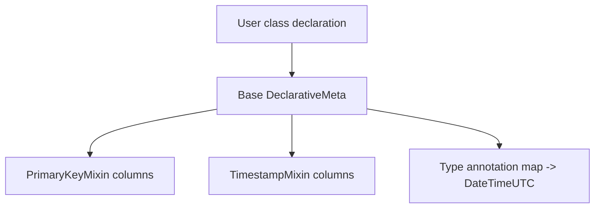
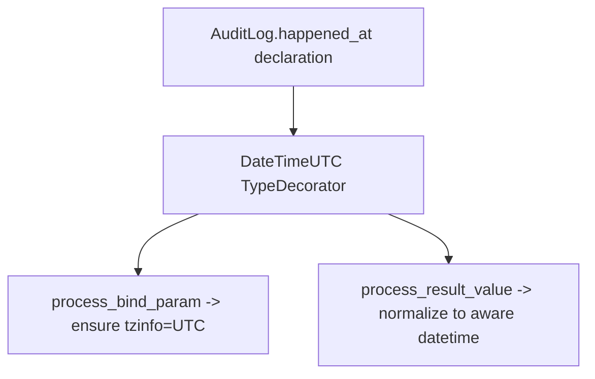
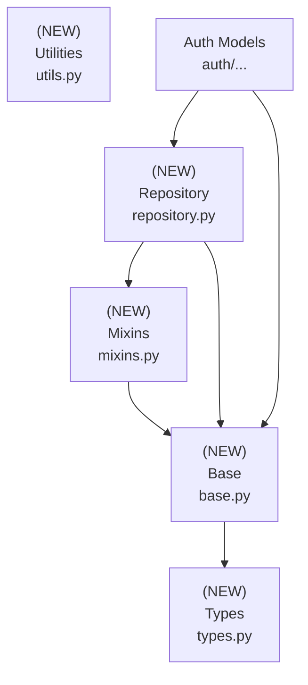

# Design Document: Alchemy Module

## Overview

### High-Level Description

Introduce `belgie.alchemy` , a small opinionated layer on top of SQLAlchemy 2.0 that standardizes model definitions and
persistence patterns across the project. The module supplies a preconfigured `Base`, dataclass-friendly
mapping, common mixins (primary key, timestamps, soft deletion), reusable column types (UTC-aware datetimes), and a
lightweight async repository pattern inspired by advanced-alchemy and the provided polars snippet. This aims to reduce
boilerplate, enforce consistent conventions, and make database access predictable for both core auth models and future
features.

### Goals

- Provide a single `Base` that enables dataclass-style ORM models with consistent metadata (naming conventions,
  timezone-aware defaults).
- Ship drop-in mixins for primary keys, timestamps, and soft delete.
- Offer default column types (e.g., `DateTimeUTC`) that guarantee timezone-aware storage and conversion.
- Define a composable async repository with pagination, soft-delete helpers, and ID-based access (sorting can be added
  per-repo as needed).
- Keep dependencies minimal (SQLAlchemy-only by default) while allowing opt-in integration with advanced-alchemy
  patterns.

### Non-Goals

- No migration tooling (Alembic) in this iteration.
- No synchronous session support (async-first only).
- No full-blown unit-of-work or domain event system.
- No automatic FastAPI dependency wiring beyond what existing auth code already does.

## Workflows

### Workflow 1: Declaring a Model

#### Description

Developers define ORM models by inheriting from `Base` plus mixins to get IDs and timestamps. Dataclass mapping is
enabled to provide an ergonomic `__init__` while keeping SQLAlchemy semantics.

#### Usage Example

```python
from datetime import UTC, datetime
from uuid import UUID, uuid4

from belgie.alchemy import DateTimeUTC, Base, PrimaryKeyMixin, TimestampMixin
from sqlalchemy.orm import Mapped, mapped_column


class User(PrimaryKeyMixin, TimestampMixin, Base):
    __tablename__ = "users"

    email: Mapped[str] = mapped_column(unique=True, index=True)
    name: Mapped[str | None]
    last_login_at: Mapped[datetime | None] = mapped_column(DateTimeUTC)

# Instantiation uses dataclass-generated __init__
user = User(id=uuid4(), email="a@example.com", name=None, created_at=datetime.now(UTC))
```

#### Call Graph



#### Key Components

- **Base** (`src/belgie/alchemy/base.py`) – Declarative base + dataclass mapping with global metadata.
- **PrimaryKeyMixin** (`mixins.py`) – UUID primary key with server-side generation, index, and uniqueness.
- **TimestampMixin** (`mixins.py`) – `created_at`, `updated_at`, `deleted_at` columns with auto-updates.
- **DateTimeUTC** (`types.py`) – Ensures UTC-aware datetime storage.

### Workflow 2: Querying via Repository

#### Description

Code retrieves and mutates models through repositories that encapsulate common query shapes (get by id, paginate, soft
delete).

#### Usage Example

```python
from belgie.alchemy.repository import RepositoryBase, RepositoryIDMixin, RepositorySoftDeletionMixin
from sqlalchemy.ext.asyncio import AsyncSession


class UserRepository(
    RepositorySoftDeletionMixin[User],
    RepositoryIDMixin[User, UUID],
    RepositoryBase[User],
):
    model = User


async def list_recent_users(session: AsyncSession) -> list[User]:
    repo = UserRepository(session)
    stmt = repo.base.order_by(User.created_at.desc())
    users, _ = await repo.paginate(stmt, limit=50, page=1)
    return users
```

#### Call Graph

```mermaid
graph TD
    A[Caller] --> B[UserRepository.base property]
    B --> C[RepositorySoftDeletionMixin.filter_not_deleted]
    C --> D[RepositoryBase.paginate]
    D --> E[AsyncSession.execute]
    E --> F[Return list[User], count]
```

#### Key Components

- **RepositoryBase** (`repository.py`) – Core async CRUD helpers.
- **RepositorySoftDeletionMixin** (`repository.py`) – Filters `deleted_at` and adds `soft_delete`.
- **RepositoryIDMixin** (`repository.py`) – Lookup by typed `id`.
- Sorting helpers can be added ad-hoc per repository; no shared sorting mixin to keep API minimal.

### Workflow 3: Using Default Types

#### Description

Models opt into shared column types to enforce invariants (e.g., timezone-aware datetimes) without repeating type
decorators.

#### Usage Example

```python
from belgie.alchemy import DateTimeUTC
from sqlalchemy.orm import Mapped, mapped_column


class AuditLog(Base):
    __tablename__ = "audit_logs"
    id: Mapped[int] = mapped_column(primary_key=True, autoincrement=True)
    happened_at: Mapped[datetime] = mapped_column(DateTimeUTC, nullable=False)
```

#### Call Graph



#### Key Components

- **DateTimeUTC** (`types.py`) – TypeDecorator around SQLAlchemy `DateTime(timezone=True)`.

## Dependencies



## Detailed Design

### Module Structure

```text
src/belgie/
├── alchemy/
│   ├── __init__.py                  # Re-exports Base, mixins, types, repository
│   ├── base.py                      # Declarative base & dataclass mapping
│   ├── mixins.py                    # PrimaryKey and Timestamps helpers
│   ├── types.py                     # DateTimeUTC and future shared types
│   ├── repository.py                # Async repository + mixins (no global sorting mixin)
│   └── impl/
│       └── auth.py                  # Concrete auth models (AUser base, Account, Session, OAuthState)
│   └── utils.py                     # UTC helpers, annotation maps, naming conventions
└── __test__/
    └── alchemy/
        ├── test_base.py             # Base / dataclass mapping / metadata
        ├── test_mixins.py           # Column defaults, autoupdate behaviors
        ├── test_types.py            # DateTimeUTC round-trip
        └── test_repository.py       # CRUD, pagination, soft-delete
```

### API Design

#### `src/belgie/alchemy/base.py`

```python
from dataclasses import dataclass
from sqlalchemy.orm import DeclarativeBase, MappedAsDataclass
from sqlalchemy import MetaData

NAMING_CONVENTION = {
    "ix": "ix_%(column_0_label)s",
    "uq": "uq_%(table_name)s_%(column_0_name)s",
    "ck": "ck_%(table_name)s_%(constraint_name)s",
    "fk": "fk_%(table_name)s_%(column_0_name)s_%(referred_table_name)s",
    "pk": "pk_%(table_name)s",
}

class Base(MappedAsDataclass, DeclarativeBase):
    metadata = MetaData(naming_convention=NAMING_CONVENTION)
    type_annotation_map = build_type_annotation_map()  # defined here using utils helper
    # Config:
    # - dataclass repr eq defaults; kw_only=True via dataclass_kwargs
    # - optional __abstract__ flag respected by subclasses
```

Responsibilities:

- Centralize naming conventions and type annotation map (datetime -> DateTimeUTC).
- Keep `type_annotation_map` defined in `base.py` (built via `build_type_annotation_map`) so configuration stays
  co-located with the declarative base.
- Enable dataclass mapping with `kw_only=True`, `init=True`, `repr=True`, `eq=True`.
- Provide helper `registry`/`metadata` exports via `__all__`.

#### `src/belgie/alchemy/mixins.py`

```python
from uuid import UUID
from datetime import UTC, datetime
from sqlalchemy import text
from sqlalchemy.orm import Mapped, mapped_column

class PrimaryKeyMixin:
    id: Mapped[UUID] = mapped_column(
        primary_key=True,
        server_default=text("gen_random_uuid()"),  # server-generated for portability
        index=True,
        unique=True,
    )

class TimestampMixin:
    created_at: Mapped[datetime] = mapped_column(DateTimeUTC, default=utc_now)
    updated_at: Mapped[datetime] = mapped_column(DateTimeUTC, default=utc_now, onupdate=utc_now)
    deleted_at: Mapped[datetime | None] = mapped_column(DateTimeUTC, nullable=True)
    def mark_deleted(self) -> None: ...
    # sets deleted_at=func.now(); does not persist
```

Notes:

- Mixins avoid docstrings; rely on inline comments only where needed.
- Consider `server_default` compatibility: prefer `gen_random_uuid()` (pgcrypto); fallback to client-generated UUID if
  dialect lacks it (handled in impl).

## `src/belgie/alchemy/types.py`

```python
from datetime import UTC, datetime
from sqlalchemy import DateTime
from sqlalchemy.types import TypeDecorator

class DateTimeUTC(TypeDecorator[datetime]):
    impl = DateTime(timezone=True)
    cache_ok = True

    def process_bind_param(self, value: datetime | None, dialect): ...
    # ensure aware datetime; coerce naive -> UTC; return None unchanged

    def process_result_value(self, value, dialect): ...
    # normalize DB value to aware UTC datetime
```

#### `src/belgie/alchemy/repository.py`

```python
from collections.abc import AsyncGenerator, Sequence
from dataclasses import dataclass
from typing import Any, Protocol, Self, TypeVar
from sqlalchemy import Select, func, over, select
from sqlalchemy.orm import Mapped
from sqlalchemy.sql.expression import ExecutableOption

type Options = Sequence[ExecutableOption]
M = TypeVar("M", bound=Base)  # Base is the declarative base from base.py

class RepositoryProtocol[M](Protocol):
    model: type[M]
    async def one(self, statement: Select[tuple[M]]) -> M: ...
    async def one_or_none(self, statement: Select[tuple[M]]) -> M | None: ...
    async def list(self, statement: Select[tuple[M]]) -> Sequence[M]: ...
    async def paginate(self, statement: Select[tuple[M]], *, limit: int, page: int) -> tuple[list[M], int]: ...
    @property
    def base(self) -> Select[tuple[M]]: ...
    async def create(self, obj: M, *, flush: bool = False) -> M: ...
    async def update(self, obj: M, *, update_dict: dict[str, Any] | None = None, flush: bool = False) -> M: ...

@dataclass
class RepositoryBase[M]:
    session: AsyncSession | AsyncReadSession
    model: type[M]

    async def one(self, statement: Select[tuple[M]]) -> M: ...
    async def one_or_none(self, statement: Select[tuple[M]]) -> M | None: ...
    async def list(self, statement: Select[tuple[M]]) -> Sequence[M]: ...
    async def stream(self, statement: Select[tuple[M]]) -> AsyncGenerator[M, None]: ...
    async def paginate(self, statement: Select[tuple[M]], *, limit: int, page: int) -> tuple[list[M], int]: ...
    @property
    def base(self) -> Select[tuple[M]]: ...
    async def create(self, obj: M, *, flush: bool = False) -> M: ...
    async def update(self, obj: M, *, update_dict: dict[str, Any] | None = None, flush: bool = False) -> M: ...
    async def count(self, statement: Select[tuple[M]]) -> int: ...

class RepositorySoftDeletionMixin[M: ModelDeletedAtProtocol]:
    @property
    def base(self) -> Select[tuple[M]]: ...
    @property
    def all(self) -> Select[tuple[M]]: ...
    async def soft_delete(self, obj: M, *, flush: bool = False) -> M: ...

class RepositoryIDMixin[M: ModelIDProtocol, ID]:
    async def get_by_id(self, id: ID, *, options: Options = (), include_deleted: bool = False) -> M | None: ...
```

Notes:

- Mirrors the provided polars-style snippet but lives in-project to avoid extra deps.
- Soft-delete mixin exposes `base` (excludes deleted) and `all` (includes deleted).
- `base`/`all` can be cached via `cached_property` to avoid re-building statements.
- Type parameters follow a consistent convention: `M` (model bound to `Base`), `ID` (identifier type).

#### `src/belgie/alchemy/impl/auth.py` (auth model implementations, exported via `auth/adapters/protocols.py`)

- Add an abstract SQLAlchemy model `AUser(Base, PrimaryKeyMixin, TimestampMixin, __abstract__=True)` that satisfies
  `UserProtocol` and is intended for inheritance. Base fields: `id`, `email`, `email_verified`, `name`, `image`,
  `created_at`, `updated_at`, `deleted_at`. Integrators subclass `AUser` to add scopes/claims while retaining protocol
  compliance.
- Provide concrete ORM models for the remaining adapter protocols, each leveraging the user relationship:
  - `Account(Base, PrimaryKeyMixin, TimestampMixin)` with `user_id` FK to `AUser.id`; uniqueness constraint on
    `(provider, provider_account_id)`; relationship to `AUser` (lazy="selectin").
  - `Session(Base, PrimaryKeyMixin, TimestampMixin)` with `user_id` FK; fields `expires_at`, `ip_address`,
    `user_agent`; uses `deleted_at` for soft delete; relationship to `AUser`.
  - `OAuthState(Base, PrimaryKeyMixin, TimestampMixin)` storing `state`, `code_verifier`, `redirect_uri`,
    `expires_at`, optional `user_id` FK; relationship to `AUser` when present.
- Document relationship loading defaults (selectin) and note `AUser` is abstract to avoid table creation unless
  subclassed; downstream projects can create `User(AUser)` and add scope/role columns.

#### `src/belgie/alchemy/utils.py`

```python
from datetime import UTC, datetime
from sqlalchemy import DateTime


def build_type_annotation_map() -> dict[type, Any]: ...
# maps datetime -> DateTime(timezone=True) / DateTimeUTC
```

#### `src/belgie/alchemy/__init__.py`

- Re-export `Base`, `DateTimeUTC`, mixins, repository classes, and `utc_now`.
- Keep public API minimal and documented via inline comments in stubs.

### Implementation Order

1. **Types & utils (leaf)**: `DateTimeUTC`, `utc_now`, `build_type_annotation_map`, timezone coercion helpers.
2. **Base**: `Base` class with `type_annotation_map` defined in `base.py`; ensure dataclass kwargs (`kw_only=True`).
3. **Mixins**: `PrimaryKeyMixin` (server-generated UUID + index + unique), `TimestampMixin` (includes `mark_deleted`).
4. **Repository layer**: core `RepositoryBase`, ID/soft-delete mixins, `Options` aliases; align with polars snippet
   semantics.
5. **Auth adapter models**: add `AUser` (abstract) and concrete `Account`, `Session`, `OAuthState` implementations in
   `alchemy/impl/auth.py`, exported via `auth/adapters/protocols.py`.
6. **Package init**: export alchemy surface (`__init__.py`) and add adapter exports if needed.
7. **Tests**: add per-file unit tests and async sqlite integration tests.
8. **Docs/usage notes**: brief README section or docstring comments where relevant.

### Tasks

- [ ] Types & Utils: implement `DateTimeUTC`, `utc_now`, `build_type_annotation_map`; cover naive/aware conversions.
- [ ] Base: create `Base` with naming conventions, dataclass settings, `type_annotation_map`; expose `metadata`,
  `registry`.
- [ ] Mixins: implement `PrimaryKeyMixin`, `TimestampMixin` (with `mark_deleted`); ensure server UUID default and
      index/unique constraints.
- [ ] Repository: port protocol/base/mixins; ensure pagination uses `over(func.count())`; include `stream` helper; expose
      `base`/`all` properties; make base class a dataclass.
- [ ] Auth Adapter Models: add `AUser` (abstract) plus concrete `Account`/`Session`/`OAuthState` models satisfying
      existing adapter protocols with relationships and constraints; implement in `alchemy/impl/auth.py` and re-export
      via `auth/adapters/protocols.py`.
- [ ] Package Exports: wire `belgie/alchemy/__init__.py` and update any auth exports if needed.
- [ ] Tests: unit + async sqlite integration (types, mixins, base, repository, auth models).
- [ ] Cleanup & Docs: minimal README/design note updates if required by reviewer.

### Testing Strategy

- **test_base.py**
  - Model inheriting `Base` + mixins instantiates via dataclass `__init__` (kw-only); repr/eq behave as dataclass.
  - Naming convention applied (constraint names start with `pk_`, `uq_`, etc.).
  - `type_annotation_map` maps bare `datetime` annotations to `DateTime(timezone=True)` / `DateTimeUTC`.
- **test_types.py**
  - `DateTimeUTC` binds naive datetimes after converting to UTC; preserves aware UTC; rejects non-datetime.
  - Round-trip through in-memory async sqlite preserves `tzinfo=UTC`.
- **test_mixins.py**
  - `PrimaryKeyMixin` sets server default UUID when not provided; column has index+unique constraints.
  - `TimestampMixin` auto-populates `created_at`/`updated_at`; `mark_deleted` sets `deleted_at`.
- **test_repository.py** (async sqlite)
  - `create/update/one/one_or_none/list` basics; `base`/`all` properties return expected filters.
  - `paginate` returns `(items, total_count)` and respects offsets.
  - `soft_delete` hides rows unless `include_deleted=True`; `count` aligns with visibility.
  - `stream` yields rows incrementally (small fixture).
- **test_auth_models.py**
  - `AUser` satisfies `UserProtocol` attributes and can be subclassed to add scope.
  - `Account`, `Session`, `OAuthState` enforce FK relationships to user; uniqueness on account
    provider/provider_account_id; session expiration handling.
  - Repositories operate against these models (smoke CRUD + soft delete).

## Open Questions for Feedback

- Should we add an optional dependency group for `advanced-alchemy` to reuse their repository utilities instead of our
  slim copy?
- Do we want additional default types (e.g., `EncryptedString`) in this first iteration, or keep the surface minimal?
