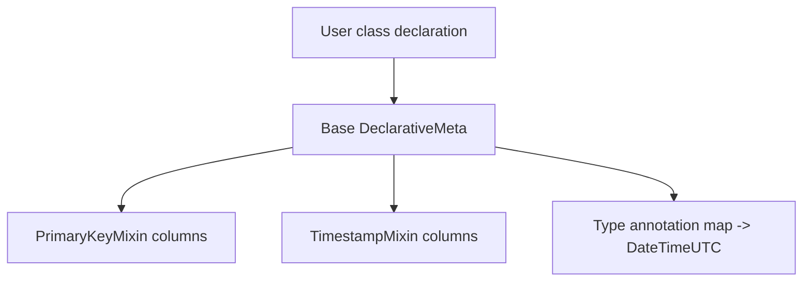
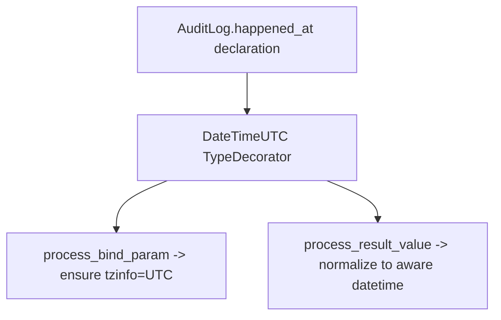
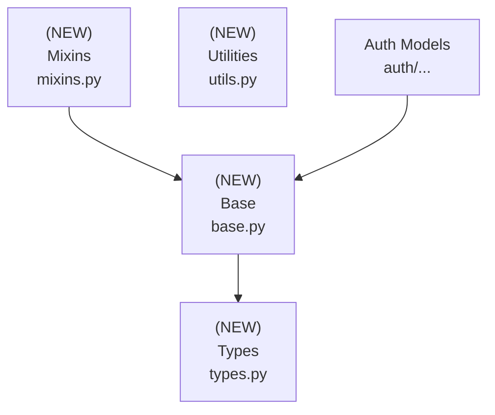

# Design Document: Alchemy Module

## Overview

### High-Level Description

Introduce `belgie.alchemy`, a small opinionated layer on top of SQLAlchemy 2.0 that provides building blocks for
database models. The module supplies a preconfigured `Base`, dataclass-friendly mapping, common mixins (primary key,
timestamps, soft deletion), and reusable column types (UTC-aware datetimes, dialect-specific scopes). Users define
their own concrete models using these building blocks. This aims to reduce boilerplate, enforce consistent conventions,
and make database access predictable while giving users full control over their schema.

### Goals

- Provide a single `Base` that enables dataclass-style ORM models with consistent metadata (naming conventions,
  timezone-aware defaults).
- Ship drop-in mixins for primary keys, timestamps, and soft delete.
- Offer default column types (e.g., `DateTimeUTC`) that guarantee timezone-aware storage and conversion.
- (Deferred) Async repository helpers will be reconsidered in a future iteration.
- Keep dependencies minimal (SQLAlchemy-only by default) while allowing opt-in integration with advanced-alchemy
  patterns.

### Non-Goals

- No migration tooling (Alembic) in this iteration.
- No synchronous session support (async-first only).
- No full-blown unit-of-work or domain event system.
- No automatic FastAPI dependency wiring beyond what existing auth code already does.

## Workflows

### Workflow 1: Declaring a Model

#### Description

Developers define ORM models by inheriting from `Base` plus mixins to get IDs and timestamps. Dataclass mapping is
enabled to provide an ergonomic `__init__` while keeping SQLAlchemy semantics.

#### Usage Example

```python
from datetime import UTC, datetime
from uuid import UUID, uuid4

from belgie.alchemy import DateTimeUTC, Base, PrimaryKeyMixin, TimestampMixin
from sqlalchemy.orm import Mapped, mapped_column


class User(PrimaryKeyMixin, TimestampMixin, Base):
    __tablename__ = "users"

    email: Mapped[str] = mapped_column(unique=True, index=True)
    name: Mapped[str | None]
    last_login_at: Mapped[datetime | None] = mapped_column(DateTimeUTC)

# Instantiation uses dataclass-generated __init__
user = User(id=uuid4(), email="a@example.com", name=None, created_at=datetime.now(UTC))
```

#### Call Graph



#### Key Components

- **Base** (`src/belgie/alchemy/base.py`) – Declarative base + dataclass mapping with global metadata.
- **PrimaryKeyMixin** (`mixins.py`) – UUID primary key with server-side generation, index, and uniqueness.
- **TimestampMixin** (`mixins.py`) – `created_at`, `updated_at`, `deleted_at` columns with auto-updates.
- **DateTimeUTC** (`types.py`) – Ensures UTC-aware datetime storage.

### Workflow 2: (Deferred) Repository Helpers

Repository abstractions were scoped out for this iteration and will be reconsidered later.

### Workflow 3: Using Default Types

#### Description

Models opt into shared column types to enforce invariants (e.g., timezone-aware datetimes) without repeating type
decorators.

#### Usage Example

```python
from belgie.alchemy import DateTimeUTC
from sqlalchemy.orm import Mapped, mapped_column


class AuditLog(Base):
    __tablename__ = "audit_logs"
    id: Mapped[int] = mapped_column(primary_key=True, autoincrement=True)
    happened_at: Mapped[datetime] = mapped_column(DateTimeUTC, nullable=False)
```

#### Call Graph



#### Key Components

- **DateTimeUTC** (`types.py`) – TypeDecorator around SQLAlchemy `DateTime(timezone=True)`.

## Dependencies



## Detailed Design

### Module Structure

```text
src/belgie/
├── alchemy/
│   ├── __init__.py                  # Re-exports Base, mixins, types
│   ├── base.py                      # Declarative base & dataclass mapping
│   ├── mixins.py                    # PrimaryKey and Timestamps helpers
│   ├── types.py                     # DateTimeUTC, Scopes, and shared types
│   └── utils.py                     # UTC helpers, annotation maps, naming conventions
├── examples/
│   └── alchemy/
│       └── auth_models.py           # Reference auth model implementations (copy to use)
└── __test__/
    └── alchemy/
        ├── conftest.py              # Test fixtures with example auth models
        ├── test_base.py             # Base / dataclass mapping / metadata
        ├── test_mixins.py           # Column defaults, autoupdate behaviors
        ├── test_types.py            # DateTimeUTC, Scopes round-trip
        └── test_auth_models.py      # Auth model examples
```

### API Design

#### `src/belgie/alchemy/base.py`

```python
from dataclasses import dataclass
from sqlalchemy.orm import DeclarativeBase, MappedAsDataclass
from sqlalchemy import MetaData

NAMING_CONVENTION = {
    "ix": "ix_%(column_0_label)s",
    "uq": "uq_%(table_name)s_%(column_0_name)s",
    "ck": "ck_%(table_name)s_%(constraint_name)s",
    "fk": "fk_%(table_name)s_%(column_0_name)s_%(referred_table_name)s",
    "pk": "pk_%(table_name)s",
}

class Base(MappedAsDataclass, DeclarativeBase):
    metadata = MetaData(naming_convention=NAMING_CONVENTION)
    type_annotation_map = build_type_annotation_map()  # defined here using utils helper
    # Config:
    # - dataclass repr eq defaults; kw_only=True via dataclass_kwargs
    # - optional __abstract__ flag respected by subclasses
```

Responsibilities:

- Centralize naming conventions and type annotation map (datetime -> DateTimeUTC).
- Keep `type_annotation_map` defined in `base.py` (built via `build_type_annotation_map`) so configuration stays
  co-located with the declarative base.
- Enable dataclass mapping with `kw_only=True`, `init=True`, `repr=True`, `eq=True`.
- Provide helper `registry`/`metadata` exports via `__all__`.

#### `src/belgie/alchemy/mixins.py`

```python
from uuid import UUID
from datetime import UTC, datetime
from sqlalchemy import text
from sqlalchemy.orm import Mapped, mapped_column

class PrimaryKeyMixin:
    id: Mapped[UUID] = mapped_column(
        primary_key=True,
        server_default=text("gen_random_uuid()"),  # server-generated for portability
        index=True,
        unique=True,
    )

class TimestampMixin:
    created_at: Mapped[datetime] = mapped_column(DateTimeUTC, default=utc_now)
    updated_at: Mapped[datetime] = mapped_column(DateTimeUTC, default=utc_now, onupdate=utc_now)
    deleted_at: Mapped[datetime | None] = mapped_column(DateTimeUTC, nullable=True)
    def mark_deleted(self) -> None: ...
    # sets deleted_at=func.now(); does not persist
```

Notes:

- Mixins avoid docstrings; rely on inline comments only where needed.
- Consider `server_default` compatibility: prefer `gen_random_uuid()` (pgcrypto); fallback to client-generated UUID if
  dialect lacks it (handled in impl).

## `src/belgie/alchemy/types.py`

```python
from datetime import UTC, datetime
from sqlalchemy import DateTime
from sqlalchemy.types import TypeDecorator

class DateTimeUTC(TypeDecorator[datetime]):
    impl = DateTime(timezone=True)
    cache_ok = True

    def process_bind_param(self, value: datetime | None, dialect): ...
    # ensure aware datetime; coerce naive -> UTC; return None unchanged

    def process_result_value(self, value, dialect): ...
    # normalize DB value to aware UTC datetime
```

#### `examples/alchemy/auth_models.py` (reference implementation for users to copy)

Provides complete, working examples of authentication models that users copy to their projects:

- `User(Base, PrimaryKeyMixin, TimestampMixin)` - Concrete user model with `email`, `email_verified`, `name`, `image`,
  and `scopes` fields. Demonstrates multiple approaches for the scopes field:
  - Option 1: Simple `Scopes` type (works with all databases, uses ARRAY for PostgreSQL, JSON for others)
  - Option 2: PostgreSQL native ENUM array (commented example showing how to use application-specific enums)
  - Option 3: SQLite/MySQL JSON storage
- `Account(Base, PrimaryKeyMixin, TimestampMixin)` - OAuth account linkage with `user_id` FK to `users.id`; uniqueness
  constraint on `(provider, provider_account_id)`; relationship to `User` (lazy="selectin").
- `Session(Base, PrimaryKeyMixin, TimestampMixin)` - User session with `user_id` FK; fields `expires_at`,
  `ip_address`, `user_agent`; uses `deleted_at` for soft delete; relationship to `User`.
- `OAuthState(Base, PrimaryKeyMixin, TimestampMixin)` - OAuth flow state storing `state`, `code_verifier`,
  `redirect_url`, `expires_at`, optional `user_id` FK; relationship to `User` when present.

These models are **templates** meant to be copied and customized. They are not imported from belgie; users own their
schema completely.

#### `src/belgie/alchemy/utils.py`

```python
from datetime import UTC, datetime
from sqlalchemy import DateTime


def build_type_annotation_map() -> dict[type, Any]: ...
# maps datetime -> DateTime(timezone=True) / DateTimeUTC
```

#### `src/belgie/alchemy/__init__.py`

- Re-export `Base`, `DateTimeUTC`, `Scopes`, and core mixins (`PrimaryKeyMixin`, `TimestampMixin`).
- Keep public API minimal and focused on building blocks only.
- Do not export concrete auth models - users define their own.

### Implementation Order

1. **Types & utils (leaf)**: `DateTimeUTC`, `utc_now`, `build_type_annotation_map`, timezone coercion helpers.
2. **Base**: `Base` class with `type_annotation_map` defined in `base.py`; ensure dataclass kwargs (`kw_only=True`).
3. **Mixins**: `PrimaryKeyMixin` (server-generated UUID + index + unique), `TimestampMixin` (includes `mark_deleted`).
4. **Auth adapter models**: add `AUser` (abstract) and concrete `Account`, `Session`, `OAuthState` implementations in
   `alchemy/impl/auth.py`, exported via `auth/adapters/protocols.py`.
5. **Package init**: export alchemy surface (`__init__.py`) and add adapter exports if needed.
6. **Tests**: add per-file unit tests and async sqlite integration tests.
7. **Docs/usage notes**: brief README section or docstring comments where relevant.

### Tasks

- [x] Types & Utils: implement `DateTimeUTC`, `Scopes`, `utc_now`, `build_type_annotation_map`; cover naive/aware
      conversions and dialect-specific storage.
- [x] Base: create `Base` with naming conventions, dataclass settings, `type_annotation_map`; expose `metadata`,
      `registry`.
- [x] Mixins: implement `PrimaryKeyMixin`, `TimestampMixin` (with `mark_deleted`); ensure server UUID default and
      index/unique constraints.
- [ ] Repository: **Deferred** for future iteration; not implemented in current scope.
- [x] Example Auth Models: provide reference implementations in `examples/alchemy/auth_models.py` demonstrating proper
      model structure with `User`, `Account`, `Session`, `OAuthState`. These are templates for users to copy, not
      framework exports.
- [x] Package Exports: export only building blocks (`Base`, `DateTimeUTC`, `Scopes`, `PrimaryKeyMixin`,
      `TimestampMixin`) from `belgie/alchemy/__init__.py`.
- [x] Tests: unit + async sqlite integration (types, mixins, base); test fixtures define example auth models locally.
- [x] Documentation: comprehensive examples showing how to define custom models with application-specific enums.

### Testing Strategy

- **test_base.py**
  - Model inheriting `Base` + mixins instantiates via dataclass `__init__` (kw-only); repr/eq behave as dataclass.
  - Naming convention applied (constraint names start with `pk_`, `uq_`, etc.).
  - `type_annotation_map` maps bare `datetime` annotations to `DateTime(timezone=True)` / `DateTimeUTC`.
- **test_types.py**
  - `DateTimeUTC` binds naive datetimes after converting to UTC; preserves aware UTC; rejects non-datetime.
  - Round-trip through in-memory async sqlite preserves `tzinfo=UTC`.
- **test_mixins.py**
  - `PrimaryKeyMixin` sets server default UUID when not provided; column has index+unique constraints.
  - `TimestampMixin` auto-populates `created_at`/`updated_at`; `mark_deleted` sets `deleted_at`.
- **test_auth_models.py**
  - Example `User` model demonstrates proper structure with required fields.
  - Example `Account`, `Session`, `OAuthState` models enforce FK relationships; uniqueness constraints work correctly.
  - Scopes field supports StrEnum values correctly.

## Open Questions for Feedback

- Should we add an optional dependency group for `advanced-alchemy` to reuse their repository utilities instead of our
  slim copy?
- Do we want additional default types (e.g., `EncryptedString`) in this first iteration, or keep the surface minimal?
