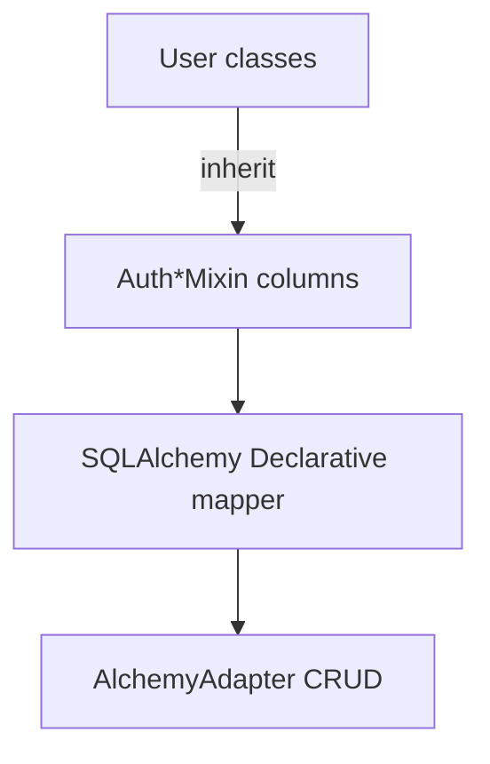
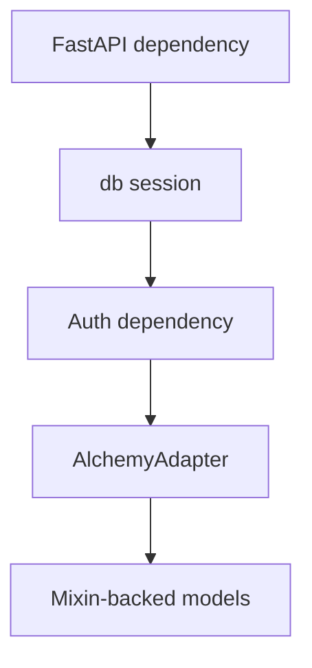
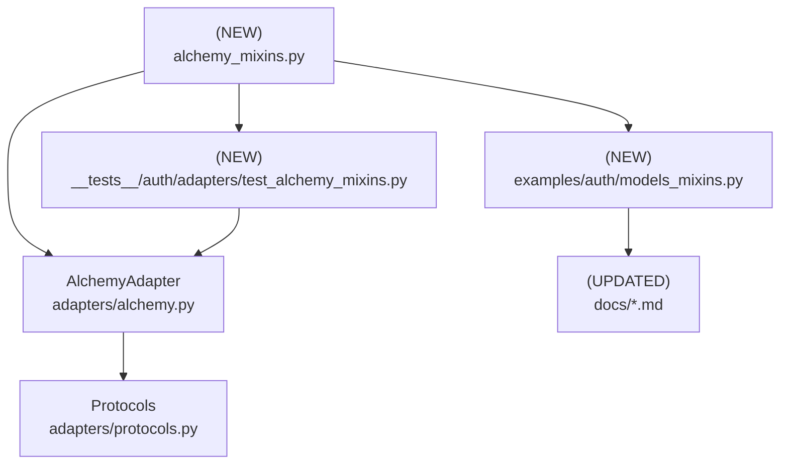

# Design Document: SQLAlchemy Declarative Mixins

## Overview

### High-Level Description
Introduce a set of SQLAlchemy `@declarative_mixin` classes that bundle Belgie’s required auth columns (user, account, session, OAuth state) so integrators can stand up the `AlchemyAdapter` with minimal boilerplate. Mixins will encapsulate common `mapped_column` definitions, sensible defaults (UUID primary keys, timestamps), and optional relationships while keeping override points for custom schemas and table names. Documentation and examples will shift to the mixin-first path, with legacy explicit model definitions remaining supported. citeturn0search0turn0search1

### Goals
- Provide reusable, typed mixins for all adapter-required models using `mapped_column`.
- Allow configurable FK targets/table names without sacrificing defaults (CASCADE, indexes).
- Update README, docs, quickstart, and examples to showcase the mixin-first setup.
- Add tests proving mixin-based models satisfy adapter protocols and work end-to-end.

### Non-Goals
- No new adapter behaviors or storage engines beyond SQLAlchemy.
- No automatic migration generation or schema versioning.

## Workflows

### Workflow 1: Define Models with Mixins

#### Description
Developers subclass the provided mixins plus their project’s `DeclarativeBase`, only supplying `__tablename__` (and optional overrides like table name hints for FKs).

#### Usage Example
```python
from sqlalchemy.orm import DeclarativeBase
from belgie.auth.adapters.alchemy_mixins import (
    AuthUserMixin,
    AuthAccountMixin,
    AuthSessionMixin,
    AuthOAuthStateMixin,
    TimestampMixin,
)

class Base(DeclarativeBase):
    pass


class User(AuthUserMixin, TimestampMixin, Base):
    __tablename__ = "users"


class Account(AuthAccountMixin, TimestampMixin, Base):
    __tablename__ = "accounts"
    __user_tablename__ = "users"  # optional override for FK resolution


class Session(AuthSessionMixin, TimestampMixin, Base):
    __tablename__ = "sessions"
    __user_tablename__ = "users"


class OAuthState(AuthOAuthStateMixin, TimestampMixin, Base):
    __tablename__ = "oauth_states"
```

#### Call Graph


#### Key Components
- **Mixins** (`alchemy_mixins.py`) bundle required columns and optional relationships.
- **DeclarativeBase** (user app) supplies metadata and engine bindings.
- **AlchemyAdapter** consumes the concrete mapped classes unchanged.

### Workflow 2: Plug Models into the Adapter

#### Description
Adapter is instantiated with mixin-based models and used inside FastAPI/FastAPI-like apps exactly as today.

#### Usage Example
```python
from belgie.auth import AlchemyAdapter, Auth, AuthSettings

adapter = AlchemyAdapter(
    user=User,
    account=Account,
    session=Session,
    oauth_state=OAuthState,
    db_dependency=get_db,
)

auth = Auth(settings=AuthSettings(...), adapter=adapter, providers=providers)
```

#### Call Graph


#### Key Components
- **get_db**: Async session dependency (existing pattern).
- **Auth**/**AlchemyAdapter**: no signature changes.
- **Mixin-backed models**: satisfy adapter protocols via shared columns.

## Dependencies



## Detailed Design

### Module Structure

```
src/belgie/
├── auth/
│   ├── adapters/
│   │   ├── alchemy.py                # unchanged API
│   │   └── alchemy_mixins.py         # NEW mixins & helpers
│   └── core/...
__tests__/
└── auth/
    └── adapters/
        └── test_alchemy_mixins.py    # NEW tests for mixin-backed models
examples/auth/
└── models_mixins.py                  # NEW example using mixins
docs/
├── quickstart.md                     # UPDATED to prefer mixins
├── models.md                         # UPDATED: mixin section + migration notes
└── README.md                         # UPDATED snippets
```

### API Design

#### `src/belgie/auth/adapters/alchemy_mixins.py`
Bundle reusable mixins; keep pure SQLAlchemy surface (no Belgie runtime deps).

```python
from __future__ import annotations
from datetime import UTC, datetime
from uuid import UUID, uuid4
from typing import TYPE_CHECKING

from sqlalchemy import ForeignKey, String
from sqlalchemy.orm import Mapped, declared_attr, declarative_mixin, mapped_column, relationship
from sqlalchemy.sql.sqltypes import JSON

if TYPE_CHECKING:
    from sqlalchemy.orm import DeclarativeBase


@declarative_mixin
class UUIDPrimaryKeyMixin:
    id: Mapped[UUID] = mapped_column(primary_key=True, default=uuid4)


@declarative_mixin
class TimestampMixin:
    created_at: Mapped[datetime] = mapped_column(default=lambda: datetime.now(UTC))
    updated_at: Mapped[datetime] = mapped_column(
        default=lambda: datetime.now(UTC),
        onupdate=lambda: datetime.now(UTC),
    )


@declarative_mixin
class AuthUserMixin(UUIDPrimaryKeyMixin):
    email: Mapped[str] = mapped_column(String(255), unique=True, index=True)
    name: Mapped[str | None] = mapped_column(String(255), nullable=True)
    image: Mapped[str | None] = mapped_column(String(500), nullable=True)
    email_verified: Mapped[bool] = mapped_column(default=False)
    scopes: Mapped[list[str] | None] = mapped_column(JSON, nullable=True, default=None)
```

- `scopes` uses `JSON` for cross-database compatibility; subclasses can override column to use ENUM/ARRAY if desired.

```python
@declarative_mixin
class AuthAccountMixin(UUIDPrimaryKeyMixin):
    __user_tablename__: str = "users"  # override in subclass as needed

    @declared_attr.directive
    def user_id(cls) -> Mapped[UUID]:
        return mapped_column(
            ForeignKey(f"{cls.__user_tablename__}.id", ondelete="CASCADE"),
            index=True,
        )

    provider: Mapped[str] = mapped_column(String(50), index=True)
    provider_account_id: Mapped[str] = mapped_column(String(255), index=True)
    access_token: Mapped[str | None] = mapped_column(String(1000), nullable=True)
    refresh_token: Mapped[str | None] = mapped_column(String(1000), nullable=True)
    expires_at: Mapped[datetime | None] = mapped_column(nullable=True)
    token_type: Mapped[str | None] = mapped_column(String(50), nullable=True)
    scope: Mapped[str | None] = mapped_column(String(500), nullable=True)

    @declared_attr.directive
    def user(cls):
        return relationship(
            "User",
            primaryjoin="foreign(%s.user_id)==remote(User.id)" % cls.__name__,
            lazy="joined",
        )
```

- `declared_attr.directive` ensures FK columns/relationships are copied per mapped class (SQLAlchemy 2.0 guidance). citeturn0search0turn0search2

```python
@declarative_mixin
class AuthSessionMixin(UUIDPrimaryKeyMixin):
    __user_tablename__: str = "users"

    @declared_attr.directive
    def user_id(cls) -> Mapped[UUID]:
        return mapped_column(ForeignKey(f"{cls.__user_tablename__}.id", ondelete="CASCADE"), index=True)

    expires_at: Mapped[datetime] = mapped_column(index=True)
    ip_address: Mapped[str | None] = mapped_column(String(45), nullable=True)
    user_agent: Mapped[str | None] = mapped_column(String(500), nullable=True)
```

```python
@declarative_mixin
class AuthOAuthStateMixin(UUIDPrimaryKeyMixin):
    state: Mapped[str] = mapped_column(String(255), unique=True, index=True)
    code_verifier: Mapped[str | None] = mapped_column(String(255), nullable=True)
    redirect_url: Mapped[str | None] = mapped_column(String(1024), nullable=True)
    expires_at: Mapped[datetime] = mapped_column(index=True)
```

- Mixins avoid `__tablename__` to let consumer set names; only `__user_tablename__` hint controls FK targets.
- Relationships are optional; if naming conflicts arise, subclasses can override/remove attributes.

#### `examples/auth/models_mixins.py`
Show end-to-end minimal setup using mixins, mirroring quickstart but shorter.

#### Documentation updates
- README/quickstart: replace long column examples with mixin-based definitions; keep explicit version as “manual option.”
- docs/models.md: new “Declarative Mixins” section with migration notes and override patterns (e.g., custom scope storage).
- examples/auth/README.md: add command to run mixin example.

### Testing Strategy

**Unit/Adapter Integration (`__tests__/auth/adapters/test_alchemy_mixins.py`):**
- Instantiate DeclarativeBase + mixin-backed models; run existing adapter CRUD flows (create/get/update/delete) against async SQLite test DB.
- Validate protocol compliance (type hints + runtime attrs) using `isinstance(..., Protocol)`.
- Ensure FK cascade works for delete_user.

**Docs/examples smoke:**
- Minimal snippet execution via doctest-style sample? (optional) or ensure example script runs in CI (fast SQLite).

**Type/Lint:**
- Extend ruff/ty coverage to new module; include `# ty: ignore[...]` only if SQLAlchemy typing requires.

### Implementation Order

1. Add `alchemy_mixins.py` with mixins + relationships (leaf module).
2. Create mixin-based example `examples/auth/models_mixins.py`.
3. Update docs (`README.md`, `docs/quickstart.md`, `docs/models.md`, `examples/auth/README.md`) to feature mixins.
4. Add tests `__tests__/auth/adapters/test_alchemy_mixins.py`.
5. Run ruff, ty, pytest; adjust per feedback.

### Tasks

- [ ] Implement mixin module.
- [ ] Add mixin example file.
- [ ] Update docs/readme to prefer mixins.
- [ ] Write adapter integration tests using mixin models.
- [ ] Run lint, type-check, tests.

## Open Questions
1. Should relationships be included by default or left for consumers to add? (Design proposes default joined relationship; can be dropped if we want zero relationships.)
2. Preferred default storage for `scopes`? JSON is portable; Postgres ARRAY/ENUM could be optional helper alias.
3. Should we ship ready-made concrete classes (`BelgieUser`, etc.) for ultra-quick start, or just mixins?

## Future Enhancements
- Add optional typed `ScopeType` generic mixin parameter once SQLAlchemy typing stabilizes.
- Provide Alembic migration autogeneration helpers or metadata bundling.

## Libraries

| Library | Version | Purpose | Dependency Group | Command |
|---------|---------|---------|------------------|---------|
| (none)  | —       | —       | —                | —       |

## Alternative Approaches

### Approach 1: Keep manual model definitions only
- **Pros**: No new API surface; zero abstraction.
- **Cons**: Continued boilerplate; higher onboarding friction; duplicated defaults.
- **Why not chosen**: Request is to simplify via mixins.

### Approach 2: Provide full concrete models instead of mixins
- **Pros**: Fastest copy/paste for users.
- **Cons**: Harder to extend/override fields; potential table-name conflicts.
- **Why not chosen**: Mixins offer flexibility while still reducing boilerplate.
