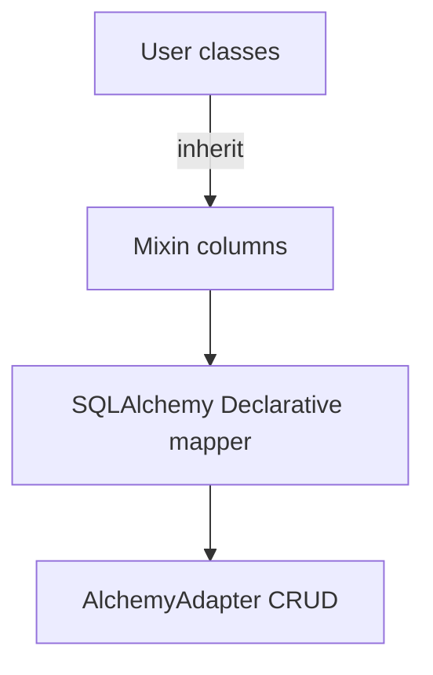
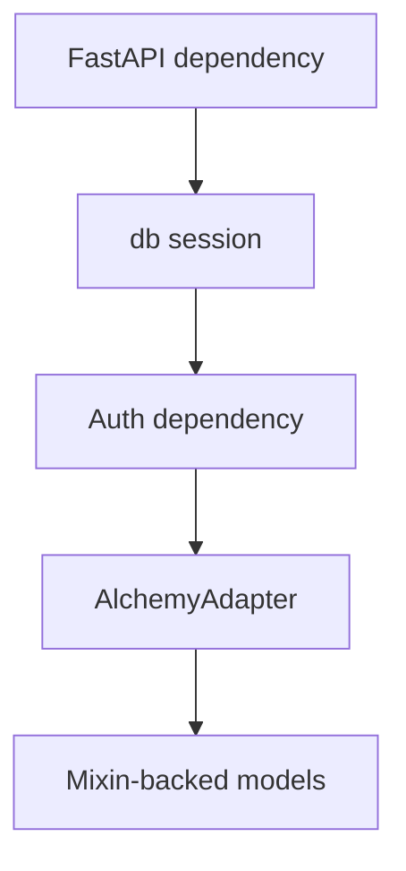
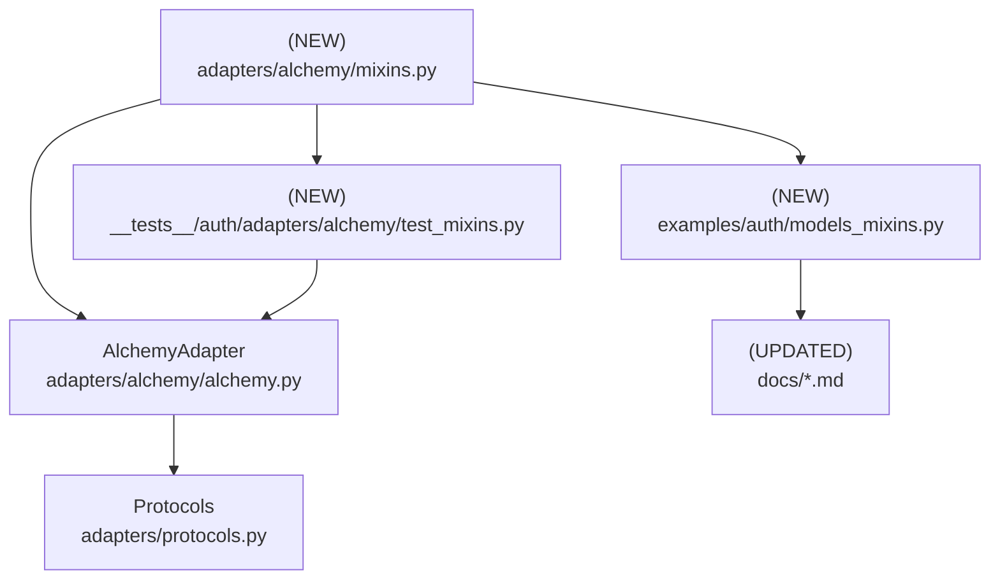

# Design Document: SQLAlchemy Declarative Mixins

## Overview

### High-Level Description
Introduce a set of SQLAlchemy `@declarative_mixin` classes that bundle Belgie’s required auth columns (user, account, session, OAuth state) so integrators can stand up the `AlchemyAdapter` with minimal boilerplate. Mixins will encapsulate common `mapped_column` definitions, SQL-driven defaults (UUID primary keys via `func.gen_random_uuid()` where available, timestamps via `func.now()`), and convenience relationships while keeping override points for custom schemas. Documentation and examples will shift to the mixin-first path, with legacy explicit model definitions remaining supported.

### Goals
- Provide reusable, typed mixins for all adapter-required models using `mapped_column`.
- Use SQLAlchemy 2.0 native `Uuid` / `UUID(as_uuid=True)` columns with SQL-side UUID generation (`func.gen_random_uuid()` or dialect equivalent), avoiding raw SQL strings, and mark primary keys as `unique=True` and `index=True` for convenience.
- Prefer SQL-generated timestamps (`server_default=func.now()`, `onupdate=func.now()`) over Python `datetime.now()`.
- Default table names are singular (`user`, `account`, `session`, `oauth_state`); FK helpers assume those names. Consumers wanting different names supply their own models that satisfy the protocol.
- Include convenience relationships between user/accounts/sessions even though not required by protocols; relationships and FKs use the default singular table names (e.g., `ForeignKey("user.id")`, `relationship("User")`).
- Scopes are not defined in the mixins; users add their own scope field (e.g., ARRAY of Enum) on their models as they see fit.
- Update README, docs, quickstart, and examples to showcase the mixin-first setup.
- Add tests proving mixin-based models satisfy adapter protocols and work end-to-end.

### Non-Goals
- No new adapter behaviors or storage engines beyond SQLAlchemy.
- No automatic migration generation or schema versioning.

## Workflows

### Workflow 1: Define Models with Mixins

#### Description
Developers subclass the provided mixins plus their project’s `DeclarativeBase`, only supplying singular `__tablename__` values. FK helpers assume the defaults (`user`, `account`, `session`, `oauth_state`).

#### Usage Example
```python
from sqlalchemy.orm import DeclarativeBase
from belgie.auth.adapters.alchemy.mixins import (
    PrimaryKeyMixin,
    TimestampMixin,
    UserMixin,
    AccountMixin,
    SessionMixin,
    OAuthStateMixin,
)
from examples.auth.scopes import Scope  # user-defined Enum of scopes

class Base(DeclarativeBase):
    pass


class User(PrimaryKeyMixin, UserMixin, TimestampMixin, Base):
    __tablename__ = "user"
    # add your own scopes column if desired, e.g.:
    # scopes: Mapped[list[Scope] | None] = mapped_column(
    #     ARRAY(SQLEnum(Scope, values_callable=lambda x: [e.value for e in x])),
    #     nullable=True,
    #     default=None,
    # )


class Account(PrimaryKeyMixin, AccountMixin, TimestampMixin, Base):
    __tablename__ = "account"


class Session(PrimaryKeyMixin, SessionMixin, TimestampMixin, Base):
    __tablename__ = "session"


class OAuthState(PrimaryKeyMixin, OAuthStateMixin, TimestampMixin, Base):
    __tablename__ = "oauth_state"
```

#### Call Graph


#### Key Components
- **Mixins** (`adapters/alchemy/mixins.py`) bundle required columns and optional relationships.
- **DeclarativeBase** (user app) supplies metadata and engine bindings.
- **AlchemyAdapter** consumes the concrete mapped classes unchanged.

### Workflow 2: Plug Models into the Adapter

#### Description
Adapter is instantiated with mixin-based models and used inside FastAPI/FastAPI-like apps exactly as today; no concrete classes are shipped—users define their own `DeclarativeBase` and mapped classes.

#### Usage Example
```python
from belgie.auth import AlchemyAdapter, Auth, AuthSettings

adapter = AlchemyAdapter(
    user=User,
    account=Account,
    session=Session,
    oauth_state=OAuthState,
    db_dependency=get_db,
)

auth = Auth(settings=AuthSettings(...), adapter=adapter, providers=providers)
```

#### Call Graph


#### Key Components
- **get_db**: Async session dependency (existing pattern).
- **Auth**/**AlchemyAdapter**: no signature changes.
- **Mixin-backed models**: satisfy adapter protocols via shared columns.

## Dependencies



## Detailed Design

### Module Structure

```
src/belgie/
├── auth/
│   ├── adapters/
│   │   └── alchemy/
│   │       ├── __init__.py
│   │       ├── alchemy.py            # moved module, same API surface
│   │       └── mixins.py             # NEW mixins & helpers
│   └── core/...
__tests__/
└── auth/
    └── adapters/
        └── alchemy/
            ├── test_alchemy.py       # moved existing adapter tests
            └── test_mixins.py        # NEW tests for mixin-backed models
examples/auth/
└── models_mixins.py                  # NEW example using mixins
docs/
├── quickstart.md                     # UPDATED to prefer mixins
├── models.md                         # UPDATED: mixin section + migration notes
└── README.md                         # UPDATED snippets
```

### API Design

#### `src/belgie/auth/adapters/alchemy/mixins.py`
Bundle reusable mixins; keep pure SQLAlchemy surface (no Belgie runtime deps).

```python
from __future__ import annotations
from datetime import datetime
from typing import TYPE_CHECKING
from uuid import UUID

from sqlalchemy import DateTime, ForeignKey, String, Uuid, func
from sqlalchemy.orm import Mapped, declared_attr, declarative_mixin, mapped_column, relationship

if TYPE_CHECKING:
    from sqlalchemy.orm import DeclarativeBase


@declarative_mixin
class PrimaryKeyMixin:
    id: Mapped[UUID] = mapped_column(
        Uuid(as_uuid=True),
        primary_key=True,
        unique=True,
        index=True,
        server_default=func.gen_random_uuid(),  # avoids raw SQL; dialects without support can override default
    )


@declarative_mixin
class TimestampMixin:
    created_at: Mapped[datetime] = mapped_column(DateTime(timezone=True), server_default=func.now())
    updated_at: Mapped[datetime] = mapped_column(
        DateTime(timezone=True),
        server_default=func.now(),
        onupdate=func.now(),
    )


@declarative_mixin
class UserMixin:
    email: Mapped[str] = mapped_column(String(255), unique=True, index=True)
    name: Mapped[str | None] = mapped_column(String(255), nullable=True)
    image: Mapped[str | None] = mapped_column(String(500), nullable=True)
    email_verified: Mapped[bool] = mapped_column(default=False)

    @declared_attr.directive
    def accounts(cls) -> Mapped[list["Account"]]:
        return relationship("Account", back_populates="user", cascade="all, delete-orphan")

    @declared_attr.directive
    def sessions(cls) -> Mapped[list["Session"]]:
        return relationship("Session", back_populates="user", cascade="all, delete-orphan")


@declarative_mixin
class AccountMixin:
    @declared_attr.directive
    def user_id(cls) -> Mapped[UUID]:
        return mapped_column(ForeignKey("user.id", ondelete="CASCADE"), index=True)

    provider: Mapped[str] = mapped_column(String(50), index=True)
    provider_account_id: Mapped[str] = mapped_column(String(255), index=True)
    access_token: Mapped[str | None] = mapped_column(String(1000), nullable=True)
    refresh_token: Mapped[str | None] = mapped_column(String(1000), nullable=True)
    expires_at: Mapped[datetime | None] = mapped_column(DateTime(timezone=True), nullable=True)
    token_type: Mapped[str | None] = mapped_column(String(50), nullable=True)
    scope: Mapped[str | None] = mapped_column(String(500), nullable=True)

    @declared_attr.directive
    def user(cls) -> Mapped["User"]:
        return relationship("User", back_populates="accounts")


@declarative_mixin
class SessionMixin:
    @declared_attr.directive
    def user_id(cls) -> Mapped[UUID]:
        return mapped_column(ForeignKey("user.id", ondelete="CASCADE"), index=True)

    expires_at: Mapped[datetime] = mapped_column(DateTime(timezone=True), index=True)
    ip_address: Mapped[str | None] = mapped_column(String(45), nullable=True)
    user_agent: Mapped[str | None] = mapped_column(String(500), nullable=True)

    @declared_attr.directive
    def user(cls) -> Mapped["User"]:
        return relationship("User", back_populates="sessions")


@declarative_mixin
class OAuthStateMixin:
    state: Mapped[str] = mapped_column(String(255), unique=True, index=True)
    code_verifier: Mapped[str | None] = mapped_column(String(255), nullable=True)
    redirect_url: Mapped[str | None] = mapped_column(String(1024), nullable=True)
    expires_at: Mapped[datetime] = mapped_column(DateTime(timezone=True), index=True)
```

- Relationships are provided for convenience; subclasses can override/remove attributes if they diverge from defaults.
- No JSON columns are included by default; consumers can extend with backend-specific scope storage if required.

#### `examples/auth/models_mixins.py`
Show end-to-end minimal setup using mixins, mirroring quickstart but shorter.

#### Documentation updates
- README/quickstart: replace long column examples with mixin-based definitions; keep explicit version as “manual option.”
- docs/models.md: new “Declarative Mixins” section with migration notes and override patterns (e.g., custom scope storage).
- examples/auth/README.md: add command to run mixin example.

### Testing Strategy

**Unit/Adapter Integration (`__tests__/auth/adapters/alchemy/test_mixins.py`):**
- Instantiate DeclarativeBase + mixin-backed models; run adapter CRUD flows (create/get/update/delete) against async SQLite test DB.
- Validate protocol compliance (type hints + runtime attrs) using `isinstance(..., Protocol)`.
- Ensure FK cascade works for delete_user.

**Adapter Regression (`__tests__/auth/adapters/alchemy/test_alchemy.py`):**
- Move existing adapter tests into the `alchemy/` subfolder to align with module relocation; keep coverage intact.

**Docs/examples smoke:**
- Minimal snippet execution via doctest-style sample? (optional) or ensure example script runs in CI (fast SQLite).

**Type/Lint:**
- Extend ruff/ty coverage to new module; include `# ty: ignore[...]` only if SQLAlchemy typing requires.

### Implementation Order

1. Move `AlchemyAdapter` into `adapters/alchemy/alchemy.py` (preserve API surface/import path via `__init__.py` re-export).
2. Add `adapters/alchemy/mixins.py` with mixins + relationships (leaf module).
3. Create mixin-based example `examples/auth/models_mixins.py`.
4. Update docs (`README.md`, `docs/quickstart.md`, `docs/models.md`, `examples/auth/README.md`) to feature mixins.
5. Add tests `__tests__/auth/adapters/alchemy/test_mixins.py` and move existing `test_alchemy.py` into the same subfolder.
6. Run ruff, ty, pytest; adjust per feedback.

### Tasks

- [ ] Implement mixin module.
- [ ] Add mixin example file.
- [ ] Update docs/readme to prefer mixins.
- [ ] Write adapter integration tests using mixin models.
- [ ] Run lint, type-check, tests.

## Open Questions
1. Should we ship ready-made concrete classes (`BelgieUser`, etc.) for ultra-quick start, or keep mixins only (current plan: mixins only)?

## Future Enhancements
- Add optional typed `ScopeType` generic mixin parameter once SQLAlchemy typing stabilizes.
- Provide Alembic migration autogeneration helpers or metadata bundling.

## Libraries

| Library | Version | Purpose | Dependency Group | Command |
|---------|---------|---------|------------------|---------|
| (none)  | —       | —       | —                | —       |

## Alternative Approaches

### Approach 1: Keep manual model definitions only
- **Pros**: No new API surface; zero abstraction.
- **Cons**: Continued boilerplate; higher onboarding friction; duplicated defaults.
- **Why not chosen**: Request is to simplify via mixins.

### Approach 2: Provide full concrete models instead of mixins
- **Pros**: Fastest copy/paste for users.
- **Cons**: Harder to extend/override fields; potential table-name conflicts.
- **Why not chosen**: Mixins offer flexibility while still reducing boilerplate.
