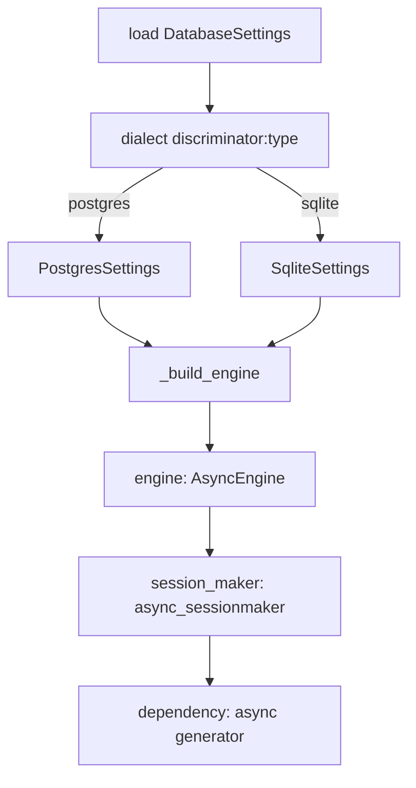
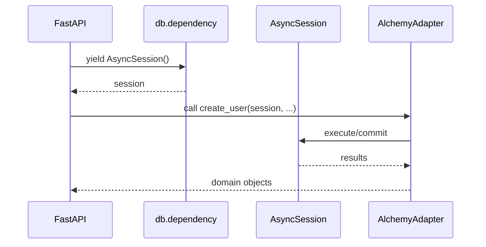
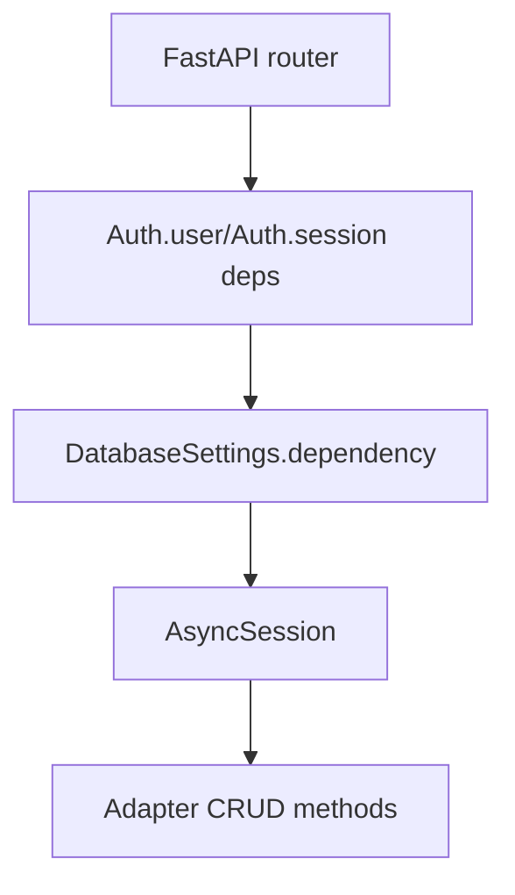
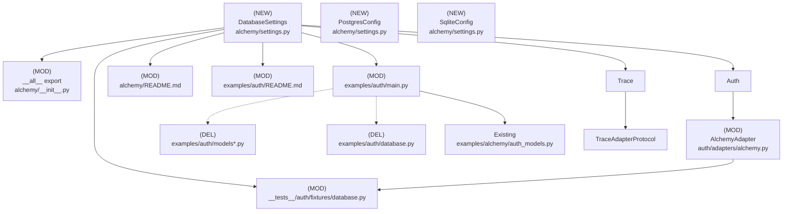

# Design Document: database settings centralization

## Overview

### High-Level Description

Centralize database configuration behind a reusable `DatabaseSettings` class in `belgie.alchemy`. The class will
encapsulate environment-driven settings, construct async SQLAlchemy engines, expose session factories, and provide a
FastAPI-friendly dependency. Auth and trace modules will consume this shared configuration instead of duplicating
engine/session setup.

### Goals

- Provide a single, type-safe configuration surface for database setup (Postgres + SQLite).
- Simplify FastAPI integration via a prebuilt async session dependency.
- Remove duplicated example/test database wiring and align adapters on the shared settings object.
- Preserve sensible defaults (UTC, FK enforcement, pooling) with minimal caller code.

### Non-Goals

- Managing migrations or schema lifecycle beyond `create_all` in examples/tests.
- Supporting sync SQLAlchemy engines or ORMs other than SQLAlchemy 2.x.
- Adding new database backends beyond PostgreSQL and SQLite.

## Workflows

### Workflow 1: Configure DatabaseSettings

#### Description

Create a `DatabaseSettings` instance where `dialect` is a Pydantic‑discriminated union
(`PostgresSettings | SqliteSettings`). It produces an async engine, session factory, and FastAPI
dependency with correct pooling/FK behavior per dialect.

#### Usage Example

```python
from belgie.alchemy import DatabaseSettings

# Explicit instantiation
db = DatabaseSettings(dialect={"type": "sqlite", "database": "./app.db", "echo": True})

# Load from environment variables (preferred method)
db = DatabaseSettings.from_env()

engine = db.engine
session_maker = db.session_maker
get_db = db.dependency  # async generator yielding AsyncSession
```

#### Environment Variables

**Type selector:**

```bash
BELGIE_DATABASE_TYPE=postgres  # or "sqlite" (default: sqlite)
```

**SQLite configuration:**

```bash
BELGIE_SQLITE_DATABASE=:memory:
BELGIE_SQLITE_ENABLE_FOREIGN_KEYS=true
BELGIE_SQLITE_ECHO=false
```

**PostgreSQL configuration:**

```bash
BELGIE_POSTGRES_HOST=localhost
BELGIE_POSTGRES_PORT=5432
BELGIE_POSTGRES_DATABASE=mydb
BELGIE_POSTGRES_USERNAME=user
BELGIE_POSTGRES_PASSWORD=secret
BELGIE_POSTGRES_POOL_SIZE=10
BELGIE_POSTGRES_MAX_OVERFLOW=20
BELGIE_POSTGRES_POOL_TIMEOUT=30.0
BELGIE_POSTGRES_POOL_RECYCLE=3600
BELGIE_POSTGRES_POOL_PRE_PING=true
BELGIE_POSTGRES_ECHO=false
```

#### Call Graph



#### Sequence Diagram



#### Key Components

- **DatabaseSettings** (`alchemy/settings.py:DatabaseSettings`) - owns `dialect` (discriminated union) and centralizes
  engine/session/dependency.
- **PostgresSettings / SqliteSettings** (`alchemy/settings.py`) - concrete variants keyed by discriminator `type`, held
  in `DatabaseSettings.dialect`.
- **db.dependency** (`alchemy/settings.py:dependency`) - async generator for FastAPI DI (accessed directly from `db`,
  not via adapter).

### Workflow 2: Integrate with AlchemyAdapter

#### Description

`Auth`/ `Trace` carry `db: DatabaseSettings` (includes `dialect` and runtime helpers). Adapters no longer expose or
accept dependencies; FastAPI wiring uses `auth.db.dependency` (or `trace.db.dependency`) directly. Adapters stay
persistence-only.

#### Usage Example

```python
from belgie.alchemy import Base, DatabaseSettings
from belgie.auth import AlchemyAdapter, Auth
from examples.alchemy.auth_models import User, Account, Session, OAuthState

database_settings = DatabaseSettings(dialect={"type": "sqlite", "database": "./belgie_auth_example.db", "echo": True})

adapter = AlchemyAdapter(
    user=User,
    account=Account,
    session=Session,
    oauth_state=OAuthState,
)
auth = Auth(settings=..., adapter=adapter, providers=..., db=database_settings)
```

#### Call Graph



#### Key Components

- **Auth** (`auth/core/auth.py:Auth`) - owns `db: DatabaseSettings` and exposes `db.dependency` to FastAPI; passes
  sessions into adapter methods.
- **Trace** (`trace/core/trace.py:Trace`) - mirrors Auth ownership of `db` for tracing; adapters remain
  persistence-only.
- **AlchemyAdapter** (`auth/adapters/alchemy.py:AlchemyAdapter`) - pure persistence layer; no dependency property or db
  field.
- **Examples** (`examples/auth/main.py`) - instantiate `DatabaseSettings`, wire lifecycle to `engine.begin()`/
  `engine.dispose()`, pass `db` into `Auth`.
- **Tests** (`__tests__/auth/fixtures/database.py`) - use `DatabaseSettings` to produce in-memory engines and session
  factories.

## Dependencies



## Detailed Design

### Module Structure

```text
design/
└── 005-database-settings.md
src/belgie/alchemy/
├── __init__.py              # export DatabaseSettings (MOD)
├── settings.py              # DatabaseSettings + configs + helpers (NEW)
src/belgie/auth/
├── core/auth.py             # accept db: DatabaseSettings; expose dependency (MOD)
└── adapters/alchemy.py      # remove dependency property/param; pure persistence (MOD)
examples/
├── alchemy/auth_models.py   # canonical models (reuse) (EXISTING)
└── auth/
    ├── main.py              # use DatabaseSettings; remove local db/models (MOD)
    ├── database.py          # obsolete (DEL)
    ├── models.py            # obsolete (DEL)
    └── models_sqlite.py     # obsolete (DEL)
__tests__/auth/
└── fixtures/database.py     # build engine/session via DatabaseSettings (MOD)
docs/
└── ...                      # README updates for alchemy + example (MOD)
```

### API Design

#### `src/belgie/alchemy/settings.py`

Full pseudocode with discriminated `dialect` and validated numeric fields.

```python
from __future__ import annotations

from collections.abc import AsyncGenerator
from functools import cached_property
from typing import Annotated, Literal

from pydantic import Field, SecretStr, PositiveInt, NonNegativeInt, NonNegativeFloat
from pydantic_settings import BaseSettings, SettingsConfigDict
from sqlalchemy import event
from sqlalchemy.ext.asyncio import AsyncEngine, AsyncSession, async_sessionmaker, create_async_engine

class PostgresSettings(BaseSettings):
    """PostgreSQL database settings.

    Environment variables use the prefix: BELGIE_POSTGRES_
    Example: BELGIE_POSTGRES_HOST=localhost
    """
    model_config = SettingsConfigDict(env_prefix="BELGIE_POSTGRES_", extra="ignore")
    type: Literal["postgres"] = "postgres"
    host: str
    port: PositiveInt = 5432
    database: str
    username: str
    password: SecretStr
    pool_size: PositiveInt = 5
    max_overflow: NonNegativeInt = 10
    pool_timeout: NonNegativeFloat = 30.0
    pool_recycle: PositiveInt = 3600
    pool_pre_ping: bool = True
    echo: bool = False

class SqliteSettings(BaseSettings):
    """SQLite database settings.

    Environment variables use the prefix: BELGIE_SQLITE_
    Example: BELGIE_SQLITE_DATABASE=:memory:
    """
    model_config = SettingsConfigDict(env_prefix="BELGIE_SQLITE_", extra="ignore")
    type: Literal["sqlite"] = "sqlite"
    database: str
    enable_foreign_keys: bool = True
    echo: bool = False

class DatabaseSettings(BaseSettings):
    """Database settings with support for PostgreSQL and SQLite.

    Environment variables:
    - BELGIE_DATABASE_TYPE: "postgres" or "sqlite" (default: "sqlite")
    - For PostgreSQL: BELGIE_POSTGRES_HOST, BELGIE_POSTGRES_PORT, etc.
    - For SQLite: BELGIE_SQLITE_DATABASE, BELGIE_SQLITE_ENABLE_FOREIGN_KEYS, etc.
    """
    model_config = SettingsConfigDict(
        env_prefix="BELGIE_DATABASE_",
        extra="ignore",
    )
    dialect: Annotated[PostgresSettings | SqliteSettings, Field(discriminator="type")]

    @classmethod
    def from_env(cls) -> DatabaseSettings:
        """Load database settings from environment variables.

        Reads BELGIE_DATABASE_TYPE to determine which dialect to use,
        then loads the appropriate settings from BELGIE_POSTGRES_* or BELGIE_SQLITE_* vars.
        """
        db_type = os.getenv("BELGIE_DATABASE_TYPE", "sqlite")
        if db_type == "postgres":
            return cls(dialect=PostgresSettings())
        return cls(dialect=SqliteSettings())

    @cached_property
    def engine(self) -> AsyncEngine:
        if self.dialect.type == "postgres":
            url = (
                "postgresql+asyncpg://"
                f"{self.dialect.username}:{self.dialect.password.get_secret_value()}"
                f"@{self.dialect.host}:{self.dialect.port}/{self.dialect.database}"
            )
            return create_async_engine(
                url,
                echo=self.dialect.echo,
                pool_size=self.dialect.pool_size,
                max_overflow=self.dialect.max_overflow,
                pool_timeout=self.dialect.pool_timeout,
                pool_recycle=self.dialect.pool_recycle,
                pool_pre_ping=self.dialect.pool_pre_ping,
            )
        url = f"sqlite+aiosqlite:///{self.dialect.database}"
        engine = create_async_engine(url, echo=self.dialect.echo)
        if self.dialect.enable_foreign_keys:
            @event.listens_for(engine.sync_engine, "connect")
            def _enable_fk(dbapi_conn, _conn_record) -> None:
                cursor = dbapi_conn.cursor()
                cursor.execute("PRAGMA foreign_keys=ON")
                cursor.close()
        return engine

    @cached_property
    def session_maker(self) -> async_sessionmaker[AsyncSession]:
        return async_sessionmaker(self.engine, class_=AsyncSession, expire_on_commit=False)

    async def dependency(self) -> AsyncGenerator[AsyncSession, None]:
        async with self.session_maker() as session:
            yield session
```

- Instantiate `db = DatabaseSettings.model_validate({})` to pull from env or supply overrides; `dialect.type` drives
  branching.
- Engine creation per discriminator:
  - Postgres: `create_async_engine("postgresql+asyncpg://...")` with pooling params.
  - SQLite: `create_async_engine("sqlite+aiosqlite:///{path}")`; add FK pragma when `enable_foreign_keys=True`.
- `session_maker` uses `expire_on_commit=False`.
- `dependency` yields sessions from `session_maker`.
- All heavy objects (`engine`, `session_maker`) cached via `functools.cached_property`.

#### `src/belgie/alchemy/__init__.py`

Export `DatabaseSettings` alongside existing `Base`, `PrimaryKeyMixin`, `TimestampMixin`, `DateTimeUTC`.

```python
from belgie.alchemy.settings import DatabaseSettings
__all__ = ["Base", "DatabaseSettings", "DateTimeUTC", "PrimaryKeyMixin", "TimestampMixin"]
```

#### `src/belgie/auth/adapters/alchemy.py`

Keep constructor focused on model types only; remove `db` argument and `dependency` property. CRUD methods receive
`AsyncSession` passed in by `Auth` (sourced from `auth.db.dependency`).

#### `src/belgie/auth/core/auth.py`

- Accept `db: DatabaseSettings` as a required parameter.
- Provide `db.dependency` for FastAPI (`Auth.__call__`, routers, providers).
- Pass `AsyncSession` instances from that dependency into adapter methods.

#### `src/belgie/trace/core/trace.py` and `trace/adapters/protocols.py`

- Mirror the Auth change: `Trace` owns `db: DatabaseSettings`; adapters drop dependency exposure and expect
  `AsyncSession` to be supplied by callers.

#### `examples/auth/main.py`

Adopt shared settings and example models.

```python
from belgie.alchemy import Base, DatabaseSettings
from examples.alchemy.auth_models import User, Account, Session, OAuthState

db_settings = DatabaseSettings(type="sqlite", database="./belgie_auth_example.db", echo=True)

@asynccontextmanager
async def lifespan(_app: FastAPI):
    async with db_settings.engine.begin() as conn:
        await conn.run_sync(Base.metadata.create_all)
    yield
    await db_settings.engine.dispose()
```

Remove local `database.py`, `models.py`, `models_sqlite.py`; rely on `auth_models.py`.

#### `__tests__/auth/fixtures/database.py`

Construct engine/session via `DatabaseSettings` for in-memory SQLite with FK enforcement.

```python
from belgie.alchemy import Base, DatabaseSettings

TEST_DB = DatabaseSettings(type="sqlite", database=":memory:", enable_foreign_keys=True)
engine = TEST_DB.engine
session_maker = TEST_DB.session_maker
```

Fixtures yield sessions from `session_maker`; reuse FK pragma baked into `DatabaseSettings`.

#### Documentation (`src/belgie/alchemy/README.md`, `examples/auth/README.md`)

- Add DatabaseSettings overview, env var table, quick-start examples for Postgres/SQLite.
- Document migration path: `db_dependency` → `db=DatabaseSettings`.

### Testing Strategy

- **alchemy/settings.py**
  - Discriminator validation: `type=postgres` vs `type=sqlite` selects correct subclass.
  - DSN construction: postgres URL includes host/port/user/password/db; sqlite handles file path and `:memory:`.
  - Pooling flags honored: `pool_pre_ping`, `pool_timeout`, `pool_recycle`, `pool_size`, `max_overflow`.
  - SQLite foreign keys enforced when `enable_foreign_keys=True`.
  - Dependency yields `AsyncSession` with `expire_on_commit=False`; sessions are unique per invocation.
- **auth/core/auth.py**
  - `Auth(db=...)` exposes `db.dependency`; FastAPI dependency returns `AsyncSession`.
  - Routers/providers pull sessions from `auth.db.dependency`, not adapter.
- **trace/core/trace.py**
  - Mirrors Auth: dependency available when `db` provided; adapters remain passive.
- **auth/adapters/alchemy.py**
  - Constructor only accepts model types.
  - CRUD operations succeed when provided an injected `AsyncSession`; no reliance on internal db/dependency.
- **examples/auth/main.py**
  - Lifespan creates tables and disposes engine without leaks.
- **fixtures**
  - `__tests__/auth/fixtures/database.py` builds in-memory sqlite via `DatabaseSettings`; FK pragma active; session
    factory reusable.
- **Integration**
  - End-to-end sign-in/sign-out with sqlite in-memory using new dependency path.
  - Failure case: constructing Auth without `db` raises clear error.
- **Quality gates**
  - Run `uv run pytest`, `uv run ty`, `uv run ruff check`.

### Implementation

#### Implementation Order

1. **Settings module**: Implement `alchemy/settings.py` with configs, engine, session, dependency.
2. **Exports**: Update `alchemy/__init__.py` to include `DatabaseSettings`.
3. **Core wiring**: Update `auth/core/auth.py` and `trace/core/trace.py` to own `db: DatabaseSettings` and expose
   `db.dependency`; remove adapter dependency plumbing.
4. **Example alignment**: Refactor `examples/auth/main.py`; delete obsolete example database/models files.
5. **Tests**: Refactor `__tests__/auth/fixtures/database.py` (and any dependent fixtures); adjust imports if needed.
6. **Docs**: Update alchemy and example READMEs with new usage/migration guidance.

- [x] **Settings module**
  - [x] Implement `src/belgie/alchemy/settings.py` (DatabaseSettings with `dialect`, PostgresSettings, SqliteSettings).
  - [x] Add engine/session/dependency helpers with caching and FK pragma.
  - [x] Add `from_env()` class method for loading from environment variables.
  - [x] Use separate env prefixes (BELGIE_POSTGRES_*, BELGIE_SQLITE_*) to avoid double underscores.
- [x] **Exports**
  - [x] Export `DatabaseSettings` in `src/belgie/alchemy/__init__.py`.
- [x] **Auth core**
  - [x] Update `src/belgie/auth/core/auth.py` to accept `db: DatabaseSettings`.
  - [x] Wire FastAPI dependencies to `auth.db.dependency` and ensure error on missing db.
- [x] **Auth providers/routes**
  - [x] Replace `adapter.dependency` usage with `auth.db.dependency`.
- [x] **Auth adapter**
  - [x] Remove `db`/`dependency` parameters and properties from `auth/adapters/alchemy.py`.
  - [x] Ensure CRUD methods only take `AsyncSession` parameters.
- [x] **Trace**
  - [x] Update `src/belgie/trace/core/trace.py` to own `db: DatabaseSettings`; adjust callable dependency.
  - [x] Update `trace/adapters/protocols.py` to drop dependency requirement.
- [x] **Examples**
  - [x] Refactor `examples/auth/main.py` to pass `db` to `Auth`; use `auth_models`; manage engine lifecycle.
  - [x] Delete `examples/auth/database.py`, `examples/auth/models.py`, `examples/auth/models_sqlite.py`.
- [x] **Tests**
  - [x] Update `__tests__/auth/fixtures/database.py` to use `DatabaseSettings`; ensure FK pragma.
  - [x] Adjust any fixtures/imports broken by adapter signature change.
  - [x] Add comprehensive integration tests (18 tests) for environment variable loading.
  - [x] Add tests for protocol runtime checking and validation.
  - [x] Add PostgreSQL integration tests with real database connections.
- [ ] **Docs**
  - [ ] Refresh `src/belgie/alchemy/README.md`, `examples/auth/README.md`, and trace docs for new dependency flow.
- [x] **Quality gates**
  - [x] Run `uv run ruff check`, `uv run ty`, `uv run pytest`.
  - [x] All 45 alchemy tests pass, 11 skipped (PostgreSQL tests).

## Resolved Questions

1. ~~Should `DatabaseSettings` optionally expose synchronous engine support for non-async FastAPI usage?~~
   - **Resolution**: Not needed. All usage is async-first with `AsyncSession` and `AsyncEngine`.
2. ~~Do we need custom pool sizing defaults for aiosqlite (currently pooled the same as Postgres)?~~
   - **Resolution**: SQLite uses connection pooling automatically via SQLAlchemy; no custom config needed.
3. ~~Should `DatabaseSettings` allow overriding `session_maker` options (e.g., autoflush) via config?~~
   - **Resolution**: Standardized on `expire_on_commit=False`; other options can be added if needed.
4. ~~Should we use double underscores in environment variables (BELGIE_DATABASE_DIALECT__TYPE)?~~
   - **Resolution**: NO. Implemented separate prefixes (BELGIE_POSTGRES_*, BELGIE_SQLITE_*) for cleaner env vars.

## Open Questions

None at this time.

## Implemented Enhancements

- ✅ Separate environment variable prefixes (no double underscores)
- ✅ `DatabaseSettings.from_env()` class method for clean environment loading
- ✅ Comprehensive integration test suite (18 tests)
- ✅ Protocol runtime checking with `@runtime_checkable` decorators
- ✅ PostgreSQL live connection tests (optional via POSTGRES_TEST_URL)

## Future Enhancements

- Add MySQL/MariaDB configuration variant using the same discriminated union.
- Provide optional Alembic integration helpers for migrations.
- Support multiple named database configurations for multi-tenant setups.
- Update documentation (README files) with new environment variable format.

## Libraries

### New Libraries

None (leverages existing `pydantic-settings`, `sqlalchemy` already in dependencies).

### Existing Libraries

- `pydantic>=2.0`, `pydantic-settings>=2.0` — environment-driven settings.
- `sqlalchemy>=2.x`, `aiosqlite`, `asyncpg` — async database connectivity.

## Alternative Approaches

### Keep adapter accepting callable dependency

**Pros**: Minimal breaking change; caller-defined lifecycle.
**Cons**: Continues duplication; no standardized pooling/FK behavior; harder to document.
**Why not chosen**: Goal is centralization and consistent defaults.

### Use dataclass-only settings (no Pydantic)

**Pros**: Lighter dependency surface.
**Cons**: Loses env loading, validation, and discriminated unions.
**Why not chosen**: Pydantic already in project; validation and env support are key.
