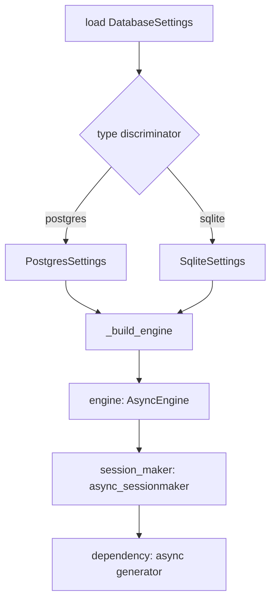
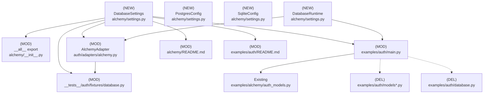

# Design Document: database settings centralization

## Overview

### High-Level Description
Centralize database configuration behind a reusable `DatabaseSettings` class in `belgie.alchemy`. The class will encapsulate environment-driven settings, construct async SQLAlchemy engines, expose session factories, and provide a FastAPI-friendly dependency. Auth and trace modules will consume this shared configuration instead of duplicating engine/session setup.

### Goals
- Provide a single, type-safe configuration surface for database setup (Postgres + SQLite).
- Simplify FastAPI integration via a prebuilt async session dependency.
- Remove duplicated example/test database wiring and align adapters on the shared settings object.
- Preserve sensible defaults (UTC, FK enforcement, pooling) with minimal caller code.

### Non-Goals
- Managing migrations or schema lifecycle beyond `create_all` in examples/tests.
- Supporting sync SQLAlchemy engines or ORMs other than SQLAlchemy 2.x.
- Adding new database backends beyond PostgreSQL and SQLite.

## Workflows

### Workflow 1: Configure DatabaseSettings

#### Description
Create a `DatabaseSettings` instance (discriminated union using Pydantic) to produce an async engine, session factory, and FastAPI dependency with correct pooling/FK behavior per dialect.

#### Usage Example
```python
from belgie.alchemy import DatabaseSettings

db = DatabaseSettings()  # reads BELGIE_DATABASE_* env vars

engine = db.engine
session_maker = db.session_maker
get_db = db.dependency  # async generator yielding AsyncSession
```

#### Call Graph


#### Sequence Diagram


#### Key Components
- **DatabaseSettings** (`alchemy/settings.py:DatabaseSettings`) - discriminated union (pydantic) that builds engine/session/dependency.
- **PostgresSettings / SqliteSettings** (`alchemy/settings.py`) - concrete variants keyed by discriminator `type`.
- **db.dependency** (`alchemy/settings.py:dependency`) - async generator for FastAPI DI (accessed directly from `db`, not via adapter).

### Workflow 2: Integrate with AlchemyAdapter

#### Description
Adapters carry a `db: DatabaseSettings` (settings object) plus a `db_runtime` (engine/session/dependency holder). They do not re-export the dependency; FastAPI wiring should use `db_runtime.dependency` directly.

#### Usage Example
```python
from belgie.alchemy import Base, DatabaseSettings
from belgie.auth import AlchemyAdapter, Auth
from examples.alchemy.auth_models import User, Account, Session, OAuthState

database_settings = DatabaseSettings(type="sqlite", database="./belgie_auth_example.db", echo=True)

adapter = AlchemyAdapter(
    user=User,
    account=Account,
    session=Session,
    oauth_state=OAuthState,
    db=database_settings,  # stored field, not used to expose dependency
)
auth = Auth(settings=..., adapter=adapter, providers=...)
```

#### Call Graph


#### Key Components
- **AlchemyAdapter** (`auth/adapters/alchemy.py:AlchemyAdapter`) - constructor stores `db: DatabaseSettings`; `dependency` delegates to `db.dependency`.
- **Examples** (`examples/auth/main.py`) - instantiate `DatabaseSettings`, wire lifecycle to `engine.begin()`/`engine.dispose()`.
- **Tests** (`__tests__/auth/fixtures/database.py`) - use `DatabaseSettings` to produce in-memory engines and session factories.

## Dependencies



## Detailed Design

### Module Structure
```
design/
└── 005-database-settings.md
src/belgie/alchemy/
├── __init__.py              # export DatabaseSettings (MOD)
├── settings.py              # DatabaseSettings + configs (NEW)
src/belgie/auth/adapters/
└── alchemy.py               # ctor/dependency signature uses DatabaseSettings (MOD)
examples/
├── alchemy/auth_models.py   # canonical models (reuse) (EXISTING)
└── auth/
    ├── main.py              # use DatabaseSettings; remove local db/models (MOD)
    ├── database.py          # obsolete (DEL)
    ├── models.py            # obsolete (DEL)
    └── models_sqlite.py     # obsolete (DEL)
__tests__/auth/
└── fixtures/database.py     # build engine/session via DatabaseSettings (MOD)
docs/
└── ...                      # README updates for alchemy + example (MOD)
```

### API Design

#### `src/belgie/alchemy/settings.py`
New configuration module using Pydantic discriminated unions for dialect selection.

```python
from __future__ import annotations

from collections.abc import AsyncGenerator
from functools import cached_property
from typing import Annotated, Literal

from pydantic import Field, SecretStr
from pydantic_settings import BaseSettings, SettingsConfigDict
from sqlalchemy import event
from sqlalchemy.ext.asyncio import AsyncEngine, AsyncSession, async_sessionmaker, create_async_engine

class CommonSettings(BaseSettings):
    model_config = SettingsConfigDict(env_prefix="BELGIE_DATABASE_", extra="ignore")
    type: Literal["postgres", "sqlite"]
    echo: bool = False

class PostgresSettings(CommonSettings):
    type: Literal["postgres"] = "postgres"
    host: str
    port: int = 5432
    database: str
    username: str
    password: SecretStr
    pool_size: int = 5
    max_overflow: int = 10
    pool_timeout: float = 30.0
    pool_recycle: int = 3600
    pool_pre_ping: bool = True

class SqliteSettings(CommonSettings):
    type: Literal["sqlite"] = "sqlite"
    database: str
    enable_foreign_keys: bool = True

DatabaseSettings = Annotated[PostgresSettings | SqliteSettings, Field(discriminator="type")]

class DatabaseRuntime:
    def __init__(self, settings: DatabaseSettings) -> None:
        self.settings = settings

    @cached_property
    def engine(self) -> AsyncEngine: ...

    @cached_property
    def session_maker(self) -> async_sessionmaker[AsyncSession]: ...

    async def dependency(self) -> AsyncGenerator[AsyncSession, None]: ...
```

- Instantiate `settings = DatabaseSettings.model_validate({})` to pull from env or pass kwargs; wrap in `DatabaseRuntime` to house engine/session/dependency.
- Engine creation per discriminator:
  - Postgres: `create_async_engine("postgresql+asyncpg://...")` with pooling params.
  - SQLite: `create_async_engine("sqlite+aiosqlite:///{path}")`; add FK pragma when `enable_foreign_keys=True`.
- `session_maker` uses `expire_on_commit=False`.
- `dependency` yields sessions from `session_maker`.
- All heavy objects (`engine`, `session_maker`) cached via `functools.cached_property`.

#### `src/belgie/alchemy/__init__.py`
Export `DatabaseSettings` alongside existing `Base`, `PrimaryKeyMixin`, `TimestampMixin`, `DateTimeUTC`.

```python
from belgie.alchemy.settings import DatabaseSettings
__all__ = ["Base", "DatabaseSettings", "DateTimeUTC", "PrimaryKeyMixin", "TimestampMixin"]
```

#### `src/belgie/auth/adapters/alchemy.py`
Update constructor to accept settings object and delegate dependency.

```python
from belgie.alchemy import DatabaseSettings

class AlchemyAdapter(...):
    def __init__(..., db: DatabaseSettings) -> None:
        self.db = db

    @property
    def dependency(self) -> Callable[[], Any]:
        return self.db.dependency
```

Internal CRUD logic remains unchanged; only dependency wiring changes.

#### `examples/auth/main.py`
Adopt shared settings and example models.

```python
from belgie.alchemy import Base, DatabaseSettings
from examples.alchemy.auth_models import User, Account, Session, OAuthState

db_settings = DatabaseSettings(type="sqlite", database="./belgie_auth_example.db", echo=True)
db_runtime = DatabaseRuntime(db_settings)

@asynccontextmanager
async def lifespan(_app: FastAPI):
    async with db_runtime.engine.begin() as conn:
        await conn.run_sync(Base.metadata.create_all)
    yield
    await db_runtime.engine.dispose()
```

Remove local `database.py`, `models.py`, `models_sqlite.py`; rely on `auth_models.py`.

#### `__tests__/auth/fixtures/database.py`
Construct engine/session via `DatabaseSettings` for in-memory SQLite with FK enforcement.

```python
from belgie.alchemy import Base, DatabaseSettings

TEST_DB = DatabaseSettings(type="sqlite", database=":memory:", enable_foreign_keys=True)
engine = TEST_DB.engine
session_maker = TEST_DB.session_maker
```

Fixtures yield sessions from `session_maker`; reuse FK pragma baked into `DatabaseSettings`.

#### Documentation (`src/belgie/alchemy/README.md`, `examples/auth/README.md`)
- Add DatabaseSettings overview, env var table, quick-start examples for Postgres/SQLite.
- Document migration path: `db_dependency` → `db=DatabaseSettings`.

### Testing Strategy

- **Unit** (`__tests__/auth/fixtures/database.py` or new tests under `__tests__/alchemy`):
  - `DatabaseSettings` builds correct URLs per dialect.
  - SQLite FK pragma enabled when `enable_foreign_keys=True`.
  - Session factory uses `expire_on_commit=False`.
- **Adapter**:
  - Verify `AlchemyAdapter.dependency` delegates to `db.dependency`.
  - CRUD operations still function when sessions come from `DatabaseSettings`.
- **Examples**:
  - Smoke test example startup with in-memory SQLite (create_all + dispose).
- **Docs lint**: Ensure README snippets match API.

Run suite with `uv run pytest`; add type checks (`uv run ty`) and lint (`uv run ruff check`) after code changes.

### Implementation

#### Implementation Order
1. **Settings module**: Implement `alchemy/settings.py` with configs, engine, session, dependency.
2. **Exports**: Update `alchemy/__init__.py` to include `DatabaseSettings`.
3. **Adapter wiring**: Modify `auth/adapters/alchemy.py` ctor/property to accept settings object.
4. **Example alignment**: Refactor `examples/auth/main.py`; delete obsolete example database/models files.
5. **Tests**: Refactor `__tests__/auth/fixtures/database.py` (and any dependent fixtures); adjust imports if needed.
6. **Docs**: Update alchemy and example READMEs with new usage/migration guidance.

#### Tasks
- [ ] Create `src/belgie/alchemy/settings.py` (DatabaseSettings, PostgresConfig, SqliteConfig).
- [ ] Export `DatabaseSettings` in `src/belgie/alchemy/__init__.py`.
- [ ] Update `src/belgie/auth/adapters/alchemy.py` to accept `db: DatabaseSettings` and delegate dependency.
- [ ] Refactor `examples/auth/main.py` to use `DatabaseSettings` + `examples.alchemy.auth_models`.
- [ ] Delete `examples/auth/database.py`, `examples/auth/models.py`, `examples/auth/models_sqlite.py`.
- [ ] Update test fixtures to use `DatabaseSettings`; ensure FK enforcement for SQLite.
- [ ] Refresh documentation in `src/belgie/alchemy/README.md` and `examples/auth/README.md`.
- [ ] Run lint, type check, and tests.

## Open Questions
1. Should `DatabaseSettings` optionally expose synchronous engine support for non-async FastAPI usage?
2. Do we need custom pool sizing defaults for aiosqlite (currently pooled the same as Postgres)?
3. Should `DatabaseSettings` allow overriding `session_maker` options (e.g., autoflush) via config?

## Future Enhancements
- Add MySQL/MariaDB configuration variant using the same discriminated union.
- Provide optional Alembic integration helpers for migrations.
- Support multiple named database configurations for multi-tenant setups.

## Libraries

### New Libraries
None (leverages existing `pydantic-settings`, `sqlalchemy` already in dependencies).

### Existing Libraries
- `pydantic>=2.0`, `pydantic-settings>=2.0` — environment-driven settings.
- `sqlalchemy>=2.x`, `aiosqlite`, `asyncpg` — async database connectivity.

## Alternative Approaches

### Keep adapter accepting callable dependency
**Pros**: Minimal breaking change; caller-defined lifecycle.
**Cons**: Continues duplication; no standardized pooling/FK behavior; harder to document.
**Why not chosen**: Goal is centralization and consistent defaults.

### Use dataclass-only settings (no Pydantic)
**Pros**: Lighter dependency surface.
**Cons**: Loses env loading, validation, and discriminated unions.
**Why not chosen**: Pydantic already in project; validation and env support are key.
