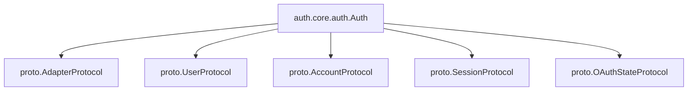
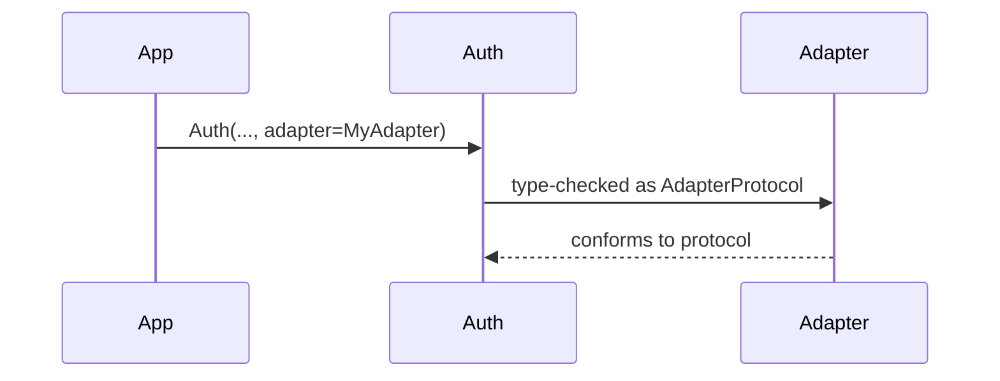
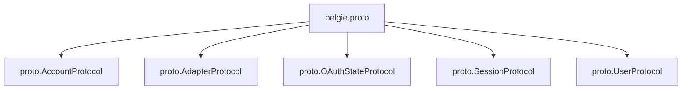
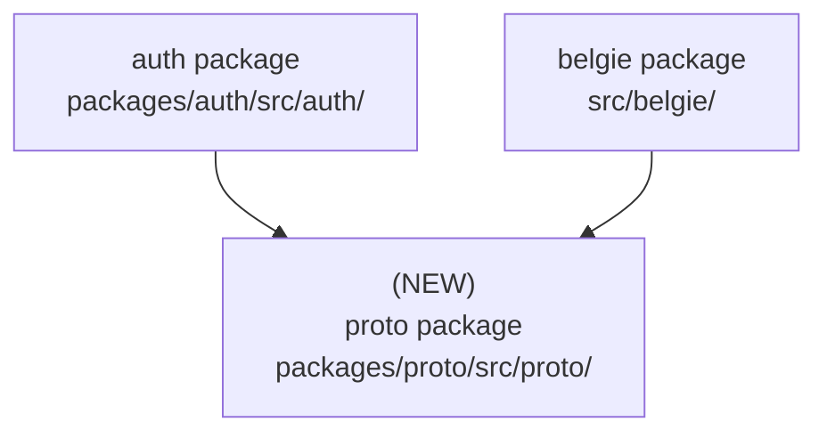

# Design Document: Proto Package for Shared Protocols

## Overview

### High-Level Description

Introduce a new `proto` workspace package that owns the shared protocol interfaces used by both `auth` and
`belgie.alchemy`. The existing protocol definitions in `packages/auth/src/auth/adapters/protocols.py` are split into
individual files under `packages/proto/src/proto/`, and downstream imports are updated to reference `proto` directly.
To make the public surface explicit, `belgie.proto` re-exports these protocols for consumers. A compatibility shim
remains at `auth.adapters.protocols` to avoid breaking external imports.

### Goals

- Create a dedicated `proto` package that contains the shared protocol interfaces.
- Split protocols into one-file-per-protocol for clarity and stability of imports.
- Update `auth` and `belgie.alchemy` to import protocols from `proto` directly.
- Provide `belgie.proto` as the preferred consumer-facing entry point.
- Preserve compatibility for existing `auth.adapters.protocols` imports.

### Non-Goals

- No behavioral changes to authentication or alchemy logic.
- No changes to protocol signatures beyond moving files.
- No new runtime dependencies.
- No deprecation/compatibility policy changes beyond the shim.

## Workflows

### Workflow 1: Auth Uses Protocols From `proto`

#### Description

Auth components (e.g., `Auth`, `AuthClient`, `SessionManager`) type their adapter and model generics against protocols
imported from `proto`.

#### Usage Example

```python
from proto import AdapterProtocol, AccountProtocol, OAuthStateProtocol, SessionProtocol, UserProtocol

class MyAuthAdapter(
    AdapterProtocol[UserProtocol, AccountProtocol, SessionProtocol, OAuthStateProtocol]
):
    ...
```

#### Call Graph



#### Sequence Diagram



#### Key Components

- **Protocol package** (`packages/proto/src/proto/`) - Protocol definitions split by concern.
- **Auth core** (`packages/auth/src/auth/core/*.py`) - Imports from `proto`.
- **Compatibility shim** (`packages/auth/src/auth/adapters/protocols.py`) - Re-exports `proto` symbols.

### Workflow 2: Belgie Consumers Import Protocols via `belgie.proto`

#### Description

Public API consumers import protocols through `belgie.proto`, which re-exports all protocol interfaces from `proto`.

#### Usage Example

```python
from belgie.proto import AdapterProtocol, UserProtocol

class Adapter(AdapterProtocol[UserProtocol, ...]):
    ...
```

#### Call Graph



#### Key Components

- **Belgie re-export module** (`src/belgie/proto.py`) - Explicit public access path.
- **Proto package** (`packages/proto/src/proto/`) - Source of truth for interfaces.

## Dependencies



## Detailed Design

### Module Structure

```text
packages/
├── proto/
│   ├── pyproject.toml
│   ├── README.md
│   └── src/proto/
│       ├── __init__.py
│       ├── py.typed
│       ├── account.py       # AccountProtocol
│       ├── adapter.py       # AdapterProtocol
│       ├── oauth_state.py   # OAuthStateProtocol
│       ├── session.py       # SessionProtocol
│       └── user.py          # UserProtocol
packages/auth/src/auth/
├── adapters/
│   └── protocols.py         # Compatibility shim -> proto
└── core/, providers/, session/  # import from proto
src/belgie/
└── proto.py                 # belgie.proto re-exports
```

### API Design

#### `packages/proto/src/proto/user.py`

```python
from typing import Protocol, runtime_checkable

@runtime_checkable
class UserProtocol[S: str](Protocol):
    id: UUID
    email: str
    email_verified: bool
    name: str | None
    image: str | None
    created_at: datetime
    updated_at: datetime
    scopes: list[S] | None
```

#### `packages/proto/src/proto/account.py`

```python
from typing import Protocol, runtime_checkable

@runtime_checkable
class AccountProtocol(Protocol):
    id: UUID
    user_id: UUID
    provider: str
    provider_account_id: str
    access_token: str | None
    refresh_token: str | None
    expires_at: datetime | None
    token_type: str | None
    scope: str | None
    id_token: str | None
    created_at: datetime
    updated_at: datetime
```

#### `packages/proto/src/proto/session.py`

```python
from typing import Protocol, runtime_checkable

@runtime_checkable
class SessionProtocol(Protocol):
    id: UUID
    user_id: UUID
    expires_at: datetime
    ip_address: str | None
    user_agent: str | None
    created_at: datetime
    updated_at: datetime
```

#### `packages/proto/src/proto/oauth_state.py`

```python
from typing import Protocol, runtime_checkable

@runtime_checkable
class OAuthStateProtocol(Protocol):
    id: UUID
    state: str
    code_verifier: str | None
    redirect_url: str | None
    created_at: datetime
    expires_at: datetime
```

#### `packages/proto/src/proto/adapter.py`

```python
from typing import Protocol, runtime_checkable

@runtime_checkable
class AdapterProtocol[
    UserT: UserProtocol,
    AccountT: AccountProtocol,
    SessionT: SessionProtocol,
    OAuthStateT: OAuthStateProtocol,
](Protocol):
    async def create_user(...): ...
    async def get_user_by_id(...): ...
    async def get_user_by_email(...): ...
    async def update_user(...): ...
    async def create_account(...): ...
    async def get_account(...): ...
    async def get_account_by_user_and_provider(...): ...
    async def update_account(...): ...
    async def create_session(...): ...
    async def get_session(...): ...
    async def update_session(...): ...
    async def delete_session(...): ...
    async def delete_expired_sessions(...): ...
    async def create_oauth_state(...): ...
    async def get_oauth_state(...): ...
    async def delete_oauth_state(...): ...
    async def delete_user(...): ...
```

#### `src/belgie/proto.py`

```python
from proto import (
    AccountProtocol,
    AdapterProtocol,
    OAuthStateProtocol,
    SessionProtocol,
    UserProtocol,
)

__all__ = [
    "AccountProtocol",
    "AdapterProtocol",
    "OAuthStateProtocol",
    "SessionProtocol",
    "UserProtocol",
]
```

#### `packages/auth/src/auth/adapters/protocols.py`

```python
from proto import (
    AccountProtocol,
    AdapterProtocol,
    OAuthStateProtocol,
    SessionProtocol,
    UserProtocol,
)

__all__ = [
    "AccountProtocol",
    "AdapterProtocol",
    "OAuthStateProtocol",
    "SessionProtocol",
    "UserProtocol",
]
```

## Testing Strategy

- **Import sanity**
  - `import proto` and `from proto import AdapterProtocol`.
  - `from belgie.proto import UserProtocol`.
  - `from auth.adapters.protocols import AdapterProtocol` (shim).
- **Type usage**
  - Existing `auth` unit tests should continue to pass without protocol changes.
  - `belgie.alchemy` adapter tests continue to pass with updated imports.

## Implementation

### Implementation Order

1. Create `packages/proto` package skeleton and module layout.
2. Move protocol definitions into individual `proto` modules.
3. Update `auth` and `belgie.alchemy` imports to use `proto`.
4. Add `belgie.proto` re-export module.
5. Convert `auth.adapters.protocols` to a re-export shim.
6. Update workspace/dependency configuration.

### Tasks

- [ ] Add `packages/proto` package with `pyproject.toml`, `README.md`, and `src/proto/`.
- [ ] Add protocol modules: `user.py`, `account.py`, `session.py`, `oauth_state.py`, `adapter.py`.
- [ ] Update `auth` imports to use `proto`.
- [ ] Update `belgie.alchemy` imports to use `proto`.
- [ ] Add `src/belgie/proto.py` re-export module.
- [ ] Convert `auth.adapters.protocols` to a compatibility shim.
- [ ] Update `pyproject.toml` workspace members and dependencies.
- [ ] Run test suite to confirm no regressions.

## Open Questions

- None.

## Future Enhancements

- Add deprecation messaging for the `auth.adapters.protocols` shim if a formal policy is introduced.
- Publish a short migration note in README if protocol import paths change again.

## Libraries

### New Libraries

None.

### Existing Libraries

None.

## Alternative Approaches

### Approach 1: Keep Protocols Inside `auth`

**Description**: Leave protocols in `auth.adapters.protocols` and have `belgie` continue importing from `auth`.

**Pros**:

- No new package or dependency changes.
- Minimal file movement.

**Cons**:

- Keeps `auth` as the de facto source of shared interfaces.
- Reinforces a dependency direction that makes reuse harder.

**Why not chosen**: A dedicated package clarifies ownership and reduces cross-package coupling.

### Approach 2: Create a `belgie.protocols` Module Instead of a Package

**Description**: Move protocols into `src/belgie/protocols.py` and import them from `auth` and `belgie`.

**Pros**:

- Fewer workspace packages.
- Simpler packaging setup.

**Cons**:

- Couples `auth` to the root package.
- Not reusable in non-belgie contexts.

**Why not chosen**: A separate workspace package keeps dependency direction clean and makes reuse explicit.
