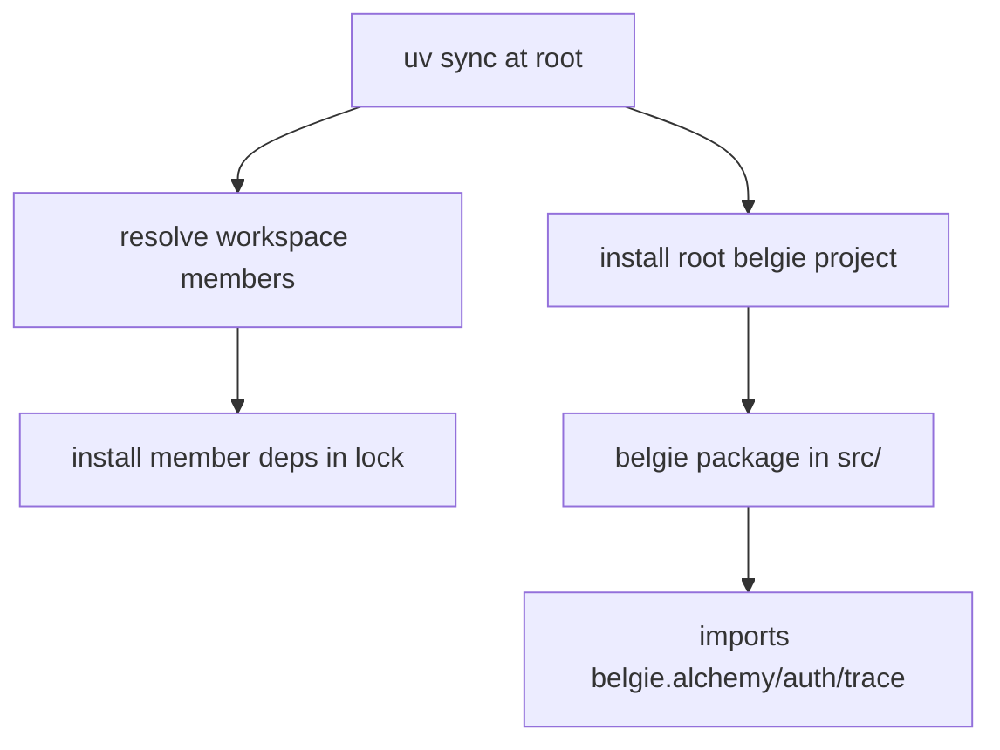
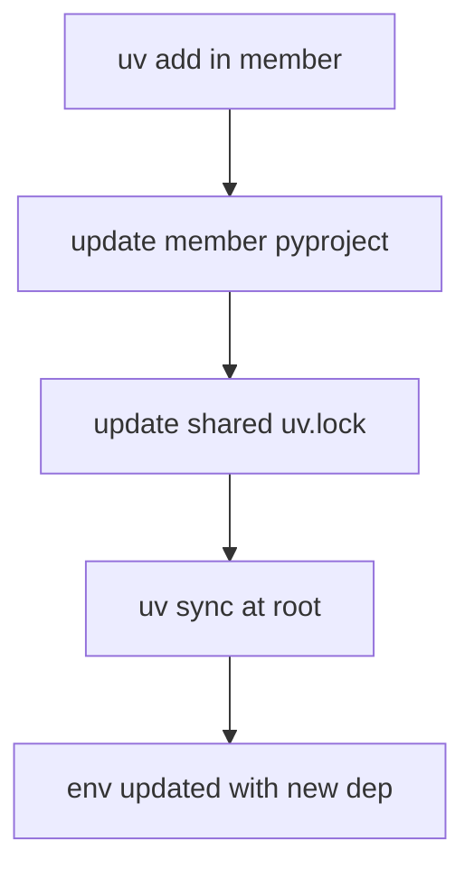
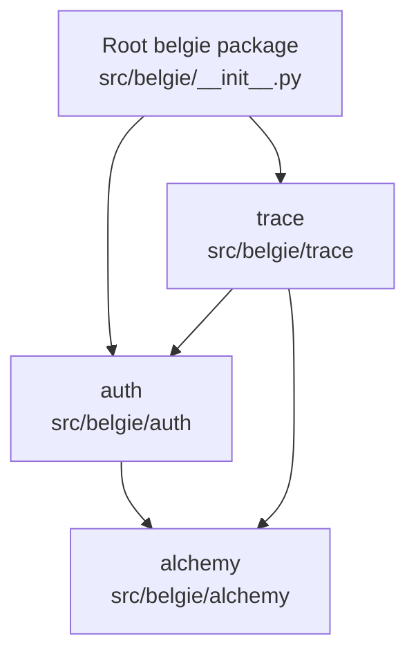

# Design Document: Uv Workspaces For Alchemy/Auth/Trace

## Overview

### High-Level Description

This change reorganizes the belgie monorepo into a uv workspace with three member projects: `alchemy`, `auth`, and
`trace`, corresponding to the existing top‑level folders under `src/belgie/`. The goal is to let us manage dependencies
and development flows per module while keeping the current public Python package layout (`belgie.*`) and import paths
intact. The root `belgie` project remains the only publishable artifact, and exposes optional extras that pull in the
workspace members (e.g., `belgie[auth]`, `belgie[trace]`).

Because `belgie` is currently a regular (non‑namespace) package with a single `src/belgie/__init__.py`, splitting into
separately publishable wheels that all provide `belgie/*` would cause package overlap. Therefore, the proposed workspace
design treats members primarily as dependency and development units, not independent distributions, and keeps the root
project as the only publishable library.

### Goals

- Introduce a uv workspace with three member projects: `alchemy`, `auth`, `trace`.
- Isolate and document dependencies for each member, reflecting current module boundaries.
- Provide root optional extras for module installs.
- Preserve all existing import paths (`from belgie.auth ...`, etc.) and public API behavior.
- Keep `uv.lock` shared at the workspace root and support `uv sync`/`uv add` flows.
- Avoid large refactors (renaming packages, removing `belgie/__init__.py`, etc.).

### Non-Goals

- Publishing `alchemy`, `auth`, or `trace` as separate installable packages on PyPI.
- Changing the Python package namespace or moving files out of `src/belgie/`.
- Reworking tests or runtime behavior beyond what’s required for workspace wiring.

## Workflows

### Workflow 1: Installing And Developing The Whole Repo (Current Default)

#### Description

Developer installs the root project and gets all three modules together, as today.

#### Usage Example

```bash
uv sync
uv run pytest
```

#### Call Graph



#### Key Components

- **Workspace Root** (`pyproject.toml:[tool.uv.workspace]`) - Declares workspace members.
- **Root Project** (`pyproject.toml:[project]`) - Only publishable library, owns `belgie` package.
- **Member Projects** (`src/belgie/*/pyproject.toml`) - Define per‑module dependencies.

### Workflow 2: Adding A Dependency To A Single Module

#### Description

Developer adds a dependency scoped to one module by running `uv add` inside that member directory. The lock remains
shared at root.

#### Usage Example

```bash
cd src/belgie/auth
uv add "some-auth-lib>=1.2"
cd ../../..
uv sync
```

#### Call Graph



#### Key Components

- **Member `pyproject.toml`** - Owns the dependency declaration.
- **Shared `uv.lock`** - Single resolution source of truth.

## Dependencies

Current import‑based relationships:



Workspace dependency declarations should mirror these edges:

- `auth` depends on `alchemy` (workspace source).
- `trace` depends on both `auth` and `alchemy` (workspace sources).
- Root `belgie` depends on all three (workspace sources), with `auth`/`trace` optionally exposed via extras.

## Detailed Design

### Module Structure

```text
pyproject.toml                 # workspace root + publishable belgie project
uv.lock
src/
  belgie/
    __init__.py                # unchanged, continues to re-export auth/trace
    alchemy/
      pyproject.toml           # NEW member project
      *.py
    auth/
      pyproject.toml           # NEW member project
      **/*.py
    trace/
      pyproject.toml           # NEW member project
      **/*.py
__tests__/                      # unchanged
```

### API / Config Design

#### Workspace root `pyproject.toml` (additions)

```toml
[tool.uv.workspace]
members = [
  "src/belgie/alchemy",
  "src/belgie/auth",
  "src/belgie/trace",
]

[tool.uv.sources]
alchemy = { workspace = true }
auth = { workspace = true }
trace = { workspace = true }
```

Root `[project]` stays named `belgie` and continues to include the full `src/belgie` package. Root dependencies should
be slimmed to the true shared baseline, while module‑specific deps move to members.

#### Member `src/belgie/alchemy/pyproject.toml`

```toml
[project]
name = "alchemy"
version = "0.1.0"
requires-python = ">=3.12,<3.15"
dependencies = [
  "sqlalchemy[asyncio]>=2.0",
  "pydantic>=2.0",
  "pydantic-settings>=2.0",
]

[build-system]
requires = ["uv_build>=0.9.10,<0.10.0"]
build-backend = "uv_build"

# NOTE: During implementation we will configure uv_build to avoid producing
# a wheel that overlaps the root belgie package, or mark this project as
# non-publishable. Exact config depends on uv_build’s supported fields.
```

#### Member `src/belgie/auth/pyproject.toml`

```toml
[project]
name = "auth"
version = "0.1.0"
requires-python = ">=3.12,<3.15"
dependencies = [
  "fastapi>=0.100",
  "httpx>=0.24",
  "python-multipart>=0.0.20",
  "alchemy",
]

[tool.uv.sources]
alchemy = { workspace = true }
```

#### Member `src/belgie/trace/pyproject.toml`

```toml
[project]
name = "trace"
version = "0.1.0"
requires-python = ">=3.12,<3.15"
dependencies = [
  "httpx>=0.24",
  "pydantic>=2.0",
  "pydantic-settings>=2.0",
  "alchemy",
  "auth",
]

[tool.uv.sources]
alchemy = { workspace = true }
auth = { workspace = true }
```

### Testing Strategy

- Keep tests in `__tests__/` as-is and continue running from the root with `uv run pytest`.
- Ensure root environment includes all member deps via workspace resolution.
- Add/adjust tests only if workspace wiring changes import timing or optional‑dependency behavior.

## Implementation

### Implementation Order

1. Add workspace declaration to root `pyproject.toml`.
2. Create `pyproject.toml` files for `alchemy`, `auth`, and `trace` members with scoped dependencies.
3. Move root dependencies and optional dependency groups into the appropriate member projects, leaving only truly shared
   deps at root.
4. Add `tool.uv.sources` workspace entries and member cross‑deps.
5. Add root optional extras that depend on the member projects (e.g., `auth = ["auth"]`, `trace = ["trace"]`,
   `alchemy = ["alchemy"]`, `full = ["alchemy", "auth", "trace"]`).
6. Verify `uv sync`, `uv run pytest`, and `uv run ruff check` still work from the root.

### Tasks

- [ ] Add `[tool.uv.workspace]` to root `pyproject.toml`.
- [ ] Add member `pyproject.toml` files in `src/belgie/alchemy`, `src/belgie/auth`, `src/belgie/trace`.
- [ ] Reallocate dependencies and optional dependency groups from root to members.
- [ ] Add workspace cross‑dependency wiring (`auth -> alchemy`, `trace -> auth, alchemy`).
- [ ] Add root extras that pull in members (`belgie[alchemy]`, `belgie[auth]`, `belgie[trace]`, `belgie[full]`).
- [ ] Validate local dev flows: `uv sync`, `uv add` in members, root test/lint/typecheck.
- [ ] Update docs/README with new workspace usage (if needed).

## Open Questions

1. Root extras will be named `alchemy`, `auth`, `trace`, and `full`.
2. Extras are transitive where required by module dependencies (e.g., `trace` implies `auth` and `alchemy`).

## Future Enhancements

- Introduce CI jobs that run targeted checks per workspace member.
- Add per‑member integration test entrypoints if they grow more independent.

## Libraries

No new libraries required.

## Alternative Approaches

### Approach 1: Publish Three Separate Wheels Under `belgie.*`

**Description**: Make `alchemy`, `auth`, and `trace` separately publishable, each providing a slice of the `belgie`
namespace.

**Pros**:

- True modular installation for downstream users.
- Clear ownership of runtime deps per module.

**Cons**:

- Not compatible with current `belgie/__init__.py` regular package.
- Requires namespace‑package refactor and public API changes.

**Why not chosen**: High‑impact refactor not requested; breaks current imports.

### Approach 2: Keep Single Project, Use Dependency Groups Only

**Description**: Avoid uv workspaces and instead model per‑module deps via `[project.optional-dependencies]` or
`[dependency-groups]`.

**Pros**:

- No workspace complexity.
- Zero risk of packaging overlap.

**Cons**:

- Harder to enforce module boundaries.
- `uv add` does not naturally target a module boundary.

**Why not chosen**: You explicitly asked to break into uv workspaces.
