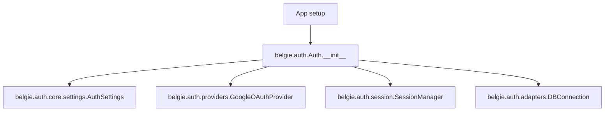
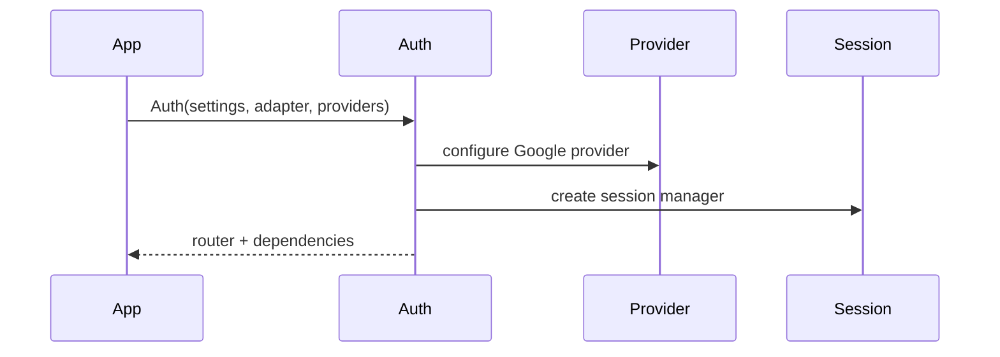
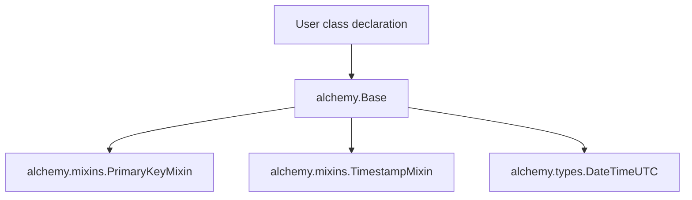
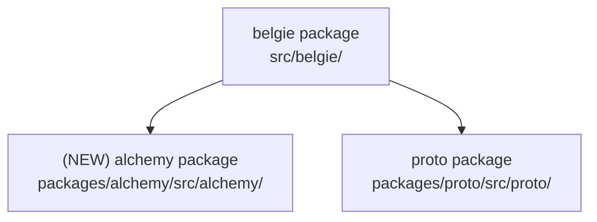

# Design Document: Auth Core + Alchemy Package Swap

## Overview

### High-Level Description

Move the authentication implementation into the core belgie package and promote the current belgie alchemy module into
its own standalone workspace package. Concretely:

- Move `packages/auth/src/auth` into `src/belgie/auth` and update imports to `belgie.auth.*`.
- Create a new workspace package `packages/alchemy` whose `src/alchemy` contains the current
  `src/belgie/alchemy` code and update imports to `alchemy.*`.

This reorients the project so auth is a first-class module of belgie, while alchemy is independently consumable.

### Goals

- Auth code is owned by `src/belgie/auth` and imported via `belgie.auth`.
- Alchemy code is owned by `packages/alchemy/src/alchemy` and imported via `alchemy`.
- Root project dependencies and workspace membership reflect the new packages.
- Tests and examples are updated to use new import paths.

### Non-Goals

- No behavioral changes to auth or alchemy functionality.
- No compatibility shims for the removed `auth` package.
- No new dependencies or API changes beyond import paths and layout.

## Workflows

### Workflow 1: Use Core Auth From Belgie

#### Description

Application code imports auth types and helpers directly from `belgie.auth`. The behavior matches the existing `auth`
package, but the module lives in `src/belgie/auth`.

#### Usage Example

```python
from belgie.auth import Auth, AuthSettings, GoogleProviderSettings
from alchemy import AlchemyAdapter

adapter = AlchemyAdapter(...)
auth = Auth(settings=AuthSettings(), adapter=adapter, providers={
    "google": GoogleProviderSettings(
        client_id="...",
        client_secret="...",
        redirect_uri="http://localhost:8000/auth/provider/google/callback",
    ),
})

app.include_router(auth.router)
```

#### Call Graph



#### Sequence Diagram



#### Key Components

- **Auth entry** (`src/belgie/auth/__init__.py`) - Public surface for `belgie.auth`.
- **Core auth** (`src/belgie/auth/core/auth.py`) - Auth orchestration, router, user/session helpers.
- **Providers** (`src/belgie/auth/providers/`) - OAuth providers and provider protocols.
- **Session manager** (`src/belgie/auth/session/manager.py`) - Session create/get/delete.

### Workflow 2: Use Alchemy As A Standalone Package

#### Description

Application code imports alchemy building blocks from the new standalone `alchemy` package. The public API mirrors the
previous `belgie.alchemy` module.

#### Usage Example

```python
from alchemy import Base, PrimaryKeyMixin, TimestampMixin
from sqlalchemy.orm import Mapped, mapped_column

class User(Base, PrimaryKeyMixin, TimestampMixin):
    __tablename__ = "users"
    email: Mapped[str] = mapped_column(unique=True, index=True)
```

#### Call Graph



#### Key Components

- **Base** (`packages/alchemy/src/alchemy/base.py`) - Declarative base and metadata config.
- **Mixins** (`packages/alchemy/src/alchemy/mixins.py`) - Primary key, timestamp helpers.
- **Types** (`packages/alchemy/src/alchemy/types.py`) - Reusable SQLAlchemy type decorators.

## Dependencies



## Detailed Design

### Module Structure

```text
packages/
├── alchemy/
│   ├── pyproject.toml
│   ├── README.md
│   └── src/alchemy/
│       ├── __init__.py
│       ├── adapter.py
│       ├── base.py
│       ├── mixins.py
│       ├── settings.py
│       ├── types.py
│       └── py.typed
src/belgie/
├── auth/
│   ├── __init__.py
│   ├── adapters/
│   ├── core/
│   ├── providers/
│   ├── session/
│   └── utils/
├── __init__.py
└── proto.py
examples/
├── auth/
└── alchemy/
```

### API Design

#### `src/belgie/auth/__init__.py`

Public re-exports for the auth surface previously provided by the `auth` package.

```python
from belgie.auth.core.auth import Auth
from belgie.auth.core.client import AuthClient
from belgie.auth.core.exceptions import (
    AuthenticationError,
    AuthorizationError,
    BelgieError,
    ConfigurationError,
    InvalidStateError,
    OAuthError,
    SessionExpiredError,
)
from belgie.auth.core.hooks import HookContext, HookEvent, HookRunner, Hooks
from belgie.auth.core.settings import AuthSettings, CookieSettings, SessionSettings, URLSettings
from belgie.auth.providers import OAuthProviderProtocol, Providers
from belgie.auth.providers.google import GoogleOAuthProvider, GoogleProviderSettings, GoogleUserInfo
from belgie.auth.session.manager import SessionManager
from belgie.auth.utils.crypto import generate_session_id, generate_state_token
from belgie.auth.utils.scopes import parse_scopes, validate_scopes
```

#### `packages/alchemy/src/alchemy/__init__.py`

Public re-exports for the alchemy surface previously provided by `belgie.alchemy`.

```python
from alchemy.adapter import AlchemyAdapter
from alchemy.base import Base
from alchemy.mixins import PrimaryKeyMixin, TimestampMixin
from alchemy.settings import DatabaseSettings
from alchemy.types import DateTimeUTC
```

#### `src/belgie/__init__.py`

Root package re-exports should follow the new module layout.

```python
from belgie.auth import Auth, AuthClient, AuthSettings
from alchemy import AlchemyAdapter
```

## Testing Strategy

- **Auth unit tests**: move `packages/auth/tests` into `src/belgie/__test__/auth` (or `tests/auth` if repo prefers)
  and update all imports to `belgie.auth.*`.
- **Auth integration tests**: continue to run at the same scope; ensure router and dependencies operate as before.
- **Alchemy import tests**: add smoke tests that import `alchemy` public symbols and create a simple Base model.
- **Examples validation**: update `examples/auth` and `examples/alchemy` imports to validate docs and examples.

## Implementation

### Implementation Order

1. Create `packages/alchemy` package structure and move `src/belgie/alchemy` into it.
2. Move `packages/auth/src/auth` into `src/belgie/auth` and update imports.
3. Update root `pyproject.toml` workspace members and dependencies.
4. Update `src/belgie/__init__.py` re-exports for auth and alchemy.
5. Move and update tests.
6. Update README and examples.

### Tasks

- [ ] Create `packages/alchemy` with `pyproject.toml`, `README.md`, and `src/alchemy`.
- [ ] Move `src/belgie/alchemy/*` to `packages/alchemy/src/alchemy/*`.
- [ ] Move `packages/auth/src/auth/*` to `src/belgie/auth/*`.
- [ ] Update imports across repo to `belgie.auth.*` and `alchemy.*`.
- [ ] Update `pyproject.toml` dependencies and workspace members.
- [ ] Move and update tests to match new module paths.
- [ ] Update examples and README usage snippets.

## Open Questions

None.

## Future Enhancements

- Consider adding an optional compatibility shim for legacy `auth` imports if external users are impacted.
- Consider adding a `belgie.alchemy` shim if downstream code expects the old path.

## Libraries

### New Libraries

None.

### Existing Libraries

| Library | Current Version | Purpose | Dependency Group |
|---------|-----------------|---------|------------------|
| `sqlalchemy` | `>=2.0` | ORM base for alchemy helpers | core |
| `fastapi` | `>=0.100` | Auth router and dependencies | core |

## Alternative Approaches

### Approach 1: Keep Auth As A Separate Package

**Description**: Keep `packages/auth` as-is, re-export from `belgie.auth`.

**Pros**:

- Minimal changes to existing package structure.
- External users keep `auth` imports.

**Cons**:

- Auth is not truly part of core belgie implementation.
- Duplicate public surfaces (`auth` and `belgie.auth`).

**Why not chosen**: The request explicitly moves auth into `src/belgie` and removes the standalone package.

### Approach 2: Keep Alchemy In Belgie

**Description**: Leave `src/belgie/alchemy` in place and add a thin `alchemy` wrapper package.

**Pros**:

- Minimal code movement.
- Avoids updating internal imports.

**Cons**:

- Two sources of truth for the same module.
- Still ties alchemy to belgie internals.

**Why not chosen**: The request is to make alchemy a real package, not a wrapper.
