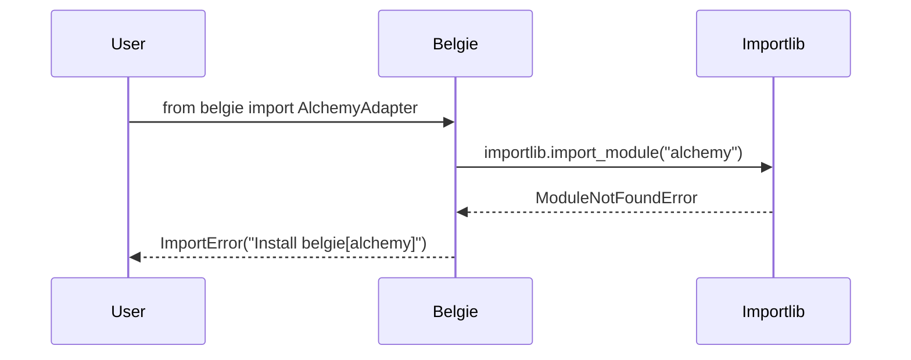
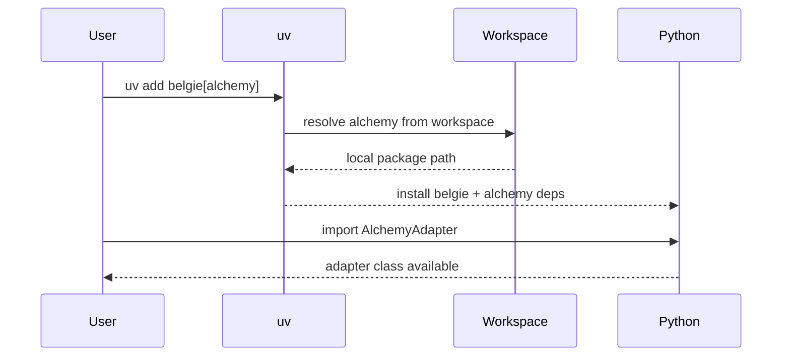
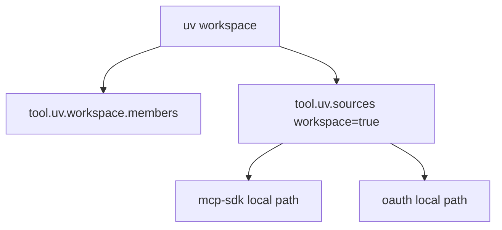
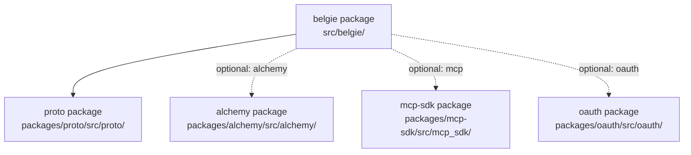

# Design Document: Optional Workspace Extras For Belgie

## Overview

### High-Level Description

Make the `mcp`, `alchemy`, and `oauth` workspace packages optional `uv` extras for the root `belgie` package. Base
installs (`uv add belgie`) will only pull core auth and proto dependencies, while extras like
`uv add belgie[alchemy,mcp,oauth]` will include the relevant workspace packages. An `all` extra will aggregate these
three extras. `AlchemyAdapter` will remain part of the public surface, but will raise a clear error when accessed
without the `alchemy` extra.

### Goals

- Add `mcp`, `alchemy`, and `oauth` extras in `pyproject.toml` under `[project.optional-dependencies]`.
- Add an `all` extra that installs `mcp`, `alchemy`, and `oauth` together.
- Remove `alchemy` (and its `sqlalchemy` dependency) from the base `belgie` dependency list.
- Ensure workspace extras resolve to local workspace packages using `tool.uv.sources`.
- Provide a clear, user-facing error when `AlchemyAdapter` is accessed without the `alchemy` extra.
- Update installation docs to show optional extras.

### Non-Goals

- No new runtime behavior in `alchemy`, `mcp-sdk`, or `oauth` packages.
- No dependency upgrades or version pin changes beyond moving dependencies to extras.
- No changes to package names or workspace layout.
- No new public API surface beyond optional import behavior for existing exports.

## Workflows

### Workflow 1: Base Install Without Extras

#### Description

User installs `belgie` without any extras and uses core auth features. Accessing `AlchemyAdapter` without the
`alchemy` extra produces a clear ImportError with installation guidance.

#### Usage Example

```python
from belgie import Auth, AuthSettings

settings = AuthSettings(
    secret="dev-secret",
    base_url="http://localhost:8000",
)

# Core auth usage does not require alchemy or sqlalchemy.
auth = Auth(settings=settings, adapter=None, providers={})
```

#### Call Graph

```mermaid
graph TD
    A[User Code] --> B[belgie.auth.Auth]
    B --> C[proto protocols]
    A --> D[belgie.__getattr__(AlchemyAdapter)]
    D --> E[ImportError with install hint]
```

#### Sequence Diagram



#### Key Components

- **Root dependencies** (`pyproject.toml`) - Remove `alchemy` and `sqlalchemy` from base deps.
- **Optional import** (`src/belgie/__init__.py`) - Provide lazy import and clear error message.

### Workflow 2: Install With Extras

#### Description

User installs `belgie` with one or more extras, enabling access to the corresponding workspace packages.

#### Usage Example

```python
from belgie import Auth, AuthSettings
from alchemy import AlchemyAdapter
from mcp_sdk.verifier import SimpleTokenVerifier
from oauth import OAuthPlugin

settings = AuthSettings(secret="dev-secret", base_url="http://localhost:8000")

adapter = AlchemyAdapter(
    user=...,
    account=...,
    session=...,
    oauth_state=...,
)

_ = SimpleTokenVerifier()
_ = mcp_auth
```

#### Call Graph

```mermaid
graph TD
    A[uv add belgie[alchemy,mcp,oauth]] --> B[optional deps]
    B --> C[alchemy workspace package]
    B --> D[mcp-sdk workspace package]
    B --> E[oauth workspace package]
    C --> F[sqlalchemy[asyncio]]
    D --> G[mcp]
```

#### Sequence Diagram



#### Key Components

- **Optional extras** (`pyproject.toml`) - `alchemy`, `mcp`, `oauth`, and `all` extras.
- **Workspace resolution** (`tool.uv.sources`) - Map extras to workspace packages in dev.

### Workflow 3: Workspace Development Resolution

#### Description

When developing inside the repo, `uv` resolves extras to the local workspace packages defined in
`tool.uv.workspace.members` and `tool.uv.sources`.

#### Usage Example

```python
from mcp_sdk.verifier import SimpleTokenVerifier
from oauth import OAuthPlugin

_ = SimpleTokenVerifier()
_ = mcp_auth
```

#### Call Graph



#### Key Components

- **Workspace members** (`pyproject.toml`) - Already includes `packages/mcp-sdk` and `packages/oauth`.
- **Workspace sources** (`pyproject.toml`) - Add `mcp-sdk` and `oauth` entries.

## Dependencies



## Detailed Design

### Module Structure

```text
pyproject.toml                         # Root deps + optional extras + workspace sources
src/belgie/__init__.py                 # Optional import for AlchemyAdapter
README.md                              # Installation snippets updated for extras
docs/quickstart.md                     # Installation snippets updated for extras
__tests__/test_optional_extras.py      # Optional import behavior tests
```

### API Design

#### `pyproject.toml`

Root dependency list will drop `alchemy` and `sqlalchemy[asyncio]`, and optional extras will be defined to install
workspace packages.

```toml
[project]
name = "belgie"
requires-python = ">=3.12,<3.15"
dependencies = [
    "proto",
    "fastapi>=0.100",
    "httpx>=0.24",
    "pydantic>=2.0",
    "pydantic-settings>=2.0",
    "python-multipart>=0.0.20",
]

[project.optional-dependencies]
alchemy = ["alchemy"]
mcp = ["mcp-sdk"]
oauth = ["oauth"]
all = ["alchemy", "mcp-sdk", "oauth"]

[tool.uv.sources]
alchemy = { workspace = true }
proto = { workspace = true }
mcp-sdk = { workspace = true }
oauth = { workspace = true }
```

#### `src/belgie/__init__.py`

Expose `AlchemyAdapter` lazily and raise a clear message when missing.

```python
from importlib import import_module

# Existing exports remain unchanged.

# Optional export for alchemy

def __getattr__(name: str):
    if name != "AlchemyAdapter":
        msg = f"module 'belgie' has no attribute {name!r}"
        raise AttributeError(msg)

    try:
        module = import_module("alchemy")
    except ModuleNotFoundError as exc:
        raise ImportError(
            "AlchemyAdapter requires the 'alchemy' extra. "
            "Install with: uv add belgie[alchemy]"
        ) from exc

    return getattr(module, "AlchemyAdapter")
```

## Testing Strategy

- **Optional import error** (`__tests__/test_optional_extras.py`)
  - Monkeypatch `importlib.import_module` to raise `ModuleNotFoundError` for "alchemy".
  - Assert `from belgie import AlchemyAdapter` raises ImportError with install hint.
- **Optional import success** (`__tests__/test_optional_extras.py`)
  - Ensure `from belgie import AlchemyAdapter` resolves when `alchemy` is available.
- **Doc install snippets**
  - Manual check: `uv add belgie` does not pull `sqlalchemy`.
  - Manual check: `uv add belgie[alchemy]` pulls `alchemy` and `sqlalchemy[asyncio]`.
  - Manual check: `uv add belgie[all]` pulls all three extras.

## Implementation

### Implementation Order

1. Update `pyproject.toml` dependencies, optional extras, and `tool.uv.sources` entries.
2. Add optional import handler for `AlchemyAdapter` in `src/belgie/__init__.py`.
3. Update docs (`README.md`, `docs/quickstart.md`) with new install commands.
4. Add tests for optional import behavior.

### Tasks

- [ ] Remove `alchemy` and `sqlalchemy[asyncio]` from `[project.dependencies]` in `pyproject.toml`.
- [ ] Add extras for `alchemy`, `mcp`, `oauth`, and `all` to `[project.optional-dependencies]`.
- [ ] Add `mcp-sdk` and `oauth` to `[tool.uv.sources]` with `workspace = true`.
- [ ] Add lazy import handling for `AlchemyAdapter` in `src/belgie/__init__.py`.
- [ ] Update install snippets in `README.md` and `docs/quickstart.md`.
- [ ] Add tests covering missing and present `alchemy` extra scenarios.

## Open Questions

None.

## Future Enhancements

- Add a dedicated docs page for optional extras and workspace usage patterns.
- Add automated CI check for extras resolution using `uv lock` on minimal and `all` configs.

## Libraries

### New Libraries

None.

### Existing Libraries

| Library | Current Version | Purpose | Dependency Group |
|---------|-----------------|---------|------------------|
| `fastapi` | `>=0.100` | Core auth router and dependencies | core |
| `pydantic` | `>=2.0` | Settings and schema validation | core |
| `sqlalchemy` | `>=2.0` | ORM base for alchemy adapter | alchemy extra |
| `mcp` | `>=1.26.0` | MCP server dependencies | mcp extra |

## Alternative Approaches

### Approach 1: Keep Alchemy In Core

**Description**: Keep `alchemy` and `sqlalchemy` in the base dependency list and only add `mcp` and `oauth` extras.

**Pros**:

- No change in behavior for current users that rely on `AlchemyAdapter` imports.
- No optional import logic needed in `belgie.__init__`.

**Cons**:

- Base install remains heavier, always pulling SQLAlchemy.
- Users not using the alchemy adapter still pay the dependency cost.

**Why not chosen**: The goal is to make `alchemy` optional to keep base installs minimal.

### Approach 2: Separate Distribution Packages

**Description**: Publish `belgie-alchemy`, `belgie-mcp`, and `belgie-oauth` as separate distributions and keep `belgie`
lean with no extras.

**Pros**:

- Clear separation of concerns and smaller base package.
- Extras semantics are avoided entirely.

**Cons**:

- Requires new packages and release workflows.
- More complicated installation and documentation for users.

**Why not chosen**: Extras are simpler and already supported by the existing workspace and `uv` setup.
