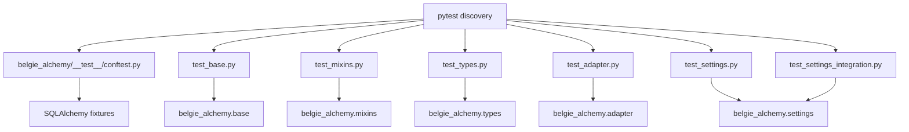
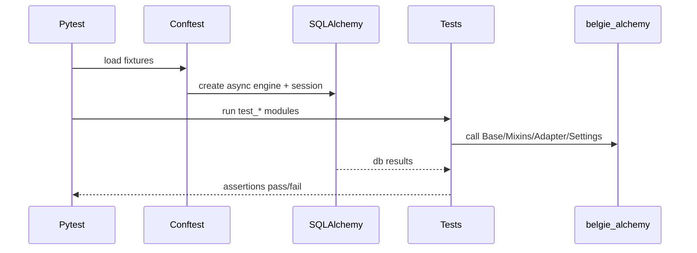
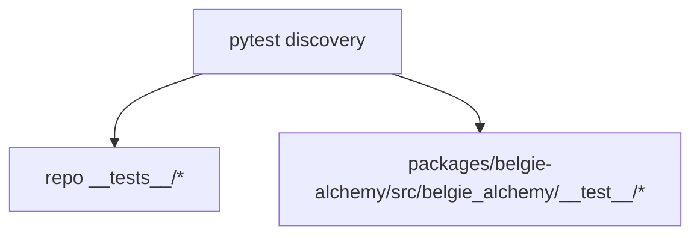
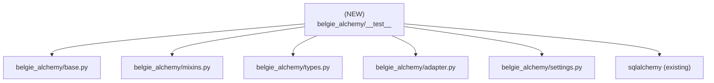

# Design Document: Alchemy Test Relocation

## Overview

### High-Level Description

Relocate the SQLAlchemy/alchemy-focused tests from the repo root `__tests__/alchemy/` into the
`belgie-alchemy` package under `packages/belgie-alchemy/src/belgie_alchemy/__test__/`, while mirroring
the alchemy module structure. This makes the tests colocated with the package they validate, removes
the dependency on root `__tests__`, and keeps behavior identical. The change is test-only: no
production code or APIs are modified.

### Goals

- Move all `__tests__/alchemy/*` tests into `belgie_alchemy/__test__/` with a clear, module-mirrored layout.
- Keep test behavior, fixtures, and markers unchanged; only paths and imports change.
- Ensure `pytest` still discovers and runs the alchemy tests from repo root.
- Align lint ignores with the new `__test__` path to preserve current test lint rules.

### Non-Goals

- No changes to production code in `belgie_alchemy`.
- No changes to non-alchemy tests under `__tests__/`.
- No changes to test semantics, assertions, or data setup beyond import path updates.

## Workflows

### Workflow 1: Run Alchemy Tests in the Package

#### Description

Developers run the alchemy test suite directly from the `belgie-alchemy` package path. Pytest discovers
tests under `belgie_alchemy/__test__`, loads fixtures from `conftest.py`, and executes the module tests
against the alchemy implementation in the same package.

#### Usage Example

```python
# CLI example (pytest invocation)
# uv run pytest packages/belgie-alchemy/src/belgie_alchemy/__test__
```

#### Call Graph



#### Sequence Diagram



#### Key Components

- **Fixtures** (`belgie_alchemy/__test__/conftest.py`) - async engine/session + concrete test models.
- **Base tests** (`belgie_alchemy/__test__/base/test_base.py`) - type annotation map + naming convention checks.
- **Types tests** (`belgie_alchemy/__test__/types/test_types.py`) - `DateTimeUTC` conversions and round-trips.
- **Mixins tests** (`belgie_alchemy/__test__/mixins/test_mixins.py`) - primary key + timestamps behavior.
- **Adapter tests** (`belgie_alchemy/__test__/adapter/test_adapter.py`) - `AlchemyAdapter` CRUD behaviors.
- **Settings tests** (`belgie_alchemy/__test__/settings/test_settings*.py`) - env-driven config + integration.

### Workflow 2: Run Full Repo Tests

#### Description

Developers run the full repository test suite from the repo root. Pytest should still discover the
alchemy tests under the package `src` tree and run them alongside other suites without requiring a
separate path configuration.

#### Usage Example

```python
# CLI example (pytest invocation)
# uv run pytest
```

#### Call Graph



#### Key Components

- **Pytest discovery** (default `test_*.py` patterns) - no special configuration required.
- **Ruff ignores** (`pyproject.toml`) - add `**/__test__/**` to maintain test lint policy.

## Dependencies



## Detailed Design

### Module Structure

```text
packages/belgie-alchemy/src/belgie_alchemy/
├── __init__.py
├── adapter.py
├── base.py
├── mixins.py
├── settings.py
├── types.py
└── __test__/
    ├── __init__.py
    ├── conftest.py
    ├── adapter/
    │   ├── __init__.py
    │   └── test_adapter.py
    ├── auth_models/
    │   ├── __init__.py
    │   └── test_auth_models.py
    ├── base/
    │   ├── __init__.py
    │   └── test_base.py
    ├── mixins/
    │   ├── __init__.py
    │   └── test_mixins.py
    ├── settings/
    │   ├── __init__.py
    │   ├── test_settings.py
    │   └── test_settings_integration.py
    └── types/
        ├── __init__.py
        └── test_types.py
```

### API Design

#### `packages/belgie-alchemy/src/belgie_alchemy/__test__/conftest.py`

Shared fixtures and test model definitions. Tests import fixtures and models from this module.

```python
from collections.abc import AsyncGenerator

import pytest_asyncio
from sqlalchemy.ext.asyncio import AsyncEngine, AsyncSession, async_sessionmaker

# Test models: User, Account, Session, OAuthState (Base + mixins)

@pytest_asyncio.fixture
async def alchemy_engine() -> AsyncGenerator[AsyncEngine, None]: ...
# 1. Create in-memory SQLite async engine
# 2. Enable foreign keys on connect
# 3. Create tables from Base.metadata
# 4. Yield engine, then dispose

@pytest_asyncio.fixture
async def alchemy_session_factory(...) -> async_sessionmaker[AsyncSession]: ...
# 1. Bind to alchemy_engine
# 2. Disable expire_on_commit

@pytest_asyncio.fixture
async def alchemy_session(...) -> AsyncGenerator[AsyncSession, None]: ...
# 1. Yield a session from factory

__all__ = ["Account", "OAuthState", "Session", "User", "alchemy_engine", "alchemy_session", "alchemy_session_factory"]
```

#### `packages/belgie-alchemy/src/belgie_alchemy/__test__/base/test_base.py`

```python
from belgie_alchemy.base import Base, NAMING_CONVENTION
from belgie_alchemy.types import DateTimeUTC
from belgie_alchemy.__test__.conftest import User

def test_type_annotation_map_uses_datetimeutc() -> None: ...
def test_naming_convention_applied() -> None: ...
def test_dataclass_kw_only_init() -> None: ...
```

#### `packages/belgie-alchemy/src/belgie_alchemy/__test__/settings/test_settings*.py`

```python
from belgie_alchemy.settings import DatabaseSettings

# Includes unit tests + integration tests using env vars and optional POSTGRES_TEST_URL.
```

## Testing Strategy

- **Unit tests by module**
  - `base/`: `type_annotation_map`, naming conventions, dataclass init.
  - `mixins/`: PK defaults, timestamp behaviors, UUID persistence.
  - `types/`: `DateTimeUTC` conversions, naive/aware handling, errors.
  - `adapter/`: CRUD + delete flows on `AlchemyAdapter`.
  - `settings/`: SQLite defaults, env parsing, engine/session maker setup.
- **Integration coverage**
  - `settings/test_settings_integration.py` remains `@pytest.mark.integration` and preserves env-driven tests.
  - Postgres tests continue to skip when `asyncpg` or `POSTGRES_TEST_URL` are missing.
- **Discovery**
  - Verify `pytest` finds `belgie_alchemy/__test__/test_*.py` from repo root and package path.
- **Edge cases**
  - Confirm foreign key enforcement for SQLite when enabled.
  - Validate error handling for invalid env configurations.

## Implementation

### Implementation Order

1. Create `belgie_alchemy/__test__/` + subpackage directories and `__init__.py` files.
2. Move each `__tests__/alchemy/test_*.py` into its mapped subfolder.
3. Update imports to `belgie_alchemy.__test__.conftest`.
4. Extend ruff per-file ignores to include `**/__test__/**`.
5. Remove `__tests__/alchemy/` and verify no references remain.

### Tasks

- [ ] Add `packages/belgie-alchemy/src/belgie_alchemy/__test__/` skeleton with subpackages.
- [ ] Move test files into module-mirrored subfolders.
- [ ] Update test imports to new fixture paths.
- [ ] Add ruff per-file ignore for `**/__test__/**` in `pyproject.toml`.
- [ ] Delete `__tests__/alchemy` and confirm test discovery.

## Open Questions

- None.

## Future Enhancements

- Consolidate shared test helpers across packages if more package-local test suites are added.

## Libraries

### New Libraries

None.

### Existing Libraries

| Library | Current Version | Purpose | Dependency Group |
|---------|-----------------|---------|------------------|
| `pytest` | `>=9.0.1` | test runner | `dev` |
| `pytest-asyncio` | `>=1.3.0` | async fixtures/tests | `dev` |
| `aiosqlite` | `>=0.21.0` | SQLite async driver | `dev` |
| `sqlalchemy[asyncio]` | `>=2.0` | ORM + async engine | `belgie-alchemy` |

## Alternative Approaches

### Approach 1: Keep Tests Under Root `__tests__/alchemy`

**Description**: Leave alchemy tests at repo root and treat them as a top-level suite.

**Pros**:

- No changes to test paths or imports.
- Centralized test discovery.

**Cons**:

- Tests are not colocated with the package they validate.
- Root `__tests__` retains alchemy-specific concerns.

**Why not chosen**: Goal is to eliminate root `__tests__/alchemy` dependency and colocate tests with `belgie-alchemy`.

### Approach 2: Place Tests in `packages/belgie-alchemy/__tests__/`

**Description**: Put tests at the package root instead of within `src/belgie_alchemy/`.

**Pros**:

- Familiar `__tests__` pattern for some contributors.

**Cons**:

- Less aligned with module mirroring.
- Tests are not within the package import namespace (`belgie_alchemy.__test__`).

**Why not chosen**: Requested destination is a `__test__` folder inside the `belgie_alchemy` package.
