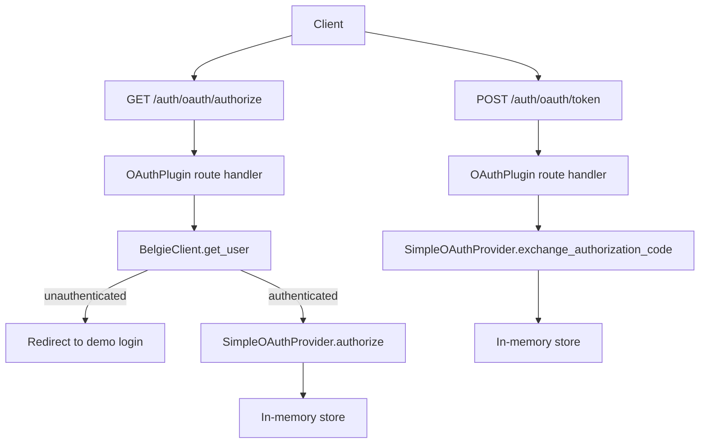
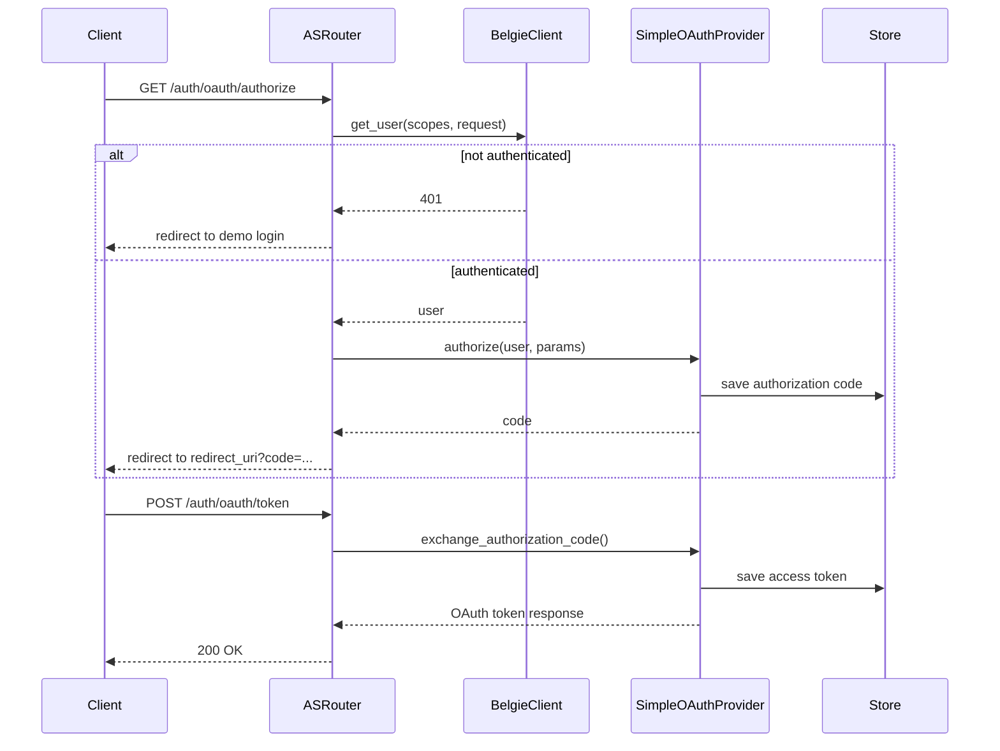
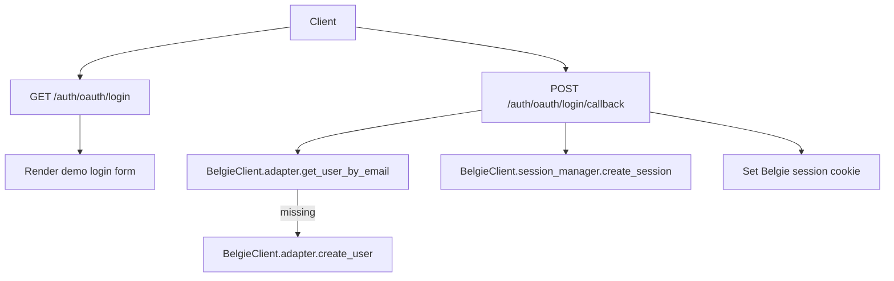
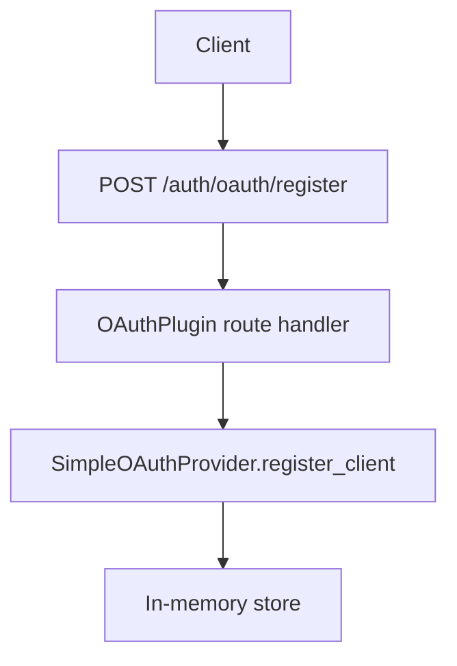
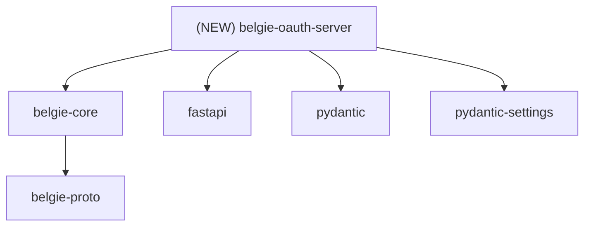

# Design Document: belgie-oauth-server Authorization Server

## Overview

### High-Level Description

Introduce a new workspace package, `belgie-oauth-server`, that provides an OAuth 2.1 Authorization Server (AS) for
FastAPI and integrates with the **existing Belgie plugin system** in `belgie-core`. The plugin is registered via
`Belgie.add_plugin(...)` and exposes AS endpoints through the Belgie router. The OAuth AS relies on
`belgie_core.core.client.BelgieClient` and `belgie_core.core.belgie.Belgie` for user/session operations so user identity
and session lifecycle are **not re-implemented** inside `belgie-oauth-server`.

OAuth settings are moved **out of `belgie-proto`** and live in `belgie-oauth-server` to keep configuration co-located
with the feature. OAuth logic and in-memory storage live in `SimpleOAuthProvider`; only the plugin and settings are
public. Client registrations are stored in memory by default; production deployments should replace or extend the
provider with persistent storage.

### Goals

- Provide a FastAPI router implementing OAuth AS endpoints with a configurable path prefix via a Belgie plugin.
- Use `BelgieClient` and `Belgie` for all user/session operations: current user lookup, user creation, session creation,
  and hooks.
- Relocate OAuth settings from `belgie-proto` into `belgie-oauth-server` and keep them private to the package’s public
  API.
- Encapsulate OAuth logic and storage inside `SimpleOAuthProvider`, exposing only a minimal plugin surface.
- Support the authorization code flow plus token introspection.
- Add `/register` (dynamic client registration) and `/revoke` endpoints.

### Non-Goals

- No resource-server helpers or protected resource metadata routes in v1.
- No JWT access tokens or advanced grants beyond authorization code.
- No multi-tenant support beyond a single issuer per plugin instance.
- No external login provider integration in v1; demo login only.
- No changes to the existing `belgie-core` provider flows beyond using its plugin API.

### Assumptions

- The OAuth AS is co-deployed with the FastAPI app and uses Belgie’s session cookie.
- The Belgie router is mounted under `/auth`, so OAuth endpoints default to `/auth/oauth/*` unless overridden.
- PKCE (S256) is required for authorization code flow.

## Workflows

### Workflow 1: Authorization Code Flow (Belgie Session)

#### Description

A client initiates the OAuth authorization code flow. The AS checks for an existing Belgie session via
`BelgieClient.get_user(...)`. If no user is authenticated, the AS redirects to the built-in demo login page. If
authenticated, it issues an authorization code and later exchanges it for an access token.

#### Usage Example

```python
from fastapi import FastAPI

from belgie_core import Belgie, BelgieSettings
from belgie_oauth_server import OAuthPlugin, OAuthSettings

app = FastAPI()

belgie = Belgie(
    settings=BelgieSettings(secret="secret", base_url="http://localhost:8000"),
    adapter=adapter,
    db=db,
)

oauth_settings = OAuthSettings(
    issuer_url="http://localhost:8000",
    redirect_uris=["http://localhost:3000/callback"],
    client_secret="demo-secret",
)

belgie.add_plugin(OAuthPlugin, oauth_settings, demo_username="demo@example.com", demo_password="password")
app.include_router(belgie.router)
```

#### Call Graph



#### Sequence Diagram



#### Key Components

- **OAuthPlugin** (`belgie_oauth_server/plugin.py:OAuthPlugin`) - Belgie plugin wiring router, routes, and provider.
- **OAuthSettings** (`belgie_oauth_server/settings.py:OAuthSettings`) - OAuth server settings (moved out of
  belgie-proto).
- **SimpleOAuthProvider** (`belgie_oauth_server/provider.py:SimpleOAuthProvider`) - Core AS logic and in-memory storage.
- **BelgieClient** (`belgie_core/core/client.py:BelgieClient`) - Current user and session access.

### Workflow 2: Demo Login and User Bootstrap

#### Description

For development or single-tenant demos, the plugin includes a minimal login page that accepts a username/email, creates
a user if missing via `BelgieClient.adapter.create_user`, creates a session via
`BelgieClient.session_manager.create_session`, and sets the standard Belgie session cookie.

#### Usage Example

```python
from belgie_oauth_server import OAuthSettings

oauth_settings = OAuthSettings(
    issuer_url="http://localhost:8000",
    redirect_uris=["http://localhost:3000/callback"],
)
```

#### Call Graph



#### Key Components

- **Login routes** (`belgie_oauth_server/plugin.py`) - Demo login page and session creation.
- **BelgieClient.adapter** (`belgie_proto.AdapterProtocol`) - User creation and lookup.
- **SessionManager** (`belgie_core/session/manager.py:SessionManager`) - Session lifecycle.
- **HookRunner** (`belgie_core/core/hooks.py:HookRunner`) - `on_signup` / `on_signin` hooks.

### Workflow 3: Dynamic Client Registration (Planned)

#### Description

Clients will be able to register themselves via a registration endpoint. The server will validate metadata, persist
client info in memory, and return a full registration response.

#### Usage Example

```python
from belgie_oauth_server import OAuthSettings

settings = OAuthSettings(
    issuer_url="http://localhost:8000",
    redirect_uris=["http://localhost:3000/callback"],
)
```

#### Call Graph



#### Key Components

- **/register route** (`belgie_oauth_server/plugin.py`) - Validates and stores client registration.

## Dependencies



## Detailed Design

### Module Structure

```text
packages/belgie-oauth-server/
├── README.md
├── pyproject.toml
└── src/belgie_oauth_server/
    ├── __init__.py
    ├── py.typed
    ├── plugin.py                 # OAuthPlugin (Belgie integration)
    ├── settings.py               # OAuthSettings + options
    ├── provider.py               # Simple OAuth provider + authorization params
    ├── models.py                 # OAuthToken + client metadata
    ├── utils.py                  # PKCE + resource helpers
    └── __tests__/                # Tests for provider, routes, and settings
```

### API Design

#### `packages/belgie-oauth-server/src/belgie_oauth_server/settings.py`

OAuth server configuration. These settings are **no longer in `belgie-proto`**.

```python
from typing import Literal

from pydantic import AnyHttpUrl, AnyUrl, Field, SecretStr
from pydantic_settings import BaseSettings, SettingsConfigDict


class OAuthSettings(BaseSettings):
    model_config = SettingsConfigDict(env_prefix="BELGIE_OAUTH_")

    issuer_url: AnyHttpUrl | None = None
    route_prefix: str = "/oauth"

    client_id: str = "belgie_client"
    client_secret: SecretStr | None = None
    redirect_uris: list[AnyUrl] = Field(..., min_length=1)
    default_scope: str = "user"

    authorization_code_ttl_seconds: int = 300
    access_token_ttl_seconds: int = 3600
    state_ttl_seconds: int = 600
    code_challenge_method: Literal["S256"] = "S256"
```

#### `packages/belgie-oauth-server/src/belgie_oauth_server/models.py`

Shared OAuth models aligned with MCP and used by the provider and plugin routes.

```python
from typing import Any, Literal

from pydantic import AnyHttpUrl, AnyUrl, BaseModel, Field, field_validator


class OAuthToken(BaseModel):
    access_token: str
    token_type: Literal["Bearer"] = "Bearer"
    expires_in: int | None = None
    scope: str | None = None
    refresh_token: str | None = None

    @field_validator("token_type", mode="before")
    @classmethod
    def normalize_token_type(cls, value: str | None) -> str | None: ...


class OAuthClientMetadata(BaseModel):
    redirect_uris: list[AnyUrl] | None = Field(..., min_length=1)
    token_endpoint_auth_method: Literal[
        "none",
        "client_secret_post",
        "client_secret_basic",
        "private_key_jwt",
    ] | None = None
    grant_types: list[str] = ["authorization_code", "refresh_token"]
    response_types: list[str] = ["code"]
    scope: str | None = None

    client_name: str | None = None
    client_uri: AnyHttpUrl | None = None
    logo_uri: AnyHttpUrl | None = None
    contacts: list[str] | None = None
    tos_uri: AnyHttpUrl | None = None
    policy_uri: AnyHttpUrl | None = None
    jwks_uri: AnyHttpUrl | None = None
    jwks: Any | None = None
    software_id: str | None = None
    software_version: str | None = None

    def validate_scope(self, requested_scope: str | None) -> list[str] | None: ...
    def validate_redirect_uri(self, redirect_uri: AnyUrl | None) -> AnyUrl: ...


class OAuthClientInformationFull(OAuthClientMetadata):
    client_id: str | None = None
    client_secret: str | None = None
    client_id_issued_at: int | None = None
    client_secret_expires_at: int | None = None


class OAuthMetadata(BaseModel):
    issuer: AnyHttpUrl
    authorization_endpoint: AnyHttpUrl
    token_endpoint: AnyHttpUrl
    registration_endpoint: AnyHttpUrl | None = None
    scopes_supported: list[str] | None = None
    response_types_supported: list[str] = ["code"]
    response_modes_supported: list[str] | None = None
    grant_types_supported: list[str] | None = None
    token_endpoint_auth_methods_supported: list[str] | None = None
    token_endpoint_auth_signing_alg_values_supported: list[str] | None = None
    service_documentation: AnyHttpUrl | None = None
    ui_locales_supported: list[str] | None = None
    op_policy_uri: AnyHttpUrl | None = None
    op_tos_uri: AnyHttpUrl | None = None
    revocation_endpoint: AnyHttpUrl | None = None
    revocation_endpoint_auth_methods_supported: list[str] | None = None
    revocation_endpoint_auth_signing_alg_values_supported: list[str] | None = None
    introspection_endpoint: AnyHttpUrl | None = None
    introspection_endpoint_auth_methods_supported: list[str] | None = None
    introspection_endpoint_auth_signing_alg_values_supported: list[str] | None = None
    code_challenge_methods_supported: list[str] | None = None
    client_id_metadata_document_supported: bool | None = None
```

#### `packages/belgie-oauth-server/src/belgie_oauth_server/provider.py`

In-memory OAuth provider and supporting dataclasses.

```python
from dataclasses import dataclass

from pydantic import AnyUrl

from belgie_oauth_server.models import OAuthClientInformationFull, OAuthToken


@dataclass(frozen=True, slots=True, kw_only=True)
class AuthorizationParams:
    state: str | None
    scopes: list[str] | None
    code_challenge: str
    redirect_uri: AnyUrl
    redirect_uri_provided_explicitly: bool
    resource: str | None = None


@dataclass(frozen=True, slots=True, kw_only=True)
class AuthorizationCode:
    code: str
    scopes: list[str]
    expires_at: float
    client_id: str
    code_challenge: str
    redirect_uri: AnyUrl
    redirect_uri_provided_explicitly: bool
    resource: str | None = None


@dataclass(frozen=True, slots=True, kw_only=True)
class RefreshToken:
    token: str
    client_id: str
    scopes: list[str]
    expires_at: int | None = None


@dataclass(frozen=True, slots=True, kw_only=True)
class AccessToken:
    token: str
    client_id: str
    scopes: list[str]
    created_at: int
    expires_at: int | None = None
    resource: str | None = None


@dataclass(frozen=True, slots=True, kw_only=True)
class StateEntry:
    redirect_uri: str
    code_challenge: str
    redirect_uri_provided_explicitly: bool
    client_id: str
    resource: str | None
    scopes: list[str] | None
    created_at: float


class SimpleOAuthProvider:
    def __init__(self, settings: OAuthSettings, issuer_url: str) -> None: ...
    async def get_client(self, client_id: str) -> OAuthClientInformationFull | None: ...
    async def authorize(self, client: OAuthClientInformationFull, params: AuthorizationParams) -> str: ...
    async def issue_authorization_code(self, state: str) -> str: ...
    async def load_authorization_code(self, authorization_code: str) -> AuthorizationCode | None: ...
    async def exchange_authorization_code(self, authorization_code: AuthorizationCode) -> OAuthToken: ...
    async def load_access_token(self, token: str) -> AccessToken | None: ...
    async def revoke_token(self, token: AccessToken | RefreshToken) -> None: ...
```

#### `packages/belgie-oauth-server/src/belgie_oauth_server/plugin.py`

Belgie-facing plugin wrapper, wired to the plugin system in `belgie-core`.

```python
from fastapi import APIRouter

from belgie_core.core.belgie import Belgie
from belgie_core.core.protocols import Plugin
from belgie_oauth_server.provider import SimpleOAuthProvider
from belgie_oauth_server.settings import OAuthSettings


class OAuthPlugin(Plugin):
    def __init__(self, settings: OAuthSettings, demo_username: str, demo_password: str) -> None: ...
    # 1. Store settings + demo credentials
    # 2. Lazily initialize SimpleOAuthProvider on first router() call
    # 3. Build APIRouter with /authorize, /token, /login, /login/callback,
    #    /.well-known/oauth-authorization-server, /introspect

    def router(self, belgie: Belgie) -> APIRouter: ...
    # 1. Return router with prefix settings.route_prefix
```

### Testing Strategy

Tests should be organized by module/file and cover unit tests, integration tests, and edge cases.

#### Settings

- `packages/belgie-oauth-server/src/belgie_oauth_server/__tests__/test_oauth_settings.py`
  - Default `route_prefix` is `/oauth`.
  - `redirect_uris` is required and must be non-empty.
  - Environment variable prefix `BELGIE_OAUTH_` is respected.

#### Models

- `packages/belgie-oauth-server/src/belgie_oauth_server/__tests__/test_models.py`
  - Token type normalization.
  - Redirect URI validation behavior.
  - Scope validation behavior.

#### Provider

- `packages/belgie-oauth-server/src/belgie_oauth_server/__tests__/test_provider.py`
  - `authorize()` persists state for login flow.
  - `issue_authorization_code()` returns redirect with code.
  - `exchange_authorization_code()` issues access token.

#### Routes

- `packages/belgie-oauth-server/src/belgie_oauth_server/__tests__/test_routes_authorize.py`
  - Unauthenticated user triggers redirect to demo login.
  - Authenticated user returns redirect with code + state.
- `packages/belgie-oauth-server/src/belgie_oauth_server/__tests__/test_routes_token.py`
  - Missing/invalid grant type returns `unsupported_grant_type`.
  - Invalid code returns `invalid_grant`.
  - Successful exchange returns JSON token response.
- `packages/belgie-oauth-server/src/belgie_oauth_server/__tests__/test_routes_metadata.py`
  - Metadata endpoint returns issuer + endpoints.
- `packages/belgie-oauth-server/src/belgie_oauth_server/__tests__/test_routes_login.py`
  - Login flow issues session + redirect.
- `packages/belgie-oauth-server/src/belgie_oauth_server/__tests__/test_routes_introspect.py`
  - Introspection returns active token when present.

#### Utils

- `packages/belgie-oauth-server/src/belgie_oauth_server/__tests__/test_utils.py`
  - Redirect URI construction, URL joining, and PKCE challenge hashing.

#### Plugin Integration

- `packages/belgie-oauth-server/src/belgie_oauth_server/__tests__/test_plugin_integration.py`
  - `Belgie.add_plugin` registers `OAuthPlugin`.
  - Plugin routes are available under `/auth/<route_prefix>`.
  - Multiple plugins mount without conflicts.

#### Integration

- `packages/belgie-oauth-server/src/belgie_oauth_server/__tests__/test_flow_integration.py`
  - End-to-end auth code flow with in-memory storage and Belgie session.
  - Demo login flow creates session and allows authorization.
  - Introspection returns active token when enabled.

## Implementation

### Implementation Order

1. **Settings + models** (`settings.py`, `models.py`)
2. **Provider** (`provider.py`)
3. **Plugin routes** (`plugin.py`)
4. **/register + /revoke endpoints**
5. **Tests**

### Tasks

- [x] Implement `OAuthSettings` in `settings.py`.
- [x] Implement shared OAuth models in `models.py`.
- [x] Implement `SimpleOAuthProvider` in `provider.py`.
- [x] Implement plugin routes for authorize, token, metadata, login, introspect.
- [ ] Implement `/register` endpoint.
- [ ] Implement `/revoke` endpoint.
- [x] Add unit tests for settings, models, provider, and routes.
- [x] Add plugin integration tests under Belgie.
- [x] Add end-to-end flow tests with in-memory storage.

## Open Questions

1. Should `/register` be public or require client authentication?
2. What client authentication should `/revoke` require (`client_secret_post` vs `client_secret_basic`)?

## Future Enhancements

- Add refresh token issuance and rotation.
- Support JWT access tokens with configurable signing keys.
- Add resource server helpers and protected resource metadata routes.
- Add third-party IdP integration hooks (Auth0, Entra ID).

## Libraries

### New Libraries

| Library | Version | Purpose | Dependency Group | Command |
|---------|---------|---------|------------------|---------|
| `fastapi` | `>=0.100` | HTTP routing and request handling (belgie-oauth-server) | core | `uv add fastapi` |
| `pydantic` | `>=2.0` | Settings/model validation (belgie-oauth-server) | core | `uv add pydantic` |
| `pydantic-settings` | `>=2.0` | Environment-based settings (belgie-oauth-server) | core | `uv add pydantic-settings` |

### Existing Libraries

| Library | Current Version | Purpose | Dependency Group |
|---------|-----------------|---------|------------------|
| `python-multipart` | `>=0.0.20` | Form parsing for token and login endpoints | core |

## Alternative Approaches

### Approach 1: Keep OAuth Settings in belgie-proto

**Description**: Continue to define `OAuthSettings` and plugin protocol in `belgie-proto` for cross-package stability.

**Pros**:

- Central location for shared settings across packages.
- Easy for multiple packages to depend on a single settings definition.

**Cons**:

- Tightens coupling between `belgie-proto` and `belgie-oauth-server`.
- Expands the “proto” package beyond pure protocols.

**Why not chosen**: OAuth settings are feature-specific and belong with the OAuth server package. `belgie-proto` remains
focused on database/model protocols.

### Approach 2: Allow `add_plugin` to Accept Provider Instances

**Description**: Extend `Belgie.add_plugin` to accept `**kwargs` and pass provider instances directly into plugins.

**Pros**:

- Easy to inject custom providers without settings indirection.

**Cons**:

- Diverges from the current plugin system signature in `belgie-core`.
- Loosens the plugin protocol contract and complicates typing.

**Why not chosen**: The current plugin system is stable and minimal. Encapsulation is better served by configuring via
settings and internal defaults.

### Approach 3: Embed OAuth AS Inside belgie-core

**Description**: Add OAuth Authorization Server functionality directly to `belgie-core` instead of a separate package.

**Pros**:

- Fewer packages and simpler import path.
- Tighter integration with Belgie user/session primitives.

**Cons**:

- Bloats `belgie-core` with optional functionality.
- Harder to keep dependencies optional (fastapi, pydantic-settings).

**Why not chosen**: A separate `belgie-oauth-server` package keeps the core lean and preserves optional dependency
boundaries.
