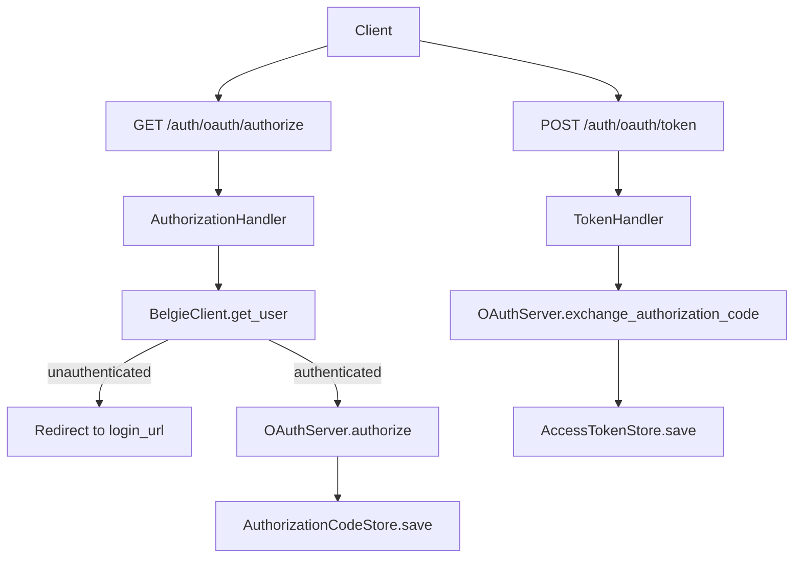
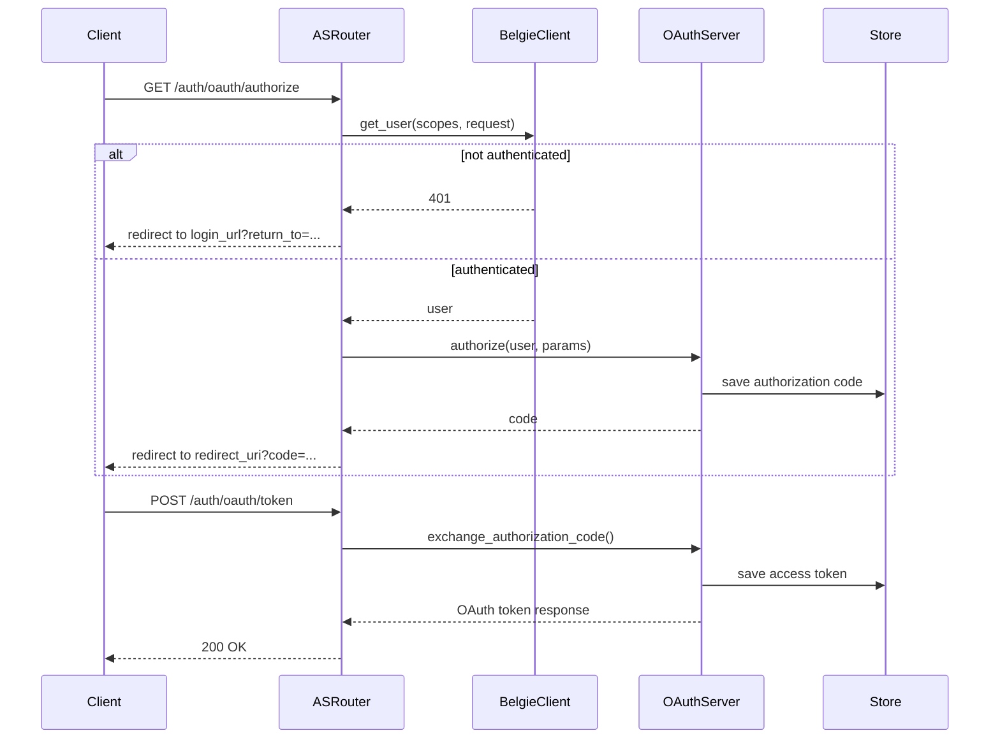
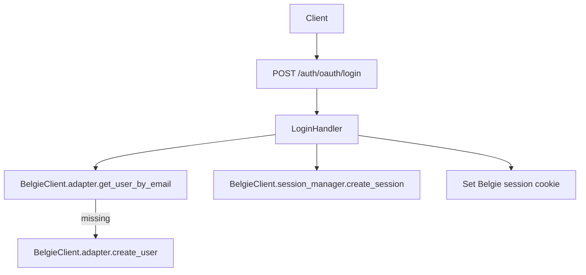
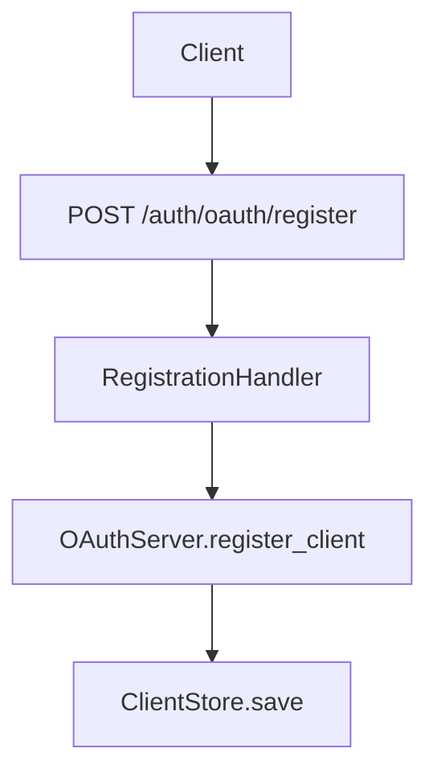
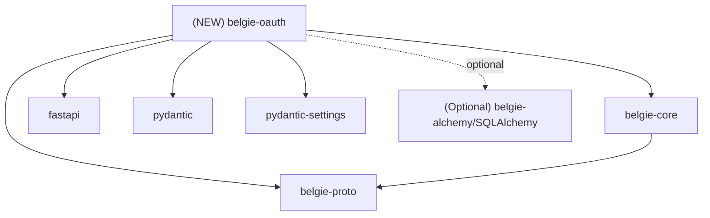

# Design Document: belgie-oauth Authorization Server

## Overview

### High-Level Description

Introduce a new workspace package, `belgie-oauth`, that provides an OAuth 2.1 Authorization Server (AS) for FastAPI and
integrates with the **existing Belgie plugin system** in `belgie-core`. The plugin is registered via
`Belgie.add_plugin(...)` and exposes AS endpoints through the Belgie router. The OAuth AS relies on
`belgie_core.core.client.BelgieClient` and `belgie_core.core.belgie.Belgie` for user/session operations so user identity
and session lifecycle are **not re-implemented** inside `belgie-oauth`.

OAuth settings are moved **out of `belgie-proto`** and live in `belgie-oauth` to keep configuration co-located with the
feature. Storage and provider protocols remain internal to `belgie-oauth` for better encapsulation; only the plugin and
settings are public.

### Goals

- Provide a FastAPI router implementing OAuth AS endpoints with a configurable path prefix via a Belgie plugin.
- Use `BelgieClient` and `Belgie` for all user/session operations: current user lookup, user creation, session creation,
  and hooks.
- Relocate OAuth settings from `belgie-proto` into `belgie-oauth` and keep them private to the package’s public API.
- Encapsulate OAuth storage and server logic behind internal interfaces, exposing only a minimal plugin surface.
- Support optional dynamic client registration, token revocation, and token introspection.

### Non-Goals

- No resource-server helpers or protected resource metadata routes in v1.
- No JWT access tokens or advanced grants beyond authorization code.
- No multi-tenant support beyond a single issuer per plugin instance.
- No UI customization beyond an optional minimal demo login handler.
- No changes to the existing `belgie-core` provider flows beyond using its plugin API.

### Assumptions

- The OAuth AS is co-deployed with the FastAPI app and uses Belgie’s session cookie.
- The Belgie router is mounted under `/auth`, so OAuth endpoints default to `/auth/oauth/*` unless overridden.
- PKCE (S256) is required for authorization code flow.

## Workflows

### Workflow 1: Authorization Code Flow (Belgie Session)

#### Description

A client initiates the OAuth authorization code flow. The AS checks for an existing Belgie session via
`BelgieClient.get_user(...)`. If no user is authenticated, the AS redirects to a configured login URL. If authenticated,
it issues an authorization code and later exchanges it for an access token.

#### Usage Example

```python
from fastapi import FastAPI

from belgie_core import Belgie, BelgieSettings
from belgie_oauth import OAuthPlugin, OAuthSettings

app = FastAPI()

belgie = Belgie(
    settings=BelgieSettings(secret="secret", base_url="http://localhost:8000"),
    adapter=adapter,
    db=db,
)

oauth_settings = OAuthSettings(
    issuer_url="http://localhost:8000",
    route_prefix="/oauth",
    login_url="/auth/provider/google/signin",
)

belgie.add_plugin(OAuthPlugin, settings=oauth_settings)
app.include_router(belgie.router())
```

#### Call Graph



#### Sequence Diagram



#### Key Components

- **OAuthPlugin** (`belgie_oauth/plugin.py:OAuthPlugin`) - Belgie plugin wiring router and server.
- **OAuthSettings** (`belgie_oauth/settings.py:OAuthSettings`) - OAuth server settings (moved out of belgie-proto).
- **AuthorizationHandler** (`belgie_oauth/handlers/authorize.py:AuthorizationHandler`) - Authorization endpoint.
- **TokenHandler** (`belgie_oauth/handlers/token.py:TokenHandler`) - Token exchange endpoint.
- **OAuthServer** (`belgie_oauth/server.py:OAuthServer`) - Core AS logic and policy.
- **BelgieClient** (`belgie_core/core/client.py:BelgieClient`) - Current user and session access.

### Workflow 2: Demo Login and User Bootstrap (Optional)

#### Description

For development or single-tenant demos, the plugin may include a minimal login handler that accepts a username/email,
creates a user if missing via `BelgieClient.adapter.create_user`, creates a session via
`BelgieClient.session_manager.create_session`, and sets the standard Belgie session cookie. This is optional and can be
disabled in settings.

#### Usage Example

```python
from belgie_oauth import OAuthSettings

oauth_settings = OAuthSettings(
    issuer_url="http://localhost:8000",
    enable_demo_login=True,
)
```

#### Call Graph



#### Key Components

- **LoginHandler** (`belgie_oauth/handlers/login.py:LoginHandler`) - Demo login and session creation.
- **BelgieClient.adapter** (`belgie_proto.AdapterProtocol`) - User creation and lookup.
- **SessionManager** (`belgie_core/session/manager.py:SessionManager`) - Session lifecycle.
- **HookRunner** (`belgie_core/core/hooks.py:HookRunner`) - `on_signup` / `on_signin` hooks.

### Workflow 3: Dynamic Client Registration (Optional)

#### Description

When enabled, clients can register themselves via a registration endpoint. The server validates metadata, persists
client info, and returns a full registration response.

#### Usage Example

```python
from belgie_oauth import ClientRegistrationOptions, OAuthSettings

settings = OAuthSettings(
    issuer_url="http://localhost:8000",
    client_registration=ClientRegistrationOptions(
        enabled=True,
        valid_scopes=["user"],
        default_scopes=["user"],
    ),
)
```

#### Call Graph



#### Key Components

- **RegistrationHandler** (`belgie_oauth/handlers/register.py:RegistrationHandler`) - Validates and stores client
  registration.
- **ClientStore** (`belgie_oauth/storage/protocols.py:ClientStore`) - Persists OAuth client metadata.

## Dependencies



## Detailed Design

### Module Structure

```text
packages/belgie-oauth/
├── README.md
├── pyproject.toml
└── src/belgie_oauth/
    ├── __init__.py
    ├── py.typed
    ├── plugin.py                 # OAuthPlugin (Belgie integration)
    ├── settings.py               # OAuthSettings + options
    ├── server.py                 # OAuthServer orchestrator
    ├── models.py                 # OAuthToken + client metadata
    ├── provider.py               # Provider protocol + authorization params
    ├── utils.py                  # PKCE + resource helpers
    ├── routes.py                 # Router factory and metadata builders
    ├── handlers/
    │   ├── authorize.py          # /authorize
    │   ├── token.py              # /token
    │   ├── register.py           # /register (optional)
    │   ├── revoke.py             # /revoke (optional)
    │   ├── metadata.py           # /.well-known/oauth-authorization-server
    │   ├── introspect.py         # /introspect (optional)
    │   └── login.py              # /login (optional demo)
    └── storage/
        ├── protocols.py          # Storage protocols
        ├── memory.py             # In-memory storage
        └── alchemy.py            # SQLAlchemy adapter (optional)
```

### API Design

#### `packages/belgie-oauth/src/belgie_oauth/settings.py`

OAuth server configuration and optional feature toggles. These settings are **no longer in `belgie-proto`**.

```python
from pydantic import AnyHttpUrl, BaseModel
from pydantic_settings import BaseSettings, SettingsConfigDict


class ClientRegistrationOptions(BaseModel):
    enabled: bool = False
    client_secret_expiry_seconds: int | None = None
    valid_scopes: list[str] | None = None
    default_scopes: list[str] | None = None


class RevocationOptions(BaseModel):
    enabled: bool = False


class IntrospectionOptions(BaseModel):
    enabled: bool = False


class OAuthSettings(BaseSettings):
    model_config = SettingsConfigDict(env_prefix="BELGIE_OAUTH_")

    issuer_url: AnyHttpUrl
    route_prefix: str = "/oauth"
    login_url: str | None = None
    service_documentation_url: AnyHttpUrl | None = None
    required_scopes: list[str] | None = None
    require_pkce: bool = True
    enable_demo_login: bool = False

    client_registration: ClientRegistrationOptions = ClientRegistrationOptions()
    revocation: RevocationOptions = RevocationOptions()
    introspection: IntrospectionOptions = IntrospectionOptions()
```

#### `packages/belgie-oauth/src/belgie_oauth/models.py`

Shared OAuth models aligned with MCP and used by the server and handlers.

```python
from typing import Any, Literal

from pydantic import AnyHttpUrl, AnyUrl, BaseModel, Field, field_validator


class OAuthToken(BaseModel):
    access_token: str
    token_type: Literal["Bearer"] = "Bearer"
    expires_in: int | None = None
    scope: str | None = None
    refresh_token: str | None = None

    @field_validator("token_type", mode="before")
    @classmethod
    def normalize_token_type(cls, value: str | None) -> str | None: ...


class OAuthClientMetadata(BaseModel):
    redirect_uris: list[AnyUrl] | None = Field(..., min_length=1)
    token_endpoint_auth_method: Literal[
        "none",
        "client_secret_post",
        "client_secret_basic",
        "private_key_jwt",
    ] | None = None
    grant_types: list[str] = ["authorization_code", "refresh_token"]
    response_types: list[str] = ["code"]
    scope: str | None = None

    client_name: str | None = None
    client_uri: AnyHttpUrl | None = None
    logo_uri: AnyHttpUrl | None = None
    contacts: list[str] | None = None
    tos_uri: AnyHttpUrl | None = None
    policy_uri: AnyHttpUrl | None = None
    jwks_uri: AnyHttpUrl | None = None
    jwks: Any | None = None
    software_id: str | None = None
    software_version: str | None = None

    def validate_scope(self, requested_scope: str | None) -> list[str] | None: ...
    def validate_redirect_uri(self, redirect_uri: AnyUrl | None) -> AnyUrl: ...


class OAuthClientInformationFull(OAuthClientMetadata):
    client_id: str | None = None
    client_secret: str | None = None
    client_id_issued_at: int | None = None
    client_secret_expires_at: int | None = None


class OAuthMetadata(BaseModel):
    issuer: AnyHttpUrl
    authorization_endpoint: AnyHttpUrl
    token_endpoint: AnyHttpUrl
    registration_endpoint: AnyHttpUrl | None = None
    scopes_supported: list[str] | None = None
    response_types_supported: list[str] = ["code"]
    grant_types_supported: list[str] | None = None
    token_endpoint_auth_methods_supported: list[str] | None = None
    service_documentation: AnyHttpUrl | None = None
    revocation_endpoint: AnyHttpUrl | None = None
    code_challenge_methods_supported: list[str] | None = None
```

#### `packages/belgie-oauth/src/belgie_oauth/provider.py`

Internal OAuth authorization types and error contracts.

```python
from dataclasses import dataclass
from typing import Generic, Literal, Protocol, TypeVar
from urllib.parse import parse_qs, urlencode, urlparse, urlunparse

from pydantic import AnyUrl, BaseModel


class AuthorizationParams(BaseModel):
    state: str | None
    scopes: list[str] | None
    code_challenge: str
    redirect_uri: AnyUrl
    redirect_uri_provided_explicitly: bool
    resource: str | None = None


class AuthorizationCode(BaseModel):
    code: str
    scopes: list[str]
    expires_at: float
    client_id: str
    code_challenge: str
    redirect_uri: AnyUrl
    redirect_uri_provided_explicitly: bool
    resource: str | None = None


class RefreshToken(BaseModel):
    token: str
    client_id: str
    scopes: list[str]
    expires_at: int | None = None


class AccessToken(BaseModel):
    token: str
    client_id: str
    scopes: list[str]
    expires_at: int | None = None
    resource: str | None = None


AuthorizationErrorCode = Literal[
    "invalid_request",
    "unauthorized_client",
    "access_denied",
    "unsupported_response_type",
    "invalid_scope",
    "server_error",
    "temporarily_unavailable",
]


@dataclass(frozen=True)
class AuthorizeError(Exception):
    error: AuthorizationErrorCode
    error_description: str | None = None


TokenErrorCode = Literal[
    "invalid_request",
    "invalid_client",
    "invalid_grant",
    "unauthorized_client",
    "unsupported_grant_type",
    "invalid_scope",
]


@dataclass(frozen=True)
class TokenError(Exception):
    error: TokenErrorCode
    error_description: str | None = None


class TokenVerifier(Protocol):
    async def verify_token(self, token: str) -> AccessToken | None: ...


AuthorizationCodeT = TypeVar("AuthorizationCodeT", bound=AuthorizationCode)
RefreshTokenT = TypeVar("RefreshTokenT", bound=RefreshToken)
AccessTokenT = TypeVar("AccessTokenT", bound=AccessToken)


class OAuthAuthorizationServerProvider(Protocol, Generic[AuthorizationCodeT, RefreshTokenT, AccessTokenT]):
    async def get_client(self, client_id: str): ...
    async def register_client(self, client_info): ...
    async def authorize(self, client, params: AuthorizationParams) -> str: ...
    async def load_authorization_code(self, client, authorization_code: str) -> AuthorizationCodeT | None: ...
    async def exchange_authorization_code(self, client, authorization_code: AuthorizationCodeT): ...
    async def load_refresh_token(self, client, refresh_token: str) -> RefreshTokenT | None: ...
    async def exchange_refresh_token(self, client, refresh_token: RefreshTokenT, scopes: list[str]): ...
    async def load_access_token(self, token: str) -> AccessTokenT | None: ...
    async def revoke_token(self, token: AccessTokenT | RefreshTokenT) -> None: ...


def construct_redirect_uri(redirect_uri_base: str, **params: str | None) -> str: ...
# 1. Parse base URI
# 2. Merge in provided params
# 3. Return updated URI string
```

#### `packages/belgie-oauth/src/belgie_oauth/storage/protocols.py`

Storage abstraction for OAuth data.

```python
from typing import Protocol

from belgie_oauth.models import OAuthClientInformationFull
from belgie_oauth.provider import AccessToken, AuthorizationCode, RefreshToken


class ClientStore(Protocol):
    async def get_client(self, client_id: str) -> OAuthClientInformationFull | None: ...
    async def save_client(self, client: OAuthClientInformationFull) -> None: ...


class AuthorizationCodeStore(Protocol):
    async def save_code(self, code: AuthorizationCode) -> None: ...
    async def load_code(self, code: str) -> AuthorizationCode | None: ...
    async def delete_code(self, code: str) -> None: ...


class AccessTokenStore(Protocol):
    async def save_access_token(self, token: AccessToken) -> None: ...
    async def load_access_token(self, token: str) -> AccessToken | None: ...
    async def delete_access_token(self, token: str) -> None: ...


class RefreshTokenStore(Protocol):
    async def save_refresh_token(self, token: RefreshToken) -> None: ...
    async def load_refresh_token(self, token: str) -> RefreshToken | None: ...
    async def delete_refresh_token(self, token: str) -> None: ...


class OAuthStorage(ClientStore, AuthorizationCodeStore, AccessTokenStore, RefreshTokenStore, Protocol):
    async def purge_expired(self) -> int: ...
```

#### `packages/belgie-oauth/src/belgie_oauth/routes.py`

Router factory that wires handlers to the server and settings.

```python
from fastapi import APIRouter

from belgie_core.core.belgie import Belgie
from belgie_oauth.server import OAuthServer
from belgie_oauth.settings import OAuthSettings


def create_auth_router(
    belgie: Belgie,
    server: OAuthServer,
    settings: OAuthSettings,
) -> APIRouter: ...
# 1. Create APIRouter(prefix=settings.route_prefix, tags=["oauth"])
# 2. Register /authorize, /token, metadata endpoints
# 3. Conditionally include /register, /revoke, /introspect, /login
```

#### `packages/belgie-oauth/src/belgie_oauth/server.py`

Server orchestrator that encapsulates OAuth logic and delegates persistence to storage protocols. It does **not** own
user/session storage and instead accepts a `UserProtocol` instance supplied by `BelgieClient`.

```python
from belgie_proto import UserProtocol

from belgie_oauth.models import OAuthClientInformationFull, OAuthMetadata, OAuthToken
from belgie_oauth.provider import AuthorizationParams
from belgie_oauth.settings import OAuthSettings
from belgie_oauth.storage.protocols import OAuthStorage


class OAuthServer:
    def __init__(self, settings: OAuthSettings, storage: OAuthStorage) -> None: ...
    # 1. Store settings and storage
    # 2. Initialize token TTL and issuer configuration

    async def authorize(
        self,
        user: UserProtocol,
        client: OAuthClientInformationFull,
        params: AuthorizationParams,
    ) -> str: ...
    # 1. Validate scopes and redirect URI
    # 2. Create AuthorizationCode and persist
    # 3. Return code string

    async def exchange_authorization_code(
        self,
        client: OAuthClientInformationFull,
        authorization_code: str,
    ) -> OAuthToken: ...
    # 1. Load and validate authorization code
    # 2. Verify PKCE
    # 3. Issue access token and persist
    # 4. Return OAuthToken response

    async def register_client(self, client_info: OAuthClientInformationFull) -> OAuthClientInformationFull: ...
    # 1. Validate metadata
    # 2. Persist client
    # 3. Return stored client info

    async def revoke_token(self, token: str) -> None: ...
    # 1. Load access/refresh token
    # 2. Delete token if present

    async def introspect_token(self, token: str) -> dict[str, object]: ...
    # 1. Load token
    # 2. Return RFC 7662 response

    def build_metadata(self) -> OAuthMetadata: ...
    # 1. Construct metadata URLs from issuer + route prefix
    # 2. Include optional endpoints based on settings
```

#### `packages/belgie-oauth/src/belgie_oauth/plugin.py`

Belgie-facing plugin wrapper, wired to the plugin system in `belgie-core`.

```python
from fastapi import APIRouter

from belgie_core.core.belgie import Belgie
from belgie_core.core.protocols import Plugin
from belgie_oauth.server import OAuthServer
from belgie_oauth.settings import OAuthSettings
from belgie_oauth.storage.memory import InMemoryOAuthStorage
from belgie_oauth.routes import create_auth_router


class OAuthPlugin(Plugin[OAuthSettings]):
    def __init__(self, belgie: Belgie, settings: OAuthSettings) -> None: ...
    # 1. Store belgie + settings
    # 2. Initialize OAuthStorage (default in-memory or optional SQLAlchemy)
    # 3. Initialize OAuthServer
    # 4. Build FastAPI router with handlers using Depends(belgie)

    def router(self) -> APIRouter: ...
    # 1. Return router with prefix settings.route_prefix
```

#### `packages/belgie-oauth/src/belgie_oauth/handlers/authorize.py`

Authorization handler that relies on `BelgieClient` for user identity.

```python
from fastapi import Depends, Request
from fastapi.responses import RedirectResponse
from fastapi.security import SecurityScopes

from belgie_core.core.belgie import Belgie
from belgie_core.core.client import BelgieClient
from belgie_oauth.server import OAuthServer


def authorize_handler(
    belgie: Belgie,
    server: OAuthServer,
): ...
# 1. Use Depends(belgie) to get BelgieClient
# 2. Call client.get_user(SecurityScopes(), request)
# 3. If unauthenticated, redirect to settings.login_url with return_to
# 4. If authenticated, call server.authorize(user, oauth_client, params)
# 5. Redirect to redirect_uri with code + state
```

#### `packages/belgie-oauth/src/belgie_oauth/handlers/login.py`

Optional demo login handler that uses Belgie primitives for user/session creation.

```python
from fastapi import Depends, Request
from fastapi.responses import RedirectResponse

from belgie_core.core.belgie import Belgie
from belgie_core.core.client import BelgieClient


def login_handler(belgie: Belgie): ...
# 1. Get BelgieClient via Depends(belgie)
# 2. Look up user by email
# 3. Create user if missing via client.adapter.create_user
# 4. Create session via client.session_manager.create_session
# 5. Set cookie using belgie.settings.cookie
# 6. Dispatch on_signup/on_signin hooks via client.hook_runner
```

### Testing Strategy

Tests should be organized by module/file and cover unit tests, integration tests, and edge cases.

#### Settings

- `packages/belgie-oauth/src/belgie_oauth/__tests__/test_settings.py`
  - Default `route_prefix` is `/oauth` and `require_pkce` is True.
  - `login_url` is optional but required for redirect-based login flow.
  - `client_registration.enabled`, `revocation.enabled`, `introspection.enabled` toggle behavior.
  - Environment variable prefix `BELGIE_OAUTH_` is respected.

#### Server

- `packages/belgie-oauth/src/belgie_oauth/__tests__/test_server.py`
  - `authorize()` validates redirect URI and scope.
  - `authorize()` persists authorization code.
  - `exchange_authorization_code()` enforces PKCE and issues token.
  - `build_metadata()` includes optional endpoints when enabled.

#### Handlers

- `packages/belgie-oauth/src/belgie_oauth/__tests__/test_authorize_handler.py`
  - Unauthenticated user triggers redirect to `login_url`.
  - Authenticated user returns redirect with code and state.
- `packages/belgie-oauth/src/belgie_oauth/__tests__/test_token_handler.py`
  - Missing/invalid grant type returns `unsupported_grant_type`.
  - Invalid code returns `invalid_grant`.
  - Successful exchange returns JSON token response.
- `packages/belgie-oauth/src/belgie_oauth/__tests__/test_login_handler.py`
  - Creates user when missing via `adapter.create_user`.
  - Creates session via `session_manager.create_session`.
  - Sets cookie using Belgie settings.

#### Plugin Integration

- `packages/belgie-oauth/src/belgie_oauth/__tests__/test_plugin_integration.py`
  - `Belgie.add_plugin` registers `OAuthPlugin`.
  - Plugin routes are available under `/auth/<route_prefix>`.
  - Multiple plugins mount without conflicts.

#### Integration

- `packages/belgie-oauth/src/belgie_oauth/__tests__/test_flow_integration.py`
  - End-to-end auth code flow with in-memory storage and Belgie session.
  - Demo login flow creates session and allows authorization.
  - Introspection returns active token when enabled.

## Implementation

### Implementation Order

1. **Settings + models** (`settings.py`, `models.py`)
2. **Storage protocols + memory storage** (`storage/protocols.py`, `storage/memory.py`)
3. **OAuthServer orchestration** (`server.py`)
4. **Handlers + routes** (`handlers/*`, `routes.py`)
5. **OAuthPlugin** (`plugin.py`)
6. **Optional SQLAlchemy storage** (`storage/alchemy.py`)
7. **Tests**

### Tasks

- [ ] Implement `OAuthSettings` and option models in `settings.py`.
- [ ] Implement shared OAuth models in `models.py`.
- [ ] Define storage protocols and in-memory storage.
- [ ] Implement `OAuthServer` orchestration logic.
- [ ] Implement handlers for authorize, token, metadata, register, revoke, introspect.
- [ ] Implement optional demo login handler using `BelgieClient`.
- [ ] Implement `OAuthPlugin` wiring to Belgie plugin system.
- [ ] Add unit tests for settings, server, and handlers.
- [ ] Add plugin integration tests under Belgie.
- [ ] Add end-to-end flow tests with in-memory storage.

## Open Questions

1. Should `login_url` be required when demo login is disabled, or should the authorize endpoint return 401?
2. Do we need a way to customize how `return_to` is encoded in the login redirect?

## Future Enhancements

- Add refresh token issuance and rotation.
- Support JWT access tokens with configurable signing keys.
- Add resource server helpers and protected resource metadata routes.
- Add third-party IdP integration hooks (Auth0, Entra ID).

## Libraries

### New Libraries

| Library | Version | Purpose | Dependency Group | Command |
|---------|---------|---------|------------------|---------|
| `fastapi` | `>=0.100` | HTTP routing and request handling (belgie-oauth) | core | `uv add fastapi` |
| `pydantic` | `>=2.0` | Settings/model validation (belgie-oauth) | core | `uv add pydantic` |
| `pydantic-settings` | `>=2.0` | Environment-based settings (belgie-oauth) | core | `uv add pydantic-settings` |
| `sqlalchemy` | `>=2.0` | Optional SQLAlchemy storage adapter | optional `alchemy` | `uv add sqlalchemy` |

### Existing Libraries

| Library | Current Version | Purpose | Dependency Group |
|---------|-----------------|---------|------------------|
| `python-multipart` | `>=0.0.20` | Form parsing for token and login endpoints | core |

## Alternative Approaches

### Approach 1: Keep OAuth Settings in belgie-proto

**Description**: Continue to define `OAuthSettings` and plugin protocol in `belgie-proto` for cross-package stability.

**Pros**:

- Central location for shared settings across packages.
- Easy for multiple packages to depend on a single settings definition.

**Cons**:

- Tightens coupling between `belgie-proto` and `belgie-oauth`.
- Expands the “proto” package beyond pure protocols.

**Why not chosen**: OAuth settings are feature-specific and belong with the OAuth server package. `belgie-proto` remains
focused on database/model protocols.

### Approach 2: Allow `add_plugin` to Accept Provider Instances

**Description**: Extend `Belgie.add_plugin` to accept `**kwargs` and pass provider/storage instances directly into
plugins.

**Pros**:

- Easy to inject custom providers or storage without settings indirection.

**Cons**:

- Diverges from the current plugin system signature in `belgie-core`.
- Loosens the plugin protocol contract and complicates typing.

**Why not chosen**: The current plugin system is stable and minimal. Encapsulation is better served by configuring via
settings and internal defaults.

### Approach 3: Embed OAuth AS Inside belgie-core

**Description**: Add OAuth Authorization Server functionality directly to `belgie-core` instead of a separate package.

**Pros**:

- Fewer packages and simpler import path.
- Tighter integration with Belgie user/session primitives.

**Cons**:

- Bloats `belgie-core` with optional functionality.
- Harder to keep dependencies optional (SQLAlchemy, pydantic-settings).

**Why not chosen**: A separate `belgie-oauth` package keeps the core lean and preserves optional dependency boundaries.
