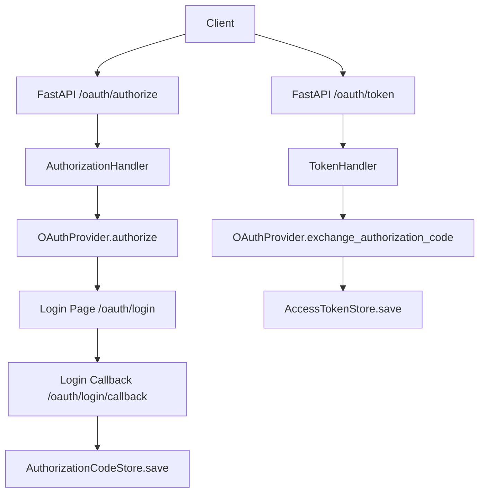
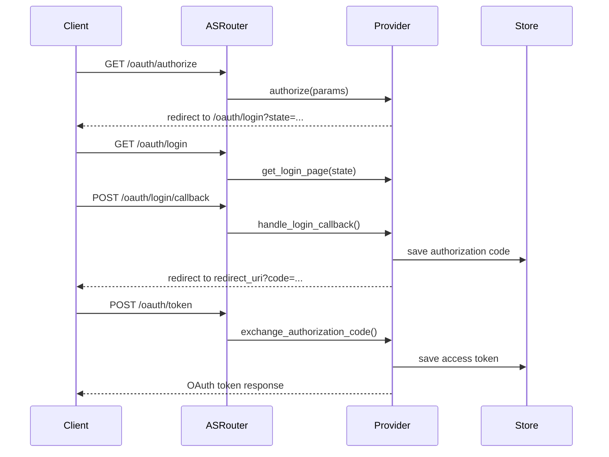
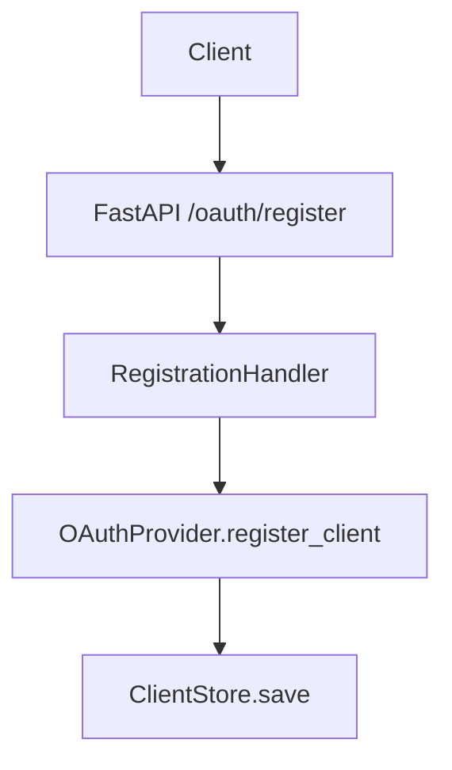
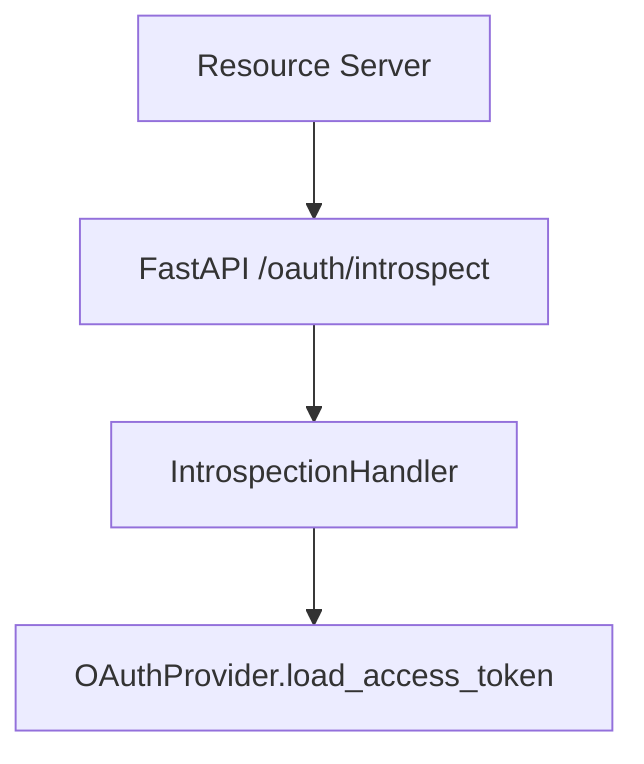
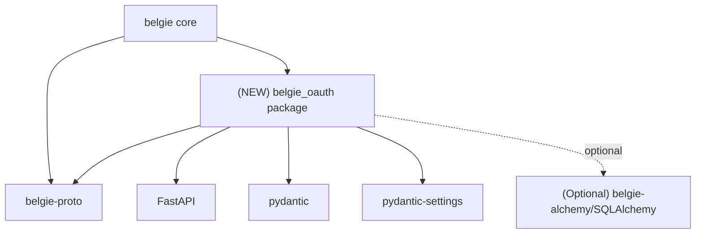

# Design Document: belgie-oauth Authorization Server

## Overview

### High-Level Description

Introduce a new workspace package, `belgie-oauth`, that provides a simple OAuth 2.1 Authorization Server (AS) aligned
with the MCP reference implementation but built for FastAPI. The package exposes standard OAuth endpoints, optional
dynamic client registration and revocation, and an optional token introspection endpoint. The integration surface is a
`OAuthPlugin` that can be attached to a new Belgie plugin manager via `add_plugin(plugin=OAuthPlugin, ...)`. The plugin
protocol and OAuth settings live in `belgie-proto` to keep plugin contracts stable across packages. Storage is
protocol-driven with a built-in in-memory implementation and an optional SQLAlchemy adapter.

### Goals

- Provide a FastAPI router that implements OAuth AS endpoints with configuration-driven path prefix.
- Match the MCP reference flows and data shapes for authorization codes, access tokens, and OAuth metadata.
- Offer an `OAuthPlugin` that integrates with Belgie through a minimal plugin protocol in `belgie-proto`.
- Keep storage decoupled behind protocols and ship an in-memory store plus an optional SQLAlchemy adapter.
- Make it straightforward to use in a FastAPI app alongside other Belgie plugins.

### Non-Goals

- No resource-server helpers or protected resource metadata routes in v1.
- No external IdP integration beyond a simple demo provider.
- No JWT access tokens or advanced grant types beyond authorization code.
- No UI customization beyond a minimal demo login form.
- No integration with `belgie.auth` OAuth providers or `src/belgie/auth/providers/*`.

### Assumptions

- The OAuth AS will be used as a simple, single-tenant component in the same deployment as the FastAPI app.
- The default route prefix is `/oauth`, but callers can override it via settings.
- PKCE is required for the authorization code flow (S256 only).

## Workflows

### Workflow 1: Authorization Code Flow (Simple Demo Provider)

#### Description

A client initiates the OAuth authorization code flow. The AS redirects to a simple login page, validates demo
credentials, issues an authorization code, and exchanges it for an access token.

#### Usage Example

```python
from fastapi import FastAPI

from belgie import Belgie
from belgie_oauth import OAuthPlugin, SimpleAuthSettings, SimpleOAuthProvider
from belgie_proto import OAuthSettings

app = FastAPI()

oauth_settings = OAuthSettings(
    issuer_url="http://localhost:9000",
    route_prefix="/oauth",
)

simple_auth = SimpleAuthSettings()
provider = SimpleOAuthProvider(
    settings=simple_auth,
    auth_callback_url="http://localhost:9000/oauth/login",
    server_url="http://localhost:9000",
)

belgie = Belgie()
belgie.add_plugin(plugin=OAuthPlugin, settings=oauth_settings, provider=provider)
app.include_router(belgie.router)
```

#### Call Graph



#### Sequence Diagram



#### Key Components

- **OAuthPlugin** (`belgie_oauth/plugin.py:OAuthPlugin`) - Belgie plugin that exposes FastAPI routes.
- **AuthorizationHandler** (`belgie_oauth/handlers/authorize.py:AuthorizationHandler`) - Parses and validates
  authorization requests.
- **SimpleOAuthProvider** (`belgie_oauth/simple.py:SimpleOAuthProvider`) - Demo provider with login routes and in-memory
  storage.
- **TokenHandler** (`belgie_oauth/handlers/token.py:TokenHandler`) - Exchanges authorization codes for tokens.
- **Storage Protocols** (`belgie_oauth/storage/protocols.py`) - Abstract client, code, and token persistence.

### Workflow 2: Dynamic Client Registration (Optional)

#### Description

When enabled, clients can register themselves via the registration endpoint. The server validates metadata, persists
client info, and returns a full registration response.

#### Usage Example

```python
from belgie_proto import ClientRegistrationOptions, OAuthSettings

settings = OAuthSettings(
    issuer_url="http://localhost:9000",
    client_registration=ClientRegistrationOptions(
        enabled=True,
        valid_scopes=["user"],
        default_scopes=["user"],
    ),
)
```

#### Call Graph



#### Key Components

- **RegistrationHandler** (`belgie_oauth/handlers/register.py:RegistrationHandler`) - Validates and stores client
  registration.
- **ClientStore** (`belgie_oauth/storage/protocols.py:ClientStore`) - Persists OAuth client metadata.

### Workflow 3: Token Introspection (Optional)

#### Description

Resource servers can verify tokens via an introspection endpoint backed by the provider’s access-token store.

#### Usage Example

```python
from belgie_proto import IntrospectionOptions, OAuthSettings

settings = OAuthSettings(
    issuer_url="http://localhost:9000",
    introspection=IntrospectionOptions(enabled=True),
)
```

#### Call Graph



#### Key Components

- **IntrospectionHandler** (`belgie_oauth/handlers/introspect.py:IntrospectionHandler`) - Implements RFC 7662 response.
- **AccessTokenStore** (`belgie_oauth/storage/protocols.py:AccessTokenStore`) - Loads access tokens by token string.

## Dependencies



## Detailed Design

### Module Structure

```text
packages/belgie-oauth/
├── README.md
├── pyproject.toml
└── src/belgie_oauth/
    ├── __init__.py
    ├── py.typed
    ├── plugin.py                 # OAuthPlugin (Belgie integration)
    ├── shared.py                 # OAuthToken + client metadata
    ├── provider.py               # Provider protocol + token models
    ├── utils.py                  # PKCE + resource helpers
    ├── routes.py                 # Router factory and metadata builders
    ├── simple.py                 # Simple demo provider + login handlers
    ├── handlers/
    │   ├── authorize.py           # /authorize
    │   ├── token.py               # /token
    │   ├── register.py            # /register (optional)
    │   ├── revoke.py              # /revoke (optional)
    │   ├── metadata.py            # /.well-known/oauth-authorization-server
    │   └── introspect.py          # /introspect (optional)
    └── storage/
        ├── protocols.py           # Storage protocols
        ├── memory.py              # In-memory storage
        └── alchemy.py             # SQLAlchemy adapter (optional)

src/belgie/
├── app.py                         # Belgie plugin manager
└── oauth.py                        # belgie.oauth re-exports

packages/belgie-proto/
└── src/belgie_proto/
    ├── __init__.py
    ├── plugin.py                  # Plugin protocol + settings base
    └── oauth_settings.py           # OAuthSettings + options
```

### API Design

#### `packages/belgie-proto/src/belgie_proto/oauth_settings.py`

OAuth server configuration and optional feature toggles.

```python
from pydantic import AnyHttpUrl
from pydantic_settings import BaseSettings, SettingsConfigDict


class ClientRegistrationOptions(BaseSettings):
    enabled: bool = False
    client_secret_expiry_seconds: int | None = None
    valid_scopes: list[str] | None = None
    default_scopes: list[str] | None = None


class RevocationOptions(BaseSettings):
    enabled: bool = False


class IntrospectionOptions(BaseSettings):
    enabled: bool = False


class OAuthSettings(BaseSettings):
    model_config = SettingsConfigDict(env_prefix="BELGIE_OAUTH_")

    issuer_url: AnyHttpUrl
    route_prefix: str = "/oauth"
    service_documentation_url: AnyHttpUrl | None = None
    required_scopes: list[str] | None = None

    client_registration: ClientRegistrationOptions = ClientRegistrationOptions()
    revocation: RevocationOptions = RevocationOptions()
    introspection: IntrospectionOptions = IntrospectionOptions()
```

#### `packages/belgie-oauth/src/belgie_oauth/shared.py`

OAuth shared models aligned with MCP.

```python
from typing import Any, Literal

from pydantic import AnyHttpUrl, AnyUrl, BaseModel, Field, field_validator


class OAuthToken(BaseModel):
    access_token: str
    token_type: Literal["Bearer"] = "Bearer"
    expires_in: int | None = None
    scope: str | None = None
    refresh_token: str | None = None

    @field_validator("token_type", mode="before")
    @classmethod
    def normalize_token_type(cls, value: str | None) -> str | None:
        return value.title() if isinstance(value, str) else value


class OAuthClientMetadata(BaseModel):
    redirect_uris: list[AnyUrl] | None = Field(..., min_length=1)
    token_endpoint_auth_method: Literal["none", "client_secret_post", "client_secret_basic", "private_key_jwt"] | None = None
    grant_types: list[str] = ["authorization_code", "refresh_token"]
    response_types: list[str] = ["code"]
    scope: str | None = None

    client_name: str | None = None
    client_uri: AnyHttpUrl | None = None
    logo_uri: AnyHttpUrl | None = None
    contacts: list[str] | None = None
    tos_uri: AnyHttpUrl | None = None
    policy_uri: AnyHttpUrl | None = None
    jwks_uri: AnyHttpUrl | None = None
    jwks: Any | None = None
    software_id: str | None = None
    software_version: str | None = None

    def validate_scope(self, requested_scope: str | None) -> list[str] | None: ...
    def validate_redirect_uri(self, redirect_uri: AnyUrl | None) -> AnyUrl: ...


class OAuthClientInformationFull(OAuthClientMetadata):
    client_id: str | None = None
    client_secret: str | None = None
    client_id_issued_at: int | None = None
    client_secret_expires_at: int | None = None


class OAuthMetadata(BaseModel):
    issuer: AnyHttpUrl
    authorization_endpoint: AnyHttpUrl
    token_endpoint: AnyHttpUrl
    registration_endpoint: AnyHttpUrl | None = None
    scopes_supported: list[str] | None = None
    response_types_supported: list[str] = ["code"]
    grant_types_supported: list[str] | None = None
    token_endpoint_auth_methods_supported: list[str] | None = None
    service_documentation: AnyHttpUrl | None = None
    revocation_endpoint: AnyHttpUrl | None = None
    code_challenge_methods_supported: list[str] | None = None
```

#### `packages/belgie-oauth/src/belgie_oauth/provider.py`

Provider protocol and token types.

```python
from dataclasses import dataclass
from typing import Generic, Literal, Protocol, TypeVar
from urllib.parse import parse_qs, urlencode, urlparse, urlunparse

from pydantic import AnyUrl, BaseModel

from belgie_oauth.shared import OAuthClientInformationFull, OAuthToken


class AuthorizationParams(BaseModel):
    state: str | None
    scopes: list[str] | None
    code_challenge: str
    redirect_uri: AnyUrl
    redirect_uri_provided_explicitly: bool
    resource: str | None = None


class AuthorizationCode(BaseModel):
    code: str
    scopes: list[str]
    expires_at: float
    client_id: str
    code_challenge: str
    redirect_uri: AnyUrl
    redirect_uri_provided_explicitly: bool
    resource: str | None = None


class RefreshToken(BaseModel):
    token: str
    client_id: str
    scopes: list[str]
    expires_at: int | None = None


class AccessToken(BaseModel):
    token: str
    client_id: str
    scopes: list[str]
    expires_at: int | None = None
    resource: str | None = None


RegistrationErrorCode = Literal[
    "invalid_redirect_uri",
    "invalid_client_metadata",
    "invalid_software_statement",
    "unapproved_software_statement",
]


@dataclass(frozen=True)
class RegistrationError(Exception):
    error: RegistrationErrorCode
    error_description: str | None = None


AuthorizationErrorCode = Literal[
    "invalid_request",
    "unauthorized_client",
    "access_denied",
    "unsupported_response_type",
    "invalid_scope",
    "server_error",
    "temporarily_unavailable",
]


@dataclass(frozen=True)
class AuthorizeError(Exception):
    error: AuthorizationErrorCode
    error_description: str | None = None


TokenErrorCode = Literal[
    "invalid_request",
    "invalid_client",
    "invalid_grant",
    "unauthorized_client",
    "unsupported_grant_type",
    "invalid_scope",
]


@dataclass(frozen=True)
class TokenError(Exception):
    error: TokenErrorCode
    error_description: str | None = None


class TokenVerifier(Protocol):
    async def verify_token(self, token: str) -> AccessToken | None: ...


AuthorizationCodeT = TypeVar("AuthorizationCodeT", bound=AuthorizationCode)
RefreshTokenT = TypeVar("RefreshTokenT", bound=RefreshToken)
AccessTokenT = TypeVar("AccessTokenT", bound=AccessToken)


class OAuthAuthorizationServerProvider(Protocol, Generic[AuthorizationCodeT, RefreshTokenT, AccessTokenT]):
    async def get_client(self, client_id: str) -> OAuthClientInformationFull | None: ...
    async def register_client(self, client_info: OAuthClientInformationFull) -> None: ...
    async def authorize(self, client: OAuthClientInformationFull, params: AuthorizationParams) -> str: ...
    async def load_authorization_code(self, client: OAuthClientInformationFull, authorization_code: str) -> AuthorizationCodeT | None: ...
    async def exchange_authorization_code(self, client: OAuthClientInformationFull, authorization_code: AuthorizationCodeT) -> OAuthToken: ...
    async def load_refresh_token(self, client: OAuthClientInformationFull, refresh_token: str) -> RefreshTokenT | None: ...
    async def exchange_refresh_token(self, client: OAuthClientInformationFull, refresh_token: RefreshTokenT, scopes: list[str]) -> OAuthToken: ...
    async def load_access_token(self, token: str) -> AccessTokenT | None: ...
    async def revoke_token(self, token: AccessTokenT | RefreshTokenT) -> None: ...


def construct_redirect_uri(redirect_uri_base: str, **params: str | None) -> str:
    parsed_uri = urlparse(redirect_uri_base)
    query_params = [(key, value) for key, values in parse_qs(parsed_uri.query).items() for value in values]
    for key, value in params.items():
        if value is not None:
            query_params.append((key, value))
    return urlunparse(parsed_uri._replace(query=urlencode(query_params)))
```

#### `packages/belgie-oauth/src/belgie_oauth/utils.py`

RFC 8707 and token expiry helpers.

```python
import time
from urllib.parse import urlparse, urlsplit, urlunsplit

from pydantic import AnyUrl, HttpUrl


def resource_url_from_server_url(url: str | HttpUrl | AnyUrl) -> str: ...
def check_resource_allowed(requested_resource: str, configured_resource: str) -> bool: ...
def calculate_token_expiry(expires_in: int | str | None) -> float | None: ...
```

#### `packages/belgie-oauth/src/belgie_oauth/storage/protocols.py`

Storage abstraction for OAuth data.

```python
from collections.abc import Iterable
from typing import Protocol

from belgie_oauth.provider import AccessToken, AuthorizationCode, RefreshToken
from belgie_oauth.shared import OAuthClientInformationFull


class ClientStore(Protocol):
    async def get_client(self, client_id: str) -> OAuthClientInformationFull | None: ...
    async def save_client(self, client: OAuthClientInformationFull) -> None: ...


class AuthorizationCodeStore(Protocol):
    async def save_code(self, code: AuthorizationCode) -> None: ...
    async def load_code(self, code: str) -> AuthorizationCode | None: ...
    async def delete_code(self, code: str) -> None: ...


class AccessTokenStore(Protocol):
    async def save_access_token(self, token: AccessToken) -> None: ...
    async def load_access_token(self, token: str) -> AccessToken | None: ...
    async def delete_access_token(self, token: str) -> None: ...


class RefreshTokenStore(Protocol):
    async def save_refresh_token(self, token: RefreshToken) -> None: ...
    async def load_refresh_token(self, token: str) -> RefreshToken | None: ...
    async def delete_refresh_token(self, token: str) -> None: ...


class OAuthStorage(ClientStore, AuthorizationCodeStore, AccessTokenStore, RefreshTokenStore, Protocol):
    async def purge_expired(self) -> int: ...
```

#### `packages/belgie-oauth/src/belgie_oauth/routes.py`

FastAPI route factories and metadata builders.

```python
from fastapi import APIRouter
from pydantic import AnyHttpUrl

from belgie_oauth.provider import OAuthAuthorizationServerProvider
from belgie_proto.oauth_settings import ClientRegistrationOptions, IntrospectionOptions, OAuthSettings, RevocationOptions
from belgie_oauth.shared import OAuthMetadata


def create_auth_router(
    provider: OAuthAuthorizationServerProvider,
    settings: OAuthSettings,
) -> APIRouter: ...


def build_metadata(
    issuer_url: AnyHttpUrl,
    service_documentation_url: AnyHttpUrl | None,
    client_registration_options: ClientRegistrationOptions,
    revocation_options: RevocationOptions,
) -> OAuthMetadata: ...
```

#### `packages/belgie-proto/src/belgie_proto/plugin.py`

Shared plugin protocol and settings base.

```python
from typing import TYPE_CHECKING, Protocol, TypeVar

from pydantic_settings import BaseSettings

if TYPE_CHECKING:
    from fastapi import APIRouter
else:  # pragma: no cover
    APIRouter = object


class Settings(BaseSettings):
    model_config = {"extra": "forbid"}


SettingsT = TypeVar("SettingsT", bound=Settings)


class Plugin(Protocol[SettingsT]):
    def __init__(self, settings: SettingsT, **kwargs: object) -> None: ...

    @property
    def router(self) -> "APIRouter": ...
```

#### `packages/belgie-oauth/src/belgie_oauth/plugin.py`

Belgie-facing plugin wrapper.

```python
from fastapi import APIRouter

from belgie_proto.plugin import Plugin
from belgie_proto.oauth_settings import OAuthSettings
from belgie_oauth.provider import OAuthAuthorizationServerProvider
from belgie_oauth.routes import create_auth_router


class OAuthPlugin(Plugin[OAuthSettings]):
    def __init__(self, settings: OAuthSettings, provider: OAuthAuthorizationServerProvider) -> None: ...

    @property
    def router(self) -> APIRouter: ...
```

#### `src/belgie/app.py`

Belgie plugin manager with `add_plugin(...)`.

```python
from fastapi import APIRouter

from belgie_proto.plugin import Plugin, SettingsT


class Belgie:
    def __init__(self) -> None: ...
    def add_plugin[P: Plugin[SettingsT]](
        self,
        plugin: type[P],
        *,
        settings: SettingsT,
        **kwargs: object,
    ) -> P: ...
    @property
    def router(self) -> APIRouter: ...
```

#### `src/belgie/oauth.py`

Update belgie.oauth re-exports to expose OAuth plugin surface and settings from belgie-proto.

```python
from belgie_oauth import OAuthPlugin
from belgie_proto import OAuthSettings

__all__ = ["OAuthPlugin", "OAuthSettings"]
```

### Testing Strategy

Tests should be organized by module, with unit tests for helpers and handlers, plus integration tests for the end-to-end
authorization code flow. All handler tests should exercise both success and error responses and confirm status codes,
headers, and response bodies.

#### Proto Settings + Plugin Protocol

- `packages/belgie-proto/src/belgie_proto/__tests__/test_oauth_settings.py`
  - Default `route_prefix` is `/oauth`.
  - Overrides `route_prefix` with custom value.
  - `client_registration.enabled`, `revocation.enabled`, `introspection.enabled` toggle behavior.
  - Invalid `issuer_url` types fail validation.

#### Shared Models

- `packages/belgie-oauth/src/belgie_oauth/__tests__/test_shared_models.py`
  - `OAuthToken` normalizes `token_type` to `Bearer` for `bearer`, `BEARER`.
  - `OAuthClientMetadata.validate_scope` accepts registered scopes and rejects unregistered scopes.
  - `OAuthClientMetadata.validate_redirect_uri`:
    - Accepts explicitly registered redirect URI.
    - Rejects unregistered redirect URI.
    - Uses single registered URI when none provided.
    - Fails when multiple registered URIs and none provided.

#### Utilities

- `packages/belgie-oauth/src/belgie_oauth/__tests__/test_utils.py`
  - `resource_url_from_server_url` strips fragments and lowercases scheme/host.
  - `check_resource_allowed`:
    - Allows same origin + matching path prefix.
    - Rejects different host or scheme.
    - Rejects sibling path that does not share prefix.
  - `calculate_token_expiry`:
    - Accepts int and str seconds.
    - Returns `None` when `expires_in` is `None`.

#### Routes + Metadata

- `packages/belgie-oauth/src/belgie_oauth/__tests__/test_routes.py`
  - Router includes:
    - `/.well-known/oauth-authorization-server`
    - `/authorize`
    - `/token`
  - When enabled:
    - `/register` exists with CORS
    - `/revoke` exists with CORS
    - `/introspect` exists with CORS
  - Prefix override places routes under custom path (e.g., `/oauth2`).
  - Metadata fields include `authorization_endpoint`, `token_endpoint`, optional `registration_endpoint`.
  - `code_challenge_methods_supported` is `["S256"]`.

#### Handlers

- `packages/belgie-oauth/src/belgie_oauth/__tests__/test_authorize_handler.py`
  - Missing `client_id`, `redirect_uri`, or `code_challenge` returns `invalid_request`.
  - Invalid `redirect_uri` returns `invalid_request`.
  - Successful authorization redirects to login page.
- `packages/belgie-oauth/src/belgie_oauth/__tests__/test_token_handler.py`
  - Missing `grant_type` returns `unsupported_grant_type`.
  - Unknown `code` returns `invalid_grant`.
  - Successful exchange returns JSON token response.
  - PKCE verification failure returns `invalid_grant`.
- `packages/belgie-oauth/src/belgie_oauth/__tests__/test_registration_handler.py`
  - Valid registration returns `client_id`, `client_secret` (if configured).
  - Invalid metadata returns appropriate error response.
- `packages/belgie-oauth/src/belgie_oauth/__tests__/test_revocation_handler.py`
  - Revokes existing access token.
  - Revoking unknown token returns success with no change (idempotent).
- `packages/belgie-oauth/src/belgie_oauth/__tests__/test_introspection_handler.py`
  - Missing token returns `{active: False}`.
  - Expired token returns `{active: False}`.
  - Active token returns `active: True` and required fields.

#### Providers + Storage

- `packages/belgie-oauth/src/belgie_oauth/__tests__/test_simple_provider.py`
  - Authorize stores state and returns login URL with `state` and `client_id`.
  - Login callback rejects invalid credentials.
  - Login callback creates authorization code and redirect URI.
  - Token exchange creates access token and clears authorization code.
  - Access token expires and is purged on load.

- `packages/belgie-oauth/src/belgie_oauth/__tests__/test_memory_storage.py`
  - Save/load/delete round trip for clients, codes, access tokens.
  - `purge_expired` removes expired entries and returns count.
- `packages/belgie-oauth/src/belgie_oauth/__tests__/test_alchemy_storage.py`
  - Adapter persists and loads tokens with async session.
  - Adapter handles purge of expired tokens (if implemented).

#### Belgie Plugin Integration

- `src/belgie/__tests__/test_plugins.py`
  - `Belgie.add_plugin` constructs plugin from type + settings and returns instance.
  - `Belgie.router` includes plugin router(s).
  - Multiple plugins mount without route collisions.

#### Integration

- `packages/belgie-oauth/src/belgie_oauth/__tests__/test_flow_integration.py`
  - End-to-end auth code flow with in-memory storage:
    - `/authorize` → `/login` → `/login/callback` → `/token`
    - Response has `access_token`, `token_type=Bearer`, `expires_in`.
  - Scope validation uses `client_registration.default_scopes` when no scope requested.
  - Introspection returns active for issued tokens when enabled.

## Implementation

### Implementation Order

1. **Shared models + utils** (`belgie_oauth/shared.py`, `belgie_oauth/utils.py`)
2. **Provider protocol + errors** (`belgie_oauth/provider.py`)
3. **Proto plugin protocol + OAuth settings** (`packages/belgie-proto/src/belgie_proto/plugin.py`,
   `packages/belgie-proto/src/belgie_proto/oauth_settings.py`)
4. **Storage protocols + memory storage** (`belgie_oauth/storage/protocols.py`, `belgie_oauth/storage/memory.py`)
5. **Handlers + routes** (`belgie_oauth/handlers/*`, `belgie_oauth/routes.py`)
6. **Simple demo provider** (`belgie_oauth/simple.py`)
7. **OAuthPlugin** (`belgie_oauth/plugin.py`)
8. **Belgie plugin manager** (`src/belgie/app.py`, `src/belgie/oauth.py`)
9. **Optional SQLAlchemy adapter** (`belgie_oauth/storage/alchemy.py`)
10. **Tests**

### Tasks

#### Shared models + utils

- [ ] Implement `OAuthToken`, `OAuthClientMetadata`, `OAuthClientInformationFull`, `OAuthMetadata`.
- [ ] Implement `resource_url_from_server_url`, `check_resource_allowed`, `calculate_token_expiry`.
- [ ] Add unit tests for model validation and utility edge cases.

#### Provider protocol

- [ ] Define provider protocol types, errors, and token models.
- [ ] Implement `construct_redirect_uri` using `urllib.parse`.
- [ ] Add unit tests for redirect URI construction.

#### Proto plugin protocol + OAuth settings

- [ ] Add `Settings` base class with `extra="forbid"`.
- [ ] Define `Plugin[SettingsT]` protocol with `router` property.
- [ ] Add `OAuthSettings`, `ClientRegistrationOptions`, `RevocationOptions`, `IntrospectionOptions`.
- [ ] Add `belgie_proto/__init__.py` re-exports for plugin + settings.
- [ ] Add unit tests for `Settings` validation and OAuth settings defaults/overrides.

#### Storage protocols + memory storage

- [ ] Define storage protocols in `storage/protocols.py`.
- [ ] Implement in-memory storage in `storage/memory.py`.
- [ ] Add tests for CRUD + purge semantics.

#### Handlers + routes

- [ ] Authorization handler: parse params, validate client, redirect to provider authorize URL.
- [ ] Token handler: validate grant type, PKCE, exchange code, issue token response.
- [ ] Metadata handler: return RFC 8414 metadata.
- [ ] Registration handler: validate client metadata, register client, return full info.
- [ ] Revocation handler: revoke token idempotently (optional).
- [ ] Introspection handler: return active/false + required fields (optional).
- [ ] Build `create_auth_router` with configurable prefix and CORS on applicable routes.
- [ ] Ensure `/.well-known/oauth-authorization-server` is exposed at prefix root.
- [ ] Add unit tests per handler for success + error flows.
- [ ] Add router tests for route presence + prefix overrides.

#### Simple demo provider

- [ ] Implement `SimpleAuthSettings` (demo credentials, default scope).
- [ ] Implement `SimpleOAuthProvider`.
- [ ] Store clients, auth codes, tokens in memory.
- [ ] Provide login HTML response and callback handling.
- [ ] Implement token issuance and expiry checks.
- [ ] Add unit tests for happy path + invalid credentials + expired tokens.

#### OAuthPlugin

- [ ] Implement `OAuthPlugin` using `create_auth_router`.
- [ ] Add tests verifying `OAuthPlugin.router` returns configured router.

#### Belgie plugin manager

- [ ] Add `Belgie` class with `add_plugin(plugin: type[Plugin], settings=..., **kwargs) -> Plugin`.
- [ ] Keep internal registry of plugin instances.
- [ ] Expose combined `router` that includes plugin routers.
- [ ] Add tests verifying plugin creation and router aggregation.

#### Optional SQLAlchemy adapter

- [ ] Implement optional SQLAlchemy adapter in `storage/alchemy.py`.
- [ ] Add adapter tests gated behind SQLAlchemy availability.

#### Tests + exports + docs

- [ ] Add end-to-end integration tests for authorization code flow.
- [ ] Update `belgie.oauth` re-exports to use `OAuthSettings` from `belgie-proto`.
- [ ] Update `belgie_oauth/__init__.py` to re-export plugin + provider primitives.
- [ ] Update `packages/belgie-oauth/README.md` with usage example.

## Open Questions

None.

## Future Enhancements

- Add refresh token issuance and rotation.
- Support JWT access tokens with configurable signing keys.
- Add resource server helpers and protected resource metadata routes.
- Add third-party IdP integration hooks (Auth0, Entra ID).

## Libraries

### New Libraries

| Library | Version | Purpose | Dependency Group | Command |
|---------|---------|---------|------------------|---------|
| `fastapi` | `>=0.100` | HTTP routing and request handling (belgie-oauth) | core | `uv add fastapi` |
| `pydantic` | `>=2.0` | Settings/model validation (belgie-proto + belgie-oauth) | core | `uv add pydantic` |
| `pydantic-settings` | `>=2.0` | Environment-based settings (belgie-proto + belgie-oauth) | core | `uv add pydantic-settings` |
| `sqlalchemy` | `>=2.0` | Optional SQLAlchemy storage adapter | optional `alchemy` | `uv add sqlalchemy` |

### Existing Libraries

| Library | Current Version | Purpose | Dependency Group |
|---------|-----------------|---------|------------------|
| `python-multipart` | `>=0.0.20` | Form parsing for token and login endpoints | core |

## Alternative Approaches

### Approach 1: Standalone FastAPI App

**Description**: Provide `create_app(...)` that returns a fully configured FastAPI instance instead of a plugin.

**Pros**:

- Simple to run as a separate process.
- No dependency on Belgie plugin system.

**Cons**:

- Less composable within a single app.
- Harder to mount alongside existing Belgie auth routes.

**Why not chosen**: The user explicitly wants `OAuthPlugin` and `add_plugin(...)` integration.

### Approach 2: SQLAlchemy-Only Storage

**Description**: Require SQLAlchemy models and sessions as the only storage backend.

**Pros**:

- Less protocol complexity.
- Easy persistence out of the box.

**Cons**:

- Couples `belgie-oauth` to SQLAlchemy.
- Harder to run in memory for tests or lightweight demos.

**Why not chosen**: The goal is a simple server that can run without SQLAlchemy while still offering an optional
adapter.
