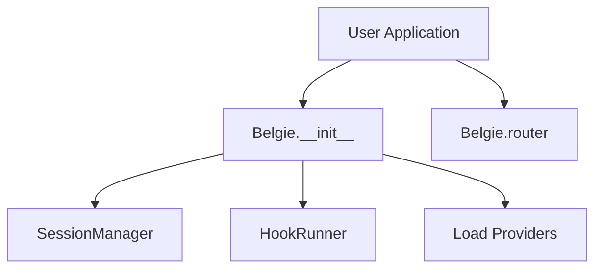
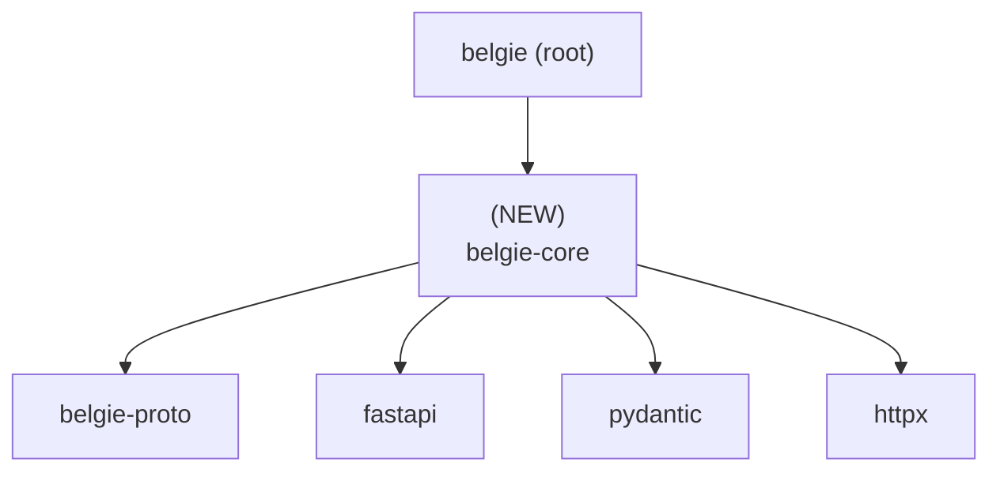

# Design Document: Core Extraction

## Overview

### High-Level Description

This design details the extraction of the core authentication logic from `src/belgie/auth` into a new standalone package
`belgie-core` located in `packages/belgie-core`. This refactoring involves renaming key components (`Auth` to `Belgie`,
`AuthSettings` to `BelgieSettings`, `AuthClient` to `BelgieClient`) to better reflect the library's identity and
structural role. The main `belgie` package will become a thin wrapper or consumer of `belgie-core`, ensuring modularity
and cleaner dependency management.

### Goals

- **Decouple Core Logic**: Isolate the core authentication mechanism into its own package (`belgie-core`).
- **Standardize Naming**: Rename `Auth` to `Belgie`, `AuthSettings` to `BelgieSettings`, and `AuthClient` to
  `BelgieClient` for brand consistency and clarity.
- **Maintain Workspace Structure**: Integrate `belgie-core` into the `uv` workspace alongside `belgie-proto`,
  `belgie-alchemy`, etc.
- **Preserve Functionality**: Ensure all existing authentication flows, providers, and session management work as
  before, but imported from the new package.

### Non-Goals

- **Functional Changes**: No new features or changes to the authentication logic itself (e.g., new providers, changed
  session behavior).
- **Database Schema Changes**: The database models defined in adapters are not changing, only the core logic using them.

## Workflows

### Workflow 1: Package Initialization

#### Description

Users will now initialize `Belgie` (formerly `Auth`) from the `belgie-core` package (or re-exported via `belgie`).

#### Usage Example

```python
# BEFORE
from belgie import Auth, AuthSettings

settings = AuthSettings(secret="...", base_url="...")
auth = Auth(settings=settings, ...)

# AFTER
from belgie_core import Belgie, BelgieSettings
# OR from belgie import Belgie, BelgieSettings (if re-exported)

settings = BelgieSettings(secret="...", base_url="...")
app = Belgie(settings=settings, ...)
```

#### Call Graph



#### Key Components

- **Belgie** (`belgie_core.core.belgie:Belgie`) - Main entry point (formerly `Auth`).
- **BelgieSettings** (`belgie_core.core.settings:BelgieSettings`) - Configuration (formerly `AuthSettings`).
- **BelgieClient** (`belgie_core.core.client:BelgieClient`) - Per-request client (formerly `AuthClient`).

## Dependencies



## Detailed Design

### Module Structure

The code currently in `src/belgie/auth` will be moved to `packages/belgie-core/src/belgie_core`.

```text
packages/belgie-core/
├── pyproject.toml              # Dependencies: fastapi, pydantic, belgie-proto, etc.
├── README.md
└── src/
    └── belgie_core/
        ├── __init__.py         # Exports Belgie, BelgieSettings, etc.
        ├── py.typed
        ├── core/
        │   ├── __init__.py
        │   ├── belgie.py       # Was auth.py. Contains Belgie class.
        │   ├── client.py       # Contains BelgieClient class.
        │   ├── settings.py     # Contains BelgieSettings class.
        │   ├── exceptions.py   # Moved unchanged
        │   └── hooks.py        # Moved unchanged
        ├── providers/          # Moved unchanged
        │   ├── __init__.py
        │   ├── google.py
        │   └── protocols.py
        ├── session/            # Moved unchanged
        │   ├── __init__.py
        │   └── manager.py
        ├── utils/              # Moved unchanged
        │   ├── __init__.py
        │   ├── crypto.py
        │   └── scopes.py
        └── __tests__/          # Moved from src/belgie/auth/__tests__
```

### API Design

#### `packages/belgie-core/src/belgie_core/core/belgie.py`

Renamed from `auth.py`.

```python
# ... imports ...

class Belgie[UserT, AccountT, SessionT, OAuthStateT]:  # Renamed from Auth
    """Main authentication orchestrator for Belgie."""

    def __init__(
        self,
        settings: BelgieSettings,  # Renamed type hint
        adapter: AdapterProtocol[UserT, AccountT, SessionT, OAuthStateT],
        db: DBDependencyProvider,
        providers: Providers | None = None,
        hooks: Hooks | None = None,
    ) -> None:
        # ... implementation ...
        pass

    # ... other methods ...
```

#### `packages/belgie-core/src/belgie_core/core/settings.py`

```python
class BelgieSettings(BaseSettings):  # Renamed from AuthSettings
    # ... implementation ...
    pass
```

#### `packages/belgie-core/src/belgie_core/core/client.py`

```python
@dataclass(frozen=True, slots=True, kw_only=True)
class BelgieClient[...]:  # Renamed from AuthClient
    # ... implementation ...
    pass
```

### Testing Strategy

The existing tests in `src/belgie/auth/__tests__` will be moved to `packages/belgie-core/src/belgie_core/__tests__`.

#### Test Updates

- Imports in tests must be updated from `belgie.auth...` to `belgie_core...`.
- References to `Auth`, `AuthSettings`, `AuthClient` must be updated to `Belgie`, `BelgieSettings`, `BelgieClient`.
- `pyproject.toml` in `belgie-core` needs `pytest` and related dev dependencies.

#### Integration

- The root `pyproject.toml` will include `belgie-core` in the `dev` dependency group (via workspace) to run tests.
- CI workflows may need adjustment if they target specific paths, but `uv run pytest` usually discovers tests.

## Implementation

### Implementation Order

1. **Create Package Structure**: Create `packages/belgie-core` and its basic files (`pyproject.toml`).
2. **Move Code**: Move `src/belgie/auth/*` contents to `packages/belgie-core/src/belgie_core/*`.
3. **Rename Classes & Files**:
   - Rename `auth.py` -> `belgie.py`.
   - Rename classes in `belgie.py`, `settings.py`, `client.py`.
4. **Fix Internal Imports**: Update imports within `belgie-core` to refer to itself (`belgie_core...`) and the new class
   names.
5. **Clean Old Directory**: Remove `src/belgie/auth`.
6. **Update Root Package**:
   - Update `src/belgie/__init__.py` to import from `belgie_core`.
   - Update `src/belgie/alchemy.py` etc. if they depend on `Auth`.
7. **Update Configuration**:
   - Add `belgie-core` to `tool.uv.workspace.members` in root `pyproject.toml`.
   - Add `belgie-core = { workspace = true }` to dependencies.
8. **Verify**: Run tests.

### Tasks

- [ ] **Scaffold `belgie-core`**
  - [ ] Create directory structure
  - [ ] Create `pyproject.toml` with dependencies (copied from root but filtered)
- [ ] **Migrate Code**
  - [ ] Move `core/`
  - [ ] Move `providers/`
  - [ ] Move `session/`
  - [ ] Move `utils/`
  - [ ] Move `__tests__/`
- [ ] **Refactor `belgie-core`**
  - [ ] Rename `core/auth.py` to `core/belgie.py`
  - [ ] Rename `Auth` -> `Belgie`
  - [ ] Rename `AuthSettings` -> `BelgieSettings`
  - [ ] Rename `AuthClient` -> `BelgieClient`
  - [ ] Update imports in all moved files (replace `belgie.auth` with `belgie_core`)
- [ ] **Update Root `belgie`**
  - [ ] Delete `src/belgie/auth`
  - [ ] Update `src/belgie/__init__.py` to re-export from `belgie_core`
  - [ ] Update other root modules if they import `belgie.auth`
- [ ] **Update Workspace**
  - [ ] Edit root `pyproject.toml` (add member, add dependency)
  - [ ] Sync workspace (`uv sync`)
- [ ] **Test**
  - [ ] Run `uv test`
  - [ ] Fix any broken imports in tests

## Libraries

### New Libraries

| Library | Version | Purpose | Dependency Group | Command |
|---------|---------|---------|------------------|---------|
| `belgie-core` | `workspace` | Core authentication logic | `project` | N/A (Workspace member) |

## Open Questions

1. Should `src/belgie` be deprecated entirely in favor of users importing directly from `belgie-core`?
   - *Decision*: For now, keep `belgie` as a convenience wrapper/meta-package to minimize breaking changes for existing
      users (besides the class renames), or at least to provide a single entry point. The prompt implies `belgie` stays
      as the main package.
