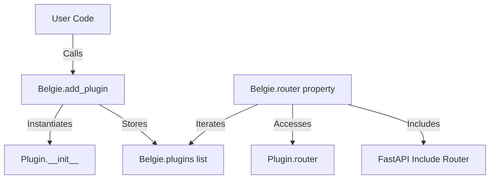
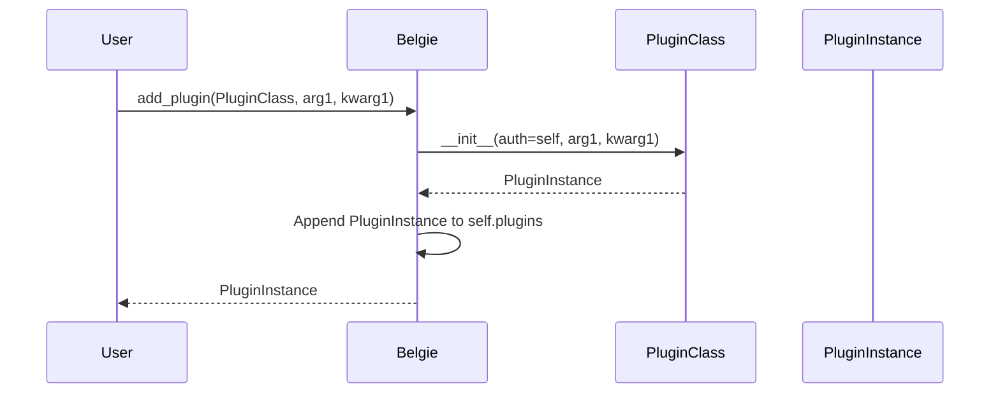
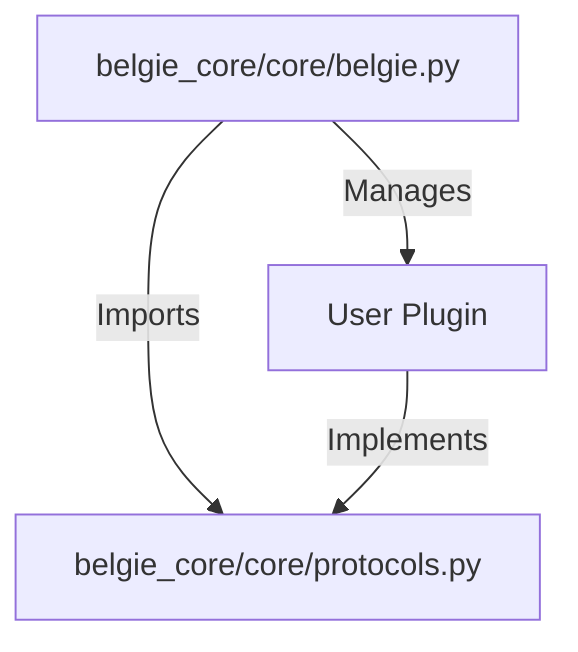

# Design Document: Plugin System

## Overview

### High-Level Description

This design introduces a generic plugin system for `Belgie`, allowing developers to extend the core functionality with
modular components. A new `Plugin` protocol will be defined, and the `Belgie` class will be updated to support
registering these plugins. Registered plugins can provide their own `APIRouter`s, which will be automatically integrated
into the main `Belgie` router.

### Goals

- Define a standard `Plugin` protocol that extensions must implement.
- Implement a `Belgie.add_plugin` method to easily register and instantiate plugins.
- Ensure plugins can expose their own API routes via a `router` property.
- Automatically include plugin routers into the main `Belgie` application router.
- Maintain type safety for plugin registration.

### Non-Goals

- Implementing a dynamic plugin loader (e.g., from entry points or files); plugins will be added explicitly via code.
- Removing or replacing the existing `OAuthProviderProtocol` immediately (though this plugin system could eventually
  supersede it).

## Workflows

### Workflow 1: Registering a Plugin

#### Description

A developer defines a custom plugin class implementing the `Plugin` protocol. They then instantiate the `Belgie`
application and use `add_plugin` to register the custom plugin. The `Belgie` instance instantiates the plugin, passing
itself and any additional arguments to the plugin's initializer.

#### Usage Example

```python
from typing import Protocol, runtime_checkable
from fastapi import APIRouter
from belgie_core.core.belgie import Belgie
from belgie_core.core.protocols import Plugin

class MyCustomPlugin:
    def __init__(self, auth: Belgie, custom_setting: str):
        self.auth = auth
        self.custom_setting = custom_setting

    @property
    def router(self) -> APIRouter:
        router = APIRouter()
        @router.get("/custom")
        def custom_route():
            return {"message": self.custom_setting}
        return router

# Usage
belgie = Belgie(...)
plugin_instance = belgie.add_plugin(MyCustomPlugin, custom_setting="hello")
# plugin_instance is an instance of MyCustomPlugin
# The route /custom is now available under the belgie router
```

### Call Graph



#### Sequence Diagram



#### Key Components

- **Belgie Class**: The central registry for plugins.
- **Plugin Protocol**: The interface definition for valid plugins.
- **add_plugin Method**: The mechanism to instantiate and store plugins.
- **router Property**: The aggregation point for all sub-routers.

## Dependencies



## Detailed Design

### Module Structure

```text
packages/belgie-core/src/belgie_core/
├── core/
│   ├── belgie.py       # Updated with add_plugin and router logic
│   ├── protocols.py    # Updated with Plugin protocol
│   └── ...
└── ...
```

### API Design

#### `packages/belgie-core/src/belgie_core/core/protocols.py`

```python
from typing import Protocol, runtime_checkable, Any
from fastapi import APIRouter

# Import Belgie conditionally to avoid circular imports if necessary,
# or use strict forward references.
from typing import TYPE_CHECKING
if TYPE_CHECKING:
    from belgie_core.core.belgie import Belgie

@runtime_checkable
class Plugin(Protocol):
    """
    Protocol for Belgie plugins.
    """
    def __init__(self, auth: "Belgie", *args: Any, **kwargs: Any) -> None:
        """
        Initialize the plugin.

        Args:
            auth: The parent Belgie instance.
            *args: Additional positional arguments.
            **kwargs: Additional keyword arguments.
        """
        ...

    @property
    def router(self) -> APIRouter:
        """
        Return the FastAPI router for this plugin.
        """
        ...
```

#### `packages/belgie-core/src/belgie_core/core/belgie.py`

```python
from typing import TypeVar, List
from belgie_core.core.protocols import Plugin

# P is a TypeVar bound to the Plugin protocol
P = TypeVar("P", bound=Plugin)

class Belgie(...):
    def __init__(self, ...):
        # ... existing init ...
        self.plugins: List[Plugin] = []

    def add_plugin(self, plugin_cls: type[P], *args, **kwargs) -> P:
        """
        Register and instantiate a plugin.

        Args:
            plugin_cls: The class of the plugin to register.
            *args: Positional arguments to pass to the plugin constructor.
            **kwargs: Keyword arguments to pass to the plugin constructor.

        Returns:
            The instantiated plugin.
        """
        plugin_instance = plugin_cls(self, *args, **kwargs)
        self.plugins.append(plugin_instance)
        return plugin_instance

    @property # cached_property
    def router(self) -> APIRouter:
        # ... existing router creation ...

        # New logic: include plugin routers
        for plugin in self.plugins:
            # We assume plugins might provide a router.
            # If the protocol enforces it, we just include it.
            # Ideally, we verify it's not None if the protocol allows optional router.
            main_router.include_router(plugin.router)

        return main_router
```

## Testing Strategy

The testing strategy will focus on unit testing the registration mechanics and integration testing the router inclusion.

### Unit Tests

- **File**: `packages/belgie-core/src/belgie_core/__tests__/test_plugins.py` (New file)
- **Tests**:
  - `test_add_plugin_stores_instance`: Verify `add_plugin` instantiates the class and adds it to the list.
  - `test_add_plugin_passes_args`: Verify `*args` and `**kwargs` are passed to `__init__`.
  - `test_add_plugin_returns_instance`: Verify the method returns the created instance.
  - `test_add_plugin_clears_router_cache`: Verify that adding a plugin invalidates the cached `router` property.

### Integration Tests

- **File**: `packages/belgie-core/src/belgie_core/__tests__/test_plugins_integration.py` (New file)
- **Tests**:
  - `test_plugin_router_included`: Create a dummy plugin with a route. Add it to Belgie. Use `TestClient` to verify
      the route is accessible.
  - `test_multiple_plugins`: Verify multiple plugins can be added and their routes do not conflict (assuming different
      paths).

## Implementation

### Implementation Order

1. **Define Protocol**: Update `packages/belgie-core/src/belgie_core/core/protocols.py` to include the `Plugin`
   protocol.
. **Update Belgie Class**: Modify `packages/belgie-core/src/belgie_core/core/belgie.py` to add `self.plugins`,
   `add_plugin`, and update `router`.
. **Add Tests**: Create the new test files and implement the test cases.
2. **Verify**: Run the tests to ensure functionality and no regressions.

### Tasks

- [ ] Add `Plugin` protocol to `belgie-core`.
- [ ] Add `add_plugin` method to `Belgie` class.
- [ ] Update `Belgie.router` to include plugin routers.
- [ ] Create unit tests for plugin registration.
- [ ] Create integration tests for plugin routing.

## Open Questions

- Should plugins support `on_startup` / `on_shutdown` lifecycle events? (Postponed for future enhancements).
- Should plugins have a namespace/prefix automatically applied? (Currently, left to the plugin's router definition).

## Future Enhancements

- **Plugin Configuration**: Standardize how plugins accept configuration (e.g., Pydantic models).
- **Lifecycle Hooks**: Add `on_startup`, `on_shutdown` methods to the Protocol.
- **Plugin Discovery**: Mechanism to auto-discover plugins installed in the environment.

## Libraries

### New Libraries

- None.

### Existing Libraries

- `fastapi` (for `APIRouter`)
- `typing` (for `Protocol`, `runtime_checkable`)

## Alternative Approaches

### Approach 1: Entry Points

Use Python's `entry_points` metadata to discover plugins.

- **Pros**: Decoupled, auto-discovery.
- **Cons**: Harder to control order, explicit registration is often clearer for this type of library.
- **Reason for rejection**: Explicit `add_plugin` is simpler and more transparent for the initial implementation.
