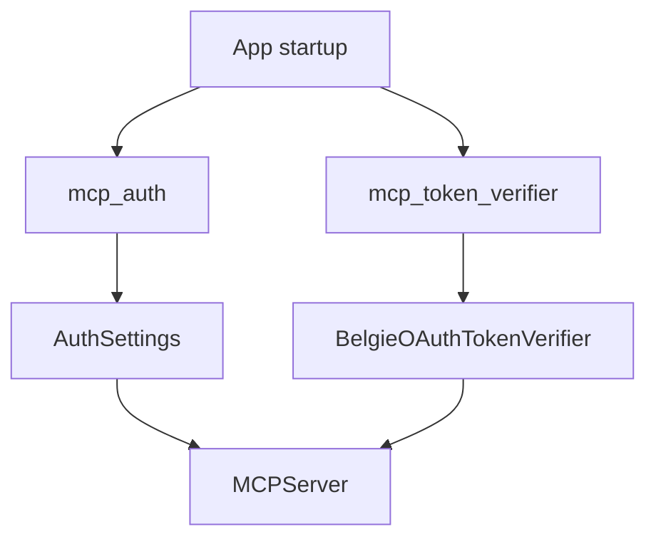
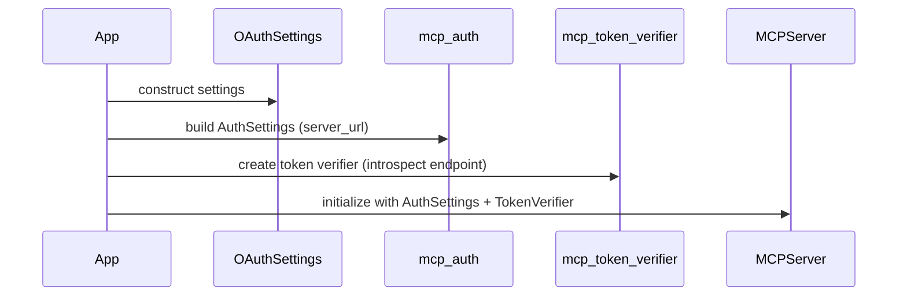
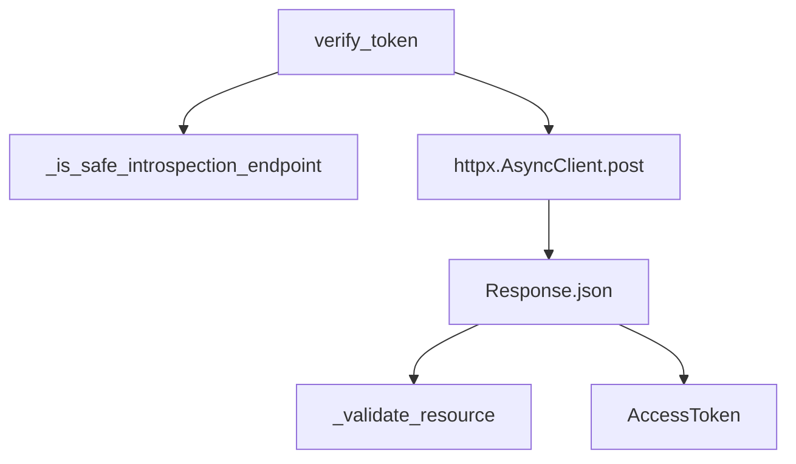
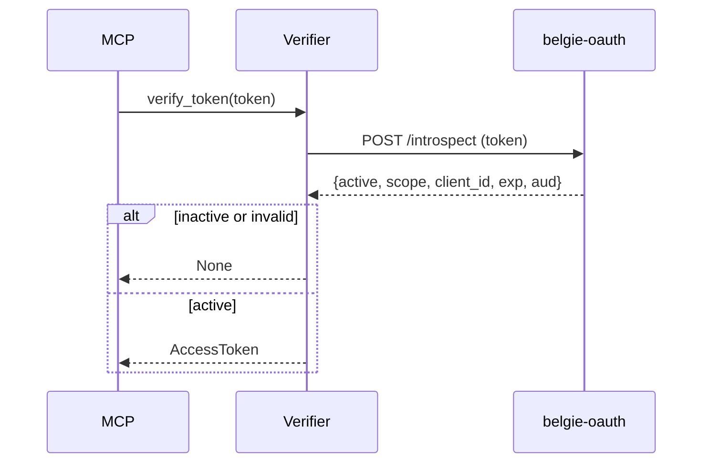
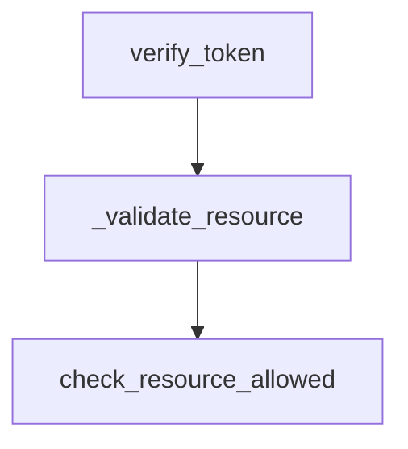
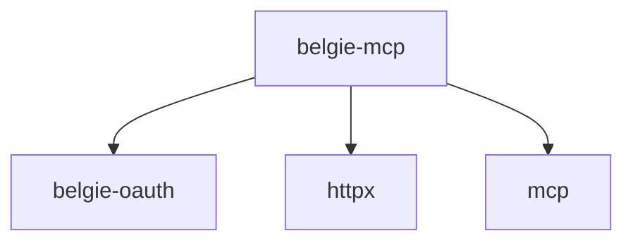

# Design Document: belgie-mcp OAuth Support

## Overview

### High-Level Description

Add first-class OAuth Resource Server support to `belgie-mcp` by introducing a token verifier that introspects tokens
against the `belgie-oauth` authorization server. The new verifier plugs into MCP’s `TokenVerifier` interface and can
optionally enforce RFC 8707 resource validation. A small helper builds MCP `AuthSettings` automatically from
`belgie_oauth.settings.OAuthSettings`, keeping configuration consistent between `belgie-oauth` and `belgie-mcp`.

### Goals

- Provide a `BelgieOAuthTokenVerifier` that validates access tokens via `/introspect` on `belgie-oauth`.
- Automatically construct MCP `AuthSettings` from `OAuthSettings` plus a `server_url` for the MCP resource server.
- Support optional RFC 8707 resource validation for strict audience/resource matching.
- Keep the public API surface minimal and consistent with existing Belgie patterns.
- Add unit tests for token verification and settings derivation.

### Non-Goals

- Implement OAuth Authorization Server features in `belgie-mcp`.
- Add JWT validation or signature verification (introspection only in v1).
- Add OAuth metadata discovery or remote configuration fetch.
- Provide caching, retries, or circuit-breaker logic for introspection requests in v1.

## Workflows

### Workflow 1: MCP Server Startup with belgie-oauth Settings

#### Description

An application configures `belgie-oauth` with `OAuthSettings`, then builds `AuthSettings` and a `TokenVerifier` for a
given MCP `server_url`. The helpers provide both pieces for MCP server initialization.

#### Usage Example

```python
from mcp.server.mcpserver import MCPServer

from belgie_mcp.verifier import mcp_auth, mcp_token_verifier
from belgie_oauth.settings import OAuthSettings

settings = OAuthSettings(
    issuer_url="https://auth.example.com/auth/oauth",
    redirect_uris=["https://app.example.com/callback"],
)

auth = mcp_auth(
    settings,
    server_url="https://mcp.example.com/mcp",
)
token_verifier = mcp_token_verifier(
    settings,
    server_url="https://mcp.example.com/mcp",
)

server = MCPServer(
    name="Belgie MCP",
    token_verifier=token_verifier,
    auth=auth,
)
```

#### Call Graph



#### Sequence Diagram



#### Key Components

- **BelgieOAuthTokenVerifier** (`packages/belgie-mcp/src/belgie_mcp/verifier.py`) - Introspection-based verifier.
- **mcp_auth** (`packages/belgie-mcp/src/belgie_mcp/verifier.py`) - Builds `AuthSettings`.
- **mcp_token_verifier** (`packages/belgie-mcp/src/belgie_mcp/verifier.py`) - Builds `TokenVerifier`.
- **OAuthSettings** (`packages/belgie-oauth/src/belgie_oauth/settings.py`) - AS configuration source of truth.

### Workflow 2: Token Verification via OAuth Introspection

#### Description

During MCP requests, the server passes bearer tokens to `BelgieOAuthTokenVerifier.verify_token()`. The verifier calls
`/introspect`, validates the response, and returns an `AccessToken` with scopes and resource indicators.

#### Usage Example

```python
verifier = BelgieOAuthTokenVerifier(
    introspection_endpoint="https://auth.example.com/auth/oauth/introspect",
    server_url="https://mcp.example.com/mcp",
)

access_token = await verifier.verify_token("bearer-token")
if access_token is None:
    raise PermissionError("invalid token")
```

#### Call Graph



#### Sequence Diagram



#### Key Components

- **BelgieOAuthTokenVerifier.verify_token** - Performs HTTP POST to `/introspect` and maps the response.
- **mcp.shared.auth_utils** - Resource validation helpers (`check_resource_allowed`, `resource_url_from_server_url`).

### Workflow 3: Strict Resource Validation (RFC 8707)

#### Description

When `oauth_strict=True` is enabled in `mcp_token_verifier`, the verifier requires a valid `aud` claim matching
`server_url` using hierarchical resource matching. Tokens without a valid resource indicator are rejected.

#### Usage Example

```python
token_verifier = mcp_token_verifier(
    settings,
    server_url="https://mcp.example.com/mcp",
    oauth_strict=True,
)
```

#### Call Graph



#### Key Components

- **BelgieOAuthTokenVerifier._validate_resource** - Enforces RFC 8707 audience matching when enabled.

## Dependencies



## Detailed Design

### Module Structure

```text
packages/belgie-mcp/
├── pyproject.toml
└── src/belgie_mcp/
    ├── __init__.py
    ├── verifier.py                  # BelgieOAuthTokenVerifier + mcp_auth + mcp_token_verifier
    └── __tests__/
        └── test_verifier.py          # Unit tests for verifier + helper
src/belgie/
└── mcp.py                            # Re-exports for belgie consumers
```

### API Design

#### `packages/belgie-mcp/src/belgie_mcp/verifier.py`

```python
from dataclasses import dataclass

from belgie_oauth.settings import OAuthSettings
from mcp.server.auth.settings import AuthSettings
from mcp.server.auth.provider import TokenVerifier

class BelgieOAuthTokenVerifier(TokenVerifier):
    def __init__(self, introspection_endpoint: str, server_url: str, validate_resource: bool = False) -> None: ...

    async def verify_token(self, token: str) -> AccessToken | None: ...
    # 1. Reject unsafe introspection endpoints (https or localhost only).
    # 2. POST form data to /introspect with token.
    # 3. Return None on non-200 or inactive response.
    # 4. If oauth_strict, validate aud against server_url via RFC 8707 helpers.
    # 5. Map active responses to AccessToken fields.


def mcp_auth(
    settings: OAuthSettings,
    *,
    server_url: str,
    required_scopes: list[str] | None = None,
) -> AuthSettings: ...
# 1. Require settings.issuer_url (raise ValueError if missing).
# 2. Default scopes from settings.default_scope split by spaces.
# 3. Return AuthSettings.

def mcp_token_verifier(
    settings: OAuthSettings,
    *,
    server_url: str,
    introspection_endpoint: str | None = None,
    oauth_strict: bool = False,
) -> TokenVerifier: ...
# 1. Require settings.issuer_url (raise ValueError if missing).
# 2. Build introspection endpoint from issuer_url unless overridden.
# 3. Return BelgieOAuthTokenVerifier.
```

#### `packages/belgie-mcp/src/belgie_mcp/__init__.py`

```python
from belgie_mcp.verifier import BelgieOAuthTokenVerifier, mcp_auth, mcp_token_verifier
```

#### `src/belgie/mcp.py`

```python
from belgie_mcp import BelgieOAuthTokenVerifier, mcp_auth, mcp_token_verifier
```

## Testing Strategy

- **BelgieOAuthTokenVerifier** (`test_verifier.py`):
  - `active=false` returns `None`.
  - non-200 response returns `None`.
  - `active=true` returns `AccessToken` with scopes parsed and `aud` mapped to `resource`.
  - strict resource validation rejects mismatched `aud` values.
- **mcp_auth** (`test_verifier.py`):
- **mcp_token_verifier** (`test_verifier.py`):
  - uses `OAuthSettings.issuer_url` to derive `introspection_endpoint`.
  - respects explicit `required_scopes` and `introspection_endpoint` overrides.
  - raises `ValueError` when `issuer_url` is missing.
- **Integration** (`test_verifier.py`):
  - instantiate `MCPServer` with the bundle to confirm wiring accepts `AuthSettings` and `TokenVerifier`.

## Implementation

### Implementation Order

1. Update `packages/belgie-mcp/pyproject.toml` to depend on `belgie-oauth` and `httpx`.
2. Replace `belgie_mcp.verifier` with `BelgieOAuthTokenVerifier`, `mcp_auth`, and `mcp_token_verifier`.
3. Update package exports in `packages/belgie-mcp/src/belgie_mcp/__init__.py` and `src/belgie/mcp.py`.
4. Add unit tests under `packages/belgie-mcp/src/belgie_mcp/__tests__/`.
5. Add this design document.

### Tasks

- [ ] Add `belgie-oauth` and `httpx` dependencies to `belgie-mcp`.
- [ ] Implement `BelgieOAuthTokenVerifier`.
- [ ] Implement `mcp_auth` and `mcp_token_verifier`.
- [ ] Re-export new APIs from `belgie_mcp` and `belgie.mcp`.
- [ ] Add unit tests for verifier and helper.
- [ ] Add integration-style MCPServer instantiation test.
- [ ] Document the design in `design/012-belgie-mcp-oauth-support.md`.

## Open Questions

- None.

## Future Enhancements

- Add OAuth metadata discovery from `/.well-known/oauth-authorization-server`.
- Add request retry/backoff and optional caching for introspection responses.
- Support alternative token validation strategies (JWT verification).

## Libraries

### New Libraries

| Library | Version | Purpose | Dependency Group | Command |
|---------|---------|---------|------------------|---------|
| `belgie-oauth` | `workspace` | Reuse OAuth settings and URL helpers | core | `uv add belgie-oauth` |
| `httpx` | `>=0.24` | Async HTTP client for introspection | core | `uv add httpx` |

### Existing Libraries

| Library | Current Version | Purpose | Dependency Group |
|---------|-----------------|---------|------------------|
| `mcp` | `>=1.26.0` | MCP server and auth types | core |

## Alternative Approaches

### Approach 1: Metadata Discovery

**Description**: Fetch `/.well-known/oauth-authorization-server` at startup and derive issuer, introspection endpoint,
scopes, and other metadata dynamically.

**Pros**:

- Reduces manual configuration duplication.
- Keeps MCP in sync with Authorization Server metadata.

**Cons**:

- Requires network access at startup and caching.
- Adds failure modes for discovery unavailability.

**Why not chosen**: This design prioritizes deterministic local configuration and avoids runtime dependencies in v1.

### Approach 2: ProviderTokenVerifier

**Description**: Implement a verifier that directly uses the `SimpleOAuthProvider` in `belgie-oauth` rather than token
introspection.

**Pros**:

- Fewer HTTP calls inside the same process.
- Simplifies testing for co-located deployments.

**Cons**:

- Couples `belgie-mcp` to the provider internals rather than stable AS endpoints.
- Less compatible with AS/RS separation.

**Why not chosen**: Introspection-based verification aligns with standard AS/RS separation and keeps responsibilities
clear.
