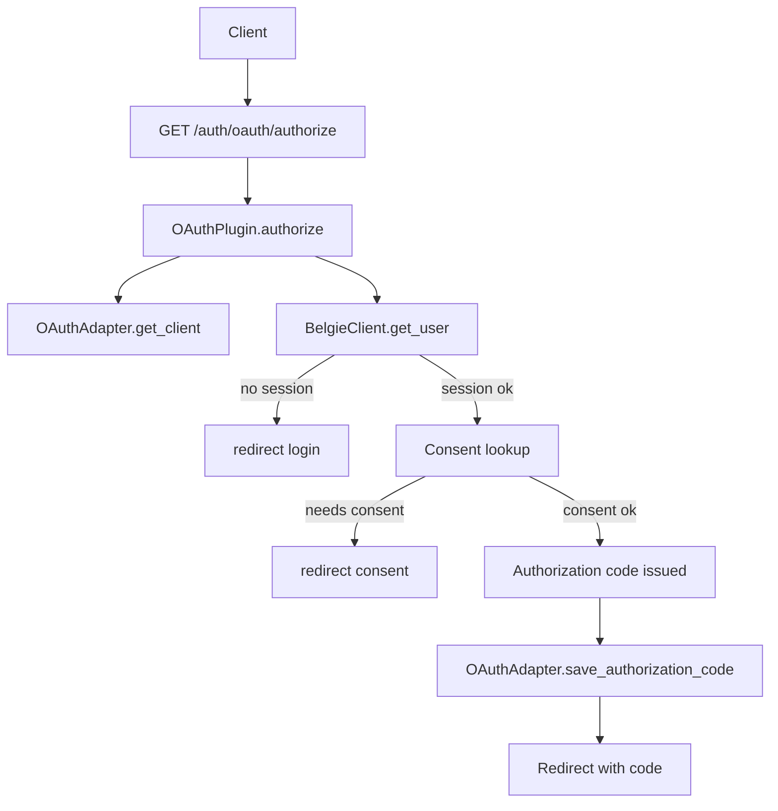
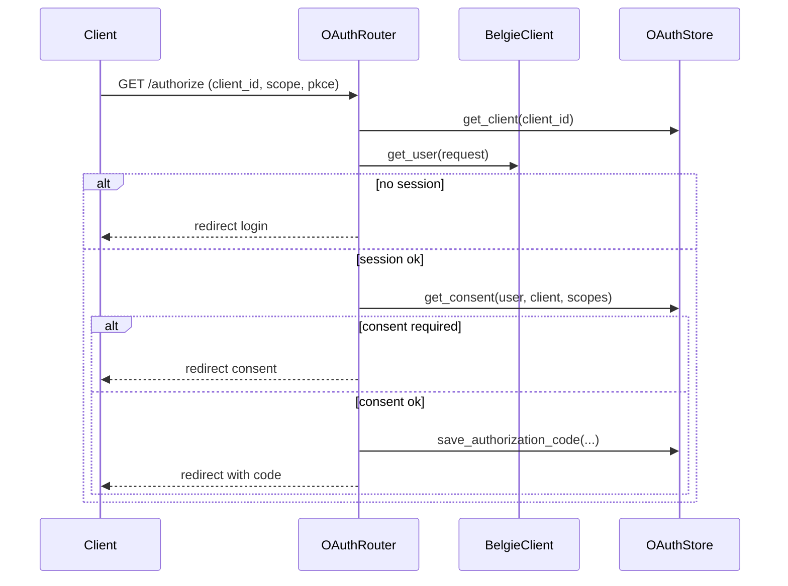
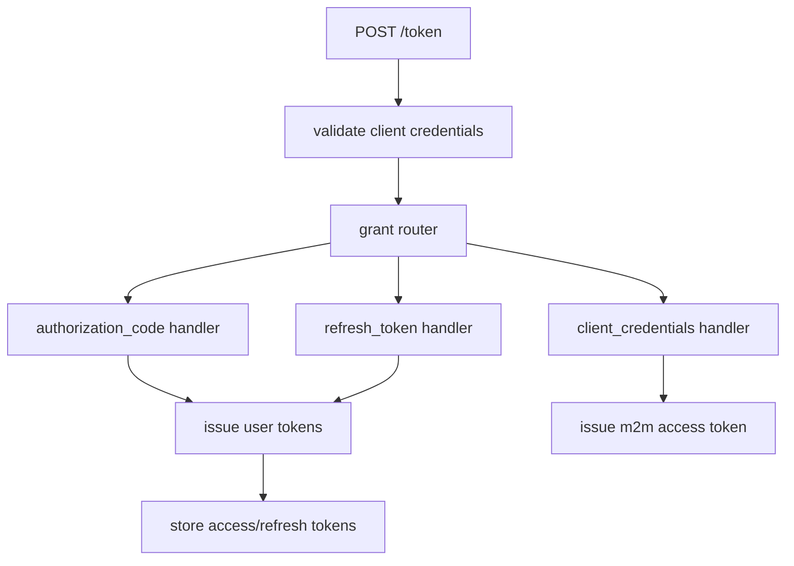
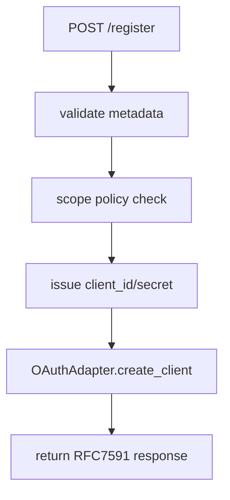
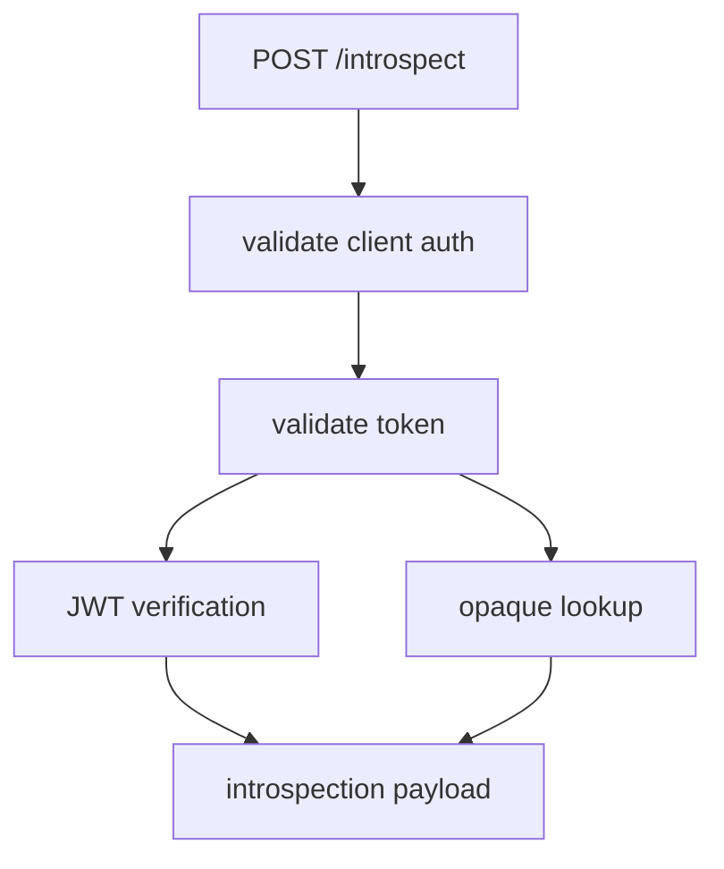
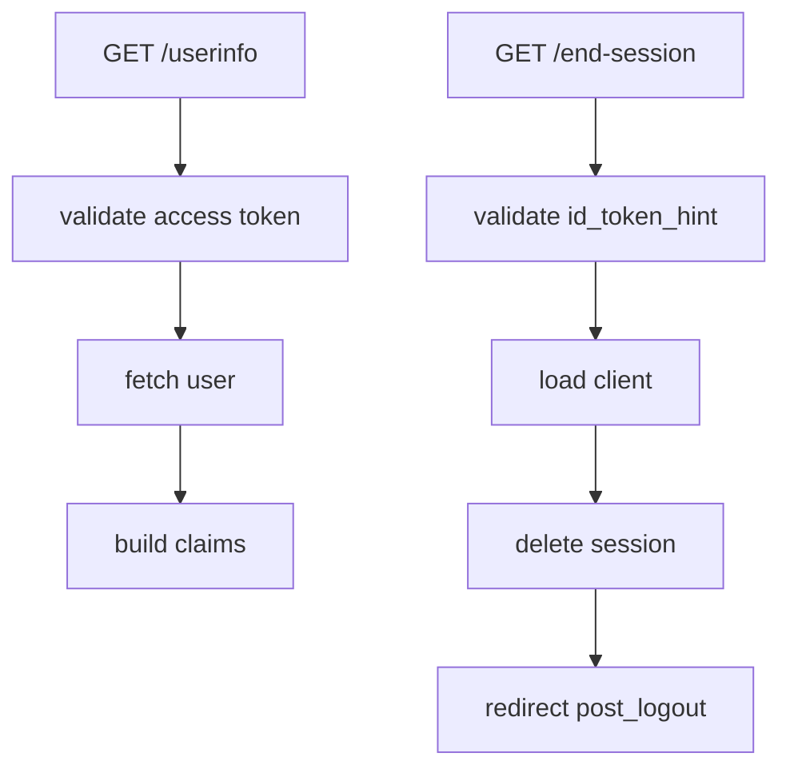
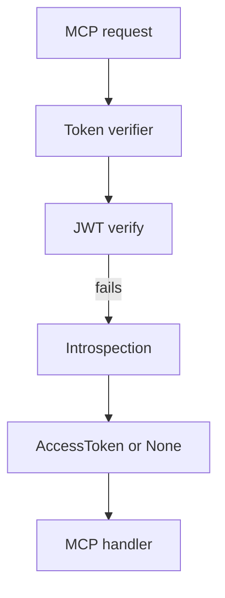
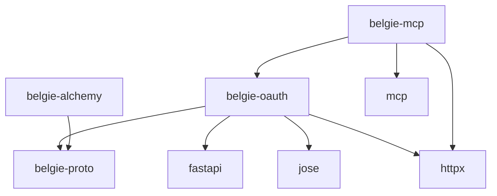

# Design Document: OAuth Provider Parity

## Overview

### High-Level Description

This design brings `belgie-oauth` and `belgie-mcp` to full functional parity with the `better-auth` OAuth provider
specification captured in `out.txt`. The work adds a backend-agnostic OAuth storage adapter, DB-backed models for
clients/tokens/consents, and the full OAuth 2.1 + OIDC surface area (authorization, token, introspection, revocation,
registration, consent, userinfo, RP-initiated logout, JWKS). It also extends the MCP helper layer with WWW-Authenticate
header handling and JWT verification as a fallback or alternative to introspection.

The intent is to keep Belgie’s existing plugin system intact while expanding the OAuth feature set, and to keep storage
pluggable with an in-memory fallback for tests and demos.

### Goals

- Provide a backend-agnostic OAuth storage adapter with DB-backed implementations.
- Implement OAuth 2.1 + OIDC endpoints and metadata parity with `better-auth`.
- Add consent, client management, and dynamic client registration flows.
- Support JWT and opaque access tokens with JWKS discovery.
- Extend MCP helpers to emit `WWW-Authenticate` resource metadata and verify JWTs.
- Preserve the existing default route prefix (`/oauth`) and add configurable `/oauth2` support.

### Non-Goals

- Implement implicit/password flows (explicitly excluded by OAuth 2.1).
- Provide multi-tenant support beyond a single issuer per Belgie instance.
- Add external OAuth login providers or identity federation features.
- Introduce a new configuration system outside existing `BelgieSettings` and `OAuthSettings`.

## Workflows

### Workflow 1: Authorization Code Flow with Consent and Prompts

#### Description

A client initiates `/authorize` with PKCE and prompt values. The server validates the client and scopes, verifies the
redirect URI, checks session state, and routes the user through login/consent/select-account/post-login steps if
required. The flow issues a signed authorization code and stores metadata for later token exchange.

#### Usage Example

```python
from fastapi import FastAPI

from belgie_core import Belgie, BelgieSettings
from belgie_oauth import OAuthPlugin, OAuthSettings

belgie = Belgie(
    settings=BelgieSettings(secret="secret", base_url="https://auth.example.com"),
    adapter=adapter,
    db=db,
)

oauth_settings = OAuthSettings(
    base_url="https://auth.example.com",
    route_prefix="/oauth",
    login_url="/sign-in",
    consent_url="/consent",
    scopes=["openid", "profile", "email", "offline_access"],
)

belgie.add_plugin(OAuthPlugin, oauth_settings)
app = FastAPI()
app.include_router(belgie.router())
```

#### Call Graph



#### Sequence Diagram



#### Key Components

- **Authorize endpoint** (`packages/belgie-oauth/src/belgie_oauth/endpoints/authorize.py`) - Validates request, prompts.
- **OAuth adapter** (`packages/belgie-proto/src/belgie_proto/oauth_adapter.py`) - Client and consent fetch.
- **Authorization code store** (`packages/belgie-oauth/src/belgie_oauth/storage/*`) - Token persistence.

### Workflow 2: Token Exchange (authorization_code / refresh_token / client_credentials)

#### Description

The `/token` endpoint validates client credentials (basic or post), decodes and validates the authorization code or
refresh token, checks scopes, and issues access/refresh/id tokens. JWT access tokens are issued when a resource
parameter is present and JWT is enabled; otherwise, opaque tokens are stored in DB.

#### Usage Example

```python
import httpx

response = httpx.post(
    "https://auth.example.com/auth/oauth/token",
    data={
        "grant_type": "authorization_code",
        "client_id": "client-123",
        "code": "auth-code",
        "redirect_uri": "https://app.example.com/callback",
        "code_verifier": "verifier",
    },
)
response.raise_for_status()
print(response.json())
```

#### Call Graph



#### Key Components

- **Token endpoint** (`packages/belgie-oauth/src/belgie_oauth/endpoints/token.py`) - Grant router.
- **JWT signing** (`packages/belgie-oauth/src/belgie_oauth/jwt.py`) - Access/id token creation.
- **OAuth adapter** - Access/refresh token CRUD.

### Workflow 3: Dynamic Client Registration

#### Description

Clients register with `/register`, supplying metadata. The server validates metadata, enforces scope policy, determines
public vs confidential, issues client credentials, and persists a new OAuth client record.

#### Usage Example

```python
response = httpx.post(
    "https://auth.example.com/auth/oauth/register",
    json={
        "redirect_uris": ["https://app.example.com/callback"],
        "token_endpoint_auth_method": "client_secret_post",
        "scope": "openid profile",
    },
)
```

#### Call Graph



#### Key Components

- **Registration endpoint** (`packages/belgie-oauth/src/belgie_oauth/endpoints/register.py`).
- **Client validation helpers** (`packages/belgie-oauth/src/belgie_oauth/validation/client.py`).

### Workflow 4: Introspection and Revocation

#### Description

The `/introspect` endpoint authenticates the client, then validates access or refresh tokens as JWT or opaque tokens.
The `/revoke` endpoint invalidates opaque access tokens and refresh tokens (including replay revoke behavior).

#### Usage Example

```python
response = httpx.post(
    "https://auth.example.com/auth/oauth/introspect",
    data={
        "client_id": "client-123",
        "client_secret": "secret",
        "token": "access-token",
    },
)
```

#### Call Graph



#### Key Components

- **Introspection endpoint** (`packages/belgie-oauth/src/belgie_oauth/endpoints/introspect.py`).
- **Revocation endpoint** (`packages/belgie-oauth/src/belgie_oauth/endpoints/revoke.py`).

### Workflow 5: OIDC Userinfo and RP-Initiated Logout

#### Description

For OIDC-enabled scopes, `/userinfo` returns profile and email claims. `/end-session` verifies `id_token_hint`,
validates client logout permissions, deletes sessions, and redirects to an allowed post-logout URI.

#### Usage Example

```python
response = httpx.get(
    "https://auth.example.com/auth/oauth/userinfo",
    headers={"Authorization": "Bearer access-token"},
)
```

#### Call Graph



#### Key Components

- **Userinfo endpoint** (`packages/belgie-oauth/src/belgie_oauth/endpoints/userinfo.py`).
- **End-session endpoint** (`packages/belgie-oauth/src/belgie_oauth/endpoints/logout.py`).

### Workflow 6: MCP Unauthorized Responses and Token Verification

#### Description

When an MCP resource rejects a token, it responds with `WWW-Authenticate` including a `resource_metadata` URL. The
resource metadata endpoint returns RFC9728 metadata. The verifier checks JWTs when possible and falls back to
introspection.

#### Usage Example

```python
from belgie_mcp.mcp import mcp_handler

handler = mcp_handler(
    verify_options={"issuer": issuer, "audience": resource},
    on_request=resource_handler,
)
```

#### Call Graph



#### Key Components

- **MCP handler** (`packages/belgie-mcp/src/belgie_mcp/mcp.py`).
- **Token verifier** (`packages/belgie-mcp/src/belgie_mcp/verifier.py`).

## Dependencies



## Detailed Design

### Module Structure

```text
packages/
├── belgie-proto/
│   └── src/belgie_proto/
│       ├── oauth_adapter.py              # OAuthAdapterProtocol (NEW)
│       ├── oauth_client.py               # OAuthClientProtocol (NEW)
│       ├── oauth_authorization_code.py   # OAuthAuthorizationCodeProtocol (NEW)
│       ├── oauth_access_token.py         # OAuthAccessTokenProtocol (NEW)
│       ├── oauth_refresh_token.py        # OAuthRefreshTokenProtocol (NEW)
│       ├── oauth_consent.py              # OAuthConsentProtocol (NEW)
│       └── __init__.py                   # re-exports
├── belgie-oauth/
│   └── src/belgie_oauth/
│       ├── plugin.py                     # OAuthPlugin (expanded endpoints)
│       ├── settings.py                   # OAuthSettings (expanded options)
│       ├── storage/
│       │   ├── base.py                   # adapter contracts + common helpers
│       │   └── memory.py                 # InMemoryOAuthStore
│       ├── jwt.py                        # JWT/JWKS helpers
│       ├── metadata.py                   # RFC8414/OIDC metadata
│       ├── endpoints/
│       │   ├── authorize.py
│       │   ├── token.py
│       │   ├── register.py
│       │   ├── consent.py
│       │   ├── continue.py
│       │   ├── introspect.py
│       │   ├── revoke.py
│       │   ├── userinfo.py
│       │   └── logout.py
│       ├── admin/
│       │   ├── clients.py                # CRUD + rotate secret
│       │   └── consents.py               # CRUD
│       └── utils/
│           ├── tokens.py                 # hashing, prefixes
│           ├── clients.py                # validation helpers
│           └── prompts.py                # prompt parsing + signing
├── belgie-alchemy/
│   └── src/belgie_alchemy/
│       ├── oauth_models.py               # SQLAlchemy OAuth models (NEW)
│       └── oauth_adapter.py              # SQLAlchemy OAuth adapter (NEW)
└── belgie-mcp/
    └── src/belgie_mcp/
        ├── mcp.py                        # WWW-Authenticate + handler
        ├── metadata.py                   # RFC9728 metadata builder
        └── verifier.py                   # JWT + introspection verifier
```

### API Design

#### `packages/belgie-proto/src/belgie_proto/oauth_adapter.py`

OAuth adapter protocol used by `belgie-oauth` and `belgie-alchemy`.

```python
from typing import Protocol

from belgie_proto.oauth_access_token import OAuthAccessTokenProtocol
from belgie_proto.oauth_authorization_code import OAuthAuthorizationCodeProtocol
from belgie_proto.oauth_client import OAuthClientProtocol
from belgie_proto.oauth_consent import OAuthConsentProtocol
from belgie_proto.oauth_refresh_token import OAuthRefreshTokenProtocol

class OAuthAdapterProtocol(Protocol):
    async def create_oauth_client(self, session, client: dict) -> OAuthClientProtocol: ...
    async def get_oauth_client(self, session, client_id: str) -> OAuthClientProtocol | None: ...
    async def update_oauth_client(self, session, client_id: str, updates: dict) -> OAuthClientProtocol | None: ...
    async def delete_oauth_client(self, session, client_id: str) -> bool: ...

    async def create_authorization_code(self, session, data: dict) -> OAuthAuthorizationCodeProtocol: ...
    async def get_authorization_code(self, session, code: str) -> OAuthAuthorizationCodeProtocol | None: ...
    async def delete_authorization_code(self, session, code: str) -> bool: ...

    async def create_access_token(self, session, data: dict) -> OAuthAccessTokenProtocol: ...
    async def get_access_token(self, session, token: str) -> OAuthAccessTokenProtocol | None: ...
    async def delete_access_token(self, session, token: str) -> bool: ...

    async def create_refresh_token(self, session, data: dict) -> OAuthRefreshTokenProtocol: ...
    async def get_refresh_token(self, session, token: str) -> OAuthRefreshTokenProtocol | None: ...
    async def revoke_refresh_token(self, session, token_id: str) -> bool: ...

    async def create_consent(self, session, data: dict) -> OAuthConsentProtocol: ...
    async def get_consent(self, session, consent_id: str) -> OAuthConsentProtocol | None: ...
    async def list_consents(self, session, user_id: str) -> list[OAuthConsentProtocol]: ...
    async def update_consent(self, session, consent_id: str, updates: dict) -> OAuthConsentProtocol | None: ...
    async def delete_consent(self, session, consent_id: str) -> bool: ...
```

#### `packages/belgie-oauth/src/belgie_oauth/settings.py`

Extend settings to cover all OAuth/OIDC behaviors.

```python
from pydantic import AnyHttpUrl, AnyUrl, Field, SecretStr
from pydantic_settings import BaseSettings

class OAuthSettings(BaseSettings):
    base_url: AnyHttpUrl | None = None
    route_prefix: str = "/oauth"

    login_url: str | None = None
    consent_url: str | None = None
    post_login_url: str | None = None
    select_account_url: str | None = None
    end_session_url: str | None = None

    scopes: list[str] = ["openid", "profile", "email", "offline_access"]
    default_scope: str = "user"
    grant_types: list[str] = ["authorization_code", "refresh_token", "client_credentials"]

    access_token_ttl_seconds: int = 3600
    refresh_token_ttl_seconds: int = 2592000
    authorization_code_ttl_seconds: int = 600

    enable_jwt: bool = True
    jwt_issuer: AnyHttpUrl | None = None
    jwks_url: AnyHttpUrl | None = None
    jwks_key_path: str | None = None

    allow_dynamic_client_registration: bool = False
    allow_unauthenticated_client_registration: bool = False
    client_registration_allowed_scopes: list[str] | None = None
    client_registration_default_scopes: list[str] | None = None
```

#### `packages/belgie-oauth/src/belgie_oauth/plugin.py`

Expanded router wiring for all endpoints plus metadata and JWKS.

```python
class OAuthPlugin(Plugin):
    def __init__(self, settings: OAuthSettings, *, oauth_adapter: OAuthAdapterProtocol | None = None) -> None: ...
    def router(self, belgie: Belgie) -> APIRouter: ...
    def public_router(self, belgie: Belgie) -> APIRouter: ...
```

#### `packages/belgie-mcp/src/belgie_mcp/mcp.py`

Helper that emits MCP-compliant `WWW-Authenticate` headers.

```python
def mcp_handler(verify_options: dict, handler: Callable, *, resource_metadata_mappings: dict[str, str] | None = None) -> Callable:
    ...
```

### Storage Mapping Notes

- OAuth tokens are stored hashed by default using HMAC derived from `BelgieSettings.secret`.
- Prefixes (`opaque_access_token`, `refresh_token`, `client_secret`) are added at issuance time and stripped on lookup.
- Access tokens may be JWTs when a resource is requested and JWT is enabled; otherwise opaque tokens are stored and
  introspected.

## Testing Strategy

- Unit tests for OAuth adapter protocol compliance (in-memory and SQLAlchemy implementations).
- Unit tests for prompt handling, consent checks, and client validation.
- Token endpoint unit tests for each grant type.
- JWT/JWKS tests for signing and verification; negative cases (audience mismatch, expired tokens).
- OIDC userinfo and end-session tests.
- Introspection tests for JWT and opaque tokens with correct client auth.
- MCP tests for WWW-Authenticate header formatting and JWT verification fallback.
- Integration tests in `belgie-alchemy` to ensure DB-backed OAuth storage works end-to-end.

## Implementation

### Implementation Order

1. Add OAuth protocol types and adapter interfaces in `belgie-proto`.
2. Implement SQLAlchemy OAuth models in `belgie-alchemy`.
3. Implement SQLAlchemy OAuth adapter and add tests.
4. Add in-memory OAuth storage in `belgie-oauth`.
5. Expand OAuth settings and wiring in `belgie-oauth`.
6. Implement OAuth/OIDC endpoints and metadata.
7. Add JWT/JWKS support and token helpers.
8. Extend `belgie-mcp` verifier and WWW-Authenticate helper.
9. Add integration tests for OAuth and MCP flows.

### Tasks

- Define OAuth protocol types for client, consent, authorization code, access token, refresh token.
- Define `OAuthAdapterProtocol` and integrate it with `belgie-oauth` plugin initialization.
- Add SQLAlchemy models for OAuth entities, using `DateTimeUTC` and UUID primary keys.
- Implement `AlchemyOAuthAdapter` and associated tests.
- Implement in-memory OAuth store for dev/test usage.
- Add OAuth endpoints (authorize, token, consent, continue, register, revoke, introspect).
- Add OIDC endpoints (userinfo, end-session) and metadata endpoints.
- Add JWT signing/verification and JWKS exposure.
- Add client and consent admin endpoints with privilege checks.
- Extend `belgie-mcp` to produce `WWW-Authenticate` headers and verify JWTs.

## Open Questions

- Should `belgie-oauth` reuse existing `BelgieSettings.secret` for HMAC and HS256 by default, or introduce a separate
  OAuth secret?
- Should we provide a default JWKS keypair generator, or require users to configure keys explicitly?
- Should `/oauth2` be an alias route by default, or only enabled with `route_prefix="/oauth2"`?

## Future Enhancements

- DPoP support and `cnf` claim binding for tokens.
- Client assertion auth methods (private_key_jwt, client_secret_jwt).
- Device authorization grant and JAR/JARM support.

## Libraries

### New Libraries

- None (reuse `jose` already in `better-auth` spec; add if not present in `belgie-oauth`).

### Existing Libraries

- `jose` for JWT signing and verification.
- `httpx` for introspection calls.
- `fastapi` for API routing.

## Alternative Approaches

### Approach 1: Reuse SimpleOAuthProvider Only

```text
Pros: minimal code change, easier testing.
Cons: no persistence, missing grant types, no OIDC parity, insufficient for production.
```
