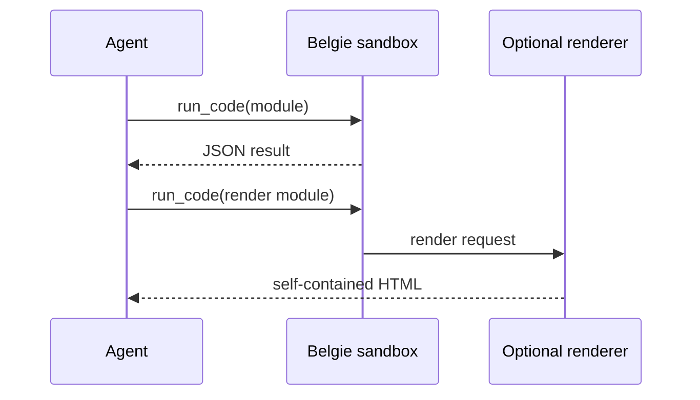

# AI agents

Belgie gives an agent one `run_code` tool for executing complete JavaScript, TypeScript, or TSX
modules in an embedded Deno runtime. The tool is available through the supported Pydantic AI and
LangChain integrations.

The model supplies module source, not a JavaScript fragment. Belgie executes the module, calls its
exported function, and returns that function's JSON-compatible value as the tool result.

## When to use `run_code`

Use `run_code` when the model needs an npm or JSR package, a browser-style JavaScript API, parallel
JavaScript requests, or a transformation that is clearer in TypeScript than in Python. The model
supplies a complete module rather than a fragment:

```typescript
export default async function run(value: string): Promise<string> {
  return value.trim().toUpperCase();
}
```

The returned value becomes the tool result. It must be JSON-serializable. Use Deno-style imports
such as `npm:pkg@version`, `jsr:@scope/pkg@version`, or a full URL.

## Agent lifecycle

Each agent invocation creates a `BelgieRuntimeSession`, executes scripts in a restricted runtime,
and closes the session when the invocation finishes. A script that imports `npm:@belgie/render`
requests a separate host-mediated render pass; the model-visible script runtime does not receive the
renderer's broader Vite permissions.



The session is temporary by default. Passing an `Environment` supplies a workspace and dependency
set for the invocation. Passing a caller-owned `runtime` reuses that runtime, but Belgie cannot
mediate inline rendering through a custom runtime.

## Sandbox boundaries

The default agent session is intentionally narrower than a general-purpose Deno runtime:

- Network access is disabled unless the integration's runtime configuration allows it.
- Script reads are limited to the session workspace.
- Host `/etc` and `/proc`, system calls, and FFI are not exposed to model-authored scripts.
- Return values cross the Python/framework boundary as JSON-compatible values.
- External agent tools are not directly available inside the JavaScript sandbox.

!!! warning "Not a host isolation guarantee"
    Permissions define what the embedded runtime can access, but your application still controls
    which code and dependencies it supplies. Do not grant broad permissions to untrusted code
    without reviewing the resulting boundary.

The default permissions are an execution boundary for model-authored scripts, not a replacement for
application-level review of prompts, dependencies, or host integrations.

## Configure the session

`BelgieCapability` and `BelgieMiddleware` share these options; identifier names follow each framework:

| Option | Default | Purpose |
| --- | --- | --- |
| `max_retries` | `3` | Retry invalid `run_code` calls through the framework. |
| `timeout` | `None` | Cancel a script after the given number of seconds. |
| `instructions` | `None` | Append guidance to the built-in `run_code` instructions. |
| `dangerously_replace_instructions` | `None` | Replace the built-in instructions completely. |
| `runtime` | `None` | Reuse a caller-owned `Runtime`. |
| `environment` | `None` | Use a caller-owned or newly-created `Environment`. |
| `runtime_options` | `None` | Configure the session-created runtime. |
| `defer_loading` | `False` | Expose `load_belgie` first and make `run_code` available after loading. |
| `id` (Pydantic AI) | `None` | Stable Pydantic AI identifier used for deferred loading; Belgie defaults it to `belgie`. |
| `capability_id` (LangChain) | `None` | Stable Belgie identifier used for deferred loading; Belgie defaults it to `belgie`. |

`runtime` cannot be combined with `environment` or `runtime_options`. The two instruction options
are mutually exclusive.

Use `instructions` to append application-specific guidance while retaining Belgie's module and
sandbox contract. Use `dangerously_replace_instructions` only when the application reproduces the
parts of that contract the model still needs.

## Synchronous and asynchronous agents

The Pydantic AI integration supports synchronous and asynchronous agent runs. LangChain supports
`invoke()` and `ainvoke()`. The Belgie session follows the surrounding framework lifecycle, so close
or await the agent run before disposing of a caller-owned environment or runtime.

## Inline React widgets

An agent can return a self-contained HTML document by returning `render(...)` from a TSX module:

```tsx
import { render } from "npm:@belgie/render";

function Widget() {
  return <main>Hello from Belgie</main>;
}

export default function run() {
  return render({ widget: <Widget />, plugins: [] });
}
```

See [@belgie/render](../packages/render.md) for the static-analysis and renderer constraints.

This inline renderer is separate from [path-based MCP Apps](../mcp-apps.md). Use MCP Apps when the
widget is part of a Python server project; use `render(...)` when an agent should return one HTML
document as its ordinary tool result.

!!! warning "Renderer plugins are privileged"
    A nonempty `plugins` value is evaluated again in the host-mediated renderer. Plugin factories,
    hooks, and their imports run with the renderer's broader permissions. Treat them as reviewed
    application code and use `plugins: []` for untrusted agent-authored widgets.

## Choose an integration

- Use [Pydantic AI](pydantic-ai.md) when your agent is built with Pydantic AI capabilities.
- Use [LangChain](langchain.md) when your agent uses LangChain middleware.
- Use [Runtime](../runtime.md) directly when no agent framework is involved.

## See also

- [Script](../script.md)
- [Environment](../environment.md)
- [@belgie/render](../packages/render.md)
- [Troubleshooting](../troubleshooting.md)
