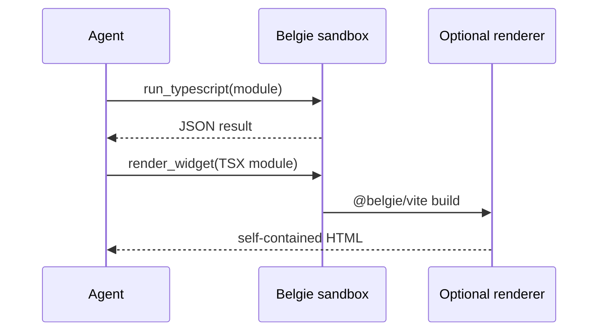

# AI agents

Give an AI agent one sandbox tool for running complete JavaScript, TypeScript, or TSX modules inside
your Python application. Belgie executes the modules in an embedded Deno runtime. Pydantic AI
exposes `run_typescript`; LangChain exposes `run_code`. When rendering is enabled, both expose
`render_widget` for inline React widgets.

The model supplies a complete module, not a JavaScript fragment. Belgie executes the module, calls
its exported function, and returns the function's JSON-compatible value as the framework tool result.

## When to use the JavaScript sandbox

Use the sandbox when the model needs a browser-style JavaScript API, parallel JavaScript work, or a
transformation that is clearer in TypeScript than in Python:

```typescript
export default function run(): string {
  return "hello-world".toUpperCase();
}
```

Use Deno-style imports such as `npm:pkg@version`, `jsr:@scope/pkg@version`, or a full URL when the
selected integration explicitly enables package or network access.

## Session lifecycle

Each agent run receives a temporary, restricted session. Pydantic AI starts its runtime lazily on the
first `run_typescript` call. Separate or concurrent runs receive separate workers and workspaces.
Caller-owned `BelgieSandboxSession` objects can be reused across runs when shared runtime state is
intentional.



## LangChain lifecycle

`BelgieMiddleware` exposes `run_code` and uses the same environment, runtime, and permission options.
See [LangChain](langchain.md) for framework-specific setup.

## Sandbox boundaries

The default Pydantic AI sandbox intentionally denies:

- network access, package downloads, and host module imports;
- host files, environment variables, subprocesses, writes, FFI, and system information;
- non-JSON return values.

Rendering uses a separate renderer runtime with the workspace permissions required by Vite. Use an
empty `plugins` list for untrusted agent-authored widgets because renderer plugin factories and hooks
run in that privileged side channel.

Belgie's permissions are an embedded-runtime boundary, not a replacement for an OS- or cloud-isolated sandbox when
untrusted code requires a separate kernel, filesystem, or network namespace.

## Choose an integration

- Choose [Pydantic AI](pydantic-ai.md) for `BelgieSandbox` and `run_typescript`.
- Choose [LangChain](langchain.md) for `BelgieMiddleware` and `run_code`.
- Use [Runtime](../runtime.md) directly when no agent framework is involved.

## Inline React widgets

Both integrations can return a self-contained HTML document through the `render_widget` tool. Pass a
default-export TSX module — do not call `render()`:

```tsx
export default function Widget() {
  return <main>Hello from Belgie</main>;
}
```

Enable rendering on the sandbox or middleware (`enable_rendering=True`) and optionally pass Vite
plugin specifiers via `plugins=[...]`. See [@belgie/vite](../packages/vite.md) for the renderer
contract and the contrast with path-based MCP widgets.

## See also

- [Script](../script.md)
- [Environment](../environment.md)
- [@belgie/vite](../packages/vite.md)
- [Troubleshooting](../troubleshooting.md)
