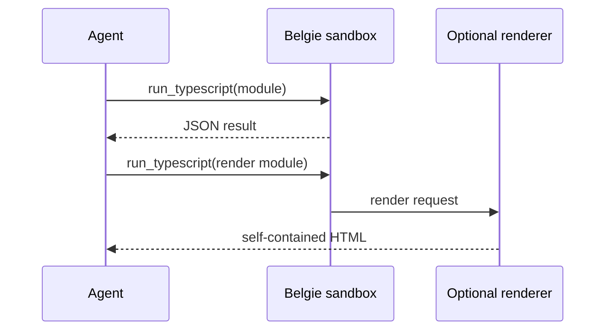

# AI agents

Belgie lets agents execute complete JavaScript, TypeScript, or TSX modules in an embedded Deno runtime. The
Pydantic AI integration exposes `run_typescript`; the LangChain integration exposes `run_code`.

The model supplies module source, not a JavaScript fragment. Belgie executes the module, calls its exported function,
and returns that function's JSON-compatible value as the framework tool result.

## When to use the JavaScript sandbox

Use the sandbox when the model needs an npm or JSR package, a browser-style JavaScript API, parallel JavaScript
requests, or a transformation that is clearer in TypeScript than in Python:

```typescript
export default function run(value: string): string {
  return value.trim().toUpperCase();
}
```

Use Deno-style imports such as `npm:pkg@version`, `jsr:@scope/pkg@version`, or a full URL only when the selected
integration explicitly enables package or network access.

## Pydantic AI lifecycle

`BelgieSandbox` creates a temporary, restricted session for each agent run. The runtime starts lazily on the first
`run_typescript` call, and separate or concurrent runs receive separate workers and workspaces. Caller-owned
`BelgieSandboxSession` objects can be reused across runs when shared runtime state is intentional.



## LangChain lifecycle

`BelgieMiddleware` retains the `run_code` API and its existing environment, runtime, and permission configuration.
Use [LangChain](langchain.md) for framework-specific setup.

## Sandbox boundaries

The default Pydantic AI sandbox intentionally denies:

- network access, package downloads, and host module imports;
- host files, environment variables, subprocesses, writes, FFI, and system information;
- non-JSON return values.

Rendering uses a separate renderer runtime with the workspace permissions required by Vite. Use `plugins: []` for
untrusted agent-authored widgets because renderer plugin factories and hooks run in that privileged side channel.

Belgie's permissions are an embedded-runtime boundary, not a replacement for an OS- or cloud-isolated sandbox when
untrusted code requires a separate kernel, filesystem, or network namespace.

## Choose an integration

- Use [Pydantic AI](pydantic-ai.md) for `BelgieSandbox` and `run_typescript`.
- Use [LangChain](langchain.md) for `BelgieMiddleware` and `run_code`.
- Use [Runtime](../runtime.md) directly when no agent framework is involved.

## Inline React widgets

Both integrations can return a self-contained HTML document by returning `render(...)` from a TSX module:

```tsx
import { render } from "npm:@belgie/render";

function Widget() {
  return <main>Hello from Belgie</main>;
}

export default function run() {
  return render({ widget: <Widget />, plugins: [] });
}
```

See [@belgie/render](../packages/render.md) for the renderer constraints.

## See also

- [Script](../script.md)
- [Environment](../environment.md)
- [@belgie/render](../packages/render.md)
- [Troubleshooting](../troubleshooting.md)
